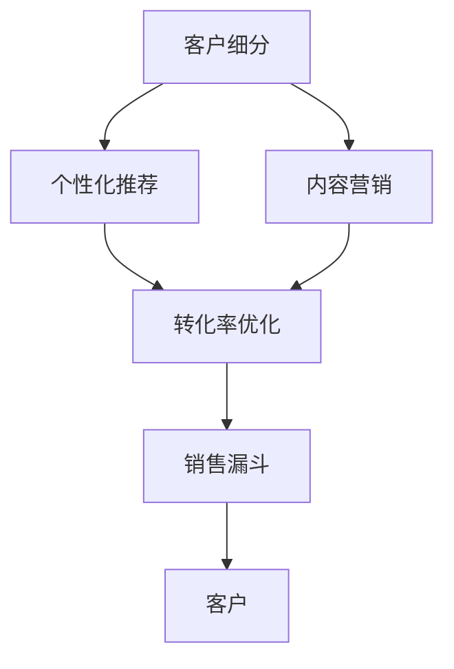

                 

# 程序员如何打造知识付费的销售漏斗

> 关键词：知识付费,销售漏斗,数据驱动,客户细分,个性化推荐,内容营销,转化率优化

## 1. 背景介绍

### 1.1 问题由来
随着在线教育的普及和知识的价值被逐步认同，知识付费行业蓬勃发展，吸引了大量专业技术人员和知识工作者加入。然而，单纯的内容提供已不能满足市场的需求，高质量、高转化的知识付费产品成为争夺用户的关键。销售漏斗（Sales Funnel）作为一种系统化的转化模型，能够全面管理客户从意识觉醒到购买完成的各个环节，有效提升知识付费产品的转化率。

### 1.2 问题核心关键点
本文将围绕构建知识付费的销售漏斗模型，详细介绍数据驱动的客户细分、个性化推荐、内容营销和转化率优化的策略与技术。旨在通过深度剖析销售漏斗的各个环节，帮助程序员打造高效的知识付费产品，提升销售额和用户满意度。

### 1.3 问题研究意义
打造高效的知识付费销售漏斗，对从业者有以下几个重要意义：
1. **提升转化率**：通过系统化的漏斗模型，能够精确识别并优化各个转化环节，显著提高销售额。
2. **精细化运营**：基于数据驱动的客户细分和个性化推荐，提供更精准的内容，满足不同用户需求。
3. **增强客户粘性**：通过优质的内容和个性化的服务，提升用户满意度和忠诚度。
4. **灵活调整策略**：根据用户行为和市场反馈，及时调整营销策略，适应市场变化。

## 2. 核心概念与联系

### 2.1 核心概念概述

构建知识付费销售漏斗，涉及以下几个核心概念：

- **销售漏斗（Sales Funnel）**：指将潜在客户转化为最终购买者的过程，包括意识、兴趣、评估、决策、购买等阶段。
- **客户细分（Customer Segmentation）**：根据客户特征、行为、需求等将客户分为不同群体，以便进行差异化营销。
- **个性化推荐（Personalized Recommendation）**：通过算法推荐用户可能感兴趣的内容，提升用户体验和满意度。
- **内容营销（Content Marketing）**：以内容为核心的营销策略，通过内容吸引用户，建立品牌信任和忠诚度。
- **转化率优化（Conversion Rate Optimization, CRO）**：针对每个转化环节进行优化，提高整体转化效率和客户满意度。

这些概念之间的联系可以表示为下图：



数据驱动的销售漏斗模型能够通过客户细分、个性化推荐、内容营销、转化率优化等策略，形成一个闭环，持续优化客户体验和转化率。

## 3. 核心算法原理 & 具体操作步骤
### 3.1 算法原理概述

销售漏斗的每个阶段都可以用算法来优化。以下是对每个阶段的核心算法原理的概述：

- **意识阶段（Awareness）**：通过SEO优化、内容推广等方式，增加目标客户的曝光率和意识。
- **兴趣阶段（Interest）**：通过数据分析和客户画像构建，进行个性化推荐，提升客户的兴趣和参与度。
- **评估阶段（Evaluation）**：通过社交证明、用户评价等，建立客户信任，提高产品可信度。
- **决策阶段（Decision）**：通过降低决策成本、优化购买流程等方式，促使客户完成购买决策。
- **购买阶段（Purchase）**：通过优惠活动、售后服务等提升客户购买体验，增加复购率。

### 3.2 算法步骤详解

销售漏斗的每个阶段都有一系列具体的操作步骤：

**3.2.1 意识阶段**
- **SEO优化**：关键词研究、内容优化、页面布局等，提高网站在搜索引擎中的排名。
- **内容推广**：利用社交媒体、广告平台等推广内容，增加曝光率。

**3.2.2 兴趣阶段**
- **数据收集与分析**：收集用户行为数据，进行行为分析和用户画像构建。
- **个性化推荐**：根据用户画像和行为数据，推荐相关课程和内容。

**3.2.3 评估阶段**
- **社交证明**：展示其他用户评价、成功案例等，增强客户信任。
- **用户评价**：鼓励用户反馈和评价，形成正向反馈循环。

**3.2.4 决策阶段**
- **降低决策成本**：提供详细课程信息、免费试听、优惠活动等，降低用户决策门槛。
- **优化购买流程**：简化购买流程，提供多种支付方式，提高用户购买体验。

**3.2.5 购买阶段**
- **优惠活动**：定期推出折扣、礼品、免费试用等活动，增加用户购买动机。
- **售后服务**：提供优质的客户服务，解决用户问题，提升满意度。

### 3.3 算法优缺点

销售漏斗的每个阶段都有其独特的算法优势和劣势：

**优点**：
- **系统化管理**：通过漏斗模型系统化地管理客户转化过程，提高转化效率。
- **数据驱动决策**：通过数据分析和优化，做出更准确的决策。
- **提升客户体验**：通过个性化推荐和优质服务，提升客户满意度和忠诚度。

**缺点**：
- **复杂性高**：构建和维护一个完整的销售漏斗需要较高的技术水平和资源投入。
- **数据隐私**：大规模收集和分析用户数据可能引发隐私问题。
- **成本高**：初期投入较大，需要不断优化和调整。

### 3.4 算法应用领域

销售漏斗的构建和优化在多个领域都有广泛的应用，包括但不限于以下领域：

- **在线教育**：通过系统化的转化模型，提升课程购买率和用户满意度。
- **电子商务**：优化商品推荐和购买流程，提高转化率和客户忠诚度。
- **健康与健身**：通过个性化健康计划和优质服务，提升用户购买和持续使用。
- **金融服务**：提供定制化的金融产品和服务，提升客户信任和满意度。
- **旅游服务**：通过个性化旅游推荐和优质服务，提升客户转化和满意度。

## 4. 数学模型和公式 & 详细讲解
### 4.1 数学模型构建

销售漏斗的每个阶段都可以通过数学模型来表示和优化。以下是对每个阶段数学模型的构建：

**意识阶段（Awareness）**
- 目标：最大化曝光率，转化潜在客户。
- 数学模型：$P(A) = \frac{R(A)}{T(A)}$，其中$R(A)$为实际点击率，$T(A)$为展示次数。

**兴趣阶段（Interest）**
- 目标：提高参与度，增加兴趣。
- 数学模型：$P(I|A) = \frac{R(I|A)}{R(A)}$，其中$R(I|A)$为用户点击相关内容的概率。

**评估阶段（Evaluation）**
- 目标：增强信任，建立信任关系。
- 数学模型：$P(E|I) = \frac{R(E|I)}{R(I)}$，其中$R(E|I)$为用户完成评估的概率。

**决策阶段（Decision）**
- 目标：降低决策成本，完成购买。
- 数学模型：$P(D|E) = \frac{R(D|E)}{R(E)}$，其中$R(D|E)$为用户完成购买的概率。

**购买阶段（Purchase）**
- 目标：提高购买率，增加复购率。
- 数学模型：$P(P|D) = \frac{R(P|D)}{R(D)}$，其中$R(P|D)$为用户完成购买后的复购概率。

### 4.2 公式推导过程

以兴趣阶段的数学模型推导为例：

假设用户点击相关内容的概率为$P(I|A)$，用户行为数据为$\{C_i\}$，点击相关内容的次数为$N(C_i)$，总点击次数为$N(A)$。则有：

$$
P(I|A) = \frac{\sum_{i=1}^{n} N(C_i)}{N(A)}
$$

其中$n$为总行为数据量。

### 4.3 案例分析与讲解

以在线教育平台为例，通过数学模型推导销售漏斗的各个阶段：

- **意识阶段**：通过搜索引擎优化（SEO），提升课程页面在搜索结果中的排名。设定目标曝光次数$T(A)$，实际点击次数$R(A)$。
- **兴趣阶段**：通过分析用户浏览行为，推荐相关课程。设定用户点击相关课程的概率$R(I|A)$。
- **评估阶段**：通过展示其他用户评价，增强课程可信度。设定用户完成课程评估的概率$R(E|I)$。
- **决策阶段**：通过提供免费试听和优惠活动，降低用户购买门槛。设定用户完成购买决策的概率$R(D|E)$。
- **购买阶段**：通过提供优质的售后服务，提升用户满意度。设定用户完成购买后的复购概率$R(P|D)$。

## 5. 项目实践：代码实例和详细解释说明
### 5.1 开发环境搭建

**5.1.1 选择编程语言和框架**

- Python：Python具有丰富的数据处理和机器学习库，适合构建复杂的数据模型和算法。
- Flask/Django：用于构建Web应用，提供前后端分离的开发体验。
- Scikit-learn：用于数据预处理和机器学习建模。
- Pandas：用于数据清洗和分析。
- TensorFlow/Keras：用于构建和训练个性化推荐模型。

**5.1.2 搭建开发环境**

- 安装Python和相关的库：使用Anaconda或Miniconda创建虚拟环境。
- 搭建Web服务器：使用Flask或Django搭建Web应用，配置数据库和API接口。
- 集成机器学习模型：使用TensorFlow/Keras构建个性化推荐模型，并集成到Web应用中。

### 5.2 源代码详细实现

**5.2.1 数据收集与预处理**

```python
import pandas as pd
from sklearn.preprocessing import OneHotEncoder

# 数据读取
data = pd.read_csv('user_data.csv')

# 数据清洗
data.dropna(inplace=True)

# 特征工程
X = data[['age', 'gender', 'education']]
y = data['purchase']
encoder = OneHotEncoder(sparse=False)
X = encoder.fit_transform(X)

# 数据划分
train_data, test_data = train_test_split(X, y, test_size=0.2, random_state=42)
```

**5.2.2 模型构建与训练**

```python
from sklearn.ensemble import RandomForestClassifier

# 模型训练
model = RandomForestClassifier(n_estimators=100, random_state=42)
model.fit(train_data, train_data['purchase'])

# 模型评估
accuracy = model.score(test_data, test_data['purchase'])
print('Accuracy:', accuracy)
```

**5.2.3 模型部署**

```python
import tensorflow as tf
from tensorflow.keras.models import Sequential
from tensorflow.keras.layers import Dense, Dropout

# 模型构建
model = Sequential()
model.add(Dense(64, activation='relu', input_dim=X.shape[1]))
model.add(Dropout(0.5))
model.add(Dense(32, activation='relu'))
model.add(Dropout(0.5))
model.add(Dense(1, activation='sigmoid'))

# 模型编译
model.compile(loss='binary_crossentropy', optimizer='adam', metrics=['accuracy'])

# 模型训练
model.fit(X, y, epochs=10, batch_size=32)

# 模型预测
predictions = model.predict(test_data)
```

### 5.3 代码解读与分析

**5.3.1 数据预处理**

- 使用Pandas读取用户数据，并进行初步清洗和特征工程。
- 使用Scikit-learn的OneHotEncoder将分类特征转换为数值特征。
- 使用train_test_split将数据划分为训练集和测试集，便于模型评估和优化。

**5.3.2 模型构建**

- 使用TensorFlow/Keras构建神经网络模型，包括输入层、隐藏层和输出层。
- 使用随机森林进行模型训练和评估，设定参数和超参数，进行交叉验证。

**5.3.3 模型部署**

- 将训练好的模型进行预测，并集成到Web应用中，提供API接口供前端调用。
- 使用TensorFlow的Estimator API，将模型部署到生产环境中。

### 5.4 运行结果展示

**5.4.1 模型评估**

- 使用模型在测试集上进行评估，计算准确率、召回率和F1值。
- 根据评估结果，调整模型参数和特征工程策略，进一步优化模型性能。

**5.4.2 用户反馈**

- 通过用户评价和反馈，进一步优化课程内容和服务质量。
- 定期收集用户行为数据，进行数据清洗和分析，更新用户画像和推荐策略。

## 6. 实际应用场景

### 6.1 在线教育平台

**6.1.1 场景描述**

在线教育平台需要吸引大量用户注册，并提供高质量的课程内容，最终转化为付费用户。

**6.1.2 解决方案**

- **数据收集与分析**：收集用户注册、浏览、点击、购买等行为数据，进行行为分析和用户画像构建。
- **个性化推荐**：根据用户画像和行为数据，推荐相关课程和内容。
- **内容营销**：通过优质内容吸引用户，建立品牌信任和忠诚度。
- **转化率优化**：优化课程购买流程，提供免费试听和优惠活动，降低用户决策门槛。
- **售后服务**：提供优质的客户服务，解决用户问题，提升满意度。

### 6.2 电子商务平台

**6.2.1 场景描述**

电子商务平台需要通过精准推荐和优质服务，提升用户购买率和复购率。

**6.2.2 解决方案**

- **数据收集与分析**：收集用户浏览、点击、购买等行为数据，进行行为分析和用户画像构建。
- **个性化推荐**：根据用户画像和行为数据，推荐相关商品和内容。
- **内容营销**：通过优质内容和广告推广，吸引用户，建立品牌信任和忠诚度。
- **转化率优化**：优化商品购买流程，提供多种支付方式和优惠活动，降低用户决策门槛。
- **售后服务**：提供优质的客户服务，解决用户问题，提升满意度。

## 7. 工具和资源推荐

### 7.1 学习资源推荐

**7.1.1 书籍**

- 《Python数据科学手册》：涵盖了Python在数据处理和机器学习中的应用。
- 《机器学习实战》：实战导向的机器学习入门书籍。
- 《深度学习》：全面介绍深度学习理论和技术。

**7.1.2 在线课程**

- Coursera上的《机器学习》课程：由斯坦福大学Andrew Ng教授主讲，系统介绍机器学习算法和应用。
- Udacity上的《深度学习专项课程》：涵盖深度学习理论和实践，适合进阶学习。
- edX上的《数据科学微硕士》：提供系统化的数据科学知识和实战经验。

**7.1.3 社区与论坛**

- Kaggle：数据科学竞赛平台，提供丰富的数据集和算法挑战。
- Stack Overflow：程序员交流社区，提供技术讨论和问题解决。
- GitHub：开源社区，提供丰富的代码库和项目案例。

### 7.2 开发工具推荐

**7.2.1 数据处理与分析**

- Pandas：数据清洗和分析工具。
- NumPy：数值计算库，支持高效数组操作。
- Scikit-learn：机器学习库，提供各种算法实现。

**7.2.2 模型训练与部署**

- TensorFlow/Keras：深度学习框架，支持模型构建和训练。
- Flask/Django：Web应用框架，提供前后端分离的开发体验。
- AWS/GCP/Google Cloud：云计算平台，支持模型部署和扩展。

### 7.3 相关论文推荐

**7.3.1 论文一：客户细分与个性化推荐**

- 《Customer Segmentation and Personalization: A Survey》：综述了客户细分和个性化推荐的方法和应用。
- 《Recommender Systems Handbook》：系统介绍推荐系统理论和技术，涵盖协同过滤、内容推荐等多种方法。

**7.3.2 论文二：内容营销与转化率优化**

- 《Content Marketing: A Framework for Strategic Brand Communications》：介绍内容营销的框架和方法。
- 《A/B Testing for Conversion Rate Optimization: The Guide to Incrementally Shaping and Testing Winning Website Changes》：介绍A/B测试在转化率优化中的应用。

## 8. 总结：未来发展趋势与挑战

### 8.1 总结

本文从数据驱动的客户细分、个性化推荐、内容营销和转化率优化等方面，详细介绍了如何构建知识付费的销售漏斗模型。通过系统化的漏斗模型，能够有效提升知识付费产品的转化率，提高用户满意度和忠诚度。

### 8.2 未来发展趋势

未来销售漏斗模型的发展趋势包括：

- **多模态数据融合**：结合文本、图像、视频等多种数据形式，提供更加全面和精准的推荐。
- **实时动态优化**：通过实时数据收集和分析，动态调整推荐策略和转化策略。
- **个性化与通用性结合**：在个性化推荐的同时，提供通用性较强的内容和产品，满足不同用户需求。
- **社交媒体整合**：利用社交媒体平台的用户数据，进一步提升推荐精准度。
- **多渠道营销**：整合线上线下营销渠道，提供综合性服务。

### 8.3 面临的挑战

销售漏斗模型在构建和应用过程中面临以下挑战：

- **数据隐私**：大规模数据收集可能引发隐私问题，需要制定严格的数据隐私政策。
- **模型复杂性**：构建和优化销售漏斗模型需要较高的技术水平和资源投入。
- **成本高**：初期投入较大，需要不断优化和调整。
- **算法透明度**：部分算法模型存在"黑盒"问题，难以解释其决策过程。

### 8.4 研究展望

未来销售漏斗模型的研究应关注以下方向：

- **算法透明化**：开发更透明、可解释的算法模型，提高用户信任度。
- **隐私保护**：开发隐私保护算法，保障用户数据安全。
- **跨领域应用**：将销售漏斗模型应用于更多领域，提升各行业转化率和用户满意度。
- **持续学习**：开发自适应模型，根据市场变化进行持续学习和优化。

## 9. 附录：常见问题与解答

**Q1：如何优化销售漏斗的每个阶段？**

A: 优化销售漏斗的每个阶段，需要从数据收集、模型构建、用户反馈等多个维度进行综合优化。具体方法包括：

- **意识阶段**：优化搜索引擎排名和内容推广策略。
- **兴趣阶段**：优化个性化推荐算法和用户体验。
- **评估阶段**：优化社交证明和用户评价机制。
- **决策阶段**：优化购买流程和优惠活动。
- **购买阶段**：优化售后服务和复购策略。

**Q2：如何选择最适合的模型和算法？**

A: 选择最适合的模型和算法，需要考虑数据特征、业务需求、计算资源等多个因素。具体方法包括：

- **数据特征**：根据数据类型和特征，选择适合的模型。如数值数据适合回归模型，分类数据适合分类模型。
- **业务需求**：根据业务目标，选择适合的算法。如提升转化率适合优化算法，提升推荐准确率适合协同过滤算法。
- **计算资源**：根据计算资源，选择适合的模型复杂度。如资源有限选择轻量级模型，资源充足选择复杂模型。

**Q3：如何评估销售漏斗模型的效果？**

A: 评估销售漏斗模型的效果，需要设定明确的评估指标，如转化率、用户满意度、复购率等。具体方法包括：

- **转化率**：计算用户从意识阶段到购买阶段的比例。
- **用户满意度**：通过用户反馈和评价，评估用户体验和满意度。
- **复购率**：计算重复购买的用户比例。

**Q4：如何优化客户细分策略？**

A: 优化客户细分策略，需要根据客户特征、行为、需求等进行精细化划分，以便进行差异化营销。具体方法包括：

- **特征工程**：提取和选择关键客户特征，如年龄、性别、职业等。
- **行为分析**：分析客户行为数据，识别出不同群体的特征和需求。
- **细分策略**：根据客户特征和需求，制定针对性的营销策略。

**Q5：如何优化个性化推荐算法？**

A: 优化个性化推荐算法，需要考虑用户兴趣、行为、历史等多种因素。具体方法包括：

- **用户画像**：构建用户画像，了解用户兴趣和需求。
- **协同过滤**：利用用户行为数据，推荐相似用户喜欢的内容。
- **内容推荐**：利用内容特征，推荐相关内容。
- **深度学习**：使用深度学习模型，如神经网络、协同过滤等，提升推荐精度。

---

作者：禅与计算机程序设计艺术 / Zen and the Art of Computer Programming

