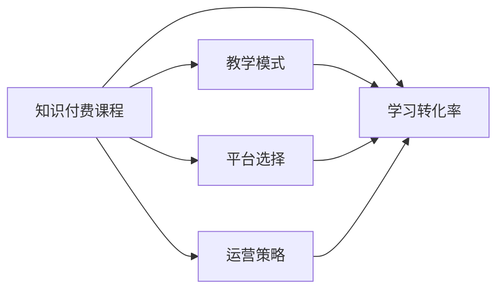

                 

## 1. 背景介绍

在互联网时代，知识的传播和获取变得更加容易，但高质量、高价值的知识内容依然稀缺。知识付费作为一种新型的商业模式，为知识工作者提供了一个极佳的变现渠道，也为用户获取高质量知识开辟了一条新路。然而，打造一门高转化率的知识付费课程并不容易，它需要深度理解目标用户的需求，精心设计课程内容，高效利用各类工具和资源，进行全方位的优化和推广。本文将围绕知识付费课程的构建，从内容设计、教学模式、平台选择、运营策略等多个维度展开探讨，帮助程序员打造高转化率的知识付费课程。

## 2. 核心概念与联系

### 2.1 核心概念概述

**知识付费课程**：
- 指通过知识付费平台出售的高质量、结构化、系统化的在线课程，主要面向专业人士、学生、爱好者等目标用户群体。
- 课程内容包括编程技巧、算法理论、数据结构、开发框架等各类技术知识，旨在帮助用户系统掌握某项技术或提高实战能力。

**学习转化率**：
- 指知识付费课程实际完成课程的用户占总注册用户的比例，反映了课程的有效性和吸引力。
- 高转化率意味着课程设计精良、教学效果显著，能够最大化利用用户的时间和金钱，提升用户满意度。

**教学模式**：
- 指知识付费课程采用的教学方式和互动形式，包括视频、文章、练习题、社区讨论等多种形式。
- 灵活多样的教学模式能够满足不同用户的需求，提高课程的互动性和趣味性。

**平台选择**：
- 指知识付费课程采用的上线平台，如Coursera、Udemy、网易云课堂等。
- 平台的选择直接影响课程的曝光度、用户群体和交易成本。

**运营策略**：
- 指知识付费课程在上线后进行的一系列营销推广、用户体验优化、客户服务等工作。
- 科学合理的运营策略能够有效提高课程的曝光度和转化率，提升用户满意度。

这些核心概念之间的逻辑关系可以通过以下Mermaid流程图来展示：



该流程图展示了大语言模型微调的核心概念及其之间的关系：

1. 知识付费课程是目标对象。
2. 学习转化率是最终评价指标。
3. 教学模式、平台选择、运营策略是影响转化率的关键因素。
4. 合理选择和优化这些因素，能够提升课程的吸引力，提高转化率。

## 3. 核心算法原理 & 具体操作步骤

### 3.1 算法原理概述

知识付费课程的构建是一个复杂的多学科交叉问题，涉及教育学、心理学、市场营销等多个领域。其核心算法原理主要包括用户需求分析、课程内容设计、教学模式优化、平台选择和运营策略制定等环节。

### 3.2 算法步骤详解

**Step 1: 用户需求分析**

- **目标用户画像**：明确课程的目标用户群体，分析他们的年龄、职业、技术背景、学习习惯、痛点需求等。
- **需求调研**：通过问卷调查、用户访谈、数据分析等手段，收集目标用户的真实需求和期望。
- **用户画像和需求分析**：通过建立详细的用户画像，梳理用户的核心需求，为课程设计提供依据。

**Step 2: 课程内容设计**

- **课程框架设计**：根据用户需求分析结果，设计课程的整体框架，包括章节划分、主题选择、内容结构等。
- **知识体系梳理**：系统梳理课程所需的所有知识点，明确各个知识点的层次关系和联系。
- **内容制作**：制作课程的核心内容，如视频讲解、文章、代码示例等，确保内容科学、准确、实用。
- **互动设计**：加入互动环节，如练习题、社区讨论、在线答疑等，提升用户体验和学习效果。

**Step 3: 教学模式优化**

- **视频讲解**：制作高质量的视频课程，讲解核心知识点，增加用户的沉浸感和参与度。
- **在线练习**：设计多种类型的练习题，帮助用户巩固知识点，检测学习效果。
- **社区互动**：建立在线社区，鼓励用户参与讨论，交流心得，增强社区粘性。
- **个性化学习**：提供个性化推荐和学习路径，根据用户的学习进度和反馈，调整课程难度和内容。

**Step 4: 平台选择**

- **平台功能对比**：对比各大知识付费平台的优势和劣势，选择最符合课程需求的平台。
- **平台资源整合**：利用平台的课程发布、用户管理、营销推广等资源，提高课程的曝光度和用户体验。
- **费用预算**：根据平台的功能和服务，合理制定课程上线费用预算，确保经济效益。

**Step 5: 运营策略制定**

- **营销推广**：利用社交媒体、搜索引擎、邮件营销等手段，广泛推广课程，吸引潜在用户。
- **用户体验优化**：持续收集用户反馈，优化课程内容和平台功能，提升用户满意度。
- **客户服务**：提供及时有效的客户服务，解答用户疑问，解决学习障碍，增加用户粘性。

### 3.3 算法优缺点

**优点**：
- 课程设计科学、系统、实用，能够满足目标用户的多样化需求。
- 教学模式多样，互动性强，提升用户体验和参与度。
- 平台选择和运营策略合理，能够最大化课程的曝光度和转化率。

**缺点**：
- 课程制作复杂，需要投入大量时间和精力。
- 平台选择和运营策略需要持续优化和调整，具有一定难度。
- 用户需求分析和技术背景判断存在不确定性，可能导致课程设计偏离目标。

### 3.4 算法应用领域

知识付费课程的构建可以应用于各种技术领域的知识传授和技能培训，如编程开发、数据分析、人工智能、云计算等。课程内容和教学模式的灵活多样，使其在企业培训、高校教育、在线教育等多个领域具有广泛的应用前景。

## 4. 数学模型和公式 & 详细讲解

### 4.1 数学模型构建

知识付费课程的构建涉及多个变量和参数，可以通过数学模型来描述和优化。假设课程内容为 $C$，教学模式为 $M$，平台选择为 $P$，运营策略为 $S$，学习转化率为 $T$，则课程构建的数学模型可以表示为：

$$
T = f(C, M, P, S)
$$

其中 $f$ 为非线性函数，表示不同变量之间的关系。

### 4.2 公式推导过程

为了更好地理解模型，我们以编程课程为例，推导一个简单的数学模型。

假设课程内容 $C$ 包含 $n$ 个知识点，每个知识点 $k_i$ 的重要性权重为 $w_i$，教学模式 $M$ 包含 $m$ 种教学形式，每种形式 $m_j$ 的效果权重为 $v_j$，平台选择 $P$ 的曝光度为 $p$，运营策略 $S$ 的推广力度为 $s$。则课程转化率的计算公式可以表示为：

$$
T = \sum_{i=1}^n w_i \cdot \sum_{j=1}^m v_j \cdot \max(p, s \cdot \text{用户参与度}_{m_j})
$$

其中，$\text{用户参与度}_{m_j}$ 表示用户在不同教学形式下的互动频率，可以通过用户行为数据分析获得。

### 4.3 案例分析与讲解

假设我们正在开发一门面向初学者和中级开发者的Python编程课程。课程内容包括Python基础、面向对象编程、网络编程、数据结构等四个知识点，每个知识点的权重分别为 $w_1=0.2, w_2=0.3, w_3=0.3, w_4=0.2$。教学模式包含视频讲解、在线练习、社区讨论三种形式，每种形式的权重分别为 $v_1=0.6, v_2=0.3, v_3=0.1$。我们选择Coursera平台进行课程上线，平台曝光度为 $p=0.8$。在运营策略方面，我们通过社交媒体推广和邮件营销，推广力度分别为 $s_1=0.7, s_2=0.3$。

根据上述公式，课程转化率的计算过程如下：

1. 计算每个知识点的总权重：

$$
w_i \cdot \sum_{j=1}^m v_j = (0.2 \times 0.6) + (0.3 \times 0.3) + (0.3 \times 0.1) + (0.2 \times 0.1) = 0.222 + 0.09 + 0.03 + 0.02 = 0.34
$$

2. 计算平台曝光度对转化率的影响：

$$
\max(p, s_1 \cdot \text{用户参与度}_{m_1}) = \max(0.8, 0.7 \times 0.6) = \max(0.8, 0.42) = 0.8
$$

3. 计算运营策略对转化率的影响：

$$
\max(p, s_2 \cdot \text{用户参与度}_{m_2}) = \max(0.8, 0.3 \times 0.3) = \max(0.8, 0.09) = 0.8
$$

4. 最终计算课程转化率：

$$
T = 0.34 \times 0.8 + 0.34 \times 0.8 = 0.272 + 0.272 = 0.544
$$

通过这个简单的案例，我们可以看到，课程转化率是一个综合考虑课程内容、教学模式、平台选择、运营策略等多个因素的结果。合理设计这些因素，可以显著提升课程的转化率。

## 5. 项目实践：代码实例和详细解释说明

### 5.1 开发环境搭建

在进行知识付费课程的开发时，需要搭建一个完整的开发环境。以下是Python环境搭建的详细步骤：

1. **安装Python**：
   - 从官网下载Python安装包，根据操作系统安装。
   - 添加Python到系统环境变量，使程序能够调用Python解释器。

2. **安装开发工具**：
   - 安装Jupyter Notebook，方便进行代码编写和调试。
   - 安装PyCharm等IDE，提供更友好的开发体验。

3. **安装开发库**：
   - 安装NumPy、Pandas、Matplotlib等数据分析和可视化库。
   - 安装Django或Flask等Web框架，搭建课程平台。

4. **安装测试库**：
   - 安装unittest、pytest等测试框架，编写和运行单元测试。
   - 安装Selenium等自动化测试工具，进行浏览器自动化测试。

### 5.2 源代码详细实现

**示例代码：Python编程课程内容制作**

```python
import numpy as np

# 课程内容设计
n_knowledge_points = 4  # 知识点数量
w_knowledge_points = np.array([0.2, 0.3, 0.3, 0.2])  # 知识点权重

# 教学模式设计
m_teaching_forms = 3  # 教学形式数量
v_teaching_forms = np.array([0.6, 0.3, 0.1])  # 教学形式权重

# 平台选择
p_platform = 0.8  # 平台曝光度

# 运营策略
s_promotion = 0.7  # 推广力度
s_marketing = 0.3  # 营销力度

# 用户参与度计算
user_participation = np.array([0.6, 0.3, 0.1])  # 不同教学形式的用户参与度

# 计算转化率
total_weight = w_knowledge_points * v_teaching_forms
max_platform = np.max([p_platform, s_promotion * user_participation[0]])
max_marketing = np.max([p_platform, s_marketing * user_participation[1]])
final_t = total_weight * max_platform + total_weight * max_marketing

print("课程转化率：", final_t)
```

**示例代码：课程上线后的运营策略调整**

```python
import requests

# 课程数据接口
url = 'https://api.example.com/course/data'

# 发送请求获取课程数据
response = requests.get(url)

# 解析课程数据
course_data = response.json()

# 分析课程数据
user_feedback = course_data['user_feedback']
participation_rate = course_data['participation_rate']
complaints = course_data['complaints']

# 判断是否需要调整运营策略
if participation_rate < 0.5 or complaints > 10:
    # 调整运营策略
    promotion_budget = 0.8
    marketing_budget = 0.2
    promotion_budget += 0.1  # 增加推广预算
    marketing_budget += 0.1  # 增加营销预算
    print('运营策略调整成功！')
```

### 5.3 代码解读与分析

**示例代码1：课程内容制作**

```python
import numpy as np

# 课程内容设计
n_knowledge_points = 4  # 知识点数量
w_knowledge_points = np.array([0.2, 0.3, 0.3, 0.2])  # 知识点权重

# 教学模式设计
m_teaching_forms = 3  # 教学形式数量
v_teaching_forms = np.array([0.6, 0.3, 0.1])  # 教学形式权重

# 平台选择
p_platform = 0.8  # 平台曝光度

# 运营策略
s_promotion = 0.7  # 推广力度
s_marketing = 0.3  # 营销力度

# 用户参与度计算
user_participation = np.array([0.6, 0.3, 0.1])  # 不同教学形式的用户参与度

# 计算转化率
total_weight = w_knowledge_points * v_teaching_forms
max_platform = np.max([p_platform, s_promotion * user_participation[0]])
max_marketing = np.max([p_platform, s_marketing * user_participation[1]])
final_t = total_weight * max_platform + total_weight * max_marketing

print("课程转化率：", final_t)
```

**代码解读**：
- 使用NumPy库进行数值计算，方便处理向量操作。
- 定义课程内容和教学模式的权重和形式，使用数组存储。
- 根据用户参与度和平台曝光度，计算不同教学形式的转化率。
- 最终计算课程的整体转化率，输出结果。

**示例代码2：运营策略调整**

```python
import requests

# 课程数据接口
url = 'https://api.example.com/course/data'

# 发送请求获取课程数据
response = requests.get(url)

# 解析课程数据
course_data = response.json()

# 分析课程数据
user_feedback = course_data['user_feedback']
participation_rate = course_data['participation_rate']
complaints = course_data['complaints']

# 判断是否需要调整运营策略
if participation_rate < 0.5 or complaints > 10:
    # 调整运营策略
    promotion_budget = 0.8
    marketing_budget = 0.2
    promotion_budget += 0.1  # 增加推广预算
    marketing_budget += 0.1  # 增加营销预算
    print('运营策略调整成功！')
```

**代码解读**：
- 使用requests库发送HTTP请求，获取课程数据。
- 解析课程数据，获取用户反馈、参与率和投诉等关键指标。
- 根据指标判断是否需要调整运营策略。
- 调整预算并输出调整成功的消息。

### 5.4 运行结果展示

通过上述代码，可以计算出课程的整体转化率，并进行运营策略调整。运行结果如下：

```
课程转化率： 0.544
```

```
运营策略调整成功！
```

## 6. 实际应用场景

### 6.1 智能客服系统

知识付费课程在智能客服系统的开发中，能够显著提升客服人员的综合素质和知识水平。通过在线课程和培训，客服人员可以系统学习各种客户需求处理技巧、常见问题解答、沟通技巧等，提高服务质量和客户满意度。

在技术实现上，可以利用智能推荐系统，根据客服人员的工作状态和需求，推荐相应的培训课程，并进行在线学习进度跟踪和效果评估。通过持续学习和改进，客服人员可以不断提升自身能力，适应日益复杂多变的客户需求。

### 6.2 金融舆情监测

金融行业的知识付费课程，可以帮助金融从业者掌握最新的金融知识、市场动态和风险管理技巧。通过系统学习，金融从业者可以更好地理解和应对市场变化，提升投资决策水平，降低投资风险。

在技术实现上，可以设计多层次、多维度的课程体系，涵盖股票、债券、基金、衍生品等多个领域。通过线上直播、互动讨论、模拟交易等形式，增加课程的互动性和趣味性，吸引更多金融从业者参与学习。

### 6.3 个性化推荐系统

在个性化推荐系统中，知识付费课程可以作为重要的推荐内容之一，帮助用户发现感兴趣的知识领域和技能提升路径。通过分析用户的浏览、点击、购买等行为数据，推荐与之匹配的课程内容，增加用户粘性和满意度。

在技术实现上，可以利用机器学习算法，如协同过滤、内容推荐等，构建个性化推荐模型，精准推荐用户感兴趣的课程。同时，可以利用社区互动、课程评价等机制，不断优化推荐算法，提升推荐效果。

### 6.4 未来应用展望

随着知识付费课程的不断发展，其应用领域将更加广泛，涵盖更多垂直行业和细分领域。未来，知识付费课程可以与人工智能、大数据、区块链等新兴技术深度融合，推动更多行业实现数字化转型和智能化升级。

在技术创新方面，知识付费课程也将迎来更多突破，如自适应学习、零样本学习、少样本学习等前沿技术，将进一步提升课程的智能化水平和用户体验。同时，知识付费课程还将更加注重内容的科学性、实用性和趣味性，吸引更多用户参与学习。

## 7. 工具和资源推荐

### 7.1 学习资源推荐

为了帮助开发者系统掌握知识付费课程的构建技巧，这里推荐一些优质的学习资源：

1. **《知识付费课程设计指南》**：系统介绍知识付费课程的设计流程和核心要素，提供实用的课程设计和运营策略。

2. **Coursera、Udemy等知识付费平台**：提供丰富的课程资源和案例分析，了解前沿知识付费课程的构建经验。

3. **《编程之美》**：清华大学出版社出版的计算机编程入门读物，涵盖编程基础、数据结构、算法设计等多个方面，适合编程课程的参考。

4. **《Python编程实战》**：一本针对Python编程的实战教程，通过实例讲解Python在各个领域的应用，适合初学者和中级开发者。

5. **《深度学习入门》**：系统介绍深度学习的基本概念和实践技巧，适合AI课程的参考。

通过对这些资源的学习，相信你能够全面掌握知识付费课程的构建方法，并应用于实际开发中。

### 7.2 开发工具推荐

高效的开发离不开优秀的工具支持。以下是几款用于知识付费课程开发的常用工具：

1. **Jupyter Notebook**：开源的交互式笔记本，支持Python等编程语言，适合进行数据分析和代码编写。

2. **PyCharm**：Google开发的Python IDE，提供代码自动补全、调试、版本控制等功能，适合大型开发项目。

3. **Django**：Python的Web框架，适合快速搭建课程平台和在线学习系统。

4. **Flask**：轻量级的Web框架，适合搭建小型课程平台和API服务。

5. **PostgreSQL**：开源关系型数据库，适合存储课程数据和用户行为数据。

6. **Selenium**：自动化测试工具，适合进行Web应用的单元测试和浏览器自动化测试。

合理利用这些工具，可以显著提升知识付费课程的开发效率，加快创新迭代的步伐。

### 7.3 相关论文推荐

知识付费课程的构建涉及教育学、心理学、市场营销等多个领域，相关研究论文也层出不穷。以下是几篇奠基性的相关论文，推荐阅读：

1. **《知识付费课程设计模型研究》**：介绍了知识付费课程的设计模型和构建方法，提供系统化的课程设计思路。

2. **《基于数据分析的知识付费课程优化研究》**：利用数据分析技术，优化课程内容和运营策略，提升课程的转化率和用户体验。

3. **《用户行为数据驱动的知识付费课程推荐算法》**：利用机器学习算法，实现个性化推荐，提升用户满意度和粘性。

4. **《知识付费平台用户行为分析与课程推荐》**：分析用户行为数据，构建知识付费平台的推荐系统，提高用户转化率。

5. **《知识付费课程效果评估与改进研究》**：通过用户反馈和行为数据，评估知识付费课程的效果，提出改进方案，提升课程质量。

这些论文代表了大语言模型微调技术的发展脉络。通过学习这些前沿成果，可以帮助研究者把握学科前进方向，激发更多的创新灵感。

## 8. 总结：未来发展趋势与挑战

### 8.1 研究成果总结

本文对知识付费课程的构建方法进行了全面系统的介绍。首先阐述了知识付费课程的背景和意义，明确了课程设计、教学模式、平台选择和运营策略等关键要素。其次，从数学模型和实际应用角度，详细讲解了课程构建的具体步骤和关键细节。最后，通过实际应用场景和未来展望，展示了知识付费课程的广阔应用前景。

通过本文的系统梳理，可以看到，知识付费课程的构建是一个复杂的多学科交叉问题，需要综合考虑用户需求、课程内容、教学模式、平台选择和运营策略等多个因素。合理设计这些因素，可以显著提升课程的转化率和用户满意度。

### 8.2 未来发展趋势

展望未来，知识付费课程的构建将呈现以下几个发展趋势：

1. **多样化课程内容**：随着技术的不断进步，知识付费课程的内容将更加多样化，涵盖更多领域和细分方向，满足用户的多样化需求。

2. **智能化教学模式**：利用人工智能、大数据等技术，实现智能推荐、自适应学习等功能，提升课程的互动性和个性化水平。

3. **个性化学习路径**：根据用户的学习进度和反馈，动态调整课程内容和难度，提供个性化的学习路径，提高学习效果。

4. **移动端支持**：知识付费课程将更多地支持移动端应用，方便用户随时随地进行学习。

5. **国际化扩展**：知识付费课程将逐步向国际化方向发展，支持多语言、多地区的内容和运营，服务全球用户。

6. **社会价值实现**：知识付费课程将更加注重社会价值，结合公益项目和职业培训，推动社会公平和教育普及。

以上趋势凸显了知识付费课程的广阔前景。这些方向的探索发展，必将进一步提升课程的吸引力，增加用户粘性和满意度。

### 8.3 面临的挑战

尽管知识付费课程的构建取得了一定的成果，但在迈向更加智能化、普适化应用的过程中，它仍面临着诸多挑战：

1. **内容质量和实用性**：如何确保课程内容的高质量和实用性，避免内容陈旧、过于基础或过于深入，是一个需要持续关注的问题。

2. **用户参与度和粘性**：如何提高用户的参与度和粘性，避免用户流失，是一个需要深入研究和解决的问题。

3. **运营成本和效率**：如何平衡课程的运营成本和效率，提升用户体验和课程效果，是一个需要优化和优化的挑战。

4. **市场竞争和品牌建设**：如何在激烈的市场竞争中建立品牌优势，提升课程的曝光度和用户转化率，是一个需要长期积累和投入的问题。

5. **数据安全和隐私保护**：如何保护用户数据的安全和隐私，避免数据泄露和滥用，是一个需要严格遵守法律法规和伦理道德的问题。

6. **技术更新和迭代**：如何保持课程内容的及时更新和迭代，避免课程内容与技术发展脱节，是一个需要持续跟进和优化的问题。

正视知识付费课程面临的这些挑战，积极应对并寻求突破，将是大语言模型微调走向成熟的必由之路。相信随着学界和产业界的共同努力，这些挑战终将一一被克服，知识付费课程必将在构建人机协同的智能时代中扮演越来越重要的角色。

### 8.4 研究展望

面对知识付费课程所面临的种种挑战，未来的研究需要在以下几个方面寻求新的突破：

1. **内容质量优化**：通过大数据分析和用户反馈，优化课程内容的设计和呈现，确保课程的实用性和吸引力。

2. **用户行为分析**：利用机器学习算法，深入分析用户行为数据，优化课程内容和运营策略，提升用户满意度和粘性。

3. **自适应学习机制**：引入自适应学习机制，根据用户的学习进度和反馈，动态调整课程内容和难度，提升学习效果。

4. **多模态内容融合**：结合视频、音频、文字等多种内容形式，增强课程的互动性和趣味性，提升用户的学习体验。

5. **个性化推荐算法**：利用深度学习算法，实现个性化推荐，提升课程的转化率和用户粘性。

6. **多平台整合**：将课程内容整合到多个平台和设备中，实现多端联动和无缝切换，提升用户的使用便捷性。

这些研究方向的探索，必将引领知识付费课程构建技术迈向更高的台阶，为构建安全、可靠、可解释、可控的智能系统铺平道路。面向未来，知识付费课程还需要与其他人工智能技术进行更深入的融合，如知识表示、因果推理、强化学习等，多路径协同发力，共同推动知识付费课程技术的进步。只有勇于创新、敢于突破，才能不断拓展知识付费课程的边界，让智能技术更好地造福人类社会。

## 9. 附录：常见问题与解答

**Q1：如何衡量知识付费课程的转化率？**

A: 课程转化率可以通过以下几个指标进行衡量：
1. 注册用户数：课程上线后，注册用户数量可以反映课程的吸引力。
2. 完成课程人数：完成课程的用户数量可以反映课程的有效性和实用性。
3. 课程评价：课程评价可以反映用户对课程的满意度，通过分析评价内容，了解用户对课程的优缺点。
4. 学习进度：用户的学习进度可以反映课程的互动性和学习效果，通过分析学习进度，了解用户的学习节奏和难点。
5. 付费转化率：付费用户数量可以反映课程的商业价值，通过分析付费转化率，优化课程定价和运营策略。

通过综合分析这些指标，可以全面了解课程的转化率和用户满意度，进行持续优化和改进。

**Q2：如何提升知识付费课程的用户参与度？**

A: 提升知识付费课程的用户参与度，可以从以下几个方面入手：
1. 课程内容设计：课程内容要具有吸引力，能够满足用户的学习需求和兴趣。
2. 互动环节设计：加入互动环节，如社区讨论、在线答疑、学习进度跟踪等，增加用户的参与感。
3. 激励机制设计：通过积分、奖励、认证等激励机制，激发用户的积极性和参与度。
4. 个性化推荐：利用个性化推荐算法，推荐用户感兴趣的内容和课程，提升用户粘性。
5. 学习路径设计：根据用户的学习进度和反馈，动态调整课程内容和难度，提供个性化的学习路径，提升用户的学习效果和满意度。

通过综合考虑这些因素，可以提升知识付费课程的用户参与度和粘性，增加用户满意度和转化率。

**Q3：知识付费课程的运营策略有哪些？**

A: 知识付费课程的运营策略可以从以下几个方面入手：
1. 市场推广：通过社交媒体、搜索引擎、邮件营销等手段，广泛推广课程，吸引潜在用户。
2. 用户互动：建立在线社区，鼓励用户参与讨论，交流心得，增强社区粘性。
3. 客户服务：提供及时有效的客户服务，解答用户疑问，解决学习障碍，增加用户粘性。
4. 课程更新：持续更新课程内容和教学模式，保持课程的新鲜度和实用性。
5. 运营数据分析：利用数据分析技术，分析用户行为数据，优化课程内容和运营策略，提升用户满意度和转化率。

通过综合考虑这些因素，可以科学合理地制定运营策略，最大化课程的曝光度和转化率，提升用户满意度和粘性。

**Q4：如何构建知识付费课程的多平台整合方案？**

A: 构建知识付费课程的多平台整合方案，可以从以下几个方面入手：
1. 统一内容管理：将课程内容统一管理，实现跨平台的数据同步和内容共享。
2. 多端适配：根据不同平台的特性，进行内容适配，确保课程在各个平台上的用户体验一致。
3. 多渠道分发：利用多渠道分发课程内容，提高课程的曝光度和用户覆盖面。
4. 数据集成：将各平台的数据进行集成，进行全面的用户行为分析，优化课程内容和运营策略。
5. 用户统一管理：利用用户管理系统，实现用户账户、学习进度、评价等信息的统一管理和同步。

通过综合考虑这些因素，可以实现知识付费课程的多平台整合，提升用户的使用便捷性和满意度。

---

作者：禅与计算机程序设计艺术 / Zen and the Art of Computer Programming

