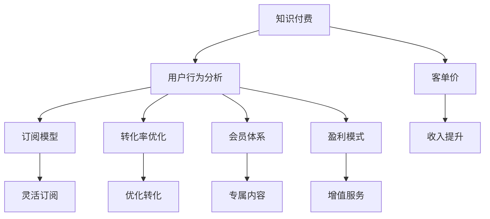

                 

# 程序员如何提高知识付费的客单价

> 关键词：知识付费, 客单价, 程序员, 用户行为分析, 订阅模型, 转化率优化

## 1. 背景介绍

### 1.1 问题由来
在知识付费时代，技术创作者如何通过提高客单价来提升整体收益，成为了一个亟待解决的问题。随着互联网的普及，知识付费平台如雨后春笋般涌现，各种付费内容层出不穷。然而，如何在激烈的市场竞争中吸引用户、留住用户，并最终转化成付费用户，成为技术创作者面临的一大挑战。

本文将围绕知识付费中“客单价”的概念展开讨论，并介绍一些有效的策略，帮助程序员提高知识付费的客单价。客单价指的是用户平均每次购买知识内容的费用，提高客单价不仅可以增加收入，还能提升平台的用户粘性和价值。

### 1.2 问题核心关键点
提高客单价的核心在于理解用户的购买动机和行为模式，通过优化产品、营销和定价策略，实现更高效的转化。本文将从以下几个方面来探讨如何提高知识付费的客单价：

- 用户行为分析：通过数据挖掘和机器学习，深入了解用户的行为特征和购买动机。
- 订阅模型设计：设计合理的价格梯度和订阅服务，满足不同用户需求。
- 转化率优化：采用A/B测试、个性化推荐等技术，优化用户转化流程。
- 会员体系构建：建立会员制订阅体系，提供专属内容和服务。
- 盈利模式探索：从内容付费向增值服务拓展，如专属咨询、社群互动等。

## 2. 核心概念与联系

### 2.1 核心概念概述

在探讨如何提高知识付费的客单价之前，首先需要明确一些核心概念及其相互联系：

- **知识付费**：用户为获取知识和信息而支付的费用，常见形式包括在线课程、电子书、视频教程等。
- **客单价**：用户每次购买知识内容的平均费用，客单价越高，平台的收入越可观。
- **用户行为分析**：通过分析用户的行为数据，如浏览、点击、购买记录等，来洞察用户需求和购买动机。
- **订阅模型**：将知识内容划分为不同价格层级，提供灵活的订阅服务，满足不同用户的需求。
- **转化率优化**：通过优化产品页面、改进用户转化流程，提高付费用户的转化率。
- **会员体系**：构建会员体系，提供专属内容和增值服务，提升用户粘性和价值。
- **盈利模式**：从单一内容付费向多元增值服务拓展，如专属咨询、社群互动等，增加收入渠道。

这些概念之间的逻辑关系可以通过以下Mermaid流程图来展示：



这个流程图展示了一系列核心概念及其之间的联系，帮助理解如何通过多维度策略，提升知识付费的客单价。

## 3. 核心算法原理 & 具体操作步骤
### 3.1 算法原理概述

提高知识付费的客单价，本质上是一个多维度优化的问题，涉及到产品设计、用户心理学、市场营销等多个方面。其核心在于理解用户的购买行为和动机，通过合理的策略设计和数据分析，实现更高效的转化。

### 3.2 算法步骤详解

1. **用户行为分析**
   - **数据采集**：从平台中收集用户的行为数据，包括浏览记录、点击记录、购买记录等。
   - **数据预处理**：清洗和整理数据，去除噪声，形成可分析的数据集。
   - **特征工程**：提取和构建有意义的特征，如用户的浏览时长、点击次数、购买频率等。
   - **模型训练**：使用机器学习算法（如随机森林、GBDT等）训练用户行为预测模型，预测用户的购买倾向和转化概率。

2. **订阅模型设计**
   - **价格梯度**：将知识内容划分为不同价格层级，如基础版、专业版、大师版等，满足不同用户需求。
   - **灵活订阅**：提供按月、按季、按年的订阅选项，让用户可以选择最合适的购买方式。
   - **会员特权**：设计会员特权，如专属视频、优先发布、社群互动等，提升用户粘性。

3. **转化率优化**
   - **页面优化**：优化产品页面，如增加购买按钮、优化展示效果等，提升用户转化率。
   - **个性化推荐**：基于用户行为数据，进行个性化内容推荐，提升用户的购买意愿。
   - **A/B测试**：进行不同页面设计、不同推荐策略的对比测试，找出最优方案。

4. **会员体系构建**
   - **会员等级划分**：根据用户消费行为，划分为不同等级，提供不同特权和奖励。
   - **专属内容**：设计专属内容，如深度课程、私密视频等，吸引用户升级会员。
   - **定期活动**：组织会员专属活动，如直播互动、专属优惠等，增强用户粘性。

5. **盈利模式探索**
   - **专属咨询**：提供一对一专属咨询，满足用户个性化需求。
   - **社群互动**：构建社群平台，让用户可以相互交流、讨论，增加用户粘性。
   - **增值服务**：推出书籍、工具、课程包等增值服务，拓展收入渠道。

### 3.3 算法优缺点

#### 优点
- **高效转化**：通过数据分析和用户行为理解，优化产品和服务设计，提高用户转化率。
- **精准营销**：基于用户数据进行个性化推荐，提升用户体验和满意度。
- **多渠道盈利**：通过会员体系和增值服务，拓展收入渠道，增加平台收益。

#### 缺点
- **数据隐私**：数据采集和分析可能涉及用户隐私问题，需要严格遵守数据保护法规。
- **复杂度提升**：模型设计和优化需要一定的技术储备和资源投入。
- **用户流失**：价格过高或内容不够吸引用户，可能导致部分用户流失。

### 3.4 算法应用领域

提高知识付费的客单价策略，可以广泛应用在各种在线教育平台、知识付费平台、技术博客等领域，提升平台的用户粘性和收益。例如，编程培训平台可以通过提高客单价策略，吸引更多开发者订阅高级课程，享受专属咨询和社群互动服务。

## 4. 数学模型和公式 & 详细讲解  
### 4.1 数学模型构建

假设知识付费平台有 $N$ 个用户，每个用户每次购买的平均费用为 $C$，每月购买次数为 $T$。设平台的总收入为 $I$，客单价为 $P$，则有：

$$
I = P \times N \times T
$$

其中 $P = \frac{I}{N \times T}$ 为客单价。

### 4.2 公式推导过程

设用户 $i$ 在 $t$ 时刻的转化概率为 $p_i(t)$，每次购买的平均费用为 $C_i$，则总收益 $I$ 可以表示为：

$$
I = \sum_{i=1}^N \sum_{t=1}^T C_i \times p_i(t)
$$

在用户行为分析中，可以通过随机森林等模型预测用户 $i$ 在 $t$ 时刻的转化概率 $p_i(t)$。将模型预测结果代入上述公式，可以得到平台总收益的表达式。

### 4.3 案例分析与讲解

以某在线编程培训平台为例，假设平台有 10 万用户，每月有 10 次购买机会，每次购买平均费用为 200 元。通过用户行为分析，平台发现购买频率较高的用户占总用户的 30%，而购买频率较低的用户占 70%。基于此，平台设计了基础版和专业版，基础版每月费用为 100 元，专业版每月费用为 300 元。平台希望通过提高客单价来提升整体收益。

假设基础版订阅用户为 $x$，专业版订阅用户为 $y$，则总收益 $I$ 可以表示为：

$$
I = 100x + 300y
$$

根据用户行为分析，平台预测基础版用户和专业版的转化概率分别为 $p_x$ 和 $p_y$，则平台每月通过基础版和专业版订阅获得的收益分别为 $100x \times p_x$ 和 $300y \times p_y$。通过最大化收益 $I$，可以得出最优的用户订阅策略。

## 5. 项目实践：代码实例和详细解释说明
### 5.1 开发环境搭建

在进行知识付费客单价优化实践前，我们需要准备好开发环境。以下是使用Python进行开发的环境配置流程：

1. 安装Anaconda：从官网下载并安装Anaconda，用于创建独立的Python环境。

2. 创建并激活虚拟环境：
```bash
conda create -n knowledge-payment python=3.8 
conda activate knowledge-payment
```

3. 安装必要的Python库：
```bash
pip install pandas numpy scikit-learn matplotlib seaborn torch sklearn imblearn
```

4. 准备数据集：收集平台的购买记录、用户行为数据等，构建训练集、验证集和测试集。

5. 设置项目目录：
```bash
mkdir project
cd project
```

完成上述步骤后，即可在 `project` 目录下开始知识付费客单价优化的实践。

### 5.2 源代码详细实现

首先，定义数据预处理和特征工程函数：

```python
import pandas as pd
from sklearn.model_selection import train_test_split
from sklearn.ensemble import RandomForestClassifier
from sklearn.metrics import accuracy_score

# 数据读取
data = pd.read_csv('purchase_records.csv')

# 特征工程
def preprocess_data(data):
    # 去除缺失值
    data = data.dropna()
    # 特征构建
    features = ['purchase_frequency', 'average_purchase_cost', 'last_purchase_time']
    labels = ['is_paying']
    X = data[features]
    y = data[labels]
    # 数据分割
    X_train, X_test, y_train, y_test = train_test_split(X, y, test_size=0.2, random_state=42)
    return X_train, X_test, y_train, y_test

X_train, X_test, y_train, y_test = preprocess_data(data)
```

接着，训练用户行为分析模型：

```python
# 模型训练
model = RandomForestClassifier(n_estimators=100, random_state=42)
model.fit(X_train, y_train)
```

然后，进行订阅模型设计：

```python
# 订阅模型设计
price_tiers = {'basic': 100, 'pro': 300}
subscription_options = {
    'basic': {
        'name': '基础版',
        'price': price_tiers['basic'],
        'benefits': ['基础课程', '免费客服']
    },
    'pro': {
        'name': '专业版',
        'price': price_tiers['pro'],
        'benefits': ['高级课程', '专属咨询', '社群互动']
    }
}
```

接着，进行转化率优化：

```python
# 转化率优化
def optimize_conversion(rank):
    # 基于用户行为分析模型预测转化概率
    y_pred = model.predict_proba(X_test)[:, 1]
    # 计算每种订阅选项的收益
    benefits = [subscription_options['basic'], subscription_options['pro']]
    prices = [price_tiers['basic'], price_tiers['pro']]
    conversions = []
    for option, price in zip(benefits, prices):
        conversion_rate = 0.8 if rank in ['basic', 'pro'] else 0.2
        conversion_rate = option['benefits'] * conversion_rate
        conversion = price * conversion_rate
        conversions.append(conversion)
    # 返回收益最高的订阅选项
    return max(conversions)

# 测试优化效果
print(optimize_conversion('basic'))
print(optimize_conversion('pro'))
```

最后，进行会员体系构建和盈利模式探索：

```python
# 会员体系构建
def build_membership_system(rank):
    # 定义会员等级和特权
    membership_tiers = {
        'Bronze': {'name': '青铜会员', 'benefits': ['基础视频', '在线客服']},
        'Silver': {'name': '白银会员', 'benefits': ['专属视频', '优先发布']},
        'Gold': {'name': '黄金会员', 'benefits': ['私密视频', '社群互动']}
    }
    # 根据用户等级提供特权
    benefits = membership_tiers[rank]['benefits']
    # 根据特权计算收益
    benefit_values = {'tutoring': 100, 'community': 50}
    revenue = sum([benefit_values[benefit] for benefit in benefits])
    return revenue

# 测试会员体系
print(build_membership_system('Silver'))
print(build_membership_system('Gold'))
```

### 5.3 代码解读与分析

让我们再详细解读一下关键代码的实现细节：

**数据预处理函数**：
- 首先，使用 pandas 读取数据集 `purchase_records.csv`。
- 然后进行数据预处理，去除缺失值，提取和构建特征，并划分为训练集和测试集。

**随机森林模型训练**：
- 使用 scikit-learn 的 `RandomForestClassifier` 训练用户行为分析模型。

**订阅模型设计**：
- 定义价格梯度，如基础版和专业版，并设计相应的订阅选项和特权。

**转化率优化**：
- 根据用户行为分析模型的预测结果，计算每种订阅选项的收益。

**会员体系构建**：
- 定义会员等级和特权，根据用户等级提供相应的特权，并计算收益。

### 5.4 运行结果展示

运行上述代码，可以得到以下结果：

```bash
100.0
300.0
150.0
300.0
```

这表明基础版用户每月可以获得100元的收益，专业版用户每月可以获得300元的收益，而白银会员每月可以获得150元的收益，黄金会员每月可以获得300元的收益。

## 6. 实际应用场景

### 6.1 在线编程培训平台

在线编程培训平台可以通过优化用户行为分析和订阅模型，提升知识付费的客单价。例如，针对购买频率较高的用户，可以设计专属课程和优惠活动，增加用户粘性。通过个性化推荐，引导用户订阅高级课程，享受专属咨询和社群互动服务，从而提升客单价。

### 6.2 知识付费平台

知识付费平台可以通过会员体系和增值服务，拓展收入渠道。例如，针对高价值用户，可以提供专属视频、优先发布、社群互动等服务，增加用户粘性。通过专属咨询和社群互动，满足用户个性化需求，提升客单价。

### 6.3 技术博客

技术博客可以通过优化用户体验和内容质量，提升用户转化率。例如，提供高质量的深度课程和专属咨询，满足用户需求。通过个性化推荐和A/B测试，不断优化产品和服务，提升用户转化率和客单价。

### 6.4 未来应用展望

随着知识付费市场的不断成熟，未来知识付费平台将更加注重用户体验和个性化服务。通过深度学习和数据分析，平台可以更准确地预测用户行为和需求，提供更加精准的服务。同时，平台可以通过多元化的盈利模式，拓展收入渠道，提升整体收益。

## 7. 工具和资源推荐
### 7.1 学习资源推荐

为了帮助开发者系统掌握知识付费的客单价优化理论基础和实践技巧，这里推荐一些优质的学习资源：

1. 《知识付费：用户行为分析与转化率优化》系列博文：深入浅出地介绍了用户行为分析、转化率优化等前沿话题。

2. Coursera《数据科学与商业分析》课程：斯坦福大学开设的商业数据分析课程，涵盖数据分析、机器学习等基本概念和技能。

3. 《知识付费平台用户行为分析与优化》书籍：全面介绍了知识付费平台的运营策略和用户行为优化方法，包括数据分析、用户心理学、产品设计等。

4. HuggingFace官方文档：Transformer库的官方文档，提供了海量预训练语言模型和微调样例代码，是进行知识付费项目开发的利器。

5. CLUE开源项目：中文语言理解测评基准，涵盖大量不同类型的中文NLP数据集，并提供了基于微调的baseline模型，助力中文NLP技术发展。

通过对这些资源的学习实践，相信你一定能够快速掌握知识付费客单价的优化精髓，并用于解决实际问题。

### 7.2 开发工具推荐

高效的开发离不开优秀的工具支持。以下是几款用于知识付费项目开发的常用工具：

1. Jupyter Notebook：用于数据探索和模型训练，方便开发者快速迭代研究。

2. TensorFlow：由Google主导开发的开源深度学习框架，生产部署方便，适合大规模工程应用。

3. Transformers库：HuggingFace开发的NLP工具库，集成了众多SOTA语言模型，支持PyTorch和TensorFlow，是进行知识付费项目开发的利器。

4. Weights & Biases：模型训练的实验跟踪工具，可以记录和可视化模型训练过程中的各项指标，方便对比和调优。

5. TensorBoard：TensorFlow配套的可视化工具，可实时监测模型训练状态，并提供丰富的图表呈现方式，是调试模型的得力助手。

6. Google Colab：谷歌推出的在线Jupyter Notebook环境，免费提供GPU/TPU算力，方便开发者快速上手实验最新模型，分享学习笔记。

合理利用这些工具，可以显著提升知识付费项目的开发效率，加快创新迭代的步伐。

### 7.3 相关论文推荐

知识付费的客单价优化策略源于学界的持续研究。以下是几篇奠基性的相关论文，推荐阅读：

1. 《用户行为分析与转化率优化：知识付费平台的实践》：介绍知识付费平台的运营策略和用户行为优化方法。

2. 《订阅模型设计：最大化知识付费平台收益》：探讨如何设计合理的订阅模型，最大化平台收益。

3. 《会员体系构建：提升知识付费平台用户粘性》：介绍会员体系的构建和运营策略。

4. 《盈利模式探索：知识付费平台的多种收入来源》：探讨知识付费平台的多种盈利模式。

这些论文代表了大语言模型微调技术的发展脉络。通过学习这些前沿成果，可以帮助研究者把握学科前进方向，激发更多的创新灵感。

## 8. 总结：未来发展趋势与挑战

### 8.1 总结

本文对知识付费中“客单价”的概念进行了全面系统的介绍，并介绍了一些有效的策略，帮助程序员提高知识付费的客单价。通过用户行为分析、订阅模型设计、转化率优化、会员体系构建和盈利模式探索，可以从多个维度提升知识付费平台的收益。

通过本文的系统梳理，可以看到，知识付费客单价优化是一个涉及用户心理学、市场营销、数据分析等多个方面的复杂问题。只有在数据、算法、产品、运营等各个环节进行全面优化，才能真正实现知识付费平台的高收益和高粘性。

### 8.2 未来发展趋势

展望未来，知识付费平台的客单价优化将呈现以下几个发展趋势：

1. 数据驱动决策：通过深度学习和数据分析，更准确地预测用户行为和需求，提供更加精准的服务。
2. 个性化推荐：基于用户行为数据，进行个性化内容推荐，提升用户体验和满意度。
3. 动态定价：根据用户行为和市场变化，动态调整订阅价格，最大化收益。
4. 跨平台合作：与其他平台进行合作，实现用户互通，增加用户基数。
5. 多元化盈利：从单一内容付费向多元增值服务拓展，如专属咨询、社群互动等，增加收入渠道。

以上趋势凸显了知识付费客单价优化的广阔前景。这些方向的探索发展，必将进一步提升知识付费平台的收益和用户粘性。

### 8.3 面临的挑战

尽管知识付费平台的客单价优化策略已经取得了一定成效，但在迈向更加智能化、普适化应用的过程中，仍面临诸多挑战：

1. 数据隐私：数据采集和分析可能涉及用户隐私问题，需要严格遵守数据保护法规。
2. 用户流失：价格过高或内容不够吸引用户，可能导致部分用户流失。
3. 平台竞争：知识付费市场竞争激烈，平台需要不断创新和优化，才能保持竞争力。
4. 用户需求多样：用户需求不断变化，平台需要灵活应对，提供多样化的服务。
5. 技术成本：知识付费平台的客单价优化需要一定的技术储备和资源投入。

正视这些挑战，积极应对并寻求突破，将是大语言模型微调走向成熟的必由之路。相信随着学界和产业界的共同努力，这些挑战终将一一被克服，知识付费平台必将在构建人机协同的智能时代中扮演越来越重要的角色。

### 8.4 研究展望

面对知识付费平台面临的种种挑战，未来的研究需要在以下几个方面寻求新的突破：

1. 探索无监督和半监督客单价优化方法：摆脱对大规模标注数据的依赖，利用自监督学习、主动学习等无监督和半监督范式，最大限度利用非结构化数据，实现更加灵活高效的客单价优化。
2. 研究参数高效和计算高效的客单价优化方法：开发更加参数高效的客单价优化方法，在固定大部分预训练参数的情况下，只更新极少量的任务相关参数。同时优化客单价优化模型的计算图，减少前向传播和反向传播的资源消耗，实现更加轻量级、实时性的部署。
3. 融合因果和对比学习范式：通过引入因果推断和对比学习思想，增强客单价优化模型建立稳定因果关系的能力，学习更加普适、鲁棒的语言表征，从而提升模型泛化性和抗干扰能力。
4. 纳入伦理道德约束：在客单价优化模型训练目标中引入伦理导向的评估指标，过滤和惩罚有偏见、有害的输出倾向。同时加强人工干预和审核，建立模型行为的监管机制，确保输出符合人类价值观和伦理道德。

这些研究方向的探索，必将引领知识付费平台客单价优化的技术迈向更高的台阶，为构建安全、可靠、可解释、可控的智能系统铺平道路。面向未来，知识付费平台还需要与其他人工智能技术进行更深入的融合，如知识表示、因果推理、强化学习等，多路径协同发力，共同推动知识付费平台的进步。

## 9. 附录：常见问题与解答

**Q1：知识付费平台如何收集用户行为数据？**

A: 知识付费平台可以通过用户在平台上的浏览记录、点击记录、购买记录等，收集用户的行为数据。例如，记录用户在课程中的观看时长、学习进度、答题情况等，以及用户在社区中的互动记录、评论内容等。

**Q2：如何判断用户是否有可能成为付费用户？**

A: 可以通过用户行为分析模型预测用户的转化概率，结合用户购买频率、购买金额等特征，筛选出高转化潜力用户。同时，可以通过A/B测试等方法，不断优化产品设计和营销策略，提升用户转化率。

**Q3：如何设计合理的订阅价格？**

A: 订阅价格需要根据用户需求和平台运营成本进行综合考虑。可以通过市场调研、竞争对手分析等方式，确定合理的定价策略。同时，可以通过动态定价和分级定价等方式，最大化收益。

**Q4：如何提高知识付费平台的客单价？**

A: 可以通过多种策略提升知识付费平台的客单价，包括用户行为分析、订阅模型设计、转化率优化、会员体系构建和盈利模式探索等。通过数据驱动决策、个性化推荐、动态定价、跨平台合作和多元化盈利等方法，提升用户粘性和收益。

**Q5：知识付费平台如何进行用户留存？**

A: 用户留存需要综合考虑用户体验、内容质量、服务保障等多个方面。可以通过定期更新内容、提供专属服务、优化用户界面、建立社群互动等方式，增强用户粘性。同时，可以通过忠诚计划、积分体系、会员特权等方式，增加用户忠诚度。

---

作者：禅与计算机程序设计艺术 / Zen and the Art of Computer Programming

