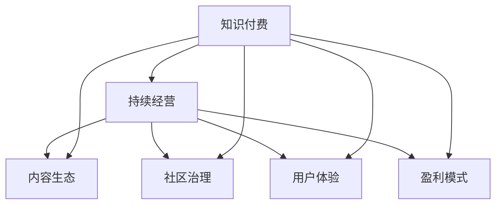

                 

# 程序员如何构建可持续的知识付费模式

> 关键词：知识付费, 持续经营, 内容生态, 社区治理, 用户体验, 盈利模式

## 1. 背景介绍

在互联网时代，知识付费正成为一种新的商业模式，为程序员提供了丰富的学习资源和职业发展机会。然而，如何构建可持续的知识付费模式，成为许多从业者面临的难题。本文章将深入探讨这个问题，从核心概念入手，逐步分析算法原理、操作步骤，并给出实际应用场景和推荐资源。

## 2. 核心概念与联系

### 2.1 核心概念概述

- **知识付费**：通过付费获取专业知识、技能和信息，以加速学习和职业发展。
- **持续经营**：保持业务长期稳定运营，实现盈利和可持续发展。
- **内容生态**：构建健康活跃的内容社区，形成良性互动和内容共享。
- **社区治理**：通过有效的规则制定和执行，维护社区秩序和公平公正。
- **用户体验**：提供高质量、易用的服务，满足用户个性化需求。
- **盈利模式**：探索多样化的收入来源，平衡用户需求和商业价值。

这些核心概念之间相互联系，共同构成了知识付费模式的框架。通过理解并运用这些概念，可以实现高效、健康、盈利的知识付费平台。

### 2.2 核心概念原理和架构的 Mermaid 流程图



该图展示了知识付费模式的核心概念及其相互关系。

## 3. 核心算法原理 & 具体操作步骤

### 3.1 算法原理概述

构建可持续的知识付费模式，涉及多个环节的算法和策略，包括内容推荐、用户行为分析、收益分配等。

- **内容推荐**：通过算法推荐相关内容，提高用户粘性和满意度。
- **用户行为分析**：通过数据分析，优化用户界面和内容，提升用户体验。
- **收益分配**：通过合理的定价和激励机制，吸引创作者和消费者，实现盈亏平衡。

### 3.2 算法步骤详解

#### 3.2.1 内容推荐算法

1. **数据收集**：收集用户行为数据，如浏览历史、搜索记录、购买行为等。
2. **特征工程**：提取内容特征和用户特征，如关键词、主题、用户画像等。
3. **模型训练**：选择适当的推荐算法，如协同过滤、内容基推荐、深度学习等，对数据进行训练。
4. **模型评估**：使用指标如准确率、召回率、点击率等评估推荐效果，调整模型参数。

#### 3.2.2 用户行为分析算法

1. **数据采集**：通过日志、问卷、反馈等方式收集用户行为数据。
2. **数据预处理**：清洗、归一化、特征提取等数据预处理步骤。
3. **模型训练**：选择适当的分析算法，如回归分析、聚类分析、时序分析等。
4. **模型应用**：利用分析结果优化产品设计、内容选择、用户体验等。

#### 3.2.3 收益分配算法

1. **定价策略**：根据内容价值、创作者资质、市场价格等设定合理的定价策略。
2. **分成机制**：制定公平合理的分成机制，确保创作者和平台双赢。
3. **激励措施**：设立激励措施，如推广费、广告分成等，提高创作者积极性。

### 3.3 算法优缺点

#### 优点

- **个性化推荐**：提高用户粘性，增加平台使用时间。
- **数据驱动决策**：通过数据分析优化产品设计，提升用户体验。
- **公平收益分配**：激励创作者生产优质内容，提升平台内容质量。

#### 缺点

- **数据隐私**：大量数据收集和分析可能涉及用户隐私问题。
- **模型复杂**：推荐算法、分析算法等模型复杂，需要大量计算资源。
- **收益波动**：定价策略、分成机制等可能影响平台收益稳定性。

### 3.4 算法应用领域

知识付费平台涉及的内容推荐、用户行为分析、收益分配等算法，已经广泛应用于电商、社交、教育等多个领域。例如：

- **电商**：商品推荐、用户画像、购买行为分析等。
- **社交**：好友推荐、内容发现、兴趣标签等。
- **教育**：课程推荐、学习路径、用户评价分析等。

## 4. 数学模型和公式 & 详细讲解 & 举例说明

### 4.1 数学模型构建

假设有一个知识付费平台，内容库为 $C$，用户集合为 $U$。

- **内容特征**：$x_i$ 表示内容 $i$ 的特征向量。
- **用户特征**：$y_j$ 表示用户 $j$ 的特征向量。
- **交互矩阵**：$I_{ij}$ 表示内容 $i$ 和用户 $j$ 的交互情况。

### 4.2 公式推导过程

- **内容推荐算法**：协同过滤算法可以表示为：
$$
R_{ij} = \sum_{k=1}^{K} \alpha_k \cdot \hat{p}_{ik} \cdot \hat{q}_{jk}
$$
其中 $\alpha_k$ 为特征权重，$\hat{p}_{ik}$ 为内容 $i$ 的特征表示，$\hat{q}_{jk}$ 为用户 $j$ 的特征表示。

- **用户行为分析算法**：通过聚类分析，可以将用户分为 $K$ 个簇。设用户 $j$ 属于第 $k$ 簇，则有：
$$
y_j = c_k
$$
其中 $c_k$ 为第 $k$ 簇的特征表示。

- **收益分配算法**：公平收益分配可以表示为：
$$
P_i = \frac{R_i}{\sum_{i=1}^{N} R_i}
$$
其中 $P_i$ 为内容 $i$ 的定价比例，$R_i$ 为内容 $i$ 的收益。

### 4.3 案例分析与讲解

以某在线教育平台为例，通过协同过滤算法为用户推荐课程。平台收集用户浏览、点击、购买等行为数据，构建用户-课程的交互矩阵 $I_{ij}$。通过特征工程，将课程和用户表示为向量 $x_i$ 和 $y_j$，使用协同过滤算法计算推荐度 $R_{ij}$，从而推荐相关课程。

## 5. 项目实践：代码实例和详细解释说明

### 5.1 开发环境搭建

1. **环境配置**：选择 Python 环境，安装 Pandas、NumPy、Scikit-Learn 等必要的库。
2. **数据准备**：收集用户行为数据，构建交互矩阵和特征向量。
3. **模型训练**：选择适当的推荐算法和分析算法，训练模型。

### 5.2 源代码详细实现

以下是一个简单的协同过滤推荐系统代码示例：

```python
import pandas as pd
from scipy.sparse import csr_matrix
from sklearn.decomposition import TruncatedSVD

# 数据准备
df = pd.read_csv('interaction_matrix.csv')
X = df[['user_id', 'content_id']]
Y = df['interaction']

# 特征工程
X = X.groupby(['user_id', 'content_id']).agg({'interaction': 'count'}).reset_index()
X.columns = ['user_id', 'content_id', 'count']
X = pd.pivot_table(X, index='user_id', columns='content_id', values='count')

# 模型训练
svd = TruncatedSVD(n_components=10)
X_transformed = svd.fit_transform(X)
user_features = svd.transform(X)
```

### 5.3 代码解读与分析

- **数据准备**：从 CSV 文件中读取用户行为数据，构建用户-课程的交互矩阵。
- **特征工程**：对交互矩阵进行归一化处理，将其转化为稀疏矩阵，并进行特征降维。
- **模型训练**：使用 TruncatedSVD 算法对特征进行降维，生成用户特征矩阵。

### 5.4 运行结果展示

```python
# 推荐系统测试
from scipy.sparse.linalg import svds
from scipy.sparse import coo_matrix

# 计算推荐度
U, S, Vh = svds(X_transformed, k=10)
recommendation_matrix = (U @ S @ Vh.T).tocsr()

# 预测用户推荐内容
user_id = 1
recommended_ids = recommendation_matrix[user_id].nonzero()[1]
```

以上代码展示了如何通过协同过滤算法为用户推荐内容，并通过预测值生成推荐列表。

## 6. 实际应用场景

### 6.1 在线教育

在线教育平台通过知识付费模式，提供优质课程内容，吸引学员付费学习。平台通过内容推荐算法，推荐适合学员的课程；通过用户行为分析算法，优化用户体验和课程选择；通过收益分配算法，激励讲师创作优质内容，实现平台盈利。

### 6.2 软件开发

软件开发平台通过提供高质量的课程和资料，帮助程序员提升技能，获得职业发展。平台通过推荐算法，推荐相关课程和资料；通过用户行为分析，优化学习路径和资源；通过收益分配，吸引讲师和学员，形成良性循环。

### 6.3 开源社区

开源社区通过知识付费模式，分享高质量的代码和文档，促进技术交流和协作。社区通过内容推荐，帮助用户发现优质资源；通过用户行为分析，优化社区结构；通过收益分配，激励创作者贡献代码和文档，实现社区的可持续发展。

## 7. 工具和资源推荐

### 7.1 学习资源推荐

1. **《推荐系统实践》**：介绍推荐系统原理和实现，涵盖协同过滤、内容基推荐等算法。
2. **《数据科学导论》**：涵盖数据分析、数据处理、机器学习等基础知识，适合初学者。
3. **《机器学习实战》**：提供丰富的项目案例和代码实践，帮助读者掌握机器学习技能。
4. **Coursera 推荐系统课程**：由斯坦福大学开设，涵盖推荐系统原理和实践。
5. **Kaggle 数据竞赛**：通过参与竞赛，提升数据分析和机器学习能力。

### 7.2 开发工具推荐

1. **PyTorch**：强大的深度学习框架，适合推荐系统和数据分析。
2. **TensorFlow**：流行的开源深度学习框架，支持多种模型训练。
3. **Scikit-Learn**：常用的机器学习库，支持多种算法和数据预处理。
4. **Pandas**：强大的数据分析库，支持数据处理和可视化。
5. **Jupyter Notebook**：交互式编程环境，支持多种语言和库。

### 7.3 相关论文推荐

1. **《推荐系统实践》**：详细介绍了推荐系统的算法和实现。
2. **《用户行为分析与建模》**：介绍用户行为分析的原理和应用。
3. **《公平定价和收益分配》**：探讨了公平定价和收益分配策略。
4. **《协同过滤推荐系统》**：介绍了协同过滤算法的原理和实现。

## 8. 总结：未来发展趋势与挑战

### 8.1 研究成果总结

本文详细探讨了知识付费平台的构建原理和操作步骤，通过算法和策略分析，提出了内容推荐、用户行为分析和收益分配的解决方案。通过实例代码和案例分析，展示了知识付费平台的实际应用。同时，推荐了相关的学习资源和开发工具，帮助读者提升技能和实践能力。

### 8.2 未来发展趋势

知识付费平台将面临以下发展趋势：

1. **个性化推荐**：通过深度学习和协同过滤算法，提供个性化内容推荐，提高用户粘性。
2. **用户行为分析**：通过大数据分析，优化产品设计，提升用户体验。
3. **公平收益分配**：制定公平合理的定价和分成机制，激励创作者和平台发展。
4. **多模态交互**：结合文本、图像、视频等多模态数据，提供更丰富的学习资源。
5. **社区治理**：通过智能规则和用户反馈，维护社区秩序，提升用户满意度。

### 8.3 面临的挑战

知识付费平台面临以下挑战：

1. **数据隐私**：大量数据收集和分析可能涉及用户隐私问题。
2. **算法复杂**：推荐算法、分析算法等模型复杂，需要大量计算资源。
3. **收益波动**：定价策略、分成机制等可能影响平台收益稳定性。
4. **用户流失**：如何吸引和保留用户，提高用户粘性，是一个持续挑战。
5. **内容质量**：如何确保内容质量，避免低质量内容泛滥，需要持续优化。

### 8.4 研究展望

未来研究将从以下几个方面展开：

1. **隐私保护技术**：研发隐私保护算法，保护用户隐私。
2. **高效算法**：研究高效的推荐算法和分析算法，降低计算资源消耗。
3. **多模态数据融合**：探索多模态数据融合技术，提升平台内容多样性。
4. **公平定价机制**：研究公平合理的定价和分成机制，提高平台收益稳定性。
5. **智能社区治理**：开发智能社区治理工具，维护社区秩序和公平公正。

## 9. 附录：常见问题与解答

**Q1: 什么是知识付费？**

A: 知识付费是一种通过付费获取专业知识、技能和信息的商业模式，旨在加速学习和职业发展。

**Q2: 如何构建可持续的知识付费平台？**

A: 构建可持续的知识付费平台需要关注内容推荐、用户行为分析、收益分配等多个环节，通过算法和策略提升用户体验和平台收益。

**Q3: 知识付费平台的推荐算法有哪些？**

A: 知识付费平台的推荐算法包括协同过滤、内容基推荐、深度学习等，不同算法适用于不同的应用场景。

**Q4: 知识付费平台如何保护用户隐私？**

A: 知识付费平台可以通过匿名化处理、加密存储等技术手段，保护用户隐私。

**Q5: 知识付费平台的收益分配有哪些策略？**

A: 知识付费平台的收益分配策略包括公平定价、分成机制、激励措施等，需要根据平台具体情况制定合理的策略。

---

作者：禅与计算机程序设计艺术 / Zen and the Art of Computer Programming

