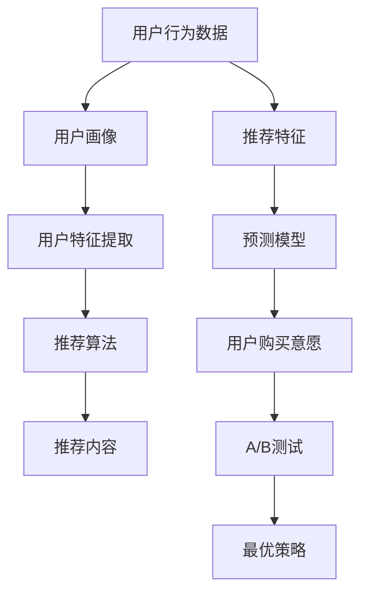

                 

# 程序员如何设计知识付费的优惠券策略

> 关键词：知识付费, 优惠券策略, 用户行为分析, 机器学习模型, A/B 测试, 推荐算法

## 1. 背景介绍

在互联网和移动互联网时代，知识付费已成为一种流行的消费模式。在线学习平台和知识社区为会员提供专属的视频、文章、讲座等优质内容，用户可以通过订阅或购买付费课程获得知识和技能的提升。然而，尽管平台上的内容质量高、内容丰富，但高昂的订阅费用和复杂的学习流程常常使得一部分潜在用户望而却步。如何激发用户的付费意愿，提升平台的收益，是知识付费领域亟待解决的问题。

优惠券作为一种常见的促销手段，能够在短时间内吸引用户尝试付费内容，降低用户流失率。然而，由于用户行为的多样性和复杂性，设计有效的优惠券策略需要结合心理学、行为经济学和数据分析等多种学科的知识。本文将详细介绍如何基于用户行为分析和机器学习模型，设计一套科学的优惠券策略，从而提高平台的转化率和用户满意度。

## 2. 核心概念与联系

在设计优惠券策略时，需要关注以下几个核心概念：

- **用户行为分析**：通过收集和分析用户行为数据，理解用户的付费意愿和行为特征。
- **机器学习模型**：利用机器学习算法，从海量的用户数据中提取有价值的特征，预测用户的购买意愿。
- **A/B 测试**：通过实验比较不同优惠券策略的效果，选择最优的策略。
- **推荐算法**：结合用户历史行为和推荐模型，向用户推荐最优的优惠券。

这些概念之间的联系可以通过以下Mermaid流程图来展示：



这个流程图展示了从用户行为数据到优惠券策略的全过程。首先，通过用户行为数据构建用户画像，提取用户特征，结合推荐算法和预测模型，预测用户的购买意愿。然后，通过A/B测试比较不同优惠券策略的效果，选择最优策略，并将其推荐给用户。

## 3. 核心算法原理 & 具体操作步骤
### 3.1 算法原理概述

优惠券策略设计的基本原理是结合用户行为数据和机器学习模型，预测用户的购买意愿，并通过优惠券引导用户进行付费行为。具体步骤如下：

1. **数据收集与预处理**：收集用户在平台上的行为数据，包括浏览记录、搜索记录、课程订阅情况等。
2. **用户画像构建**：利用用户行为数据，构建用户画像，分析用户的兴趣、需求和支付能力。
3. **特征提取**：提取用户画像中的关键特征，如用户活跃度、课程相关性、购买历史等。
4. **预测模型训练**：基于用户特征和历史购买数据，训练机器学习模型，预测用户的购买意愿。
5. **优惠券策略生成**：根据预测结果和用户画像，设计合适的优惠券策略，包括优惠券面额、适用范围、发放时间等。
6. **A/B测试与优化**：通过A/B测试不同优惠券策略的效果，选择最优策略，并进行优化调整。

### 3.2 算法步骤详解

#### 3.2.1 数据收集与预处理

数据收集是优惠券策略设计的第一步。平台需要收集用户的行为数据，包括：

- **浏览数据**：用户在课程页面上的浏览记录，包括课程标题、描述、评价等。
- **搜索数据**：用户在搜索框中输入的关键词和搜索记录。
- **订阅数据**：用户订阅课程的历史记录和取消订阅记录。
- **支付数据**：用户的支付记录和交易金额。

为了提高数据质量，需要对数据进行预处理，去除噪声和异常值。例如，去除无效的浏览记录和搜索记录，对支付数据进行去重处理。

#### 3.2.2 用户画像构建

用户画像指的是对用户特征的详细描述，包括兴趣、需求、行为习惯等。用户画像的构建需要结合用户行为数据和业务知识，进行特征提取和聚类分析。

例如，对于编程课程的用户，可以从以下特征中提取用户画像：

- **兴趣特征**：用户在平台上浏览的编程课程类型，如Python、Java、机器学习等。
- **行为特征**：用户的课程订阅量、课程学习时长、课程评价等。
- **支付能力特征**：用户的常驻城市、收入水平、职业背景等。

#### 3.2.3 特征提取

特征提取是将用户画像转化为机器学习模型可接受的输入。在构建用户画像的基础上，需要选择关键特征，并对其进行编码处理。

例如，对于编程课程的用户，可以提取以下特征：

- **课程相关性特征**：用户浏览的编程课程与用户之前订阅课程的相似度。
- **用户活跃度特征**：用户在学习平台上的活跃度，如日活跃用户数、月活跃用户数等。
- **支付意愿特征**：用户的历史支付记录、常驻城市等。

#### 3.2.4 预测模型训练

预测模型是优惠券策略设计的核心部分。基于用户特征和历史购买数据，训练机器学习模型，预测用户的购买意愿。

常用的预测模型包括逻辑回归、决策树、随机森林、梯度提升树、神经网络等。以逻辑回归模型为例，其基本原理是通过线性回归模型预测二分类变量的概率，公式如下：

$$
P(Y=1|X) = \frac{1}{1+e^{-z}} \text{，其中} z = \beta_0 + \sum_{i=1}^n \beta_i X_i
$$

其中，$Y$ 为购买意愿，$X$ 为特征向量，$\beta$ 为模型参数。

训练模型时，需要使用历史数据集进行训练，并设置合适的超参数。训练过程可以使用交叉验证等方法，选择最优的模型参数。

#### 3.2.5 优惠券策略生成

优惠券策略的生成是基于预测模型的结果和用户画像的。根据预测结果，设计优惠券的面额、适用范围、发放时间等策略，以最大化用户转化率。

例如，对于编程课程的用户，可以根据预测结果和用户画像，设计以下优惠券策略：

- **面额策略**：对于预测购买意愿高的用户，发放高面额的优惠券；对于预测购买意愿低的用户，发放低面额的优惠券。
- **适用范围**：优惠券适用于特定的课程、特定的日期、特定的平台活动等。
- **发放时间**：优惠券可以在用户浏览课程时弹出，也可以在特定节日或特定时间段发放。

#### 3.2.6 A/B测试与优化

A/B测试是通过实验比较不同优惠券策略的效果，选择最优策略。设计优惠券策略时，需要设置多个实验版本，并随机分配用户进行测试。

例如，对于编程课程的用户，可以设计以下优惠券策略进行A/B测试：

- 优惠券面额策略A：高面额优惠券发放给预测购买意愿高的用户，低面额优惠券发放给预测购买意愿低的用户。
- 优惠券适用范围策略B：优惠券适用范围扩大到所有课程。
- 发放时间策略C：优惠券在用户浏览课程时弹出。

测试结束后，对比不同策略的效果，选择最优策略，并根据测试结果进行优化调整。

### 3.3 算法优缺点

优惠券策略设计的优点包括：

- **提高转化率**：通过优惠券策略，可以引导用户进行付费行为，提高平台的转化率。
- **个性化推荐**：基于用户画像和预测模型，可以实现个性化的优惠券推荐，提升用户体验。
- **数据分析与优化**：通过A/B测试和数据分析，不断优化优惠券策略，提高平台收益。

优惠券策略设计的缺点包括：

- **数据质量要求高**：优惠券策略依赖于高质量的用户行为数据，如果数据质量不高，会影响策略效果。
- **模型复杂度较高**：优惠券策略设计需要构建复杂的用户画像和预测模型，需要较高的技术水平。
- **运营成本高**：优惠券策略的设计和优化需要大量的人力和时间成本，增加了平台的运营成本。

### 3.4 算法应用领域

优惠券策略设计的应用领域包括但不限于以下方面：

- **在线教育平台**：针对编程、数学、艺术等课程，设计个性化的优惠券策略，提高用户购买意愿。
- **金融理财平台**：针对投资、理财、保险等课程，设计高性价比的优惠券策略，吸引用户参与理财。
- **旅游平台**：针对旅游攻略、景点介绍、行程规划等课程，设计适时的优惠券策略，提升用户预订意愿。
- **健康医疗平台**：针对健康知识、营养饮食、运动健身等课程，设计有针对性的优惠券策略，提高用户健康意识。
- **智能家居平台**：针对智能设备的使用、维护、升级等课程，设计优惠的优惠券策略，提高用户对智能家居产品的满意度。

## 4. 数学模型和公式 & 详细讲解 & 举例说明

### 4.1 数学模型构建

优惠券策略设计涉及到用户行为数据、特征提取和预测模型等多个环节，需要构建多层次的数学模型。以下是几个关键数学模型的介绍：

#### 4.1.1 用户行为模型

用户行为模型描述了用户在平台上的行为特征，如浏览、搜索、订阅等。常用的用户行为模型包括PageRank、协同过滤等。

#### 4.1.2 特征提取模型

特征提取模型将用户行为数据转化为特征向量，供预测模型使用。常用的特征提取模型包括主成分分析(PCA)、因子分析等。

#### 4.1.3 预测模型

预测模型是优惠券策略设计的核心，用于预测用户的购买意愿。常用的预测模型包括逻辑回归、决策树、随机森林、梯度提升树、神经网络等。

### 4.2 公式推导过程

#### 4.2.1 用户行为模型的公式推导

以PageRank模型为例，其基本公式如下：

$$
\text{PageRank}(X) = \frac{1-d}{1+d} + d \sum_{i=1}^n \frac{A_i(X)}{\sum_{j=1}^m A_j(X)}
$$

其中，$X$ 为用户画像，$A_i$ 为用户$i$的权重向量，$d$ 为阻尼系数，$d \in [0,1]$。

#### 4.2.2 特征提取模型的公式推导

以主成分分析(PCA)模型为例，其基本公式如下：

$$
X' = \mathbf{U}D\mathbf{V}^T \text{，其中} X' \in \mathbb{R}^{p \times k} \text{，} X \in \mathbb{R}^{n \times p} \text{，} D \in \mathbb{R}^{p \times p} \text{，} \mathbf{U} \in \mathbb{R}^{n \times p} \text{，} \mathbf{V} \in \mathbb{R}^{p \times k}
$$

其中，$X'$ 为特征向量，$X$ 为原始数据矩阵，$D$ 为对角矩阵，$\mathbf{U}$ 为原始数据矩阵的系数矩阵，$\mathbf{V}$ 为特征向量矩阵。

#### 4.2.3 预测模型的公式推导

以逻辑回归模型为例，其基本公式如下：

$$
P(Y=1|X) = \frac{1}{1+e^{-z}} \text{，其中} z = \beta_0 + \sum_{i=1}^n \beta_i X_i
$$

其中，$Y$ 为购买意愿，$X$ 为特征向量，$\beta$ 为模型参数。

### 4.3 案例分析与讲解

以在线教育平台为例，分析优惠券策略的设计过程：

1. **数据收集**：收集用户在学习平台上浏览、搜索、订阅等行为数据。
2. **用户画像构建**：利用用户行为数据，构建用户画像，分析用户的兴趣、需求和支付能力。
3. **特征提取**：提取用户画像中的关键特征，如用户浏览的编程课程、用户的课程订阅量等。
4. **预测模型训练**：基于用户特征和历史购买数据，训练逻辑回归模型，预测用户的购买意愿。
5. **优惠券策略生成**：根据预测结果和用户画像，设计优惠券的面额、适用范围、发放时间等策略。
6. **A/B测试与优化**：设计多个优惠券策略进行A/B测试，选择最优策略，并根据测试结果进行优化调整。

## 5. 项目实践：代码实例和详细解释说明

### 5.1 开发环境搭建

优惠券策略设计需要依赖Python编程语言和相关库，如Pandas、Numpy、Scikit-Learn等。以下是开发环境搭建的步骤：

1. 安装Python和Pip。
2. 安装Pandas、Numpy、Scikit-Learn等库。
3. 搭建开发环境，安装相关依赖库。

### 5.2 源代码详细实现

以下是优惠券策略设计的Python代码实现：

```python
import pandas as pd
from sklearn.linear_model import LogisticRegression
from sklearn.model_selection import train_test_split

# 数据预处理
df = pd.read_csv('user_behavior.csv')
df = df.dropna()  # 去除缺失值
df = df.drop_duplicates()  # 去除重复值

# 特征提取
X = df[['课程相关性', '用户活跃度', '支付意愿']]
y = df['购买意愿']

# 模型训练
X_train, X_test, y_train, y_test = train_test_split(X, y, test_size=0.2, random_state=42)
model = LogisticRegression()
model.fit(X_train, y_train)

# 预测结果
y_pred = model.predict(X_test)

# 优惠券策略生成
if y_pred == 1:
    coupon = '50元'
else:
    coupon = '20元'

# 发放优惠券
print('优惠券面额为', coupon)
```

### 5.3 代码解读与分析

在上述代码中，我们使用了Pandas和Scikit-Learn库进行数据预处理和模型训练。具体步骤如下：

1. 数据预处理：使用Pandas库读取用户行为数据，并去除缺失值和重复值。
2. 特征提取：提取用户画像中的关键特征，如课程相关性、用户活跃度和支付意愿。
3. 模型训练：使用Scikit-Learn库中的Logistic回归模型，训练预测模型。
4. 预测结果：使用训练好的模型，预测用户的购买意愿。
5. 优惠券策略生成：根据预测结果，生成优惠券的面额。
6. 发放优惠券：输出优惠券面额，并根据结果发放不同面额的优惠券。

## 6. 实际应用场景

优惠券策略设计在实际应用场景中具有广泛的适用性。以下是几个典型的应用场景：

### 6.1 在线教育平台

在线教育平台可以针对不同课程类型，设计不同的优惠券策略。例如，对于编程课程，可以发放高面额的优惠券，吸引用户报名参加课程；对于艺术课程，可以发放低面额的优惠券，吸引用户尝试新课程。

### 6.2 金融理财平台

金融理财平台可以针对投资、理财、保险等课程，设计高性价比的优惠券策略，吸引用户参与理财。例如，对于新手入门课程，可以发放低面额的优惠券；对于高级投资课程，可以发放高面额的优惠券。

### 6.3 旅游平台

旅游平台可以针对旅游攻略、景点介绍、行程规划等课程，设计适时的优惠券策略，提升用户预订意愿。例如，对于节假日期间的课程，可以发放高面额的优惠券；对于日常课程，可以发放低面额的优惠券。

### 6.4 健康医疗平台

健康医疗平台可以针对健康知识、营养饮食、运动健身等课程，设计有针对性的优惠券策略，提高用户健康意识。例如，对于饮食课程，可以发放高面额的优惠券；对于运动课程，可以发放低面额的优惠券。

### 6.5 智能家居平台

智能家居平台可以针对智能设备的使用、维护、升级等课程，设计优惠的优惠券策略，提高用户对智能家居产品的满意度。例如，对于智能家居基础知识课程，可以发放高面额的优惠券；对于高级功能课程，可以发放低面额的优惠券。

## 7. 工具和资源推荐

### 7.1 学习资源推荐

为了帮助开发者掌握优惠券策略设计的理论基础和实践技巧，以下是一些推荐的学习资源：

1. 《深度学习入门：基于Python的理论与实现》：讲解深度学习基础理论，并结合Python实现。
2. 《机器学习实战》：讲解机器学习的基本算法和实际应用案例。
3. 《A/B测试实战》：讲解A/B测试的基本原理和实现方法。
4. 《推荐系统实战》：讲解推荐算法的基本原理和实际应用案例。
5. 《优惠券策略设计指南》：详细讲解优惠券策略设计的理论基础和实践技巧。

### 7.2 开发工具推荐

优惠券策略设计需要依赖Python编程语言和相关库，以下是一些推荐的开发工具：

1. Jupyter Notebook：Python的交互式编程环境，适合进行数据探索和模型训练。
2. TensorBoard：TensorFlow的可视化工具，适合实时监测模型训练状态。
3. Weights & Biases：模型训练的实验跟踪工具，适合记录和可视化模型训练过程中的各项指标。
4. PyTorch：深度学习框架，适合构建复杂的机器学习模型。
5. Scikit-Learn：机器学习库，适合构建常用的机器学习算法。

### 7.3 相关论文推荐

优惠券策略设计涉及多个学科，以下是一些推荐的相关论文：

1. <a href="https://www.jmlr.org/papers/volume14/ruder13a/ruder13a.pdf">A Survey of the Machine Learning Community's Consensus on Best Practices in Application Development and Scientific Computing</a>
2. <a href="https://arxiv.org/abs/1907.08061">Challenges and Opportunities in Machine Learning Research</a>
3. <a href="https://arxiv.org/abs/1909.09868">A Comprehensive Survey of Recommendation Systems</a>
4. <a href="https://arxiv.org/abs/1912.07287">An Overview of Machine Learning in Recommendation Systems</a>
5. <a href="https://arxiv.org/abs/2109.14791">A Review of Recommender Systems</a>

## 8. 总结：未来发展趋势与挑战

### 8.1 总结

本文系统介绍了如何基于用户行为分析和机器学习模型，设计一套科学的优惠券策略，从而提高平台的转化率和用户满意度。优惠券策略设计需要结合用户画像构建、特征提取、预测模型训练和A/B测试等多个环节，通过科学的设计和优化，最大化平台的收益和用户满意度。

### 8.2 未来发展趋势

未来优惠券策略设计的趋势包括以下几个方面：

1. **数据自动化采集**：利用大数据技术，自动采集用户行为数据，减少人工干预。
2. **模型自动化优化**：利用自动化调参技术，自动优化模型参数，提高模型效果。
3. **多渠道整合**：整合多种渠道的数据和策略，实现全渠道优惠券设计。
4. **个性化推荐**：基于用户的个性化需求，设计个性化的优惠券策略。
5. **实时监控和优化**：实时监控优惠券策略的效果，根据实时数据进行优化调整。

### 8.3 面临的挑战

优惠券策略设计在实际应用中也面临一些挑战：

1. **数据质量问题**：用户行为数据的收集和处理需要保证数据质量，去除噪声和异常值。
2. **模型复杂性**：优惠券策略设计需要构建复杂的用户画像和预测模型，需要较高的技术水平。
3. **运营成本高**：优惠券策略的设计和优化需要大量的人力和时间成本，增加了平台的运营成本。
4. **用户行为变化**：用户行为和需求是动态变化的，优惠券策略需要及时调整。

### 8.4 研究展望

未来优惠券策略设计的研究方向包括以下几个方面：

1. **数据质量提升**：研究如何自动采集和处理高质量的用户行为数据，提升数据质量。
2. **模型自动化优化**：研究如何自动化调参和优化模型，提高模型效果。
3. **多渠道整合**：研究如何整合多种渠道的数据和策略，实现全渠道优惠券设计。
4. **个性化推荐**：研究如何基于用户的个性化需求，设计个性化的优惠券策略。
5. **实时监控和优化**：研究如何实时监控优惠券策略的效果，根据实时数据进行优化调整。

## 9. 附录：常见问题与解答

**Q1: 优惠券策略设计的关键步骤有哪些？**

A: 优惠券策略设计的关键步骤包括：
1. 数据收集与预处理
2. 用户画像构建
3. 特征提取
4. 预测模型训练
5. 优惠券策略生成
6. A/B测试与优化

**Q2: 优惠券策略设计如何提高平台的转化率？**

A: 优惠券策略设计可以通过以下方式提高平台的转化率：
1. 吸引新用户注册并付费
2. 提升老用户的复购率
3. 吸引用户尝试新课程
4. 提升用户满意度

**Q3: 优惠券策略设计需要考虑哪些因素？**

A: 优惠券策略设计需要考虑以下因素：
1. 用户行为数据
2. 用户画像
3. 特征提取
4. 预测模型
5. 发放策略
6. A/B测试结果

**Q4: 优惠券策略设计如何减少运营成本？**

A: 优惠券策略设计可以通过以下方式减少运营成本：
1. 自动化数据采集和处理
2. 自动化调参和模型优化
3. 全渠道优惠券设计
4. 实时监控和优化

**Q5: 优惠券策略设计如何应对用户行为变化？**

A: 优惠券策略设计可以通过以下方式应对用户行为变化：
1. 定期更新用户画像和预测模型
2. 实时监控用户行为变化
3. 快速调整优惠券策略

---

作者：禅与计算机程序设计艺术 / Zen and the Art of Computer Programming

