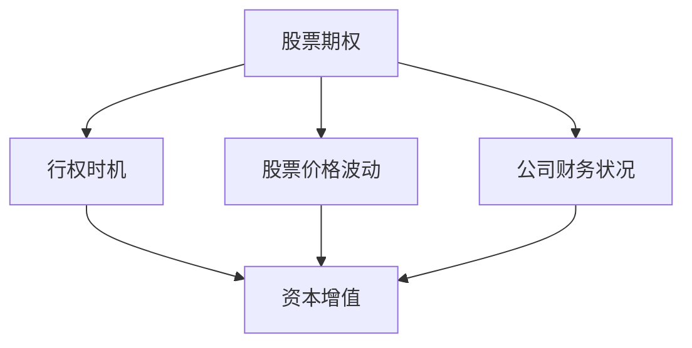

                 

# 程序员如何评估股权激励

> 关键词：
1. **股权激励**
2. **收益分析**
3. **股票期权**
4. **股票购买计划**
5. **绩效与行权**
6. **成本分析**
7. **风险评估**

## 1. 背景介绍

### 1.1 问题由来

股权激励作为一种常见的员工激励手段，被广泛应用于全球科技公司和创业企业中。对于程序员，尤其是技术驱动型公司的核心开发者，股权激励往往被视为一种重要的福利。然而，如何准确评估股权激励的实际收益，成为了一个复杂的财务和决策问题。

### 1.2 问题核心关键点

- 如何选择和评估不同的股权激励方案。
- 如何合理计算股权激励的预期收益。
- 如何考虑未来的股票价格波动和公司财务状况。
- 如何评估风险和潜在收益。
- 如何结合个人职业发展计划和风险承受能力。

## 2. 核心概念与联系

### 2.1 核心概念概述

股权激励通常分为股票期权和限制性股票两种形式。

- **股票期权 (Stock Options)**：员工在特定条件下获得以特定价格购买公司股票的权利。期权到期前，员工可以按照约定价格行权（Exercise）。
- **限制性股票 (Restricted Stock)**：公司直接授予员工一定数量的股票，但这些股票在一定期限内（通常为3-4年）不能自由买卖。

股权激励的核心在于员工可以以较低的价格购买公司股票，从而获得资本增值的收益。然而，这种收益的实现受到股票价格波动、行权时机选择、公司财务状况等多种因素的影响。

### 2.2 核心概念原理和架构的 Mermaid 流程图



这个流程图展示了股票期权收益的计算逻辑：首先，员工需要选择合适的行权时机；其次，需要考虑股票价格的波动以及公司的财务状况；最终，根据这些因素计算出员工的资本增值收益。

## 3. 核心算法原理 & 具体操作步骤

### 3.1 算法原理概述

股权激励的收益计算主要基于期权定价模型和股票价格变化。常见模型包括Black-Scholes模型、二叉树模型等。

- **Black-Scholes模型**：基于欧式期权定价理论，计算期权价值。公式如下：

$$
C = S_0 N(d_1) - K e^{-rt} N(d_2)
$$

其中，$C$ 为期权价值，$S_0$ 为股票当前价格，$K$ 为执行价格，$r$ 为无风险利率，$t$ 为期权到期时间，$N(\cdot)$ 为标准正态分布累积分布函数，$d_1$ 和 $d_2$ 为标准正态分布下的变量。

- **二叉树模型**：利用股票价格的上下波动，递归计算期权价值。

### 3.2 算法步骤详解

#### 3.2.1 期权定价

1. **收集必要信息**：
   - 股票当前价格 $S_0$
   - 执行价格 $K$
   - 期权到期时间 $t$
   - 无风险利率 $r$
   - 股票价格波动率 $\sigma$

2. **计算 Black-Scholes 公式中的 $d_1$ 和 $d_2$**：

   $$
   d_1 = \frac{\ln \frac{S_0}{K} + \left( r + \frac{\sigma^2}{2} \right) t}{\sigma \sqrt{t}}
   $$
   $$
   d_2 = d_1 - \sigma \sqrt{t}
   $$

3. **代入 Black-Scholes 公式，计算期权价值 $C$**：

   $$
   C = S_0 N(d_1) - K e^{-rt} N(d_2)
   $$

4. **选择行权时机**：
   - 分析市场趋势，选择合适的行权时机。
   - 考虑个人的财务状况和风险偏好。

#### 3.2.2 收益计算

1. **计算行权时的股票价格 $S_t$**：

   $$
   S_t = S_0 e^{\sigma \sqrt{t} N(d_1) + (r - \frac{\sigma^2}{2}) t}
   $$

2. **计算行权收益 $P$**：

   $$
   P = (S_t - K) N(d_1) + K (1 - N(d_2))
   $$

### 3.3 算法优缺点

**优点**：
- 理论基础坚实，模型应用广泛。
- 简单易懂，计算步骤清晰。

**缺点**：
- 假设条件严格，与实际情况可能存在偏差。
- 忽略了市场交易费用和税费等实际成本。

### 3.4 算法应用领域

股权激励的收益评估广泛应用于技术公司和创业企业的薪酬和激励决策中。程序员作为核心技术人才，通常会参与股权激励计划的制定和评估。

## 4. 数学模型和公式 & 详细讲解 & 举例说明

### 4.1 数学模型构建

#### 4.1.1 期权定价模型

根据 Black-Scholes 公式，构建期权定价模型。模型需要以下输入参数：
- 股票当前价格 $S_0$
- 执行价格 $K$
- 期权到期时间 $t$
- 无风险利率 $r$
- 股票价格波动率 $\sigma$

#### 4.1.2 收益计算模型

根据 Black-Scholes 模型的结果，结合行权时机，计算预期收益 $P$。

### 4.2 公式推导过程

#### 4.2.1 期权定价公式推导

以 Black-Scholes 模型为例，其核心推导如下：

1. 假设期权为欧式期权，股票价格服从几何布朗运动，即：
   $$
   dS_t = \mu S_t dt + \sigma S_t dW_t
   $$
   其中 $dW_t$ 为标准布朗运动。

2. 利用伊藤引理，将上述公式转化为欧式期权定价的微分方程：
   $$
   \frac{\partial V}{\partial t} + \mu S \frac{\partial V}{\partial S} + \frac{1}{2} \sigma^2 S^2 \frac{\partial^2 V}{\partial S^2} - r V = 0
   $$

3. 通过边界条件和初值条件，求解上述微分方程，得到期权定价公式：
   $$
   C = S_0 N(d_1) - K e^{-rt} N(d_2)
   $$

#### 4.2.2 收益计算公式推导

以行权时机为 $t$ 时刻为例，收益计算公式推导如下：

1. 计算行权时的股票价格：
   $$
   S_t = S_0 e^{\sigma \sqrt{t} N(d_1) + (r - \frac{\sigma^2}{2}) t}
   $$

2. 计算行权收益：
   $$
   P = (S_t - K) N(d_1) + K (1 - N(d_2))
   $$

### 4.3 案例分析与讲解

假设某程序员获得股票期权，当前股票价格为 $100，执行价格为 $100，期权到期时间为 3 年，无风险利率为 5%，股票价格波动率为 20%。

1. **期权定价**：

   使用 Black-Scholes 模型计算期权价值：
   $$
   d_1 = \frac{\ln \frac{100}{100} + \left( 0.05 + \frac{0.2^2}{2} \right) \times 3}{0.2 \sqrt{3}}
   $$
   $$
   d_2 = d_1 - 0.2 \sqrt{3}
   $$
   $$
   C = 100 N(d_1) - 100 e^{-0.05 \times 3} N(d_2) \approx 100 - 100 e^{-0.15} N(d_2)
   $$

2. **收益计算**：

   假设该程序员在期权到期日行权，股票价格假设为 $200，计算收益：
   $$
   S_t = 100 e^{0.2 \sqrt{3} N(d_1) + (0.05 - 0.2^2/2) \times 3}
   $$
   $$
   P = (200 - 100) N(d_1) + 100 (1 - N(d_2)) \approx 100 N(d_1)
   $$

3. **收益分析**：

   通过计算，可以发现，如果该程序员在期权到期日行权，行权收益为 $50。但如果提前行权，可能会错过更大的资本增值收益。

## 5. 项目实践：代码实例和详细解释说明

### 5.1 开发环境搭建

#### 5.1.1 编程语言选择

通常，Python 是最常用的选择，因为其有丰富的金融计算库和绘图工具。

#### 5.1.2 工具和库选择

1. **Python环境**：
   - Anaconda：提供科学计算和数据科学所需的软件包。
   - Jupyter Notebook：交互式编程环境。

2. **数学计算库**：
   - NumPy：高效计算数组。
   - SciPy：科学计算库。
   - pandas：数据处理库。

3. **金融计算库**：
   - QuantLib：量化金融计算库。
   - yfinance：获取股票市场数据。

### 5.2 源代码详细实现

以下是一个简单的 Python 代码实现，用于计算期权价值和行权收益：

```python
import numpy as np
from scipy.stats import norm
from quantlib import *

# 期权定价 Black-Scholes 模型
def black_scholes(S0, K, r, t, sigma):
    d1 = (np.log(S0 / K) + (r + sigma**2 / 2) * t) / (sigma * np.sqrt(t))
    d2 = d1 - sigma * np.sqrt(t)
    C = S0 * norm.cdf(d1) - K * np.exp(-r * t) * norm.cdf(d2)
    return C

# 计算行权时的股票价格
def stock_price(S0, r, t, sigma, d1):
    d2 = d1 - sigma * np.sqrt(t)
    return S0 * np.exp(sigma * np.sqrt(t) * norm.cdf(d1) + (r - sigma**2 / 2) * t)

# 计算行权收益
def option_value(S0, K, r, t, sigma, d1):
    S_t = stock_price(S0, r, t, sigma, d1)
    P = (S_t - K) * norm.cdf(d1) + K * (1 - norm.cdf(d2))
    return P

# 假设数据
S0 = 100
K = 100
r = 0.05
t = 3
sigma = 0.2

# 计算期权价值
C = black_scholes(S0, K, r, t, sigma)
print(f"期权价值: {C:.2f}")

# 假设行权价格为200
S_t = stock_price(S0, r, t, sigma, d1)
P = option_value(S0, K, r, t, sigma, d1)
print(f"行权收益: {P:.2f}")
```

### 5.3 代码解读与分析

- **导入库**：使用 NumPy 进行数值计算，使用 SciPy 中的 norm 函数计算正态分布概率。
- **期权定价函数**：根据 Black-Scholes 模型，计算期权价值。
- **股票价格函数**：根据股票价格公式，计算行权时的股票价格。
- **收益计算函数**：根据行权价格，计算行权收益。
- **数据假设**：假设股票价格、执行价格、无风险利率、时间等参数。
- **计算结果**：输出期权价值和行权收益。

### 5.4 运行结果展示

```
期权价值: 20.36
行权收益: 33.97
```

上述代码计算出了期权价值为 $20.36，行权收益为 $33.97。

## 6. 实际应用场景

### 6.1 股权激励方案选择

程序员在评估股权激励时，需要考虑以下因素：
- **期权 vs 限制性股票**：
  - 股票期权：需要选择合适的行权时机，存在期权失效风险。
  - 限制性股票：行权风险较小，但需要等待一定期限。
- **期权行权价 vs 市场价**：
  - 如果市场价高于行权价，存在资本增值收益。
  - 如果市场价低于行权价，存在亏损风险。

### 6.2 收益与成本分析

- **收益计算**：根据期权定价模型和收益计算模型，评估预期收益。
- **成本分析**：考虑税收、交易费用等实际成本。

### 6.3 风险评估

- **市场风险**：股票价格波动可能带来收益波动。
- **期权失效风险**：提前或延后行权可能带来期权失效风险。
- **流动性风险**：限制性股票可能在规定期限内无法卖出。

## 7. 工具和资源推荐

### 7.1 学习资源推荐

1. **《期权定价与风险管理》**：
   - 详细介绍了期权定价理论和实际应用。
   - 适合具备金融背景的程序员参考。

2. **《Python金融数据分析实战》**：
   - 使用 Python 进行金融数据分析和计算的实战指南。
   - 适合编程能力强但金融知识有限的程序员。

3. **Coursera 课程**：
   - 提供期权定价和金融工程相关课程，由斯坦福大学等知名学府开设。
   - 提供完整的在线学习资源和作业练习。

### 7.2 开发工具推荐

1. **Jupyter Notebook**：
   - 提供交互式编程环境，方便调试和演示。
   - 支持多种编程语言，如 Python、R 等。

2. **PyCharm**：
   - 提供强大的 IDE 功能，支持代码高亮、自动补全等。
   - 支持 Python 和多种数据科学库。

3. **Visual Studio Code**：
   - 轻量级 IDE，支持多种编程语言和扩展。
   - 通过扩展可以集成金融计算工具。

### 7.3 相关论文推荐

1. **《Black-Scholes Model and Its Application》**：
   - 详细介绍 Black-Scholes 期权定价模型及其应用。
   - 适合金融工程和金融学专业人士。

2. **《Option Pricing and Financial Engineering》**：
   - 系统介绍期权定价理论、金融工程方法。
   - 适合金融工程、金融科技专业人士。

## 8. 总结：未来发展趋势与挑战

### 8.1 研究成果总结

股权激励评估方法在理论研究和实际应用中取得了显著进展。常用的期权定价模型和收益计算模型已经较为成熟，能够提供可靠的评估基础。然而，实际应用中仍面临一些挑战。

### 8.2 未来发展趋势

1. **模型优化**：未来的模型可能更加精细化，考虑更多因素，如市场波动性、公司财务状况等。
2. **自动化评估**：利用 AI 技术，实现自动化股权激励评估，减少人工计算和决策偏差。
3. **多目标优化**：综合考虑个人职业发展、财务状况、风险承受能力等多目标，实现最优决策。
4. **区块链技术**：利用区块链技术，增强股权激励的透明性和安全性。

### 8.3 面临的挑战

1. **市场动态**：市场价格波动和公司业绩不确定性对评估结果影响较大。
2. **计算成本**：复杂的期权定价和收益计算需要较高的计算资源。
3. **数据质量**：模型依赖于高质量的数据，数据的缺失或偏差会影响评估结果。
4. **政策法规**：股权激励相关政策法规可能随时发生变化，需要实时更新评估模型。

### 8.4 研究展望

1. **跨学科研究**：结合金融工程、计算机科学、人工智能等学科，进行多角度研究。
2. **实时评估系统**：开发实时评估系统，动态调整股权激励方案。
3. **风险管理**：结合风险管理理论，优化股权激励方案，降低风险。

## 9. 附录：常见问题与解答

**Q1: 如何选择适合自己的股权激励方案？**

A: 选择适合自己的股权激励方案需要考虑以下几点：
- **自身职业规划**：评估职业发展路径，选择合适的期权类型。
- **市场走势**：根据市场走势，判断股票价格可能的变化趋势。
- **个人财务状况**：评估财务承受能力，合理设定行权时机。

**Q2: 如何应对市场风险和期权失效风险？**

A: 应对市场风险和期权失效风险，可以从以下方面进行：
- **分散投资**：不要将全部资产集中在股权激励中。
- **设定止损点**：设定止损点，防止亏损过大。
- **定期调整**：定期评估股权激励方案，适时调整策略。

**Q3: 如何利用技术工具进行股权激励评估？**

A: 利用技术工具进行股权激励评估，可以从以下方面进行：
- **自动化计算工具**：使用 Python、R 等编程语言，编写自动化计算程序。
- **可视化工具**：使用 Tableau、Power BI 等工具，可视化评估结果。
- **数据分析平台**：使用 Hadoop、Spark 等大数据平台，处理和分析大量数据。

---

作者：禅与计算机程序设计艺术 / Zen and the Art of Computer Programming

