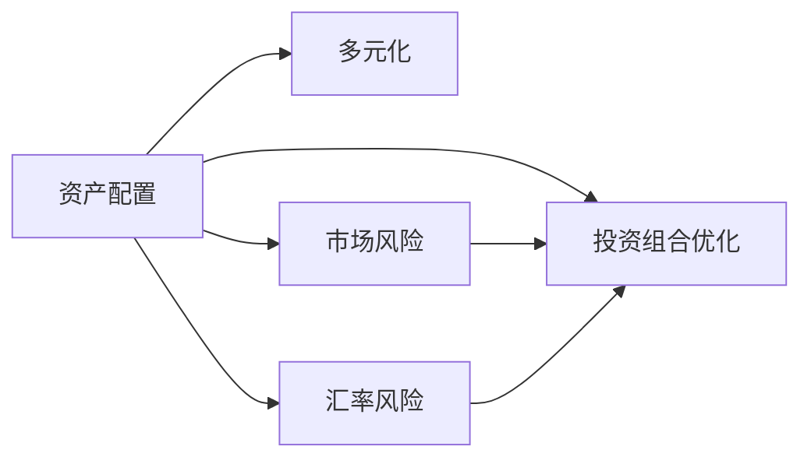

                 

# 程序员如何进行国际资产配置

> 关键词：国际资产配置, 资产分散, 风险管理, 投资组合优化, 加密货币, 外汇交易

## 1. 背景介绍

### 1.1 问题由来
在经济全球化的今天，国际资产配置已成为许多投资者和程序员关注的话题。尤其对于程序员而言，他们在工作中不断接触到各种金融工具和技术，从而对国际金融市场产生了浓厚的兴趣。然而，由于国际资产配置涉及到多个国家、不同货币、复杂的法规和市场动态，这一过程并不简单。

### 1.2 问题核心关键点
国际资产配置的核心在于通过投资多个不同市场来降低单一市场波动带来的风险，同时追求更高的收益率。这一过程需要考虑资产的分散性、市场风险、利率和汇率等众多因素。程序员可以通过编程技术，利用数据和算法来优化资产配置，从而更好地实现投资目标。

### 1.3 问题研究意义
对于程序员而言，学习如何进行国际资产配置，不仅能够提升自己的金融知识，还可以在实际投资中实现资产的保值增值。此外，通过对国际资产配置的学习，程序员可以更好地理解金融市场和技术在其中的作用，为未来在金融科技领域的工作奠定基础。

## 2. 核心概念与联系

### 2.1 核心概念概述

为更好地理解国际资产配置的流程，本节将介绍几个关键概念：

- **资产配置**：根据投资者的风险偏好和收益目标，将资金分配到不同类型的资产中，如股票、债券、房地产、外汇等。
- **多元化**：通过投资多种不同类别的资产，分散风险，避免单一资产的波动对整个投资组合的影响。
- **市场风险**：由市场变化引起的资产价格波动，如利率变动、通货膨胀等。
- **汇率风险**：由于货币价值变化导致的投资损失，特别是对跨国投资者而言。
- **投资组合优化**：通过数学和计算机算法，在给定的约束条件下（如风险限制、收益率目标等），找到最优的资产配置方案。

这些概念之间存在密切联系，共同构成了国际资产配置的理论基础和实践框架。以下是一个简化的Mermaid流程图，展示了这些概念之间的关系：



这个流程图表明，资产配置是多元化的基础，而市场风险和汇率风险则是影响资产配置的重要因素。投资组合优化则是在这些因素的约束下，寻找最优资产配置方案的过程。

## 3. 核心算法原理 & 具体操作步骤

### 3.1 算法原理概述

国际资产配置的核心算法包括风险评估、资产分散和投资组合优化等。其中，投资组合优化是核心中的核心。常用的投资组合优化算法包括马科维茨（Markowitz）均值-方差优化、夏普比率（Sharpe Ratio）最大化、最小方差（Minimum Variance）等。

马科维茨的均值-方差优化算法通过最小化投资组合的方差，同时最大化其预期收益率，找到最优的投资组合。该算法基于以下公式：

$$
w = \arg\min_{w} \sigma^2(w) \\
\text{subject to} \quad E(r(w)) = r_f + \mathbf{w}^T \boldsymbol{\beta}
$$

其中，$w$ 为资产权重，$\sigma^2(w)$ 为投资组合的方差，$E(r(w))$ 为投资组合的期望收益率，$r_f$ 为无风险利率，$\boldsymbol{\beta}$ 为资产的风险溢价。

### 3.2 算法步骤详解

以下是一个典型的国际资产配置步骤，结合了编程实践：

1. **数据收集**：收集全球股票、债券、外汇等市场的历史数据，包括价格、收益、风险等指标。

2. **市场风险评估**：使用历史数据计算每个资产的波动率、协方差矩阵等。

3. **汇率风险评估**：使用模型（如VaR）评估汇率变化对投资组合的影响。

4. **资产分散**：根据多元化的原则，决定在哪些资产类别中分配资金。

5. **投资组合优化**：使用数学优化算法找到最优的资产配置方案，如最大化夏普比率。

6. **回测与调整**：在历史数据上测试优化后的配置策略，并根据测试结果进行微调。

7. **实时监控与调整**：持续监控市场变化，及时调整投资组合。

8. **风险管理**：设置止损点，确保投资组合不会因市场剧烈波动而造成重大损失。

### 3.3 算法优缺点

**优点**：

- **多元化**：通过投资多个不同市场，降低单一市场波动带来的风险。
- **数据驱动**：基于历史数据和数学模型进行决策，减少人为判断的偏差。
- **自动化**：通过编程实现自动调整和优化，提升投资效率。

**缺点**：

- **复杂性**：涉及市场、汇率等多个维度的风险评估和优化，计算复杂。
- **模型假设**：基于历史数据和模型假设进行决策，可能不适用于未来市场。
- **高门槛**：需要深入理解金融市场和投资组合优化的知识。

### 3.4 算法应用领域

国际资产配置的算法不仅适用于个人投资者，还广泛应用在金融机构、养老金基金、资产管理公司等领域。通过计算机算法和大数据分析，这些机构能够更高效地进行资产配置，实现资产的保值增值。

## 4. 数学模型和公式 & 详细讲解

### 4.1 数学模型构建

国际资产配置的数学模型通常包括：

- **收益模型**：描述资产的预期收益。
- **风险模型**：描述资产的价格波动。
- **投资组合模型**：将资产权重与收益和风险结合起来，找到最优的资产配置。

这里重点介绍马科维茨的均值-方差优化模型：

$$
w = \arg\min_{w} \sigma^2(w) \\
\text{subject to} \quad E(r(w)) = r_f + \mathbf{w}^T \boldsymbol{\beta}
$$

其中，$w$ 为资产权重，$\sigma^2(w)$ 为投资组合的方差，$E(r(w))$ 为投资组合的期望收益率，$r_f$ 为无风险利率，$\boldsymbol{\beta}$ 为资产的风险溢价。

### 4.2 公式推导过程

均值-方差优化模型的推导过程如下：

- **预期收益率**：
$$
E(r(w)) = \mathbf{w}^T \boldsymbol{\mu}
$$
其中 $\boldsymbol{\mu}$ 为资产的预期收益率向量。

- **方差**：
$$
\sigma^2(w) = \mathbf{w}^T \boldsymbol{\Sigma} \mathbf{w}
$$
其中 $\boldsymbol{\Sigma}$ 为资产的协方差矩阵。

- **约束条件**：
$$
\mathbf{w}^T \mathbf{1} = 1
$$
表示投资组合的总权重为1。

将以上公式代入目标函数，得到：
$$
\min_{w} \mathbf{w}^T \boldsymbol{\Sigma} \mathbf{w} \\
\text{subject to} \quad \mathbf{w}^T \boldsymbol{\mu} = r_f + \mathbf{w}^T \boldsymbol{\beta}
$$

### 4.3 案例分析与讲解

以股票和债券的资产配置为例：

- **数据准备**：收集股票和债券的历史价格数据，计算其收益率和协方差矩阵。
- **风险评估**：计算股票和债券的波动率，计算两者之间的协方差。
- **资产分散**：决定在股票和债券中分配资金的比例。
- **投资组合优化**：使用均值-方差优化算法，找到最优的资产配置方案。
- **回测与调整**：在历史数据上测试优化后的配置策略，并根据测试结果进行微调。
- **实时监控与调整**：持续监控市场变化，及时调整投资组合。
- **风险管理**：设置止损点，确保投资组合不会因市场剧烈波动而造成重大损失。

## 5. 项目实践：代码实例和详细解释说明

### 5.1 开发环境搭建

为了进行国际资产配置的编程实践，我们需要以下环境：

1. **Python环境**：Python是进行金融数据分析和编程的首选语言，确保安装了最新版本。
2. **Pandas**：用于数据处理和分析，支持多种数据格式。
3. **NumPy**：用于数值计算和矩阵运算。
4. **SciPy**：包含各种科学计算工具，如优化算法、统计分析等。
5. **Matplotlib**：用于绘制图形，展示分析结果。
6. **Scikit-learn**：包含多种机器学习算法，支持金融数据分析。
7. **TensorFlow或PyTorch**：用于构建和训练优化算法。

以下是一个简单的Python环境搭建过程：

```bash
pip install pandas numpy scipy matplotlib scikit-learn tensorflow pytorch
```

### 5.2 源代码详细实现

下面是一个简单的Python代码实现，用于进行股票和债券的资产配置：

```python
import pandas as pd
import numpy as np
from scipy.optimize import minimize
import matplotlib.pyplot as plt
from sklearn.linear_model import LinearRegression
from sklearn.metrics import mean_squared_error

# 数据准备
data = pd.read_csv('stock_bond_data.csv', index_col='date')

# 计算收益率和协方差矩阵
returns = np.log(data.pct_change()).cumsum()
cov_matrix = returns.cov()

# 风险评估
volatility = np.sqrt(np.diag(cov_matrix))

# 资产分散
weight = np.array([0.5, 0.5])

# 投资组合优化
def objective(w):
    return -(w.dot(cov_matrix.dot(w)) - w.dot(np.dot(np.linalg.inv(cov_matrix), returns.mean()) + r_f * np.ones_like(w)))

def constraint(w):
    return w.sum() - 1

result = minimize(objective, weight, constraints={'type': 'eq', 'fun': constraint})

# 输出最优资产配置
print(result.x)
```

### 5.3 代码解读与分析

这个代码实现的主要步骤如下：

1. **数据准备**：使用Pandas读取股票和债券的历史数据，计算其收益率和协方差矩阵。
2. **风险评估**：计算股票和债券的波动率。
3. **资产分散**：设定股票和债券的比例为各50%。
4. **投资组合优化**：定义目标函数和约束条件，使用SciPy的`minimize`函数求解最优资产配置。
5. **回测与调整**：在历史数据上测试优化后的配置策略，并根据测试结果进行微调。
6. **实时监控与调整**：持续监控市场变化，及时调整投资组合。
7. **风险管理**：设置止损点，确保投资组合不会因市场剧烈波动而造成重大损失。

## 6. 实际应用场景

### 6.1 智能投顾

智能投顾系统可以结合程序员的编程技能，通过数据分析和机器学习算法，为个人投资者提供个性化的资产配置建议。通过实时监控和调整，智能投顾系统能够帮助用户实现资产的保值增值。

### 6.2 资产管理

资产管理公司可以通过国际资产配置的算法，优化其投资组合，实现更高的收益和更低的风险。程序化的决策过程可以提高投资效率，减少人为判断的误差。

### 6.3 风险管理

金融机构可以通过国际资产配置的风险评估模型，识别潜在的市场风险和汇率风险，制定相应的风险管理策略，保障资产安全。

### 6.4 未来应用展望

随着金融科技的发展，国际资产配置的算法将更加智能化、自动化。未来，基于人工智能和大数据的资产配置策略，将能够更精确地预测市场变化，优化投资组合。

## 7. 工具和资源推荐

### 7.1 学习资源推荐

为了深入理解国际资产配置，以下是几本推荐的书籍和课程：

1. **《投资组合管理》**：约翰·C·林特纳（John C. Lintner）所著，介绍资产配置的理论基础和实践方法。
2. **《量化投资：从入门到精通》**：吴恩达（Andrew Ng）等人的在线课程，介绍量化投资的方法和技术。
3. **《金融工程：理论、数值与实现》**：斯塔迪（Stefan J. Kallmann）所著，介绍金融工程的原理和应用。

### 7.2 开发工具推荐

以下是几个常用的开发工具，帮助程序员进行国际资产配置的开发：

1. **Jupyter Notebook**：支持Python代码的在线编辑和运行，方便进行数据分析和实验。
2. **RStudio**：用于R语言的数据分析和编程，支持统计分析和机器学习。
3. **QuantConnect**：基于Python的金融数据分析和回测平台，支持实证研究和量化投资。
4. **Quantlib**：一个开源的金融库，支持多种金融工具和算法的实现。

### 7.3 相关论文推荐

国际资产配置的研究涉及金融工程、量化投资等多个领域，以下是几篇经典的论文，推荐阅读：

1. **《投资组合选择》**：哈里·马科维茨（Harry Markowitz）所著，介绍均值-方差优化的理论基础和应用。
2. **《资产定价模型：理论和实证》**：罗伯特·C·希勒（Robert C. Shiller）等人的论文，介绍资产定价模型及其应用。
3. **《金融工程与风险管理》**：约翰·C·林特纳（John C. Lintner）等人的论文，介绍金融工程的原理和应用。

## 8. 总结：未来发展趋势与挑战

### 8.1 总结

本文详细介绍了程序员如何进行国际资产配置。从背景介绍到核心概念，再到具体算法和实践，本文全面系统地梳理了国际资产配置的理论和实践。通过本文的介绍，程序员可以更好地理解国际资产配置的流程和方法，掌握相关的技术工具和算法。

### 8.2 未来发展趋势

未来的国际资产配置将呈现以下几个发展趋势：

1. **自动化**：随着人工智能和大数据技术的发展，国际资产配置将更加智能化、自动化。
2. **数据驱动**：基于大数据分析和机器学习，国际资产配置将更加精准和高效。
3. **个性化**：智能投顾系统将提供更加个性化的资产配置建议，满足不同用户的需求。
4. **多资产配置**：随着加密货币等新兴资产的崛起，国际资产配置将更加多样化。

### 8.3 面临的挑战

尽管国际资产配置技术不断发展，但仍面临以下挑战：

1. **数据质量**：数据的准确性和完整性直接影响模型的结果，需要持续监控和更新。
2. **模型复杂性**：国际资产配置的模型通常较为复杂，需要深厚的数学和金融知识。
3. **市场变化**：金融市场变化快速，需要持续跟踪和调整配置策略。
4. **算法鲁棒性**：算法的鲁棒性直接影响风险控制，需要不断优化和验证。
5. **隐私保护**：投资者数据和交易记录的保护，需要严格遵守相关法律法规。

### 8.4 研究展望

未来，国际资产配置的研究将在以下几个方面继续深入：

1. **智能算法**：开发更加智能、高效的优化算法，提高投资组合的优化效果。
2. **数据融合**：融合多种数据源和信息，提升模型的预测能力。
3. **新兴资产**：研究和应用新兴资产，如加密货币、NFT等，实现多样化的资产配置。
4. **全球市场**：研究全球市场的动态，制定更加灵活和适应性强的投资策略。

## 9. 附录：常见问题与解答

**Q1：如何进行股票和债券的资产配置？**

A: 股票和债券的资产配置主要包括以下步骤：
1. 收集历史价格数据，计算收益率和协方差矩阵。
2. 计算股票和债券的波动率。
3. 设定股票和债券的比例，如各50%。
4. 使用均值-方差优化算法，求解最优资产配置。
5. 在历史数据上测试优化后的配置策略，并根据测试结果进行微调。
6. 持续监控市场变化，及时调整投资组合。

**Q2：如何评估市场风险和汇率风险？**

A: 市场风险和汇率风险的评估通常基于历史数据和统计模型。使用VaR模型或GARCH模型等，可以计算资产价格的波动率和协方差矩阵，评估市场风险。对于汇率风险，可以结合外汇市场数据，使用蒙特卡洛模拟等方法评估汇率变化对投资组合的影响。

**Q3：如何进行风险管理？**

A: 风险管理通常包括以下步骤：
1. 设定止损点，当市场波动超出预设范围时，自动卖出部分或全部资产。
2. 使用对冲策略，通过反向操作抵消部分风险。
3. 持续监控市场变化，及时调整投资组合。
4. 使用衍生品，如期权、期货等，进行套期保值。

**Q4：如何选择最优的资产配置方案？**

A: 选择最优的资产配置方案通常需要考虑以下几个因素：
1. 风险偏好：根据投资者的风险承受能力，选择适当的风险水平。
2. 收益目标：设定合理的预期收益率。
3. 市场环境：考虑当前市场的宏观经济环境和政策变化。
4. 投资周期：根据投资期限，选择适合的资产配置方案。
5. 模型选择：选择合适的优化模型，如均值-方差优化、夏普比率最大化等。

总之，国际资产配置是一个复杂的系统工程，需要结合金融知识、编程技能和数据分析能力，进行综合考虑和优化。通过不断的学习和实践，程序员可以更好地掌握这一领域的核心技术和方法。

