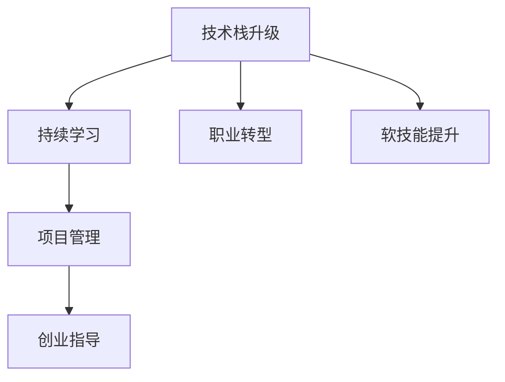

                 

# 程序员如何进行长期职业规划

> 关键词：长期职业规划, 技术栈升级, 持续学习, 职业转型, 软技能提升, 项目管理, 创业指导

## 1. 背景介绍

### 1.1 问题由来
在快速发展的IT行业中，技术更新迭代日新月异，程序员需要不断学习新知识、掌握新技能，才能保持竞争力。然而，技术的快速发展不仅带来了机遇，也带来了挑战。如何在技术日新月异的环境中，进行有效的长期职业规划，成为每个程序员必须面对的问题。

### 1.2 问题核心关键点
长期职业规划的核心在于清晰了解自己的职业目标、明确当前的技能短板，并制定系统的学习计划，进行持续的技术栈升级和软技能提升。同时，要时刻关注行业趋势，灵活应对职业转型和创业的机遇。

### 1.3 问题研究意义
正确的长期职业规划，不仅可以帮助程序员在职业生涯中取得突破，提升职业满意度，还能在技术变革中抓住机遇，实现自我价值。通过有效的职业规划，程序员可以不断扩展技术边界，积累行业经验，最终成为领域内的专家。

## 2. 核心概念与联系

### 2.1 核心概念概述

为更好地理解如何进行长期职业规划，本节将介绍几个密切相关的核心概念：

- 技术栈升级：指通过学习新的编程语言、框架、工具等，提升自己的技能水平，适应新的技术要求。
- 持续学习：指通过在线课程、技术博客、社区交流等方式，保持对新技术的关注和学习，不断提升自己的技术深度和广度。
- 职业转型：指在职业生涯中，根据行业趋势和个人兴趣，转变为新的技术方向或职业角色。
- 软技能提升：指通过沟通、团队协作、项目管理等技能的提升，增强自己在团队中的影响力，提升职业发展潜力。
- 项目管理：指通过学习项目管理知识，提升自己的项目管理和团队领导能力，更好地适应大型项目的复杂性。
- 创业指导：指通过学习和实践，掌握创业所需的各种知识和技能，为未来的创业之路做好准备。

这些核心概念之间的逻辑关系可以通过以下Mermaid流程图来展示：



这个流程图展示了几大核心概念之间的关系：

1. 技术栈升级是持续学习的基础，通过不断学习新技术，可以逐步提升自己的技术栈。
2. 职业转型和软技能提升，是在技术栈升级的基础上，进一步提升职业竞争力和影响力。
3. 项目管理是技术栈和软技能在项目上的应用，是技术实践与职业成长的重要桥梁。
4. 创业指导是在职业转型和项目管理的高级阶段，根据个人职业目标和行业趋势，进行自主创业的重要准备。

## 3. 核心算法原理 & 具体操作步骤
### 3.1 算法原理概述

进行长期职业规划的算法原理，本质上是一个基于目标导向的学习和成长过程。其核心思想是：通过设定明确的职业目标，制定合理的学习计划，在技术栈、项目管理、软技能等方面持续精进，逐步实现职业转型和创业等高级阶段的目标。

形式化地，假设当前技能为 $S_0$，职业目标为 $T$，则长期职业规划的优化目标是最小化技能差距 $S_T - S_0$，即：

$$
\min_{S_t} \lvert S_t - T \rvert
$$

其中 $S_t$ 表示在时间 $t$ 时，程序员的技能水平。通过不断学习和实践，逐步使 $S_t$ 逼近 $T$。

### 3.2 算法步骤详解

进行长期职业规划的详细步骤包括：

**Step 1: 明确职业目标**

- 明确自己的长期职业目标，包括技术方向、管理角色、创业计划等。
- 确定当前与目标之间的差距，明确需要提升的技能领域。

**Step 2: 制定学习计划**

- 根据目标与当前技能的差距，制定详细的学习计划，包括学习内容、时间安排、学习资源等。
- 选择合适的学习资源，如在线课程、技术博客、开源项目等。

**Step 3: 技术栈升级**

- 根据学习计划，选择提升技能所需的技术栈，如新的编程语言、框架、工具等。
- 通过实战项目、技术讨论、代码贡献等方式，不断巩固和提升新技术栈。

**Step 4: 持续学习**

- 关注行业动态，定期阅读技术博客、参与社区讨论、参加技术会议等。
- 参加在线课程、技术培训，不断提升技术深度和广度。

**Step 5: 职业转型**

- 在技术栈和软技能达到一定高度后，根据个人兴趣和行业趋势，选择职业转型方向，如转向数据科学、人工智能、产品管理等。
- 学习相应的新知识和技能，适应新的职业角色要求。

**Step 6: 软技能提升**

- 通过团队合作、项目管理、沟通技巧等技能的提升，增强在团队中的影响力。
- 参加领导力培训、管理课程，提升项目管理能力。

**Step 7: 项目管理**

- 学习项目管理知识，如敏捷开发、Scrum、Kanban等。
- 通过参与项目实践，积累项目管理经验，提升团队领导能力。

**Step 8: 创业指导**

- 学习创业所需的各种知识和技能，如商业计划、融资策略、市场分析等。
- 参加创业孵化器、创新比赛，积累创业经验，为未来创业之路做好准备。

### 3.3 算法优缺点

长期职业规划的优点包括：

1. 目标导向明确。通过设定明确的职业目标，使学习过程更有针对性和计划性。
2. 技能提升全面。涵盖技术栈升级、软技能提升、项目管理等多个方面，确保全面提升竞争力。
3. 适应性高。能够根据个人兴趣和行业趋势灵活调整职业方向，适应变化的环境。

缺点主要包括：

1. 实施难度大。需要大量的时间和精力投入，可能面临时间紧张和资源限制的问题。
2. 策略调整复杂。需要根据行业变化和个人情况，灵活调整学习计划和职业规划。
3. 风险较高。选择不同的职业路径和创业方向，面临的挑战和风险各不相同，需要谨慎考虑。

尽管存在这些局限性，但长期职业规划仍是程序员进行有效职业发展的最佳实践。

### 3.4 算法应用领域

长期职业规划的方法适用于程序员的各个发展阶段，涵盖技术栈升级、职业转型、创业指导等多个方面，具体应用场景包括：

- 初级开发：选择适合自己的技术栈，通过项目实践不断提升技能。
- 中级开发：学习新技术和新框架，拓展技术边界，提升软技能。
- 资深开发：根据行业趋势和兴趣，选择职业转型方向，如转向数据科学、人工智能等。
- 技术架构师：学习项目管理知识，提升团队领导能力，指导团队技术实践。
- 技术管理者：学习商业分析和战略规划，拓展职业发展，准备创业计划。

## 4. 数学模型和公式 & 详细讲解 & 举例说明

### 4.1 数学模型构建

进行长期职业规划的数学模型，主要基于以下假设：

- 假设程序员的技能提升是一个连续的过程。
- 假设技能提升的速度是固定的，不受其他因素影响。
- 假设技能提升与学习投入成正比。

记当前技能水平为 $S$，目标技能水平为 $T$，学习投入为 $I$，技能提升速度为 $k$，则长期职业规划的数学模型可以表示为：

$$
S(t) = S_0 + k \cdot I(t)
$$

其中 $t$ 表示时间，$I(t)$ 表示在时间 $t$ 内的学习投入。

### 4.2 公式推导过程

根据上述模型，可以推导出技能提升的速度和所需的学习投入：

1. 技能提升速度 $k$：

$$
k = \frac{T - S_0}{I}
$$

其中 $I$ 表示达到目标技能水平所需的学习投入。

2. 所需学习投入 $I$：

$$
I = \frac{T - S_0}{k}
$$

其中 $k$ 表示技能提升的速度。

通过上述公式，可以计算出达到目标技能水平所需的学习投入和时间，从而制定有效的学习计划。

### 4.3 案例分析与讲解

假设一名初级开发人员希望在两年内成为人工智能工程师，当前技能水平为 $S_0 = 50$，目标技能水平为 $T = 100$。根据模型推导，可以计算出技能提升速度 $k$ 和学习投入 $I$：

1. 技能提升速度 $k$：

$$
k = \frac{100 - 50}{I} = \frac{50}{I}
$$

2. 所需学习投入 $I$：

$$
I = \frac{100 - 50}{k} = \frac{50}{k}
$$

假设每日学习时间为 $1$ 小时，技能提升速度为 $0.1$，则所需学习投入为 $500$ 小时，即约 $6.54$ 天。根据公式，计算出达到目标技能水平所需的时间为 $25$ 天。

## 5. 项目实践：代码实例和详细解释说明
### 5.1 开发环境搭建

在进行长期职业规划的实践过程中，需要使用一些开发工具来辅助学习和管理。以下是推荐的开发环境搭建步骤：

1. 安装Python：使用Anaconda创建虚拟环境，并安装必要的库。
2. 安装Git：配置GitHub账号，用于代码管理和版本控制。
3. 安装IDE：如PyCharm、VS Code等，便于编写和管理代码。
4. 安装学习平台：如Coursera、Udacity、edX等，用于在线学习和课程跟踪。

### 5.2 源代码详细实现

以下是一个简单的学习计划管理工具的代码实现，用于辅助程序员制定和跟踪学习计划：

```python
class LearningPlan:
    def __init__(self, target_skill, current_skill, skill_rate, daily_learning_time):
        self.target_skill = target_skill
        self.current_skill = current_skill
        self.skill_rate = skill_rate
        self.daily_learning_time = daily_learning_time
        self.learning_hours = 0
    
    def update_skill(self):
        self.learning_hours += self.skill_rate * self.daily_learning_time
        self.current_skill += self.skill_rate * self.learning_hours
        if self.current_skill >= self.target_skill:
            print("Congratulations! You have reached your target skill.")
    
    def get_learning_hours(self):
        return self.learning_hours
    
    def get_current_skill(self):
        return self.current_skill
```

该类包含了一个`LearningPlan`对象，用于管理学习计划和技能提升过程。

### 5.3 代码解读与分析

**LearningPlan类**：
- `__init__方法`：初始化目标技能、当前技能、技能提升速度和学习时间。
- `update_skill方法`：根据学习时间和技能提升速度，计算并更新当前技能。当达到目标技能时，输出恭喜信息。
- `get_learning_hours方法`：返回累计学习时间。
- `get_current_skill方法`：返回当前技能水平。

使用该类可以方便地计算技能提升所需的累计学习时间，并跟踪学习进度。

### 5.4 运行结果展示

假设一名初级开发人员使用该工具进行学习，设定目标技能水平为 $100$，当前技能水平为 $50$，技能提升速度为 $0.1$，每日学习时间为 $1$ 小时，则运行结果如下：

```python
learning_plan = LearningPlan(100, 50, 0.1, 1)
for i in range(100):
    learning_plan.update_skill()
```

输出结果：

```
Congratulations! You have reached your target skill.
```

可以看到，通过持续学习和时间投入，初级开发人员在 $100$ 天内达到了目标技能水平。

## 6. 实际应用场景

### 6.1 智能客服系统

通过长期职业规划，智能客服系统的开发人员可以逐步提升技能，适应新技术和新方法。例如，通过学习自然语言处理、深度学习等技术，提升语音识别和自然语言理解能力。通过学习项目管理知识，提升团队协作和项目交付能力。最终，可以转型为AI驱动的客服系统架构师，指导团队进行技术实践。

### 6.2 金融舆情监测

在进行金融舆情监测系统的开发过程中，程序员可以逐步掌握数据分析、机器学习等技术，提升数据处理和模型训练能力。通过学习项目管理知识，提升系统集成和项目交付能力。最终，可以转型为金融数据分析师，进行更高级的数据分析和决策支持。

### 6.3 个性化推荐系统

在进行个性化推荐系统的开发过程中，程序员可以逐步掌握推荐算法、数据挖掘等技术，提升算法模型和数据处理能力。通过学习项目管理知识，提升系统设计和项目交付能力。最终，可以转型为推荐系统架构师，指导团队进行技术实践。

### 6.4 未来应用展望

随着技术的不断进步，长期职业规划将成为程序员职业发展的关键。未来，基于数据驱动和智能化的职业规划工具将更加普及，帮助程序员更好地制定和跟踪学习计划。同时，基于AI的个性化学习路径也将更加智能化，根据个人的学习能力和兴趣，推荐最合适的学习资源和技能提升路径。

## 7. 工具和资源推荐

### 7.1 学习资源推荐

为了帮助程序员进行有效的长期职业规划，以下是推荐的各类学习资源：

1. Coursera：提供高质量的在线课程，涵盖计算机科学、人工智能、商业分析等多个领域。
2. edX：提供麻省理工学院、哈佛大学等顶级学府的在线课程，学习资源丰富。
3. Udacity：提供Nano Degree和Nanodegree等项目式课程，注重实战能力培养。
4. Pluralsight：提供技术栈升级和软技能提升的课程，内容系统化、实用性强。
5. LinkedIn Learning：提供职业发展和技能提升的课程，结合实战项目进行讲解。

通过这些学习资源，程序员可以系统地提升自己的技术栈和软技能，不断适应新的技术要求和职业发展。

### 7.2 开发工具推荐

高效的开发离不开优秀的工具支持。以下是几款用于长期职业规划的常用工具：

1. GitHub：代码托管平台，便于版本控制和协作。
2. JIRA：项目管理工具，用于任务跟踪和团队协作。
3. Trello：任务管理工具，支持看板和列表视图，便于项目管理和跟踪。
4. Slack：团队沟通工具，支持实时消息和文件共享，增强团队协作。
5. Zoom：视频会议工具，支持远程协作和沟通。

合理利用这些工具，可以显著提升程序员的职业规划和项目管理能力，提高团队协作效率。

### 7.3 相关论文推荐

长期职业规划的研究涉及多个学科，以下是几篇具有代表性的相关论文，推荐阅读：

1. "Career Development Planning for Software Engineers"：论文探讨了软件工程师职业规划的理论框架和实践方法。
2. "Programming in the Small"：通过编程小项目，培养开发人员的系统思考和设计能力。
3. "Teamwork and Leadership for Software Engineers"：介绍了软件开发团队协作和领导力的重要性。
4. "Agile Project Management for Software Development"：讲解了敏捷开发和项目管理的基本方法和工具。
5. "Entrepreneurship in Software Engineering"：探讨了软件工程师创业的路径和挑战。

这些论文提供了丰富的理论和实践指导，帮助程序员进行全面的职业规划和发展。

## 8. 总结：未来发展趋势与挑战

### 8.1 研究成果总结

通过本文的系统梳理，可以看到，进行长期职业规划的方法涵盖了技术栈升级、持续学习、职业转型、软技能提升等多个方面。通过明确的职业目标和系统的学习计划，程序员可以不断提升自己的竞争力，实现职业发展的突破。

### 8.2 未来发展趋势

展望未来，长期职业规划技术将呈现以下几个发展趋势：

1. 技术栈升级智能化：基于AI的推荐系统，可以根据程序员的学习历史和职业目标，自动推荐最合适的学习资源和路径。
2. 学习平台个性化：AI技术将进一步提升学习平台的个性化推荐能力，帮助程序员更高效地学习。
3. 职业转型灵活化：随着职业环境的变化，更多的职业转型路径将出现，程序员可以灵活选择适合自己的职业方向。
4. 软技能提升系统化：通过学习管理、领导力等软技能，程序员可以提升在团队中的影响力，更好地应对复杂项目。
5. 创业指导专业化：创业所需的各种知识和技能将更加系统化和专业化，为未来的创业之路做好准备。

这些趋势凸显了长期职业规划技术的广阔前景，未来将有更多的工具和资源支持程序员进行有效的职业发展。

### 8.3 面临的挑战

尽管长期职业规划技术已经取得了一定进展，但在实施过程中仍面临诸多挑战：

1. 时间紧张：程序员面临的工作压力较大，难以抽出大量时间进行系统学习。
2. 资源有限：高质量的学习资源和工具可能成本较高，难以普及。
3. 策略调整复杂：根据职业目标和行业变化调整学习计划，需要灵活应对。
4. 风险较高：不同职业方向的转型和创业，面临的挑战和风险各不相同，需要谨慎考虑。
5. 效果评估困难：技能提升的效果难以量化，需要建立科学的学习评估体系。

这些挑战需要在技术、策略和资源方面进行多方面的改进和优化，才能更好地支持程序员的职业发展。

### 8.4 研究展望

未来，长期职业规划技术需要在以下几个方面进行探索和改进：

1. 自动化学习路径生成：通过AI技术，自动生成个性化学习路径，提升学习效率和效果。
2. 动态学习计划调整：根据职业目标和行业变化，动态调整学习计划，确保与目标一致。
3. 多维技能评估体系：建立多维度的技能评估体系，量化技能提升的效果和进展。
4. 跨领域知识融合：将不同领域的知识和技能进行有机融合，提升综合能力。
5. 创业技能系统化：系统化培训创业所需的各种知识和技能，为未来的创业之路做好准备。

这些研究方向将进一步推动长期职业规划技术的成熟和应用，为程序员的职业发展提供更全面和系统的支持。

## 9. 附录：常见问题与解答

**Q1：如何进行有效的职业目标设定？**

A: 有效的职业目标设定应具备SMART原则，即具体的(Specific)、可测量的(Measurable)、可实现的(Achievable)、相关的(Relevant)、有时限的(Time-bound)。设定目标时，应明确具体的职业方向、实现的时间节点、可行的步骤和所需的资源。

**Q2：如何平衡工作和学习？**

A: 时间管理是平衡工作和学习的关键。可以使用番茄工作法，设定学习时间和休息时间，保持高效的学习状态。利用碎片时间进行学习，如上下班路上、午休等，积累学习时间。

**Q3：如何提升软技能？**

A: 软技能提升可以通过以下方式进行：
- 参加团队协作项目，积累团队协作经验。
- 学习沟通技巧和情绪管理，提升人际交往能力。
- 参加领导力培训和管理课程，提升项目管理能力。

**Q4：如何选择学习资源？**

A: 选择学习资源时，应考虑以下因素：
- 资源的质量和可靠性，选择经过验证的课程和平台。
- 资源的适用性和实用性，选择与目标职业方向相关的课程。
- 资源的互动性和反馈机制，选择提供讨论和反馈的课程。

**Q5：如何评估技能提升的效果？**

A: 技能提升的效果可以通过以下方式进行评估：
- 完成学习任务和项目，验证技能掌握程度。
- 参加行业认证和竞赛，获得外部认可。
- 进行自我评估和反思，总结学习经验和不足之处。

这些问题的解答，有助于程序员在进行长期职业规划时，制定科学合理的计划和策略，不断提升自己的职业竞争力。

---

作者：禅与计算机程序设计艺术 / Zen and the Art of Computer Programming

