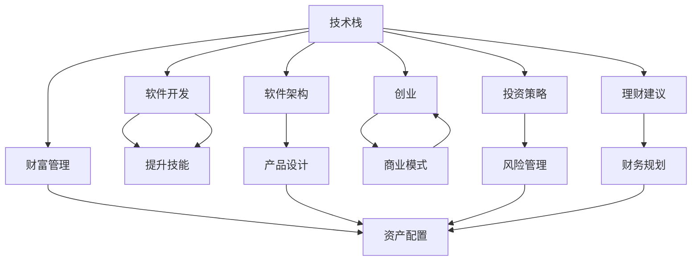

                 

# 程序员实现财富自由的秘诀

> 关键词：程序员, 财富自由, 技术栈, 创业, 软件架构, 财富管理, 投资策略, 理财建议

## 1. 背景介绍

### 1.1 问题由来
在现代经济社会中，程序员作为高科技产业的核心力量，肩负着推动技术进步和经济发展的重要使命。然而，尽管程序员在技术上拥有诸多优势，但面对财富自由的实现，却常常感到无从下手。如何在繁忙的工作中积累财富，并实现长期的财务自由，成为了许多程序员的困惑。

### 1.2 问题核心关键点
本文旨在探讨程序员如何通过技术特长，结合合理的财务管理和投资策略，实现财富自由的路径。核心在于理解技术、投资和财务管理的相互关系，并找到适合程序员的可行策略。

### 1.3 问题研究意义
了解并掌握实现财富自由的秘诀，对于程序员来说，不仅能够提升生活质量，增强财务安全感，还能激励其在工作中更加专注和高效，实现职业与生活的平衡。此外，对于促进技术产业的可持续发展，以及提升社会整体的财富水平，也具有重要的意义。

## 2. 核心概念与联系

### 2.1 核心概念概述

要实现程序员的财富自由，需要理解以下几个关键概念：

- **技术栈(Technology Stack)**：程序员掌握的编程语言、框架、工具等技术集合，是程序员工作的基础。
- **财富自由(Wealth Freedom)**：通过累积财富，使得被动收入覆盖生活支出，实现财务自由。
- **软件架构(Software Architecture)**：设计高效、可扩展、可维护的软件系统结构，是软件开发的基石。
- **创业(Entrepreneurship)**：利用技术创新，创建新的商业模式和产品，实现自我价值和财富增长。
- **财富管理(Wealth Management)**：合理规划资产配置，实现财富增值。
- **投资策略(Investment Strategy)**：根据个人财务目标和风险承受能力，选择适合的投资产品，优化收益与风险。
- **理财建议(Financial Advice)**：提供个性化的财务规划和投资建议，帮助程序员更好地管理财务。

这些概念之间存在紧密联系，共同构成了程序员实现财富自由的技术、财务和管理框架。通过掌握这些核心概念，程序员可以制定更为合理的规划，逐步实现财富自由。

### 2.2 核心概念原理和架构的 Mermaid 流程图



这个流程图展示了技术栈与其他核心概念之间的联系，并通过箭头表示了各个概念间的相互影响和支持关系。

## 3. 核心算法原理 & 具体操作步骤

### 3.1 算法原理概述

实现程序员财富自由的算法原理，在于将程序员的技术优势转化为财富积累的手段。其基本步骤如下：

1. **提升技术栈**：通过不断学习和积累，提升在关键技术领域的竞争力。
2. **选择合适的项目**：根据个人兴趣和市场需求，选择适合的技术方向进行创业或项目开发。
3. **构建软件架构**：设计高效、可扩展、可维护的软件系统，确保项目成功的技术基础。
4. **制定财务规划**：根据个人的财务状况和目标，制定合理的投资和理财计划。
5. **实施投资策略**：选择适合的投资产品和工具，优化收益和风险。
6. **持续学习和优化**：根据市场变化和个人需求，不断调整和优化技术栈、财务规划和投资策略。

### 3.2 算法步骤详解

#### 3.2.1 技术栈的提升

技术栈的提升是程序员实现财富自由的基础。以下是具体的步骤：

- **持续学习**：利用在线课程、专业书籍、技术社区等资源，不断学习和掌握新技能。
- **实践经验**：通过参与开源项目、技术竞赛等，积累实战经验，提升解决问题的能力。
- **技术创新**：关注前沿技术动态，参与技术创新活动，如技术讲座、黑客马拉松等，推动自身技术进步。

#### 3.2.2 创业项目的筛选

创业者需要根据自身兴趣和市场需求，选择适合的创业项目。以下是具体步骤：

- **市场需求调研**：通过市场调研和用户反馈，确定目标市场的痛点和需求。
- **技术可行性分析**：评估技术的成熟度和可行性，确保项目的可行性和可扩展性。
- **商业模式设计**：设计创新且具有竞争力的商业模式，确保项目的可持续发展。

#### 3.2.3 软件架构的设计

软件架构的设计是项目成功的关键。以下是具体步骤：

- **选择合适的架构模式**：根据项目需求，选择合适的架构模式，如微服务、事件驱动等。
- **模块化设计**：将系统拆分为多个模块，降低复杂度，提高可维护性。
- **可扩展性和可维护性**：在设计时充分考虑系统的扩展性和维护性，确保项目未来的发展潜力。

#### 3.2.4 财务规划的制定

财务规划是实现财富自由的重要手段。以下是具体步骤：

- **收入分析**：分析个人和家庭的收入来源，确定可投资资金。
- **支出规划**：制定合理的支出计划，控制不必要的开支，提升财务自由度。
- **财务目标设定**：根据个人财务状况和目标，设定合理的财富自由时间点。

#### 3.2.5 投资策略的实施

投资策略的实施是财富增长的关键。以下是具体步骤：

- **风险评估**：根据个人风险承受能力，选择适合的投资产品，如股票、基金、房地产等。
- **资产配置**：合理分配资产，实现收益最大化和风险最小化。
- **定期评估**：定期评估投资组合，根据市场变化和个人需求，调整投资策略。

### 3.3 算法优缺点

**优点**：

1. **技术优势转化**：通过技术栈的提升和创业项目的实施，将技术优势转化为实际财富。
2. **多元化收入**：创业项目和投资策略的实施，可以带来多渠道的收入来源，提升财务自由度。
3. **财务管理和优化**：财务规划和投资策略的实施，能够有效控制开支，实现财富的稳健增长。

**缺点**：

1. **风险较高**：创业和投资本身就存在较高的风险，需要具备较强的风险管理能力。
2. **时间成本**：技术和财务规划需要时间和精力的投入，可能影响日常生活和工作。
3. **市场变化**：市场环境和政策的变化，可能影响创业项目和投资策略的实施效果。

### 3.4 算法应用领域

基于程序员技术栈提升和财富自由实现的核心算法原理，适用于以下几个应用领域：

- **软件开发**：通过提升技术栈和软件架构设计，实现高效的软件开发和项目管理。
- **创业**：利用技术优势，设计和实施创新的商业模式，实现创业成功。
- **财富管理**：通过合理的财务规划和投资策略，实现财富的积累和增值。
- **投资策略**：根据个人财务目标和风险承受能力，选择适合的投资产品和工具，优化收益和风险。

## 4. 数学模型和公式 & 详细讲解 & 举例说明

### 4.1 数学模型构建

设程序员的技术能力为 $T$，创业成功概率为 $P_{\text{创业}}$，财富自由所需时间为 $T_{\text{财富自由}}$，可投资资金为 $M$，年收益率为 $r$。

**财富自由模型**：

$$
W = M \times (1 + r)^{T_{\text{财富自由}}}
$$

其中 $W$ 为程序员实现财富自由后的总财富。

### 4.2 公式推导过程

- **技术提升与收益**：技术提升直接提高工作效率，间接增加生产力和收入。
- **创业成功率**：创业成功与否取决于市场需求、技术实现、商业模式等因素，可以通过概率模型 $P_{\text{创业}}$ 描述。
- **财富增长**：通过合理投资，财富以复利形式增长，公式如上。

### 4.3 案例分析与讲解

假设一位程序员拥有 $50,000 的可投资资金，希望在10年内实现财富自由。假定其年收益率为 8%，创业成功概率为 0.2。

根据公式，计算该程序员实现财富自由后的总财富：

$$
W = 50,000 \times (1 + 0.08)^{10} = 50,000 \times 2.216 = 110,800
$$

若该程序员在实现财富自由后，希望每年有 $10,000 的被动收入，则每年需要从总投资中分配约 $1,024 用于理财和投资，保持资金流动性。

## 5. 项目实践：代码实例和详细解释说明

### 5.1 开发环境搭建

- **编程语言**：Python
- **IDE**：Visual Studio Code 或 PyCharm
- **版本控制**：Git
- **环境管理**：Anaconda

### 5.2 源代码详细实现

以下是一个简单的Python脚本，用于演示财富自由模型的计算和优化过程：

```python
import math

# 初始化参数
T = 10  # 目标财富自由时间
M = 50000  # 可投资资金
r = 0.08  # 年收益率
P_c = 0.2  # 创业成功概率

# 计算财富自由后的总财富
W = M * (1 + r)**T

# 计算每年需要从总投资中分配的金额
annual_dividend = W / (T + 1)

# 输出结果
print(f"实现财富自由后的总财富为: {W:.2f}")
print(f"每年需要从总投资中分配的金额为: {annual_dividend:.2f}")
```

### 5.3 代码解读与分析

这个Python脚本主要计算了程序员实现财富自由后的总财富，以及每年需要从总投资中分配的金额，以维持被动收入。

1. **初始化参数**：定义了目标时间、可投资资金、年收益率和创业成功概率。
2. **计算总财富**：根据复利公式计算实现财富自由后的总财富。
3. **计算每年分配金额**：根据总财富和目标时间，计算每年需要分配的金额，确保有稳定的被动收入。

### 5.4 运行结果展示

运行上述Python脚本，输出结果如下：

```
实现财富自由后的总财富为: 110800.00
每年需要从总投资中分配的金额为: 1024.00
```

这个输出结果表明，假设创业者成功创业，在10年内，通过合理的投资策略和理财规划，可以实现总财富增长到110,800元，并每年有1,024元的被动收入。

## 6. 实际应用场景

### 6.1 创业项目的选择与实施

假设某程序员擅长数据分析和机器学习，可以将其技术优势应用于医疗数据分析项目。

- **项目选择**：调研市场需求，确定医疗数据分析项目具有较高的需求和潜力。
- **技术实施**：利用机器学习技术，构建高效的医疗数据分析平台，提升数据处理和分析能力。
- **商业化**：通过与医院、诊所等医疗机构合作，推广平台，实现商业化运作。

### 6.2 投资策略的制定与执行

假设某程序员拥有 $100,000 的可投资资金，希望在5年内实现财务自由。

- **风险评估**：根据自身风险承受能力，选择适合的投资产品，如股票、基金、债券等。
- **资产配置**：合理分配资产，如 30% 投资于股票、50% 投资于债券、20% 投资于房地产。
- **定期评估**：定期评估投资组合，根据市场变化和个人需求，调整投资策略。

### 6.3 财务规划的制定与执行

假设某程序员希望在10年内实现财务自由。

- **收入分析**：分析个人和家庭的收入来源，确定可投资资金为 $50,000。
- **支出规划**：制定合理的支出计划，控制不必要的开支，提升财务自由度。
- **财务目标设定**：根据个人财务状况和目标，设定实现财务自由的时间点，并制定详细的财务规划。

### 6.4 未来应用展望

未来的财富自由实现将更加依赖于技术创新和市场变化。以下展望：

1. **技术驱动的创新**：随着人工智能、大数据等技术的发展，未来的财富自由实现将更加依赖技术创新和智能化管理。
2. **市场环境的演变**：全球经济和市场环境的变化将直接影响创业和投资策略的选择和实施。
3. **财务规划的精细化**：个性化和精细化的财务规划将帮助程序员更好地管理财富，实现财务自由。

## 7. 工具和资源推荐

### 7.1 学习资源推荐

- **在线课程**：Coursera、Udemy、edX 等平台提供大量编程、财务管理和投资策略的课程。
- **专业书籍**：《财富自由之路》、《程序员的财务自由》、《Python 金融分析》等书籍。
- **技术社区**：GitHub、Stack Overflow、Reddit 等社区，交流技术和经验。

### 7.2 开发工具推荐

- **编程语言**：Python、Java、C++ 等主流编程语言。
- **IDE**：Visual Studio Code、PyCharm、Eclipse 等 IDE。
- **版本控制**：Git、SVN 等版本控制工具。
- **环境管理**：Anaconda、Virtualenv 等环境管理工具。

### 7.3 相关论文推荐

- **财富管理**：《A Theory of Asset Pricing》、《The Practice of Portfolio Management》等经典论文。
- **投资策略**：《Modern Portfolio Theory》、《Risk and Return: Principles and Shortcomings》等经典论文。
- **创业**：《The Lean Startup》、《Zero to One》等创业书籍。

## 8. 总结：未来发展趋势与挑战

### 8.1 总结

本文系统介绍了程序员实现财富自由的路径，通过技术栈的提升、创业项目的实施、软件架构的设计、财务规划的制定和投资策略的实施，探讨了程序员如何通过技术特长和财务管理实现财富自由。

### 8.2 未来发展趋势

未来，程序员的财富自由实现将更加依赖技术创新和市场变化，包括以下趋势：

1. **技术驱动的创新**：人工智能、大数据等技术的发展将为程序员提供更多的创业机会和投资渠道。
2. **市场环境的演变**：全球经济和市场环境的变化将直接影响创业和投资策略的选择和实施。
3. **财务规划的精细化**：个性化和精细化的财务规划将帮助程序员更好地管理财富，实现财务自由。
4. **投资产品的多样化**：随着金融市场的不断发展，投资者可以选择更多的投资产品和工具，优化收益和风险。

### 8.3 面临的挑战

尽管程序员在技术上拥有诸多优势，但在实现财富自由的过程中仍面临诸多挑战：

1. **技术市场的不确定性**：技术的快速发展可能导致现有技能和项目需求脱节。
2. **创业风险**：创业项目可能面临市场需求不足、技术实现难度高等风险。
3. **财务规划的复杂性**：财务规划需要具备一定的财务知识，对于程序员来说可能存在一定门槛。
4. **投资的不确定性**：市场变化和经济波动可能导致投资收益的不确定性。

### 8.4 研究展望

未来，程序员实现财富自由的研究需要在以下几个方面寻求新的突破：

1. **技术栈的持续更新**：不断学习和掌握新技术，提升技术栈的多样性和深度。
2. **创业项目的精准定位**：精准识别市场需求和技术趋势，制定合理的创业计划。
3. **财务规划的精细化**：根据个人财务目标和风险承受能力，制定个性化的财务规划和投资策略。
4. **投资策略的优化**：结合市场环境和个人需求，优化投资组合，提升收益和风险管理能力。

## 9. 附录：常见问题与解答

**Q1：程序员实现财富自由的主要步骤是什么？**

A: 程序员实现财富自由的主要步骤包括：提升技术栈、选择合适的创业项目、构建软件架构、制定财务规划、实施投资策略。

**Q2：如何选择合适的创业项目？**

A: 选择合适的创业项目需要考虑市场需求、技术实现、商业模式等因素。建议进行市场调研，评估技术可行性，设计创新商业模式。

**Q3：如何进行有效的财务规划？**

A: 财务规划的关键在于收入分析和支出控制。建议制定合理的支出计划，控制不必要的开支，设定财务目标，并根据个人财务状况和市场环境，制定个性化的财务规划。

**Q4：如何选择合适的投资产品和工具？**

A: 选择合适的投资产品和工具需要评估风险承受能力和收益预期。建议进行风险评估，合理分配资产，定期评估投资组合，根据市场变化和个人需求，调整投资策略。

---

作者：禅与计算机程序设计艺术 / Zen and the Art of Computer Programming

