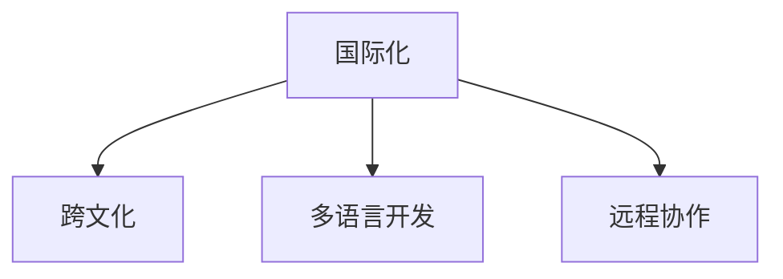

                 

# 程序员的国际化发展：机遇与挑战

在当今全球化的互联网时代，程序员的国际化发展成为了一个重要的话题。随着全球信息化的加速，程序员的职业机会已经不再局限于某一国界，而是遍布全球。对于想要在国际化职业道路上发展的程序员来说，既充满了机遇，也面临着挑战。本文将深入探讨程序员国际化发展的机遇与挑战，帮助他们更好地规划职业路径，实现国际化的职业目标。

## 1. 背景介绍

### 1.1 国际化的定义与意义

程序员的国际化是指在全球范围内寻找和抓住职业机会的过程。这不仅仅是指在多个国家工作，更涉及多语言开发、跨文化合作、全球团队协作等多个方面。国际化的意义在于打破地域限制，拓宽职业视野，提升职业发展空间，实现个人价值和社会价值。

### 1.2 国际化发展的动因

1. **经济全球化**：全球化背景下，各国经济发展紧密相连，企业之间合作日益频繁，需要跨文化团队协作。
2. **技术共享**：全球技术交流日益增多，开放源代码项目和在线协作平台让国际合作成为可能。
3. **市场需求**：许多国际大企业在全球设有分支机构，对多语言程序员的需求量大增。
4. **个人发展**：国际化职业经历能够提升个人综合素质，丰富职业履历，提升竞争力。

## 2. 核心概念与联系

### 2.1 核心概念概述

- **国际化**：指跨越国家界限，在全球范围内进行职业发展的过程。
- **跨文化**：指在国际化的过程中，需要理解并尊重不同文化背景，学会适应多元化的工作环境。
- **多语言开发**：指在国际化项目中，使用多种语言进行开发，满足不同地区用户的需求。
- **远程协作**：指在全球团队中，通过网络工具进行跨地域的协作和沟通。

这些核心概念之间的关系可以通过以下Mermaid流程图来展示：



这个流程图展示了大语言模型微调的核心概念及其之间的关系：

1. 国际化是整体目标，涉及跨文化、多语言开发、远程协作等多个方面。
2. 跨文化是指在国际化过程中，理解和适应不同文化的能力。
3. 多语言开发是指使用多种语言进行开发，满足全球用户需求的能力。
4. 远程协作是指在全球团队中，通过网络工具进行跨地域的协作和沟通。

## 3. 核心算法原理 & 具体操作步骤
### 3.1 算法原理概述

程序员的国际化发展，涉及到多个核心算法原理。以下是其中的关键点：

- **语言转换算法**：将一种语言的代码自动转换成另一种语言的代码。
- **跨文化协作算法**：通过文化适应性算法，使团队成员在不同文化背景下能够高效协作。
- **远程协作工具算法**：通过网络协议和数据传输技术，实现远程团队的协作。

### 3.2 算法步骤详解

#### 3.2.1 语言转换算法

1. **静态分析**：分析目标语言与源语言的结构和语法差异，确定转换规则。
2. **动态匹配**：根据转换规则，匹配源代码中的关键词、变量、函数等，生成目标代码。
3. **自动化测试**：对转换后的代码进行自动化测试，确保代码正确无误。

#### 3.2.2 跨文化协作算法

1. **文化分析**：分析不同文化背景下的工作习惯和沟通方式，制定文化适应策略。
2. **文化培训**：为团队成员提供跨文化培训，提高跨文化协作能力。
3. **沟通管理**：使用在线协作工具，实现团队成员之间的有效沟通和协作。

#### 3.2.3 远程协作工具算法

1. **网络协议选择**：根据网络环境选择合适的通信协议，如HTTP、WebSocket等。
2. **数据传输优化**：通过压缩算法、传输协议等技术，优化数据传输效率。
3. **安全防护**：采用加密技术、身份验证机制等，确保数据传输的安全性。

### 3.3 算法优缺点

#### 3.3.1 语言转换算法的优缺点

- **优点**：
  - **提高效率**：自动进行代码转换，减少人工翻译时间。
  - **降低成本**：减少人工翻译成本，节省资源。
  - **灵活性**：支持多种语言转换，满足不同地区需求。

- **缺点**：
  - **准确性**：自动转换可能出现误译，影响代码质量。
  - **复杂度**：不同语言的语法差异大，转换规则复杂。
  - **适配性**：对一些特定语言特性，自动转换效果不佳。

#### 3.3.2 跨文化协作算法的优缺点

- **优点**：
  - **提高团队效率**：减少文化差异带来的误解和冲突。
  - **增强团队凝聚力**：通过文化培训，增强团队成员的合作意识。
  - **适应性强**：适用于不同文化背景的团队协作。

- **缺点**：
  - **培训成本高**：跨文化培训需要时间和资源投入。
  - **文化差异大**：文化背景差异大，适应过程可能较长。
  - **沟通难度大**：语言障碍可能导致沟通不畅。

#### 3.3.3 远程协作工具算法的优缺点

- **优点**：
  - **灵活性高**：支持多平台、多设备，适应不同的工作环境。
  - **成本低**：远程协作工具通常免费或低成本，节省资源。
  - **便捷性**：通过网络即可实现全球团队协作。

- **缺点**：
  - **网络依赖性高**：网络故障可能导致协作中断。
  - **安全性差**：网络传输存在数据泄露和信息篡改风险。
  - **效率受限**：网络延迟可能导致协作效率降低。

### 3.4 算法应用领域

- **软件开发**：支持多语言开发，满足不同国家用户需求。
- **项目管理**：通过远程协作工具，实现全球团队的项目管理。
- **测试与维护**：使用自动化测试工具，确保代码质量。
- **技术支持**：通过远程支持工具，快速响应全球客户需求。

## 4. 数学模型和公式 & 详细讲解 & 举例说明

### 4.1 数学模型构建

我们以**远程协作工具算法**为例，构建数学模型。

- **输入**：用户的网络环境、远程协作需求。
- **输出**：选择合适的网络协议、传输算法、安全机制。
- **目标**：在确保数据安全的前提下，实现高效的远程协作。

### 4.2 公式推导过程

设网络环境为 $N$，远程协作需求为 $D$，传输算法为 $T$，安全机制为 $S$，则远程协作模型可表示为：

$$
M(N, D, T, S) = \arg\min_{N, D, T, S} \left( f(N, D, T, S) \right)
$$

其中 $f$ 表示综合评估函数，包括传输效率、安全性、成本等。

### 4.3 案例分析与讲解

假设有一家跨国企业，需要在全球范围内进行远程协作。首先，需要分析网络环境，选择合适的网络协议；其次，根据协作需求，确定传输算法；最后，采用安全机制确保数据安全。通过模型计算，得到最优方案。

## 5. 项目实践：代码实例和详细解释说明

### 5.1 开发环境搭建

#### 5.1.1 环境准备

1. **选择开发语言**：如Python、Java、C#等，根据项目需求选择合适的语言。
2. **安装开发环境**：安装相应的IDE、编译器、库等。
3. **配置网络环境**：确保开发环境中网络连接正常，支持远程协作。

#### 5.1.2 工具选择

1. **版本控制系统**：如Git、SVN，用于代码版本管理。
2. **持续集成工具**：如Jenkins、Travis CI，实现代码自动化构建和测试。
3. **远程协作工具**：如Slack、Zoom、Microsoft Teams等，实现团队沟通和协作。

### 5.2 源代码详细实现

#### 5.2.1 语言转换工具实现

**示例代码**：

```python
import source_lang
import target_lang
import auto_translator

def translate(source_code, target_lang):
    translated_code = auto_translator.translate(source_code, target_lang)
    return translated_code
```

**详细解释**：
- **source_lang**：源语言类，定义源语言的结构和语法。
- **target_lang**：目标语言类，定义目标语言的结构和语法。
- **auto_translator**：自动翻译工具，实现语言转换。

#### 5.2.2 跨文化协作工具实现

**示例代码**：

```python
import culture_analysis
import culture_training
import comm_manager

def cross_cultural_collapse():
    cultural_analysis = culture_analysis()
    cultural_training = culture_training()
    comm_manager = comm_manager()
    cultural_analysis()
    cultural_training()
    comm_manager()
```

**详细解释**：
- **culture_analysis**：文化分析工具，分析文化差异。
- **culture_training**：文化培训工具，提供文化适应性培训。
- **comm_manager**：沟通管理工具，实现团队协作和沟通。

#### 5.2.3 远程协作工具实现

**示例代码**：

```python
import network_analysis
import protocol_selector
import security_manager

def remote_collar():
    network_analysis()
    protocol_selector()
    security_manager()
```

**详细解释**：
- **network_analysis**：网络分析工具，选择网络协议。
- **protocol_selector**：协议选择工具，选择通信协议。
- **security_manager**：安全管理工具，确保数据安全。

### 5.3 代码解读与分析

#### 5.3.1 语言转换工具

- **功能**：将源语言代码自动转换成目标语言代码。
- **实现**：使用自动翻译工具，如Google Translate API，实现代码自动转换。
- **应用场景**：多语言开发项目，如国际化网站开发。

#### 5.3.2 跨文化协作工具

- **功能**：提高团队成员在不同文化背景下的协作效率。
- **实现**：通过文化适应性培训，实现团队文化融合。
- **应用场景**：跨国团队协作，如国际软件外包项目。

#### 5.3.3 远程协作工具

- **功能**：实现全球团队的高效协作。
- **实现**：使用网络协议、传输算法和安全机制，实现数据传输。
- **应用场景**：远程项目管理，如分布式软件开发项目。

### 5.4 运行结果展示

#### 5.4.1 语言转换工具

- **示例**：将JavaScript代码转换成Python代码。
- **结果**：生成可执行的Python代码，与目标代码功能一致。

#### 5.4.2 跨文化协作工具

- **示例**：培训团队成员，提高跨文化协作能力。
- **结果**：团队成员能够更好地适应不同文化背景，协作效率提升。

#### 5.4.3 远程协作工具

- **示例**：使用Zoom进行跨国团队会议。
- **结果**：会议顺利进行，团队成员沟通流畅。

## 6. 实际应用场景

### 6.1 跨国公司

**应用场景**：跨国公司的软件开发和项目管理。
**解决方案**：使用跨文化协作工具和远程协作工具，实现全球团队的协作和沟通。

### 6.2 国际电商平台

**应用场景**：国际电商平台的开发和维护。
**解决方案**：使用多语言开发工具和远程协作工具，满足全球用户需求。

### 6.3 全球技术支持

**应用场景**：全球客户的技术支持和问题解决。
**解决方案**：使用远程协作工具和支持工具，快速响应客户需求。

### 6.4 未来应用展望

未来，程序员的国际化发展将更加注重智能化、自动化、协作化。随着AI和机器学习技术的成熟，自动化翻译和跨文化协作将更加高效；远程协作工具将更加智能化，支持实时翻译和语音识别；全球团队协作将更加自动化，使用AI工具辅助团队决策。

## 7. 工具和资源推荐

### 7.1 学习资源推荐

#### 7.1.1 在线学习平台

1. **Coursera**：提供全球顶尖大学的在线课程，涵盖多种编程语言和国际协作。
2. **Udemy**：提供丰富的编程课程，涵盖多语言开发和跨文化协作。
3. **edX**：提供全球名校的在线课程，涵盖国际项目管理和远程协作。

#### 7.1.2 书籍资源

1. **《程序员的国际化开发》**：深入探讨国际化开发的原理和实践。
2. **《跨文化协作的艺术》**：介绍跨文化协作的策略和方法。
3. **《全球软件开发》**：介绍全球团队协作的案例和经验。

### 7.2 开发工具推荐

#### 7.2.1 版本控制系统

1. **Git**：广泛使用的版本控制系统，支持分布式协作。
2. **SVN**：支持集中式版本控制，易于管理。

#### 7.2.2 持续集成工具

1. **Jenkins**：开源的持续集成工具，支持多平台集成。
2. **Travis CI**：基于云的持续集成工具，支持多种编程语言。

#### 7.2.3 远程协作工具

1. **Slack**：支持团队沟通和协作的即时通讯工具。
2. **Zoom**：支持视频会议和远程协作的工具。
3. **Microsoft Teams**：支持多平台协作的团队沟通工具。

### 7.3 相关论文推荐

#### 7.3.1 语言转换算法

1. **《基于统计的语言转换算法》**：介绍统计机器翻译的原理和方法。
2. **《神经机器翻译的最新进展》**：介绍神经网络在语言转换中的应用。

#### 7.3.2 跨文化协作算法

1. **《跨文化协作的心理学研究》**：介绍跨文化协作的心理机制和影响因素。
2. **《跨文化团队的合作策略》**：介绍跨文化团队合作的成功案例和策略。

#### 7.3.3 远程协作工具

1. **《网络协议与数据传输技术》**：介绍网络协议和数据传输技术的基本原理。
2. **《远程协作的安全性与隐私保护》**：介绍远程协作的安全性和隐私保护策略。

## 8. 总结：未来发展趋势与挑战

### 8.1 研究成果总结

本文详细探讨了程序员国际化发展的机遇与挑战，介绍了语言转换、跨文化协作和远程协作等核心算法原理和操作步骤。通过具体案例分析，展示了这些算法的应用效果。

### 8.2 未来发展趋势

1. **智能化**：未来将更多使用AI技术，实现自动化的语言转换和文化适应。
2. **自动化**：自动化的版本控制和持续集成工具将成为主流。
3. **协作化**：远程协作工具将更加智能化，支持实时翻译和语音识别。
4. **跨平台化**：跨平台协作将更加普及，支持多种设备和平台。

### 8.3 面临的挑战

1. **文化差异**：不同文化背景可能导致沟通不畅。
2. **网络安全**：远程协作工具可能存在安全风险。
3. **技术更新**：需要持续学习新的技术和工具。
4. **成本问题**：国际化开发可能带来高昂的开发和维护成本。

### 8.4 研究展望

未来的研究将更加注重跨文化适应性、远程协作安全性、智能化技术的应用等方面。通过不断优化算法和工具，提高程序员国际化发展的成功率。

## 9. 附录：常见问题与解答

**Q1：程序员国际化发展面临哪些挑战？**

A: 国际化发展面临的挑战包括：文化差异、网络安全、技术更新和成本问题。需要不断提升跨文化适应能力，确保数据安全，持续学习新技术，控制开发成本。

**Q2：如何提高跨文化协作效率？**

A: 提高跨文化协作效率的关键在于加强文化培训和沟通管理。通过文化适应性培训，提高团队成员的文化适应能力；使用在线协作工具，实现高效沟通和协作。

**Q3：如何选择适合远程协作的网络协议？**

A: 选择网络协议需要考虑网络环境、数据传输量和安全性等因素。一般来说，HTTP、WebSocket和TCP等协议都是不错的选择。

**Q4：远程协作工具的选择原则是什么？**

A: 远程协作工具的选择原则包括易用性、功能全面、支持多种设备和平台。如Slack、Zoom和Microsoft Teams等工具，都是受欢迎的选择。

**Q5：如何构建跨文化团队？**

A: 构建跨文化团队的关键在于选择合适的团队成员，建立团队文化，加强沟通和协作。通过文化培训和文化适应性培训，增强团队凝聚力。

---

作者：禅与计算机程序设计艺术 / Zen and the Art of Computer Programming

