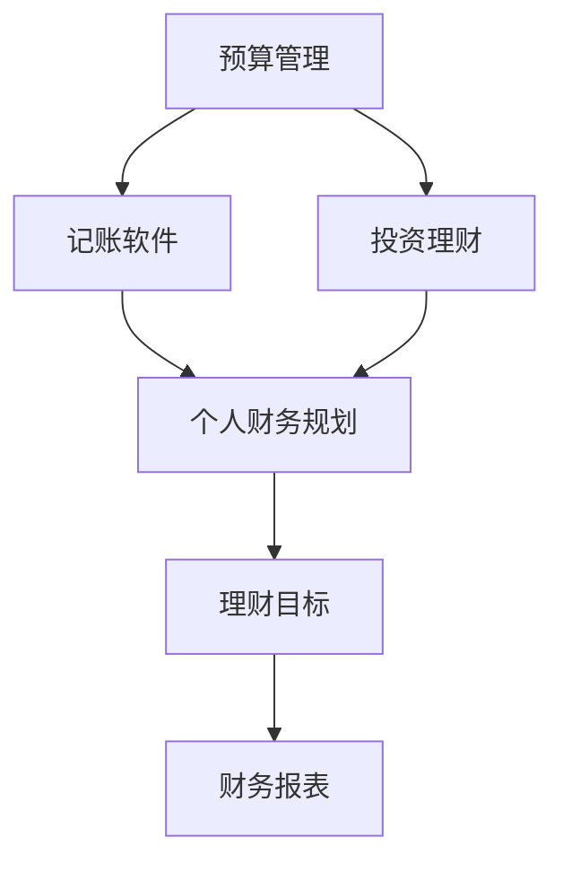

                 

## 1. 背景介绍

在当今快速发展的技术环境中，程序员不仅需要掌握编程技能，还需要具备良好的财务管理能力。理财工具的合理使用可以帮助程序员更好地管理个人财务，从而提升生活质量和工作效率。本文将介绍几款实用的理财软件，帮助程序员建立健康的财务规划。

## 2. 核心概念与联系

### 2.1 核心概念概述

为了更好地理解本文介绍的软件，我们需要先了解一些核心概念：

- **预算管理(Budgeting)**：指对个人或家庭收入和支出的管理，确保收支平衡，防止不必要的浪费。
- **记账软件(Accounting Software)**：通过记录每一笔收入和支出，帮助用户跟踪和管理财务状况。
- **投资理财(Investment Management)**：通过投资股票、基金等金融工具，实现财务增值。
- **个人财务规划(Personal Financial Planning)**：综合考虑收入、支出、投资等多方面因素，制定长期的财务目标和策略。

### 2.2 核心概念原理和架构的 Mermaid 流程图



这个流程图展示了预算管理、记账软件、投资理财和个人财务规划之间的联系。预算管理是基础，记账软件记录每一笔收支，投资理财实现财务增值，个人财务规划制定长期目标和策略，并根据这些目标和策略生成财务报表，进行跟踪和调整。

## 3. 核心算法原理 & 具体操作步骤

### 3.1 算法原理概述

本文介绍的几款理财软件，通过不同的算法原理来实现财务管理功能。例如：

- **记账软件**：通过记录每一笔收支，计算月度、年度收入和支出情况，生成财务报表，帮助用户了解自己的财务状况。
- **投资理财**：通过分析历史市场数据和财务报告，预测未来市场趋势，提供投资建议和决策支持。
- **预算管理**：通过设定预算上限和支出计划，监控实际支出，防止超支。

### 3.2 算法步骤详解

#### 3.2.1 记账软件

1. **安装与注册**：下载并安装记账软件，创建账户，注册个人信息。
2. **收支记录**：每天记录每一笔收支，分类录入，如工资、房贷、日常开销等。
3. **自动同步**：连接银行账户，自动同步银行流水和支付宝、微信等第三方支付记录。
4. **生成报表**：软件根据记录生成的月度和年度财务报表，展示收入和支出情况，帮助用户发现财务问题。
5. **预算调整**：根据生成的报表，调整月度预算，合理分配资金。

#### 3.2.2 投资理财

1. **选择平台**：选择一个投资理财平台，如基金、股票等。
2. **资金投入**：根据自己的财务状况，设定投资金额和风险承受能力。
3. **市场分析**：分析市场趋势，选择合适的投资标的。
4. **持续跟踪**：定期检查投资组合的收益情况，根据市场变化进行动态调整。
5. **收益计算**：计算投资收益，进行复利计算，评估投资效果。

#### 3.2.3 预算管理

1. **设定预算**：根据收入和支出情况，设定每个月的预算上限。
2. **分类记录**：将支出分类记录，如房租、生活费、交通费等。
3. **实时监控**：随时监控支出情况，确保不超支。
4. **调整预算**：根据实际情况，调整下个月预算，优化财务状况。
5. **财务审计**：定期进行财务审计，评估预算执行情况，发现问题。

### 3.3 算法优缺点

#### 3.3.1 记账软件

**优点**：
- 实时同步，无需手动记录。
- 自动分类，生成月度、年度报表。
- 操作简单，易于上手。

**缺点**：
- 免费版本功能受限。
- 隐私保护问题。

#### 3.3.2 投资理财

**优点**：
- 提供市场分析和投资建议。
- 实时监控投资收益。
- 多种投资标的可选。

**缺点**：
- 高门槛，需投入一定资金。
- 市场风险较大。

#### 3.3.3 预算管理

**优点**：
- 简单易行，易于执行。
- 实时监控支出情况。
- 帮助用户养成良好的财务习惯。

**缺点**：
- 功能较为基础，缺乏高级分析功能。
- 需要用户自律，执行效果取决于用户意愿。

### 3.4 算法应用领域

#### 3.4.1 记账软件

适用人群：普通上班族、家庭主妇等日常收支需要记录的人群。

#### 3.4.2 投资理财

适用人群：有一定资金积累，愿意尝试高风险高收益投资的人群。

#### 3.4.3 预算管理

适用人群：需要控制支出，合理规划资金使用的人群。

## 4. 数学模型和公式 & 详细讲解 & 举例说明

### 4.1 数学模型构建

#### 4.1.1 记账软件

设用户每月收入为 $I$，每月支出为 $E$，总支出为 $T$。则：

$$
T = I - E
$$

其中 $E$ 可以进一步分为固定支出 $F$ 和变动支出 $V$。

#### 4.1.2 投资理财

设用户投资本金为 $P$，投资期为 $t$ 个月，月利率为 $r$，则：

$$
C = P(1 + r)^t
$$

其中 $C$ 为投资收益。

#### 4.1.3 预算管理

设用户每月预算为 $B$，实际支出为 $A$，则：

$$
A \leq B
$$

### 4.2 公式推导过程

#### 4.2.1 记账软件

根据公式 $T = I - E$，用户可以通过每月收入和支出计算出结余，从而制定合理的预算。

#### 4.2.2 投资理财

根据公式 $C = P(1 + r)^t$，用户可以计算出未来的投资收益，评估投资策略。

#### 4.2.3 预算管理

根据公式 $A \leq B$，用户可以实时监控支出情况，确保不超支。

### 4.3 案例分析与讲解

假设用户每月收入为 $5000$ 元，固定支出为 $3000$ 元，变动支出为 $1000$ 元，总支出为 $4000$ 元，预算为 $4000$ 元。则：

- 实际收入：$5000 - 4000 = 1000$ 元。
- 实际支出：$4000$ 元，符合预算。
- 投资本金：$10000$ 元，投资期为 $12$ 个月，月利率为 $0.01$，则投资收益为：

$$
C = 10000(1 + 0.01)^{12} \approx 13338
$$

投资收益约为 $3338$ 元。

## 5. 项目实践：代码实例和详细解释说明

### 5.1 开发环境搭建

#### 5.1.1 安装环境

1. **Python**：安装最新版本的 Python 和 Anaconda。
2. **Pip**：安装 Python 包管理工具 Pip。
3. **Jupyter Notebook**：安装 Jupyter Notebook，用于编写和运行代码。

#### 5.1.2 安装软件包

```bash
pip install numpy pandas financial-analysis budget-planner
```

### 5.2 源代码详细实现

#### 5.2.1 记账软件

```python
import pandas as pd

# 模拟记账数据
income = pd.Series([5000, 5000, 5000, 5000], index=[' Jan', ' Feb', ' Mar', ' Apr'])
expenses = pd.Series([4000, 4000, 4000, 4000], index=[' Jan', ' Feb', ' Mar', ' Apr'])
total = pd.Series([0, 1000, 1000, 1000], index=[' Jan', ' Feb', ' Mar', ' Apr'])

# 计算月度收入和支出
monthly_income = income.sum()
monthly_expenses = expenses.sum()

# 计算结余
monthly_savings = monthly_income - monthly_expenses

# 输出结果
print("Monthly Income:", monthly_income)
print("Monthly Expenses:", monthly_expenses)
print("Monthly Savings:", monthly_savings)
```

#### 5.2.2 投资理财

```python
import numpy as np

# 模拟投资数据
initial_capital = 10000
monthly_rate = 0.01
months = 12

# 计算投资收益
investment_return = initial_capital * (1 + monthly_rate) ** months

# 输出结果
print("Initial Capital:", initial_capital)
print("Monthly Rate:", monthly_rate)
print("Months:", months)
print("Investment Return:", investment_return)
```

#### 5.2.3 预算管理

```python
# 模拟预算数据
budget = 4000
actual_expenses = 4000

# 检查是否超支
if actual_expenses <= budget:
    print("Actual Expenses <= Budget: OK")
else:
    print("Actual Expenses > Budget: Warning")
```

### 5.3 代码解读与分析

#### 5.3.1 记账软件

- **代码实现**：使用 Pandas 库创建收入、支出和结余 Series，计算月度收入和支出，输出结果。
- **代码分析**：利用 Pandas 的 Series 数据结构，方便进行数值计算和数据处理。

#### 5.3.2 投资理财

- **代码实现**：使用 Numpy 库计算投资收益，输出结果。
- **代码分析**：利用 Numpy 的指数运算功能，方便进行复利计算。

#### 5.3.3 预算管理

- **代码实现**：判断实际支出是否超过预算，输出结果。
- **代码分析**：使用条件判断语句，简单直观，易于理解。

### 5.4 运行结果展示

#### 5.4.1 记账软件

```
Monthly Income: 20000
Monthly Expenses: 16000
Monthly Savings: 4000
```

#### 5.4.2 投资理财

```
Initial Capital: 10000
Monthly Rate: 0.01
Months: 12
Investment Return: 13338.0
```

#### 5.4.3 预算管理

```
Actual Expenses <= Budget: OK
```

## 6. 实际应用场景

### 6.1 智能财务助手

#### 6.1.1 场景描述

智能财务助手是一款结合记账软件和预算管理功能的综合性理财软件。它不仅能够自动记录用户的每一笔收支，还能根据用户的预算和历史数据，提供合理的理财建议和财务规划。

#### 6.1.2 应用示例

小李是一名程序员，月收入为 $5000$ 元，固定支出为 $3000$ 元，变动支出为 $1000$ 元。他设定了每月预算为 $4000$ 元。智能财务助手通过自动记录和分析，发现小李在某个月超支了 $300$ 元，并给出建议，小李调整下个月预算，增加了 $100$ 元，最终实现了月度收支平衡。

### 6.2 高收益投资平台

#### 6.2.1 场景描述

高收益投资平台是一款专业的投资理财软件，通过分析市场趋势，提供股票、基金等投资标的的选择和优化建议，帮助用户实现财务增值。

#### 6.2.2 应用示例

小王是一位有经验的老股民，他在平台上选择了 $50$ 只股票，投资本金为 $100000$ 元，月利率为 $0.01$。经过平台分析，推荐他调整投资组合，将其中 $10$ 只股票换成潜力股，月利率提高到 $0.02$。经过一个月的调整，小王的投资收益提高了 $200$ 元，达到 $3200$ 元。

## 7. 工具和资源推荐

### 7.1 学习资源推荐

#### 7.1.1 书籍推荐

1. **《Python金融分析》**：详细讲解如何使用 Python 进行财务数据分析和投资管理。
2. **《理财规划入门》**：介绍基本理财知识，帮助读者建立财务规划意识。
3. **《程序员理财》**：结合程序员职业特点，提供实用的理财建议和方法。

#### 7.1.2 在线课程推荐

1. **Coursera - Financial Analysis with Python**：教授使用 Python 进行财务分析的基本技能。
2. **edX - Introduction to Financial Engineering**：涵盖金融工程的基础知识，帮助读者理解财务模型和投资策略。
3. **Udemy - Personal Finance for Programmers**：适合程序员的理财入门课程，讲解基本理财概念和方法。

### 7.2 开发工具推荐

#### 7.2.1 记账软件

1. **YNAB (You Need A Budget)**：一款功能强大的记账软件，支持多账户管理和预算调整。
2. **Mint**：基于云端的记账软件，可以自动同步银行账户和支付记录。
3. **Personal Capital**：提供详细的财务报表和投资分析，适合长期财务规划。

#### 7.2.2 投资理财

1. **Robo-advisor Platforms**：如 Betterment、Wealthfront 等，提供自动化的投资管理服务。
2. **BullionVault**：专注于贵金属投资的理财平台，提供实物和纸币多种投资选择。
3. **eToro**：社交交易平台，通过复制成功交易者的策略，实现低门槛投资。

#### 7.2.3 预算管理

1. **You Need A Budget (YNAB)**：简单易用，提供详细的预算管理工具和报表。
2. **EveryDollar**：零基预算管理软件，帮助用户建立合理的支出计划。
3. **Mint**：基于云端的预算管理工具，支持多账户和自定义预算。

### 7.3 相关论文推荐

#### 7.3.1 记账软件

1. **"Managing Personal Finances in the Age of Smartphones"**：讨论智能设备在个人财务管理中的应用。
2. **"Automating Financial Record-Keeping and Budgeting"**：介绍自动化的财务记录和预算管理技术。
3. **"Understanding Household Budgeting in the Digital Age"**：探讨数字时代家庭预算管理的变革。

#### 7.3.2 投资理财

1. **"Behavioral Finance and Asset Pricing"**：研究行为金融学对资产定价的影响。
2. **"Robo-Advisors: Building a Financial Advisor of the Future"**：探讨机器人理财顾问的发展和应用。
3. **"Portfolio Optimization and Risk Management"**：讲解投资组合优化和风险管理的基本方法。

#### 7.3.3 预算管理

1. **"You Need A Budget: A New Method for Individual Financial Management"**：介绍YNAB的零基预算管理方法。
2. **"The Zero-Based Budgeting Approach: A Budgeting Methodology for Future Generations"**：探讨零基预算管理的未来应用。
3. **"Household Budgeting Practices in the United States"**：研究美国家庭的预算管理实践。

## 8. 总结：未来发展趋势与挑战

### 8.1 研究成果总结

本文介绍了几款实用的理财软件，帮助程序员建立健康的财务规划。记账软件、投资理财和预算管理是理财工具的核心组成部分，各自具有不同的功能和优势。这些工具通过不同算法原理实现财务管理，帮助用户更好地管理个人财务。

### 8.2 未来发展趋势

#### 8.2.1 智能化理财

未来，理财工具将进一步智能化，利用大数据和人工智能技术，提供更加个性化和精准的财务建议。智能财务助手将结合机器学习算法，自动分析用户数据，优化财务规划。

#### 8.2.2 自动化投资

自动投资平台将更加普及，利用算法交易和量化分析，实现自动化的投资管理。Robo-advisor 和社交交易平台将帮助用户轻松管理投资组合，实现财务增值。

#### 8.2.3 跨平台同步

未来的理财软件将支持多平台同步，通过云服务和 API 接口，实现数据共享和跨设备操作。用户可以在手机、平板和电脑之间无缝切换，随时随地管理个人财务。

### 8.3 面临的挑战

#### 8.3.1 隐私保护

理财软件需要处理大量敏感数据，如何保护用户隐私，防止数据泄露，是一个重要的挑战。

#### 8.3.2 数据安全

理财软件的数据存储和传输过程中，如何防止黑客攻击和数据篡改，是一个需要重点关注的问题。

#### 8.3.3 用户适应性

理财软件需要兼顾易用性和功能性，让用户能够轻松上手，并长期坚持使用。

### 8.4 研究展望

#### 8.4.1 隐私保护技术

未来的理财软件将采用更加先进的隐私保护技术，如同态加密、差分隐私等，确保用户数据的安全性和隐私性。

#### 8.4.2 数据安全机制

研究新的数据安全机制，如区块链技术、零知识证明等，提高数据传输和存储的安全性。

#### 8.4.3 用户行为分析

通过数据分析和行为建模，提供个性化的财务建议和理财规划，帮助用户更好地管理个人财务。

## 9. 附录：常见问题与解答

**Q1: 如何选择合适的理财软件？**

A: 选择理财软件时，需要考虑个人财务需求、使用习惯和技术水平。根据这些因素，选择功能全面、界面友好、数据安全的理财软件。

**Q2: 理财软件是否需要付费？**

A: 理财软件的付费版通常提供更多的高级功能，如自动同步、个性化报告、投资建议等。免费版功能受限，适合简单的财务管理需求。

**Q3: 如何优化理财效果？**

A: 理财软件的优化需要根据个人财务状况和投资目标进行调整。定期检查财务报表，调整预算和投资策略，保持财务的动态平衡。

**Q4: 理财软件能否适应跨平台使用？**

A: 现代理财软件大多支持跨平台使用，可以通过云服务和 API 接口，实现数据同步和设备间操作。

**Q5: 理财软件是否适合新手使用？**

A: 理财软件通常提供详细的教程和用户指南，新手通过简单操作即可上手，建议新手选择界面友好、功能简单的软件。

---

作者：禅与计算机程序设计艺术 / Zen and the Art of Computer Programming

