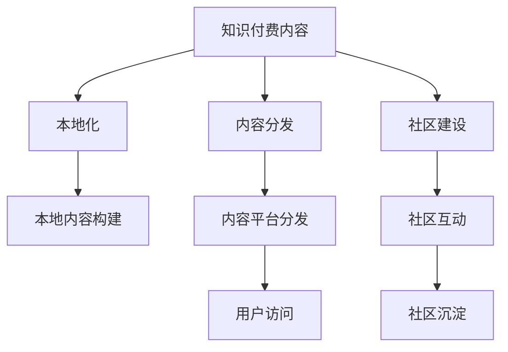

                 

# 程序员的知识付费内容本地化策略

> 关键词：知识付费,本地化,技术博客,内容分发,用户需求,教育平台,社区建设,内容沉淀

## 1. 背景介绍

随着互联网技术的发展和知识经济时代的到来，知识付费逐渐成为全球各行各业关注的新趋势。特别是在IT领域，知识付费内容以其专业性、权威性和实用性，赢得了越来越多的开发者和教育从业者的青睐。然而，面对广大程序员和技术人员，如何提供更加本地化、个性化、有针对性的知识付费内容，提升学习效率和效果，是摆在知识付费平台面前的重要课题。

### 1.1 知识付费行业现状

知识付费行业近年来迅猛发展，各种平台如雨后春笋般涌现。从简单的在线课程到深入的专业讲座，从工具书的电子版到实践案例的分析，内容丰富、形式多样。主要平台包括Coursera、Udacity、edX等国际知名教育平台，以及国内的得到、知乎live、腾讯课堂等本土化平台。然而，尽管如此，对于程序员和技术人员这一特殊群体，这些内容仍然存在一些局限性。

### 1.2 问题由来

主要问题包括：

1. **内容泛泛化**：许多知识付费内容仍然是面向大众，缺乏针对特定技术领域的深度讨论和案例分析。
2. **本地化不足**：以英文为主的全球化内容，难以完全契合不同地区开发者的实际需求和环境。
3. **碎片化学习**：零散的课程和文章，无法形成系统性学习路径，且缺乏实践和反馈机制。
4. **互动性不足**：用户之间的互动交流较为薄弱，社区建设尚未成熟，难以形成有效的知识共享和协同学习。

### 1.3 问题核心关键点

知识付费内容本地化的关键点在于：

1. **内容定制化**：根据不同技术栈和开发环境，提供定制化、系统化的学习内容。
2. **语言本地化**：将英文内容翻译成不同语言，并结合本地文化和技术趋势，进行内容本地化适配。
3. **社区建设**：利用社交网络、讨论论坛等形式，增强用户之间的互动和交流。
4. **用户反馈机制**：建立有效的用户反馈系统，收集用户需求和建议，不断迭代优化内容。

## 2. 核心概念与联系

### 2.1 核心概念概述

为了更好地理解知识付费内容的本地化策略，本文将介绍几个密切相关的核心概念：

- **知识付费内容**：以技术性、实用性和权威性为特点，面向专业人士提供的高价值内容。
- **本地化**：针对特定地区、特定语言和文化背景，将全球化内容进行适配和优化。
- **内容分发**：通过合理的平台和渠道，将内容高效分发至目标受众。
- **社区建设**：利用社交网络、讨论论坛等形式，增强用户之间的互动和交流。
- **内容沉淀**：利用技术手段和策略，长期保存和积累知识内容，形成社区资产。

这些概念之间的逻辑关系可以通过以下Mermaid流程图来展示：



这个流程图展示了几大核心概念及其之间的关系：

1. 知识付费内容作为基础，通过本地化和内容分发，优化适配到目标受众。
2. 社区建设通过促进用户互动，增强用户黏性，实现内容沉淀。
3. 内容沉淀又能够进一步提升内容质量，吸引更多用户参与，形成良性循环。

## 3. 核心算法原理 & 具体操作步骤

### 3.1 算法原理概述

知识付费内容本地化策略的算法原理可以归纳为：通过数据挖掘和用户分析，找到最适合用户的内容，并结合本地化技术，进行内容的适配和优化，最终通过内容分发平台和社区建设，实现知识内容的最大化覆盖和长期保存。

### 3.2 算法步骤详解

1. **用户画像构建**：通过分析用户的历史行为、兴趣偏好和学习路径，构建详细的用户画像，帮助个性化内容推荐。
2. **内容适配策略**：针对不同语言和技术栈，制定详细的内容适配策略，包括内容翻译、本地化调整和案例适配。
3. **内容分发策略**：通过算法优化和推荐系统，将最适合的内容及时精准地推送给目标用户。
4. **社区互动机制**：建立高效的用户互动机制，促进知识分享和协同学习，提升用户黏性。
5. **内容沉淀技术**：利用数据库、缓存和存储技术，长期保存和积累知识内容，形成社区资产。

### 3.3 算法优缺点

知识付费内容本地化策略的优势在于：

1. **提升学习效率**：个性化和系统化的内容推荐，使学习者能够更快找到感兴趣的内容。
2. **增强用户黏性**：社区互动机制可以增强用户之间的交流和协作，形成活跃的社区生态。
3. **促进内容沉淀**：长期保存和积累的知识内容，能够形成宝贵的社区资产，有助于平台的发展和维护。

然而，该策略也存在一些局限性：

1. **高成本投入**：内容适配和社区建设需要大量的人力和技术支持。
2. **内容质量参差不齐**：本地化适配过程中，可能存在内容不完整、不精确的问题。
3. **用户接受度差异**：不同地区的用户习惯和文化背景不同，对内容的接受度可能存在差异。

### 3.4 算法应用领域

知识付费内容本地化策略在以下领域具有广泛应用：

- **软件开发**：针对不同编程语言和技术栈，提供本地化的编程教程和案例分析。
- **人工智能**：根据不同地区的数据和环境，提供本地化的机器学习、深度学习等技术应用教程。
- **数据科学**：结合不同地区的业务需求，提供数据处理、分析和可视化的本地化学习内容。
- **DevOps**：针对不同IT运维环境，提供本地化的自动化运维、容器化部署等技术内容。
- **安全技术**：结合不同地区的网络安全形势，提供本地化的安全防护、漏洞修复等内容。

## 4. 数学模型和公式 & 详细讲解 & 举例说明

### 4.1 数学模型构建

知识付费内容本地化策略的数学模型可以构建为：

$$
\text{Optimize} \; C = F_{content} \times F_{localization} \times F_{distribution} \times F_{community} \times F_{retention}
$$

其中：

- $C$：知识付费内容本地化效果的综合评分。
- $F_{content}$：内容适配和优化策略的效果评分。
- $F_{localization}$：本地化技术适配的精确度评分。
- $F_{distribution}$：内容分发策略的覆盖率和准确性评分。
- $F_{community}$：社区互动和用户参与度的评分。
- $F_{retention}$：用户留存率和内容沉淀的评分。

### 4.2 公式推导过程

为了评估本地化效果，可以定义如下指标：

- **覆盖率（Coverage）**：目标受众对本地化内容的接受程度，可以通过用户反馈和点击率来评估。
- **准确性（Accuracy）**：本地化内容与目标受众需求的一致性，可以通过专家评估和用户满意度来衡量。
- **互动率（Engagement）**：社区用户之间的互动频率和质量，可以通过社区帖子和评论量来评估。
- **留存率（Retention）**：用户持续访问和学习的频率，可以通过用户续订率和活跃度来衡量。

### 4.3 案例分析与讲解

以一个本地化开发的Java后端开发教程为例，推导其本地化策略的数学模型：

1. **内容适配**：将英文教程翻译成中文，并针对中文开发环境进行适配。
2. **本地化技术**：结合中文文化，调整教程的呈现方式和示例，如注释和注释的顺序。
3. **内容分发**：通过数据挖掘和推荐系统，将最适合的教程推送给中文开发者。
4. **社区互动**：建立中文开发者社区，提供讨论区和技术支持，促进知识共享和交流。
5. **内容沉淀**：保存和积累本地化内容，形成中文开发者社区的知识库和资源。

## 5. 项目实践：代码实例和详细解释说明

### 5.1 开发环境搭建

在进行知识付费内容本地化实践前，我们需要准备好开发环境。以下是使用Python进行Flask开发的环境配置流程：

1. 安装Anaconda：从官网下载并安装Anaconda，用于创建独立的Python环境。

2. 创建并激活虚拟环境：
```bash
conda create -n pytorch-env python=3.8 
conda activate pytorch-env
```

3. 安装PyTorch：根据CUDA版本，从官网获取对应的安装命令。例如：
```bash
conda install pytorch torchvision torchaudio cudatoolkit=11.1 -c pytorch -c conda-forge
```

4. 安装Flask：
```bash
pip install flask
```

5. 安装Flask-RESTful和Flask-SocketIO：
```bash
pip install flask-restful flask-socketio
```

6. 安装MySQL数据库连接模块：
```bash
pip install mysql-connector-python
```

完成上述步骤后，即可在`pytorch-env`环境中开始知识付费内容的本地化实践。

### 5.2 源代码详细实现

接下来，我们详细实现一个基于Flask的本地化知识付费平台：

```python
from flask import Flask, render_template, request, jsonify
from flask_restful import Resource, Api
from flask_socketio import SocketIO, emit

app = Flask(__name__)
api = Api(app)
socketio = SocketIO(app)

# 定义本地化内容的数据库表结构
# 此处省略数据库初始化代码

# 定义本地化内容API
class ContentApi(Resource):
    def get(self):
        # 查询本地化内容并返回
        data = []
        # 此处省略数据库查询代码
        return jsonify(data)

    def post(self):
        # 添加新本地化内容
        data = request.get_json()
        # 此处省略数据库插入代码
        return jsonify({"success": True})

# 定义社区讨论API
class DiscussionApi(Resource):
    def get(self):
        # 获取讨论列表
        data = []
        # 此处省略数据库查询代码
        return jsonify(data)

    def post(self):
        # 发布新讨论
        data = request.get_json()
        # 此处省略数据库插入代码
        return jsonify({"success": True})

# 定义本地化内容缓存API
class CacheApi(Resource):
    def get(self):
        # 获取本地化内容缓存
        data = []
        # 此处省略缓存查询代码
        return jsonify(data)

    def post(self):
        # 添加本地化内容缓存
        data = request.get_json()
        # 此处省略缓存插入代码
        return jsonify({"success": True})

# 注册API路由
api.add_resource(ContentApi, '/content')
api.add_resource(DiscussionApi, '/discussion')
api.add_resource(CacheApi, '/cache')

# 启动SocketIO服务器
if __name__ == '__main__':
    socketio.run(app)
```

### 5.3 代码解读与分析

让我们再详细解读一下关键代码的实现细节：

**Flask框架**：
- 使用Flask创建Web应用，通过API和SocketIO支持前后端数据交互。
- 利用Flask-RESTful和Flask-SocketIO扩展Flask的功能，支持RESTful接口和WebSocket通信。

**本地化内容API**：
- 使用数据库模块进行本地化内容的查询和添加，返回JSON格式数据。
- 在API中使用RESTful风格，提供get和post方法，支持获取和添加本地化内容。

**社区讨论API**：
- 使用数据库模块进行社区讨论的查询和添加，返回JSON格式数据。
- 在API中使用RESTful风格，提供get和post方法，支持获取和发布社区讨论。

**本地化内容缓存API**：
- 使用缓存模块进行本地化内容的查询和添加，返回JSON格式数据。
- 在API中使用RESTful风格，提供get和post方法，支持获取和添加本地化内容缓存。

**SocketIO服务器**：
- 使用SocketIO实现实时数据传输，支持WebSocket通信，增强用户体验。
- 利用SocketIO的事件触发机制，实现用户之间的实时互动和社区交流。

以上代码实现了一个简单的本地化知识付费平台，包含本地化内容API、社区讨论API和本地化内容缓存API。通过SocketIO服务器，实现实时数据传输和用户互动。

## 6. 实际应用场景

### 6.1 软件开发

基于知识付费内容的本地化策略，可以为软件开发社区提供更加个性化、系统化的学习内容。例如，针对Python编程，可以提供中文的教程、实战项目、代码示例等，结合本地化技术和社区互动，提升学习效果。

### 6.2 人工智能

在人工智能领域，可以利用知识付费内容本地化策略，提供针对不同地区的机器学习、深度学习等技术内容，结合本地化技术，提供更加贴近本地需求的案例和应用。

### 6.3 数据科学

在数据科学领域，针对不同地区的数据集和业务场景，提供本地化的数据分析、数据处理和数据可视化教程，帮助本地开发者更好地理解和应用数据技术。

### 6.4 未来应用展望

随着知识付费内容的不断丰富和本地化策略的不断优化，未来其在各个领域的落地应用将更加广泛。例如，在智能家居、智能制造、智能医疗等新领域，结合本地化内容和技术，提供更加贴近用户需求的知识服务。

## 7. 工具和资源推荐

### 7.1 学习资源推荐

为了帮助开发者系统掌握知识付费内容的本地化策略，这里推荐一些优质的学习资源：

1. **《Flask Web Development》**：一本详细介绍Flask框架的书籍，适合入门和进阶学习。
2. **《RESTful API Design》**：一本关于RESTful API设计的经典书籍，讲解API设计原理和最佳实践。
3. **《Python Socket Programming》**：一本详细介绍Python Socket编程的书籍，适合学习网络编程。
4. **《MySQL Database》**：一本详细介绍MySQL数据库的书籍，适合学习数据库基础知识。
5. **《Kubernetes Mastery》**：一本详细介绍Kubernetes的书籍，适合学习容器编排技术。

通过对这些资源的学习实践，相信你一定能够快速掌握知识付费内容的本地化策略，并用于解决实际的技术问题。

### 7.2 开发工具推荐

高效的开发离不开优秀的工具支持。以下是几款用于知识付费内容本地化开发的常用工具：

1. **Flask**：基于Python的开源Web框架，灵活易用，适合快速迭代研究。
2. **SocketIO**：一款开源的WebSocket通信库，支持实时数据传输和用户互动。
3. **MySQL**：一款稳定可靠的数据库系统，支持复杂的数据存储和管理。
4. **Redis**：一款高性能的缓存系统，适合存储热点数据，提升数据查询效率。
5. **ElasticSearch**：一款分布式搜索与分析引擎，适合海量数据的搜索和分析。

合理利用这些工具，可以显著提升知识付费内容的本地化开发的效率，加快创新迭代的步伐。

### 7.3 相关论文推荐

知识付费内容本地化策略的发展源于学界的持续研究。以下是几篇奠基性的相关论文，推荐阅读：

1. **《Localization Strategies for E-Learning Platforms》**：讨论了在线教育平台本地化策略的研究现状和实践经验。
2. **《Content Localization in Machine Translation》**：介绍了机器翻译中内容本地化的研究进展和应用场景。
3. **《Natural Language Processing with Transfer Learning》**：讨论了自然语言处理中迁移学习的研究进展和实践经验。
4. **《Knowledge Sharing and Transfer in Software Engineering》**：讨论了软件开发领域知识共享和迁移的研究进展和应用场景。
5. **《Community Building and Knowledge Localization in Online Learning》**：讨论了在线学习平台社区建设和知识本地化的研究进展和实践经验。

这些论文代表了大语言模型微调技术的发展脉络。通过学习这些前沿成果，可以帮助研究者把握学科前进方向，激发更多的创新灵感。

## 8. 总结：未来发展趋势与挑战

### 8.1 研究成果总结

本文对知识付费内容的本地化策略进行了全面系统的介绍。首先阐述了知识付费内容在IT领域的崛起，以及本地化策略的关键点和实践需求。其次，从原理到实践，详细讲解了本地化策略的数学模型和关键步骤，给出了本地化平台开发的完整代码实例。同时，本文还广泛探讨了本地化策略在软件开发、人工智能、数据科学等多个领域的应用前景，展示了本地化范式的巨大潜力。此外，本文精选了本地化策略的学习资源和工具推荐，力求为开发者提供全方位的技术指引。

通过本文的系统梳理，可以看到，知识付费内容的本地化策略正在成为IT领域的重要范式，极大地拓展了内容的学习边界，提升了学习效率和效果。未来，伴随知识付费平台的不断演进，以及本地化技术的持续优化，知识付费内容必将进一步落地应用，为开发者的技能提升和技术进步提供更加坚实的基础。

### 8.2 未来发展趋势

展望未来，知识付费内容的本地化策略将呈现以下几个发展趋势：

1. **个性化内容推荐**：基于大数据和机器学习算法，为用户提供更加个性化和系统化的学习路径。
2. **实时互动交流**：利用WebSocket等技术，实现用户之间的实时互动和知识共享。
3. **本地化内容的国际化**：针对全球用户，提供国际化的学习内容，提升平台的全球影响力。
4. **社区建设与协作**：利用社交网络、讨论论坛等形式，增强用户之间的交流和协作，提升平台的用户黏性。
5. **内容分发与沉淀**：利用缓存、数据库等技术，长期保存和积累知识内容，形成社区资产。

这些趋势将进一步提升知识付费平台的智能化和人性化水平，为开发者提供更加优质的学习体验。

### 8.3 面临的挑战

尽管知识付费内容的本地化策略已经取得了显著成效，但在迈向更加智能化、普适化应用的过程中，它仍面临诸多挑战：

1. **高成本投入**：内容适配和社区建设需要大量的人力和技术支持。
2. **内容质量参差不齐**：本地化适配过程中，可能存在内容不完整、不精确的问题。
3. **用户接受度差异**：不同地区的用户习惯和文化背景不同，对内容的接受度可能存在差异。
4. **互动机制不足**：社区用户之间的互动频率和质量，可能存在瓶颈。
5. **内容沉淀难度**：长期保存和积累的知识内容，可能存在数据存储和管理的复杂性。

这些挑战需要在未来的研究和实践中逐步克服，以便知识付费平台能够更好地服务用户，实现可持续发展。

### 8.4 研究展望

未来的研究需要在以下几个方面寻求新的突破：

1. **自动化内容生成**：利用自然语言生成技术，自动生成个性化学习内容，提升内容生成的效率和质量。
2. **智能推荐系统**：利用深度学习算法，提升内容推荐的准确性和个性化程度。
3. **多语言支持**：结合机器翻译技术，提供多语言的支持和翻译，提升平台的国际化水平。
4. **社区智能管理**：利用智能算法，优化社区内容筛选和推荐，提升社区的活跃度和质量。
5. **知识图谱整合**：利用知识图谱技术，整合各类知识信息，提升知识的关联性和系统性。

这些研究方向将进一步拓展知识付费内容的本地化策略，为开发者的技能提升和技术进步提供更加坚实的基础。只有不断创新和突破，才能更好地满足用户的不断变化的需求，实现知识付费平台的可持续发展。

## 9. 附录：常见问题与解答

**Q1：知识付费内容本地化是否适用于所有领域？**

A: 知识付费内容本地化策略主要适用于面向技术人员的知识服务，如软件开发、人工智能、数据科学等。对于纯娱乐和大众化的内容，本地化策略可能需要更加灵活的适配。

**Q2：如何进行内容的本地化适配？**

A: 内容本地化适配需要考虑以下几个方面：
1. 翻译：将英文内容翻译成本地语言，确保语言文化的适应性。
2. 适配：针对本地技术栈和开发环境，调整案例和示例，确保技术上的适用性。
3. 本地化技术：结合本地文化和技术趋势，调整内容呈现方式和格式。

**Q3：如何提高社区的互动率？**

A: 提高社区互动率需要以下措施：
1. 建立高质量的讨论区，引导用户参与讨论。
2. 定期举办技术讲座和在线课程，增加社区活动。
3. 鼓励用户发布问题和解答，形成良性互动。
4. 利用激励机制，如积分、奖励等，激励用户活跃。

**Q4：如何保证内容的质量和更新？**

A: 保证内容质量和更新需要以下措施：
1. 建立严格的审核机制，确保内容准确性和完整性。
2. 定期更新和补充内容，保持内容的及时性。
3. 引入用户反馈机制，收集用户建议和意见，不断优化内容。
4. 利用社区自治，鼓励用户共同维护和更新内容。

**Q5：如何进行内容分发和沉淀？**

A: 内容分发和沉淀需要以下措施：
1. 利用推荐系统，精准推送适合的内容给目标用户。
2. 利用缓存和数据库，长期保存和积累知识内容。
3. 定期评估和优化内容分发策略，提升覆盖率和准确性。
4. 利用社区讨论和知识沉淀，形成系统的知识库和资源。

这些措施可以进一步提升知识付费内容本地化的效果和平台的用户黏性，实现可持续发展。

---

作者：禅与计算机程序设计艺术 / Zen and the Art of Computer Programming

