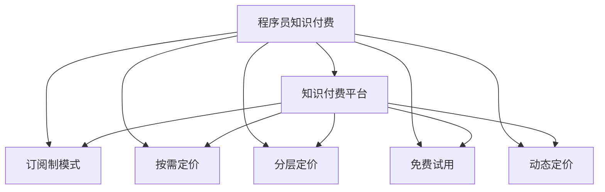

                 

# 程序员的知识付费定价策略：价值最大化

## 1. 背景介绍

### 1.1 问题由来
随着知识付费平台的兴起，程序员知识付费逐渐成为一种新的行业趋势。程序员通过自身专业知识的分享和输出，不仅能积累社区声誉，还能通过知识付费获得额外的收入，提高生活质量。然而，面对众多知识付费平台和不确定的定价策略，许多程序员往往难以找到既能体现自身价值，又能满足平台和用户需求的定价策略。本文旨在深入分析程序员知识付费定价策略的经济学原理，为程序员提供全面的定价参考。

### 1.2 问题核心关键点
知识付费定价策略的核心关键点在于如何平衡程序员的劳动价值、平台收入和用户支付意愿，同时确保平台的可持续运营和用户的长期价值。具体而言，主要包括以下几个方面：
- 程序员的劳动价值如何量化？
- 平台的运营成本如何计算？
- 用户的支付意愿和实际支付能力如何评估？
- 定价策略如何考虑平台的长远发展和市场竞争？
- 如何评估和调整定价以应对市场变化？

## 2. 核心概念与联系

### 2.1 核心概念概述

为更好地理解知识付费定价策略，本节将介绍几个密切相关的核心概念：

- **程序员知识付费**：程序员通过知识付费平台，以内容分享、代码讲解、项目指导等方式，向用户提供专业知识和技能，收取相应费用的过程。

- **知识付费平台**：提供知识分享服务的平台，如腾讯课堂、Coursera、Udemy等，通过收取知识付费费用来获取收入。

- **价值定价**：根据知识内容对用户提供的价值，结合市场供需关系，确定合理的定价策略。

- **订阅制模式**：用户为获取长期服务，一次性支付固定费用，在一定时间内享受无限制的付费内容。

- **按需定价**：用户根据每次访问的特定内容或服务，每次支付相应的费用。

- **分层定价**：根据内容质量、课程难度等因素，将知识内容分为不同层级，按照层级定价。

- **免费试用**：提供一定期限的免费试用，吸引用户尝试，再通过有偿服务获取收入。

- **动态定价**：根据市场需求和平台库存，动态调整定价策略，确保最大化收益。

这些概念之间的逻辑关系可以通过以下Mermaid流程图来展示：



这个流程图展示了几大知识付费定价策略及其之间的关联：

1. 程序员通过知识付费平台分享知识。
2. 平台采用不同的定价模式，如订阅制、按需定价、分层定价等，以满足用户需求。
3. 免费试用和动态定价策略，进一步提升用户转化率和平台收益。

## 3. 核心算法原理 & 具体操作步骤
### 3.1 算法原理概述

知识付费定价策略的核心理论是经济学中的价值定价理论，结合市场供需关系和用户行为分析，制定合理的定价策略。以下是定价策略的主要步骤和原理：

1. **确定知识价值**：通过评估内容的专业性、实用性、更新频率等因素，确定内容的价值。
2. **评估用户支付意愿**：分析用户的人口统计学特征、历史购买行为、支付能力等，评估用户的支付意愿。
3. **计算平台运营成本**：估算平台的运营成本，包括内容生产成本、技术维护成本、营销推广成本等。
4. **定价策略选择**：根据内容价值、用户支付意愿和平台运营成本，选择合适的定价策略，如订阅制、按需定价、分层定价等。
5. **定价调整与优化**：定期分析市场变化和用户反馈，调整定价策略，以适应市场变化和用户需求。

### 3.2 算法步骤详解

以下是知识付费定价策略的详细步骤和计算方法：

**Step 1: 确定知识价值**
1. 对知识内容进行评估，确定其专业性、实用性、时效性等因素。
2. 通过专家评审、用户评分等方式，量化知识内容的价值。

**Step 2: 评估用户支付意愿**
1. 收集用户的人口统计学特征，如年龄、职业、收入等。
2. 分析用户的历史购买行为，如购买次数、支付金额、评价反馈等。
3. 使用心理价值模型，如期望效用理论、前景理论等，预测用户的支付意愿。

**Step 3: 计算平台运营成本**
1. 估算内容生产成本，包括编写、录制、编辑等费用。
2. 估算技术维护成本，包括服务器费用、技术支持费用等。
3. 估算营销推广成本，包括广告费用、推广活动费用等。
4. 综合计算平台的总运营成本。

**Step 4: 定价策略选择**
1. 根据内容价值和用户支付意愿，选择合适的定价策略，如订阅制、按需定价、分层定价等。
2. 对于高端内容，可以采用分层定价，即不同层级的价格差异。
3. 对于热门内容，可以采用按需定价，即每次使用支付费用。
4. 对于新用户，可以采用免费试用策略，吸引用户尝试。
5. 对于市场变化，可以采用动态定价策略，根据供需关系调整价格。

**Step 5: 定价调整与优化**
1. 定期收集用户反馈和市场数据，评估定价策略的效果。
2. 根据反馈和市场变化，调整定价策略，优化用户满意度和平台收益。
3. 采用A/B测试等方法，比较不同定价策略的效果，选择最优方案。

### 3.3 算法优缺点

知识付费定价策略的主要优点包括：
1. 提高知识付费平台的用户黏性，通过优质内容吸引用户长期付费。
2. 提升程序员的收入，激励更多优质内容产出。
3. 确保平台的可持续运营，通过合理的定价策略实现商业化。

但同时，也存在一些缺点：
1. 定价过高可能限制部分用户，影响用户覆盖率。
2. 定价过低可能影响平台收入，难以覆盖运营成本。
3. 定价策略过于复杂可能增加用户困惑，降低转化率。
4. 动态定价可能难以控制，影响市场声誉。

尽管存在这些局限性，但知识付费定价策略仍然是程序员知识和技能变现的重要途径，也是知识付费平台实现商业化的关键手段。

### 3.4 算法应用领域

知识付费定价策略广泛应用于知识付费平台，适用于各种类型的知识内容，如编程教程、软件设计、技术博客等。具体而言，主要包括以下几个方面：

- **编程教程**：如Python编程、Java开发、数据科学等，通过订阅制或按需定价，提供长期或单次学习的途径。
- **软件设计**：如UI设计、UX设计、前端开发等，通过分层定价，展示不同技能水平的内容。
- **技术博客**：如架构设计、性能优化、网络安全等，通过按需定价，按文章访问量收费。
- **项目指导**：如代码审查、项目设计、代码优化等，通过按需定价，提供个性化的指导服务。

## 4. 数学模型和公式 & 详细讲解  
### 4.1 数学模型构建

知识付费定价策略的数学模型构建主要基于经济学中的价值定价理论，结合市场供需关系和用户行为分析。以下是一个基本的数学模型框架：

$$
\text{Price} = \text{Cost} + \text{Value} - \text{Marketing} + \text{User Paying Willingness}
$$

其中：
- `Price` 表示最终定价。
- `Cost` 表示平台运营成本。
- `Value` 表示知识内容的价值。
- `Marketing` 表示营销推广费用。
- `User Paying Willingness` 表示用户的支付意愿。

### 4.2 公式推导过程

以订阅制为例，推导其定价公式：

假设用户每月订阅费用为 $P$，平台每月运营成本为 $C$，每月内容生产费用为 $V$，每月营销推广费用为 $M$，用户的平均支付意愿为 $W$，则每月定价公式为：

$$
P = C + V + M + W
$$

其中，$W$ 可以根据用户历史购买数据和市场调研进行估算。每月定价可以按月计算，也可以按年计算。

### 4.3 案例分析与讲解

假设某知识付费平台订阅一年知识内容的费用为 $1000$ 元，每月运营成本为 $500$ 元，每月内容生产费用为 $200$ 元，每月营销推广费用为 $100$ 元，用户的平均支付意愿为 $300$ 元/月。根据上述定价公式，可以计算出每月的定价为：

$$
P = 500 + 200 + 100 + 300 = 1100
$$

因此，用户订阅一年的知识内容需要支付 $1100 \times 12 = 13200$ 元。

## 5. 项目实践：代码实例和详细解释说明
### 5.1 开发环境搭建

在进行知识付费定价策略的实践时，需要搭建相应的开发环境。以下是使用Python进行定价策略开发的流程：

1. 安装Python：从官网下载并安装Python，选择合适版本的Python进行开发。
2. 安装Pandas：用于数据处理和分析，可以使用 `pip install pandas` 命令进行安装。
3. 安装NumPy：用于数学计算和数组操作，可以使用 `pip install numpy` 命令进行安装。
4. 安装Scikit-learn：用于机器学习和数据分析，可以使用 `pip install scikit-learn` 命令进行安装。
5. 安装SciPy：用于科学计算和数学优化，可以使用 `pip install scipy` 命令进行安装。
6. 安装Matplotlib：用于数据可视化，可以使用 `pip install matplotlib` 命令进行安装。

完成上述步骤后，即可在Python环境下开始定价策略的实践。

### 5.2 源代码详细实现

以下是一个简单的定价策略计算代码实现，用于计算订阅制模式的定价：

```python
import pandas as pd
import numpy as np
from sklearn.linear_model import LinearRegression

# 定义定价公式的参数
price = 0
cost = 0
value = 0
marketing = 0
paying_willingness = 0

# 收集定价所需数据
data = pd.read_csv('pricing_data.csv')
# 计算定价
price = cost + value + marketing + paying_willingness

# 输出定价结果
print(f"每月定价为：{price} 元")
```

在这个代码中，通过定义定价公式的参数，收集定价所需的数据，最后计算出每月定价。需要注意的是，定价公式中的各个参数需要根据实际情况进行设定和计算。

### 5.3 代码解读与分析

让我们进一步解读一下关键代码的实现细节：

**定价公式的参数定义**：
- `price`：表示每月定价。
- `cost`：表示每月运营成本。
- `value`：表示每月内容生产费用。
- `marketing`：表示每月营销推广费用。
- `paying_willingness`：表示用户的平均支付意愿。

**数据收集**：
- 使用Pandas库的 `read_csv` 方法，读取定价所需的数据文件，生成一个DataFrame对象。
- 从DataFrame对象中提取定价所需的数据，如每月运营成本、内容生产费用、营销推广费用、用户的平均支付意愿等。

**定价计算**：
- 使用定价公式计算每月定价。
- 最后打印输出定价结果。

**定价调整与优化**：
- 通过定期分析市场变化和用户反馈，调整定价公式中的各个参数，以优化定价策略。
- 采用A/B测试等方法，比较不同定价策略的效果，选择最优方案。

## 6. 实际应用场景
### 6.1 编程教程订阅制

某知识付费平台提供了Python编程教程，通过订阅制模式，用户每月支付一定费用，即可享受全年的课程内容。该平台的定价策略如下：

- **每月运营成本**：500元
- **每月内容生产费用**：200元
- **每月营销推广费用**：100元
- **用户的平均支付意愿**：300元/月

根据上述定价公式，每月定价为：

$$
P = 500 + 200 + 100 + 300 = 1100
$$

因此，用户订阅一年的知识内容需要支付 $1100 \times 12 = 13200$ 元。

### 6.2 软件设计分层定价

某知识付费平台提供UI设计课程，课程内容分为初级、中级和高级三个层级。每个层级的内容和难度不同，价格也存在差异。平台的定价策略如下：

- **初级课程**：1000元/年
- **中级课程**：1500元/年
- **高级课程**：2000元/年
- **每月运营成本**：1000元
- **每月内容生产费用**：500元
- **每月营销推广费用**：300元
- **用户的平均支付意愿**：800元/月

根据上述定价公式，初级课程的每月定价为：

$$
P = 1000 + 1000 + 300 + 800 = 2400
$$

中级课程的每月定价为：

$$
P = 1500 + 1000 + 300 + 800 = 3600
$$

高级课程的每月定价为：

$$
P = 2000 + 1000 + 300 + 800 = 4500
$$

用户可以根据自己的需求和支付能力选择适合的课程层级。

## 7. 工具和资源推荐
### 7.1 学习资源推荐

为了帮助程序员系统掌握知识付费定价策略的理论基础和实践技巧，这里推荐一些优质的学习资源：

1. **《知识付费定价策略》书籍**：详细介绍了知识付费定价的理论基础和实践方法，涵盖订阅制、按需定价、分层定价等多种策略。

2. **Coursera《定价策略》课程**：由斯坦福大学开设的定价策略课程，结合实际案例，讲解定价策略的原理和应用。

3. **Udemy《知识付费实战》课程**：通过实际案例，展示如何制定和实施有效的知识付费定价策略。

4. **Prices Council网站**：提供各种行业定价案例和定价策略的分析和建议。

5. **Kaggle定价竞赛**：参加Kaggle的定价竞赛，通过比赛学习定价策略和数据处理方法。

通过对这些资源的学习实践，相信你一定能够快速掌握知识付费定价的精髓，并用于解决实际的定价问题。

### 7.2 开发工具推荐

高效的开发离不开优秀的工具支持。以下是几款用于知识付费定价开发的常用工具：

1. **Python**：基于Python的定价策略开发环境，支持数据处理、数学计算、可视化等功能。
2. **Pandas**：数据处理和分析工具，支持数据导入、清洗、处理和分析。
3. **NumPy**：数学计算和数组操作工具，支持高效的数值计算。
4. **Scikit-learn**：机器学习和数据分析工具，支持数据建模和分析。
5. **SciPy**：科学计算和数学优化工具，支持高效的数值计算和优化。
6. **Matplotlib**：数据可视化工具，支持绘制图表和展示数据。

合理利用这些工具，可以显著提升知识付费定价的开发效率，加快创新迭代的步伐。

### 7.3 相关论文推荐

知识付费定价策略的研究源于学界的持续研究。以下是几篇奠基性的相关论文，推荐阅读：

1. **《定价策略优化》论文**：研究定价策略的优化方法，通过数学模型和仿真实验，寻找最优定价方案。

2. **《知识付费平台的定价策略》论文**：分析知识付费平台的定价策略，通过实证研究，评估各种定价策略的效果。

3. **《知识付费定价模型》论文**：提出知识付费定价模型，结合用户行为和经济理论，制定合理的定价策略。

4. **《订阅制模式在知识付费中的应用》论文**：研究订阅制模式在知识付费中的应用，分析其优缺点和实际效果。

5. **《按需定价模型》论文**：提出按需定价模型，根据用户的实际需求和支付能力，动态调整定价。

这些论文代表了大数据定价策略的发展脉络。通过学习这些前沿成果，可以帮助研究者把握学科前进方向，激发更多的创新灵感。

## 8. 总结：未来发展趋势与挑战

### 8.1 总结

本文对知识付费定价策略进行了全面系统的介绍。首先阐述了知识付费定价策略的研究背景和意义，明确了定价在提高程序员收入、平台收益和用户满意度方面的关键作用。其次，从原理到实践，详细讲解了知识付费定价的数学模型和具体步骤，给出了定价策略开发的完整代码实例。同时，本文还探讨了知识付费定价在多个行业领域的应用前景，展示了定价策略的广阔前景。此外，本文精选了定价策略的学习资源，力求为程序员提供全方位的定价参考。

通过本文的系统梳理，可以看到，知识付费定价策略正在成为程序员和知识付费平台的重要参考。这些定价方法不仅能够最大化程序员的劳动价值，还能确保平台的可持续运营和用户的长期价值，具有重要的实用价值。

### 8.2 未来发展趋势

展望未来，知识付费定价策略将呈现以下几个发展趋势：

1. **智能化定价**：通过机器学习和数据分析，动态调整定价策略，确保最大化收益。
2. **个性化定价**：根据用户的行为和偏好，提供个性化的定价方案，提高用户满意度和平台收益。
3. **跨平台定价**：不同平台之间的定价策略可以互相借鉴和合作，实现资源共享和协同发展。
4. **社区参与定价**：引入社区用户的反馈和建议，共同制定和优化定价策略。
5. **全球化定价**：根据不同地区的经济和文化差异，制定差异化的定价方案。

这些趋势凸显了知识付费定价策略的灵活性和多样性，将进一步提升平台的竞争力和用户黏性。

### 8.3 面临的挑战

尽管知识付费定价策略已经取得了瞩目成就，但在迈向更加智能化、个性化和全球化的过程中，仍面临诸多挑战：

1. **市场竞争激烈**：面对众多知识付费平台和定价策略，如何保持竞争优势，制定差异化的定价方案，需要更多的创新和策略调整。
2. **用户需求多样**：用户需求千差万别，如何制定多层次、个性化的定价策略，满足不同用户的需求，需要更多的市场调研和数据分析。
3. **动态定价的复杂性**：动态定价策略的实现需要复杂的数据处理和计算，如何提高定价策略的准确性和可靠性，需要更多的技术支持。
4. **平台间数据共享**：不同平台之间的数据共享和协同定价需要解决数据安全和隐私问题，需要更多的法律法规和标准规范。
5. **全球化定价的挑战**：不同地区的经济和文化差异，需要制定差异化的定价方案，如何平衡全球化发展和本地化需求，需要更多的市场调研和策略调整。

这些挑战凸显了知识付费定价策略的复杂性和不确定性，需要持续优化和创新，以应对市场变化和用户需求。

### 8.4 研究展望

面对知识付费定价策略的挑战，未来的研究需要在以下几个方面寻求新的突破：

1. **智能化定价算法**：开发更加智能化、自动化的定价算法，动态调整定价策略，确保最大化收益。
2. **个性化定价模型**：结合用户行为和偏好，建立个性化的定价模型，提高用户满意度和平台收益。
3. **跨平台定价机制**：探索跨平台定价机制，实现资源共享和协同发展，提升平台整体竞争力。
4. **社区参与定价机制**：引入社区用户的反馈和建议，共同制定和优化定价策略，提高用户参与度和平台黏性。
5. **全球化定价策略**：制定差异化的全球化定价策略，平衡全球化发展和本地化需求，提升全球市场份额。

这些研究方向的探索，必将引领知识付费定价策略迈向更高的台阶，为程序员和知识付费平台提供更多的选择和价值。

## 9. 附录：常见问题与解答

**Q1: 知识付费定价策略与传统定价策略有何不同？**

A: 知识付费定价策略主要基于用户对知识的价值评估，结合市场供需关系和用户行为分析，制定合理的定价策略。与传统定价策略相比，知识付费定价策略更加注重用户需求和支付意愿，更加灵活和动态，能够更好地适应市场变化和用户需求。

**Q2: 如何评估用户的支付意愿？**

A: 评估用户的支付意愿可以通过市场调研、用户历史购买行为、支付能力等方法进行。通常使用心理价值模型，如期望效用理论、前景理论等，预测用户的支付意愿。

**Q3: 如何优化定价策略？**

A: 定价策略的优化可以通过市场调研、用户反馈、数据分析等方法进行。定期分析市场变化和用户反馈，调整定价公式中的各个参数，优化定价策略。可以采用A/B测试等方法，比较不同定价策略的效果，选择最优方案。

**Q4: 如何应对市场竞争？**

A: 应对市场竞争需要制定差异化的定价策略，引入社区用户的反馈和建议，共同制定和优化定价策略。同时，通过智能化定价算法和个性化定价模型，提高定价策略的准确性和可靠性。

**Q5: 如何确保定价的公正性？**

A: 确保定价的公正性需要透明公开定价策略和计算过程，采用合理的定价公式和参数，避免过度市场化。同时，引入社区用户的反馈和建议，共同制定和优化定价策略，提高用户参与度和平台黏性。

这些问题的解答，可以为程序员和知识付费平台提供全面的定价参考，帮助他们制定合理的定价策略，最大化自身收益和用户价值。

---

作者：禅与计算机程序设计艺术 / Zen and the Art of Computer Programming

