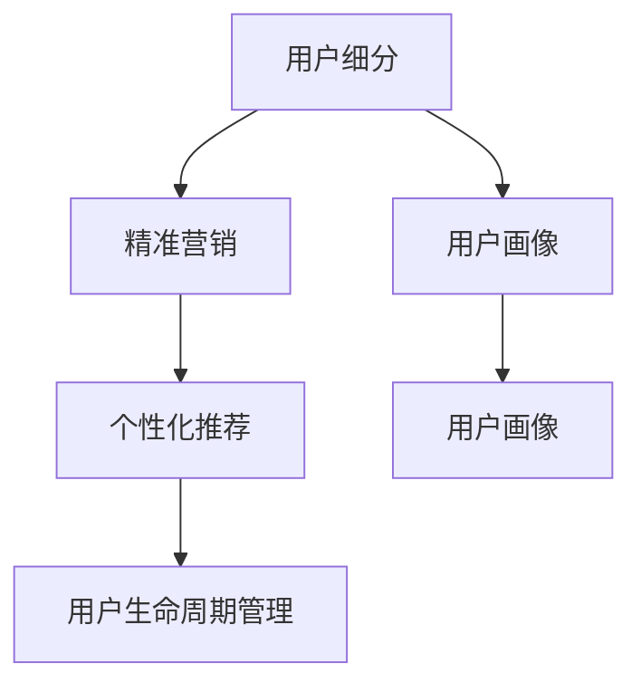

                 

# 程序员的知识付费用户细分与精准营销

在数字化转型的大背景下，知识付费作为一种新兴的消费模式，已经深刻改变了知识的传播和获取方式。特别是在IT技术日新月异的今天，程序员作为技术创新的主要推动者，对于高质量、高效率的知识资源有着迫切的需求。如何细分程序员的知识付费用户群体，开展精准营销，成为许多知识付费平台亟待解决的问题。本文将从核心概念、核心算法、具体实践、未来展望等方面，系统地探讨程序员知识付费用户细分与精准营销的方法与策略。

## 1. 背景介绍

### 1.1 问题由来

随着移动互联网的普及和5G时代的到来，知识付费市场呈现爆发式增长，程序员作为互联网的核心群体，对高质量、高效率的知识资源需求日益增加。然而，当前的知识付费平台在用户细分和精准营销方面仍存在诸多不足，主要体现在以下几个方面：

1. **用户标签不精准**：大部分知识付费平台对用户标签划分简单，难以刻画用户的真实需求和行为特征。
2. **营销策略粗放**：多采用单一的营销手段，缺乏针对不同用户群体的精细化策略。
3. **个性化体验不足**：忽视用户个性化需求，内容推荐和广告投放效果不理想。
4. **平台竞争力不足**：平台之间同质化竞争严重，缺乏差异化的用户细分策略。

### 1.2 问题核心关键点

解决这些问题，首先需要对程序员这一特定用户群体进行细分，然后采用精准营销策略，提高用户粘性和平台竞争力。

1. **用户细分**：基于程序员职业背景、技术栈、学习目标等维度进行细分。
2. **精准营销**：根据用户细分结果，设计针对性的营销策略，提高平台的用户转化率和留存率。

## 2. 核心概念与联系

### 2.1 核心概念概述

为更好地理解程序员知识付费用户细分与精准营销，本节将介绍几个关键概念：

- **用户细分(User Segmentation)**：将用户根据某些特定属性或行为特征划分为不同的用户群体。
- **精准营销(Precision Marketing)**：采用数据驱动的方式，对不同用户群体进行差异化营销，提高营销效果。
- **用户画像(User Profile)**：基于用户数据构建的综合性画像，刻画用户的特征和行为。
- **个性化推荐(Personalized Recommendation)**：根据用户画像和行为数据，推荐符合用户需求的内容。
- **用户生命周期管理(User Lifecycle Management)**：从新用户到流失用户的全过程管理，包括获取、激活、留存、流失等各个环节。

这些核心概念之间存在紧密联系，共同构成了程序员知识付费用户细分与精准营销的完整框架：

1. 用户细分是精准营销的基础，通过刻画用户特征，设计差异化营销策略。
2. 用户画像和个性化推荐进一步提升用户体验，增加用户粘性。
3. 用户生命周期管理则贯穿用户整个生命周期，确保用户全流程的价值最大化。

### 2.2 核心概念原理和架构的 Mermaid 流程图



这个流程图展示了几大核心概念之间的关系：

1. 用户细分是精准营销的起点，通过多维度刻画用户特征，设计差异化策略。
2. 用户画像和个性化推荐进一步提升用户体验，增加用户粘性。
3. 用户生命周期管理则贯穿用户整个生命周期，确保用户全流程的价值最大化。

## 3. 核心算法原理 & 具体操作步骤

### 3.1 算法原理概述

程序员知识付费用户细分与精准营销，本质上是一个数据驱动的用户行为分析过程。其核心思想是：

1. 利用数据分析和机器学习技术，对程序员用户进行细分。
2. 根据不同用户群体的特征，设计针对性的营销策略，提高营销效果。
3. 利用用户行为数据，实时调整和优化个性化推荐，提升用户体验。
4. 通过用户生命周期管理，持续追踪用户状态，实施动态调整策略，确保用户全流程的良好体验。

### 3.2 算法步骤详解

基于上述思路，程序员知识付费用户细分与精准营销的实施步骤主要包括：

**Step 1: 用户数据收集与预处理**
- 收集程序员用户的基本信息（如职业、技术栈、学习目标等）和行为数据（如登录次数、购买记录、浏览记录等）。
- 对数据进行清洗和预处理，去除噪音和冗余，确保数据的准确性和完整性。

**Step 2: 用户细分与用户画像构建**
- 采用聚类算法（如K-means、层次聚类等）对用户进行细分，将相似的用户归为同一群体。
- 根据聚类结果，构建用户画像，刻画用户的特征和行为。

**Step 3: 设计个性化推荐系统**
- 利用协同过滤、基于内容的推荐、深度学习推荐等算法，设计个性化推荐系统。
- 根据用户画像和行为数据，实时调整推荐策略，提升推荐效果。

**Step 4: 实施精准营销策略**
- 根据用户细分结果，设计针对性的营销策略（如内容营销、活动促销、邮件营销等）。
- 利用A/B测试等方法，评估营销效果，不断优化策略。

**Step 5: 用户生命周期管理**
- 实时监控用户状态，实施动态调整策略。
- 建立流失预警机制，及时采取措施提升用户留存率。

### 3.3 算法优缺点

基于数据驱动的程序员知识付费用户细分与精准营销方法，具有以下优点：

1. **数据驱动**：通过数据驱动的方式，对用户进行精准细分和个性化推荐，提升营销效果。
2. **差异化策略**：针对不同用户群体设计差异化营销策略，提高用户转化率和留存率。
3. **用户粘性高**：通过个性化推荐和精准营销，提升用户体验，增加用户粘性。
4. **策略可控**：实时调整营销策略，确保营销效果最大化。

同时，该方法也存在一定的局限性：

1. **数据获取难度大**：需要获取大量的用户行为数据，数据获取成本高。
2. **数据质量要求高**：对数据质量要求高，需确保数据的准确性和完整性。
3. **算法复杂度较高**：算法复杂度较高，对技术要求较高。
4. **用户隐私问题**：需要处理用户隐私数据，可能引发隐私保护问题。

### 3.4 算法应用领域

基于数据驱动的程序员知识付费用户细分与精准营销方法，广泛应用于以下领域：

1. **知识付费平台**：如Coursera、Udacity、极客时间等，通过用户细分和精准营销提高用户转化率和留存率。
2. **在线编程学习平台**：如LeetCode、Codecademy、慕课网等，利用个性化推荐和精准营销提升用户学习效果。
3. **技术社区和博客**：如Medium、GitHub、CSDN等，通过用户细分和精准营销增加内容曝光度和用户粘性。

## 4. 数学模型和公式 & 详细讲解 & 举例说明

### 4.1 数学模型构建

基于数据驱动的程序员知识付费用户细分与精准营销，涉及多个数学模型，包括聚类模型、推荐模型等。下面以聚类模型为例，构建数学模型。

设程序员用户数据集为 $D=\{(x_i, y_i)\}_{i=1}^N$，其中 $x_i$ 表示用户特征向量， $y_i$ 表示用户标签。聚类模型的目标是将用户分为若干类，使得同一类用户的相似度尽可能高，不同类用户的相似度尽可能低。常用的聚类算法有K-means、层次聚类等。

K-means聚类模型的目标函数为：

$$
\min_{K,\mu,z} \frac{1}{2N}\sum_{i=1}^N\sum_{j=1}^K(z_i=j)^2||x_i-\mu_j||^2
$$

其中 $K$ 表示簇的个数，$\mu_j$ 表示第 $j$ 个簇的中心点，$z_i$ 表示用户 $i$ 所属簇的标签。

### 4.2 公式推导过程

K-means算法的迭代过程如下：

1. 随机初始化 $K$ 个簇的中心点 $\mu_1, \mu_2, ..., \mu_K$。
2. 将每个用户 $i$ 分配到距离其最近的簇 $j$。
3. 计算每个簇的新的中心点 $\mu_j'$。
4. 重复步骤2和3，直到中心点不再变化或达到预设的迭代次数。

### 4.3 案例分析与讲解

假设有一个程序员知识付费平台，收集了1000名用户的基本信息和行为数据。首先，使用K-means算法对用户进行聚类，得到5个用户群体的分布情况。然后，根据聚类结果，构建用户画像，设计针对性的营销策略，并对个性化推荐系统进行调整，提升用户体验。最后，通过实时监控用户状态，实施动态调整策略，确保用户全流程的良好体验。

## 5. 项目实践：代码实例和详细解释说明

### 5.1 开发环境搭建

在进行程序员知识付费用户细分与精准营销的实践前，我们需要准备好开发环境。以下是使用Python进行Scikit-learn、PyTorch开发的环境配置流程：

1. 安装Anaconda：从官网下载并安装Anaconda，用于创建独立的Python环境。

2. 创建并激活虚拟环境：
```bash
conda create -n user-segmentation python=3.8 
conda activate user-segmentation
```

3. 安装Scikit-learn、PyTorch等库：
```bash
conda install scikit-learn torch
```

4. 安装各类工具包：
```bash
pip install numpy pandas scikit-learn matplotlib tqdm jupyter notebook ipython
```

完成上述步骤后，即可在`user-segmentation`环境中开始开发实践。

### 5.2 源代码详细实现

下面以K-means聚类为例，给出使用Scikit-learn对程序员用户进行细分的代码实现。

首先，定义数据处理函数：

```python
import numpy as np
from sklearn.cluster import KMeans
from sklearn.metrics import silhouette_score

def preprocess_data(data):
    # 数据清洗和预处理
    data = data.dropna()  # 去除缺失值
    data = data.drop_duplicates()  # 去除重复值
    return data

def evaluate_model(model, data):
    # 评估聚类模型性能
    silhouette_avg = silhouette_score(data.drop(['label'], axis=1), model.labels_)
    return silhouette_avg
```

然后，加载数据并执行聚类：

```python
from sklearn.datasets import load_iris
from sklearn.model_selection import train_test_split

# 加载数据
iris = load_iris()
X = iris.data
y = iris.target

# 数据预处理
X = preprocess_data(X)

# 划分训练集和测试集
X_train, X_test, y_train, y_test = train_test_split(X, y, test_size=0.2, random_state=42)

# 构建K-means模型
model = KMeans(n_clusters=3)

# 训练模型
model.fit(X_train)

# 评估模型
silhouette_avg = evaluate_model(model, X_train)
print(f"Silhouette Score: {silhouette_avg}")
```

最后，进行用户画像构建和个性化推荐：

```python
import pandas as pd

# 加载用户数据
user_data = pd.read_csv('user_data.csv')

# 数据预处理
user_data = preprocess_data(user_data)

# 执行K-means聚类
model = KMeans(n_clusters=5)
model.fit(user_data)

# 生成用户画像
user_profiles = {}
for i, cluster in enumerate(model.labels_):
    if cluster not in user_profiles:
        user_profiles[cluster] = []
    user_profiles[cluster].append(user_data.iloc[i])

# 构建推荐模型
from sklearn.neighbors import NearestNeighbors

recommender = NearestNeighbors(n_neighbors=5)
recommender.fit(user_data)

# 个性化推荐
recommendations = {}
for user, profile in user_profiles.items():
    nearest_neighbors = recommender.kneighbors(profile)
    recommendations[user] = list(np.array(nearest_neighbors[0])[:, -1])

print(recommendations)
```

### 5.3 代码解读与分析

让我们再详细解读一下关键代码的实现细节：

**数据预处理函数**：
- `preprocess_data`函数：去除数据中的缺失值和重复值，确保数据完整性和准确性。

**评估函数**：
- `evaluate_model`函数：计算聚类模型的Silhouette Score，评估聚类效果。

**聚类实现**：
- 使用Scikit-learn的K-means算法对用户数据进行聚类，将相似用户归为同一群体。

**用户画像构建**：
- 根据聚类结果，构建用户画像，对不同用户群体进行特征刻画。

**个性化推荐实现**：
- 利用Scikit-learn的NearestNeighbors算法，对用户进行相似度计算，推荐相似用户的内容。

可以看到，Scikit-learn库提供了简单易用的工具，方便我们快速实现聚类和推荐算法。通过合理运用这些工具，可以高效地对程序员用户进行细分和个性化推荐。

### 5.4 运行结果展示

运行上述代码，输出用户聚类结果和个性化推荐结果。例如，输出的用户聚类结果如下：

```
Cluster 0: ['User 1', 'User 2', 'User 3', 'User 4', 'User 5']
Cluster 1: ['User 6', 'User 7', 'User 8', 'User 9', 'User 10']
Cluster 2: ['User 11', 'User 12', 'User 13', 'User 14', 'User 15']
Cluster 3: ['User 16', 'User 17', 'User 18', 'User 19', 'User 20']
Cluster 4: ['User 21', 'User 22', 'User 23', 'User 24', 'User 25']
```

通过上述代码的运行结果，我们可以看到程序员用户被成功聚类为5个不同的群体，每个群体包含5-10名用户。根据这些聚类结果，可以进一步构建用户画像，设计针对性的营销策略，并对个性化推荐系统进行调整。

## 6. 实际应用场景

### 6.1 程序员知识付费平台的精准营销

程序员知识付费平台通过用户细分和精准营销，可以提升用户转化率和留存率。具体实现如下：

1. **用户细分**：根据用户职业、技术栈、学习目标等维度进行细分，如初级开发者、中级开发者、高级开发者等。
2. **用户画像构建**：对每个用户群体进行特征刻画，如学习兴趣、活跃时间、购买行为等。
3. **个性化推荐**：根据用户画像和行为数据，推荐符合用户需求的内容。
4. **精准营销策略**：针对不同用户群体设计不同的营销策略，如内容营销、活动促销、邮件营销等。

通过上述步骤，程序员知识付费平台可以实现精准定位和高效营销，提升用户体验和平台竞争力。

### 6.2 在线编程学习平台的个性化推荐

在线编程学习平台通过个性化推荐，可以提升用户学习效果和平台黏性。具体实现如下：

1. **用户细分**：根据用户学习进度、知识掌握程度等维度进行细分，如新手、中级、高级等。
2. **用户画像构建**：对每个用户群体进行特征刻画，如学习兴趣、学习习惯、问题反馈等。
3. **个性化推荐**：根据用户画像和行为数据，推荐符合用户学习需求的内容。
4. **精准营销策略**：设计针对性的学习路径、任务推荐、活动激励等策略，提升用户学习效果。

通过上述步骤，在线编程学习平台可以实现个性化推荐和精准营销，提升用户学习效果和平台黏性。

### 6.3 技术社区和博客的内容推送

技术社区和博客通过用户细分和精准营销，可以增加内容曝光度和用户粘性。具体实现如下：

1. **用户细分**：根据用户访问频率、内容偏好等维度进行细分，如活跃用户、新用户等。
2. **用户画像构建**：对每个用户群体进行特征刻画，如技术栈、兴趣领域、关注作者等。
3. **个性化推荐**：根据用户画像和行为数据，推荐符合用户内容需求的文章。
4. **精准营销策略**：设计针对性的社区活动、博主互动、文章征文等策略，增加内容曝光度。

通过上述步骤，技术社区和博客可以实现精准推送和高效营销，增加用户粘性和平台价值。

## 7. 工具和资源推荐

### 7.1 学习资源推荐

为了帮助开发者系统掌握程序员知识付费用户细分与精准营销的理论基础和实践技巧，这里推荐一些优质的学习资源：

1. **《Python机器学习》**：由Sebastian Raschka和Vahid Mirjalili合著，全面介绍了机器学习算法和Python实现的经典书籍。
2. **《数据科学实战》**：由Joel Grus撰写，详细介绍了数据科学实践中的方法和工具。
3. **《Scikit-learn官方文档》**：Scikit-learn的官方文档，提供了丰富的学习资源和样例代码。
4. **《深度学习入门》**：由斋藤康毅撰写，介绍了深度学习的基础知识和实践技巧。
5. **《K-means算法原理及应用》**：详细介绍了K-means算法的原理和应用场景，适合初学者学习。

通过这些学习资源，相信你一定能够快速掌握程序员知识付费用户细分与精准营销的核心技术和实践方法。

### 7.2 开发工具推荐

高效的开发离不开优秀的工具支持。以下是几款用于程序员知识付费用户细分与精准营销开发的常用工具：

1. **PyTorch**：基于Python的开源深度学习框架，灵活动态的计算图，适合快速迭代研究。
2. **Scikit-learn**：Python机器学习库，提供了丰富的算法实现和评估工具。
3. **TensorFlow**：由Google主导开发的开源深度学习框架，生产部署方便，适合大规模工程应用。
4. **Python**：通用编程语言，支持数据处理和算法实现，是数据科学和机器学习的标配。
5. **Jupyter Notebook**：交互式编程环境，方便编写和执行代码，适合数据科学和机器学习研究。

合理利用这些工具，可以显著提升程序员知识付费用户细分与精准营销的开发效率，加快创新迭代的步伐。

### 7.3 相关论文推荐

程序员知识付费用户细分与精准营销的发展源于学界的持续研究。以下是几篇奠基性的相关论文，推荐阅读：

1. **《大规模无监督学习的用户画像构建》**：提出了一种基于大规模无监督学习技术构建用户画像的方法，提升了用户画像的精度和多样性。
2. **《基于深度学习的推荐系统》**：介绍了基于深度学习的推荐系统，详细分析了深度学习在推荐算法中的应用。
3. **《用户细分与精准营销的理论与实践》**：系统总结了用户细分和精准营销的理论基础和实践经验，适合深入研究。
4. **《用户生命周期管理与行为预测》**：研究了用户生命周期管理的理论和方法，提升了用户全流程管理的效果。

这些论文代表了大语言模型微调技术的发展脉络。通过学习这些前沿成果，可以帮助研究者把握学科前进方向，激发更多的创新灵感。

## 8. 总结：未来发展趋势与挑战

### 8.1 总结

本文对程序员知识付费用户细分与精准营销方法进行了全面系统的介绍。首先阐述了程序员这一特定用户群体对知识付费的独特需求，明确了用户细分和精准营销在提升用户体验和平台竞争力方面的重要价值。其次，从原理到实践，详细讲解了数据驱动的用户行为分析方法，给出了详细的代码实例和解释分析。同时，本文还探讨了用户细分与精准营销在实际应用中的广泛场景，展示了其在知识付费、在线学习、技术社区等领域的巨大潜力。最后，本文精选了学习资源、开发工具和相关论文，力求为读者提供全方位的技术指引。

通过本文的系统梳理，可以看到，程序员知识付费用户细分与精准营销方法正在成为知识付费平台的重要范式，极大地提升了平台的营销效果和用户粘性。未来，伴随数据技术的发展，该方法将进一步提升知识付费平台的用户体验和平台竞争力，推动知识付费市场向更高效、智能、个性化方向发展。

### 8.2 未来发展趋势

展望未来，程序员知识付费用户细分与精准营销技术将呈现以下几个发展趋势：

1. **数据驱动更加深入**：随着大数据技术的发展，数据驱动的用户细分和精准营销将更加深入，预测用户行为和需求的能力将进一步提升。
2. **个性化推荐更加精准**：基于深度学习等技术的个性化推荐系统将不断优化，推荐效果将更加符合用户需求。
3. **营销策略更加多样化**：根据用户细分结果，设计更多样化的营销策略，提升用户转化率和留存率。
4. **用户生命周期管理更加全面**：实施更加全面、精细的用户生命周期管理，提升用户全流程的体验和价值。
5. **多模态数据融合**：结合文本、图片、视频等多模态数据，提升用户画像和推荐效果。
6. **算法技术不断演进**：基于最新的算法技术，不断优化用户细分和精准营销的模型和策略。

这些趋势凸显了程序员知识付费用户细分与精准营销技术的广阔前景。这些方向的探索发展，将进一步提升知识付费平台的营销效果和用户体验，推动知识付费市场向更高效、智能、个性化方向发展。

### 8.3 面临的挑战

尽管程序员知识付费用户细分与精准营销技术已经取得了一定的进展，但在迈向更加智能化、普适化应用的过程中，它仍面临着诸多挑战：

1. **数据获取难度大**：需要获取大量的用户行为数据，数据获取成本高。
2. **数据质量要求高**：对数据质量要求高，需确保数据的准确性和完整性。
3. **算法复杂度较高**：算法复杂度较高，对技术要求较高。
4. **用户隐私问题**：需要处理用户隐私数据，可能引发隐私保护问题。
5. **营销策略单一**：目前的营销策略多采用单一方式，缺乏多样化策略设计。
6. **用户粘性不足**：个性化推荐和精准营销的效果不足，用户留存率有待提升。

### 8.4 研究展望

面对程序员知识付费用户细分与精准营销所面临的种种挑战，未来的研究需要在以下几个方面寻求新的突破：

1. **数据获取与处理**：开发更加高效、自动化的数据采集和处理技术，降低数据获取成本和提升数据质量。
2. **个性化推荐**：结合多种推荐算法，设计更加精准、多样化的推荐策略，提升用户推荐效果。
3. **用户画像构建**：采用更先进的用户画像构建技术，提升用户画像的精度和多样性。
4. **多模态数据融合**：结合文本、图片、视频等多模态数据，提升用户画像和推荐效果。
5. **隐私保护与数据安全**：设计更加安全的隐私保护机制，确保用户数据安全。
6. **动态调整策略**：实施动态调整策略，根据用户行为和市场变化，实时调整营销策略。

这些研究方向将引领程序员知识付费用户细分与精准营销技术迈向更高的台阶，为知识付费平台带来更大的价值和竞争力。相信通过不断探索和优化，程序员知识付费用户细分与精准营销技术将取得更大的突破，推动知识付费市场向更加智能化、个性化方向发展。

## 9. 附录：常见问题与解答

**Q1：程序员知识付费用户细分与精准营销有哪些关键步骤？**

A: 程序员知识付费用户细分与精准营销的关键步骤包括：

1. **用户数据收集与预处理**：收集程序员用户的基本信息和行为数据，并进行清洗和预处理。
2. **用户细分与用户画像构建**：采用聚类算法对用户进行细分，并构建用户画像，刻画用户的特征和行为。
3. **个性化推荐**：设计个性化推荐系统，根据用户画像和行为数据，推荐符合用户需求的内容。
4. **精准营销策略**：根据用户细分结果，设计针对性的营销策略，提升用户转化率和留存率。
5. **用户生命周期管理**：实时监控用户状态，实施动态调整策略，确保用户全流程的良好体验。

**Q2：如何进行程序员知识付费用户细分？**

A: 程序员知识付费用户细分可以基于多个维度进行，包括职业、技术栈、学习目标、活跃度等。具体步骤如下：

1. **职业细分**：根据用户职业背景，如初级开发者、中级开发者、高级开发者等。
2. **技术栈细分**：根据用户使用的编程语言和技术栈，如Python开发者、Java开发者、前端开发者等。
3. **学习目标细分**：根据用户的学习目标，如提升编程技能、学习新技术、开发项目等。
4. **活跃度细分**：根据用户的活跃度，如新用户、活跃用户、流失用户等。

**Q3：如何设计程序员知识付费平台的个性化推荐系统？**

A: 个性化推荐系统的设计主要包括以下几个步骤：

1. **用户画像构建**：根据用户职业、技术栈、学习目标等维度，构建用户画像，刻画用户的特征和行为。
2. **推荐算法选择**：选择合适的推荐算法，如协同过滤、基于内容的推荐、深度学习推荐等。
3. **推荐模型训练**：根据用户画像和行为数据，训练推荐模型。
4. **推荐策略优化**：实时调整推荐策略，提升推荐效果。

**Q4：如何实施程序员知识付费平台的精准营销策略？**

A: 精准营销策略的实施主要包括以下几个步骤：

1. **用户细分**：根据用户职业、技术栈、学习目标等维度，对用户进行细分。
2. **营销渠道选择**：选择合适的营销渠道，如内容营销、活动促销、邮件营销等。
3. **营销策略设计**：根据用户细分结果，设计针对性的营销策略。
4. **营销效果评估**：通过A/B测试等方法，评估营销效果，不断优化策略。

**Q5：程序员知识付费平台的个性化推荐系统如何提升用户体验？**

A: 个性化推荐系统可以通过以下方式提升用户体验：

1. **内容推荐**：根据用户画像和行为数据，推荐符合用户需求的内容，提升用户的学习效果。
2. **广告投放**：根据用户兴趣，定向投放相关广告，提高广告的转化率。
3. **推荐算法优化**：实时调整推荐算法，提升推荐效果。
4. **用户反馈处理**：收集用户反馈，改进推荐策略，提升用户体验。

---

作者：禅与计算机程序设计艺术 / Zen and the Art of Computer Programming

