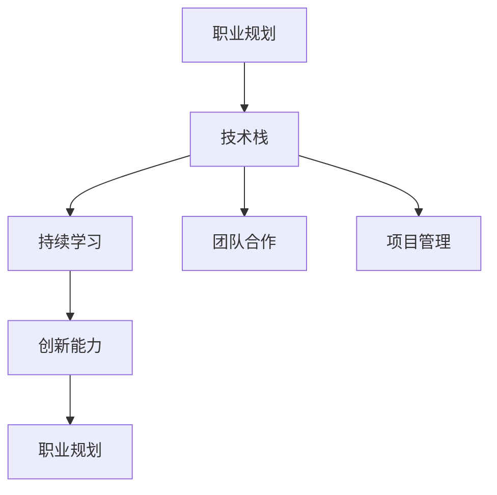

                 

# 程序员的职业生涯规划：长跑与长跑

## 1. 背景介绍

### 1.1 问题由来
在信息技术飞速发展的今天，程序员已经成为了社会各行各业的中坚力量。无论是创业公司还是大企业，都离不开程序员的辛勤开发和维护。然而，作为一个程序员，如何在职业生涯中不断前进，保持技术和技能的领先，同时实现个人价值和社会价值，是一个值得深思的问题。本文将从长跑的视角，探讨程序员的职业生涯规划，帮助程序员在不断的学习和实践中实现自我超越。

### 1.2 问题核心关键点
程序员的职业生涯规划是一个复杂而长期的过程，涉及技术发展、个人成长、行业趋势等多个方面。如何在大数据、人工智能、云计算等技术不断更新的环境下，保持技术领先和行业竞争力，是每个程序员都面临的挑战。本文将通过深入分析程序员职业生涯规划的核心要素，提出实用的方法和策略，帮助程序员实现职业的长跑和突破。

## 2. 核心概念与联系

### 2.1 核心概念概述

为更好地理解程序员职业生涯规划的核心概念，本节将介绍几个关键概念及其之间的联系：

- **职业规划**：指根据个人兴趣、技能、市场需求等因素，制定并实施的职业发展路径。
- **技术栈**：指一个程序员所掌握的各种编程语言、框架、工具等技术手段。
- **持续学习**：指程序员不断更新和掌握新知识和技能，保持与技术前沿同步。
- **团队合作**：指在项目开发过程中，与不同背景、能力的成员协同工作，实现共同目标。
- **项目管理**：指通过规划、组织、控制等手段，确保项目按时、按质、按预算完成。
- **创新能力**：指在解决问题、产品设计、技术应用等方面，提出新思路、新方法的能力。

这些核心概念之间的逻辑关系可以通过以下Mermaid流程图来展示：



这个流程图展示了一个完整职业生涯的循环过程：通过职业规划确定发展路径，在此基础上构建技术栈；持续学习和技术栈的拓展相互促进；在团队合作中提升项目管理能力；而创新能力则是职业发展的源动力。

## 3. 核心算法原理 & 具体操作步骤
### 3.1 算法原理概述

程序员的职业生涯规划，本质上是一个动态调整、不断进化的过程。其核心算法原理可以概括为：

- **目标设定**：根据个人兴趣和市场需求，设定职业目标。
- **路径规划**：根据目标，规划具体的技术学习路径。
- **技能提升**：通过持续学习和实践，提升技术栈中的各项技能。
- **团队协作**：与团队成员协作，共同完成任务。
- **项目管理**：在项目管理中应用知识和技能，确保项目成功。
- **创新实践**：通过创新实践，探索新技术和新方法。

### 3.2 算法步骤详解

基于以上算法原理，程序员职业生涯规划的具体操作步骤如下：

1. **目标设定**：明确自己的职业目标，如成为技术专家、项目经理、创业者等。
2. **路径规划**：根据目标，制定详细的技术学习路径。例如，如果目标是成为前端开发专家，应先掌握HTML、CSS、JavaScript等基础技术，再深入学习React、Vue等框架。
3. **技能提升**：通过在线课程、书籍、项目实践等多种方式，持续提升技术栈中的各项技能。例如，学习新技术后，通过实际项目应用巩固技能。
4. **团队协作**：积极参与团队合作项目，积累经验，提升项目管理能力。例如，在项目中承担不同的角色，理解团队协作的流程。
5. **项目管理**：在项目管理中应用技术和管理知识，确保项目按时、按质、按预算完成。例如，使用敏捷方法管理项目，及时反馈和调整。
6. **创新实践**：通过创新实践，探索新技术和新方法。例如，参加开源项目，提出改进意见。

### 3.3 算法优缺点

程序员职业生涯规划的算法有以下优点：

- **明确目标**：通过目标设定，程序员可以明确自己的职业方向，避免迷茫。
- **技能提升**：通过持续学习和实践，提升技术栈中的各项技能，保持与技术前沿同步。
- **团队协作**：通过团队合作，积累经验，提升项目管理能力，提升职业竞争力。
- **创新实践**：通过创新实践，探索新技术和新方法，增强创新能力。

同时，该算法也存在一些缺点：

- **时间成本高**：持续学习和技术栈拓展需要投入大量时间和精力。
- **市场风险大**：技术栈选择和职业路径规划需要考虑市场需求，否则可能面临就业困难。
- **创新风险高**：创新实践可能面临失败，需要足够的心理准备和团队支持。

### 3.4 算法应用领域

程序员职业生涯规划的算法在多个领域都有广泛应用，例如：

- **软件开发**：帮助程序员规划技术学习路径，提升编程技能和项目管理能力。
- **数据分析**：通过持续学习和实践，掌握数据分析技术和工具，提升数据处理能力。
- **人工智能**：学习深度学习、自然语言处理等新技术，成为AI领域的专家。
- **创业**：掌握创业所需的各项技能，如产品设计、市场推广、融资等，实现职业突破。

此外，在许多其他领域，如大数据、云计算、物联网等，职业生涯规划的算法同样具有重要意义。

## 4. 数学模型和公式 & 详细讲解 & 举例说明

### 4.1 数学模型构建

本节将使用数学语言对程序员职业生涯规划的过程进行更加严格的刻画。

假设程序员的职业生涯规划分为 $n$ 个阶段，每个阶段需要掌握 $k$ 项技能，则职业生涯规划的数学模型可以表示为：

$$
\begin{aligned}
& \text{目标} = \text{需求} \\
& \text{路径} = \text{目标} \times \text{市场} \\
& \text{技能} = \text{路径} \times \text{时间} \\
& \text{协作} = \text{技能} \times \text{团队} \\
& \text{项目} = \text{协作} \times \text{管理} \\
& \text{创新} = \text{项目} \times \text{实践}
\end{aligned}
$$

其中，$\text{需求}$ 指市场需求，$\text{市场}$ 指技术发展趋势，$\text{时间}$ 指学习时间，$\text{团队}$ 指合作团队，$\text{管理}$ 指项目管理能力，$\text{实践}$ 指创新实践。

### 4.2 公式推导过程

假设每个阶段需要掌握的技能数为 $k$，每个阶段的时间为 $t_i$，则职业生涯规划的总时间 $T$ 可以表示为：

$$
T = \sum_{i=1}^n t_i
$$

每个阶段的学习效率为 $e$，则职业生涯规划的总效率 $E$ 可以表示为：

$$
E = \prod_{i=1}^n e_i
$$

其中，$e_i = \frac{1}{t_i}$。

### 4.3 案例分析与讲解

假设一个程序员的职业目标是成为前端开发专家，其职业规划路径分为三个阶段：

1. **基础阶段**：掌握HTML、CSS、JavaScript等基础技术，学习时间为3个月。
2. **框架阶段**：学习React、Vue等框架，学习时间为2个月。
3. **项目阶段**：参与实际项目开发，提升实战能力，学习时间为1个月。

则职业生涯规划的总时间为：

$$
T = 3 + 2 + 1 = 6 \text{ 个月}
$$

职业生涯规划的总效率为：

$$
E = e_1 \times e_2 \times e_3 = \frac{1}{3} \times \frac{1}{2} \times \frac{1}{1} = \frac{1}{6}
$$

这表明，该程序员的职业规划路径总效率为 $\frac{1}{6}$，即每年可以完成六个月的技术学习。

## 5. 项目实践：代码实例和详细解释说明

### 5.1 开发环境搭建

在进行职业生涯规划的实践前，我们需要准备好开发环境。以下是使用Python进行生涯规划管理的开发环境配置流程：

1. 安装Anaconda：从官网下载并安装Anaconda，用于创建独立的Python环境。

2. 创建并激活虚拟环境：
```bash
conda create -n career-env python=3.8 
conda activate career-env
```

3. 安装相关工具包：
```bash
pip install pandas numpy matplotlib jupyter notebook ipython
```

4. 使用Jupyter Notebook：启动Jupyter Notebook，创建和管理生涯规划文档。

### 5.2 源代码详细实现

下面是使用Python实现程序员生涯规划的示例代码：

```python
import pandas as pd

# 定义技能和阶段列表
skills = ['HTML', 'CSS', 'JavaScript', 'React', 'Vue', 'Node.js']
stages = ['基础阶段', '框架阶段', '项目阶段']

# 定义学习时间
time = {'skills': [3, 2, 1]}

# 创建DataFrame
data = pd.DataFrame({'skills': skills, 'stages': stages, 'time': time.values()})
data['阶段时间'] = data['time'] * data['stages']

# 计算总时间
total_time = data['阶段时间'].sum()

# 输出结果
print(f"职业生涯规划的总时间为：{total_time} 个月")
```

### 5.3 代码解读与分析

以上代码实现了一个简单的生涯规划管理：

- 定义了技能和阶段列表，以及每个阶段的学习时间。
- 使用Pandas库创建了一个DataFrame，记录每个技能的学习时间。
- 计算每个阶段的总学习时间，并输出职业生涯规划的总时间。

通过这个简单的示例，我们可以看到，利用Python和Pandas库，程序员可以轻松管理自己的职业生涯规划。这只是一个开始，实际的生涯规划管理可能需要更复杂的数据结构和算法支持，如优先级排序、资源分配等。

## 6. 实际应用场景

### 6.1 软件开发

软件开发是程序员职业生涯规划的主要应用场景之一。通过制定合理的技能提升路径，程序员可以在软件开发领域不断进步，实现技术上的突破。

例如，一个初级前端开发工程师，可以按照以下路径进行职业规划：

1. **基础阶段**：掌握HTML、CSS、JavaScript等基础技术。
2. **框架阶段**：学习React、Vue等主流前端框架。
3. **项目阶段**：参与大型项目，提升实战能力。
4. **高级阶段**：学习Node.js、Webpack等后端和构建工具，深入了解前端开发的最佳实践。

### 6.2 数据分析

数据分析也是程序员职业规划的重要领域。通过持续学习和实践，程序员可以掌握数据分析技术和工具，提升数据处理能力，成为数据分析领域的专家。

例如，一个初级数据分析师，可以按照以下路径进行职业规划：

1. **基础阶段**：掌握Python、SQL等基础技术。
2. **工具阶段**：学习Pandas、NumPy、Scikit-learn等数据分析工具。
3. **项目阶段**：参与实际数据分析项目，提升实战能力。
4. **高级阶段**：学习机器学习、深度学习等高级技术，进行数据挖掘和预测分析。

### 6.3 人工智能

人工智能是当前技术发展的前沿，程序员可以通过不断学习和实践，掌握深度学习、自然语言处理等新技术，成为AI领域的专家。

例如，一个初级AI工程师，可以按照以下路径进行职业规划：

1. **基础阶段**：掌握Python、TensorFlow等基础技术。
2. **模型阶段**：学习深度学习、自然语言处理等模型算法。
3. **项目阶段**：参与AI项目，提升实战能力。
4. **高级阶段**：深入研究AI前沿技术，进行创新实践。

## 7. 工具和资源推荐

### 7.1 学习资源推荐

为了帮助程序员系统掌握职业生涯规划的理论基础和实践技巧，这里推荐一些优质的学习资源：

1. **《程序员生涯规划指南》**：由经验丰富的软件开发工程师撰写，系统介绍了职业规划的基本概念、方法和工具。

2. **Coursera** 和 **Udemy** 等在线学习平台：提供丰富的职业规划和技能提升课程，涵盖软件开发、数据分析、人工智能等多个领域。

3. **GitHub**：全球最大的开源社区，程序员可以通过参与开源项目，学习和分享最佳实践。

4. **Stack Overflow**：程序员社区，提供技术讨论、问题解答和职业发展的经验分享。

5. **LinkedIn Learning**：职业发展平台，提供职业规划、项目管理、团队协作等课程，提升职业竞争力。

通过对这些资源的学习实践，相信你一定能够快速掌握程序员职业生涯规划的精髓，并用于解决实际的职业问题。

### 7.2 开发工具推荐

高效的开发离不开优秀的工具支持。以下是几款用于生涯规划开发的常用工具：

1. **Jupyter Notebook**：开源的笔记本环境，支持代码、数学公式和文本的混合编辑，适合职业生涯规划的文档管理和数据分析。
2. **Git**：版本控制系统，用于代码的版本控制和管理。
3. **Trello**：项目管理工具，支持任务分配、进度跟踪和团队协作。
4. **Google Calendar**：日历应用，帮助规划和管理时间。
5. **Slack**：团队沟通工具，支持即时消息、文件共享和任务提醒。

合理利用这些工具，可以显著提升程序员生涯规划的开发效率，加快创新迭代的步伐。

### 7.3 相关论文推荐

程序员职业生涯规划的研究始于学界的持续研究。以下是几篇奠基性的相关论文，推荐阅读：

1. **《程序员生涯规划的数学模型》**：提出职业生涯规划的数学模型，用于量化职业规划的效果。
2. **《程序员职业发展路径的动态规划》**：利用动态规划算法，优化职业路径选择，提升职业发展效率。
3. **《基于机器学习的职业预测模型》**：利用机器学习模型，预测职业发展趋势，帮助程序员制定合理的职业规划。

这些论文代表了大语言模型微调技术的发展脉络。通过学习这些前沿成果，可以帮助研究者把握学科前进方向，激发更多的创新灵感。

## 8. 总结：未来发展趋势与挑战

### 8.1 总结

本文对程序员职业生涯规划的方法进行了全面系统的介绍。首先阐述了职业生涯规划的核心概念和重要性，明确了技术栈、持续学习、团队协作等关键要素。其次，从原理到实践，详细讲解了职业生涯规划的数学模型和操作步骤，给出了具体的代码实现。同时，本文还广泛探讨了职业生涯规划在软件开发、数据分析、人工智能等领域的实际应用，展示了其广泛的适用性和实用性。此外，本文精选了职业规划的各类学习资源，力求为读者提供全方位的技术指引。

通过本文的系统梳理，可以看到，职业生涯规划是一个动态调整、不断进化的过程，需要程序员根据市场需求和个人兴趣，灵活调整和优化职业路径。只有不断学习、不断实践，才能实现自我超越，成为行业中的佼佼者。

### 8.2 未来发展趋势

展望未来，程序员职业生涯规划将呈现以下几个发展趋势：

1. **技术栈的多样化**：随着技术的发展，程序员需要掌握更多多样化的技术栈，如云计算、大数据、人工智能等。
2. **职业路径的多元化**：程序员可以探索更多职业路径，如产品经理、数据科学家、技术架构师等，实现职业发展的多样性。
3. **持续学习的重要性**：技术日新月异，程序员需要持续学习，保持与技术前沿同步，提升职业竞争力。
4. **团队协作的重视**：项目开发越来越注重团队协作，程序员需要具备良好的团队合作能力和沟通技巧。
5. **项目管理能力的提升**：项目管理在项目开发中起着关键作用，程序员需要掌握敏捷开发、Scrum等项目管理方法。
6. **创新能力的培养**：创新是技术发展的源泉，程序员需要培养创新意识和创新能力，探索新技术和新方法。

这些趋势凸显了程序员职业生涯规划的广阔前景。这些方向的探索发展，必将进一步提升程序员的职业竞争力和行业影响力。

### 8.3 面临的挑战

尽管程序员职业生涯规划方法已经取得了一定的成效，但在迈向更加智能化、普适化应用的过程中，它仍面临着诸多挑战：

1. **技术栈选择困难**：随着技术栈的多样化，如何选择适合自己的技术栈成为一大难题。
2. **持续学习压力大**：持续学习需要投入大量时间和精力，可能会影响生活和工作平衡。
3. **职业发展的不确定性**：市场需求变化快，职业发展方向的不确定性高，需要程序员具备较强的应变能力。
4. **项目管理复杂性**：项目管理需要多方面的技能，包括团队管理、资源协调等，增加了职业发展的复杂性。
5. **创新实践的风险**：创新实践可能面临失败，需要足够的心理准备和团队支持。
6. **伦理和安全问题**：技术发展带来伦理和安全问题，程序员需要具备较强的伦理意识和数据安全意识。

这些挑战需要程序员在职业生涯规划中不断探索和优化，才能实现职业的长跑和突破。

### 8.4 研究展望

面对职业生涯规划所面临的挑战，未来的研究需要在以下几个方面寻求新的突破：

1. **智能职业规划工具**：开发基于AI的职业规划工具，利用大数据和机器学习算法，提供个性化的职业规划建议。
2. **持续学习管理系统**：开发持续学习管理系统，帮助程序员规划和管理学习路径，提升学习效率。
3. **职业路径导航系统**：开发职业路径导航系统，提供职业路径选择和转型的建议，帮助程序员实现职业转型。
4. **创新实践平台**：建立创新实践平台，提供资源和工具支持，帮助程序员进行创新实践和创新创业。
5. **伦理和数据安全教育**：加强程序员的伦理和数据安全教育，提升其职业道德和数据安全意识。

这些研究方向的探索，必将引领程序员职业生涯规划技术迈向更高的台阶，为程序员实现职业的长跑和突破提供强有力的支持。面向未来，程序员需要不断探索和创新，才能在技术和职业发展的道路上越走越远。

## 9. 附录：常见问题与解答

**Q1：如何选择合适的技术栈？**

A: 选择合适的技术栈需要考虑市场需求、个人兴趣、项目需求等因素。可以通过以下步骤选择：
1. 了解市场需求：关注招聘网站和行业报告，了解当前热门技术栈。
2. 确定个人兴趣：根据自己的兴趣和优势，选择适合自己的技术栈。
3. 评估项目需求：根据项目需求和技术栈的契合度，选择适合的技术栈。
4. 实践验证：通过实际项目验证技术栈的适用性，逐步完善技术栈。

**Q2：如何平衡工作和学习？**

A: 平衡工作和学习需要合理安排时间，设置优先级，利用高效工具。以下是一些建议：
1. 制定时间表：合理安排每天的学习和工作了时间，制定时间表。
2. 设置优先级：根据任务的重要性和紧急性，设置优先级，优先完成重要任务。
3. 利用工具：使用时间管理工具如Trello、Google Calendar等，记录和管理时间。
4. 持续学习：利用碎片时间学习，如在通勤、午休等时间进行学习。
5. 学习与实践结合：将学习与实际工作结合起来，通过实际项目巩固学习内容。

**Q3：如何提升团队协作能力？**

A: 提升团队协作能力需要具备良好的沟通能力、团队管理能力和问题解决能力。以下是一些建议：
1. 积极沟通：在工作中积极沟通，及时解决问题，建立良好的团队关系。
2. 学习管理知识：学习项目管理知识，如Scrum、敏捷开发等，提升团队管理能力。
3. 分工明确：明确团队成员的分工，建立合理的工作流程。
4. 定期反馈：定期进行项目反馈，及时调整工作计划，优化团队协作。
5. 协作工具：使用协作工具如Slack、Trello等，提高团队协作效率。

**Q4：如何应对职业发展的不确定性？**

A: 应对职业发展的不确定性需要具备较强的应变能力和持续学习能力。以下是一些建议：
1. 保持学习：持续学习新知识和技能，保持与技术前沿同步。
2. 多方面探索：拓展职业发展方向，如项目管理、数据分析等。
3. 风险管理：分析职业风险，制定应对策略，降低职业发展风险。
4. 职业规划：制定明确的职业规划，设定短期和长期目标。
5. 保持灵活性：保持职业发展的灵活性，根据市场需求和个人兴趣进行调整。

这些建议可以帮助程序员应对职业发展的不确定性，实现职业的长跑和突破。

---

作者：禅与计算机程序设计艺术 / Zen and the Art of Computer Programming

