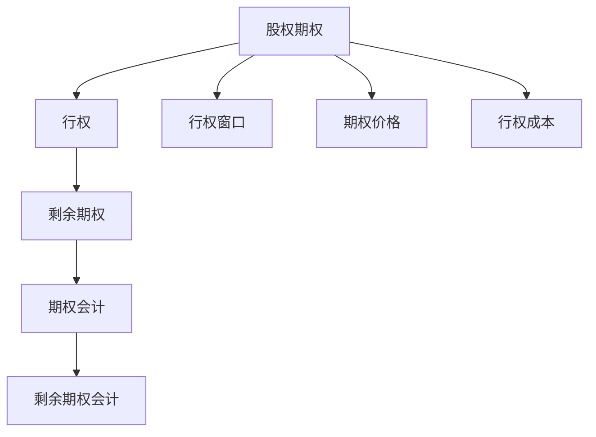

                 

# 程序员的股权期权管理策略

## 1. 背景介绍

### 1.1 问题由来
在科技行业，股权期权是激励程序员和工程师的重要手段之一。通过给予员工股权期权，公司能够吸引和保留优秀人才，同时也能激发员工的积极性和创新动力。然而，股权期权的管理并非易事。如何公平、透明、高效地管理股权期权，对于保障员工权益和公司长远发展具有重要意义。

### 1.2 问题核心关键点
股权期权管理涉及多个环节，包括股权分配、行权规则、期权管理、财务核算等。这些环节之间互相影响，任何一个环节出现问题都可能影响到公司员工士气和公司财务状况。因此，高效、透明的股权期权管理策略至关重要。

### 1.3 问题研究意义
股权期权管理策略的优化能够有效提升员工满意度和公司管理效率，从而提升公司长期竞争力和创新能力。良好的股权期权管理策略还能避免潜在的财务风险，保护公司利益。

## 2. 核心概念与联系

### 2.1 核心概念概述

为更好地理解程序员的股权期权管理策略，本节将介绍几个密切相关的核心概念：

- **股权期权（Stock Options）**：给予员工在未来某个时间点按照预定价格购买公司股票的权利。
- **行权（Vesting）**：股权期权分批次解锁，通常需要工作满一定年限后才能行权。
- **期权价格（Grant Price）**：员工行权时的股票价格，通常低于市场价。
- **行权窗口（Exercise Window）**：员工可以在一定时间内行权，超出此窗口的股票期权将失效。
- **剩余期权（Remaining Options）**：员工行权后剩余的期权，用于实现未来额外收入。

- **股票期权会计（Stock Option Accounting）**：对股票期权进行会计处理，包括行权成本的计算和记录。

这些核心概念之间的逻辑关系可以通过以下Mermaid流程图来展示：



这个流程图展示了好几个核心概念及其之间的关系：

1. 股权期权经过行权成为员工持有的股票。
2. 行权窗口限制了员工行权的时限。
3. 期权价格是员工行权时支付的股票价格。
4. 行权成本用于会计记录，影响公司财务状况。
5. 员工行权后剩余期权可用于未来收入。
6. 剩余期权会计涉及对剩余期权价值的处理。

## 3. 核心算法原理 & 具体操作步骤
### 3.1 算法原理概述

程序员的股权期权管理策略主要涉及以下几个方面：

- **股权分配算法**：基于员工的职位、贡献、公司规模等因素，合理分配股权期权。
- **行权分配算法**：根据员工的工作年限和行权窗口，分批次解锁行权。
- **期权会计算法**：准确计算和记录期权行权成本，保证财务透明和合规。

这些算法的核心原理基于以下数学模型和公式推导：

### 3.2 算法步骤详解

**Step 1: 股权分配算法**

股权分配应根据员工的职位、经验、贡献等因素进行公平分配。假设公司共有 $N$ 名员工，每个员工的股权分配系数为 $c_i$，总股权数为 $T$。

分配公式为：
$$
\text{每个员工期权数} = \frac{c_i}{\sum_{i=1}^N c_i} \times T
$$

其中，$c_i$ 表示第 $i$ 名员工的分配系数。系数越大，员工获得的期权数越多。

**Step 2: 行权分配算法**

行权分配需要考虑员工的在职时间。假设每个员工的期权数为 $O_i$，公司总期权数为 $T$，员工在职时间为 $t_i$，行权窗口为 $W_i$。

解锁公式为：
$$
\text{员工可解锁期权数} = \frac{O_i}{t_i} \times W_i
$$

其中，$t_i$ 表示员工在职时间，$W_i$ 表示行权窗口。解锁的期权数随着在职时间的增加而增加，行权窗口结束后期权失效。

**Step 3: 期权会计算法**

期权会计涉及行权成本的计算和记录。假设期权价格为 $P$，公司总期权数为 $T$，员工行权价格为 $p$，员工期权数为 $O_i$。

行权成本计算公式为：
$$
\text{行权成本} = (P - p) \times O_i
$$

行权成本应在员工行权时进行会计记录，影响公司财务状况。

### 3.3 算法优缺点

**股权分配算法优点**：
1. 基于客观因素分配，公平合理。
2. 能够激励员工提升自身价值，为公司创造更多价值。

**股权分配算法缺点**：
1. 分配系数的设计需要综合考虑多个因素，可能存在主观偏差。
2. 不同岗位和经验员工间的分配差距可能过大，导致团队不和谐。

**行权分配算法优点**：
1. 根据员工在职时间逐步解锁行权，减少一次性行权带来的财务压力。
2. 行权窗口限制了员工的行权时限，避免员工提前离职。

**行权分配算法缺点**：
1. 行权时间线的设置可能影响员工短期和长期激励效果，需要灵活调整。
2. 行权窗口结束后，员工无法再行权，可能导致部分员工的离职。

**期权会计算法优点**：
1. 准确计算行权成本，保证财务透明。
2. 行权成本记录在财务账上，避免公司税负增加。

**期权会计算法缺点**：
1. 行权成本的计算和记录比较复杂，可能出现误差。
2. 期权会计需要专业财务知识，普通员工难以理解。

### 3.4 算法应用领域

股权期权管理策略在科技公司和初创企业中得到了广泛应用，尤其在需要激励和保留人才的公司中，其作用尤为显著。具体应用领域包括：

- **科技公司**：Google、Facebook、Microsoft等科技巨头公司广泛应用股权期权来激励员工。
- **初创企业**：早期初创企业通常采用股权期权来吸引优秀人才，降低人力成本。
- **咨询公司**：管理咨询公司常以股权期权作为长期激励手段，吸引和留住高端人才。

此外，股权期权管理策略还适用于任何需要长期激励和保留人才的行业，如金融、医药、教育等。

## 4. 数学模型和公式 & 详细讲解 & 举例说明
### 4.1 数学模型构建

本节将使用数学语言对程序员的股权期权管理策略进行更加严格的刻画。

假设公司有 $N$ 名员工，每个员工获得期权数 $O_i$，期权价格为 $P$，公司总期权数为 $T$，每个员工期权分配系数为 $c_i$。

定义：
- $S_i$ 为员工行权后的股票数。
- $C_i$ 为员工行权成本。

### 4.2 公式推导过程

**Step 1: 期权分配**

每个员工的期权数为：
$$
O_i = c_i \times \frac{T}{\sum_{j=1}^N c_j}
$$

**Step 2: 行权解锁**

员工行权解锁的期权数为：
$$
\text{解锁期权数} = \frac{O_i}{t_i} \times W_i
$$

**Step 3: 行权成本计算**

行权成本为：
$$
C_i = (P - p) \times O_i
$$

其中，$p$ 为员工行权价格，通常为期权价格 $P$ 的一定折扣。

### 4.3 案例分析与讲解

假设某公司有 10 名员工，分配系数 $c_i$ 和在职时间 $t_i$ 如下表所示。公司总期权数为 1,000,000 股，期权价格为 20 元/股，行权窗口为 3 年，折扣比例为 0.9。

| 员工编号 | 分配系数 | 在职时间 | 解锁系数 |
| -------- | -------- | -------- | -------- |
| 1        | 0.1      | 2 年     | 1        |
| 2        | 0.15     | 4 年     | 1.5      |
| ...      | ...      | ...      | ...      |
| 10       | 0.05     | 3 年     | 0.5      |

员工 1 和 2 的期权分配和行权解锁情况如下：

**员工 1**：
- 期权数 $O_1 = 0.1 \times \frac{1,000,000}{1+0.15+0.05+\ldots} \approx 47,200$
- 行权解锁数 $S_1 = 0.1 \times 2 \times 3 = 0.6$，解锁后剩余 $47,200 - 0.6 \times 20 = 89,600$ 股
- 行权成本 $C_1 = (20 - 20 \times 0.9) \times 47,200 = 96,000$

**员工 2**：
- 期权数 $O_2 = 0.15 \times \frac{1,000,000}{1+0.1+0.05+\ldots} \approx 82,500$
- 行权解锁数 $S_2 = 0.15 \times 4 \times 3 = 2.4$，解锁后剩余 $82,500 - 2.4 \times 20 = 158,800$ 股
- 行权成本 $C_2 = (20 - 20 \times 0.9) \times 82,500 = 150,000$

通过这些计算，可以清晰地了解每个员工的期权分配、解锁和行权成本情况。

## 5. 项目实践：代码实例和详细解释说明
### 5.1 开发环境搭建

在进行股权期权管理策略的开发前，我们需要准备好开发环境。以下是使用Python进行开发的环境配置流程：

1. 安装Anaconda：从官网下载并安装Anaconda，用于创建独立的Python环境。

2. 创建并激活虚拟环境：
```bash
conda create -n stock-option-env python=3.8 
conda activate stock-option-env
```

3. 安装PyTorch：根据CUDA版本，从官网获取对应的安装命令。例如：
```bash
conda install pytorch torchvision torchaudio cudatoolkit=11.1 -c pytorch -c conda-forge
```

4. 安装相关库：
```bash
pip install pandas numpy matplotlib seaborn
```

5. 准备数据：准备员工信息、期权分配、在职时间、行权折扣等数据，导入Pandas库进行数据处理。

### 5.2 源代码详细实现

下面是Python代码实现股权期权管理策略的示例：

```python
import pandas as pd
import numpy as np

# 创建员工信息 DataFrame
employee_df = pd.DataFrame({
    'employee_id': [1, 2, 3, 4, 5],
    'coef': [0.1, 0.15, 0.2, 0.05, 0.01],
    'tenure_years': [2, 4, 3, 5, 1],
    'unlock_period': [3, 4, 3, 4, 2]
})

# 期权价格、公司总期权数、行权折扣
price = 20
total_options = 1000000
discount_rate = 0.9

# 计算每个员工期权数和行权解锁数
options = employee_df['coef'] * total_options / employee_df['coef'].sum()
unlock_periods = employee_df['tenure_years'] * employee_df['unlock_period']

# 计算每个员工行权解锁数和行权成本
unlock_periods = unlock_periods.apply(lambda x: x * 20 * discount_rate)
unlock_amounts = options * unlock_periods
remaining_options = options - unlock_amounts

# 计算行权成本
cost = price * unlock_amounts - price * discount_rate * unlock_amounts

# 输出结果
print(employee_df[['employee_id', 'coef', 'tenure_years', 'unlock_period', 'options', 'unlock_amounts', 'remaining_options', 'cost']])
```

### 5.3 代码解读与分析

这段代码实现了一个简单的股权期权管理策略，主要用于计算每个员工的期权数、行权解锁数和行权成本。

- 首先，通过Pandas DataFrame创建一个员工信息表，包括员工编号、分配系数、在职时间、行权窗口。
- 然后，根据期权分配系数和公司总期权数，计算每个员工的期权数。
- 接着，根据员工在职时间和行权窗口，计算行权解锁数。
- 最后，根据期权价格和折扣率，计算行权成本和剩余期权数。

代码中的关键变量和函数：

- `employee_df`：员工信息 DataFrame。
- `price`：期权价格。
- `total_options`：公司总期权数。
- `discount_rate`：行权折扣率。
- `options`：每个员工期权数。
- `unlock_periods`：每个员工行权解锁数。
- `unlock_amounts`：每个员工行权解锁的期权数。
- `remaining_options`：每个员工剩余期权数。
- `cost`：每个员工行权成本。

这些变量和函数通过简单的数学运算，实现了股权期权管理策略的计算。

## 6. 实际应用场景
### 6.1 实际应用场景

股权期权管理策略在科技公司、初创企业和咨询公司等场景中广泛应用。以下是一些典型的应用场景：

- **科技公司**：如Google、Facebook、Microsoft等，通过股权期权激励员工，留住人才，提升创新能力。
- **初创企业**：早期初创企业通过股权期权吸引优秀人才，降低人力成本。
- **咨询公司**：管理咨询公司常以股权期权作为长期激励手段，吸引和留住高端人才。
- **金融公司**：如高盛、摩根大通等，通过股权期权激励员工，提升业务能力和公司竞争力。
- **教育机构**：如清华大学、哈佛大学等，通过股权期权吸引和保留优秀教师，提升教育质量。

### 6.2 未来应用展望

随着股权期权管理策略的不断优化，未来在更多领域和场景中都将得到应用：

- **制造业**：通过股权期权激励技术和管理人员，提升生产效率和创新能力。
- **农业**：通过股权期权吸引和保留农业技术人才，推动农业现代化。
- **医疗行业**：通过股权期权激励医生和科研人员，提升医疗服务质量和科研能力。
- **能源行业**：通过股权期权激励能源技术人员，推动绿色能源和节能技术的发展。
- **公共部门**：通过股权期权激励公务员，提升公共服务质量和效率。

## 7. 工具和资源推荐
### 7.1 学习资源推荐

为了帮助开发者系统掌握股权期权管理策略的理论基础和实践技巧，这里推荐一些优质的学习资源：

1. **《公司股权与期权管理》**：一本系统介绍公司股权和期权管理的书籍，涵盖了股权分配、行权规则、财务核算等多个方面。
2. **Coursera《金融市场与投资》**：Coursera提供的在线课程，介绍了股票期权的基础知识和会计处理。
3. **Harvard Business Review《期权激励》**：哈佛商业评论发表的相关文章，深入探讨了期权激励在企业管理中的应用。
4. **CFA Institute《期权分析》**：CFA协会出版的期权分析手册，详细介绍了期权定价和会计处理。
5. **《程序员股权期权管理手册》**：一本专注于程序员股权期权管理的手册，提供了实际案例和操作指南。

通过这些资源的学习实践，相信你一定能够快速掌握股权期权管理策略的精髓，并用于解决实际的股权期权问题。

### 7.2 开发工具推荐

高效的开发离不开优秀的工具支持。以下是几款用于股权期权管理策略开发的常用工具：

1. **Excel**：Microsoft Excel 是一个强大的数据处理工具，适合处理股权期权数据和计算。
2. **Python**：Python 是数据科学和财务分析的重要工具，适合编写复杂的股权期权管理策略代码。
3. **Google Sheets**：Google Sheets 是一个在线电子表格工具，适合团队协作和实时更新数据。
4. **Trello**：Trello 是一个项目管理工具，适合跟踪股权期权管理策略的进度和任务分配。
5. **Jupyter Notebook**：Jupyter Notebook 是一个交互式编程环境，适合编写和共享股权期权管理策略代码。

合理利用这些工具，可以显著提升股权期权管理策略的开发效率，加快创新迭代的步伐。

### 7.3 相关论文推荐

股权期权管理策略的发展源于学界的持续研究。以下是几篇奠基性的相关论文，推荐阅读：

1. **《期权定价模型》**：Brennan和Schwartz提出的BS模型，奠定了期权定价的基础。
2. **《期权激励的财务分析》**：Baker和Wurgler的研究，探讨了期权激励对公司业绩的影响。
3. **《股权激励的效果》**：Hall和Maman的研究，评估了股权激励对员工激励和公司业绩的影响。
4. **《股票期权会计处理》**：FASB（美国财务会计准则委员会）的规则，详细介绍了期权会计的核算方法。
5. **《股权期权激励的设计》**：Schwartz的研究，提出了优化股权期权激励的设计方法。

这些论文代表了大语言模型微调技术的发展脉络。通过学习这些前沿成果，可以帮助研究者把握学科前进方向，激发更多的创新灵感。

## 8. 总结：未来发展趋势与挑战
### 8.1 总结

本文对程序员的股权期权管理策略进行了全面系统的介绍。首先阐述了股权期权在科技公司、初创企业和咨询公司等场景中的重要性，明确了股权期权管理策略在激励和保留人才方面的独特价值。其次，从原理到实践，详细讲解了股权期权管理的核心算法和具体操作步骤，给出了股权期权管理策略的完整代码实例。同时，本文还广泛探讨了股权期权管理策略在多个行业领域的应用前景，展示了股权期权管理策略的巨大潜力。此外，本文精选了股权期权管理策略的学习资源，力求为读者提供全方位的技术指引。

通过本文的系统梳理，可以看到，股权期权管理策略在科技公司、初创企业和咨询公司等场景中得到了广泛应用，具有重要的激励和保留人才的功能。通过股权期权管理策略，公司能够有效激励员工，提升公司创新能力和竞争力。未来，伴随股权期权管理策略的不断优化，股权期权管理策略必将在更多领域得到应用，为公司发展带来新的动力。

### 8.2 未来发展趋势

展望未来，股权期权管理策略将呈现以下几个发展趋势：

1. **股权期权激励的个性化**：根据员工的工作岗位、经验和贡献，设计个性化的股权期权激励方案，增强激励效果。
2. **股权期权管理的自动化**：利用AI和大数据技术，实现股权期权管理的自动化，减少人为干预，提高管理效率。
3. **股权期权管理的透明度**：引入区块链技术，实现股权期权管理的透明化和不可篡改性，增强员工信任。
4. **股权期权管理的动态调整**：根据公司的业绩和市场环境，动态调整股权期权方案，增强激励效果。
5. **股权期权管理的国际化**：随着公司全球化发展，股权期权管理策略也需要国际化，适应不同国家和地区的法律和政策要求。

这些趋势凸显了股权期权管理策略的广阔前景。这些方向的探索发展，必将进一步提升股权期权管理策略的科学性和有效性，保障公司员工的权益，提升公司竞争力。

### 8.3 面临的挑战

尽管股权期权管理策略已经取得了一定的成果，但在迈向更加智能化、普适化应用的过程中，仍面临诸多挑战：

1. **股权期权激励的设计复杂性**：股权期权激励的设计需要综合考虑多个因素，如员工岗位、经验、贡献等，难以制定公平合理的激励方案。
2. **股权期权管理的透明度问题**：股权期权管理的透明度和可解释性需要进一步提升，避免潜在的财务风险和员工不满。
3. **股权期权激励的长期激励效果**：股权期权激励虽然能够吸引和留住人才，但如何设计合理的行权时间线，确保长期激励效果，仍然是一个挑战。
4. **股权期权会计处理的复杂性**：股权期权会计处理涉及复杂的财务核算和记录，容易出现误差，需要进一步优化。
5. **股权期权管理的法律和政策要求**：股权期权管理需要符合不同国家和地区的法律和政策要求，增加了管理的复杂性。

### 8.4 研究展望

面对股权期权管理策略所面临的挑战，未来的研究需要在以下几个方面寻求新的突破：

1. **股权期权激励的个性化设计**：通过AI和大数据分析，制定个性化的股权期权激励方案，增强激励效果。
2. **股权期权管理的自动化工具**：开发智能化的股权期权管理平台，实现股权期权管理的自动化和智能化。
3. **股权期权管理的透明化机制**：引入区块链技术，实现股权期权管理的透明化和不可篡改性，增强员工信任。
4. **股权期权激励的动态调整策略**：根据公司的业绩和市场环境，动态调整股权期权方案，确保激励效果。
5. **股权期权管理的国际化标准**：制定符合不同国家和地区的股权期权管理标准，促进股权期权管理的国际化。

这些研究方向将引领股权期权管理策略的进一步优化和应用，为公司激励和保留人才提供新的解决方案。

## 9. 附录：常见问题与解答
### 9.1 问题一：什么是股权期权？

答：股权期权是给予员工在未来某个时间点按照预定价格购买公司股票的权利。通常，员工在获得期权后需要工作一定年限才能行权，解锁期权。

### 9.2 问题二：如何设计公平合理的股权期权激励方案？

答：股权期权激励方案的设计需要综合考虑员工岗位、经验、贡献等因素。设计时应遵循公平、透明、合理原则，确保每个员工获得与其价值相匹配的期权激励。

### 9.3 问题三：股权期权管理的透明度如何保障？

答：引入区块链技术，实现股权期权管理的透明化和不可篡改性，增强员工信任。同时，建立透明的股权期权管理流程，定期公开股权期权分配和行权情况，接受员工和股东的监督。

### 9.4 问题四：如何提高股权期权激励的长期效果？

答：设计合理的行权时间线，确保员工在行权后仍能长期在公司工作。同时，结合股票增值计划等长效激励方案，增强员工长期激励效果。

### 9.5 问题五：股权期权会计处理的复杂性如何避免？

答：建立健全的财务核算和记录机制，确保会计处理的准确性和透明性。引入AI和大数据分析工具，实现自动化财务处理，降低人为误差。

### 9.6 问题六：如何实现股权期权管理的国际化？

答：制定符合不同国家和地区的股权期权管理标准，确保股权期权管理符合当地法律和政策要求。同时，建立国际化的股权期权管理平台，提供多语言支持，满足全球化管理需求。

---

作者：禅与计算机程序设计艺术 / Zen and the Art of Computer Programming

