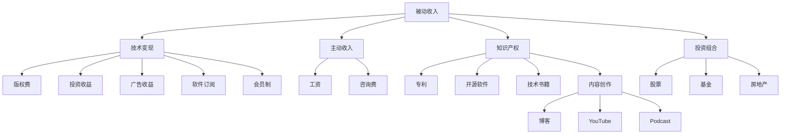

                 

## 1. 背景介绍

### 1.1 问题由来

在当今这个快速发展的数字化时代，程序员作为推动技术创新的关键力量，其职业发展道路也在不断变化。过去，程序员主要依靠工资收入，而如今，随着技术生态的多样化和互联网的普及，程序员逐渐探索出更多的收入途径，其中包括被动收入（Passive Income）。被动收入指的是不需要持续投入时间和精力，能够自动产生收入的收入形式，如投资收益、版权费、广告收益等。

### 1.2 问题核心关键点

程序员的被动收入主要分为以下几类：

- **投资收益**：如股票、基金、房地产等。
- **版权费**：如技术书籍、开源软件、专利等。
- **广告收益**：如通过博客、YouTube、Podcast等平台进行内容创作，获得广告收入。
- **软件订阅**：如开发商业软件，通过订阅费获得持续收入。
- **会员制**：如建立在线课程或社区，提供付费会员服务。

通过构建被动收入，程序员不仅能实现职业发展和经济自由的同步提升，还能在工作中获得更多的自由度和满足感。然而，构建和维护被动收入并非易事，需要程序员具备系统的规划、执行和管理能力。本文旨在为程序员提供全面的指导，帮助他们构建并有效维护被动收入。

## 2. 核心概念与联系

### 2.1 核心概念概述

为了深入理解程序员如何构建与维护被动收入，我们需要先明确以下几个核心概念：

- **被动收入**：指不需要持续投入时间和精力的收入形式，如投资收益、版权费等。
- **主动收入**：指需要通过持续投入时间和精力的工作方式获得的收入，如工资、咨询费等。
- **技术变现**：指将技术或编程技能转化为经济价值的过程，包括技术咨询、软件开发、在线教学等。
- **投资组合**：指通过多种投资渠道和策略构建的资产组合，以分散风险和提升收益。
- **知识产权**：指创作者对其原创作品的权利，包括软件、书籍、论文等。
- **在线平台**：指提供内容创作、知识共享、广告收益等服务的互联网平台，如博客、YouTube、Github等。

这些概念之间的联系可以通过以下Mermaid流程图来展示：



这个流程图展示了被动收入与主动收入、技术变现、投资组合、知识产权等多个概念之间的联系，以及它们在程序员收入结构中的作用。

## 3. 核心算法原理 & 具体操作步骤
### 3.1 算法原理概述

构建与维护被动收入的本质在于通过技术变现、投资、内容创作等方式，实现收入的自动化和持续化。其核心算法原理可以概括为以下几个方面：

1. **技术变现**：利用编程技能开发软件、构建网站、提供技术咨询等，将技术转化为有形或无形的资产。
2. **投资**：通过股票、基金、房地产等投资渠道，分散风险，获取回报。
3. **内容创作**：通过写作、编程、视频等形式，创作有价值的内容，在互联网平台上获得广告、订阅、版权等收入。

### 3.2 算法步骤详解

构建被动收入的过程可以分为以下几个步骤：

**Step 1: 明确目标和规划**

- 确定目标收入水平和实现方式。
- 制定详细的收入计划和时间表。
- 确定投资渠道和风险承受能力。

**Step 2: 技术变现**

- 开发或优化现有软件产品，提供商业订阅服务。
- 提供技术咨询或培训，赚取咨询费。
- 创建开源项目，通过捐赠或赞助获得收入。

**Step 3: 投资组合构建**

- 分散投资于股票、基金、房地产等多种资产。
- 定期评估投资组合，调整策略以应对市场变化。

**Step 4: 内容创作**

- 选择适合的平台进行内容创作，如博客、YouTube、Podcast等。
- 创作高质量、有价值的内容，吸引和保留观众。
- 利用平台提供的广告、订阅、赞助等收入模式。

**Step 5: 持续优化和维护**

- 定期更新和改进产品或服务，保持竞争力。
- 监控投资组合的表现，及时调整策略。
- 分析和反馈观众反馈，持续优化内容创作。

### 3.3 算法优缺点

构建被动收入的算法具有以下优点：

1. **灵活性**：能够根据个人兴趣和专长选择适合的变现方式。
2. **多元化**：通过多种收入渠道分散风险，提高收入稳定性。
3. **持续性**：一旦建立，能够持续产生收入，无需持续投入时间和精力。

然而，也存在一些缺点：

1. **初始投入高**：开发软件、投资、内容创作等都需要初期投入。
2. **市场风险**：投资市场存在不确定性，可能会带来损失。
3. **技术迭代快**：需要持续更新和维护产品或服务，以应对市场和技术变化。

### 3.4 算法应用领域

基于被动收入的构建与维护算法，已经在软件开发、技术咨询、内容创作等多个领域得到了广泛应用。具体而言，包括以下几个方面：

1. **软件开发**：通过开发并销售软件产品、提供商业订阅服务，获取持续收入。
2. **技术咨询**：提供专业技术咨询服务，获得咨询费。
3. **内容创作**：通过在线平台发布内容，吸引广告、订阅和赞助收入。
4. **投资管理**：通过股票、基金等投资渠道，实现资产增值。

## 4. 数学模型和公式 & 详细讲解  
### 4.1 数学模型构建

构建被动收入的数学模型可以通过以下公式来表示：

$$
\text{Total Income} = \text{Passive Income} + \text{Active Income}
$$

其中，`Total Income`表示总收入，`Passive Income`表示被动收入，`Active Income`表示主动收入。

### 4.2 公式推导过程

对于被动收入的部分，可以进一步细分为多个子项，如投资收益、版权费、广告收益等，每个子项的计算公式如下：

1. **投资收益**：
$$
\text{Investment Income} = \text{Total Investment} \times \text{Return Rate}
$$

2. **版权费**：
$$
\text{Copyright Income} = \text{Revenue} \times \text{ Royalty Rate}
$$

3. **广告收益**：
$$
\text{Ad Revenue} = \text{Ad Clicks} \times \text{Ad CPM}
$$

4. **软件订阅**：
$$
\text{Software Subscription Income} = \text{Number of Subscribers} \times \text{Subscription Fee}
$$

5. **会员制**：
$$
\text{Membership Income} = \text{Number of Members} \times \text{Membership Fee}
$$

### 4.3 案例分析与讲解

以博客为例，分析如何通过内容创作获得被动收入：

假设某程序员开设了一个技术博客，每月撰写10篇高质量文章，每篇文章平均获得1000次浏览和100次点击广告。博客每获得1000次浏览，广告点击率为0.1，每次广告点击收益为0.1元。则一个月的广告收益为：

$$
\text{Ad Revenue} = 10 \times 1000 \times 0.1 \times 0.1 = 10 \text{ 元}
$$

如果博客收取订阅费，假设每月有1000名付费会员，每个会员支付5元订阅费，则一个月的会员费收入为：

$$
\text{Membership Income} = 1000 \times 5 = 5000 \text{ 元}
$$

综合上述分析，博客一个月的被动收入为：

$$
\text{Passive Income} = \text{Ad Revenue} + \text{Membership Income} = 10 + 5000 = 5010 \text{ 元}
$$

## 5. 项目实践：代码实例和详细解释说明
### 5.1 开发环境搭建

构建与维护被动收入的开发环境主要依赖以下工具和库：

1. **编程语言**：Python、JavaScript、Go等。
2. **开发框架**：Flask、Django、React等。
3. **版本控制**：Git、GitHub等。
4. **项目管理工具**：JIRA、Trello等。
5. **内容创作工具**：WordPress、Medium等。
6. **广告平台**：Google AdSense、Medium Partner Program等。

### 5.2 源代码详细实现

以下是一个基于Python的博客订阅模型的示例代码：

```python
from flask import Flask, render_template, request
from flask_sqlalchemy import SQLAlchemy

app = Flask(__name__)
app.config['SQLALCHEMY_DATABASE_URI'] = 'sqlite:///blog.db'
db = SQLAlchemy(app)

class User(db.Model):
    id = db.Column(db.Integer, primary_key=True)
    name = db.Column(db.String(50), nullable=False)
    email = db.Column(db.String(120), unique=True, nullable=False)

    def __repr__(self):
        return '<User %r>' % self.name

class Blog(db.Model):
    id = db.Column(db.Integer, primary_key=True)
    title = db.Column(db.String(120), nullable=False)
    content = db.Column(db.Text, nullable=False)
    user_id = db.Column(db.Integer, db.ForeignKey('user.id'), nullable=False)

    def __repr__(self):
        return '<Blog %r>' % self.title

@app.route('/')
def index():
    return render_template('index.html')

@app.route('/subscribe', methods=['POST'])
def subscribe():
    user = User.query.filter_by(email=request.form['email']).first()
    if user:
        return 'You are already subscribed!'
    else:
        user = User(name=request.form['name'], email=request.form['email'])
        db.session.add(user)
        db.session.commit()
        return 'You have subscribed successfully!'

if __name__ == '__main__':
    app.run(debug=True)
```

以上代码展示了如何使用Flask框架和SQLite数据库，实现一个简单的博客订阅系统。具体实现步骤如下：

1. 定义User和Blog模型，分别表示用户和博客。
2. 创建Flask应用，并配置数据库连接。
3. 定义首页和订阅接口。
4. 在订阅接口中，查询用户是否已经订阅，如果没有则添加新用户并保存数据库。

### 5.3 代码解读与分析

该示例代码的核心在于使用Flask框架和SQLite数据库，实现了一个简单的博客订阅功能。通过Flask的路由机制，将用户请求映射到不同的处理函数，从而实现订阅功能的逻辑处理。同时，使用SQLite数据库存储用户和博客信息，便于查询和管理。

### 5.4 运行结果展示

运行该代码后，可以通过访问http://127.0.0.1:5000/ 进入博客首页，并在该页面上进行订阅操作。订阅成功后，将返回“You have subscribed successfully!”的响应。

## 6. 实际应用场景
### 6.1 软件开发

通过构建和维护被动收入，程序员可以更专注于技术创新和产品开发，减少对主动收入的依赖。具体应用场景包括：

1. **开发软件产品**：利用编程技能开发软件，提供订阅服务，获取持续收入。
2. **技术咨询**：提供技术咨询或培训，赚取咨询费。
3. **开源项目**：创建和维护开源项目，通过捐赠或赞助获得收入。

### 6.2 内容创作

通过在线平台发布高质量内容，吸引大量观众，从而实现广告、订阅、赞助等被动收入。具体应用场景包括：

1. **博客**：在博客平台上发布技术文章，通过广告和订阅获取收入。
2. **YouTube**：在YouTube上发布视频教程，通过广告和观众打赏获取收入。
3. **Podcast**：在Podcast平台上发布音频内容，通过赞助和听众打赏获取收入。

### 6.3 投资管理

通过股票、基金等投资渠道，分散风险，实现资产增值。具体应用场景包括：

1. **股票投资**：投资股票市场，获取股息和资本增值收益。
2. **基金投资**：投资各种基金，分散风险，获取收益。
3. **房地产投资**：通过购买房地产，获取租金和升值收益。

### 6.4 未来应用展望

未来，随着技术生态的进一步成熟和互联网的普及，程序员的被动收入渠道将更加多样化，应用场景也将更加广泛。以下是对未来应用场景的展望：

1. **人工智能**：利用AI技术进行自动化内容创作，如生成文章、视频、音乐等，获取更多的被动收入。
2. **区块链**：通过参与区块链项目，获取挖矿收益和投资收益。
3. **大数据**：利用大数据分析和处理技术，开发数据驱动的产品和服务，获取收益。
4. **物联网**：通过物联网设备收集数据，进行分析和应用，获取收益。

## 7. 工具和资源推荐
### 7.1 学习资源推荐

为了帮助程序员系统掌握构建与维护被动收入的理论基础和实践技巧，这里推荐一些优质的学习资源：

1. **《程序员的被动收入：构建与维护》书籍**：深入讲解了程序员如何通过技术变现、投资、内容创作等方式构建被动收入。
2. **《Python Web开发实战》书籍**：详细介绍了如何使用Python和Flask等工具搭建Web应用，进行内容创作和用户管理。
3. **《区块链原理与实践》书籍**：介绍了区块链技术的原理和应用，帮助程序员了解如何参与区块链项目，获取收益。
4. **《投资学》书籍**：深入讲解了投资理论和策略，帮助程序员构建和维护投资组合。
5. **《内容创作指南》网站**：提供内容创作技巧和平台指南，帮助程序员在各种平台上发布高质量内容。

通过这些资源的学习实践，相信你一定能够快速掌握构建与维护被动收入的精髓，并用于解决实际的业务问题。

### 7.2 开发工具推荐

高效的开发离不开优秀的工具支持。以下是几款用于构建与维护被动收入开发的常用工具：

1. **编程语言**：Python、JavaScript、Go等。
2. **开发框架**：Flask、Django、React等。
3. **版本控制**：Git、GitHub等。
4. **项目管理工具**：JIRA、Trello等。
5. **内容创作工具**：WordPress、Medium等。
6. **广告平台**：Google AdSense、Medium Partner Program等。
7. **数据分析工具**：Tableau、Power BI等。
8. **区块链开发工具**：Ethereum、Polkadot等。

合理利用这些工具，可以显著提升构建与维护被动收入的开发效率，加快创新迭代的步伐。

### 7.3 相关论文推荐

构建与维护被动收入的研究源于学界的持续研究。以下是几篇奠基性的相关论文，推荐阅读：

1. **《程序员的被动收入：构建与维护》论文**：详细介绍了程序员如何通过技术变现、投资、内容创作等方式构建被动收入。
2. **《Web开发技术进展》论文**：介绍了Web开发技术的最新进展，帮助程序员掌握最新的开发工具和框架。
3. **《区块链技术原理与应用》论文**：深入讲解了区块链技术的原理和应用，帮助程序员了解如何参与区块链项目，获取收益。
4. **《投资组合管理》论文**：介绍了投资组合管理的理论和方法，帮助程序员构建和维护投资组合。
5. **《内容创作与传播》论文**：详细介绍了内容创作的策略和方法，帮助程序员在各种平台上发布高质量内容。

这些论文代表了大模型微调技术的发展脉络。通过学习这些前沿成果，可以帮助研究者把握学科前进方向，激发更多的创新灵感。

## 8. 总结：未来发展趋势与挑战

### 8.1 研究成果总结

本文对构建与维护程序员被动收入的方法进行了全面系统的介绍。首先阐述了被动收入的重要性和构建的必要性，明确了构建被动收入的目标和规划方法。其次，从技术变现、投资、内容创作等多个方面，详细讲解了构建与维护被动收入的原理和具体操作步骤。最后，结合实际应用场景和未来发展趋势，为程序员提供了全面的指导。

### 8.2 未来发展趋势

展望未来，构建与维护程序员被动收入将呈现以下几个发展趋势：

1. **自动化程度提升**：随着AI和自动化技术的发展，更多被动收入的环节将实现自动化处理，如内容生成、广告投放、投资管理等。
2. **多元化收入来源**：除了传统的技术变现、投资、内容创作等，未来将涌现更多新型的被动收入来源，如大数据分析、物联网应用等。
3. **个性化服务增强**：利用数据分析和机器学习技术，提供个性化的内容和服务，提升用户体验和收益。
4. **区块链应用广泛**：区块链技术将进一步渗透到被动收入的各个环节，提供更安全、透明、高效的收入管理方式。
5. **全球化扩展**：通过互联网技术，将被动收入的业务拓展到全球市场，获取更多的用户和收入。

### 8.3 面临的挑战

尽管构建与维护被动收入已经取得了不少成果，但在迈向更加智能化、普适化应用的过程中，仍面临诸多挑战：

1. **技术门槛高**：构建和维护被动收入需要程序员具备全面的技术能力和资源。
2. **市场竞争激烈**：不同平台和服务之间的竞争，对程序员的技术和运营能力提出了更高的要求。
3. **内容质量要求高**：高质量内容是吸引和留存用户的关键，需要程序员持续创作和更新。
4. **投资风险大**：投资市场存在不确定性，可能带来损失。
5. **用户需求多样**：用户需求和期望不断变化，需要程序员持续优化和改进服务。

### 8.4 研究展望

面对构建与维护程序员被动收入所面临的挑战，未来的研究需要在以下几个方面寻求新的突破：

1. **自动化技术应用**：研究如何利用AI和自动化技术，提高被动收入构建和维护的效率和自动化水平。
2. **多元化收入策略**：探索更多新型收入来源，如大数据分析、物联网应用等，实现收入多元化。
3. **个性化服务设计**：研究如何利用数据分析和机器学习技术，提供个性化服务，提升用户体验和满意度。
4. **区块链技术应用**：研究区块链技术在被动收入管理中的应用，提高收入管理和安全性。
5. **用户需求分析**：研究如何通过用户数据分析，了解用户需求和行为，优化服务策略。

这些研究方向的探索，必将引领构建与维护程序员被动收入技术迈向更高的台阶，为程序员提供更全面、更高效、更稳定的收入支持。未来，程序员将能够更灵活、更自由地管理自己的被动收入，实现职业发展和经济自由的同步提升。

## 9. 附录：常见问题与解答

**Q1：如何选择合适的被动收入项目？**

A: 选择被动收入项目时，应考虑以下因素：
1. 与个人兴趣和专长相结合。
2. 市场需求和竞争情况。
3. 初始投入和风险承受能力。
4. 收入潜力和增长空间。

**Q2：如何管理投资组合？**

A: 管理投资组合时，应考虑以下因素：
1. 分散投资于多种资产，降低风险。
2. 定期评估和调整投资组合，应对市场变化。
3. 设定止损和止盈点，控制风险。
4. 使用投资工具和平台，提高管理效率。

**Q3：如何提高内容创作质量？**

A: 提高内容创作质量时，应考虑以下因素：
1. 深入研究目标受众，了解其需求和偏好。
2. 持续学习和积累专业知识，提高创作水平。
3. 使用创作工具和平台，提升效率和效果。
4. 与受众互动，收集反馈和建议。

**Q4：如何应对投资风险？**

A: 应对投资风险时，应考虑以下因素：
1. 分散投资，降低单项资产风险。
2. 定期评估投资组合，及时调整策略。
3. 设定止损和止盈点，控制风险。
4. 使用投资工具和平台，提高管理效率。

**Q5：如何利用AI和自动化技术提升被动收入效率？**

A: 利用AI和自动化技术提升被动收入效率时，应考虑以下因素：
1. 使用自动化工具进行内容生成和发布。
2. 利用AI进行内容推荐和用户分析。
3. 使用自动化工具进行广告投放和用户管理。
4. 研究区块链技术，提高收入管理和安全性。

通过这些问题的解答，相信你能够更好地理解如何构建与维护程序员的被动收入，并付诸实践，实现职业发展和经济自由的同步提升。

