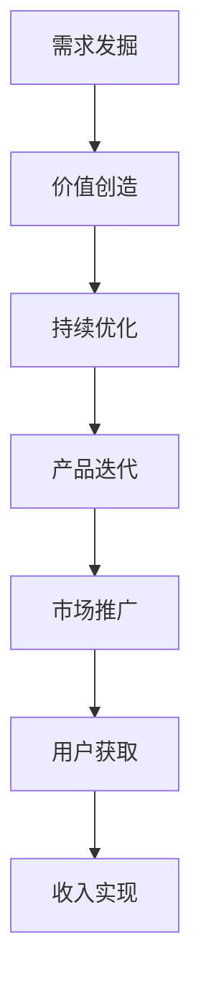

                 

## 1. 背景介绍

### 1.1 问题由来
随着互联网的蓬勃发展和数字经济的崛起，程序员这一职业正在经历着前所未有的变化。程序员的薪资不再仅仅取决于其工作的时长和技术水平，而是开始有了被动收入的可能性。所谓被动收入，指的是无需主动介入便可获得收入的一种形式。这种收入模式对于程序员来说，意味着其可以通过构建软件产品、技术平台或自动化工具，实现持续的、无需重复劳动的收入。本文将探讨程序员如何构建与维护被动收入，以期为职业发展和经济收益带来新的思路。

### 1.2 问题核心关键点
构建被动收入的核心关键点在于发掘需求、创造价值和持续优化。以下是具体细节：
- **发掘需求**：识别目标用户群体和他们的痛点，了解市场需求。
- **创造价值**：提供高质量、创新性的解决方案，满足用户需求。
- **持续优化**：持续改进产品，保持竞争力和用户满意度。

通过这一过程，程序员不仅可以实现个人的职业发展和收入增长，还能为社会创造更大的价值。

### 1.3 问题研究意义
程序员构建与维护被动收入具有重要的研究意义：
1. **职业发展**：帮助程序员开拓职业新路径，提升技能水平。
2. **经济收益**：为程序员带来稳定、可重复的收入，改善生活质量。
3. **社会价值**：通过技术创新解决实际问题，推动社会进步。
4. **市场需求**：响应市场需求，促进软件和技术的迭代升级。

## 2. 核心概念与联系

### 2.1 核心概念概述

为更好地理解构建与维护被动收入的过程，本节将介绍几个关键概念：

- **被动收入**：无需主动介入便可持续获得的收入，如软件销售、平台订阅、广告分成等。
- **产品**：指能够满足用户需求、解决特定问题的软件产品或技术平台。
- **用户**：指使用软件或技术服务的个体或组织。
- **市场**：指用户需求和产品供给相互作用的环境，分为自由市场和寡头市场等。
- **商业模式**：指产品或服务如何创造和传递价值，包括产品定价、推广策略、盈利模式等。
- **持续优化**：指通过反馈机制不断改进产品，提高用户体验和产品竞争力。

这些概念之间的关系可以通过以下Mermaid流程图来展示：



这个流程图展示了大语言模型的核心概念及其之间的关系：

1. 通过用户需求发掘产品创意。
2. 价值创造：通过技术实现满足用户需求的功能。
3. 持续优化：通过用户反馈不断改进产品。
4. 产品迭代：根据市场反馈进行版本更新。
5. 市场推广：通过营销手段扩大用户基础。
6. 用户获取：通过有效渠道吸引新用户。
7. 收入实现：通过订阅、广告、销售等方式实现被动收入。

## 3. 核心算法原理 & 具体操作步骤

### 3.1 算法原理概述

构建与维护被动收入的过程，本质上是一个市场导向的动态优化过程。其核心思想是：通过深入理解用户需求，利用先进技术创造有价值的解决方案，并持续优化产品以适应市场需求变化。

形式化地，设 $M$ 为市场需求，$P$ 为产品，$C$ 为用户，$R$ 为收入实现机制。构建与维护被动收入的过程可以表示为：

$$
\max_{M,P,C,R} \quad \text{User Satisfaction} + \text{Economic Profit}
$$

其中，User Satisfaction 为用户体验满意度，Economic Profit 为产品盈利能力。具体优化策略包括：
- 用户需求分析：通过用户调研、数据分析等方式，准确把握用户需求。
- 产品价值设计：设计具有创新性和差异化的产品功能，提高用户价值。
- 市场推广策略：制定有效的市场推广方案，吸引更多用户。
- 持续优化流程：建立反馈机制，根据用户反馈和市场变化进行产品迭代。

### 3.2 算法步骤详解

构建与维护被动收入的一般步骤如下：

**Step 1: 用户需求分析**
- 进行市场调研，了解目标用户群体和他们的需求。
- 使用用户访谈、问卷调查等方式，收集详细的需求信息。
- 分析数据，确定核心需求和痛点。

**Step 2: 产品价值设计**
- 根据需求分析结果，设计产品功能和用户界面。
- 进行技术选型，选择合适的开发平台和技术栈。
- 引入敏捷开发方法，快速迭代产品原型。

**Step 3: 市场推广策略**
- 制定营销计划，选择推广渠道和方式。
- 设计推广素材，如视频、文章、用户案例等。
- 利用社交媒体、搜索引擎优化（SEO）等手段提升曝光率。

**Step 4: 持续优化流程**
- 建立用户反馈机制，收集用户意见和建议。
- 分析用户反馈，识别问题和改进点。
- 根据反馈结果，调整产品功能和用户体验。

**Step 5: 收入实现机制**
- 设计合理的定价策略，确定产品收费方式。
- 利用订阅、广告、销售等方式实现收入。
- 持续优化收入模型，提升盈利能力。

### 3.3 算法优缺点

构建与维护被动收入的方法具有以下优点：
1. **自动化收入**：一旦产品上线，可以实现持续的被动收入，减少主动工作时间。
2. **灵活性高**：可以灵活调整产品功能和定价策略，快速响应市场变化。
3. **可扩展性**：产品和服务可以不断扩展，创造更大的经济价值。

但同时，该方法也存在一定的局限性：
1. **初期成本高**：产品开发和市场推广初期需要大量投入。
2. **风险较高**：市场变化难以预测，产品可能面临被淘汰的风险。
3. **技术门槛高**：需要具备较强的技术实力和市场洞察力。

尽管存在这些局限性，但就目前而言，构建与维护被动收入仍是程序员职业发展的重要方向。未来相关研究的重点在于如何进一步降低初期成本，提高产品抗风险能力，同时兼顾灵活性和稳定性。

### 3.4 算法应用领域

构建与维护被动收入的方法，在软件行业、互联网企业、科技创新领域等都有广泛的应用，例如：

- 软件开发：通过构建软件产品，提供商业解决方案，实现持续的订阅收入。
- 技术平台：搭建开源社区或SaaS平台，吸引开发者和企业用户，实现广告和付费订阅收入。
- 自动化工具：开发自动化测试工具、数据分析平台等，为企业提供技术支持，实现销售和订阅收入。

除了上述这些领域外，被动收入构建方法还在教育培训、健康医疗、金融保险等多个行业得到应用，为传统行业数字化转型提供了新的解决方案。随着技术的发展和应用场景的扩展，相信被动收入构建将成为程序员职业发展的新趋势。

## 4. 数学模型和公式 & 详细讲解  
### 4.1 数学模型构建

本节将使用数学语言对构建与维护被动收入的过程进行更加严格的刻画。

设 $M$ 为市场需求，$P$ 为产品，$C$ 为用户，$R$ 为收入实现机制。构建与维护被动收入的过程可以表示为：

$$
\max_{M,P,C,R} \quad \text{User Satisfaction} + \text{Economic Profit}
$$

其中，User Satisfaction 为用户体验满意度，Economic Profit 为产品盈利能力。具体优化策略包括：
- 用户需求分析：通过用户调研、数据分析等方式，确定核心需求和痛点。
- 产品价值设计：设计具有创新性和差异化的产品功能，提高用户价值。
- 市场推广策略：制定有效的市场推广方案，吸引更多用户。
- 持续优化流程：建立反馈机制，根据用户反馈和市场变化进行产品迭代。

### 4.2 公式推导过程

以下我们以构建一个在线教育平台为例，推导用户满意度和盈利能力的计算公式。

假设用户 $i$ 对平台 $j$ 的满意度为 $S_{ij}$，盈利能力为 $E_j$，则总的用户满意度和盈利能力分别为：

$$
\text{User Satisfaction} = \sum_{i} S_{ij}
$$
$$
\text{Economic Profit} = \sum_{j} E_j
$$

假设平台 $j$ 的收入实现机制为订阅模式，每年收费 $C_j$，用户数 $U_j$，则总盈利能力为：

$$
E_j = C_j \times U_j
$$

结合用户满意度公式，总目标函数为：

$$
\max_{M,P,C,R} \quad \sum_{i} S_{ij} + \sum_{j} (C_j \times U_j)
$$

在实际应用中，可以通过最小二乘法、线性规划等优化算法，求解上述目标函数，得到最优的产品设计、市场推广和持续优化的策略。

### 4.3 案例分析与讲解

以在线教育平台为例，进行具体分析：

**需求分析**：通过问卷调查和用户访谈，发现用户对课程内容丰富性和互动性有较高需求。

**产品设计**：开发了多门高质量课程，引入了直播互动、AI测评等功能，提升了用户体验。

**市场推广**：通过社交媒体广告、搜索引擎优化（SEO）、KOL推荐等方式推广平台，吸引了大量用户。

**持续优化**：建立用户反馈机制，定期进行用户满意度调查，根据反馈结果调整课程内容和推广策略。

**收入实现**：采用订阅模式，每月收取一定费用，同时提供免费试用课程，吸引新用户。

通过这一系列步骤，平台实现了用户满意度和盈利能力的最大化，取得了显著的经济效益。

## 5. 项目实践：代码实例和详细解释说明
### 5.1 开发环境搭建

在进行被动收入构建的实践前，我们需要准备好开发环境。以下是使用Python进行Django开发的环境配置流程：

1. 安装Anaconda：从官网下载并安装Anaconda，用于创建独立的Python环境。

2. 创建并激活虚拟环境：
```bash
conda create -n django-env python=3.8 
conda activate django-env
```

3. 安装Django：
```bash
pip install django
```

4. 安装所需的库：
```bash
pip install requests psycopg2 django-model-templates
```

5. 安装数据库：
```bash
sudo apt-get install postgresql postgresql-contrib
```

6. 创建数据库：
```bash
createdb django_db
```

完成上述步骤后，即可在`django-env`环境中开始构建被动收入平台。

### 5.2 源代码详细实现

下面我们以构建一个在线教育平台为例，给出使用Django进行被动收入平台开发的PyTorch代码实现。

首先，定义Django应用和模型：

```python
from django.db import models
from django.contrib.auth.models import User
from django.urls import reverse

class Course(models.Model):
    title = models.CharField(max_length=100)
    content = models.TextField()
    # 其他字段和关联关系...

class User(models.Model):
    username = models.CharField(max_length=100, unique=True)
    email = models.EmailField(unique=True)
    # 其他字段和关联关系...
```

然后，定义用户登录和课程订阅功能：

```python
from django.contrib.auth import authenticate, login
from django.shortcuts import redirect

def login_view(request):
    if request.method == 'POST':
        username = request.POST['username']
        password = request.POST['password']
        user = authenticate(request, username=username, password=password)
        if user is not None:
            login(request, user)
            return redirect(reverse('course_list'))
    return render(request, 'login.html')

def course_list(request):
    courses = Course.objects.all()
    return render(request, 'course_list.html', {'courses': courses})

def course_detail(request, pk):
    course = get_object_or_404(Course, pk=pk)
    return render(request, 'course_detail.html', {'course': course})
```

最后，定义用户注册和订阅功能：

```python
from django.contrib.auth.decorators import login_required
from django.shortcuts import render, redirect
from django.views.decorators.http import require_http_methods

@login_required
@require_http_methods(['POST'])
def subscribe_course(request, pk):
    course = get_object_or_404(Course, pk=pk)
    request.session['courses'] = request.session.get('courses', []) + [course.pk]
    return redirect(reverse('course_list'))
```

通过上述代码，我们实现了用户登录、课程列表、课程详情和课程订阅等功能，构建了一个简单的在线教育平台。

### 5.3 代码解读与分析

让我们再详细解读一下关键代码的实现细节：

**User和Course模型**：
- `User`模型：定义了用户的基本信息，包括用户名、邮箱等。
- `Course`模型：定义了课程的基本信息，包括标题、内容等。

**login_view和course_list函数**：
- `login_view`函数：处理用户登录逻辑，验证用户名和密码，若验证通过则重定向至课程列表页面。
- `course_list`函数：查询所有课程，返回课程列表页面。

**course_detail和subscribe_course函数**：
- `course_detail`函数：根据课程ID查询课程详情，返回课程详情页面。
- `subscribe_course`函数：在用户登录后，允许其订阅感兴趣的课程，将课程ID添加至用户已订阅列表。

这些代码实现相对简单，但展示了Django框架的基本应用方式。通过Django的ORM、模板系统、表单处理等功能，程序员可以快速构建出高质量的Web应用，为被动收入平台提供强大的技术支持。

当然，工业级的系统实现还需考虑更多因素，如权限控制、数据存储、支付集成等。但核心的被动收入构建流程基本与此类似。

## 6. 实际应用场景
### 6.1 教育培训

在线教育平台是被动收入构建的重要应用场景之一。传统的线下教育模式受时间和空间限制较大，而在线教育平台可以随时随地提供教育资源，满足了用户的个性化学习需求。

在技术实现上，可以通过收集用户的学习行为数据，分析其学习偏好和效果，提供个性化推荐和智能辅导，进一步提升用户体验和学习效果。

### 6.2 健康医疗

健康医疗领域的被动收入平台，如在线问诊、健康管理、个性化营养等，也具有广阔的应用前景。程序员可以通过构建医疗咨询平台、健康管理App等，为用户的健康生活提供便利和支持。

在技术实现上，可以利用医疗大数据，结合机器学习算法，提供疾病预测、健康评估等服务，帮助用户更好地管理健康。

### 6.3 金融投资

金融投资领域也存在着被动收入构建的机会。通过开发股票分析、投资理财等应用，程序员可以为投资者提供精准的股票分析报告、投资建议等，实现稳定收益。

在技术实现上，可以利用数据挖掘和机器学习技术，分析历史数据和市场动态，提供个性化的投资建议，帮助用户规避风险，实现财富增值。

### 6.4 未来应用展望

随着技术的进步和应用场景的拓展，基于被动收入的开发将变得更加多样化和个性化。未来，程序员可以探索更多前沿领域，如智能家居、智慧城市、人工智能辅助医疗等，为社会带来更多创新和变革。

## 7. 工具和资源推荐
### 7.1 学习资源推荐

为了帮助程序员系统掌握被动收入构建的理论基础和实践技巧，这里推荐一些优质的学习资源：

1. 《Django Web开发实战》系列书籍：深入浅出地介绍了Django框架的使用方法，适合初学者和进阶者。

2. 《Python网络爬虫开发实战》系列书籍：介绍了如何利用Python进行Web数据抓取和处理，适合被动收入平台的数据采集需求。

3. 《机器学习实战》系列书籍：介绍了各种机器学习算法和实现方式，适合被动收入平台的数据分析和预测需求。

4. 《Flask Web开发》系列博客和文档：介绍了Flask框架的使用方法和最佳实践，适合小型被动收入平台的开发。

5. 《Python自然语言处理》系列课程和论文：介绍了自然语言处理技术的应用和实现方式，适合构建基于文本数据的被动收入平台。

通过对这些资源的学习实践，相信你一定能够快速掌握被动收入构建的精髓，并用于解决实际的商业问题。
###  7.2 开发工具推荐

高效的开发离不开优秀的工具支持。以下是几款用于被动收入平台开发的常用工具：

1. Django和Flask：Python的开源Web开发框架，提供了灵活的MVC架构和丰富的插件生态。

2. React和Vue.js：流行的前端框架，适合开发用户友好的被动收入平台。

3. TensorFlow和PyTorch：强大的机器学习框架，适合处理大规模数据和复杂计算需求。

4. Docker和Kubernetes：容器和K8s平台，方便被动收入平台的部署和扩展。

5. PostgreSQL和MySQL：流行的关系型数据库，适合存储结构化数据。

6. MongoDB和Elasticsearch：流行的NoSQL数据库，适合处理非结构化数据和搜索需求。

合理利用这些工具，可以显著提升被动收入平台的开发效率，加快创新迭代的步伐。

### 7.3 相关论文推荐

被动收入构建的研究已经得到了广泛关注，以下是几篇奠基性的相关论文，推荐阅读：

1. "Platform Business Models: The Hidden Logic of Successful Technologies"：探讨了平台型业务模型的构建原理和应用案例。

2. "The Business Value of APIs"：分析了API服务在被动收入构建中的重要作用和商业价值。

3. "Disruption and Sustainable Innovation"：探讨了颠覆性技术对被动收入平台的影响和创新途径。

4. "Blockchain: Harnessing the Power of Digital Assets"：介绍了区块链技术在被动收入平台中的应用和潜力。

5. "Internet of Things (IoT): A Survey"：分析了IoT技术在智能家居、智慧城市等被动收入平台中的应用前景。

这些论文代表了大语言模型微调技术的发展脉络。通过学习这些前沿成果，可以帮助研究者把握学科前进方向，激发更多的创新灵感。

## 8. 总结：未来发展趋势与挑战

### 8.1 总结

本文对基于被动收入的构建与维护方法进行了全面系统的介绍。首先阐述了被动收入的含义和构建过程，明确了需求发掘、价值创造和持续优化这一核心步骤。其次，从原理到实践，详细讲解了被动收入构建的数学模型和实现细节，给出了一个完整的代码实例。同时，本文还探讨了被动收入在教育培训、健康医疗、金融投资等多个领域的应用前景，展示了被动收入构建的巨大潜力。此外，本文精选了被动收入构建的学习资源，力求为读者提供全方位的技术指引。

通过本文的系统梳理，可以看到，基于被动收入的构建方法正在成为程序员职业发展的重要方向，其能够为个人和公司带来持续的、可重复的收入。未来，伴随技术的进步和市场需求的不断变化，被动收入构建将成为程序员职业发展的新趋势。

### 8.2 未来发展趋势

展望未来，被动收入构建技术将呈现以下几个发展趋势：

1. **智能化**：利用人工智能和机器学习技术，提升被动收入平台的智能化水平，提供更精准的服务。

2. **平台化**：构建多功能的平台生态，实现数据的互联互通和服务的互补集成。

3. **个性化**：通过用户数据分析，提供个性化的产品和服务，提升用户体验。

4. **国际化**：拓展海外市场，提供多语言、跨文化的服务，满足全球用户的需求。

5. **社交化**：引入社交元素，增强用户互动和社区效应，提升平台粘性。

6. **安全性**：提升数据安全和隐私保护，确保平台稳定运行。

以上趋势凸显了被动收入构建技术的广阔前景。这些方向的探索发展，必将进一步提升被动收入平台的竞争力，为程序员职业发展和经济收益带来新的契机。

### 8.3 面临的挑战

尽管被动收入构建技术已经取得了瞩目成就，但在迈向更加智能化、普适化应用的过程中，它仍面临着诸多挑战：

1. **初期投入高**：被动收入平台建设初期需要大量的资金和人力投入，对资源要求较高。

2. **市场竞争激烈**：市场竞争环境复杂，需要持续创新才能保持竞争力。

3. **技术门槛高**：被动收入平台涉及多种技术，需要具备较强的技术实力和跨领域知识。

4. **用户体验不稳定**：平台的用户体验和稳定性直接影响到收入的实现，需要持续优化和迭代。

5. **数据隐私问题**：平台的数据安全和隐私保护需要严格管理，避免用户信息泄露。

6. **政策风险**：平台运营过程中可能面临政策法规的变化，需要及时调整。

正视被动收入构建面临的这些挑战，积极应对并寻求突破，将是大语言模型微调走向成熟的必由之路。相信随着学界和产业界的共同努力，这些挑战终将一一被克服，被动收入构建必将在构建人机协同的智能时代中扮演越来越重要的角色。

### 8.4 研究展望

面对被动收入构建所面临的种种挑战，未来的研究需要在以下几个方面寻求新的突破：

1. **优化初期投入**：开发轻量级的框架和工具，降低平台开发和维护成本。

2. **提升平台智能化**：利用人工智能和机器学习技术，提升平台的服务能力和用户体验。

3. **增强跨平台兼容性**：开发跨平台的API和接口，实现多渠道的数据交换和集成。

4. **加强数据保护**：引入数据加密和隐私保护技术，确保用户数据安全。

5. **拓展全球市场**：开发多语言、跨文化的应用和服务，满足全球用户的需求。

6. **创新盈利模式**：探索新的盈利模式和商业策略，提升平台的收入和利润。

这些研究方向的探索，必将引领被动收入构建技术迈向更高的台阶，为程序员职业发展和经济收益带来新的突破。面向未来，被动收入构建技术还需要与其他人工智能技术进行更深入的融合，如自然语言处理、计算机视觉等，多路径协同发力，共同推动软件和技术的迭代升级。只有勇于创新、敢于突破，才能不断拓展被动收入平台的边界，让智能技术更好地造福人类社会。

## 9. 附录：常见问题与解答

**Q1：如何构建高质量的被动收入平台？**

A: 构建高质量的被动收入平台需要遵循以下步骤：
1. 需求分析：深入了解用户需求和痛点。
2. 价值创造：提供有创新性和差异化的产品和服务。
3. 市场推广：制定有效的推广策略，吸引更多用户。
4. 持续优化：根据用户反馈不断改进产品，提升用户体验。

**Q2：如何优化被动收入平台的初期投入？**

A: 优化初期投入可以采取以下措施：
1. 轻量级框架：选择轻量级的开发框架，降低开发成本。
2. 开源社区：利用开源社区的力量，降低开发成本。
3. 模块化开发：采用模块化开发方式，降低后期维护成本。

**Q3：如何提升被动收入平台的智能化水平？**

A: 提升平台智能化可以通过以下方法：
1. 引入AI和ML技术：利用自然语言处理、机器学习等技术，提升服务能力。
2. 数据驱动：利用大数据分析，提供个性化的服务。
3. 自动化：引入自动化流程，提升运营效率。

**Q4：如何确保被动收入平台的数据安全？**

A: 确保数据安全可以采取以下措施：
1. 数据加密：对用户数据进行加密存储和传输。
2. 访问控制：采用严格的访问控制机制，保护用户数据安全。
3. 合规性：遵守相关法律法规，确保数据合规。

**Q5：如何应对市场竞争激烈的问题？**

A: 应对市场竞争可以采取以下措施：
1. 差异化定位：找到独特的产品定位，满足特定用户需求。
2. 持续创新：不断推出新产品和服务，保持竞争力。
3. 用户体验：提升用户体验，增强用户粘性。

---

作者：禅与计算机程序设计艺术 / Zen and the Art of Computer Programming

