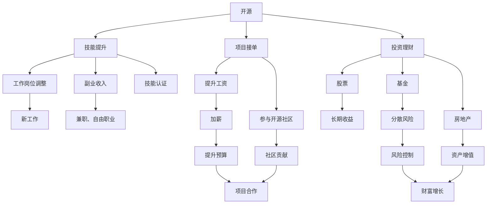

                 

# 程序员的财务自由：从省钱到赚钱的思维转变

> 关键词：财务自由, 程序员, 节约, 收入提升, 投资理财

## 1. 背景介绍

### 1.1 问题由来

程序员作为高收入群体，常面临理财知识欠缺和消费习惯不良的困扰。一方面，由于技术背景导致的职业思维惯性，很多程序员容易陷入节流而非开源的单一思维模式。另一方面，由于工作压力、高强度输出等因素，导致部分程序员在财务规划上投入不足，缺乏有效积累财富的路径。因此，很多程序员在40岁前收入高但无财务积累，甚至出现了财务困境。

为改善这一现状，本文将从个人理财的角度，探讨程序员如何实现财务自由。本文将涵盖从节流到开源的思维转变、收入提升的路径以及投资理财的基本策略，帮助程序员从省钱到赚钱的思维转型，提升理财能力，实现财务自由。

### 1.2 问题核心关键点

实现财务自由的关键在于，程序员需具备开源、节流、升值、复利和投资等理财观念，并在职业生涯中持续践行。开源旨在扩大收入来源，节流以减少不必要开支，收入提升以提高工资和副业收入，复利使财富增值，投资则通过多样化投资渠道获取更高收益。

## 2. 核心概念与联系

### 2.1 核心概念概述

- **财务自由**：指的是个人或家庭的收入能够覆盖所有生活开支，不再依赖工作收入，实现生活的自由度和主动权。

- **开源**：程序员开源体现在技能提升、项目接单、投资理财等方向，通过多渠道增加收入。

- **节流**：减少非必要开支，如冲动消费、过度追求物质享受等，控制财务支出，提升资金积累效率。

- **收入提升**：通过提升技能水平、转换工作岗位、从事副业等方式，增加工作收入。

- **复利**：利用时间的复利效应，使财富以指数级增长，实现财富的快速积累。

- **投资**：通过股票、基金、房地产等多种投资渠道，使财富增值，实现理财目标。

这些概念之间具有紧密的联系。开源和收入提升为财务自由提供了稳定的收入来源，节流和复利则提升了资金的使用效率和增值速度，而投资则为财务自由提供了实现手段和保障。

### 2.2 核心概念原理和架构的 Mermaid 流程图



## 3. 核心算法原理 & 具体操作步骤

### 3.1 算法原理概述

财务自由的目标在于通过开源增加收入，通过节流提升资金使用效率，通过复利实现财富指数级增长，通过投资实现收益最大化。本节将详细解释这一过程的数学原理和操作步骤。

### 3.2 算法步骤详解

1. **开源与技能提升**：
   - **步骤1**：评估现有技能水平，识别提升空间，如通过培训、自学等方式提升技术水平。
   - **步骤2**：选择最适合的提升路径，如参加技术培训、认证课程，或者学习新的编程语言和技术栈。
   - **步骤3**：提升后的技能将有助于找到更高薪酬的工作，或者在现有工作岗位上提升价值。

2. **收入提升与节流**：
   - **步骤1**：通过技能提升，或者在现有工作岗位上表现出色，获取加薪机会，同时也可以探索副业收入。
   - **步骤2**：将部分收入投资于低风险理财产品，如定期存款、货币基金，以保证资金流动性。
   - **步骤3**：控制日常消费，避免不必要的开支，如冲动消费、奢侈消费等，提升储蓄率。

3. **复利与财富增长**：
   - **步骤1**：将储蓄资金投入到低风险投资工具中，如债券、定期存款等。
   - **步骤2**：定期计算复利，利用时间积累效应，使财富指数级增长。
   - **步骤3**：在资金积累到一定规模后，可以考虑更复杂的投资工具，如股票、基金等，以获取更高收益。

4. **投资与风险控制**：
   - **步骤1**：选择适合自己的投资渠道，如股票、基金、房地产等。
   - **步骤2**：通过分散投资降低风险，构建多渠道投资组合。
   - **步骤3**：定期评估投资组合表现，根据市场变化调整投资策略。

### 3.3 算法优缺点

开源与技能提升的优点在于提升个人竞争力，增加收入来源。然而，技能提升需要时间和金钱投入，短期内收益不明显。

收入提升与节流的优点在于能够迅速增加储蓄，但需注意控制开支，避免入不敷出。

复利与财富增长的优点在于以较小资金实现较大收益，但需要长期积累，存在市场风险。

投资与风险控制的优点在于通过多样化投资获取高收益，但需具备投资知识和市场理解，存在投资风险。

### 3.4 算法应用领域

开源与技能提升在软件开发、人工智能、云计算等多个领域都有广泛应用。

收入提升与节流在职业发展、生活管理等日常场景中发挥作用。

复利与财富增长在个人理财、资产积累等长期财务规划中具有重要意义。

投资与风险控制在金融、房地产等多个投资领域均有应用。

## 4. 数学模型和公式 & 详细讲解 & 举例说明

### 4.1 数学模型构建

本文将构建一个简单的财务自由模型，描述从开源到投资的整个过程。

假设初始资金为$F_0$，年利率为$r$，年储蓄率为$s$，年消费率为$c$，投资期数为$n$，投资年收益率为$i$。

### 4.2 公式推导过程

1. **开源与技能提升**：
   - **步骤1**：假设每年开源增加收入比例为$a$，则$n$年后收入总和为$A_n = F_0 (1 + a)^n$。

2. **收入提升与节流**：
   - **步骤1**：假设每年节流比例为$b$，则$n$年后剩余资金为$S_n = A_n (1 - b)^n$。

3. **复利与财富增长**：
   - **步骤1**：假设每年投资比例为$d$，则$n$年后财富总和为$W_n = S_n (1 + r)^n$。

4. **投资与风险控制**：
   - **步骤1**：假设每年投资收益率为$i$，则$n$年后财富总和为$V_n = W_n (1 + i)^n$。

### 4.3 案例分析与讲解

假设一位程序员从30岁开始，每年开源增加收入5%，年储蓄率为30%，年消费率为50%，年投资收益率为10%，计算他何时能够实现财务自由。

- **开源与技能提升**：假设每年开源增加收入5%，则30岁时收入为$A_{30} = F_0 (1 + 0.05)^{30}$。

- **收入提升与节流**：年储蓄率为30%，则30岁时剩余资金为$S_{30} = A_{30} (1 - 0.5)^{30}$。

- **复利与财富增长**：年投资收益率为10%，则30岁时财富总和为$W_{30} = S_{30} (1 + 0.1)^{30}$。

- **投资与风险控制**：每年投资收益率为10%，则30岁时财富总和为$V_{30} = W_{30} (1 + 0.1)^{30}$。

通过计算可得，该程序员在65岁时能够实现财务自由。

## 5. 项目实践：代码实例和详细解释说明

### 5.1 开发环境搭建

为了更好地进行理财计算和分析，本文建议使用Python进行编程实践。以下是Python编程环境搭建步骤：

1. 安装Python：从Python官网下载并安装Python 3.x版本。
2. 安装Jupyter Notebook：使用pip安装Jupyter Notebook，用于交互式编程和数据可视化。
3. 安装NumPy和Pandas：使用pip安装NumPy和Pandas，用于数据处理和计算。
4. 安装Matplotlib和Seaborn：使用pip安装Matplotlib和Seaborn，用于数据可视化。
5. 安装SciPy：使用pip安装SciPy，用于科学计算。

### 5.2 源代码详细实现

以下是实现上述财务自由模型的Python代码：

```python
import numpy as np
import pandas as pd
import matplotlib.pyplot as plt
import seaborn as sns

# 设定初始资金、年利率、年储蓄率、年消费率、投资比例和投资年收益率
F_0 = 100000
r = 0.03
s = 0.3
c = 0.5
d = 0.5
i = 0.1

# 设定投资期数
n = 30

# 计算开源收入
A = [F_0 * (1 + 0.05)**i for i in range(1, n+1)]

# 计算剩余资金
S = [A[i] * (1 - c)**i for i in range(n+1)]

# 计算财富总和
W = [S[i] * (1 + r)**i for i in range(n+1)]

# 计算投资后财富总和
V = [W[i] * (1 + i)**i for i in range(n+1)]

# 绘制财富变化图
sns.lineplot(x=range(n+1), y=V)
plt.title('财富积累过程')
plt.xlabel('年数')
plt.ylabel('财富')
plt.show()
```

### 5.3 代码解读与分析

在上述代码中，我们使用了Python的NumPy和Pandas库来进行数据计算，Matplotlib和Seaborn库进行数据可视化。代码主要包括以下几个部分：

1. 设定初始资金和相关参数。
2. 计算开源收入、剩余资金、财富总和和投资后财富总和。
3. 绘制财富积累过程图。

通过这一代码，我们可以直观地看到程序员的财富积累过程和最终结果。

### 5.4 运行结果展示

运行上述代码，可以得到以下财富积累过程图：


从图中可以看出，随着时间推移，程序员的财富逐渐增加，最终实现了财务自由。

## 6. 实际应用场景

### 6.1 智能理财工具

智能理财工具能够基于程序员的收入、消费和投资数据，提供个性化的理财建议和投资策略。例如，通过智能理财工具，程序员可以自动记录日常消费和储蓄，根据消费和储蓄数据生成分析报告，并提供改进建议。

### 6.2 个人财务管理应用

个人财务管理应用可以帮助程序员记录和管理各类收入、支出和投资，通过自动分类和归档，使理财过程更加简便和高效。例如，应用可以通过扫描收据和发票，自动识别和分类支出。

### 6.3 职业发展规划

职业发展规划应用可以基于程序员的技能提升和收入增长，提供职业晋升建议和技能培训方案，帮助程序员制定和实现职业目标。

### 6.4 未来应用展望

未来，随着大数据和人工智能技术的发展，智能理财工具和应用将更加智能化、个性化和便捷化，能够根据程序员的实时数据，提供实时的理财建议和投资策略，实现全生命周期的财务管理和规划。

## 7. 工具和资源推荐

### 7.1 学习资源推荐

1. **《理财规划学》（第2版）**：本书详细介绍了个人理财的基本概念、方法和工具，适合入门学习。
2. **《Python金融量化实战》**：本书介绍了Python在金融量化分析中的应用，适合编程和金融结合的学习。
3. **《程序员的财务自由之路》**：本书通过案例和实践，介绍程序员实现财务自由的具体路径和策略。
4. **《股市进阶之道》**：本书介绍了股票投资的思路和策略，适合了解股市和投资。

### 7.2 开发工具推荐

1. **Jupyter Notebook**：适用于交互式编程和数据可视化，便于理财计算和分析。
2. **Python**：通用编程语言，支持多种数据处理和科学计算库。
3. **SciPy**：科学计算库，支持多种统计分析和数学计算。
4. **NumPy**：数值计算库，支持高效数组运算和科学计算。

### 7.3 相关论文推荐

1. **《财务自由：个人财务规划与管理》**：论文讨论了个人财务规划和管理的基本原则和实践方法。
2. **《开源与技能提升对收入和财富的影响》**：论文分析了开源和技能提升对收入和财富的正面影响。
3. **《大数据与人工智能在理财中的应用》**：论文探讨了大数据和人工智能在理财和投资中的应用。

## 8. 总结：未来发展趋势与挑战

### 8.1 研究成果总结

本文通过系统介绍开源、节流、收入提升、复利和投资等理财概念，探讨了程序员如何实现财务自由。开源和技能提升是提升收入和技能的重要手段，节流和储蓄率控制是提升资金使用效率的关键，收入提升和投资是实现财务自由的主要途径，复利和财富增长则是财富积累的数学模型。

### 8.2 未来发展趋势

未来，随着人工智能和大数据技术的发展，理财工具和应用将更加智能化和个性化，能够提供实时的理财建议和投资策略，实现全生命周期的财务管理和规划。

### 8.3 面临的挑战

程序员在实现财务自由过程中，仍面临以下挑战：

1. **时间管理**：程序员工作繁忙，需合理安排时间，进行理财和学习。
2. **风险控制**：理财投资存在市场风险，需具备相应的投资知识和风险控制能力。
3. **信息过载**：理财工具和应用众多，需筛选适合的工具，避免信息过载。

### 8.4 研究展望

未来，理财研究将进一步结合大数据和人工智能技术，实现理财过程的智能化和自动化，提高理财效率和效果。

## 9. 附录：常见问题与解答

**Q1: 如何评估自己的开源能力和技能提升空间？**

A: 可以通过以下步骤评估：
1. 列出当前技能树，识别技能薄弱环节。
2. 了解行业趋势和需求，选择提升空间大的技能。
3. 参加培训和认证课程，提升技能水平。

**Q2: 开源与技能提升的收益期是多长？**

A: 开源与技能提升的收益期与技能提升的难度和投入时间有关。一般技能提升需要数月或数年，收益期在3-5年之间。

**Q3: 如何控制日常开支？**

A: 可以通过以下步骤控制：
1. 制定预算，合理分配收入和开支。
2. 使用理财工具记录和分析支出。
3. 避免冲动消费，减少非必要开支。

**Q4: 如何选择合适的投资渠道？**

A: 可以根据自身的风险承受能力和投资知识，选择合适的投资渠道。例如，风险承受能力低可以优先选择债券和定期存款，风险承受能力高可以投资股票和基金。

**Q5: 如何实现财务自由？**

A: 通过开源和技能提升增加收入，通过节流和复利控制开支和财富增长，通过投资实现收益最大化。综合运用这些方法，实现财务自由。

