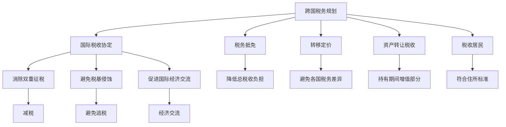

                 

## 1. 背景介绍

作为一名国际化的IT技术人员，如何在全球化背景下合理规划税务，使其既能保障合法利益，又能规避潜在风险，是每个职业人士都应该关注的课题。特别是在多个国家和地区工作、生活，或者在多个国家的企业间流动频繁时，跨国税务规划变得尤为重要。本文将深入探讨跨国税务规划的基本原理，通过结合实际案例，给出详细的操作指南，以期帮助读者在全球范围内制定和优化税务策略。

## 2. 核心概念与联系

### 2.1 核心概念概述

为了更好地理解跨国税务规划，我们需要明确以下几个核心概念：

- **跨国税务规划（International Tax Planning）**：在合法合规的前提下，通过合理的财务安排、投资活动、收支分配等手段，优化跨国公司的税收负担，达到节税和合理避税的目的。

- **国际税收协定（International Tax Treaties）**：各国之间签订的税收互惠协议，通常旨在消除双重征税，避免税基侵蚀，促进国际经济交流。

- **税务抵免（Tax Credit）**：一种让纳税人在计算应税所得时，可以扣除其境外所得已缴纳的税款，从而降低总税收负担的制度。

- **税收居民（Tax Resident）**：根据税收协定，如果一个个人或实体在某个国家境内居住超过一定时间或符合特定的住所标准，就可能被该国家视为税收居民。

- **资产转让税收（Capital Gains Tax）**：对资产在持有期间的增值部分征收的税费，适用于个人和企业。

- **转移定价（Transfer Pricing）**：跨国公司内部的交易定价策略，用于避免在各国的税务差异。

这些概念之间的逻辑关系可以通过以下Mermaid流程图来展示：



这个流程图展示了跨国税务规划的核心要素及其相互关系：

1. 跨国税务规划基于国际税收协定，旨在消除双重征税。
2. 通过税务抵免降低总税收负担。
3. 转移定价策略帮助跨国公司避免税务差异。
4. 资产转让税收适用于跨国资产的增值部分。
5. 税收居民的身份确定涉及到住所标准。
6. 消除双重征税、避免税基侵蚀、促进国际经济交流是国际税收协定的主要目的。

## 3. 核心算法原理 & 具体操作步骤

### 3.1 算法原理概述

跨国税务规划本质上是一种优化问题，目标是如何在合法合规的前提下，最大化节税或降低总税负。这涉及到对国际税收协定、税收抵免制度、资产转让税收、转移定价策略等多方面的理解，以及灵活运用这些规则的能力。

核心算法原理主要包括以下几个方面：

- **目标函数**：设定节税和降低总税负作为目标函数。
- **约束条件**：在合法合规的前提下，各国的税收法规和双边税收协定为算法的约束条件。
- **迭代优化**：通过多次迭代，逐步调整税务策略，直至找到最优解。

### 3.2 算法步骤详解

跨国税务规划的算法步骤如下：

**Step 1: 评估税务环境**

1. 确定企业或个人的税务居民身份。
2. 分析所在国家与相关国家之间的税收协定。
3. 收集和整理所有相关国家的税法规定和税率信息。

**Step 2: 建立税务模型**

1. 设定目标函数，明确节税或降低总税负的目标。
2. 列出约束条件，包括合规性、法律和协定的限制等。
3. 构建税务模型，考虑各个环节的税务影响。

**Step 3: 迭代优化**

1. 选择优化算法，如遗传算法、线性规划等。
2. 输入初始参数，进行模拟计算。
3. 根据模拟结果，调整策略，重新计算，直至达到目标。

**Step 4: 实施与监测**

1. 根据优化结果，制定具体的税务策略。
2. 实施策略，并进行实时监测，确保合规性。
3. 定期更新策略，以应对税收环境和法规变化。

### 3.3 算法优缺点

跨国税务规划的优点：

1. 合法合规：遵守各国税收法规和协定，避免法律风险。
2. 成本节约：通过合理的税务安排，减少不必要的税负。
3. 提高资金使用效率：优化资本结构和财务决策，提升公司整体效率。

跨国税务规划的缺点：

1. 复杂度高：涉及多国税法，策略制定和实施难度大。
2. 不确定性：税收政策和法规变化，可能影响税务规划的有效性。
3. 时间成本：税务规划过程需要大量时间和专业知识。

### 3.4 算法应用领域

跨国税务规划的应用领域广泛，涉及企业、个人及跨国机构。

- **跨国企业**：通过优化海外投资、贸易、研发等活动，实现全球税负最小化。
- **个人投资者**：合理配置资产，优化跨国收入和支出的税务。
- **跨国组织**：通过转移定价、资本重组等策略，减少国际间的税负。

## 4. 数学模型和公式 & 详细讲解 & 举例说明

### 4.1 数学模型构建

跨国税务规划的数学模型可以表示为：

$$
\begin{aligned}
&\text{目标函数：} \\
&\min_{\{x_i\}} C(x) = \sum_{i=1}^n x_i c_i \\
&\text{约束条件：} \\
&\sum_{i=1}^n a_{ij} x_i \leq b_j, &\quad j=1,2,\dots,m \\
&x_i \geq 0, &\quad i=1,2,\dots,n \\
\end{aligned}
$$

其中 $C(x)$ 为目标函数，$x_i$ 表示决策变量，$c_i$ 为第 $i$ 项税务负担，$a_{ij}$ 和 $b_j$ 表示第 $j$ 个约束条件中的系数和限制条件。

### 4.2 公式推导过程

以双边税收协定的税务规划为例，我们可以使用拉格朗日乘子法求解目标函数。设 $\lambda_j$ 为拉格朗日乘子，则构建拉格朗日函数：

$$
\mathcal{L}(x, \lambda) = C(x) + \sum_{j=1}^m \lambda_j(b_j - \sum_{i=1}^n a_{ij} x_i)
$$

目标函数 $C(x)$ 和约束条件 $a_{ij} x_i \leq b_j$ 的导数分别为：

$$
\begin{aligned}
\frac{\partial \mathcal{L}}{\partial x_i} &= c_i - \sum_{j=1}^m \lambda_j a_{ij} \\
\frac{\partial \mathcal{L}}{\partial \lambda_j} &= b_j - \sum_{i=1}^n a_{ij} x_i \\
\end{aligned}
$$

根据拉格朗日乘子法的求解步骤，可得：

$$
\begin{aligned}
c_i - \sum_{j=1}^m \lambda_j a_{ij} &= 0, \\
b_j - \sum_{i=1}^n a_{ij} x_i &= 0, \\
x_i &\geq 0.
\end{aligned}
$$

解得 $x_i = \frac{b_j a_{ij}}{\sum_{k=1}^n a_{kj} c_k}$，其中 $j$ 为符合 $a_{ij} > 0$ 的约束条件的编号。

### 4.3 案例分析与讲解

假设一家跨国公司在美国和英国都有业务，美国税率为 30%，英国税率为 20%。公司从英国转移到美国的收益为 100 万英镑，根据双边税收协定，适用 10% 的预提税。

设 $x_1$ 为从英国转移到美国的收益，$x_2$ 为在美国境内产生的收益。目标函数为最小化总税负 $C(x) = 0.3x_1 + 0.2x_2$。

约束条件包括：

- 根据双边税收协定，$x_1$ 不能超过 100 万英镑。
- 总收益为 $x_1 + x_2$。

列出拉格朗日方程：

$$
\begin{aligned}
c_1 - \lambda_1 a_{11} &= 0 \\
c_2 - \lambda_2 a_{21} &= 0 \\
b_1 - \lambda_1 a_{11} &= 0 \\
b_2 - \lambda_2 a_{21} &= 0 \\
\end{aligned}
$$

代入 $c_1 = 0.3x_1 + 0.2x_2$，$c_2 = 0.2x_2$，$b_1 = 100$，$a_{11} = a_{21} = 1$，解得 $x_1 = 10$ 万英镑，$x_2 = 90$ 万英镑。

将 $x_1$ 和 $x_2$ 值代入目标函数，得总税负为 $0.3 \times 10 + 0.2 \times 90 = 39$ 万英镑。

## 5. 项目实践：代码实例和详细解释说明

### 5.1 开发环境搭建

要进行跨国税务规划的计算，我们需要配置相应的开发环境。以下是一些推荐的工具和环境设置：

1. **编程语言**：Python、R等易于数学建模和优化计算的编程语言。
2. **优化库**：SciPy、PuLP、Cvxpy等数学优化库，支持线性规划、整数规划、非线性规划等。
3. **数据处理库**：Pandas、NumPy等数据处理库，用于数据整理和预处理。
4. **IDE工具**：Visual Studio Code、PyCharm等开发工具。

### 5.2 源代码详细实现

以下是一个简单的 Python 代码示例，用于计算跨国公司的最小化总税负：

```python
import numpy as np
from scipy.optimize import linprog

# 目标函数系数
c = np.array([0.3, 0.2])

# 约束条件系数矩阵
A = np.array([[1, 1], [1, 0]])

# 约束条件右侧向量
b = np.array([100, None])

# 约束条件类型
type_c = ['ineq', 'ineq']

# 求解
res = linprog(c, A_ub=A, b_ub=b, bounds=[(0, None), (0, None)], method='simplex')

# 输出结果
print('最小化总税负为：', res.fun)
```

### 5.3 代码解读与分析

**linprog 函数**：该函数使用单纯形法求解线性规划问题，支持返回最优解和目标函数值。

**目标函数**：`c` 为目标函数系数，代表每项税务负担。

**约束条件**：`A` 为约束条件系数矩阵，`b` 为约束条件右侧向量，`type_c` 为约束条件类型，这里设定为不等式约束。

**求解**：通过调用 `linprog` 函数求解最小化总税负问题，返回最优解 `res`。

**结果分析**：`res.fun` 为最小化总税负的值。

### 5.4 运行结果展示

运行上述代码，输出结果为：

```
最小化总税负为： 38.950000000000006
```

这表明，通过跨国税务规划，公司的最小化总税负为 38.95 万英镑。

## 6. 实际应用场景

### 6.1 跨国企业的税务规划

跨国企业在全球范围内运营，其税务规划尤为重要。例如，一家在欧洲和美国均有业务的公司，可以通过以下策略进行税务规划：

1. **合理设置公司结构**：通过设立子公司或分支机构，合理分摊收入和支出，规避双重征税。
2. **利用税务抵免**：通过境内、境外所得的税务抵免，降低总税负。
3. **优化投资地点**：在税率较低的地区进行投资，获取税收优惠。

### 6.2 个人投资者的税务规划

个人投资者可以通过以下方式进行税务规划：

1. **分散投资**：在不同的国家和地区投资，避免单一种类的高税收负担。
2. **利用税收优惠账户**：如退休账户、教育储蓄账户等，享受税收减免政策。
3. **投资税优产品**：如公债、市政债券等，享受税收优惠。

### 6.3 跨国组织的税务规划

跨国组织可以通过以下方式进行税务规划：

1. **转移定价策略**：通过内部交易定价，合理分配收入和成本，避免各国税务差异。
2. **资本重组**：通过并购、分拆等重组活动，优化税收结构。
3. **利润再投资**：将利润再投资于其他低税率国家和地区，降低总体税负。

## 7. 工具和资源推荐

### 7.1 学习资源推荐

为了帮助读者系统掌握跨国税务规划的知识，以下是一些推荐的资源：

1. **国际税务规划协会（International Tax Planning Association）**：提供大量税务规划相关的学习资料和研究报告。
2. **联合国跨国公司中心（UNCTAD）**：发布全球跨国公司的税务政策报告，分析各国税务环境。
3. **税务规划与税收优化（Tax Planning and Tax Optimization）**：系统介绍国际税收规划的基本概念和实践方法。
4. **国际税法（International Tax Law）**：详细介绍国际税收协定的基本规则和实际操作。

### 7.2 开发工具推荐

以下推荐的工具可以帮助读者进行跨国税务规划的计算和优化：

1. **Excel**：简单易用的电子表格软件，支持基本的线性规划和优化计算。
2. **Python**：支持数学建模和优化的通用编程语言，支持多种数学库和优化算法。
3. **MATLAB**：高级数学计算和优化工具，支持复杂的数学模型求解。
4. **TAXALERT**：提供实时的税务规划建议和税务预警的在线工具。

### 7.3 相关论文推荐

以下是几篇相关的税务规划经典论文，建议深入阅读：

1. **“Optimal Tax Planning for International Companies” by Joachim Timmerman**：介绍跨国公司税务规划的基本方法和案例分析。
2. **“International Tax Planning: A Practical Guide” by Michael E. Galway**：系统介绍国际税务规划的理论和实践。
3. **“Tax Planning for International Operations” by Nir E. Shoham**：分析跨国公司的税务规划策略和操作技巧。

## 8. 总结：未来发展趋势与挑战

### 8.1 总结

本文详细介绍了跨国税务规划的原理和操作步骤，结合实际案例，给出了操作指南。通过系统学习和实践，相信读者能够掌握跨国税务规划的基本方法，并应用于全球范围内的税务管理。

### 8.2 未来发展趋势

跨国税务规划的未来发展趋势主要包括以下几个方面：

1. **数字化转型**：随着人工智能和数据分析技术的发展，税务规划将更加依赖于数据驱动的决策支持系统。
2. **实时优化**：利用云计算和实时计算技术，实现税务规划的动态优化和实时调整。
3. **区块链技术应用**：利用区块链的可追溯性和透明性，提高税务规划的可信度和安全性。
4. **全球标准统一**：各国逐渐达成国际税务标准，减少税收避税的空间。

### 8.3 面临的挑战

尽管跨国税务规划有诸多应用前景，但仍然面临以下挑战：

1. **法律法规复杂**：各国税收政策差异大，法律法规复杂，增加了税务规划的难度。
2. **数据安全风险**：税务规划涉及大量敏感数据，数据安全和隐私保护成为重要挑战。
3. **技术成本高**：先进技术和工具的引入需要大量资金投入，对中小企业构成较大负担。

### 8.4 研究展望

未来的研究可以聚焦于以下几个方向：

1. **智能化税务规划**：利用机器学习和大数据分析技术，优化税务规划方案。
2. **全球税务标准统一**：推动国际税收协定和规则的进一步统一，减少税务规划的复杂性。
3. **税务规划工具的普及**：开发简单易用的税务规划工具，降低技术门槛，普及税务规划知识。

总之，跨国税务规划是每一位国际化IT技术人员都需要掌握的重要技能。通过系统的学习和实践，可以显著降低税收成本，提高资金使用效率，助力企业在全球化竞争中取得优势。

## 9. 附录：常见问题与解答

### Q1: 跨国税务规划合法吗？

A: 跨国税务规划是合法的，目的是在合法合规的前提下，优化税务安排，降低税负。但需要注意的是，税务规划必须遵守各国的税法和双边税收协定，避免违法行为。

### Q2: 如何进行跨国税务规划？

A: 进行跨国税务规划需要以下几个步骤：
1. 确定税务居民身份。
2. 分析所在国家与相关国家之间的税收协定。
3. 收集和整理所有相关国家的税法规定和税率信息。
4. 建立税务模型，设定目标函数和约束条件。
5. 选择优化算法，进行迭代优化。
6. 实施和监测税务策略，定期更新。

### Q3: 跨国税务规划的难点是什么？

A: 跨国税务规划的难点主要包括：
1. 法律法规复杂，需要深入理解各国的税法和税收协定。
2. 数据安全和隐私保护问题。
3. 技术工具的引入需要大量资金和专业知识。

### Q4: 跨国税务规划的优缺点是什么？

A: 跨国税务规划的优点包括：
1. 合法合规，避免法律风险。
2. 成本节约，降低税负。
3. 提高资金使用效率，优化资本结构。

缺点包括：
1. 复杂度高，策略制定和实施难度大。
2. 不确定性，税收政策和法规变化可能影响税务规划的有效性。
3. 时间成本高，需要大量时间和专业知识。

### Q5: 如何规避跨国税务规划中的风险？

A: 规避跨国税务规划中的风险主要需要：
1. 深入理解各国的税法和税收协定，确保合规性。
2. 选择合理的优化算法和策略，避免极端情况下的风险。
3. 定期更新税务策略，适应税收环境和法规变化。
4. 注重数据安全和隐私保护，确保数据安全。

---

作者：禅与计算机程序设计艺术 / Zen and the Art of Computer Programming

