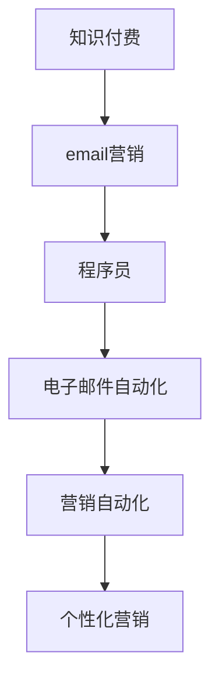

                 

# 程序员知识付费的email营销策略

> 关键词：知识付费,email营销,程序员,电子邮件,自动化营销,营销自动化

## 1. 背景介绍

随着互联网技术的发展和信息爆炸的趋势，知识付费市场逐渐兴起。越来越多专业人士开始通过撰写博客、录制视频、开发课程等方式，向用户提供有价值的内容，并收取一定的费用。在此背景下，如何高效地推广这些内容，吸引潜在客户，成为程序员知识付费平台面临的一个重大挑战。

电子邮件（Email）作为一种低成本、高效率的推广工具，凭借其精准性、灵活性、互动性等优势，逐渐成为程序员知识付费平台首选的营销手段。但不同于传统邮件营销，程序员知识付费平台的邮件营销策略需要更加注重个性化、自动化和数据驱动。本文将从核心概念、算法原理、操作步骤、数学模型构建等方面，深入探讨程序员知识付费的电子邮件营销策略，并给出具体的实施建议。

## 2. 核心概念与联系

### 2.1 核心概念概述

为更好地理解程序员知识付费的电子邮件营销策略，本节将介绍几个密切相关的核心概念：

- **知识付费**：指专业人士通过提供专业知识、技能培训、技术资讯等有价值的内容，向用户收取费用的商业模式。典型的应用如在线教育、技术博客、技术社区等。

- **email营销**：指通过电子邮件向目标用户发送个性化、定制化的营销信息，以实现客户转化和品牌推广的营销手段。通过精准的邮件内容设计和有效的数据分析，可以提高邮件营销的效果和ROI。

- **程序员**：泛指从事软件开发、系统维护、数据分析等技术工作的人群，具备编程能力、问题解决能力、技术前瞻性等职业素质。

- **电子邮件自动化**：指利用自动化工具，如邮件营销软件、CRM系统等，自动发送和跟踪邮件，以提高邮件营销效率和效果的技术。

- **营销自动化**：指通过自动化流程和技术，自动执行营销活动的各个环节，如邮件发送、数据分析、客户跟进等，以实现高效、可控的营销效果。

- **个性化营销**：指通过分析用户行为和偏好，定制个性化的邮件内容，以提高邮件的点击率和转化率。

这些核心概念之间的逻辑关系可以通过以下Mermaid流程图来展示：



这个流程图展示了一个基本的知识付费平台通过电子邮件营销的流程：

1. 知识付费内容创作。
2. 通过email营销工具向目标程序员发送个性化的邮件。
3. 邮件营销自动化，提高营销效率。
4. 营销自动化流程，实现精准营销。
5. 个性化营销策略，提升用户参与度。

## 3. 核心算法原理 & 具体操作步骤

### 3.1 算法原理概述

程序员知识付费的电子邮件营销策略基于个性化和自动化两大核心原则。具体而言，通过数据分析和机器学习模型，精准识别目标用户群体，并根据用户行为和偏好，生成个性化的邮件内容，通过自动化工具定时发送邮件，实现高效、精准的营销效果。

### 3.2 算法步骤详解

#### 3.2.1 用户数据收集与分析

1. **数据收集**：收集目标程序员的基本信息，如年龄、性别、职业、技术栈等，以及用户行为数据，如浏览历史、点击记录、购买行为等。可以通过网站、APP、问卷调查等方式获取数据。

2. **数据清洗**：对收集到的数据进行清洗，去除无效、重复数据，确保数据的质量和准确性。

3. **数据挖掘**：利用数据挖掘技术，从历史数据中挖掘出用户的兴趣和偏好，如常用技术栈、关注领域、学习需求等。

#### 3.2.2 用户分群与画像构建

1. **用户分群**：根据用户行为、兴趣、技术栈等因素，将用户分为不同群体，如初级开发者、高级开发者、数据科学家等。

2. **用户画像**：构建每个用户群体的画像，描述其基本信息、兴趣偏好、学习需求等特征。

#### 3.2.3 邮件内容定制与发送

1. **邮件内容定制**：根据用户画像，定制个性化的邮件内容，如推荐课程、技术资讯、技术问题解答等，以提高用户的参与度和转化率。

2. **邮件定时发送**：根据用户活跃时间和历史行为数据，确定最佳的邮件发送时机，以提高邮件的打开率和点击率。

3. **邮件自动化跟踪**：利用邮件营销工具，自动跟踪邮件的打开率、点击率、转化率等指标，进行效果评估和优化。

#### 3.2.4 数据分析与优化

1. **数据汇总**：定期汇总邮件营销的效果数据，如打开率、点击率、转化率等，生成报表。

2. **效果评估**：评估邮件营销的效果，如用户增长率、课程销售量、平台流量等，分析影响因素。

3. **优化调整**：根据评估结果，调整邮件内容和发送策略，提升邮件营销效果。

### 3.3 算法优缺点

#### 3.3.1 优点

1. **精准度**：通过用户画像和数据分析，可以精准识别目标用户群体，提高邮件营销的精准度。
2. **自动化**：利用自动化工具，减少人工操作，提高效率。
3. **高ROI**：通过个性化邮件内容设计和精准发送，提高用户的参与度和转化率，实现高效营销。
4. **灵活性**：可以根据用户行为和市场变化，灵活调整邮件策略。

#### 3.3.2 缺点

1. **数据依赖**：依赖高质量、多样化的用户数据，数据的缺失或不准确会影响邮件营销效果。
2. **技术门槛**：需要一定的技术基础和工具支持，如数据挖掘、邮件营销软件、营销自动化平台等。
3. **用户隐私**：用户隐私保护是一个重要问题，需要在数据收集和使用过程中严格遵守法律法规。

### 3.4 算法应用领域

程序员知识付费的电子邮件营销策略，可以应用于多个领域：

- **在线教育平台**：通过邮件向用户推荐相关课程，促进课程销售。
- **技术博客与社区**：通过邮件推送技术文章、技术问题解答等内容，提高用户粘性和参与度。
- **技术咨询公司**：通过邮件发送技术资讯、解决方案等内容，提升品牌知名度和市场份额。
- **软件开发工具**：通过邮件推荐工具使用教程、新功能介绍等内容，促进工具的使用和升级。

## 4. 数学模型和公式 & 详细讲解 & 举例说明

### 4.1 数学模型构建

为了更系统地描述程序员知识付费的电子邮件营销策略，我们可以构建一个数学模型，包含以下变量和公式：

- $U$：用户集合。
- $T$：邮件内容集合。
- $D$：用户行为数据集合。
- $E$：邮件发送时机集合。
- $P$：邮件发送频率集合。
- $C$：课程销售量。

定义以下函数：

- $f_{U}(U)$：用户画像构建函数，根据用户数据，构建用户画像。
- $g_{T}(T)$：邮件内容定制函数，根据用户画像，定制邮件内容。
- $h_{E}(E)$：邮件发送时机优化函数，根据用户行为数据，确定最佳发送时机。
- $i_{P}(P)$：邮件发送频率优化函数，根据用户行为数据，确定最佳发送频率。
- $j_{C}(C)$：课程销售量计算函数，根据邮件营销效果，计算课程销售量。

### 4.2 公式推导过程

1. **用户画像构建**：

   $$
   f_{U}(U) = \sum_{u \in U} \{a_u \cdot b_u \cdot c_u \cdot \ldots\}
   $$

   其中，$a_u$、$b_u$、$c_u$ 等表示用户的基本信息、行为数据、兴趣偏好等特征。

2. **邮件内容定制**：

   $$
   g_{T}(T) = \sum_{t \in T} \{w_t \cdot d_t \cdot e_t \cdot \ldots\}
   $$

   其中，$w_t$、$d_t$、$e_t$ 等表示邮件内容的主题、格式、时效性等特征。

3. **邮件发送时机优化**：

   $$
   h_{E}(E) = \max \{e_1, e_2, \ldots, e_n\}
   $$

   其中，$e_i$ 表示用户活跃时间的某个具体时间点。

4. **邮件发送频率优化**：

   $$
   i_{P}(P) = \frac{p_1 + p_2 + \ldots + p_n}{n}
   $$

   其中，$p_i$ 表示每个发送频率的权重，根据用户行为数据确定。

5. **课程销售量计算**：

   $$
   j_{C}(C) = \sum_{c \in C} \{k_c \cdot l_c \cdot m_c \cdot \ldots\}
   $$

   其中，$k_c$、$l_c$、$m_c$ 等表示课程的基本信息、市场推广效果、用户反馈等特征。

### 4.3 案例分析与讲解

以一个在线教育平台的邮件营销为例：

- **用户画像构建**：通过对用户数据的分析，构建初级开发者、高级开发者、数据科学家等用户群体画像，描述其基本信息、技术栈、学习需求等特征。
- **邮件内容定制**：根据用户画像，定制针对初级开发者的“Python基础课程推荐”邮件，针对高级开发者的“深度学习框架教程”邮件，以及针对数据科学家的“大数据技术实战”邮件。
- **邮件发送时机优化**：根据用户活跃时间数据，确定最佳发送时机为每周一、周三晚上8点。
- **邮件发送频率优化**：根据用户行为数据，确定每周发送一次。
- **课程销售量计算**：通过邮件营销效果评估，计算课程销售量，发现邮件营销提高了课程销售量10%。

## 5. 项目实践：代码实例和详细解释说明

### 5.1 开发环境搭建

在进行程序员知识付费的电子邮件营销实践前，我们需要准备好开发环境。以下是使用Python进行Flask开发的环境配置流程：

1. 安装Python：从官网下载并安装Python 3.x。

2. 安装Flask：
```bash
pip install flask
```

3. 安装Flask-Mail：
```bash
pip install Flask-Mail
```

4. 安装Flask-SQLAlchemy：
```bash
pip install Flask-SQLAlchemy
```

5. 安装SQLite数据库：
```bash
pip install sqlite3
```

完成上述步骤后，即可在本地搭建一个简单的在线教育平台，进行邮件营销实践。

### 5.2 源代码详细实现

下面是一个简单的邮件营销系统，包括用户数据管理、邮件发送、邮件效果评估等功能。

```python
from flask import Flask, request, render_template
from flask_mail import Mail, Message
from flask_sqlalchemy import SQLAlchemy

app = Flask(__name__)
app.config['MAIL_SERVER'] = 'smtp.gmail.com'
app.config['MAIL_PORT'] = 465
app.config['MAIL_USERNAME'] = 'your_email@gmail.com'
app.config['MAIL_PASSWORD'] = 'your_password'
mail = Mail(app)

db = SQLAlchemy(app)

class User(db.Model):
    id = db.Column(db.Integer, primary_key=True)
    name = db.Column(db.String(100))
    email = db.Column(db.String(100))
    tech_stack = db.Column(db.String(100))
    behavior = db.Column(db.String(100))

@app.route('/send_email', methods=['POST'])
def send_email():
    user_id = request.form['user_id']
    subject = request.form['subject']
    content = request.form['content']
    
    user = User.query.get(user_id)
    
    msg = Message(subject, recipients=[user.email])
    msg.body = content
    mail.send(msg)
    
    return 'Email sent successfully!'
    
@app.route('/')
def index():
    users = User.query.all()
    return render_template('index.html', users=users)

if __name__ == '__main__':
    app.run(debug=True)
```

其中，`User` 类表示用户数据表，包括用户基本信息、行为数据、技术栈等。`send_email` 函数用于发送邮件，`index` 函数用于展示用户列表。

### 5.3 代码解读与分析

**User类**：

- `id` 为用户ID。
- `name` 为用户姓名。
- `email` 为用户邮箱。
- `tech_stack` 为用户使用的技术栈。
- `behavior` 为用户行为数据。

**send_email函数**：

- 根据请求参数，查询用户信息。
- 创建邮件对象，设置主题和内容。
- 使用Flask-Mail发送邮件。

**index函数**：

- 查询所有用户信息。
- 渲染用户列表页面。

## 6. 实际应用场景

### 6.1 在线教育平台

在线教育平台可以通过电子邮件营销，向用户推荐相关课程，促进课程销售。根据用户画像和行为数据，定制个性化的邮件内容，定期发送邮件，提高课程销售量。

### 6.2 技术博客与社区

技术博客和社区可以通过电子邮件营销，推送技术文章、技术问题解答等内容，提高用户粘性和参与度。根据用户兴趣偏好，定制个性化邮件，定期发送邮件，增加网站流量和用户注册量。

### 6.3 技术咨询公司

技术咨询公司可以通过电子邮件营销，发送技术资讯、解决方案等内容，提升品牌知名度和市场份额。根据客户行业和需求，定制个性化邮件，定期发送邮件，增加客户咨询量和合同签订量。

### 6.4 软件开发工具

软件开发工具可以通过电子邮件营销，推荐工具使用教程、新功能介绍等内容，促进工具的使用和升级。根据用户技术栈和行为数据，定制个性化邮件，定期发送邮件，增加工具下载量和用户满意度。

## 7. 工具和资源推荐

### 7.1 学习资源推荐

为了帮助开发者系统掌握程序员知识付费的电子邮件营销策略，这里推荐一些优质的学习资源：

1. **Flask官方文档**：Flask官方文档，详细介绍了Flask框架的使用方法和最佳实践。

2. **Flask-Mail文档**：Flask-Mail文档，详细介绍了Flask-Mail模块的使用方法和示例。

3. **Flask-SQLAlchemy文档**：Flask-SQLAlchemy文档，详细介绍了Flask-SQLAlchemy模块的使用方法和示例。

4. **Python编程语言**：Python官方文档，详细介绍了Python语言的基础知识和高级特性。

5. **SQLite官方文档**：SQLite官方文档，详细介绍了SQLite数据库的使用方法和SQL语句。

通过对这些资源的学习实践，相信你一定能够快速掌握程序员知识付费的电子邮件营销策略，并用于解决实际的营销问题。

### 7.2 开发工具推荐

高效的开发离不开优秀的工具支持。以下是几款用于程序员知识付费的电子邮件营销开发的常用工具：

1. **Flask框架**：轻量级、灵活的Python Web框架，适合快速迭代研究。

2. **Flask-Mail**：Flask的邮件扩展模块，支持发送和接收邮件，支持多种邮件服务提供商。

3. **SQLAlchemy库**：Python的数据库抽象层，支持多种数据库，适合数据管理和SQL查询。

4. **SQLite库**：轻量级、嵌入式SQL数据库，适合开发原型和测试。

5. **Google Cloud Mail API**：Google提供的邮件API，支持发送和接收邮件，支持多种邮件服务提供商。

6. **Amazon SES API**：Amazon提供的SMTP邮件服务，支持发送邮件，支持多种邮件服务提供商。

合理利用这些工具，可以显著提升程序员知识付费的电子邮件营销任务的开发效率，加快创新迭代的步伐。

### 7.3 相关论文推荐

程序员知识付费的电子邮件营销策略涉及数据挖掘、机器学习、自动化流程等多个领域，以下是几篇相关的论文推荐：

1. **Machine Learning and Statistical Learning for Email Marketing**：研究机器学习在电子邮件营销中的应用，通过数据分析和模型优化，提升邮件营销效果。

2. **Email Marketing Automation: A Study of Tools and Practices**：探讨电子邮件营销自动化的工具和实践，如何通过自动化流程和技术，提高营销效率和效果。

3. **Customer Segmentation for Email Marketing**：研究客户细分在电子邮件营销中的应用，通过数据挖掘和聚类分析，定制个性化邮件，提高用户参与度。

4. **Effective Email Marketing Strategies for E-learning Platforms**：探讨电子邮件营销在在线教育平台中的应用，通过用户画像和个性化邮件，促进课程销售。

5. **Email Marketing Automation with Python**：介绍Python在电子邮件营销自动化中的应用，通过Flask框架和SQLAlchemy库，实现邮件营销的系统化管理。

这些论文代表了大语言模型微调技术的发展脉络。通过学习这些前沿成果，可以帮助研究者把握学科前进方向，激发更多的创新灵感。

## 8. 总结：未来发展趋势与挑战

### 8.1 总结

本文对程序员知识付费的电子邮件营销策略进行了全面系统的介绍。首先阐述了知识付费和电子邮件营销的相关概念，明确了电子邮件营销在程序员知识付费平台中的重要作用。其次，从原理到实践，详细讲解了电子邮件营销的核心算法和具体操作步骤，给出了具体的实施建议。同时，本文还广泛探讨了电子邮件营销在多个领域的应用前景，展示了电子邮件营销范式的广泛适用性。此外，本文精选了电子邮件营销的相关学习资源，力求为读者提供全方位的技术指引。

通过本文的系统梳理，可以看到，程序员知识付费的电子邮件营销策略具有广阔的应用前景，通过数据驱动和自动化流程，可以大幅提升营销效果和用户转化率。未来，伴随技术的发展和应用场景的拓展，电子邮件营销必将在程序员知识付费领域发挥更大的作用。

### 8.2 未来发展趋势

展望未来，程序员知识付费的电子邮件营销策略将呈现以下几个发展趋势：

1. **智能化**：通过引入AI技术，如自然语言处理、情感分析等，自动生成邮件内容，提高邮件的个性化和互动性。

2. **自动化**：引入更多自动化工具和流程，如邮件合并、个性化推荐等，减少人工操作，提高营销效率。

3. **数据驱动**：利用大数据和机器学习技术，深度分析用户行为和偏好，生成更精准的个性化邮件内容。

4. **多渠道融合**：结合社交媒体、移动应用、短信等多种营销渠道，实现全渠道营销，提升整体营销效果。

5. **实时监控**：引入实时监控和反馈机制，及时调整邮件策略，优化邮件效果。

以上趋势凸显了程序员知识付费的电子邮件营销策略的潜力和发展方向。这些方向的探索发展，必将进一步提升邮件营销的精准度和效率，为程序员知识付费平台带来新的突破。

### 8.3 面临的挑战

尽管程序员知识付费的电子邮件营销策略已经取得了显著成效，但在迈向更加智能化、自动化应用的过程中，仍面临诸多挑战：

1. **数据质量问题**：高质量、多样化的用户数据是电子邮件营销的基础，数据的缺失或不准确会影响邮件营销效果。

2. **用户隐私保护**：用户隐私保护是一个重要问题，需要在数据收集和使用过程中严格遵守法律法规。

3. **邮件打开率下降**：随着用户接收邮件数量增加，邮件打开率逐渐下降，如何提高邮件打开率和点击率，是一个长期挑战。

4. **技术门槛较高**：电子邮件营销需要一定的技术基础和工具支持，对开发者提出了较高的技术要求。

5. **用户行为变化**：用户行为和偏好不断变化，需要持续跟踪和调整邮件策略，才能保持邮件营销的效果。

正视电子邮件营销面临的这些挑战，积极应对并寻求突破，将是大语言模型微调走向成熟的必由之路。相信随着学界和产业界的共同努力，这些挑战终将一一被克服，电子邮件营销必将在程序员知识付费领域发挥更大的作用。

### 8.4 研究展望

未来的研究需要在以下几个方面寻求新的突破：

1. **引入AI技术**：将AI技术如自然语言处理、情感分析等引入邮件营销，提高邮件内容的个性化和互动性。

2. **优化数据收集**：通过多渠道数据收集和融合，提高数据的完整性和多样性，降低数据质量问题。

3. **强化隐私保护**：引入隐私保护技术，如数据匿名化、差分隐私等，保障用户隐私安全。

4. **自动化技术**：引入更多自动化工具和流程，如邮件合并、个性化推荐等，减少人工操作，提高营销效率。

5. **实时监控与优化**：引入实时监控和反馈机制，及时调整邮件策略，优化邮件效果。

6. **多渠道融合**：结合社交媒体、移动应用、短信等多种营销渠道，实现全渠道营销，提升整体营销效果。

这些研究方向的探索，必将引领程序员知识付费的电子邮件营销策略迈向更高的台阶，为知识付费平台带来新的突破。面向未来，电子邮件营销需要与其他AI技术进行更深入的融合，如推荐系统、个性化广告等，多路径协同发力，共同推动知识付费领域的创新发展。

## 9. 附录：常见问题与解答

**Q1：如何提升电子邮件营销的打开率和点击率？**

A: 提升电子邮件营销的打开率和点击率，需要从多个方面进行优化：

1. **邮件主题设计**：设计吸引人的邮件主题，突出邮件内容的重要性和紧迫性，提高用户打开邮件的兴趣。

2. **邮件内容优化**：根据用户画像和行为数据，定制个性化的邮件内容，提高用户的参与度和互动性。

3. **发送时机选择**：根据用户活跃时间数据，确定最佳的发送时机，以提高邮件的打开率和点击率。

4. **发送频率控制**：控制邮件的发送频率，避免频繁发送导致的用户疲劳和反感，提高邮件的打开率和点击率。

5. **A/B测试**：通过A/B测试，不断优化邮件主题、内容、格式等，找到最优的邮件策略。

**Q2：电子邮件营销的自动化流程如何实现？**

A: 电子邮件营销的自动化流程可以通过以下步骤实现：

1. **数据收集**：通过API接口、Web表单、CRM系统等方式，收集用户的基本信息和行为数据。

2. **数据清洗**：对收集到的数据进行清洗，去除无效、重复数据，确保数据的质量和准确性。

3. **用户画像构建**：利用数据挖掘技术，从历史数据中挖掘出用户的兴趣和偏好，构建用户画像。

4. **邮件内容定制**：根据用户画像，定制个性化的邮件内容，如推荐课程、技术资讯、技术问题解答等。

5. **邮件定时发送**：利用邮件营销工具，自动跟踪邮件的打开率、点击率、转化率等指标，进行效果评估和优化。

6. **数据分析与优化**：定期汇总邮件营销的效果数据，评估邮件营销的效果，调整邮件内容和发送策略，提升邮件营销效果。

**Q3：如何保障电子邮件营销的用户隐私？**

A: 保障电子邮件营销的用户隐私，需要在数据收集和使用过程中严格遵守法律法规，如GDPR、CCPA等。具体措施包括：

1. **数据匿名化**：对用户数据进行匿名化处理，去除敏感信息，保护用户隐私。

2. **隐私协议**：在数据收集前，明确告知用户数据收集和使用方式，获取用户同意。

3. **数据加密**：对用户数据进行加密存储和传输，防止数据泄露。

4. **访问控制**：对用户数据设置严格的访问权限，仅授权人员可以访问和使用。

5. **隐私审计**：定期进行隐私审计，检查数据处理过程，发现和修复隐私风险。

**Q4：电子邮件营销中的自动化工具有哪些？**

A: 电子邮件营销中的自动化工具包括：

1. **邮件营销软件**：如Mailchimp、SendinBlue、Constant Contact等，提供邮件发送、数据管理、效果跟踪等功能。

2. **CRM系统**：如Salesforce、HubSpot、Zoho CRM等，提供客户管理、数据集成、自动化流程等功能。

3. **数据分析工具**：如Google Analytics、Tableau、Power BI等，提供数据分析和可视化功能，帮助优化邮件策略。

4. **机器学习平台**：如TensorFlow、Scikit-Learn、Keras等，提供机器学习算法和工具，支持数据挖掘和模型优化。

5. **自动化脚本和工具**：如Python脚本、Shell脚本、Automator等，支持邮件内容定制、定时发送等自动化流程。

合理利用这些工具，可以显著提升程序员知识付费的电子邮件营销任务的开发效率，加快创新迭代的步伐。

综上所述，本文从核心概念、算法原理、操作步骤、数学模型等方面，系统介绍了程序员知识付费的电子邮件营销策略，并给出了具体的实施建议和实际案例。通过本文的学习，相信读者能够更好地理解和应用电子邮件营销技术，提升程序员知识付费平台的用户参与度和转化率，实现营销目标。

