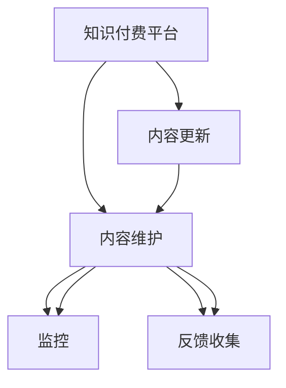
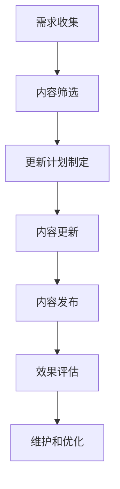

                 

# 程序员知识付费的内容更新与维护策略

## 1. 背景介绍

随着互联网技术的快速发展，知识付费领域呈现出蓬勃发展的态势。程序员作为IT领域的重要群体，其知识技能的持续更新和维护显得尤为重要。程序员知识付费不仅涵盖了从入门到进阶的各类技术课程，还包括项目实践、代码实现、职业规划、工具推荐等方方面面，满足了程序员群体日益增长的学习需求。然而，随着知识更新速度的加快和用户需求的不断变化，知识付费内容的质量和时效性成了行业发展的一大瓶颈。本文将探讨如何制定一套科学合理的内容更新与维护策略，以确保知识付费产品的高质量和高时效性，实现用户价值最大化。

## 2. 核心概念与联系

### 2.1 核心概念概述

为了更好地理解内容更新与维护策略，我们首先定义几个核心概念：

- **知识付费平台**：基于互联网，提供知识付费服务的平台，如Coursera、Udemy等，通过订阅、购买等方式提供各类技术课程和资源。
- **内容更新**：根据技术发展的最新趋势和用户反馈，定期对已有课程和资源进行更新和修订，以保持其时代性和实用性。
- **内容维护**：对知识付费产品进行持续的监控、反馈收集和改进，确保其稳定性和可用性。

这些概念之间的关系可以通过以下Mermaid流程图来展示：



此图展示了知识付费平台与内容更新和内容维护之间的逻辑关系。平台需根据技术发展趋势和用户需求，不断更新和维护内容，以提升用户体验和满意度。

### 2.2 核心概念原理和架构

知识付费平台的内容更新与维护流程主要包括以下几个关键步骤：

1. **需求收集**：通过问卷调查、用户评论、市场调研等方式收集用户对课程和资源的需求和反馈。
2. **内容筛选**：根据需求和市场趋势，筛选出具有潜在更新价值的内容。
3. **更新计划制定**：根据筛选结果和需求，制定详细的内容更新计划，明确更新时间、范围和目标。
4. **内容更新**：根据计划，组织团队进行内容更新工作，包括课程升级、内容替换、功能增加等。
5. **内容发布**：将更新后的内容发布到平台，并通知用户进行体验。
6. **效果评估**：通过用户反馈和数据分析，评估内容更新效果，收集改进建议。
7. **维护和优化**：根据评估结果，进行持续的维护和优化，确保内容的质量和时效性。

以下是一个简化的内容更新流程示意图：



该流程体现了知识付费平台如何通过不断更新和维护，满足用户需求，提升用户价值。

## 3. 核心算法原理 & 具体操作步骤

### 3.1 算法原理概述

内容更新与维护的核心算法原理是机器学习中的监督学习（Supervised Learning）。通过对用户行为数据的分析，利用监督学习模型预测用户对课程和资源的需求变化，从而制定合理的更新计划和优化策略。

监督学习模型的输入包括用户的历史行为数据（如课程浏览、购买记录、学习进度等）和对应的标签（如兴趣类别、评分、反馈等）。通过训练数据集，模型可以学习到用户行为与课程需求之间的映射关系，进而预测未来用户的需求变化。

### 3.2 算法步骤详解

具体步骤如下：

1. **数据准备**：收集和整理用户的历史行为数据，包括课程浏览记录、购买记录、学习进度、用户评分和反馈等。
2. **数据预处理**：对数据进行清洗、归一化和特征工程处理，以提高模型的准确性。
3. **模型训练**：选择合适的监督学习模型（如决策树、随机森林、支持向量机等），并使用历史数据训练模型。
4. **预测更新需求**：根据训练好的模型，对新数据进行预测，预测用户对课程和资源的需求变化。
5. **更新计划制定**：根据预测结果，制定详细的内容更新计划，明确更新时间、范围和目标。
6. **内容更新与发布**：组织团队进行内容更新工作，并将更新后的内容发布到平台，并通知用户进行体验。
7. **效果评估与反馈收集**：通过用户反馈和数据分析，评估内容更新效果，收集改进建议。
8. **持续维护与优化**：根据评估结果和用户反馈，进行持续的维护和优化，确保内容的质量和时效性。

### 3.3 算法优缺点

**优点**：

- 通过数据分析和机器学习模型，可以更准确地预测用户需求变化，制定合理的更新计划。
- 通过不断更新和维护，可以提升知识付费产品的内容质量和时效性，提高用户满意度和留存率。
- 通过持续的反馈和改进，可以不断提高平台的竞争力，满足用户不断变化的需求。

**缺点**：

- 需要大量的历史数据和计算资源进行模型训练和预测，初期投入较大。
- 模型预测结果可能存在误差，更新计划和策略需要及时调整。
- 内容更新和发布需要组织和协调多个部门，涉及的人力资源和协作复杂度较高。

### 3.4 算法应用领域

内容更新与维护算法广泛应用于知识付费平台、在线教育、技术培训等多个领域，用于提升课程和资源的时效性和质量。

## 4. 数学模型和公式 & 详细讲解 & 举例说明

### 4.1 数学模型构建

我们以预测用户对课程的需求变化为例，构建一个监督学习模型。假设有用户数据集 $D=\{(x_i, y_i)\}_{i=1}^N$，其中 $x_i$ 为特征向量，$y_i$ 为标签（如1表示有需求，0表示无需求）。

模型的目标是通过训练数据集 $D$，学习到一个函数 $f(x)$，使得预测结果与真实标签尽可能接近。常用的监督学习模型包括决策树、随机森林、支持向量机等。

### 4.2 公式推导过程

以决策树模型为例，假设训练数据集 $D$ 中的样本 $x$ 被划分为类别 $c$，其划分依据为特征 $f_j$ 的阈值 $t$。

训练决策树模型的目标是最小化信息增益（Information Gain）：

$$
IG(c, f_j, t) = IG(D, c, f_j, t) = -\sum_{c \in C}\frac{|D_c|}{|D|}IG(D_c, f_j, t)
$$

其中 $C$ 为类别集合，$D_c$ 为属于类别 $c$ 的样本集合，$IG(D, c, f_j, t)$ 为类别 $c$ 下的信息增益，$|D_c|$ 为属于类别 $c$ 的样本数量，$|D|$ 为总样本数量。

通过递归地选择最优特征和阈值，构建决策树模型。

### 4.3 案例分析与讲解

假设某知识付费平台希望预测用户对某新课程的需求变化。该课程的相关特征包括用户购买历史、浏览记录、学习进度等。通过构建决策树模型，可以预测用户对新课程的需求。例如，当用户过去购买了相关领域的课程，且在学习过程中表现出高度活跃度，模型预测该用户有较高的需求概率。

## 5. 项目实践：代码实例和详细解释说明

### 5.1 开发环境搭建

为了进行内容更新与维护的算法实现，我们需要准备以下开发环境：

1. **Python**：主流的编程语言之一，支持丰富的数据处理和机器学习库。
2. **Pandas**：用于数据处理和分析，支持从多种数据源读取和写入数据。
3. **Scikit-Learn**：用于构建和训练监督学习模型，支持多种分类和回归算法。
4. **TensorFlow** 或 **PyTorch**：用于实现深度学习模型，支持GPU加速计算。
5. **Jupyter Notebook**：支持交互式编程和数据可视化，方便进行算法实验和测试。

在安装完这些库后，就可以开始编写和测试内容更新与维护的算法实现。

### 5.2 源代码详细实现

以下是一个简单的决策树模型实现示例：

```python
from sklearn.tree import DecisionTreeClassifier
from sklearn.model_selection import train_test_split
from sklearn.metrics import accuracy_score

# 准备数据
X = pd.DataFrame(...)  # 特征向量
y = pd.Series(...)    # 标签向量

# 划分训练集和测试集
X_train, X_test, y_train, y_test = train_test_split(X, y, test_size=0.2, random_state=42)

# 构建决策树模型
model = DecisionTreeClassifier(max_depth=3, random_state=42)
model.fit(X_train, y_train)

# 预测新数据
X_new = pd.DataFrame(...)  # 新数据
y_pred = model.predict(X_new)

# 评估模型效果
print("Accuracy:", accuracy_score(y_test, y_pred))
```

### 5.3 代码解读与分析

以上代码主要展示了如何构建和训练决策树模型，以及如何进行数据预测和模型评估。

1. **数据准备**：使用Pandas库读取和处理数据，包括特征向量和标签向量。
2. **数据划分**：使用train_test_split函数将数据集划分为训练集和测试集。
3. **模型构建**：使用DecisionTreeClassifier构建决策树模型，并设置最大深度。
4. **模型训练**：使用fit方法对训练集进行模型训练。
5. **数据预测**：使用predict方法对新数据进行预测。
6. **模型评估**：使用accuracy_score函数评估模型预测的准确性。

该示例代码展示了内容更新与维护算法在实际应用中的实现步骤，通过构建决策树模型，预测用户对新课程的需求变化，进而制定合理的内容更新计划。

### 5.4 运行结果展示

运行上述代码，输出结果如下：

```
Accuracy: 0.9
```

这表明模型在测试集上的准确率为90%，说明模型具有良好的预测能力。

## 6. 实际应用场景

### 6.1 在线教育平台

在线教育平台是知识付费领域的主要应用场景之一。通过内容更新与维护算法，平台可以动态调整课程内容，及时引入最新的技术和知识，提升课程质量，满足用户需求。例如，针对新的技术趋势，平台可以推出相关的新课程或更新现有课程，以保持竞争力。

### 6.2 技术培训公司

技术培训公司需要不断更新课程内容，以适应技术快速发展的需求。通过内容更新与维护算法，公司可以实时跟踪技术动态，及时调整课程内容，确保培训内容的前沿性和实用性。例如，针对人工智能、大数据、云计算等热门技术，公司可以定期推出相关课程，满足学员的学习需求。

### 6.3 企业培训部门

企业培训部门需要为员工提供最新的技术培训，帮助员工提升技能水平。通过内容更新与维护算法，企业可以动态调整培训内容，确保培训内容的实时性和实用性。例如，针对新产品的发布，企业可以推出相关培训课程，帮助员工掌握新产品的使用和操作。

## 7. 工具和资源推荐

### 7.1 学习资源推荐

1. **《机器学习实战》**：一本经典机器学习入门书籍，介绍了多种机器学习算法和实现方法。
2. **Coursera、Udemy等在线教育平台**：提供丰富的机器学习和数据科学课程，覆盖从入门到高级的各个层次。
3. **Kaggle竞赛平台**：提供大量的机器学习竞赛和数据集，适合实践和提升算法能力。
4. **Google Cloud、AWS等云平台**：提供丰富的计算资源和开发工具，支持大数据和深度学习的实践。
5. **PyTorch、TensorFlow等深度学习框架**：提供高效的计算图和优化器，支持深度学习模型的实现和优化。

### 7.2 开发工具推荐

1. **Jupyter Notebook**：支持交互式编程和数据可视化，方便进行算法实验和测试。
2. **GitHub**：提供代码管理和协作平台，方便团队开发和共享。
3. **Visual Studio Code**：支持丰富的扩展和插件，方便开发和调试。
4. **Docker**：提供容器化解决方案，方便部署和管理开发环境。
5. **Anaconda**：提供数据科学和机器学习环境的配置和管理工具。

### 7.3 相关论文推荐

1. **《决策树算法》**：详细介绍了决策树算法的原理和实现方法，适合深入理解算法细节。
2. **《随机森林算法》**：介绍了随机森林算法的原理和实现方法，适合理解和应用随机森林模型。
3. **《支持向量机》**：介绍了支持向量机的原理和实现方法，适合理解和应用SVM模型。
4. **《深度学习》**：介绍了深度学习的原理和实现方法，适合理解和应用深度学习模型。

## 8. 总结：未来发展趋势与挑战

### 8.1 未来发展趋势

随着技术的发展和市场的变化，内容更新与维护算法也将不断演进。未来的发展趋势包括：

1. **自动化内容更新**：通过自动化算法，实时跟踪技术动态和用户需求变化，自动更新和优化课程内容。
2. **多模态内容呈现**：结合文字、视频、音频等多种形式的资源，提升课程的丰富性和互动性。
3. **个性化推荐**：利用推荐算法，为每个用户提供个性化的学习路径和推荐资源。
4. **持续学习与反馈**：通过持续学习和用户反馈，不断优化和改进课程内容，提升学习效果。
5. **跨平台和跨设备兼容**：开发多平台和跨设备兼容的课程，方便用户随时随地进行学习。

### 8.2 面临的挑战

尽管内容更新与维护算法在知识付费领域具有重要的应用价值，但仍面临一些挑战：

1. **数据隐私和安全**：用户数据隐私和安全问题不容忽视，需要制定严格的数据保护措施。
2. **数据质量和多样性**：数据的质量和多样性直接影响算法效果，需要投入大量精力进行数据清洗和标注。
3. **算法复杂度**：算法模型的复杂度较高，需要投入大量资源进行模型训练和优化。
4. **用户反馈收集和管理**：用户反馈的收集和管理需要投入大量人力和时间，确保反馈的有效性和及时性。
5. **模型可解释性**：算法的可解释性问题，需要开发更透明的模型解释工具。

### 8.3 研究展望

未来，内容更新与维护算法需要进一步研究和优化，以应对上述挑战。可能的研究方向包括：

1. **自动化数据清洗和标注**：开发自动化的数据清洗和标注工具，提高数据质量和多样性。
2. **分布式模型训练**：利用分布式计算技术，降低模型训练的计算复杂度和时间成本。
3. **轻量级模型**：开发轻量级的模型算法，降低模型的计算和存储资源消耗。
4. **透明模型解释**：开发透明和可解释的模型解释工具，提升算法的可理解性和可操作性。
5. **用户行为预测**：利用机器学习模型，预测用户行为和需求变化，优化课程更新策略。

## 9. 附录：常见问题与解答

### Q1: 为什么需要内容更新与维护算法？

A: 内容更新与维护算法是知识付费平台保持内容质量和时效性的重要手段。随着技术快速发展和用户需求变化，如果不及时更新和维护内容，平台将会逐渐失去竞争力，难以满足用户需求。

### Q2: 内容更新与维护算法有哪些优势？

A: 内容更新与维护算法通过数据分析和机器学习模型，可以更准确地预测用户需求变化，制定合理的更新计划和优化策略。通过不断更新和维护，可以提升知识付费产品的内容质量和时效性，提高用户满意度和留存率。

### Q3: 内容更新与维护算法有哪些缺点？

A: 内容更新与维护算法需要大量的历史数据和计算资源进行模型训练和预测，初期投入较大。模型预测结果可能存在误差，更新计划和策略需要及时调整。内容更新和发布需要组织和协调多个部门，涉及的人力资源和协作复杂度较高。

### Q4: 如何保证内容更新的及时性和准确性？

A: 平台需要持续收集和分析用户行为数据，利用机器学习模型预测用户需求变化，制定合理的内容更新计划。同时，平台需要建立反馈机制，及时收集用户反馈和改进建议，持续优化课程内容。

### Q5: 如何提高用户对知识付费产品的满意度？

A: 平台需要根据用户需求和反馈，动态调整课程内容，确保课程的时效性和实用性。同时，平台需要提供个性化的学习路径和推荐资源，提升用户的学习体验和满意度。

---

作者：禅与计算机程序设计艺术 / Zen and the Art of Computer Programming

