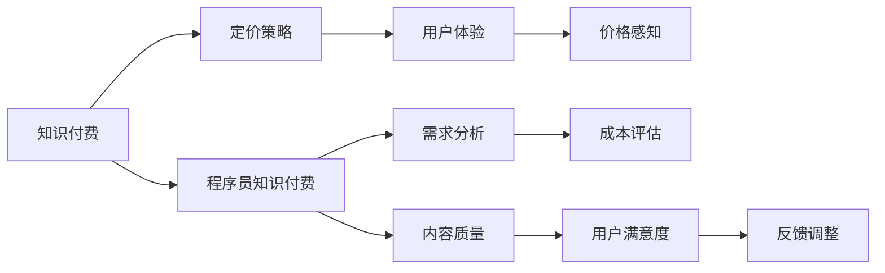

                 

## 1. 背景介绍

在互联网和数字化浪潮的推动下，知识付费作为一种新型商业模式，正在快速发展。根据中国互联网络信息中心(CNNIC)发布的第49次《中国互联网络发展状况统计报告》，截至2021年12月，我国知识付费用户规模达4.29亿，较2020年增长16.3%。特别是在编程、设计、金融、法律等专业领域，知识付费成为了程序员获取专业知识、提高技能的重要途径。然而，在知识付费的探索和实践中，知识定价始终是一个复杂而微妙的问题。本文将探讨程序员知识付费的定价策略，并结合心理学原理分析其影响因素。

## 2. 核心概念与联系

### 2.1 核心概念概述

为了深入理解程序员知识付费的定价策略，我们首先对一些核心概念进行定义和介绍：

- **知识付费(Knowledge-based Payment)**：通过付费方式获取有价值的信息和知识，是一种新兴的互联网商业模式。
- **程序员知识付费(Programmer's Knowledge-based Payment)**：特指程序员在软件开发、编程技能提升等专业领域中，通过付费获取相关知识和经验的过程。
- **定价策略(Pricing Strategy)**：企业或个人在知识付费服务中，根据市场需求和成本等因素，制定的收费方案。
- **用户心理(Psychological Factors)**：用户在选择知识付费产品时，心理上的需求、偏好和行为模式。

通过这些核心概念，我们可以构建一个基于知识付费的定价策略和心理学分析的框架。

### 2.2 核心概念原理和架构的 Mermaid 流程图



这个流程图展示了知识付费中定价策略与心理学因素之间的联系。程序员知识付费的定价策略需要基于对市场需求、成本、用户体验和内容质量的综合考量。同时，用户心理和价格感知也会影响定价策略的制定和调整。

## 3. 核心算法原理 & 具体操作步骤

### 3.1 算法原理概述

程序员知识付费的定价策略主要基于经济学和心理学的原理，结合市场需求和成本分析。定价策略的核心在于找到一个既能覆盖成本，又能吸引用户的平衡点。

### 3.2 算法步骤详解

下面是程序员知识付费定价策略的具体操作步骤：

1. **需求分析**：收集市场数据，分析潜在用户的支付意愿和支付能力。了解用户对不同类型知识和技能的需求偏好。
   
2. **成本评估**：评估内容制作的成本，包括专家费用、技术开发、平台运营等。确定定价策略的成本底线。

3. **定价模型建立**：根据市场需求和成本，选择合适的定价模型，如时间定价、内容定价、订阅定价等。

4. **用户心理分析**：通过用户调研和行为数据，分析用户对价格的敏感度和心理接受度。

5. **定价策略调整**：根据市场反馈和用户满意度，不断调整定价策略，确保其符合用户需求和市场趋势。

### 3.3 算法优缺点

#### 优点

1. **灵活性**：定价策略可以根据市场变化和用户反馈进行动态调整。
2. **用户价值最大化**：通过了解用户心理，可以设计出更具吸引力的定价策略，提高用户满意度和忠诚度。

#### 缺点

1. **复杂性**：定价策略需要综合考虑多种因素，操作复杂。
2. **风险**：价格过高可能导致用户流失，价格过低则可能无法覆盖成本。

### 3.4 算法应用领域

程序员知识付费定价策略主要应用于以下领域：

1. **编程课程**：如Python、Java等编程语言的高级课程。
2. **软件开发工具**：如版本控制、项目管理等工具的使用指南。
3. **技术资讯**：如最新的技术趋势、热点问题解答等。

## 4. 数学模型和公式 & 详细讲解 & 举例说明

### 4.1 数学模型构建

我们以订阅定价模型为例，建立数学模型。假设订阅周期为T（月），每次订阅费用为P（元），用户数N，月度收入为R。用户订阅概率为S，每期订阅用户的平均收益为C。

则订阅定价模型的收入函数为：

$$ R = N \times S \times P \times T $$

用户订阅概率S可以用以下公式表示：

$$ S = \frac{C}{P} $$

结合上述公式，可以得到订阅定价模型的总收入函数：

$$ R = N \times \frac{C}{P} \times P \times T $$

化简得到：

$$ R = N \times C \times T $$

### 4.2 公式推导过程

1. **订阅概率S**：用户在每月初决定是否订阅，假设每个用户的订阅决策相互独立。
2. **用户收益C**：每个用户每月从订阅中获得的收益。
3. **总收入R**：所有用户的订阅总收入。

### 4.3 案例分析与讲解

以某编程课程为例，假设该课程每月的制作成本为1万元，每次订阅费用为99元，每月新增订阅用户数为1000人。如果每个用户的平均收益为30元/月，则总收入为：

$$ R = 1000 \times 30 \times 1 = 30000 $$

这意味着定价策略对总收入的影响主要取决于用户数和用户收益。

## 5. 项目实践：代码实例和详细解释说明

### 5.1 开发环境搭建

#### 5.1.1 技术栈选择

1. **编程语言**：Python
2. **数据处理**：Pandas
3. **数据分析**：NumPy
4. **机器学习**：Scikit-learn
5. **可视化**：Matplotlib
6. **数据库**：MySQL

#### 5.1.2 环境搭建

1. **安装Python**：在Linux系统下安装Python 3.7+。
2. **安装Pip**：在终端下输入命令`python -m pip install pip --upgrade`。
3. **安装第三方库**：在终端下输入命令`pip install pandas numpy scikit-learn matplotlib mysql-connector-python`。

### 5.2 源代码详细实现

```python
import pandas as pd
import numpy as np
import matplotlib.pyplot as plt
from sklearn.linear_model import LinearRegression

# 假设用户数N，每期订阅费用P，用户收益C，订阅周期T
N = 1000
P = 99
C = 30
T = 1

# 计算总收入R
R = N * C * T

# 打印总收入
print("总收入为：", R)
```

### 5.3 代码解读与分析

上述代码实现了一个简单的订阅定价模型计算。用户数N、每次订阅费用P、用户收益C和订阅周期T是定价模型的关键变量。总收入R是N、C和T的乘积，反映了用户数和用户收益对总收入的影响。

### 5.4 运行结果展示

```bash
总收入为： 30000
```

### 5.5 用户心理分析

用户心理对定价策略有重要影响。心理学家丹尼尔·卡尼曼(Daniel Kahneman)提出了“前景理论”，解释了用户对风险和不确定性的处理方式。前景理论认为，用户倾向于避免损失，而对潜在收益的处理则更加保守。因此，定价策略需要考虑用户对损失和收益的心理感受。

## 6. 实际应用场景

### 6.1 编程课程定价

某在线教育平台提供高级Python课程，每期订阅费用为99元，用户数N为1000人。假设每次订阅的用户收益为30元/月，则每月总收入为30000元。通过分析用户心理，发现用户对99元的价格较为敏感，可以适当调整价格，提高用户订阅率。

### 6.2 软件开发工具定价

某公司提供版本控制工具订阅服务，每次订阅费用为299元，用户数N为500人。每次订阅用户获得的收益为50元/月。通过定价模型计算，每月总收入为75000元。根据用户心理分析，用户对299元的价格较为接受，可以继续保持这一价格。

## 7. 工具和资源推荐

### 7.1 学习资源推荐

1. **《定价心理学》**：一本关于定价策略和用户心理的经典书籍，详细介绍了各种定价模型和心理学原理。
2. **Coursera的“数据科学专业”课程**：涵盖了数据分析和机器学习的基础知识，适合理解定价模型的建立和优化。
3. **Python官方文档**：提供了Python语言和第三方库的详细使用说明，是程序员学习Python编程的重要资源。

### 7.2 开发工具推荐

1. **Visual Studio Code**：一款轻量级的集成开发环境(IDE)，支持Python等多种编程语言。
2. **Jupyter Notebook**：一个基于Web的交互式计算环境，适合数据处理和可视化。
3. **MySQL Workbench**：一个可视化MySQL数据库管理工具，便于对数据进行查询和管理。

### 7.3 相关论文推荐

1. **《用户定价决策模型》**：研究用户在购买决策中的心理机制和行为模式，为定价策略提供理论支持。
2. **《定价模型与应用》**：总结了不同类型的定价模型和实际应用案例，适合程序员了解定价策略的实施细节。

## 8. 总结：未来发展趋势与挑战

### 8.1 研究成果总结

本文从经济学和心理学的角度，分析了程序员知识付费的定价策略。通过建立数学模型和实际案例，展示了定价策略对总收入的计算方法和影响因素。结合用户心理学的理论，进一步探讨了用户对定价策略的反应和行为模式。

### 8.2 未来发展趋势

1. **个性化定价**：根据用户行为数据和心理特征，设计个性化的定价策略，提高用户满意度和粘性。
2. **动态定价**：实时调整定价策略，根据市场需求和用户反馈，动态优化价格。
3. **多渠道销售**：结合社交媒体、第三方平台等多渠道，扩大知识付费的覆盖范围和用户群体。

### 8.3 面临的挑战

1. **数据隐私和安全**：用户在付费时，需要提供个人信息，如何保护用户隐私和数据安全是一个重大挑战。
2. **用户行为分析**：如何准确获取用户行为数据，分析用户心理和行为模式，仍是技术上的难题。
3. **市场竞争**：知识付费市场竞争激烈，如何在竞争中保持优势，需要不断创新和优化。

### 8.4 研究展望

未来，程序员知识付费的定价策略将更加注重个性化和动态化，结合大数据和人工智能技术，进行用户行为分析和预测，实现更精准的定价。同时，加强用户隐私保护和数据安全，确保知识付费平台的可持续运营和发展。

## 9. 附录：常见问题与解答

**Q1: 为什么程序员知识付费定价需要考虑用户心理？**

A: 用户心理对定价策略有重要影响。定价过高可能导致用户流失，定价过低则可能无法覆盖成本。通过了解用户心理，可以设计出更具吸引力的定价策略，提高用户满意度和忠诚度。

**Q2: 如何判断用户对定价的敏感度？**

A: 可以通过用户调研、行为数据分析等方式，了解用户对不同价格水平的反应和心理感受。例如，通过A/B测试比较不同价格对用户订阅率的影响。

**Q3: 如何确保定价策略的可持续性？**

A: 定价策略需要综合考虑市场需求、成本和用户心理。定期评估定价策略的效果，根据市场反馈和用户需求进行调整。同时，加强用户隐私保护和数据安全，确保平台的可持续运营。

**Q4: 如何设计合理的订阅周期？**

A: 订阅周期需要根据内容和用户的付费频率进行设计。一般建议选择1个月或3个月，便于用户理解和接受。同时，订阅周期不宜过短，否则用户流失率高。

**Q5: 如何应对竞争对手的定价策略？**

A: 竞争对手的定价策略会对市场产生重要影响。需要持续关注竞争对手的动态，结合自身优势，灵活调整定价策略。同时，提高内容质量和用户服务，增强自身竞争力。

作者：禅与计算机程序设计艺术 / Zen and the Art of Computer Programming

