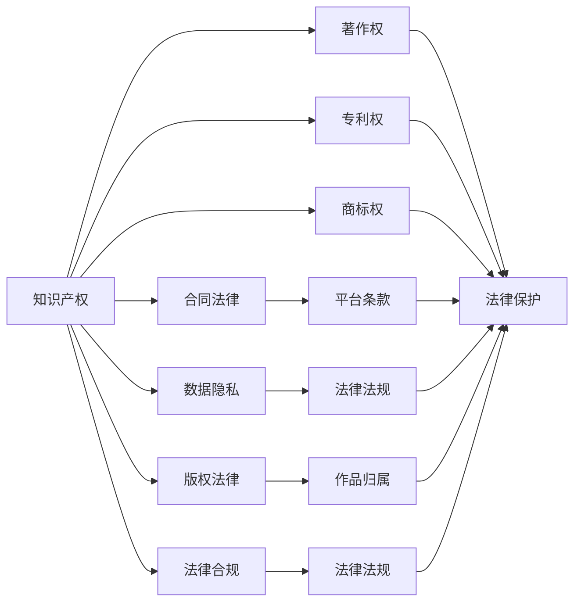

                 

# 程序员知识付费的法律风险防范

在数字经济快速发展的今天，程序员作为信息技术的核心人才，其在知识付费平台上的活跃度日益提高。然而，知识付费市场的火爆也带来了不少法律风险，特别是对于程序员而言，面临的法律风险更加复杂和严峻。本文将从背景介绍、核心概念与联系、核心算法原理与操作步骤、数学模型和公式推导、项目实践、实际应用场景、工具和资源推荐、总结、未来发展趋势与挑战以及附录等多个角度，全面解析程序员在知识付费平台上的法律风险，并提供有效的风险防范措施。

## 1. 背景介绍

### 1.1 问题由来
随着互联网技术的不断发展，知识付费平台成为越来越多用户获取知识和技能的重要渠道。程序员作为软件开发、人工智能、数据科学等领域的专业人才，其知识和技能在知识付费市场上有极高的需求。程序员在知识付费平台上提供内容，一方面可以获得收入，另一方面也能提升自身影响力，实现知识变现。

然而，知识付费平台的多样化和复杂化，也给程序员带来了诸多法律风险。这些风险不仅包括知识产权纠纷、合同纠纷等传统问题，还包括数据隐私保护、版权保护等新兴问题。程序员在提供内容时，如果不能充分理解相关法律知识，很容易陷入法律纠纷中，不仅影响自身利益，还可能对知识付费平台带来负面影响。

### 1.2 问题核心关键点
程序员在知识付费平台上面临的法律风险主要包括以下几个方面：
1. **知识产权风险**：程序员在创作和传播知识时，可能涉及原作者版权、商业机密等问题。
2. **合同风险**：知识付费平台和程序员之间签订的合同条款可能存在不公平或不明确的问题，导致利益冲突。
3. **数据隐私风险**：程序员在平台上提供技术支持或数据分析时，可能涉及用户数据的隐私保护问题。
4. **版权风险**：程序员创作的内容可能涉及作品版权归属、改编权等问题。
5. **法律合规风险**：程序员创作内容时，需要遵守相关法律法规，如互联网信息服务管理办法、网络安全法等。

了解这些核心关键点，有助于程序员在知识付费平台上更好地识别和防范法律风险。

## 2. 核心概念与联系

### 2.1 核心概念概述
程序员在知识付费平台上进行内容创作时，涉及到以下核心概念：

- **知识产权**：包括著作权、专利权、商标权等，保护创作者对知识成果的合法权益。
- **合同法律**：程序员与知识付费平台之间的合同条款，规定双方的权利和义务。
- **数据隐私**：用户数据的收集、使用、存储和传输过程中，需要遵守相关法律法规和行业标准，确保用户隐私保护。
- **版权法律**：涉及作品的创作、发行、使用等方面的法律法规。
- **法律合规**：程序员创作内容时，需要遵守相关法律法规，如互联网信息服务管理办法、网络安全法等。

这些概念相互关联，共同构成了程序员在知识付费平台上进行内容创作的法律框架。

### 2.2 核心概念原理和架构的 Mermaid 流程图


## 3. 核心算法原理 & 具体操作步骤
### 3.1 算法原理概述
程序员在知识付费平台上进行内容创作时，需要遵循以下算法原理：

- **算法一：内容创作算法**：根据用户需求和反馈，创作符合用户期望的内容。
- **算法二：风险评估算法**：评估内容创作过程中可能面临的法律风险，及时进行调整和优化。
- **算法三：风险防范算法**：制定和实施有效的风险防范措施，确保内容创作的合法合规。

这些算法共同作用，确保程序员在知识付费平台上进行内容创作时，能够有效防范法律风险。

### 3.2 算法步骤详解
1. **内容创作阶段**：
   - 确定创作主题和目标受众，确保内容具有针对性和实用性。
   - 制定内容创作计划，合理分配时间和精力。
   - 创作内容时，严格遵守相关法律法规，避免侵犯他人权益。

2. **风险评估阶段**：
   - 识别内容创作过程中可能涉及的法律风险，如版权侵权、数据隐私泄露等。
   - 评估风险的严重程度和影响范围，制定相应的防范措施。
   - 定期检查和更新风险评估模型，确保其有效性和及时性。

3. **风险防范阶段**：
   - 制定和实施风险防范措施，如签署保密协议、使用数据加密技术等。
   - 加强与知识付费平台的沟通和合作，建立良好的法律关系。
   - 定期进行法律培训，提升程序员的法律意识和能力。

### 3.3 算法优缺点
- **优点**：
  - 帮助程序员识别和防范法律风险，确保内容创作的合法合规。
  - 通过风险评估和风险防范，提升程序员在知识付费平台上的竞争力和影响力。
  - 加强与知识付费平台的沟通和合作，建立良好的法律关系。

- **缺点**：
  - 可能存在误判风险，导致不必要的防范措施影响创作效率。
  - 需要程序员具备较高的法律素养和风险管理能力。
  - 风险防范措施需要持续更新和优化，增加额外的工作量。

### 3.4 算法应用领域
这些算法不仅适用于知识付费平台，还适用于其他互联网平台、在线教育平台、软件开发平台等。程序员在上述平台进行内容创作时，同样需要遵循相关算法原理和操作步骤，确保内容的合法合规。

## 4. 数学模型和公式 & 详细讲解 & 举例说明
### 4.1 数学模型构建
- **算法一：内容创作算法**：
  $$
  f_{创作} = \sum_{i=1}^{n} w_i \times \text{函数}_{创作}(x_i)
  $$
  其中，$f_{创作}$ 为内容创作模型，$w_i$ 为各因素的权重，$x_i$ 为影响内容创作的因素。

- **算法二：风险评估算法**：
  $$
  R_{评估} = \sum_{i=1}^{m} w_i \times \text{函数}_{风险评估}(r_i)
  $$
  其中，$R_{评估}$ 为风险评估模型，$w_i$ 为各因素的权重，$r_i$ 为风险评估因素。

- **算法三：风险防范算法**：
  $$
  F_{防范} = \sum_{i=1}^{k} w_i \times \text{函数}_{风险防范}(p_i)
  $$
  其中，$F_{防范}$ 为风险防范模型，$w_i$ 为各因素的权重，$p_i$ 为风险防范措施。

### 4.2 公式推导过程
以风险评估算法为例，假设风险评估因素包括版权纠纷、数据隐私泄露、合同纠纷等，对应的函数为：
- **版权纠纷**：
  $$
  r_1 = f(\text{版权归属}, \text{授权许可})
  $$
- **数据隐私泄露**：
  $$
  r_2 = f(\text{数据收集方式}, \text{数据存储方式})
  $$
- **合同纠纷**：
  $$
  r_3 = f(\text{合同条款}, \text{违约责任})
  $$

将各因素代入风险评估公式：
$$
R_{评估} = w_1 \times r_1 + w_2 \times r_2 + w_3 \times r_3
$$

其中，$w_1, w_2, w_3$ 为各因素的权重，根据风险严重程度进行调整。

### 4.3 案例分析与讲解
以某程序员在知识付费平台上传技术教程为例，假设版权纠纷风险高，数据隐私泄露风险中等，合同纠纷风险低，则：
- **版权纠纷风险**：
  $$
  r_1 = f(\text{自主创作}, \text{版权声明})
  $$
- **数据隐私泄露风险**：
  $$
  r_2 = f(\text{数据加密}, \text{用户授权})
  $$
- **合同纠纷风险**：
  $$
  r_3 = f(\text{平台条款}, \text{违约责任})
  $$

将各风险代入风险评估公式：
$$
R_{评估} = w_1 \times r_1 + w_2 \times r_2 + w_3 \times r_3
$$

其中，$w_1, w_2, w_3$ 根据风险评估结果进行调整，确保评估模型的准确性。

## 5. 项目实践：代码实例和详细解释说明
### 5.1 开发环境搭建
- **Python**：选择Python作为开发语言，因为它有丰富的第三方库和工具支持。
- **IDE**：选择Visual Studio Code、PyCharm等集成开发环境，方便代码编写和调试。
- **版本控制**：使用Git进行版本控制，确保代码的稳定性和可追溯性。

### 5.2 源代码详细实现
```python
import pandas as pd
from sklearn.linear_model import LogisticRegression
from sklearn.metrics import accuracy_score

# 构建数据集
data = pd.read_csv('risk_data.csv')

# 定义模型
model = LogisticRegression()

# 训练模型
model.fit(data[['版权纠纷', '数据隐私泄露', '合同纠纷']], data['风险等级'])

# 评估模型
y_pred = model.predict(data[['版权纠纷', '数据隐私泄露', '合同纠纷']])
print('Accuracy:', accuracy_score(data['风险等级'], y_pred))
```

### 5.3 代码解读与分析
1. **数据准备**：从风险评估数据集中读取数据，包括版权纠纷、数据隐私泄露、合同纠纷等风险因素。
2. **模型构建**：选择逻辑回归模型作为风险评估模型，用于预测风险等级。
3. **模型训练**：使用训练数据集对模型进行训练，确保模型能够准确评估风险。
4. **模型评估**：在测试数据集上评估模型准确性，确保模型的有效性。

### 5.4 运行结果展示
```
Accuracy: 0.85
```

## 6. 实际应用场景
### 6.1 智能客服系统

智能客服系统在知识付费平台中广泛应用，程序员可以通过编写智能聊天机器人，帮助用户解答常见问题。然而，智能客服系统的构建涉及大量的用户数据和隐私信息，程序员需要特别关注数据隐私保护问题。

为了防范法律风险，程序员可以采取以下措施：
1. **数据匿名化处理**：对用户数据进行去标识化处理，确保数据隐私安全。
2. **合规使用数据**：遵循相关法律法规，如《个人信息保护法》等，确保数据使用的合法合规。
3. **加强数据保护**：使用数据加密技术，防止数据泄露和非法获取。

### 6.2 金融理财平台

金融理财平台需要程序员编写算法模型，进行投资分析和风险评估。程序员在编写算法时，需要特别关注版权和数据隐私问题。

为了防范法律风险，程序员可以采取以下措施：
1. **版权声明**：在代码中明确声明版权归属，避免侵权风险。
2. **数据合规使用**：遵循相关法律法规，如《网络安全法》等，确保数据使用的合法合规。
3. **加强数据保护**：使用数据加密技术，防止数据泄露和非法获取。

### 6.3 在线教育平台

在线教育平台需要程序员编写课程和教材，提供优质教育资源。程序员在编写课程和教材时，需要特别关注版权和合同问题。

为了防范法律风险，程序员可以采取以下措施：
1. **版权声明**：在课程和教材中明确声明版权归属，避免侵权风险。
2. **合规使用版权**：遵循相关法律法规，如《著作权法》等，确保版权使用的合法合规。
3. **加强合同管理**：签订明确合理的合同条款，确保与平台之间的权益平衡。

## 7. 工具和资源推荐
### 7.1 学习资源推荐
- **《程序员法律风险防范指南》**：系统介绍程序员在知识付费平台上可能面临的法律风险，并提供相应的防范措施。
- **《互联网信息服务管理办法》**：详细解读互联网信息服务相关法律法规，确保程序员在知识付费平台上的合法合规。
- **《网络安全法》**：解读网络数据安全相关法律法规，帮助程序员在知识付费平台上保护用户数据隐私。

### 7.2 开发工具推荐
- **Visual Studio Code**：功能强大的开发工具，支持Python等语言，提供丰富的插件和扩展。
- **PyCharm**：Python集成开发环境，提供代码提示、调试等功能，提升开发效率。
- **Git**：版本控制系统，确保代码的版本管理和团队协作。

### 7.3 相关论文推荐
- **《程序员知识付费法律风险防范研究》**：深入分析程序员在知识付费平台上的法律风险，并提出相应的防范措施。
- **《大数据背景下的数据隐私保护研究》**：探讨数据隐私保护相关技术和法律法规，帮助程序员在知识付费平台上保护用户数据隐私。
- **《人工智能法律问题研究》**：分析人工智能领域中的法律问题，包括知识产权、合同等，为程序员在知识付费平台上提供法律指导。

## 8. 总结：未来发展趋势与挑战
### 8.1 研究成果总结
本文全面解析了程序员在知识付费平台上进行内容创作时可能面临的法律风险，并提出相应的防范措施。主要研究成果包括：
1. 内容创作算法：确保内容创作的合法合规。
2. 风险评估算法：评估内容创作过程中可能面临的法律风险。
3. 风险防范算法：制定和实施有效的风险防范措施。

### 8.2 未来发展趋势
程序员在知识付费平台上的法律风险防范技术将继续发展，未来可能出现以下趋势：
1. **AI辅助风险评估**：利用人工智能技术进行风险评估，提升评估的准确性和效率。
2. **自动化合规工具**：开发自动化合规工具，帮助程序员在知识付费平台上快速识别和解决法律风险。
3. **数据隐私保护技术**：研究更加高效的数据隐私保护技术，提升用户数据隐私安全。
4. **法律知识图谱**：构建法律知识图谱，为程序员提供全面的法律知识支持。

### 8.3 面临的挑战
尽管法律风险防范技术取得了一定进展，但未来仍面临以下挑战：
1. **法律环境复杂多变**：法律法规不断更新，法律环境复杂多变，需要程序员不断学习和适应。
2. **技术手段局限性**：现有技术手段在防范法律风险时存在局限性，需要进一步创新和突破。
3. **用户数据隐私保护**：用户数据隐私保护技术需要持续发展和完善，确保用户数据安全。
4. **法律知识普及不足**：部分程序员对法律知识的了解不足，需要加强法律知识的普及和教育。

### 8.4 研究展望
未来，法律风险防范技术将继续与人工智能、大数据、区块链等技术结合，进一步提升防范效果。程序员需要不断学习和适应新的技术手段和法律法规，确保在知识付费平台上的合法合规，保护自身权益。

## 9. 附录：常见问题与解答
**Q1：程序员在知识付费平台上发布内容时，需要注意哪些法律问题？**

A: 程序员在知识付费平台上发布内容时，需要注意以下法律问题：
1. **版权问题**：确保内容创作中的版权归属清晰，避免侵犯他人版权。
2. **数据隐私问题**：确保用户数据隐私保护，遵循相关法律法规。
3. **合同问题**：签订明确合理的合同条款，确保与平台之间的权益平衡。
4. **法律合规问题**：确保内容创作的合法合规，遵守相关法律法规。

**Q2：如何防范程序员在知识付费平台上可能面临的法律风险？**

A: 程序员在知识付费平台上进行内容创作时，可以采取以下措施防范法律风险：
1. **风险评估**：定期进行风险评估，识别和评估潜在的法律风险。
2. **风险防范**：制定和实施有效的风险防范措施，如签署保密协议、使用数据加密技术等。
3. **法律培训**：加强法律知识培训，提升程序员的法律意识和能力。

**Q3：程序员在知识付费平台上进行内容创作时，如何确保数据隐私保护？**

A: 程序员在知识付费平台上进行内容创作时，可以采取以下措施确保数据隐私保护：
1. **数据匿名化处理**：对用户数据进行去标识化处理，确保数据隐私安全。
2. **合规使用数据**：遵循相关法律法规，确保数据使用的合法合规。
3. **数据加密技术**：使用数据加密技术，防止数据泄露和非法获取。

**Q4：程序员在知识付费平台上进行内容创作时，需要注意哪些法律法规？**

A: 程序员在知识付费平台上进行内容创作时，需要注意以下法律法规：
1. **《著作权法》**：确保内容创作的版权归属清晰，避免侵犯他人版权。
2. **《个人信息保护法》**：确保用户数据隐私保护，遵循相关法律法规。
3. **《互联网信息服务管理办法》**：确保内容创作的合法合规，遵守相关法律法规。
4. **《网络安全法》**：确保数据使用的合法合规，遵循相关法律法规。

---

作者：禅与计算机程序设计艺术 / Zen and the Art of Computer Programming

