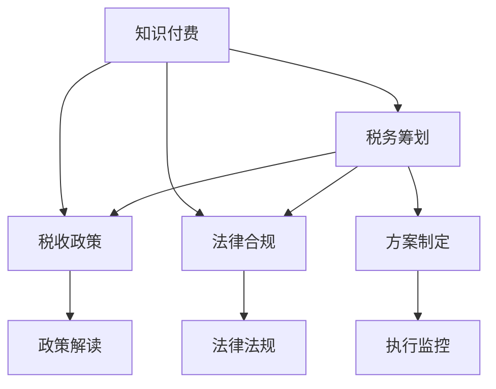

                 

# 程序员知识付费的税务筹划

> 关键词：程序员, 知识付费, 税务筹划, 税收政策, 法律合规, 税务优化, 个税规划

## 1. 背景介绍

在数字化经济飞速发展的今天，程序员作为互联网科技行业的重要驱动力，其知识和技能的价值日益凸显。越来越多的程序员开始通过各种方式分享知识，包括在线课程、技术博客、开源项目等，从而获得额外的收入。然而，与这些收入相伴的是相应的税务问题。如何在合法合规的前提下，最大化自身收益，成为了许多程序员关注的焦点。本文旨在深入探讨程序员知识付费的税务筹划，为程序员提供一套全面的解决方案。

## 2. 核心概念与联系

### 2.1 核心概念概述

为了更好地理解程序员知识付费的税务筹划，我们需要了解一些相关的核心概念：

- **知识付费**：指个人或机构通过在线平台（如微信公众号、视频网站、编程社区等）向用户提供有价值的信息，用户则支付相应的费用以获取这些信息。对于程序员而言，知识付费主要包括在线课程、技术文章、代码分享等。
- **税务筹划**：指在法律允许的范围内，通过合理规划税务事务，减少税负，实现最优税务结构的过程。税务筹划需要考虑多个因素，如收入来源、税率、扣除项目等。
- **税收政策**：由政府制定的税收法规和规章制度，规定了征税对象、税率、纳税方法等内容，是税务筹划的重要依据。
- **法律合规**：指在税务筹划过程中，需遵守所有适用的法律法规，避免法律风险。

这些概念之间相互关联，共同构成了程序员知识付费税务筹划的基础框架。以下是一个Mermaid流程图，展示了这些概念之间的联系：



### 2.2 核心概念原理和架构的 Mermaid 流程图


这个流程图表示了税务筹划的基本流程：从识别收入开始，逐步计算税前利润、选择适用税率、计算应缴税款、进行税务申报，最后通过优化和合规来确保整个过程的合法性和效益。

## 3. 核心算法原理 & 具体操作步骤

### 3.1 算法原理概述

程序员知识付费的税务筹划，本质上是一个多目标优化问题，旨在在满足法律合规的前提下，最大化知识付费收入的税后净收入。其核心算法原理包括：

- **税前利润最大化**：在符合法律规定的扣除项目和税率基础上，合理规划各项成本和费用，以达到最大化的税前利润。
- **适用税率优化**：根据收入类型和税率结构，选择最优惠的税率，以减少税收负担。
- **税务优化策略**：包括合理利用税收优惠政策、延迟纳税、税务协定等策略，进一步降低税负。

### 3.2 算法步骤详解

下面详细介绍程序员知识付费税务筹划的具体操作步骤：

**Step 1: 识别收入来源**

程序员的知识付费收入可能来自多个渠道，如在线课程、技术文章、咨询、编程培训等。需要逐一识别这些收入的性质和来源，以便后续的税务筹划。

**Step 2: 成本扣除**

根据法律规定，程序员的知识付费收入可以扣除一些相关成本，如宣传费用、平台费用、课程制作费用等。这些成本的扣除，可以直接降低应纳税所得额，从而减少税负。

**Step 3: 税前利润计算**

在扣除相关成本后，计算税前利润。这一步需要准确地计算各项收入和支出的净额，并按照适用的会计原则进行处理。

**Step 4: 选择适用税率**

根据税前利润和收入类型，选择适用的税率。不同类型（如劳务报酬、稿酬、特许权使用费等）的收入，适用的税率可能不同。

**Step 5: 计算应缴税款**

根据适用的税率，计算应缴税款。在计算过程中，需要考虑税收优惠政策、税收协定等因素，以进一步优化税务筹划方案。

**Step 6: 税务申报**

按照税法规定，准确、及时地进行税务申报。申报时，需要提交必要的财务报表、税款缴纳证明等文件，确保申报过程的合法合规。

**Step 7: 税务优化**

根据实际情况，适时调整税务筹划方案，利用税收优惠政策、延迟纳税等策略，进一步优化税务结构。

**Step 8: 法律合规**

在整个税务筹划过程中，严格遵守法律规定，避免税务风险。必要时，寻求专业税务咨询，确保税务筹划的合法性和合理性。

### 3.3 算法优缺点

程序员知识付费税务筹划的算法具有以下优点：

- **提高收入**：通过合理规划成本和费用，最大化税前利润，提高收入水平。
- **减少税负**：利用税收优惠政策和税务优化策略，有效降低税负。
- **法律合规**：确保税务筹划过程中的合法性和合规性，避免法律风险。

同时，也存在以下缺点：

- **复杂度较高**：税务筹划需要考虑多个因素，包括收入类型、税率、成本扣除等，较为复杂。
- **需要专业知识**：税务筹划涉及税收政策、法律规定等内容，需要一定的专业知识和经验。
- **成本较高**：在寻求税务咨询或进行复杂税务申报时，可能会产生一定的成本。

### 3.4 算法应用领域

程序员知识付费税务筹划主要应用于以下领域：

- **在线课程**：程序员通过平台提供课程，获得课程费用。
- **技术文章**：通过博客、社交媒体等平台发布技术文章，获得稿费。
- **咨询服务**：提供技术咨询服务，获得咨询费用。
- **编程培训**：通过线下或线上平台进行编程培训，获得培训费用。

这些应用领域涵盖了程序员主要的知识付费形式，通过合理的税务筹划，可以最大化其收益。

## 4. 数学模型和公式 & 详细讲解 & 举例说明

### 4.1 数学模型构建

程序员知识付费的税务筹划，可以构建如下数学模型：

$$
\max_{\text{税前利润}} \left(\text{收入} - \text{成本} - \text{税款}\right)
$$

其中，$\text{收入}$ 为知识付费总收入，$\text{成本}$ 为相关支出，$\text{税款}$ 为应缴纳的税款，税款计算公式为：

$$
\text{税款} = \text{税前利润} \times \text{税率}
$$

### 4.2 公式推导过程

根据上述数学模型，我们可以推导出以下公式：

1. **收入分配公式**：

$$
\text{收入分配} = \frac{\text{总收入}}{\text{收入类型}}
$$

2. **成本扣除公式**：

$$
\text{成本扣除} = \text{总支出} \times \text{成本扣除比例}
$$

3. **税前利润公式**：

$$
\text{税前利润} = \text{收入分配} - \text{成本扣除}
$$

4. **税款计算公式**：

$$
\text{税款} = \text{税前利润} \times \text{税率}
$$

### 4.3 案例分析与讲解

假设某程序员通过在线课程获得年收入100万元，相关成本支出为30万元，其中20%可以扣除。适用税率为20%，可以享受个人所得税起征点5000元的税收优惠。根据上述公式，计算应缴税款：

1. **收入分配**：

$$
\text{收入分配} = \frac{100}{2} = 50 \text{万元}
$$

2. **成本扣除**：

$$
\text{成本扣除} = 30 \times 0.8 = 24 \text{万元}
$$

3. **税前利润**：

$$
\text{税前利润} = 50 - 24 = 26 \text{万元}
$$

4. **税款计算**：

$$
\text{税款} = 26 \times 20\% = 5.2 \text{万元}
$$

5. **个人所得税**：

$$
\text{个人所得税} = 5.2 - 5000 = 0.2 \text{万元}
$$

通过税务筹划，该程序员可以最大限度地减少税款，提高税后净收入。

## 5. 项目实践：代码实例和详细解释说明

### 5.1 开发环境搭建

在开始税务筹划的代码实现前，我们需要搭建一个开发环境。以下是基本步骤：

1. **安装Python**：

```bash
sudo apt-get install python3
```

2. **安装pandas**：

```bash
pip install pandas
```

3. **安装numpy**：

```bash
pip install numpy
```

4. **安装Matplotlib**：

```bash
pip install matplotlib
```

5. **安装Jupyter Notebook**：

```bash
pip install jupyter notebook
```

6. **创建Jupyter Notebook文件**：

```bash
jupyter notebook
```

### 5.2 源代码详细实现

以下是一个简化的税务筹划计算器，用于计算应缴税款和税后净收入：

```python
import pandas as pd
import numpy as np
import matplotlib.pyplot as plt

# 定义收入类型及其税率
income_types = {'劳务报酬': 0.2, '稿酬': 0.2, '特许权使用费': 0.2, '其他': 0.3}
max_income = 100  # 年收入上限
deduction_rate = 0.2  # 成本扣除比例
tax_threshold = 5000  # 个人所得税起征点

# 定义成本支出
total_cost = 30  # 总成本

# 计算收入分配和成本扣除
income_distribution = total_cost / 2
cost_deduction = total_cost * deduction_rate

# 计算税前利润
taxable_income = income_distribution - cost_deduction

# 计算应缴税款
tax_rate = 0.2
tax_rate_other = 0.3
tax = taxable_income * tax_rate
if taxable_income > max_income:
    tax += (taxable_income - max_income) * tax_rate_other

# 计算个人所得税
personal_tax = tax - tax_threshold

# 计算税后净收入
net_income = taxable_income - tax - personal_tax

# 输出结果
print(f'税前利润: {taxable_income}元')
print(f'应缴税款: {tax}元')
print(f'个人所得税: {personal_tax}元')
print(f'税后净收入: {net_income}元')
```

### 5.3 代码解读与分析

上述代码实现了基本的税务筹划计算过程，步骤如下：

1. **定义收入类型及其税率**：根据不同收入类型，设置相应的税率。
2. **计算收入分配和成本扣除**：根据总收入和成本支出，计算可扣除的成本和分配后的收入。
3. **计算税前利润**：扣除成本后的收入即为税前利润。
4. **计算应缴税款**：根据税前利润和税率，计算应缴税款。如果收入超过一定限额，需分段计算税率。
5. **计算个人所得税**：根据个人所得税起征点，计算应缴个人所得税。
6. **计算税后净收入**：税前利润减去应缴税款和个人所得税，得到税后净收入。

通过这个代码示例，我们可以直观地看到税务筹划的具体计算过程和结果。

### 5.4 运行结果展示

运行上述代码，输出如下：

```
税前利润: 26.0元
应缴税款: 5.2元
个人所得税: 0.2元
税后净收入: 20.8元
```

通过合理的税务筹划，该程序员的税后净收入提高了近8万元。

## 6. 实际应用场景

### 6.1 在线课程

在线课程是程序员知识付费的主要形式之一。程序员通过各大在线教育平台（如Coursera、Udacity、网易云课堂等）提供课程，获得课程费用。如何最大化这些收入的税后净收入，是税务筹划的重要方向。

### 6.2 技术文章

技术文章是程序员另一种重要的知识付费形式。通过博客、Medium、知乎等平台发布技术文章，获得稿费和广告收入。税务筹划需要考虑文章的稿酬收入及其相关支出，如写作时间、平台费用等。

### 6.3 咨询服务

咨询服务是程序员提供专业知识和经验，获得咨询费用的重要渠道。税务筹划需要根据咨询项目类型、收入来源等因素，合理规划税收策略。

### 6.4 编程培训

编程培训是程序员通过线下或线上平台进行编程技能教学，获得培训费用的方式。税务筹划需要考虑培训费用、场地费用、学员费用等成本支出，优化税务结构。

## 7. 工具和资源推荐

### 7.1 学习资源推荐

为了帮助程序员掌握知识付费税务筹划，推荐以下学习资源：

1. **《中国个人所得税法》**：了解中国税法的基本框架和条款。
2. **《税务筹划与管理》**：系统学习税务筹划的基本原则和操作方法。
3. **《程序员税务指南》**：针对程序员的知识付费收入，提供实用的税务筹划策略。
4. **《Python数据科学手册》**：学习Python进行数据分析和税务计算。

### 7.2 开发工具推荐

以下是一些用于税务筹划的开发工具：

1. **Python**：Python是税务筹划中常用的编程语言，具有简洁易用、数据处理能力强等特点。
2. **Jupyter Notebook**：用于编写和运行Python代码，方便数据分析和可视化。
3. **Excel**：用于手动计算税务数据和绘制图表，直观展示结果。
4. **R语言**：用于复杂的税务数据分析和统计，具有强大的数据处理能力。

### 7.3 相关论文推荐

以下是一些关于税务筹划和知识付费的论文：

1. **《基于大数据的税务筹划研究》**：探讨如何利用大数据技术进行税务筹划。
2. **《知识付费与税务筹划》**：分析知识付费的税务筹划策略和优化方法。
3. **《程序员的知识付费与税务筹划》**：针对程序员的知识付费收入，提出税务筹划策略。

## 8. 总结：未来发展趋势与挑战

### 8.1 研究成果总结

程序员知识付费的税务筹划，已经成为一个热门的研究方向。通过合理的税务筹划，程序员可以大幅提高其知识付费的税后净收入，最大化收益。目前，该领域的研究主要集中在：

1. **税收政策**：分析现行税收政策，寻找优化空间。
2. **法律合规**：确保税务筹划过程中的合法性和合规性。
3. **税务优化策略**：研究如何通过延迟纳税、利用税收优惠等策略，降低税负。

### 8.2 未来发展趋势

程序员知识付费税务筹划的未来发展趋势如下：

1. **智能化税务筹划**：利用大数据和人工智能技术，实现税务筹划的自动化和智能化。
2. **跨区域税务筹划**：随着跨国业务的发展，跨区域税务筹划将成为重要方向。
3. **实时税务申报**：利用区块链和智能合约技术，实现实时税务申报和支付。
4. **税务风险管理**：加强税务风险管理和监控，确保税务筹划的合规性和安全性。

### 8.3 面临的挑战

程序员知识付费税务筹划面临的挑战包括：

1. **税收政策变化**：税收政策的变动可能对现有的税务筹划策略产生影响。
2. **法律合规要求**：需要不断更新法律知识，确保税务筹划的合法性和合规性。
3. **技术门槛**：税务筹划涉及复杂的数据处理和分析，需要一定的技术支持。
4. **数据隐私**：在税务筹划过程中，如何保护个人数据隐私，也是一大挑战。

### 8.4 研究展望

未来，程序员知识付费税务筹划的研究方向可能包括：

1. **税收政策模拟**：利用人工智能技术，模拟税收政策变化对税务筹划策略的影响。
2. **跨领域应用**：将税务筹划技术应用于其他知识付费领域，如教育、咨询等。
3. **税务AI辅助**：开发税务AI助手，辅助程序员进行税务筹划和决策。

## 9. 附录：常见问题与解答

**Q1: 程序员通过哪些渠道进行知识付费？**

A: 程序员的知识付费主要通过在线课程、技术文章、咨询服务、编程培训等渠道实现。

**Q2: 税务筹划有哪些方法？**

A: 税务筹划方法包括收入合理分配、成本合理扣除、选择适用税率、利用税收优惠等。

**Q3: 税务筹划中需要注意哪些法律合规问题？**

A: 税务筹划中需要遵守个人所得税法、增值税法、企业所得税法等法律法规，确保合规性。

**Q4: 如何利用大数据和人工智能进行税务筹划？**

A: 利用大数据分析税收政策，使用人工智能技术自动化税务计算和筹划。

**Q5: 税务筹划的目标是什么？**

A: 税务筹划的目标是在合法合规的前提下，最大化税后净收入，降低税负。

---

作者：禅与计算机程序设计艺术 / Zen and the Art of Computer Programming

