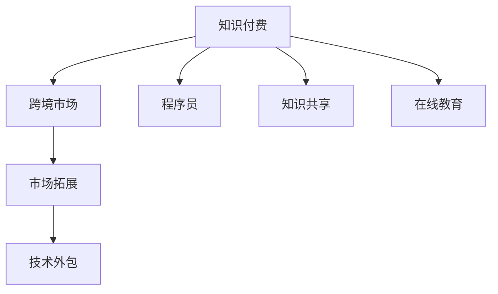

                 

# 程序员知识付费的跨境市场拓展策略

> 关键词：知识付费,跨境市场,程序员,市场拓展,策略分析,技术外包,知识共享,在线教育

## 1. 背景介绍

在数字化浪潮的推动下，知识付费已经成为了一个全球性的趋势。尤其是在程序员领域，随着开源运动和开源社区的兴起，程序员们对高质量技术资料的需求不断增长。然而，尽管国内知识付费市场已经十分成熟，但对于跨境市场的拓展，尤其是面向海外程序员的知识付费服务，仍然存在不少挑战。本文旨在深入分析程序员知识付费的跨境市场拓展策略，为相关企业提供有价值的指导。

## 2. 核心概念与联系

### 2.1 核心概念概述

为更好地理解跨境市场拓展的策略，本节将介绍几个关键概念：

- **知识付费**：指的是用户通过付费购买知识服务，包括在线课程、技术文章、视频讲座等，以获取知识和技能提升的商业模式。

- **跨境市场**：指面向不同国家和地区的市场，不仅包括出海拓展，也包括引入海外优质内容。

- **程序员**：专门从事计算机软件、应用程序开发和维护的专业人员，涵盖了从初级到高级的各类开发者。

- **市场拓展**：企业通过市场调研、竞争分析、营销策略等手段，以扩大其市场覆盖和用户基数的业务行为。

- **技术外包**：企业将部分技术需求外包给第三方公司或个人，以实现成本优化和技术升级。

- **知识共享**：通过技术社区、开源项目等方式，分享技术知识，促进技术进步和协同创新。

- **在线教育**：指通过互联网平台，提供在线课程、学习资源和互动交流的学习模式。

这些核心概念之间的逻辑关系可以通过以下Mermaid流程图来展示：



这个流程图展示了几者之间的关系：

1. 知识付费是核心，为程序员提供高质量的技术资料。
2. 跨境市场拓展是知识付费的重要渠道，将优质内容推广到全球。
3. 程序员是知识付费的主要用户，也是跨境市场的主要目标。
4. 市场拓展可以通过技术外包和知识共享等方式实现。
5. 在线教育是知识付费的一种形式，补充了传统学习方式的不足。

## 3. 核心算法原理 & 具体操作步骤
### 3.1 算法原理概述

跨境市场拓展的核心在于将国内优秀的知识付费资源推广到海外市场，同时将海外的优质内容引入国内。这一过程可以抽象为一个匹配和优化问题，即找到最优的市场推广策略，使得推广效果最大化，同时成本最小化。

数学化表达为：

$$
\maximize \text{推广效果} \\
\text{subject to} \\
\text{推广成本} \leq \text{预算}
$$

其中，推广效果可以是用户数量、订阅量等指标，推广成本包括营销费用、内容制作成本等。

### 3.2 算法步骤详解

基于上述优化问题，跨境市场拓展的算法步骤如下：

**Step 1: 市场调研与需求分析**
- 收集目标市场的人口结构、技术需求、消费习惯等信息。
- 分析本地竞争对手的优劣势，确定市场差异化策略。

**Step 2: 内容适配与本地化**
- 根据目标市场的特点，适配国内知识付费内容，使其符合当地用户的习惯。
- 翻译、本地化内容，包括技术文章、视频、课程讲义等。
- 与本地技术社区合作，推广优质内容。

**Step 3: 推广策略制定**
- 制定线上线下相结合的推广策略，包括SEO、社交媒体、邮件营销等。
- 设置合理的营销预算，优先推广效果显著的渠道。

**Step 4: 数据监控与反馈优化**
- 实时监控推广效果和用户反馈，调整推广策略。
- 定期收集用户数据，进行市场效果评估和优化。

**Step 5: 合作与交流**
- 与当地技术社区、开发者大会等建立合作关系，扩大影响。
- 邀请本地知名开发者和专家，参与内容制作和推广。

### 3.3 算法优缺点

基于上述步骤的跨境市场拓展策略，具有以下优点：

1. 提高内容适配性：根据目标市场的特点和需求，适配和本地化内容，提升用户体验。
2. 降低推广成本：通过数据监控和反馈优化，精准投放，避免资源浪费。
3. 促进技术交流：通过与本地社区合作，促进技术交流，提升用户粘性。
4. 增强市场竞争力：引入海外优质内容，丰富市场供给，吸引更多用户。

同时，该策略也存在一些局限性：

1. 本地市场环境复杂：不同国家和地区的政策、法律、文化等差异较大，推广策略需要灵活调整。
2. 语言和文化差异：内容的翻译和本地化可能存在误差，影响用户体验。
3. 网络基础设施差异：部分地区的互联网普及率和技术水平有限，推广效果受限。
4. 数据隐私问题：跨境数据传输可能涉及隐私保护问题，需符合当地法律法规。

### 3.4 算法应用领域

跨境市场拓展策略可以广泛应用于多种场景，如：

- 在线教育平台：向全球推广高质量在线课程，吸引国际用户。
- 技术社区和博客：发布本地化的技术文章，增加访问量和用户互动。
- 开源项目：在全球范围内招募贡献者，提高项目影响力。
- 开发者大会：邀请国际知名开发者，展示技术和合作机会。

## 4. 数学模型和公式 & 详细讲解 & 举例说明
### 4.1 数学模型构建

为更好地量化跨境市场拓展的效果，可构建以下数学模型：

设 $X$ 为推广策略集合，$Y$ 为用户数集合。推广效果函数 $f(X)$ 为用户数与推广策略 $X$ 的关系，推广成本函数 $c(X)$ 为推广策略 $X$ 的资源消耗。

推广效果优化问题为：

$$
\maximize f(X) \\
\text{subject to} \\
c(X) \leq \text{预算} \\
X \in \text{策略集合}
$$

### 4.2 公式推导过程

通过线性规划等方法，可以得到推广效果优化问题的解。例如，假设推广效果 $f(X)$ 与用户数 $Y$ 成正比，推广成本 $c(X)$ 与推广策略的数量成正比，可构建线性规划模型：

$$
\maximize Y \\
\text{subject to} \\
kX \leq \text{预算} \\
X \geq 0
$$

其中 $k$ 为每项推广策略的资源消耗系数。

### 4.3 案例分析与讲解

假设某知识付费平台有三种推广策略：社交媒体广告、邮件营销和SEO优化。每种策略的资源消耗和预期效果如下表所示：

| 策略 | 资源消耗系数 | 预期效果 |
| ---- | ----------- | ------- |
| 社交媒体 | 5000 | 提升用户数 10% |
| 邮件营销 | 3000 | 提升用户数 8% |
| SEO优化 | 2000 | 提升用户数 5% |

平台预算为 50000。根据上述模型，可得推广策略分配方案，使得用户数最大化，同时不超过预算。

设 $X_1$ 为社交媒体广告策略数量，$X_2$ 为邮件营销策略数量，$X_3$ 为SEO优化策略数量。则模型为：

$$
\maximize Y = 0.1X_1 + 0.08X_2 + 0.05X_3 \\
\text{subject to} \\
5000X_1 + 3000X_2 + 2000X_3 \leq 50000 \\
X_1, X_2, X_3 \geq 0
$$

通过求解该线性规划问题，可得最优策略分配：$X_1 = 6, X_2 = 10, X_3 = 0$。即选择6次社交媒体广告和10次邮件营销策略，以最大化用户数并符合预算。

## 5. 项目实践：代码实例和详细解释说明
### 5.1 开发环境搭建

在进行跨境市场拓展实践前，我们需要准备好开发环境。以下是使用Python进行数据分析的环境配置流程：

1. 安装Anaconda：从官网下载并安装Anaconda，用于创建独立的Python环境。

2. 创建并激活虚拟环境：
```bash
conda create -n data-env python=3.7
conda activate data-env
```

3. 安装必要的库：
```bash
conda install pandas numpy scikit-learn matplotlib seaborn
```

4. 设置数据路径和配置文件：
```bash
export PYTHONPATH=/path/to/project
export PATH=$PYTHONPATH:$PATH
```

完成上述步骤后，即可在`data-env`环境中进行数据处理和分析。

### 5.2 源代码详细实现

以下是一个简单的数据分析和线性规划模型构建的示例代码：

```python
import pandas as pd
import numpy as np
from scipy.optimize import linprog

# 设定推广策略和预算
strategies = ['社交媒体', '邮件营销', 'SEO优化']
budget = 50000

# 设定每项策略的资源消耗和预期效果
costs = [5000, 3000, 2000]
effects = [0.1, 0.08, 0.05]

# 构建线性规划模型
A = np.array([[costs[0], costs[1], costs[2]], [1, 1, 1]])
c = np.array([effects[0], effects[1], effects[2]])
b = np.array([budget])

# 求解线性规划问题
res = linprog(c, A_ub=A, b_ub=b, bounds=(0, None))

# 输出结果
print("优化结果：", res)
print("最优策略：", dict(zip(strategies, res.x)))
```

### 5.3 代码解读与分析

让我们再详细解读一下关键代码的实现细节：

**推广策略集合和预算**：
- `strategies`：推广策略的列表。
- `budget`：总预算。

**资源消耗和预期效果**：
- `costs`：每项策略的资源消耗。
- `effects`：每项策略的预期效果。

**线性规划模型构建**：
- `A`：资源消耗矩阵。
- `c`：策略效果系数向量。
- `b`：预算向量。
- `linprog`：求解线性规划问题的函数。

**结果输出**：
- `res`：求解结果。
- `dict(zip(strategies, res.x))`：策略分配字典。

以上代码展示了如何使用Python进行简单的线性规划模型求解。在实际应用中，还需要进一步优化和扩展，如考虑非线性效果、多目标优化等复杂场景。

## 6. 实际应用场景
### 6.1 智能客服系统

智能客服系统可以通过跨境市场拓展，面向全球用户提供高质量的客户服务。例如，某技术公司可以通过知识付费平台，向全球开发者推广其智能客服系统，提供中文、英文等多元化的支持，吸引国际用户，提升系统知名度和市场份额。

### 6.2 技术外包平台

技术外包平台可以将国内优质技术人才和开发资源推广到海外市场，为海外企业提供高效的技术解决方案。例如，某技术外包平台可以通过跨境市场拓展，在全球范围内招募开发者，参与项目开发，提升项目质量和效率。

### 6.3 开源社区

开源社区可以通过跨境市场拓展，吸引国际贡献者，提升项目影响力和技术交流。例如，某开源项目可以通过跨境市场拓展，吸引全球开发者参与，提高项目活跃度和质量。

### 6.4 在线教育平台

在线教育平台可以通过跨境市场拓展，向全球用户提供高质量的在线课程和培训服务。例如，某在线教育平台可以通过跨境市场拓展，向全球开发者推广其编程课程，提升平台用户量和口碑。

## 7. 工具和资源推荐
### 7.1 学习资源推荐

为了帮助开发者掌握跨境市场拓展的理论基础和实践技巧，这里推荐一些优质的学习资源：

1. **《跨境电商数据分析》**：系统讲解了跨境市场的数据分析和优化方法，适合初学者学习。
2. **《全球化营销策略》**：涵盖了全球市场拓展的策略和案例分析，提供实战经验。
3. **《跨境电商实战》**：通过实际案例，展示跨境市场拓展的具体实施流程。
4. **《市场拓展技巧》**：提供了丰富的市场拓展技巧和方法，适合从业者参考。
5. **《在线教育市场分析》**：分析了在线教育市场的特点和机遇，提供行业洞察。

通过这些资源的学习实践，相信你一定能够系统掌握跨境市场拓展的理论基础和实践技巧，并用于解决实际的跨境市场拓展问题。

### 7.2 开发工具推荐

高效的开发离不开优秀的工具支持。以下是几款用于跨境市场拓展开发的常用工具：

1. **Google Analytics**：提供全面的市场分析功能，帮助跟踪用户行为和市场表现。
2. **SEMrush**：SEO优化工具，提供关键词分析、竞争对手分析等功能，帮助优化推广策略。
3. **Mailchimp**：邮件营销平台，提供邮件列表管理、自动化邮件等功能，帮助提升邮件营销效果。
4. **Facebook Ads Manager**：社交媒体广告平台，提供广告投放、广告分析等功能，帮助提升社交媒体广告效果。
5. **Ahrefs**：SEO优化和竞争对手分析工具，帮助提升网站SEO效果和市场表现。

合理利用这些工具，可以显著提升跨境市场拓展任务的开发效率，加快创新迭代的步伐。

### 7.3 相关论文推荐

跨境市场拓展技术的发展源于学界的持续研究。以下是几篇奠基性的相关论文，推荐阅读：

1. **《跨境电子商务市场拓展研究》**：系统分析了跨境市场拓展的理论基础和实际案例，提供了丰富的借鉴。
2. **《全球化营销策略和实践》**：讨论了全球市场拓展的策略和方法，提供了实用的操作指南。
3. **《跨境电商数据分析方法》**：详细介绍了跨境市场的数据分析方法和工具，提供了数据驱动的决策支持。
4. **《在线教育市场分析与优化》**：分析了在线教育市场的特点和趋势，提供了市场优化的方向和方法。
5. **《市场拓展策略与实践》**：提供了市场拓展的实际案例和策略分析，提供了实战经验。

这些论文代表了大语言模型微调技术的发展脉络。通过学习这些前沿成果，可以帮助研究者把握学科前进方向，激发更多的创新灵感。

## 8. 总结：未来发展趋势与挑战

### 8.1 总结

本文对跨境市场拓展的策略进行了全面系统的介绍。首先阐述了跨境市场拓展的背景和意义，明确了市场拓展在提升全球用户覆盖和市场竞争力方面的重要价值。其次，从原理到实践，详细讲解了跨境市场拓展的数学模型和操作步骤，给出了具体的代码实现和结果展示。同时，本文还广泛探讨了跨境市场拓展方法在智能客服、技术外包、开源社区和在线教育等多个领域的应用前景，展示了跨境市场拓展范式的广阔前景。

通过本文的系统梳理，可以看到，跨境市场拓展策略正在成为知识付费技术应用的重要范式，极大地拓展了技术资料的全球覆盖和市场潜力。伴随跨境数据传输和互联网基础设施的不断完善，相信跨境市场拓展将迎来更大的机遇和挑战。

### 8.2 未来发展趋势

展望未来，跨境市场拓展技术将呈现以下几个发展趋势：

1. **技术标准统一**：随着技术标准和数据接口的统一，跨境市场拓展将更加便捷和高效。例如，采用API-first的设计思路，实现跨平台、跨地域的数据共享和集成。
2. **多渠道融合**：多种推广渠道（如社交媒体、邮件营销、SEO优化等）的融合，将提升整体推广效果和用户覆盖。例如，将社交媒体广告和邮件营销结合，提升用户触达率和参与度。
3. **智能营销**：通过大数据和人工智能技术，实现个性化推广和精准营销。例如，利用用户行为数据进行个性化推荐，提升用户转化率和满意度。
4. **全球化品牌建设**：通过全球化的市场推广策略，提升品牌知名度和美誉度。例如，通过国际开发者大会、技术比赛等方式，提升品牌影响力。
5. **合作共赢**：与本地企业和社区建立深度合作关系，共同推动技术进步和市场拓展。例如，与本地技术社区合作，提供技术支持和培训，提升本地市场接受度。

这些趋势凸显了跨境市场拓展技术的广阔前景。这些方向的探索发展，必将进一步提升知识付费市场的全球覆盖和用户粘性，为技术人才和企业的国际化发展提供新机遇。

### 8.3 面临的挑战

尽管跨境市场拓展技术已经取得了瞩目成就，但在迈向更加智能化、普适化应用的过程中，它仍面临诸多挑战：

1. **语言和文化障碍**：不同国家和地区的语言和文化差异较大，推广策略需要灵活调整。例如，不同国家的市场推广语和活动形式可能有所不同，需要本地化处理。
2. **法律法规限制**：不同国家和地区的法律法规可能存在差异，跨境数据传输和跨境支付可能涉及隐私保护和法律合规问题。
3. **网络基础设施差异**：部分地区的互联网普及率和技术水平有限，推广效果受限。例如，部分发展中国家的网络带宽和速度可能不足，推广效果不佳。
4. **市场环境复杂**：不同国家和地区的市场环境复杂，推广策略需要综合考虑政策、法律、文化等多方面因素。例如，某些国家的市场竞争激烈，推广策略需要更具竞争力。
5. **成本控制**：跨境推广需要投入更多的资源，成本较高。如何平衡推广效果和成本，实现最优资源分配，仍然是一大难题。

这些挑战需要我们在技术、市场、法律等多个维度进行全面优化和应对。唯有从全局视角出发，综合考虑各方面因素，才能在跨境市场拓展中取得更好的效果。

### 8.4 未来突破

面对跨境市场拓展所面临的种种挑战，未来的研究需要在以下几个方面寻求新的突破：

1. **智能化推广**：通过大数据和人工智能技术，实现推广策略的智能化和自动化。例如，利用机器学习算法优化推广效果，提升用户覆盖和转化率。
2. **全球化数据治理**：建立全球化的数据治理体系，保障数据安全和合规性。例如，采用区块链技术实现数据透明和安全传输。
3. **本地化策略优化**：通过本地化策略优化，提升推广效果和用户接受度。例如，针对不同市场设计本地化的推广策略和活动形式。
4. **多模态数据融合**：通过多模态数据融合，提升推广策略的全面性和深度。例如，结合社交媒体、邮件营销、SEO优化等多种数据源，全面分析市场表现。
5. **可持续发展**：实现跨境市场拓展的可持续发展，平衡经济效益和社会责任。例如，通过公益项目和技术支持，提升当地社区的数字化水平。

这些研究方向的探索，必将引领跨境市场拓展技术迈向更高的台阶，为构建全球化的知识付费生态系统提供新动力。面向未来，跨境市场拓展技术还需要与其他人工智能技术进行更深入的融合，如知识表示、因果推理、强化学习等，多路径协同发力，共同推动跨境知识付费市场的进步。只有勇于创新、敢于突破，才能不断拓展知识付费市场的边界，让全球用户都能享受到高质量的知识服务。

## 9. 附录：常见问题与解答

**Q1：跨境市场拓展对企业有哪些优势？**

A: 跨境市场拓展对企业有以下优势：
1. 提升全球用户覆盖：通过跨境推广，企业可以拓展到更多国家和地区的市场，增加用户基数。
2. 增加收入来源：跨境市场具有不同文化背景的用户，带来新的收入机会。
3. 提升品牌知名度：全球化的市场推广可以提升品牌知名度和美誉度，增加企业竞争力。
4. 丰富技术交流：跨境市场拓展促进了不同地区的技术交流和合作，提升技术创新能力。
5. 多样化业务模式：跨境市场拓展为企业提供多样化的业务模式，如技术外包、在线教育等。

**Q2：如何进行有效的跨境市场调研？**

A: 有效的跨境市场调研需要以下步骤：
1. 确定调研目标：明确调研的目的和重点，例如了解目标市场的需求、竞争情况等。
2. 数据收集：通过问卷调查、用户访谈、市场报告等方式，收集目标市场的数据。
3. 数据分析：利用数据分析工具（如Tableau、PowerBI等），对数据进行统计和分析，找出关键问题和机会。
4. 本地化策略：根据调研结果，制定本地化的推广策略和方案。
5. 效果评估：在推广策略实施后，持续监控效果，进行效果评估和优化。

**Q3：如何选择合适的跨境推广渠道？**

A: 选择合适的跨境推广渠道需要考虑以下因素：
1. 目标市场特点：不同国家和地区的用户习惯不同，选择合适的推广渠道。例如，社交媒体在年轻人中更受欢迎。
2. 预算和效果：根据推广预算和预期效果，选择合适的推广渠道。例如，邮件营销成本较低，但覆盖面较窄。
3. 竞争情况：考虑目标市场的竞争情况，选择具有竞争力的推广渠道。例如，Google Ads在竞争激烈的行业中的效果较好。
4. 用户触达率：选择能够高效触达目标用户的推广渠道。例如，Facebook Ads可以精准定位用户，提升广告效果。
5. 长期价值：考虑推广渠道的长期价值，选择具有持久效益的推广渠道。例如，SEO优化能够长期提升网站流量和用户粘性。

**Q4：跨境市场拓展中如何处理数据隐私问题？**

A: 跨境市场拓展中处理数据隐私问题需要以下步骤：
1. 合规审查：了解目标市场的数据保护法规，确保推广策略符合当地法律。例如，欧盟的GDPR法规要求严格的数据保护措施。
2. 数据匿名化：在数据传输和存储过程中，进行数据匿名化处理，保护用户隐私。例如，使用数据脱敏技术，保护用户信息。
3. 用户同意：在数据收集和处理过程中，获得用户的明确同意，保护用户隐私权。例如，通过隐私政策和用户协议，明确数据使用范围。
4. 数据加密：在数据传输和存储过程中，采用加密技术，保护数据安全。例如，使用SSL/TLS协议加密数据传输。
5. 数据治理：建立全球化的数据治理体系，保障数据安全和合规性。例如，采用区块链技术实现数据透明和安全传输。

通过以上步骤，可以有效处理跨境市场拓展中的数据隐私问题，保障用户隐私权益。

**Q5：跨境市场拓展中如何优化推广策略？**

A: 跨境市场拓展中优化推广策略需要以下步骤：
1. 数据监控：实时监控推广效果和用户反馈，分析推广策略的效果和问题。
2. 效果评估：根据市场数据和用户反馈，进行效果评估，找出推广策略的优势和不足。
3. 策略调整：根据效果评估结果，调整推广策略，优化推广效果。
4. 测试和验证：在调整后的推广策略实施前，进行小规模测试和验证，确保效果。
5. 持续改进：在推广策略实施过程中，持续优化和改进，提升推广效果。

通过以上步骤，可以不断优化跨境市场拓展的推广策略，提升市场表现和用户覆盖。

---

作者：禅与计算机程序设计艺术 / Zen and the Art of Computer Programming

