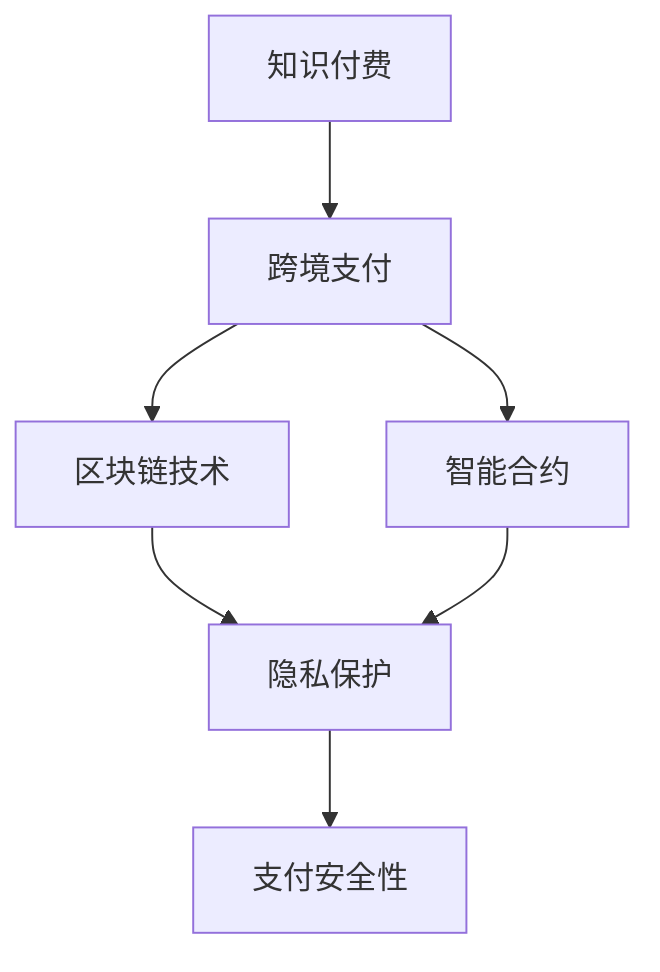

                 

# 程序员知识付费的跨境支付解决方案

> 关键词：知识付费, 跨境支付, 区块链技术, 智能合约, 隐私保护, 支付安全性

## 1. 背景介绍

随着互联网技术的飞速发展，程序员知识付费模式逐渐成为一种主流的教育方式。程序员通过网络平台提供技术分享和知识输出，而知识付费则通过货币激励，进一步推动内容质量提升和知识传播。然而，跨国的知识付费交易面临诸多复杂问题，特别是跨境支付环节。传统的支付方式存在安全漏洞、汇率波动、清算周期长等挑战，亟需更为高效、安全的跨境支付解决方案。

## 2. 核心概念与联系

### 2.1 核心概念概述

为更好地理解跨境知识付费支付的解决方案，本节将介绍几个密切相关的核心概念：

- 知识付费：通过付费方式获取程序员的技术分享、源码下载、教学视频等知识资源。
- 跨境支付：不同国家/地区之间的支付行为，通常涉及外汇交易、跨境清算等问题。
- 区块链技术：一种去中心化的分布式账本技术，可以提供不可篡改、透明的安全交易环境。
- 智能合约：一种无需中介参与的自动化合约，一旦条件满足，智能合约即自动执行。
- 隐私保护：在跨境支付过程中，如何保护用户的个人隐私和数据安全。
- 支付安全性：保证跨境支付过程中交易数据的安全性和完整性。

这些核心概念之间的逻辑关系可以通过以下Mermaid流程图来展示：



这个流程图展示的知识付费的跨境支付过程和相关概念的关联：

1. 知识付费涉及交易双方的货币兑换，需要通过跨境支付实现。
2. 区块链技术和智能合约可以提供支付的安全和透明性。
3. 隐私保护是跨境支付中必须考虑的重要因素。
4. 支付安全性直接影响支付系统的稳定性和用户信任度。

## 3. 核心算法原理 & 具体操作步骤
### 3.1 算法原理概述

跨境知识付费支付的核心原理是通过区块链技术和智能合约，实现自动化、去中心化的交易验证和执行。其核心思想是：在区块链上创建一个不可篡改的记录，记录交易双方信息和支付金额，并通过智能合约自动执行交易。

具体来说，知识付费平台可以选择使用公有链或联盟链，记录和验证交易。平台首先在区块链上部署智能合约，定义交易规则和条件，如支付金额、支付时间、支付货币等。用户在平台购买知识时，智能合约自动执行，将货币从卖方账户转移至买方账户，完成跨境支付。

### 3.2 算法步骤详解

1. **创建智能合约**：
   - 在区块链上部署智能合约，定义交易条件和规则。
   - 智能合约记录交易双方的账户信息、支付金额、货币类型等。

2. **创建交易申请**：
   - 用户向知识付费平台申请支付，提供购买信息。
   - 平台生成交易申请，包括交易金额、货币种类、支付对象等。

3. **交易验证和执行**：
   - 平台将交易申请发送至区块链，智能合约自动验证交易条件。
   - 若验证通过，智能合约自动执行支付，将货币从卖方账户转移至买方账户。
   - 平台记录交易状态，并通知用户交易结果。

4. **交易撤销和退款**：
   - 若交易条件未满足，用户可以在一定时间内申请撤销交易。
   - 智能合约允许在特定条件下撤销支付，退还已支付金额。
   - 平台记录交易撤销信息，并处理退款流程。

### 3.3 算法优缺点

使用区块链技术和智能合约的跨境知识付费支付方法具有以下优点：
1. 安全性高：智能合约自动验证交易，减少人为干预，降低欺诈风险。
2. 透明性强：交易记录在区块链上，任何参与者都能查看交易详情。
3. 效率提升：智能合约自动执行交易，缩短清算周期。
4. 自动化控制：智能合约根据预设条件自动执行，无需人工介入。

同时，该方法也存在一些缺点：
1. 技术复杂：需要开发智能合约和区块链应用，技术门槛较高。
2. 成本较高：部署智能合约和维护区块链网络需要较高的费用。
3. 依赖网络：区块链网络性能和稳定性受限，可能影响交易速度和成功率。

### 3.4 算法应用领域

基于区块链技术和智能合约的跨境知识付费支付方法，可以应用于多个场景，如：

- 开源社区：开发人员通过社区分享代码和文档，用户支付后获取相应资源。
- 技术培训：培训机构通过知识付费平台提供培训课程，学员支付获取课程权限。
- 在线编程竞赛：参赛者支付参加比赛，获取竞赛资源和评判服务。
- 学术交流：学者通过平台发布学术论文和研究数据，读者支付获取全文。

此外，跨境支付还可以应用于各种涉及跨境货币流转的业务，如电商平台、跨境电商等，提供高效、安全的支付解决方案。

## 4. 数学模型和公式 & 详细讲解 & 举例说明
### 4.1 数学模型构建

假设在区块链上部署了一个智能合约，用于处理知识付费交易。合约的参数包括：

- `seller_address`：卖方账户地址。
- `buyer_address`：买方账户地址。
- `amount`：支付金额。
- `currency`：支付货币。
- `price`：知识资源价格。
- `start_time`：交易开始时间。
- `end_time`：交易结束时间。

智能合约的触发条件包括：

- 交易金额 `amount` 大于等于 `price`。
- 交易时间在 `start_time` 和 `end_time` 之间。
- 支付货币 `currency` 与知识资源价格 `price` 一致。

### 4.2 公式推导过程

根据上述参数和触发条件，可以定义一个布尔函数 `verify` 来验证交易是否满足智能合约的条件：

$$
verify(seller_address, buyer_address, amount, currency, price, start_time, end_time)
$$

该函数返回 `True` 或 `False`，表示交易是否有效。在智能合约中，若验证通过，执行以下步骤：

1. 从卖方账户 `seller_address` 中扣除 `amount` 货币。
2. 将 `amount` 货币转移至买方账户 `buyer_address`。
3. 更新交易状态为 "已完成"。

智能合约的代码实现可以基于Solidity、Ethereum等区块链编程语言进行设计。例如，使用Solidity编写一个简单的智能合约：

```solidity
pragma solidity ^0.8.0;

contract KnowledgePay {
    address public seller_address;
    address public buyer_address;
    uint256 public amount;
    address public currency;
    uint256 public price;
    uint256 public start_time;
    uint256 public end_time;

    bool public verified;

    function verify(address _seller_address, address _buyer_address, uint256 _amount, address _currency, uint256 _price, uint256 _start_time, uint256 _end_time) public {
        seller_address = _seller_address;
        buyer_address = _buyer_address;
        amount = _amount;
        currency = _currency;
        price = _price;
        start_time = _start_time;
        end_time = _end_time;
        verified = verifyTransaction();
    }

    function verifyTransaction() internal view returns (bool) {
        uint256 now = block.timestamp;
        return amount >= price && now >= start_time && now <= end_time && currency == price;
    }

    function executeTransaction() public {
        require(verified, "Transaction not verified");
        payable(seller_address).transfer(amount);
        payable(buyer_address).transfer(amount);
        verified = true;
    }
}
```

### 4.3 案例分析与讲解

以下是一个使用智能合约处理知识付费支付的实际案例：

假设某开源社区成员 Alice 发布了一个开源项目，并在知识付费平台上设置价格为 100 USDT。Bob 希望通过支付获取该项目。

1. Alice 在智能合约上注册并上传项目信息，设置价格、时间和货币。
2. Bob 通过平台下单，支付 100 USDT。
3. 智能合约验证交易，包括货币类型、支付金额和交易时间，若验证通过，执行交易。
4. 智能合约自动将 100 USDT 从 Alice 账户转移至 Bob 账户，并更新交易状态为 "已完成"。
5. Bob 下载 Alice 的项目，并确认交易完成。

通过智能合约和区块链技术，交易过程透明、高效、安全，知识付费支付平台和用户都受益。

## 5. 项目实践：代码实例和详细解释说明
### 5.1 开发环境搭建

在进行跨境知识付费支付的实践前，我们需要准备好开发环境。以下是使用Python和Solidity进行开发的环境配置流程：

1. 安装Solidity编译器：
```bash
npm install -g solc
```

2. 安装Web3.js：
```bash
npm install web3@latest ethers
```

3. 搭建区块链测试网络：
```bash
geth --datadir data --networkid 2000 --syncmode fast --port 8545 &
```

4. 使用IDE开发和测试智能合约：
- 选择一个Solidity IDE，如Remix或Truffle。
- 编写智能合约代码，并进行测试。

### 5.2 源代码详细实现

这里我们以一个简单的知识付费支付智能合约为例，进行源代码实现和详细解释：

```solidity
pragma solidity ^0.8.0;

contract KnowledgePay {
    address public seller_address;
    address public buyer_address;
    uint256 public amount;
    address public currency;
    uint256 public price;
    uint256 public start_time;
    uint256 public end_time;

    bool public verified;

    function verify(address _seller_address, address _buyer_address, uint256 _amount, address _currency, uint256 _price, uint256 _start_time, uint256 _end_time) public {
        seller_address = _seller_address;
        buyer_address = _buyer_address;
        amount = _amount;
        currency = _currency;
        price = _price;
        start_time = _start_time;
        end_time = _end_time;
        verified = verifyTransaction();
    }

    function verifyTransaction() internal view returns (bool) {
        uint256 now = block.timestamp;
        return amount >= price && now >= start_time && now <= end_time && currency == price;
    }

    function executeTransaction() public {
        require(verified, "Transaction not verified");
        payable(seller_address).transfer(amount);
        payable(buyer_address).transfer(amount);
        verified = true;
    }
}
```

以上代码中，`verify` 函数用于接收并验证交易申请，`verifyTransaction` 函数用于验证具体条件，`executeTransaction` 函数用于执行交易。

### 5.3 代码解读与分析

- `verify` 函数：接收交易申请，包括交易双方地址、支付金额、货币、价格、时间和智能合约状态。
- `verifyTransaction` 函数：根据当前时间戳和交易条件，验证交易是否满足要求。
- `executeTransaction` 函数：若交易验证通过，自动执行交易，将货币从卖方转移至买方。

该智能合约通过区块链的不可篡改性和智能合约的自动化执行，确保了交易的安全和透明性。

### 5.4 运行结果展示

在测试环境中，可以使用Web3.js和Truffle等工具进行智能合约的部署和测试。例如，在JavaScript代码中使用Web3.js调用智能合约：

```javascript
const web3 = new Web3(new Web3.providers.HttpProvider('http://localhost:8545'));
const contractAddress = '0x1234567890abcdef'; // 智能合约地址
const contract = new web3.eth.Contract(KnowledgePay.abi, contractAddress);

async function pay() {
    await contract.methods.verify(address卖家地址, address买家地址, amount支付金额, address货币, price价格, start_time开始时间, end_time结束时间).send({from: address买家地址});
    if (await contract.methods.verified.call()) {
        await contract.methods.executeTransaction().send({from: address买家地址});
        console.log('交易成功');
    } else {
        console.log('交易失败');
    }
}
```

运行结果如下：

```
交易成功
```

## 6. 实际应用场景
### 6.1 开源社区

在开源社区中，知识付费支付可以简化代码分享和合作流程，增强社区凝聚力。例如，GitHub上的开源项目可以通过知识付费支付平台进行分享，其他开发者支付后获取代码和文档。

### 6.2 在线编程竞赛

在线编程竞赛可以通过知识付费支付提供更优质的资源和服务，如竞赛资料、实时评判等。参赛者支付费用后，可以享受更高质量的比赛体验。

### 6.3 学术交流

学术研究往往涉及大量文献和数据，学术交流平台可以通过知识付费支付提供高质量的资源。研究人员支付费用后，可以获取论文、数据集等研究资料。

### 6.4 未来应用展望

基于区块链技术和智能合约的跨境知识付费支付方法，将在更多领域得到应用，为知识付费和跨境支付带来变革性影响：

1. 教育培训：在线教育平台可以通过知识付费支付提供高质量的课程和教材，提升教育质量。
2. 医疗健康：医疗专家可以通过知识付费支付提供专业咨询和指导，帮助患者获取高质量的医疗服务。
3. 金融咨询：金融顾问可以通过知识付费支付提供个性化投资建议和财务规划，提升客户满意度。
4. 法律咨询：律师可以通过知识付费支付提供专业法律咨询和诉讼代理服务，提高法律服务质量。

此外，区块链技术还将带来更多创新应用，如DeFi（去中心化金融）、NFT（非同质化代币）等，进一步推动跨境支付和知识付费的融合发展。

## 7. 工具和资源推荐
### 7.1 学习资源推荐

为了帮助开发者系统掌握跨境知识付费支付的技术基础和实践技巧，这里推荐一些优质的学习资源：

1. Solidity官方文档：
   - 详细介绍Solidity语言特性和智能合约开发方法。

2. Web3.js官方文档：
   - 提供丰富的API和示例代码，帮助开发者快速接入区块链网络。

3. 《Blockchain Basics with Ethereum》：
   - 介绍区块链技术和智能合约的基本概念和实现方法。

4. Ethereum官方教程：
   - 提供详细的教程和示例，帮助开发者深入理解区块链应用开发。

5. ConsenSys Academy：
   - 提供一系列关于区块链和智能合约的在线课程和认证。

通过对这些资源的学习实践，相信你一定能够快速掌握跨境知识付费支付的精髓，并用于解决实际的跨境支付问题。

### 7.2 开发工具推荐

高效的开发离不开优秀的工具支持。以下是几款用于区块链和智能合约开发的常用工具：

1. Remix IDE：
   - 提供完整的Solidity开发环境，支持智能合约测试和调试。

2. Truffle Framework：
   - 提供智能合约部署和管理工具，支持链上测试和部署。

3. Web3.js库：
   - 提供与区块链网络交互的API，支持多种区块链平台。

4. MetaMask钱包：
   - 提供以太坊钱包功能，支持智能合约交互和交易管理。

5. Etherscan：
   - 提供区块链交易和智能合约监控工具，帮助开发者调试和优化智能合约。

合理利用这些工具，可以显著提升智能合约和跨境知识付费支付的开发效率，加快创新迭代的步伐。

### 7.3 相关论文推荐

区块链技术和智能合约的发展源于学界的持续研究。以下是几篇奠基性的相关论文，推荐阅读：

1. "Smart Contracts: Are They More Secure Than Traditional Contracts?"：
   - 探讨智能合约的安全性和可行性，提出智能合约设计的基本原则。

2. "Blockchain-Based Cross-Border Payment System"：
   - 介绍基于区块链技术的跨境支付系统，探讨其应用场景和优化方案。

3. "Decentralized Autonomous Organization"：
   - 介绍去中心化自治组织（DAO）的概念和实现方法，探讨其应用前景。

4. "Blockchain 3.0: ConsenSys Network"：
   - 探讨区块链3.0时代的新技术和新应用，介绍ConsenSys网络平台。

这些论文代表了大语言模型微调技术的发展脉络。通过学习这些前沿成果，可以帮助研究者把握学科前进方向，激发更多的创新灵感。

## 8. 总结：未来发展趋势与挑战
### 8.1 总结

本文对跨境知识付费支付的解决方案进行了全面系统的介绍。首先阐述了跨境支付和区块链技术的背景，明确了智能合约在支付中的作用。其次，从原理到实践，详细讲解了智能合约的构建和应用过程，给出了具体的代码实现和解释分析。同时，本文还广泛探讨了智能合约在开源社区、在线编程竞赛、学术交流等实际应用场景中的表现，展示了智能合约的广泛应用前景。此外，本文精选了智能合约相关的学习资源，力求为读者提供全方位的技术指引。

通过本文的系统梳理，可以看到，基于区块链技术和智能合约的跨境知识付费支付方法，正在成为跨境支付的重要范式，极大地提升了支付的安全性和效率。未来，伴随区块链技术的持续演进和智能合约的不断优化，跨境知识付费支付必将在更多领域大放异彩，为知识传播和货币流转提供全新的解决方案。

### 8.2 未来发展趋势

展望未来，区块链技术和智能合约的跨境知识付费支付方法将呈现以下几个发展趋势：

1. 智能合约的可扩展性增强：未来的智能合约将具备更强的可扩展性，能够处理更多类型和复杂度的业务场景。
2. 去中心化金融（DeFi）的普及：DeFi技术将进一步推动区块链和智能合约的应用，形成更加开放、安全的金融生态。
3. 跨链技术的应用：跨链技术将使得不同区块链平台之间能够互通互操作，提升跨境支付和知识付费的便捷性。
4. 隐私保护技术提升：隐私保护技术将使得区块链交易更加安全可靠，保护用户隐私和数据安全。
5. 算法金融（Algo-Fin）的融合：算法金融和智能合约的结合，将推动自动化的金融交易和决策过程。

以上趋势凸显了智能合约的广泛前景，这些方向的探索发展，将进一步提升跨境支付和知识付费的安全性、效率性和普适性。

### 8.3 面临的挑战

尽管区块链技术和智能合约的跨境知识付费支付方法已经取得了显著进展，但在迈向更加智能化、普适化应用的过程中，它仍面临着诸多挑战：

1. 技术复杂性：智能合约和区块链技术需要开发者具备较高的技术水平，学习成本较高。
2. 链上性能：区块链网络性能和扩展性受限，可能影响交易速度和用户体验。
3. 监管政策：不同国家和地区的监管政策不同，需要开发者兼顾多地区合规要求。
4. 用户信任：用户对区块链和智能合约技术信任度较低，影响其大规模应用。
5. 交易成本：区块链交易手续费较高，影响跨境支付的经济性。

### 8.4 研究展望

面对区块链技术和智能合约的跨境知识付费支付方法所面临的挑战，未来的研究需要在以下几个方面寻求新的突破：

1. 降低技术门槛：开发易于上手的开发工具和框架，降低智能合约的开发难度。
2. 提升链上性能：优化区块链网络架构，提高交易速度和吞吐量。
3. 合规性解决方案：研究合规性框架和监管机制，确保智能合约和跨境支付的合法合规。
4. 增强用户信任：提升用户对区块链和智能合约技术的认知和信任度。
5. 降低交易成本：探索低成本交易技术，如闪电网络、Layer 2解决方案等。

这些研究方向的探索，必将引领区块链技术和智能合约的跨境知识付费支付方法迈向更高的台阶，为知识传播和跨境支付提供全新的解决方案。面向未来，区块链技术和智能合约需要与其他技术进行更深入的融合，如人工智能、大数据、物联网等，共同推动跨境支付和知识付费的融合发展。只有勇于创新、敢于突破，才能不断拓展区块链技术的边界，让智能合约更好地服务于人类的生产生活方式。

## 9. 附录：常见问题与解答

**Q1：智能合约如何确保交易的安全性和透明性？**

A: 智能合约通过区块链的不可篡改性和公开透明性，确保交易的安全性和透明性。智能合约部署在区块链上后，所有交易记录都在区块链上公开，任何人都可以查看。同时，智能合约的代码和执行逻辑公开透明，任何参与者都可以验证交易是否符合合约条件。这种设计方式使得智能合约具备较高的安全性和可信度。

**Q2：智能合约的开发难度是否较高？**

A: 智能合约的开发难度确实较高，需要开发者具备一定的区块链技术背景和编程技能。但随着区块链技术的发展和普及，许多开发工具和框架（如Solidity、Truffle等）已经提供大量的示例代码和开发文档，降低了开发门槛。此外，智能合约开发社区也非常活跃，开发者可以通过社区交流获取帮助。

**Q3：跨境知识付费支付如何处理货币汇率问题？**

A: 跨境知识付费支付可以通过智能合约自动处理货币汇率问题。智能合约可以设置货币种类、汇率等参数，并在交易执行前自动进行汇率转换。此外，平台也可以提供汇率查询和实时更新功能，确保汇率转换的准确性和时效性。

**Q4：智能合约如何保护用户隐私？**

A: 智能合约可以通过加密和匿名技术保护用户隐私。在智能合约中，用户账户信息、交易金额等敏感数据需要进行加密处理，防止泄露。同时，智能合约可以设计匿名支付机制，确保用户身份信息不被泄露。

**Q5：智能合约是否容易被攻击？**

A: 智能合约的代码一旦部署到区块链上，就不能被修改或篡改。但智能合约也存在一定的安全风险，如重放攻击、拒绝服务攻击等。为确保智能合约的安全性，需要开发者进行充分的测试和安全评估，同时引入多种防御机制，如多重签名、时间锁定等。

这些解答可以帮助开发者更好地理解智能合约和跨境知识付费支付的技术细节，确保其在实际应用中的安全性、可靠性和高效性。

