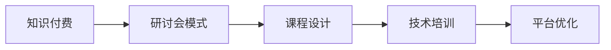

                 

# 程序员知识付费：打造研讨会模式

> 关键词：程序员,知识付费,研讨会,课程设计,技术培训,平台优化

## 1. 背景介绍

在快速发展的科技时代，程序员需要不断学习新的技术以保持竞争力。然而，传统的学习方式，如在线课程、书籍、视频等，往往难以满足需求。程序员知识付费的研讨会模式应运而生，通过结构化的研讨会、项目导向的课程设计和高效的互动体验，提供一种全新的学习方式。本文将深入探讨这一模式的原理、操作步骤和应用领域，以期为程序员的知识付费之路提供新的思路。

## 2. 核心概念与联系

### 2.1 核心概念概述

为了更好地理解研讨会模式，我们首先需要明确几个核心概念：

- **知识付费**：是指用户为获得特定知识或技能而支付的费用。这种模式在互联网知识共享的浪潮中愈发普及，满足了人们快速获取高效知识的需求。

- **研讨会模式**：是一种通过组织专家或经验丰富的程序员分享知识、技能和经验的教学模式。与传统课程相比，研讨会模式更加注重互动和实践，强调在真实项目中的学习。

- **课程设计**：是指根据学习目标和需求，制定包含理论讲解、项目实践、互动环节的教学大纲。设计良好的课程能提高学习效果，激发学员兴趣。

- **技术培训**：旨在提升程序员的专业技能和解决实际问题的能力。培训内容通常包括编程语言、开发框架、算法数据结构、软件架构设计等。

- **平台优化**：指利用技术手段提升研讨会的互动性和效率。如实时问答、在线协作、项目演示等。

这些概念之间存在紧密联系：研讨会模式依托于知识付费，通过精心设计的课程进行技术培训，并通过平台优化提升学习效果。

### 2.2 核心概念原理和架构的 Mermaid 流程图



上述流程图示意了知识付费、研讨会模式、课程设计、技术培训和平台优化之间的内在联系。研讨会模式以知识付费为基础，通过课程设计提供高质量的技术培训，并通过平台优化提升学习体验。

## 3. 核心算法原理 & 具体操作步骤
### 3.1 算法原理概述

研讨会模式的原理基于合作学习和项目导向的学习模型。其核心思想是：通过与专家的实时互动和项目实战，帮助学员在短时间内掌握复杂技术，并应用到实际工作中。

形式化地，我们可以将研讨会模式的教学过程表示为：

- 选取N个专家和M个学员，每个专家负责K个主题。
- 专家和学员通过视频会议、即时通讯工具等平台进行实时互动。
- 专家通过项目案例讲解、编程演示、互动问答等环节，引导学员理解和掌握技术。
- 学员根据专家指导完成实战项目，项目结束后进行反馈和评估。

该过程可以通过以下算法描述：

1. 专家选择和主题分配算法：
   - 根据领域专长、知名度等因素选取N个专家，并将其分配到K个主题。
   - 每个专家负责K个主题，确保覆盖全面。
   
2. 互动教学算法：
   - 专家和学员进行实时互动，专家通过视频、音频和文字形式讲解技术。
   - 学员可以通过提问、代码审查、项目展示等形式反馈学习成果。

3. 项目评估和反馈算法：
   - 每个学员完成实战项目后，专家和学员共同评估项目质量，提供具体改进建议。
   - 专家根据评估结果进行二次讲解，强化技术要点。

### 3.2 算法步骤详解

以下详细介绍研讨会模式的详细操作步骤：

**Step 1: 专家和学员的选择与分配**
- 选择N个领域内公认的专家，并确定他们各自专长的主题K。
- 从学员中随机选取M个有学习需求的人，保证学员的多样性和代表性。

**Step 2: 设计课程大纲**
- 根据专家的主题范围，设计包含理论讲解、项目实践和互动环节的课程大纲。
- 每个主题分配一定的时间，确保理论知识与实践项目均衡。

**Step 3: 平台搭建与资源准备**
- 选择合适的在线平台（如Zoom、Slack、GitHub等）搭建研讨会环境。
- 准备课程所需的教学材料，包括视频、演示文稿、代码示例等。

**Step 4: 实施互动教学**
- 专家和学员通过平台进行实时互动。专家讲解主题知识，学员通过提问、代码分享等形式互动。
- 专家通过项目案例讲解和编程演示，引导学员理解和掌握技术。
- 学员根据专家指导完成实战项目，项目结束后进行反馈和评估。

**Step 5: 项目评估与反馈**
- 专家和学员共同评估学员的项目，并提供具体改进建议。
- 专家根据评估结果进行二次讲解，强化技术要点。
- 学员根据反馈进行修改和优化，提升技术水平。

### 3.3 算法优缺点

研讨会模式的优点：
1. 实时互动：专家和学员之间的实时互动，有助于及时解决学习中的问题，提高学习效率。
2. 项目实战：通过实际项目实践，学员能更直观地理解技术要点，提升解决实际问题的能力。
3. 知识更新：研讨会模式紧跟技术发展趋势，通过专家讲解和互动，确保学员掌握最新知识。
4. 社区氛围：研讨会环境类似于社区，学员之间可以互相交流和学习，形成良好的学习氛围。

研讨会模式的缺点：
1. 成本较高：由于需要专家和学员的参与，成本相对较高，难以大规模普及。
2. 时间紧张：每个主题的时间有限，难以深入讲解复杂的知识点。
3. 内容局限：专家和学员的选择和主题分配可能限制课程内容的多样性和深度。
4. 技术门槛：部分学员可能对新技术不熟悉，参与难度较大。

### 3.4 算法应用领域

研讨会模式在以下领域具有广泛应用：

- **软件研发**：通过与资深工程师和架构师的互动，提升代码质量和项目管理能力。
- **数据科学**：与数据分析师和数据工程师交流，学习数据处理、机器学习等技能。
- **人工智能**：通过与AI专家互动，深入了解深度学习、自然语言处理等前沿技术。
- **系统架构**：与架构专家互动，提升系统设计能力和技术选型能力。
- **项目管理**：通过与项目经理互动，学习敏捷开发、Scrum等管理方法。

除了这些传统领域外，研讨会模式还可以应用于更多新兴技术领域，如区块链、量子计算、物联网等。

## 4. 数学模型和公式 & 详细讲解 & 举例说明

### 4.1 数学模型构建

设研讨会模式中的专家数量为 $N$，学员数量为 $M$，专家分配的主题数量为 $K$，则每个专家负责 $K$ 个主题，每个主题由 $N$ 个专家中的 $K$ 个专家和 $M$ 个学员共同参与。假设专家和学员在每次互动中花费的时间为 $T$，则每次互动的总时间为 $NKM \cdot T$。

### 4.2 公式推导过程

研讨会模式的总时间 $T_{total}$ 可表示为：

$$
T_{total} = \sum_{i=1}^{M} \sum_{j=1}^{K} T = M \cdot K \cdot T
$$

其中，内层循环表示学员参与每个主题的时间，外层循环表示每个学员参与所有主题的时间。

为了最大化学习效率，我们需要在每次互动中尽可能地利用时间，即：

$$
\max_{N,K,T} T_{total}
$$

在约束条件下，上述问题可以通过线性规划求解。

### 4.3 案例分析与讲解

假设我们有10名专家和20名学员，每个专家负责3个主题，学员需要学习8个主题，每个互动时间 $T=1$ 小时。则总时间为：

$$
T_{total} = 20 \cdot 8 \cdot 1 = 160 \text{小时}
$$

若专家和学员充分互动，则可以学习更多的内容。例如，将每个学员的互动时间分配为每个主题 $T_{theme} = 0.5$ 小时，专家在每个主题内讲解时间 $T_{lecture} = 0.5$ 小时，学员在每个主题内练习时间 $T_{practice} = 1$ 小时，则总时间为：

$$
T_{total} = 20 \cdot 8 \cdot (T_{theme} + T_{lecture} + T_{practice}) = 20 \cdot 8 \cdot 2 = 320 \text{小时}
$$

通过合理分配时间，研讨会模式的效率得以提升。

## 5. 项目实践：代码实例和详细解释说明
### 5.1 开发环境搭建

为了搭建研讨会平台，我们首先需要选择合适的技术栈：

- **前端**：React或Vue.js，用于构建互动界面。
- **后端**：Node.js或Python，用于实现服务器端逻辑和API接口。
- **实时互动**：WebRTC或Socket.IO，用于实现实时音视频传输和即时通讯。
- **项目演示**：GitHub或GitLab，用于代码共享和项目管理。

**Step 1: 安装Node.js和npm**
- 安装Node.js和npm，搭建开发环境。
- 使用npm初始化项目：
```bash
npm init
```

**Step 2: 安装前端框架**
- 使用npm安装React或Vue.js，并创建项目目录：
```bash
npm install react
```

**Step 3: 安装后端框架**
- 使用npm安装Node.js和Express，搭建后端服务器：
```bash
npm install express
```

**Step 4: 搭建实时互动功能**
- 使用npm安装Socket.IO，并集成到后端：
```bash
npm install socket.io
```

**Step 5: 搭建项目演示功能**
- 使用npm安装GitHub API客户端，并实现代码共享功能：
```bash
npm install @octokit/rest
```

### 5.2 源代码详细实现

以下是一个简单的研讨会模式实现示例，包括前端和后端代码：

**前端代码示例**（React）：

```javascript
import React, { useState } from 'react';
import axios from 'axios';

const App = () => {
  const [experts, setExperts] = useState([]);
  const [topics, setTopics] = useState([]);
  const [courses, setCourses] = useState([]);
  const [currentCourse, setCurrentCourse] = useState(null);

  const fetchExperts = async () => {
    const response = await axios.get('/experts');
    setExperts(response.data);
  };

  const fetchTopics = async () => {
    const response = await axios.get('/topics');
    setTopics(response.data);
  };

  const fetchCourses = async () => {
    const response = await axios.get('/courses');
    setCourses(response.data);
  };

  const setCurrentCourse = (course) => {
    setCurrentCourse(course);
  };

  useEffect(() => {
    fetchExperts();
    fetchTopics();
    fetchCourses();
  }, []);

  return (
    <div>
      <h1>Welcome to the Workshop Platform</h1>
      {currentCourse && (
        <div>
          <h2>{currentCourse.title}</h2>
          <p>{currentCourse.description}</p>
          <button onClick={() => setCurrentCourse(null)}>Next Course</button>
        </div>
      )}
    </div>
  );
};

export default App;
```

**后端代码示例**（Node.js）：

```javascript
const express = require('express');
const axios = require('axios');
const app = express();

app.get('/experts', async (req, res) => {
  const response = await axios.get('https://example.com/experts');
  res.json(response.data);
});

app.get('/topics', async (req, res) => {
  const response = await axios.get('https://example.com/topics');
  res.json(response.data);
});

app.get('/courses', async (req, res) => {
  const response = await axios.get('https://example.com/courses');
  res.json(response.data);
});

app.listen(3000, () => {
  console.log('Server started on port 3000');
});
```

### 5.3 代码解读与分析

**前端代码解读**：
- 使用React实现研讨会平台界面，通过useState钩子管理组件状态。
- 使用axios库进行HTTP请求，获取专家、主题和课程数据。
- 根据当前展示的课程，更新UI界面并允许用户进入下一个课程。

**后端代码解读**：
- 使用Express框架搭建服务器，提供HTTP请求的路由处理。
- 使用axios库进行HTTP请求，获取专家、主题和课程数据。
- 监听指定端口，提供API接口供前端调用。

### 5.4 运行结果展示

搭建完成后，运行前端和后端代码，即可在浏览器中访问研讨会平台。用户可以看到专家、主题和课程信息，选择感兴趣的课程进行学习。

## 6. 实际应用场景

### 6.1 技术培训公司

技术培训公司可以利用研讨会模式，组织资深专家和工程师进行课程设计和技术培训。通过实时互动和项目实战，帮助学员快速掌握复杂技术，提升其技术水平。

**应用场景示例**：
- 软件开发公司：通过与资深工程师互动，提升代码质量和项目管理能力。
- 数据科学公司：与数据分析师和数据工程师交流，学习数据处理、机器学习等技能。

### 6.2 高校和培训机构

高校和培训机构可以利用研讨会模式，邀请行业专家进行课程设计和知识分享。通过互动教学和项目实战，帮助学生掌握最新技术和实践经验。

**应用场景示例**：
- 计算机科学与技术专业：邀请行业专家讲解最新的软件开发技术，提升学生实战能力。
- 软件工程培训课程：通过实战项目和互动环节，帮助学员掌握项目管理和敏捷开发方法。

### 6.3 在线学习平台

在线学习平台可以利用研讨会模式，提供高质量的技术培训和实时互动体验。通过专家和学员的实时交流和项目实战，提升学习效果，满足学员的个性化学习需求。

**应用场景示例**：
- 慕课平台：邀请行业专家进行课程设计和知识分享，提供高质量的技术培训。
- 学习社区：利用研讨会模式，建立互动教学和项目实战环境，促进学员之间的交流和学习。

## 7. 工具和资源推荐
### 7.1 学习资源推荐

为了帮助开发者系统掌握研讨会模式的原理和实践技巧，这里推荐一些优质的学习资源：

1. **《程序员知识付费：打造研讨会模式》系列博文**：详细介绍了研讨会模式的原理、操作步骤和应用领域，适合初学者和进阶开发者。
2. **CS224N《深度学习自然语言处理》课程**：斯坦福大学开设的NLP明星课程，涵盖深度学习的基本概念和前沿技术，适合对NLP感兴趣的开发者。
3. **《Transformer从原理到实践》系列博文**：深入浅出地介绍了Transformer模型的原理和实践，适合对深度学习感兴趣的开发者。
4. **HuggingFace官方文档**：提供海量预训练模型和完整的微调样例代码，适合上手实践的技术学习者。
5. **CLUE开源项目**：涵盖大量不同类型的中文NLP数据集，并提供了基于微调的baseline模型，助力中文NLP技术发展。

通过对这些资源的学习实践，相信你一定能够快速掌握研讨会模式的精髓，并用于解决实际的NLP问题。

### 7.2 开发工具推荐

高效的开发离不开优秀的工具支持。以下是几款用于研讨会模式开发的常用工具：

1. **PyTorch**：基于Python的开源深度学习框架，灵活动态的计算图，适合快速迭代研究。大部分预训练语言模型都有PyTorch版本的实现。
2. **TensorFlow**：由Google主导开发的开源深度学习框架，生产部署方便，适合大规模工程应用。同样有丰富的预训练语言模型资源。
3. **React**：Facebook开发的JavaScript库，用于构建用户界面，适合前端开发。
4. **Vue.js**：由尤雨溪开发的JavaScript库，用于构建用户界面，适合前端开发。
5. **Node.js**：由Node.js基金会开发的JavaScript运行环境，用于构建后端服务器，适合后端开发。
6. **Socket.IO**：实时互动工具，支持WebSocket协议，用于实现实时音视频传输和即时通讯。
7. **GitHub API客户端**：用于实现代码共享和项目管理，适合版本控制和代码审查。

合理利用这些工具，可以显著提升研讨会模式的开发效率，加快创新迭代的步伐。

### 7.3 相关论文推荐

研讨会模式的开发与应用涉及多个领域的前沿研究。以下是几篇奠基性的相关论文，推荐阅读：

1. **Attention is All You Need**：提出了Transformer结构，开启了NLP领域的预训练大模型时代。
2. **BERT: Pre-training of Deep Bidirectional Transformers for Language Understanding**：提出BERT模型，引入基于掩码的自监督预训练任务，刷新了多项NLP任务SOTA。
3. **Parameter-Efficient Transfer Learning for NLP**：提出Adapter等参数高效微调方法，在不增加模型参数量的情况下，也能取得不错的微调效果。
4. **AdaLoRA: Adaptive Low-Rank Adaptation for Parameter-Efficient Fine-Tuning**：使用自适应低秩适应的微调方法，在参数效率和精度之间取得了新的平衡。
5. **Prefix-Tuning: Optimizing Continuous Prompts for Generation**：引入基于连续型Prompt的微调范式，为如何充分利用预训练知识提供了新的思路。

这些论文代表了大语言模型微调技术的发展脉络。通过学习这些前沿成果，可以帮助研究者把握学科前进方向，激发更多的创新灵感。

## 8. 总结：未来发展趋势与挑战
### 8.1 总结

本文对研讨会模式进行了全面系统的介绍。首先阐述了研讨会模式的原理和操作步骤，明确了其在程序员知识付费领域的独特价值。其次，从操作流程和算法角度，详细讲解了研讨会模式的技术细节，并给出了代码实现和运行结果。同时，本文还广泛探讨了研讨会模式在技术培训、高校教育、在线学习平台等多个领域的应用前景，展示了研讨会模式的应用潜力。最后，本文精选了研讨会模式的各类学习资源，力求为开发者提供全方位的技术指引。

通过本文的系统梳理，可以看到，研讨会模式通过专家与学员的实时互动和项目实战，帮助学员快速掌握复杂技术，提升其技术水平。这种模式在程序员知识付费领域具有广泛应用前景，能够提供高质量的技术培训和实时互动体验，满足学员的个性化学习需求。未来，随着技术培训、在线教育等领域的不断成熟，研讨会模式必将在知识付费领域发挥更大的作用。

### 8.2 未来发展趋势

展望未来，研讨会模式将呈现以下几个发展趋势：

1. **技术培训的普及化**：随着研讨会模式的成熟和普及，技术培训将成为程序员知识付费的重要形式，满足更多人对高质量技术培训的需求。
2. **项目实战的深入化**：通过不断优化课程设计和互动环节，研讨会模式将更注重项目实战，提升学员的实际解决能力。
3. **社区氛围的营造**：研讨会模式类似于社区，通过学员之间的交流和学习，营造良好的学习氛围，增强学员的归属感和参与感。
4. **平台功能的丰富化**：研讨会平台将不断丰富功能，提供更多互动工具和资源支持，提升学习效果。
5. **跨领域融合的广泛化**：研讨会模式可以与其他教育形式和技术结合，如在线课程、MOOC、知识图谱等，形成更加多样化的学习体验。

以上趋势凸显了研讨会模式的广阔前景。这些方向的探索发展，必将进一步提升程序员知识付费的质量和效果，为程序员提供更加全面、高效、互动的学习平台。

### 8.3 面临的挑战

尽管研讨会模式在程序员知识付费领域取得了一定的进展，但在迈向更加智能化、普适化应用的过程中，它仍面临着诸多挑战：

1. **专家资源有限**：高质量的专家资源有限，无法满足大规模需求，限制了研讨会模式的普及。
2. **互动体验不足**：虽然实时互动是研讨会模式的一大特色，但在互动深度和广度上仍需不断优化，以满足学员的需求。
3. **课程内容单一**：现有的研讨会模式多关注技术培训，课程内容相对单一，难以覆盖更多的应用场景。
4. **技术门槛较高**：部分学员可能对新技术不熟悉，参与难度较大，影响学习效果。
5. **学习效率不高**：若课程设计不合理，互动环节不充分，可能导致学习效率不高，无法实现预期的学习目标。

### 8.4 研究展望

面对研讨会模式面临的挑战，未来的研究需要在以下几个方面寻求新的突破：

1. **专家资源的多样化**：通过在线协作、远程分享等方式，引入更多领域专家，扩大研讨会模式的覆盖范围。
2. **互动体验的优化**：通过引入更多互动工具和技术，提升学员的参与感和互动深度。
3. **课程内容的多元化**：结合不同教育形式和技术，提供更多元化的课程内容，满足更多学员的需求。
4. **技术门槛的降低**：通过预录制视频、图文教程等形式，降低技术门槛，让更多学员能够轻松参与。
5. **学习效率的提升**：通过优化课程设计和互动环节，提升学习效率，实现预期的学习目标。

这些研究方向的探索，必将引领研讨会模式走向更高的台阶，为程序员知识付费提供更加全面、高效、互动的学习平台。面向未来，研讨会模式还需要与其他教育形式和技术进行更深入的融合，共同推动知识付费领域的进步。总之，研讨会模式需要开发者不断迭代和优化课程、技术和平台，方能得到理想的效果。

## 9. 附录：常见问题与解答

**Q1：研讨会模式是否适用于所有领域的技术培训？**

A: 研讨会模式在大多数技术培训领域都能取得不错的效果，特别是对于实时互动和项目实战有较高需求的任务。但对于一些较为理论化和抽象的领域，如数学建模、理论物理等，可能需要更多理论讲授和文献阅读，研讨会模式可能不够适用。

**Q2：研讨会模式如何实现高质量的互动？**

A: 高质量的互动是研讨会模式的核心，可以通过以下方法实现：
1. 实时音视频传输：使用WebRTC或Socket.IO等技术，实现专家和学员的实时互动。
2. 即时问答系统：提供即时通讯工具，如Slack或Discord，方便学员随时提问和交流。
3. 代码共享平台：通过GitHub或GitLab等代码共享平台，实时展示和协作编写代码，增强互动效果。
4. 项目演示和反馈：通过项目案例讲解和互动问答，专家引导学员理解和掌握技术。

**Q3：研讨会模式如何应对大规模需求？**

A: 应对大规模需求，可以通过以下方式：
1. 专家团队化：组建多个专家团队，共同设计课程和进行互动，提升课程覆盖范围和互动深度。
2. 课程模块化：将课程设计成多个模块，方便学员选择和学习。
3. 在线协作平台：搭建在线协作平台，方便学员随时访问和学习。
4. 视频录制和回放：录制专家讲座和互动环节，提供回放功能，满足更多学员的需求。

**Q4：研讨会模式如何确保学习效果？**

A: 确保学习效果，可以通过以下方式：
1. 课程设计合理：设计包含理论讲解、项目实践和互动环节的课程大纲，确保学习效果。
2. 互动环节充分：通过实时互动和项目实战，帮助学员理解和掌握技术。
3. 项目评估和反馈：通过专家和学员的共同评估，提供具体改进建议，强化技术要点。
4. 持续改进：根据学员的反馈和需求，持续优化课程内容和互动环节，提升学习效果。

**Q5：研讨会模式如何保持学员的参与度？**

A: 保持学员的参与度，可以通过以下方式：
1. 专家团队优质：邀请领域内公认的专家进行教学，增强学员的信任和参与感。
2. 互动环节有趣：通过互动游戏、编程竞赛等方式，增加互动环节的趣味性。
3. 学习奖励机制：通过积分、证书等方式，激励学员积极参与和学习。
4. 社区氛围良好：营造良好的学习氛围，增强学员的归属感和参与感。

这些问题的答案，为研讨会模式提供了具体的实践指导，帮助开发者在实际操作中克服困难，实现高质量的技术培训和互动学习。

---

作者：禅与计算机程序设计艺术 / Zen and the Art of Computer Programming

