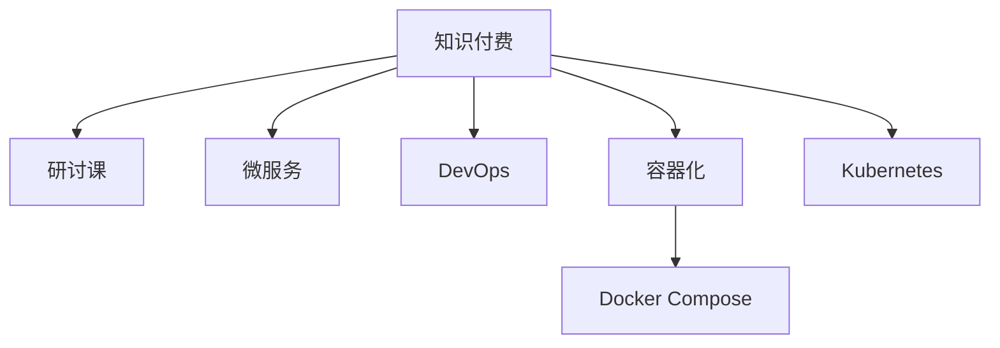

                 

# 程序员知识付费：打造研讨课模式

## 1. 背景介绍

在数字化浪潮席卷全球的当下，知识付费成为了一种新兴的学习方式。尤其在IT行业，技术人员通过在线课程、研讨会等形式，获取最新技术、学习实战经验，已经变得越来越普遍。然而，现有的知识付费模式多为“视频+PPT”的课程形式，互动性差、反馈不及时，难以真正解决学习者在实践中的问题。

本文将探讨一种新兴的知识付费模式——研讨课（Workshop），通过真实的代码实践和实时互动，帮助学员掌握实战技能，最大化地提升学习效果。

## 2. 核心概念与联系

### 2.1 核心概念概述

为了更好地理解研讨课模式，本节将介绍几个相关核心概念：

- **知识付费**：指通过付费方式获取特定知识和技能的学习方式，广泛应用于IT、教育、金融等多个领域。知识付费能够提升学习效率、节约学习时间，同时为优质内容提供更多发展空间。

- **研讨课（Workshop）**：指以真实场景下的问题解决为核心，通过互动式教学和代码实践，帮助学员深入理解和掌握技术知识和解决实际问题的模式。与传统的课程相比，研讨课更强调实操、互动和即时反馈，能够有效提升学习者的动手能力和问题解决能力。

- **微服务（Microservices）**：指将应用拆分为一组小型、松耦合的服务，每个服务独立部署、运行和扩展，从而提高系统的灵活性、可维护性和可扩展性。

- **DevOps**：指将软件开发和运维流程进行整合，形成持续集成（CI）、持续交付（CD）、持续监控（CM）等高效协作的机制，提升开发和运维的自动化水平和协作效率。

- **容器化（Containerization）**：指将应用程序及其依赖打包到容器（如Docker）中，实现软件在跨平台、跨环境下的快速部署和运行。

- **Docker Compose**：是Docker官方提供的一款工具，能够定义和运行多个Docker容器，简化多容器应用的编排和管理。

- **Kubernetes（K8s）**：是一种容器编排系统，能够自动化运维集群中的容器化应用，支持多节点、高可用、自恢复等特性。

这些核心概念之间的逻辑关系可以通过以下Mermaid流程图来展示：



这个流程图展示了这个体系中各个概念的相互关系：

1. 知识付费是整个体系的基础，为后续研讨课、微服务、DevOps等实践提供了价值支撑。
2. 研讨课是知识付费的一种具体实现方式，强调实操和互动，帮助学员深度掌握技术。
3. 微服务、DevOps和容器化是应用层面的具体实践，通过这些技术手段，提升了系统的灵活性和协作效率。
4. Docker Compose和Kubernetes是容器化实践中的重要工具，通过它们实现了多容器应用的编排和管理。

## 3. 核心算法原理 & 具体操作步骤

### 3.1 算法原理概述

研讨课模式的核心在于通过真实的代码实践和实时互动，帮助学员解决实际问题。其基本原理如下：

1. **课程设计**：基于真实场景，设计一系列具有代表性的问题，供学员在课程中解决。
2. **代码实践**：通过编写代码、调试问题，实现对问题的解决。
3. **互动交流**：通过线上线下相结合的方式，实时解答学员问题，促进知识共享和经验交流。
4. **成果展示**：学员提交解决方案，并通过项目评审，获得反馈和改进意见。

### 3.2 算法步骤详解

以下将详细介绍研讨课的具体操作步骤：

**Step 1: 课程规划与准备**

- 收集真实场景下的问题案例，进行分类和优先级排序。
- 根据问题复杂度，设计课程时长和难度，确保学员有足够的时间解决问题。
- 准备必要的工具和资源，如开发环境、文档、案例等。

**Step 2: 线上线下结合**

- 通过视频、PPT等形式进行课程导入，介绍问题背景和目标。
- 提供在线互动平台，供学员提问和交流。
- 在指定时间进行线上直播，解答学员问题，引导问题解决思路。

**Step 3: 代码实践**

- 提供代码示例和思路提示，供学员参考。
- 要求学员在指定时间内编写代码，并提交到平台进行评审。
- 评审通过后，进行代码讲解和优化。

**Step 4: 互动与反馈**

- 通过线上平台，实时收集学员反馈和问题，进行答疑。
- 组织线上或线下的项目评审会议，进行项目展示和评价。
- 根据评审意见，进一步优化解决方案，并进行最终展示。

**Step 5: 持续学习与改进**

- 建立课程社区，供学员交流和分享经验。
- 定期收集反馈，优化课程内容和教学方法。
- 不断更新案例和问题，保持课程的时效性和实用性。

### 3.3 算法优缺点

研讨课模式相较于传统知识付费模式，具有以下优点：

1. **实践性强**：通过真实场景下的代码实践，能够帮助学员更好地理解和掌握技术。
2. **互动性强**：实时互动和交流，能够及时解决学员的问题，提升学习效果。
3. **灵活性高**：可根据学员反馈，灵活调整课程内容和教学方法。
4. **可扩展性强**：课程内容和问题可以不断更新，保持课程的时效性和实用性。

同时，这种模式也存在一些局限：

1. **成本较高**：相比传统的课程视频，研讨课需要更多的互动和在线平台支持，成本较高。
2. **依赖教师**：教师的质量和经验直接影响课程效果，需要不断提升教师的师资力量。
3. **时间限制**：课程时长有限，难以深入覆盖所有问题。

尽管如此，研讨课模式在提升学员动手能力和问题解决能力方面具有独特的优势，未来有望成为知识付费市场的重要组成部分。

### 3.4 算法应用领域

研讨课模式广泛应用于软件开发、系统运维、项目管理等多个领域。以下是一些典型应用场景：

- **软件开发**：通过解决实际编码问题，帮助学员掌握编程语言和框架的使用。
- **系统运维**：通过解决系统故障和性能问题，提升学员的系统运维能力和问题解决能力。
- **项目管理**：通过解决项目规划和执行问题，提升学员的项目管理和团队协作能力。

除了上述这些场景外，研讨课还可以应用于更多的技术领域，帮助学员掌握实战技能，提升职业竞争力。

## 4. 数学模型和公式 & 详细讲解 & 举例说明

### 4.1 数学模型构建

本节将使用数学语言对研讨课模式进行更加严格的刻画。

假设研讨课中存在N个问题，每个问题对应的解决方案为 $x_i \in X$，其中 $X$ 为解决方案空间。问题与解决方案之间的映射关系为 $f: X \rightarrow Y$，其中 $Y$ 为问题解决结果空间。课程的目标是最大化 $f(x)$ 的准确性和鲁棒性。

### 4.2 公式推导过程

以软件开发中的编码问题为例，设问题 $p$ 对应的解决方案为 $x_p$，其代码实现为 $c_p$，对应的编译器输出为 $o_p$。则问题解决过程的数学模型为：

$$
\max_{x_p} f(x_p) = \max_{x_p} \frac{o_p}{c_p}
$$

其中，$o_p$ 为编译器输出，$c_p$ 为编译器输入（即代码），$f(x_p)$ 为代码质量评估函数。

### 4.3 案例分析与讲解

在实际应用中，可以设计一个在线编码问题研讨会，邀请程序员实时在线解决特定编码问题。具体步骤如下：

1. 设计一个示例编码问题，包含输入数据、预期输出和问题描述。
2. 在研讨会上，实时演示代码实现和问题解决思路，供学员参考。
3. 学员在线编写代码，并实时提交到平台进行评审。
4. 评审通过后，进行代码讲解和优化，并进行最终展示。
5. 根据学员反馈，不断优化课程内容和教学方法。

## 5. 项目实践：代码实例和详细解释说明

### 5.1 开发环境搭建

在进行研讨课实践前，我们需要准备好开发环境。以下是使用Python进行Django开发的Web应用程序的环境配置流程：

1. 安装Anaconda：从官网下载并安装Anaconda，用于创建独立的Python环境。

2. 创建并激活虚拟环境：
```bash
conda create -n myproject python=3.8 
conda activate myproject
```

3. 安装Django：
```bash
pip install django
```

4. 安装第三方库：
```bash
pip install Pillow django-bleach django-heroku djangorestframework
```

5. 安装数据库：
```bash
pip install psycopg2-binary
```

完成上述步骤后，即可在`myproject`环境中开始开发Web应用程序。

### 5.2 源代码详细实现

下面是一个简单的在线编程练习的Django Web应用程序的实现示例：

```python
from django.http import HttpResponse
from django.views.decorators.csrf import csrf_exempt
from django.http import JsonResponse

@csrf_exempt
def solve(request):
    if request.method == 'POST':
        code = request.POST.get('code')
        input_data = request.POST.get('input_data')
        expected_output = request.POST.get('expected_output')
        if code and input_data and expected_output:
            result = execute_code(code, input_data)
            if result == expected_output:
                return JsonResponse({'success': True})
            else:
                return JsonResponse({'success': False, 'error': 'Code not correct'})
        else:
            return JsonResponse({'success': False, 'error': 'Invalid input'})
    else:
        return HttpResponse("Method not allowed")
```

其中，`execute_code`函数用于执行代码并返回执行结果：

```python
import subprocess

def execute_code(code, input_data):
    command = 'python -c ' + code
    result = subprocess.Popen(command, stdin=subprocess.PIPE, stdout=subprocess.PIPE, stderr=subprocess.PIPE, universal_newlines=True).communicate()[0]
    return result
```

### 5.3 代码解读与分析

让我们再详细解读一下关键代码的实现细节：

**Django视图函数**：
- 定义了一个名为`solve`的视图函数，用于处理POST请求。
- 在POST请求中，获取代码、输入数据和预期输出。
- 调用`execute_code`函数执行代码，并返回执行结果。
- 如果代码执行结果与预期输出相同，则返回成功；否则返回失败，并提供错误信息。

**execute_code函数**：
- 定义了一个名为`execute_code`的函数，用于执行Python代码并返回执行结果。
- 使用`subprocess`模块执行代码，将输入数据作为标准输入，并将输出结果返回。
- 注意使用`universal_newlines=True`参数，确保在Windows系统中也能正确处理字符串输入和输出。

这个示例代码实现了简单的在线编程练习功能，供研讨课使用。实际应用中，还需要考虑代码安全性、性能优化、用户体验等问题。

### 5.4 运行结果展示

运行上述代码后，即可在Django应用中访问在线编程练习页面。例如，访问`http://localhost:8000/solve`，输入代码、输入数据和预期输出，即可进行在线编程练习。

## 6. 实际应用场景

### 6.1 软件开发

在软件开发领域，研讨课模式可以用于解决各种编码问题，帮助学员掌握编程语言和框架的使用。例如，可以通过研讨课解决实际的编码问题，如编写高效率的代码、优化算法、实现复杂功能等。通过在线互动和实时指导，帮助学员深入理解和掌握技术。

### 6.2 系统运维

系统运维是一个复杂且多变的领域，许多问题需要通过实际操作和调试来解决。研讨课模式可以用于解决各种系统故障和性能问题，提升学员的系统运维能力和问题解决能力。例如，可以通过研讨课解决系统崩溃、性能瓶颈、安全漏洞等问题，提升学员的系统运维能力。

### 6.3 项目管理

项目管理是一个需要多方协作的复杂过程，许多问题需要通过团队协作来解决。研讨课模式可以用于解决各种项目管理问题，提升学员的项目管理和团队协作能力。例如，可以通过研讨课解决项目规划、执行、监控等问题，提升学员的项目管理和团队协作能力。

### 6.4 未来应用展望

随着研讨课模式的不断发展，其在更多领域中的应用前景将更加广阔。未来，研讨课模式有望成为知识付费市场的重要组成部分，推动IT行业的知识共享和技术传播。

在智慧城市治理中，研讨课模式可以用于解决各种智能设备和系统集成问题，提升智慧城市的管理水平和应用效果。

在智能制造领域，研讨课模式可以用于解决各种智能设备和系统集成问题，提升智能制造的自动化和智能化水平。

在医疗健康领域，研讨课模式可以用于解决各种智能设备和系统集成问题，提升医疗健康服务的智能化水平和应用效果。

除了上述这些场景外，研讨课模式还可以应用于更多的技术领域，帮助学员掌握实战技能，提升职业竞争力。

## 7. 工具和资源推荐

### 7.1 学习资源推荐

为了帮助开发者系统掌握研讨课模式，这里推荐一些优质的学习资源：

1. **Django官方文档**：提供了Django框架的详细文档和示例代码，帮助开发者快速上手开发Web应用程序。

2. **Django Rest Framework官方文档**：提供了Django Rest Framework的详细文档和示例代码，帮助开发者快速上手开发RESTful API。

3. **Django Heroku官方文档**：提供了Django应用在Heroku上部署的详细文档和示例代码，帮助开发者快速上手部署Django应用。

4. **Python Web开发教程**：提供了Python Web开发的详细教程和示例代码，帮助开发者系统掌握Python Web开发技术。

5. **Django实战项目**：提供了Django实战项目的详细文档和示例代码，帮助开发者快速上手开发实际项目。

通过对这些资源的学习实践，相信你一定能够快速掌握研讨课模式的精髓，并用于解决实际的IT问题。

### 7.2 开发工具推荐

高效的开发离不开优秀的工具支持。以下是几款用于Web应用程序开发的常用工具：

1. **Visual Studio Code**：一款轻量级的代码编辑器，支持多种编程语言和插件，适合Web开发使用。

2. **Git**：一款分布式版本控制系统，适合版本控制和代码管理，广泛应用于Web开发。

3. **Docker**：一款容器化平台，支持应用在跨平台、跨环境下的快速部署和运行，适合Web应用的容器化部署。

4. **Kubernetes**：一款容器编排系统，支持多节点、高可用、自恢复等特性，适合Web应用的集群管理和部署。

5. **Jupyter Notebook**：一款交互式编程环境，支持Python、R等多种编程语言，适合在线编程和数据科学开发。

合理利用这些工具，可以显著提升Web应用程序的开发效率，加快创新迭代的步伐。

### 7.3 相关论文推荐

研讨课模式的发展源于学界的持续研究。以下是几篇奠基性的相关论文，推荐阅读：

1. **《Real-Time Collaborative Programming for Massive Programming Courses》**：提出了一种实时协作编程平台，支持多个学员同时在线编程和协作，提升学习效果。

2. **《Code Collaboration: Supporting Group Programming and Virtual Programming》**：提出了一种支持协作编程的工具和方法，提升学员的团队协作能力。

3. **《A Survey of Programming Environments》**：总结了多种编程环境的优缺点，为开发者选择适合的编程环境提供了参考。

4. **《Cloud-Based Collaborative Programming: A Survey》**：总结了云环境下协作编程的最新研究进展，为开发者提供更多选择和参考。

这些论文代表了大语言模型微调技术的发展脉络。通过学习这些前沿成果，可以帮助研究者把握学科前进方向，激发更多的创新灵感。

## 8. 总结：未来发展趋势与挑战

### 8.1 总结

本文对研讨课模式进行了全面系统的介绍。首先阐述了研讨课模式的背景和意义，明确了其在提升学员动手能力和问题解决能力方面的独特价值。其次，从原理到实践，详细讲解了研讨课的具体操作步骤，给出了研讨课任务开发的完整代码实例。同时，本文还探讨了研讨课模式在软件开发、系统运维、项目管理等多个领域的应用前景，展示了研讨课模式的巨大潜力。最后，本文精选了研讨课模式的各类学习资源和开发工具，力求为开发者提供全方位的技术指引。

通过本文的系统梳理，可以看到，研讨课模式正在成为知识付费市场的重要组成部分，极大地提升了IT学习者的动手能力和问题解决能力。未来，随着研讨课模式的不断发展，其在更多领域中的应用前景将更加广阔，为IT行业的知识共享和技术传播注入新的活力。

### 8.2 未来发展趋势

展望未来，研讨课模式将呈现以下几个发展趋势：

1. **平台化发展**：研讨课模式将逐步平台化，形成类似MOOC（大规模开放在线课程）的在线学习平台，提供更多课程和教学资源。

2. **实时互动**：通过在线互动平台和实时视频会议等技术手段，增强课堂的互动性和即时反馈。

3. **内容丰富**：将更多实际问题和技术挑战纳入课程内容，提升课程的实用性和挑战性。

4. **团队协作**：引入团队协作机制，通过分组讨论、项目合作等方式，提升学员的团队协作能力。

5. **跨领域融合**：与其他学科和技术领域进行融合，形成跨学科、跨领域的综合性研讨课，提升学员的跨领域能力和综合素质。

6. **国际化拓展**：将研讨课模式推广到国际市场，提升全球范围内的知识共享和技术传播效果。

以上趋势凸显了研讨课模式的广阔前景。这些方向的探索发展，必将进一步提升研讨课的效果和应用范围，为IT学习者提供更加丰富的学习资源和更高效的学习方式。

### 8.3 面临的挑战

尽管研讨课模式已经取得了瞩目成就，但在迈向更加智能化、普适化应用的过程中，它仍面临诸多挑战：

1. **资源投入高**：相较于传统的课程视频，研讨课需要更多的互动和在线平台支持，成本较高。

2. **教师质量**：教师的质量和经验直接影响课程效果，需要不断提升教师的师资力量。

3. **技术门槛**：部分学员可能对技术有较高门槛，需要提供更多的技术支持和指导。

4. **时间限制**：课程时长有限，难以深入覆盖所有问题。

尽管如此，研讨课模式在提升学员动手能力和问题解决能力方面具有独特的优势，未来有望成为知识付费市场的重要组成部分。

### 8.4 研究展望

面对研讨课模式所面临的种种挑战，未来的研究需要在以下几个方面寻求新的突破：

1. **智能化技术**：引入人工智能技术，如自然语言处理、语音识别等，提升课堂的互动性和即时反馈。

2. **虚拟现实技术**：引入虚拟现实技术，创建沉浸式的学习环境，提升学员的参与感和体验感。

3. **云计算技术**：利用云计算技术，提供高性能、低成本的计算和存储资源，支持大规模的研讨课开发和部署。

4. **社会化网络**：引入社会化网络技术，构建学习社区和知识共享平台，促进学员之间的交流和协作。

5. **实时数据分析**：引入数据分析技术，实时监测和分析课堂互动数据，优化教学效果和课程内容。

这些研究方向的探索，必将引领研讨课模式向更高的台阶发展，为IT学习者提供更加丰富、高效、便捷的学习体验。总之，研讨课模式需要在技术和内容上进行持续优化，才能真正实现知识付费的价值，推动IT行业的知识共享和技术传播。

