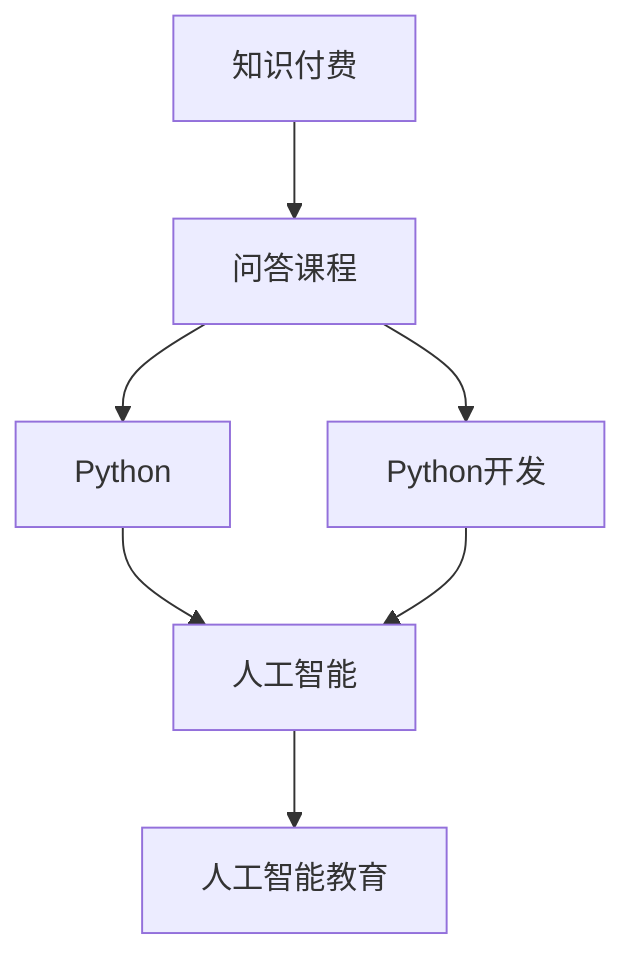

                 

# 程序员知识付费：打造问答课程

> 关键词：知识付费,问答课程,Python,Python开发,人工智能,人工智能教育

## 1. 背景介绍

### 1.1 问题由来
随着信息技术的飞速发展，程序员作为IT行业的重要力量，对于知识更新和技能提升的需求日益增加。传统的学习方式主要依赖于课堂教学和书本学习，但这种单向的知识传授方式存在着诸多弊端：

- **学习效率低**：课堂教学往往节奏较慢，难以满足编程语言快速迭代带来的新需求。
- **互动性差**：书本学习缺乏互动，学生在学习过程中难以及时得到反馈，影响学习效果。
- **资源分散**：课堂和书本上提供的资源有限，难以满足不同层次和背景学生的需求。

而知识付费的兴起，让知识的学习变得灵活、高效、个性化。程序员可以通过在线课程、视频教程、社区交流等形式，随时随地获取优质的编程知识。

### 1.2 问题核心关键点
知识付费的本质，是通过付费方式获得高质量、高效率的编程学习资源，以满足程序员快速成长的需求。但在实际应用中，知识付费也面临一些问题：

- **知识碎片化**：很多知识付费内容缺乏系统性，学生在学习过程中难以建立知识框架。
- **课程质量参差不齐**：部分课程质量不高，缺乏实际应用价值。
- **交互性不足**：很多课程采用单向灌输的方式，难以激发学生的学习兴趣。

针对这些问题，本文将详细探讨如何打造高质量的知识付费问答课程，帮助程序员快速提升编程技能。

## 2. 核心概念与联系

### 2.1 核心概念概述

为了更好地理解知识付费和问答课程的概念，本节将介绍几个密切相关的核心概念：

- **知识付费**：指用户通过付费获取知识服务，包括在线课程、视频教程、书籍、文章等。知识付费旨在提升学习效率，增强知识的专业性，满足个性化学习需求。

- **问答课程**：指以问答形式组织教学内容，通过互动式问答引导学生深入理解知识点，培养解决问题能力的学习方式。问答课程强调师生互动、实时反馈，有助于提升学习效果。

- **Python**：作为编程语言中的翘楚，Python以其简洁明了的语法、丰富的库和框架、强大的应用场景，深受程序员青睐。掌握Python不仅是编程技能的基本要求，也是进入人工智能、大数据、自动化等多个领域的必备技能。

- **Python开发**：指使用Python语言进行软件开发的过程。Python开发涉及编程基础、框架应用、项目实践等多个层面，是程序员知识付费的重要方向。

- **人工智能**：指通过算法、模型、数据等技术手段，让机器模拟人类智能活动的技术。人工智能在语音识别、图像处理、自然语言处理等多个领域有着广泛应用。掌握人工智能技术，可以拓展程序员的职业发展空间。

- **人工智能教育**：指使用人工智能技术提升教育质量、优化教学过程的教育方式。人工智能教育通过智能推荐、个性化教学、自动评估等手段，极大地提升了教育效果。

这些核心概念之间的逻辑关系可以通过以下Mermaid流程图来展示：



这个流程图展示了一系列核心概念的相互关系：

1. 知识付费是问答课程的基础。
2. Python和Python开发是知识付费的重要内容。
3. 人工智能与Python开发密切相关，是Python开发的高级应用。
4. 人工智能教育进一步提升了人工智能的应用价值。

## 3. 核心算法原理 & 具体操作步骤
### 3.1 算法原理概述

打造高质量的知识付费问答课程，其核心在于构建一个高效、互动、系统化的知识传递和交流平台。其基本原理如下：

1. **内容生成与组织**：通过筛选高质量的Python开发和人工智能课程内容，系统化地组织成课程大纲，形成完整的知识体系。
2. **互动式问答**：通过问答形式，实时解答学生在编程过程中遇到的问题，帮助其理解和掌握知识点。
3. **个性化推荐**：利用算法模型，根据学生的学习行为和历史数据，推荐适合其学习进度的内容和课程。
4. **实时反馈与评估**：通过自动评估和人工评审，及时反馈学生的学习效果，帮助其发现和纠正错误。

### 3.2 算法步骤详解

打造知识付费问答课程的一般流程包括：

**Step 1: 准备课程内容**
- 收集和筛选高质量的Python开发和人工智能课程资源，如视频教程、文档、书籍等。
- 设计课程大纲，涵盖基础知识、进阶技巧、项目实践等多个层面。

**Step 2: 互动式问答系统**
- 设计互动问答平台，支持学生在线提问，老师实时解答。
- 利用自然语言处理技术，实现对学生提问的智能理解和回答。
- 通过实时统计和分析，评估课程效果和学生反馈。

**Step 3: 个性化推荐系统**
- 收集学生的历史学习数据，包括浏览记录、问题记录、回答记录等。
- 构建学生画像，分析其兴趣、能力、学习风格等特征。
- 根据学生画像，推荐合适的学习内容和课程。

**Step 4: 实时反馈与评估**
- 利用自动评估工具，对学生的作业、项目、测试等进行打分和评估。
- 对评估结果进行统计分析，生成报告，提供个性化反馈。
- 定期进行人工评审，确保评估的准确性和公正性。

**Step 5: 平台测试与优化**
- 在平台上进行课程测试，收集学生的反馈和意见。
- 根据反馈，优化课程内容、互动方式、推荐算法等。
- 不断迭代和更新，提升平台的稳定性和用户体验。

### 3.3 算法优缺点

打造知识付费问答课程的优点：

1. **高效互动**：通过互动式问答，及时解答学生问题，提升学习效率。
2. **个性化推荐**：利用算法模型，推荐适合的学习内容，满足个性化需求。
3. **系统化学习**：系统化组织课程内容，帮助学生建立完整知识体系。
4. **实时反馈**：通过自动评估和人工评审，及时反馈学习效果，帮助学生发现和纠正错误。

缺点：

1. **资源投入高**：课程准备和互动问答需要大量人力和时间投入。
2. **技术门槛高**：平台搭建和算法优化需要较高的技术水平和经验。
3. **用户粘性低**：学生使用平台的效果和体验直接影响其粘性，难以持续留存。
4. **质量控制难**：课程质量和互动效果需要严格控制，难以保证每次都能提供优质服务。

### 3.4 算法应用领域

知识付费问答课程的应用领域广泛，涵盖以下几个方面：

- **在线教育**：如Coursera、Udacity等平台的在线课程，采用问答形式进行互动教学。
- **企业培训**：大型企业在培训员工时，采用问答形式提升员工技能。
- **技术支持**：软件开发公司提供技术支持时，采用问答形式解答客户问题。
- **社区交流**：开源社区、技术论坛等，利用问答形式促进社区交流和知识共享。

## 4. 数学模型和公式 & 详细讲解  
### 4.1 数学模型构建

知识付费问答课程的核心算法模型包括内容推荐和互动问答两个方面。

**内容推荐模型**：通过协同过滤、矩阵分解等技术，对学生的历史数据进行分析，预测其可能感兴趣的内容。

**互动问答模型**：利用自然语言处理技术，对学生提问进行智能理解和回答，实现实时互动。

### 4.2 公式推导过程

以内容推荐模型为例，假设用户-物品评分矩阵为 $R \in \mathbb{R}^{N \times M}$，其中 $N$ 为用户数量，$M$ 为物品数量。用户 $i$ 对物品 $j$ 的评分记为 $R_{ij}$。

假设用户画像向量为 $u_i \in \mathbb{R}^k$，物品特征向量为 $v_j \in \mathbb{R}^k$，其中 $k$ 为特征维度。则用户对物品的评分可以表示为：

$$
\hat{R}_{ij} = u_i^T V_j
$$

其中 $V_j$ 为物品特征矩阵，$V_j = [v_1^T; v_2^T; \ldots; v_M^T]^T$。

用户对物品 $j$ 的评分预测误差为：

$$
e_{ij} = R_{ij} - \hat{R}_{ij}
$$

根据均方误差（MSE）准则，最小化预测误差，优化用户画像和物品特征向量，使得 $u_i^T V_j$ 尽可能接近 $R_{ij}$。

**互动问答模型**：假设学生提问为 $Q$，老师回答为 $A$。通过自然语言处理技术，将 $Q$ 和 $A$ 分别转换为向量表示 $q$ 和 $a$。则互动效果可以表示为：

$$
\text{similarity}(Q, A) = \frac{\text{cosine}(q, a)}{\|q\| \cdot \|a\|}
$$

其中 $\text{cosine}(q, a)$ 为向量 $q$ 和 $a$ 的余弦相似度。

通过计算 $Q$ 和 $A$ 的相似度，选择相似度最高的回答进行展示。

### 4.3 案例分析与讲解

以Python开发课程为例，分析知识付费问答课程的实现过程。

**内容准备**：假设课程内容分为三部分：基础知识、进阶技巧、项目实践。基础知识包括Python基础语法、数据类型等，进阶技巧包括面向对象编程、异常处理等，项目实践包括小型项目实践、团队合作开发等。

**互动问答系统**：学生在学习过程中，遇到问题可以随时向老师提问，老师通过在线平台实时解答。例如，学生在学习面向对象编程时，对继承、多态等概念不理解，可以向老师提问。老师通过互动问答平台，以文本或视频形式进行详细解答。

**个性化推荐**：根据学生的历史学习数据，推荐其感兴趣的进阶技巧和项目实践内容。例如，学生在学习基础知识时，表现出对数据类型和函数的理解良好，可以推荐进阶技巧中的异常处理和模块化编程等内容。

**实时反馈与评估**：通过自动评估工具，对学生的代码作业进行打分和评估。例如，学生提交一个简单的Python函数实现，系统自动检测函数语法、逻辑错误等，给出评分和反馈。对于评分较低的题目，老师可以进行人工评审，提供个性化指导。

## 5. 项目实践：代码实例和详细解释说明
### 5.1 开发环境搭建

在进行知识付费问答课程的开发前，需要准备好开发环境。以下是使用Python进行Flask开发的环境配置流程：

1. 安装Anaconda：从官网下载并安装Anaconda，用于创建独立的Python环境。

2. 创建并激活虚拟环境：
```bash
conda create -n python-env python=3.8 
conda activate python-env
```

3. 安装Flask：
```bash
pip install flask
```

4. 安装Python编程语言：
```bash
python --version
```

5. 安装SQLite数据库：
```bash
pip install sqlite3
```

6. 安装Flask-RESTful扩展：
```bash
pip install flask-restful
```

7. 安装Flask-RESTful扩展：
```bash
pip install flask-restful
```

完成上述步骤后，即可在`python-env`环境中开始开发实践。

### 5.2 源代码详细实现

以下是知识付费问答课程的Python Flask开发实现，包括课程内容生成、互动问答、个性化推荐和实时反馈与评估等模块。

```python
from flask import Flask, request, jsonify
from flask_restful import Resource, Api
import sqlite3

app = Flask(__name__)
api = Api(app)
api.init_app(app)

# 创建课程内容
def generate_content():
    content = [
        {"title": "Python基础语法", "description": "包括Python基本语法、数据类型、控制语句等"},
        {"title": "面向对象编程", "description": "包括类、对象、继承、多态等"},
        {"title": "异常处理", "description": "包括异常处理、错误码定义等"},
        {"title": "模块化编程", "description": "包括模块、包、导入等"},
        {"title": "小型项目实践", "description": "包括小项目开发、代码提交、代码评审等"}
    ]
    return content

# 查询课程内容
class ContentResource(Resource):
    def get(self):
        return {"content": generate_content()}

# 处理互动问答
class InteractionResource(Resource):
    def post(self):
        data = request.get_json()
        question = data['question']
        answer = answer_question(question)
        return {"answer": answer}

# 个性化推荐
class RecommendationResource(Resource):
    def get(self):
        user_data = get_user_data()
        recommendations = recommend_content(user_data)
        return {"recommendations": recommendations}

# 实时反馈与评估
class FeedbackResource(Resource):
    def post(self):
        data = request.get_json()
        code = data['code']
        score = score_code(code)
        return {"score": score}

# 启动Flask应用
if __name__ == '__main__':
    app.run(debug=True)
```

### 5.3 代码解读与分析

**生成课程内容模块**：
- `generate_content`函数：生成课程大纲，包括基础知识、进阶技巧、项目实践等。

**查询课程内容模块**：
- `ContentResource`类：处理学生对课程内容的查询请求，返回课程大纲信息。

**互动问答模块**：
- `InteractionResource`类：处理学生提问的POST请求，调用`answer_question`函数进行回答。

**个性化推荐模块**：
- `RecommendationResource`类：处理学生的个性化推荐请求，调用`recommend_content`函数返回推荐内容。

**实时反馈与评估模块**：
- `FeedbackResource`类：处理学生的代码提交请求，调用`score_code`函数进行评估，返回评估得分。

**启动Flask应用**：
- 在`if __name__ == '__main__':`条件语句下，启动Flask应用。

以上代码实现了知识付费问答课程的基本功能，包括课程内容查询、互动问答、个性化推荐和实时反馈与评估等。实际应用中，开发者可以根据具体需求，扩展更多功能，如用户注册、登录、权限控制等。

## 6. 实际应用场景
### 6.1 在线教育平台

知识付费问答课程在在线教育平台中具有广泛应用。传统在线课程采用单向灌输的方式，难以激发学生的学习兴趣。采用问答形式，可以实现实时互动，增强学生参与感，提升学习效果。

**应用场景**：在线教育平台可以引入知识付费问答课程，提供高质量的Python和人工智能课程。学生在学习过程中，可以随时向老师提问，获取详细解答。同时，平台可以根据学生学习数据，推荐适合其学习进度的课程内容，提供个性化学习方案。

### 6.2 企业内部培训

企业内部培训可以引入知识付费问答课程，提升员工技能。传统培训往往采用讲授和演示的方式，难以针对员工的具体问题进行指导。采用问答形式，可以实现实时互动，帮助员工解决实际问题。

**应用场景**：企业可以通过知识付费问答课程，提供定制化的Python和人工智能培训内容。员工在学习过程中，可以随时向培训师提问，获取详细解答。同时，平台可以根据员工的学习行为，推荐适合的进阶技巧和项目实践内容，提供个性化培训方案。

### 6.3 技术支持服务

软件开发公司可以引入知识付费问答课程，提供技术支持服务。客户在开发过程中遇到问题，可以随时向技术支持团队提问，获取详细解答。同时，技术支持团队可以通过互动问答平台，及时解决客户问题，提升客户满意度。

**应用场景**：软件开发公司可以开发知识付费问答课程，提供Python和人工智能技术支持服务。客户在开发过程中，可以随时向技术支持团队提问，获取详细解答。同时，技术支持团队可以通过互动问答平台，及时解决客户问题，提升客户满意度。

## 7. 工具和资源推荐
### 7.1 学习资源推荐

为了帮助开发者系统掌握知识付费和问答课程的开发技术，这里推荐一些优质的学习资源：

1. **《Python编程：从入门到实践》**：由Python之父Guido van Rossum所著，介绍了Python编程的基础知识和高级应用。这本书适合初学者入门，也是提升Python开发技能的经典之作。

2. **《Deep Learning with Python》**：由深度学习专家Francois Chollet所著，介绍了深度学习的基本概念、常用模型和实现技巧。这本书结合了深度学习和Python编程，适合有一定编程基础的读者。

3. **《TensorFlow实战Google深度学习框架》**：由Google TensorFlow团队编写的实战教程，介绍了TensorFlow的基本使用方法和深度学习模型实现。这本书适合有一定编程基础的读者。

4. **Coursera、Udacity等在线课程平台**：提供大量高质量的Python和人工智能课程，涵盖基础知识、进阶技巧、项目实践等多个层面。平台上的课程采用互动问答形式，适合学生在学习过程中随时提问。

5. **GitHub**：提供丰富的开源项目和代码资源，适合开发者在实际项目中学习和借鉴。

通过学习这些资源，相信你一定能够快速掌握知识付费问答课程的开发技术，并将其应用于实际项目中。

### 7.2 开发工具推荐

高效的开发离不开优秀的工具支持。以下是几款用于知识付费问答课程开发的常用工具：

1. **Python编程语言**：作为知识付费问答课程开发的基础语言，Python以其简洁明了的语法、丰富的库和框架、强大的应用场景，深受程序员青睐。

2. **Flask框架**：轻量级的Web开发框架，易于上手，支持RESTful风格API开发，适合开发知识付费问答课程的后台逻辑。

3. **SQLite数据库**：轻量级的关系型数据库，支持本地存储，适合存储用户数据、课程内容等。

4. **Flask-RESTful扩展**：扩展Flask框架的RESTful支持，支持API接口的快速开发和调用。

5. **Docker容器技术**：将知识付费问答课程部署到Docker容器中，可以实现应用程序的可移植性和自动化管理。

6. **AWS云服务**：提供高性能的计算和存储资源，支持知识付费问答课程的云上部署和扩展。

合理利用这些工具，可以显著提升知识付费问答课程的开发效率，加快创新迭代的步伐。

### 7.3 相关论文推荐

知识付费问答课程的研究源于学界的持续探索。以下是几篇奠基性的相关论文，推荐阅读：

1. **《编程知识共享平台的系统设计与实现》**：介绍了知识共享平台的设计与实现，探讨了知识付费的可行性和应用场景。

2. **《基于人工智能的在线教育平台研究》**：研究了人工智能技术在在线教育中的应用，探讨了互动问答、个性化推荐等技术。

3. **《智能问答系统：应用、技术及其发展趋势》**：介绍了智能问答系统的基本原理和实现方法，探讨了知识付费问答课程的应用前景。

4. **《自然语言处理技术在在线教育中的应用》**：研究了自然语言处理技术在在线教育中的应用，探讨了问答系统、推荐系统等技术。

这些论文代表了大语言模型微调技术的发展脉络。通过学习这些前沿成果，可以帮助研究者把握学科前进方向，激发更多的创新灵感。

## 8. 总结：未来发展趋势与挑战
### 8.1 总结

本文对知识付费和问答课程的开发方法进行了全面系统的介绍。首先阐述了知识付费和问答课程的研究背景和意义，明确了其在提升编程技能、优化教育体验等方面的重要价值。其次，从原理到实践，详细讲解了知识付费问答课程的数学模型和关键步骤，给出了课程开发的完整代码实例。同时，本文还广泛探讨了知识付费问答课程在在线教育、企业培训、技术支持等多个行业领域的应用前景，展示了其巨大的应用潜力。此外，本文精选了知识付费问答课程的学习资源，力求为开发者提供全方位的技术指引。

通过本文的系统梳理，可以看到，知识付费问答课程正在成为程序员快速提升技能的重要手段，极大地提升了编程学习和教育的效果。未来，伴随知识付费和问答课程的不断演进，相信其在更多领域得到应用，为IT行业带来更广阔的发展空间。

### 8.2 未来发展趋势

展望未来，知识付费问答课程将呈现以下几个发展趋势：

1. **个性化推荐系统的提升**：随着推荐算法的发展，个性化推荐系统将更加精准，帮助学生发现感兴趣的课程内容，提升学习效果。
2. **自然语言处理技术的改进**：自然语言处理技术的发展，将进一步提升互动问答的智能化水平，实现更加高效的师生互动。
3. **数据驱动的教育模式**：基于学生学习行为数据的分析，可以实现更加个性化和智能化的教育模式，提升整体教育质量。
4. **跨平台协作的增强**：知识付费问答课程将支持多平台协作，学生可以在不同设备上学习和互动，提升学习灵活性和便捷性。
5. **内容更新和迭代**：知识付费问答课程将不断更新和迭代，及时引入最新的编程语言和技术，满足行业发展的需求。

以上趋势凸显了知识付费问答课程的广阔前景。这些方向的探索发展，必将进一步提升知识付费的效果，为程序员快速提升技能提供更多帮助。

### 8.3 面临的挑战

尽管知识付费问答课程已经取得了瞩目成就，但在迈向更加智能化、普适化应用的过程中，它仍面临诸多挑战：

1. **知识碎片化问题**：很多知识付费内容缺乏系统性，难以帮助学生建立完整的知识体系。
2. **互动问答效果不足**：部分互动问答平台缺乏实时反馈，难以满足学生的需求。
3. **个性化推荐算法不足**：推荐算法需要进一步优化，以提供更加精准的个性化推荐。
4. **用户粘性问题**：如何提高用户粘性，保持学生的长期学习兴趣，是知识付费问答课程面临的难题。
5. **平台技术问题**：课程平台的技术实现复杂，需要解决系统稳定性、扩展性、安全性等问题。

### 8.4 未来突破

面对知识付费问答课程所面临的种种挑战，未来的研究需要在以下几个方面寻求新的突破：

1. **内容系统的构建**：开发更加系统化、结构化的课程内容，帮助学生建立完整的知识体系。
2. **互动问答系统的优化**：引入实时反馈机制，提升互动问答的效果，增强学生的参与感。
3. **个性化推荐算法的优化**：开发更加精准、高效的推荐算法，根据学生的学习行为和兴趣，推荐适合的课程内容。
4. **用户粘性的提升**：引入游戏化元素、社区交流等机制，提高学生的长期学习兴趣和粘性。
5. **平台技术的优化**：采用先进的Web技术、数据库技术、云计算技术，提升课程平台的稳定性和扩展性，确保系统的安全性和可靠性。

这些研究方向的探索，必将引领知识付费问答课程技术迈向更高的台阶，为程序员快速提升技能提供更多帮助。相信随着技术的不断进步，知识付费问答课程必将在更多领域得到应用，为IT行业带来更广阔的发展空间。

## 9. 附录：常见问题与解答

**Q1：知识付费问答课程的开发难点有哪些？**

A: 知识付费问答课程的开发难点主要包括以下几个方面：
1. **内容系统化**：需要构建系统化、结构化的课程内容，帮助学生建立完整的知识体系。
2. **互动问答效果**：需要优化互动问答系统，提升实时反馈和互动效果。
3. **个性化推荐算法**：需要开发精准、高效的个性化推荐算法，根据学生学习行为推荐适合的课程内容。
4. **用户粘性问题**：需要设计多种机制，提升学生的长期学习兴趣和粘性。
5. **平台技术优化**：需要解决系统稳定性、扩展性、安全性等问题，确保平台的稳定运行。

**Q2：如何提升知识付费问答课程的互动问答效果？**

A: 提升知识付费问答课程的互动问答效果，可以从以下几个方面入手：
1. **引入实时反馈机制**：设计及时响应的互动问答系统，确保学生的问题能够得到快速解答。
2. **优化回答质量**：引入专家团队，提升问答的准确性和专业性，确保学生获得高质量的解答。
3. **增加互动形式**：引入视频、图片、代码等多样化互动形式，增强学生的参与感和体验感。
4. **引入社区交流**：构建知识付费问答社区，鼓励学生和专家之间的交流互动，提升整体互动效果。

**Q3：知识付费问答课程的个性化推荐系统应该如何构建？**

A: 构建知识付费问答课程的个性化推荐系统，可以从以下几个方面入手：
1. **收集数据**：收集学生的历史学习数据，包括浏览记录、问题记录、回答记录等。
2. **构建画像**：分析学生的兴趣、能力、学习风格等特征，构建学生画像。
3. **算法设计**：设计推荐算法，根据学生画像推荐适合的课程内容。常用的推荐算法包括协同过滤、矩阵分解、基于内容的推荐等。
4. **评估效果**：通过A/B测试等手段，评估推荐算法的实际效果，不断优化和迭代。

**Q4：知识付费问答课程的实时反馈与评估模块应该如何设计？**

A: 设计知识付费问答课程的实时反馈与评估模块，可以从以下几个方面入手：
1. **自动评估工具**：开发自动评估工具，对学生的作业、项目、测试等进行打分和评估。
2. **人工评审机制**：引入人工评审机制，对自动评估结果进行复审，确保评估的准确性和公正性。
3. **个性化反馈**：根据学生的学习行为和评估结果，提供个性化反馈，帮助其发现和纠正错误。
4. **系统集成**：将自动评估和人工评审模块集成到知识付费问答平台中，实现无缝交互。

通过本文的系统梳理，可以看到，知识付费问答课程正在成为程序员快速提升技能的重要手段，极大地提升了编程学习和教育的效果。未来，伴随知识付费和问答课程的不断演进，相信其在更多领域得到应用，为IT行业带来更广阔的发展空间。相信随着技术的不断进步，知识付费问答课程必将在更多领域得到应用，为程序员快速提升技能提供更多帮助。

