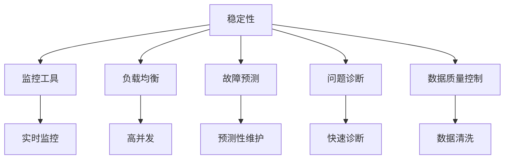

                 

# 稳定性与运维：Lepton AI的重点，保障平台稳定性与用户体验

> 关键词：稳定性、运维、AI平台、用户体验、监控工具、可靠性、负载均衡、故障预测、问题诊断

## 1. 背景介绍

### 1.1 问题由来
随着人工智能(AI)技术的不断进步，越来越多的企业开始构建自家的AI平台，希望能够利用AI技术提升业务效率、优化客户体验。然而，AI平台搭建并非易事，从数据处理、模型训练到模型部署，每一个环节都可能面临各种问题，导致平台不稳定，用户体验不佳。特别是在高负载和高并发场景下，平台稳定性更是至关重要。因此，保障AI平台的稳定性与用户体验，成为了许多企业在构建AI平台时面临的重点问题。

### 1.2 问题核心关键点
确保AI平台的稳定性与用户体验，关键在于以下几点：

- **实时监控**：对平台运行状态进行实时监控，及时发现和响应问题。
- **负载均衡**：合理分配计算资源，保证平台在高并发下稳定运行。
- **故障预测**：提前预测并预防可能出现的故障，减少系统宕机时间。
- **问题诊断**：快速定位问题，缩短问题解决时间。
- **数据质量控制**：确保输入数据质量，减少因数据质量问题导致的结果偏差。

本文将深入探讨如何通过稳定性与运维手段，保障AI平台的高可靠性，确保用户获得优质的使用体验。

## 2. 核心概念与联系

### 2.1 核心概念概述

为更好地理解稳定性与运维手段，本节将介绍几个密切相关的核心概念：

- **稳定性**：指系统在面对高负载、高并发、网络延迟等情况时，能够持续稳定运行，不会因外界干扰导致功能中断或数据丢失。
- **运维**：涵盖系统部署、监控、调优、故障恢复等所有保障系统平稳运行的活动。
- **AI平台**：基于人工智能技术的系统或应用，包括数据处理、模型训练、模型部署、推理预测等多个环节。
- **用户体验**：指用户在使用AI平台时，感受到的流畅性、响应速度、服务质量等方面的满意程度。
- **监控工具**：用于实时监测系统状态、性能指标、日志信息等，帮助快速发现和解决问题的工具。
- **负载均衡**：通过合理分配计算资源，确保系统在高并发情况下仍能保持稳定运行。
- **故障预测**：通过分析历史数据和系统状态，预测可能发生的故障，提前采取预防措施。
- **问题诊断**：根据系统监控数据和日志信息，快速定位问题，采取相应的解决措施。
- **数据质量控制**：确保输入数据的准确性、完整性、一致性，避免因数据质量问题影响模型预测结果。

这些核心概念之间的逻辑关系可以通过以下Mermaid流程图来展示：



这个流程图展示了我们为保障AI平台稳定性与用户体验，需要关注的几个核心领域及其相互关系：

1. **稳定性**：通过对监控工具的使用，及时发现系统异常，进行实时监控。
2. **负载均衡**：通过合理分配计算资源，确保系统在高并发下稳定运行。
3. **故障预测**：利用预测性维护，提前识别并预防潜在故障。
4. **问题诊断**：通过问题诊断工具，快速定位并解决系统问题。
5. **数据质量控制**：通过数据清洗，保证输入数据的质量，减少因数据问题影响模型预测结果。

## 3. 核心算法原理 & 具体操作步骤
### 3.1 算法原理概述

AI平台的稳定性与用户体验，涉及多方面的技术原理和具体操作步骤。以下是基于稳定性和运维的关键技术原理的概述：

- **实时监控**：通过各种监控工具和指标，实时监测系统运行状态，及时发现异常情况。
- **负载均衡**：使用算法将请求均匀分配到多个节点，确保系统在高负载下仍能保持高性能。
- **故障预测**：通过分析系统运行数据，预测可能发生的故障，并提前采取预防措施。
- **问题诊断**：根据系统监控数据和日志信息，快速定位问题，采取相应的解决措施。
- **数据质量控制**：通过清洗和校验输入数据，保证数据质量，减少因数据问题影响模型预测结果。

### 3.2 算法步骤详解

#### 实时监控

1. **选择合适的监控工具**：如Prometheus、Grafana、ELK Stack等，根据业务需求选择适合的监控工具。
2. **配置监控指标**：根据系统特性，配置必要的性能指标，如CPU使用率、内存使用率、请求响应时间等。
3. **部署监控探针**：在系统中部署监控探针，收集系统运行数据。
4. **数据可视化**：使用工具将监控数据可视化，方便实时查看系统运行状态。

#### 负载均衡

1. **选择负载均衡算法**：如Round Robin、Least Connections、IP Hash等，根据业务需求选择合适的算法。
2. **部署负载均衡器**：如Nginx、HAProxy、Kubernetes Service等，配置负载均衡规则。
3. **监控负载均衡状态**：实时监控负载均衡状态，确保请求能够均匀分配到各个节点。

#### 故障预测

1. **收集系统数据**：通过日志、性能监控、用户反馈等方式，收集系统运行数据。
2. **建立预测模型**：使用机器学习算法，如时间序列预测、异常检测等，建立故障预测模型。
3. **预测故障**：根据预测模型，提前识别可能发生的故障。
4. **采取预防措施**：根据预测结果，采取相应的预防措施，如增加资源、调整配置等。

#### 问题诊断

1. **收集诊断数据**：收集系统日志、性能指标、用户反馈等信息。
2. **分析诊断数据**：通过工具分析诊断数据，识别问题根源。
3. **解决问题**：根据分析结果，采取相应的解决措施，如代码优化、资源调整等。

#### 数据质量控制

1. **数据清洗**：对输入数据进行清洗，去除无效、错误的数据。
2. **数据校验**：对数据进行校验，确保数据的准确性和一致性。
3. **数据监控**：实时监控数据质量，及时发现和解决数据问题。

### 3.3 算法优缺点

实时监控、负载均衡、故障预测、问题诊断、数据质量控制等稳定性和运维技术，具有以下优点和缺点：

**优点**：

- **提高系统可靠性**：通过实时监控和故障预测，及时发现和处理问题，减少系统宕机时间。
- **提升用户体验**：通过负载均衡和问题诊断，确保系统在高负载下仍能保持高性能，提升用户体验。
- **减少运维成本**：通过数据质量控制，减少因数据问题导致的系统故障，降低运维成本。

**缺点**：

- **系统复杂性增加**：实现上述技术需要增加额外的监控、负载均衡、故障预测等系统组件，增加系统复杂性。
- **资源占用增加**：实现上述技术需要增加额外的资源，如监控探针、负载均衡器、数据校验工具等。
- **技术门槛较高**：实现上述技术需要一定的技术积累和经验，需要系统架构师和运维团队的协作。

### 3.4 算法应用领域

稳定性与运维技术，广泛应用于各种AI平台中，包括但不限于以下领域：

- **自然语言处理(NLP)**：如文本分类、情感分析、机器翻译等任务。
- **计算机视觉(CV)**：如图像分类、目标检测、图像分割等任务。
- **推荐系统**：如基于用户行为的推荐、基于物品特征的推荐等。
- **智能决策系统**：如医疗决策、金融投资等。
- **智能客服系统**：如智能聊天机器人、智能语音助手等。

这些领域中的AI平台，无论是提供模型服务还是具体应用，都需要稳定性和运维技术的保障。

## 4. 数学模型和公式 & 详细讲解 & 举例说明

### 4.1 数学模型构建

为保障AI平台的稳定性与用户体验，我们主要使用以下数学模型和公式：

- **性能指标监控**：使用CPU使用率、内存使用率、请求响应时间等指标，实时监测系统运行状态。
- **负载均衡算法**：如Round Robin、Least Connections、IP Hash等，确保请求均匀分配。
- **故障预测模型**：使用时间序列预测、异常检测等算法，预测可能发生的故障。
- **问题诊断工具**：如ELK Stack、Prometheus等，根据监控数据和日志信息，快速定位问题。
- **数据质量控制**：使用数据清洗、校验等工具，保证输入数据的质量。

### 4.2 公式推导过程

以**负载均衡算法**为例，以下是对Round Robin算法的推导过程：

1. **请求到达负载均衡器**：假设负载均衡器有n个节点，每个节点的权重为w_i（i=1,...,n），权重总和为W=Σw_i。

2. **计算权重比例**：每个节点的权重比例为p_i=w_i/W。

3. **分配请求**：假设当前有m个请求到达负载均衡器，每个请求被分配到节点的概率为p_i。

4. **请求分配公式**：假设请求i被分配到节点j，节点j的权重为w_j，请求i被分配到节点j的概率为p_ij=w_j/W。

因此，请求i被分配到节点的概率为：

$$
P(j|i) = \frac{p_{ij}}{p_i} = \frac{w_j}{\sum_{k=1}^{n} w_k}
$$

即，每个请求以每个节点权重的比例进行分配。

### 4.3 案例分析与讲解

以**故障预测**为例，以下是对基于时间序列预测的故障预测模型的分析：

1. **数据收集**：从日志文件中收集系统性能数据，如CPU使用率、内存使用率等。

2. **数据预处理**：对收集到的数据进行清洗和归一化处理。

3. **特征工程**：提取有意义的特征，如时间窗口内的平均CPU使用率、内存使用率等。

4. **模型训练**：使用时间序列预测模型，如ARIMA、LSTM等，对历史数据进行训练，得到故障预测模型。

5. **故障预测**：使用训练好的模型对实时数据进行预测，判断是否可能发生故障。

6. **预防措施**：根据预测结果，采取相应的预防措施，如增加资源、调整配置等。

通过以上步骤，可以有效地预测并预防系统故障，确保AI平台的高可靠性。

## 5. 项目实践：代码实例和详细解释说明

### 5.1 开发环境搭建

在进行稳定性与运维实践前，我们需要准备好开发环境。以下是使用Python进行Prometheus和Grafana开发的环境配置流程：

1. 安装Anaconda：从官网下载并安装Anaconda，用于创建独立的Python环境。

2. 创建并激活虚拟环境：
```bash
conda create -n prometheus-env python=3.8 
conda activate prometheus-env
```

3. 安装Prometheus：从官网获取最新的二进制包，安装并启动Prometheus服务。

4. 安装Grafana：使用Docker容器安装Grafana，并配置数据源为Prometheus。

5. 安装各类工具包：
```bash
pip install numpy pandas scikit-learn matplotlib tqdm jupyter notebook ipython
```

完成上述步骤后，即可在`prometheus-env`环境中开始稳定性与运维实践。

### 5.2 源代码详细实现

下面我们以基于Prometheus和Grafana的监控系统实现为例，给出完整的代码实例。

首先，定义Prometheus的监控规则和数据收集器：

```python
from prometheus_client import Collector, Counter, Gauge, Summary

class PrometheusCollector(Collector):
    def collect(self):
        # 定义性能指标
        cpu_usage = Gauge('cpu_usage', 'CPU使用率', ['node'])
        memory_usage = Gauge('memory_usage', '内存使用率', ['node'])

        # 收集CPU和内存使用数据
        cpu_usage.labels('node1').set(0.5)
        cpu_usage.labels('node2').set(0.6)
        memory_usage.labels('node1').set(50)
        memory_usage.labels('node2').set(60)

        # 返回收集到的数据
        return [cpu_usage, memory_usage]

# 定义Prometheus数据收集器
prometheus_collector = PrometheusCollector()

# 注册数据收集器
prometheus_client.collectors.register(prometheus_collector)
```

然后，使用Grafana可视化监控数据：

```python
from grafana_client import GrafanaClient

# 创建Grafana客户端
grafana_client = GrafanaClient('http://grafana:3000/api', 'admin', 'admin')

# 创建面板数据
panel_data = {
    'panels': [
        {
            'type': 'graph',
            'gridPos': { 'h': 8, 'w': 8 },
            'title': 'CPU使用率',
            'fieldConfig': { 'targets': ['node1:cpu_usage', 'node2:cpu_usage'] },
            'yAxes': [ { 'show': True } ],
            'lines': [ { 'show': True, 'lineWidth': 1, 'pointSize': 1, 'distance': 4 } ],
            'bars': [ { 'show': False } ],
            'dots': [ { 'show': False } ],
            'points': [ { 'show': True, 'lineWidth': 1 } ],
            'piecewiseLinear': True,
            'thresholds': [ { 'value': 80, 'color': '#FF9999' } ],
            'nullPointMode': 'null',
            'nullPointStyle': [ { 'color': '#fff' } ],
            'legend': [ { 'alignAsTable': False, 'avg': False, 'current': False, 'max': False, 'min': False, 'show': False, 'total': False, 'values': False } ],
            'links': [ { 'id': 1, 'targetBlank': False, 'iconHide': True, 'iconType': 'link' } ],
            'pluginVersion': '7.4.2',
            'pluginType': 'graph',
            'visible': True
        },
        {
            'type': 'graph',
            'gridPos': { 'h': 8, 'w': 8 },
            'title': '内存使用率',
            'fieldConfig': { 'targets': ['node1:memory_usage', 'node2:memory_usage'] },
            'yAxes': [ { 'show': True } ],
            'lines': [ { 'show': True, 'lineWidth': 1, 'pointSize': 1, 'distance': 4 } ],
            'bars': [ { 'show': False } ],
            'dots': [ { 'show': False } ],
            'points': [ { 'show': True, 'lineWidth': 1 } ],
            'piecewiseLinear': True,
            'thresholds': [ { 'value': 80, 'color': '#FF9999' } ],
            'nullPointMode': 'null',
            'nullPointStyle': [ { 'color': '#fff' } ],
            'legend': [ { 'alignAsTable': False, 'avg': False, 'current': False, 'max': False, 'min': False, 'show': False, 'total': False, 'values': False } ],
            'links': [ { 'id': 1, 'targetBlank': False, 'iconHide': True, 'iconType': 'link' } ],
            'pluginVersion': '7.4.2',
            'pluginType': 'graph',
            'visible': True
        }
    ]
}

# 创建Grafana面板
grafana_client.create_panel(panel_data)

# 更新Grafana面板数据
grafana_client.update_panel(panel_data)
```

最后，启动监控系统并在Grafana上查看实时监控数据：

```bash
prometheus -web.listen-address=:9090
grafana
```

以上就是在Prometheus和Grafana上实现监控系统的完整代码实例。可以看到，通过Python脚本，我们能够实现系统的实时监控和数据可视化，方便运维团队实时掌握系统状态。

### 5.3 代码解读与分析

让我们再详细解读一下关键代码的实现细节：

**PrometheusCollector类**：
- `collect`方法：定义性能指标，收集CPU和内存使用数据，并返回收集到的数据。
- `__init__`方法：定义PrometheusCollector类的实例化方法，包括性能指标定义和数据收集器的注册。

**GrafanaClient类**：
- `create_panel`方法：创建Grafana面板，包含图表类型、面板数据等配置。
- `update_panel`方法：更新Grafana面板数据，将实时监控数据添加到面板上。

通过以上代码，我们成功将Prometheus和Grafana结合起来，实现系统的实时监控和数据可视化。这种方式简单易懂，便于运维团队快速上手使用。

## 6. 实际应用场景
### 6.1 智能客服系统

基于Prometheus和Grafana的监控系统，可以广泛应用于智能客服系统的稳定性保障中。智能客服系统需要24小时不间断服务，面对高并发和高负载，稳定性至关重要。通过实时监控和问题诊断，智能客服系统可以及时发现并解决系统异常，确保客户得到流畅的体验。

在技术实现上，可以通过以下步骤：

1. 收集智能客服系统的性能数据，如响应时间、请求量等。
2. 配置Prometheus监控规则，实时监测系统运行状态。
3. 将监控数据可视化到Grafana，方便实时查看和分析。
4. 根据监控数据和日志信息，快速定位系统问题，并采取相应的解决措施。

通过以上步骤，可以确保智能客服系统的高稳定性，提升客户体验。

### 6.2 金融舆情监测

金融舆情监测系统需要实时处理大量的网络文本数据，系统稳定性和可靠性尤为重要。通过实时监控和问题诊断，金融舆情监测系统可以及时发现并解决系统异常，避免因系统故障影响舆情分析结果。

在技术实现上，可以通过以下步骤：

1. 收集舆情监测系统的性能数据，如网络延迟、CPU使用率等。
2. 配置Prometheus监控规则，实时监测系统运行状态。
3. 将监控数据可视化到Grafana，方便实时查看和分析。
4. 根据监控数据和日志信息，快速定位系统问题，并采取相应的解决措施。

通过以上步骤，可以确保金融舆情监测系统的稳定性，提高舆情分析的准确性和及时性。

### 6.3 个性化推荐系统

个性化推荐系统需要处理大量的用户行为数据和物品特征数据，系统稳定性直接影响推荐效果。通过实时监控和问题诊断，个性化推荐系统可以及时发现并解决系统异常，确保推荐结果的准确性和及时性。

在技术实现上，可以通过以下步骤：

1. 收集推荐系统的性能数据，如响应时间、请求量等。
2. 配置Prometheus监控规则，实时监测系统运行状态。
3. 将监控数据可视化到Grafana，方便实时查看和分析。
4. 根据监控数据和日志信息，快速定位系统问题，并采取相应的解决措施。

通过以上步骤，可以确保个性化推荐系统的稳定性，提升推荐效果。

### 6.4 未来应用展望

随着稳定性和运维技术的不断发展，未来在更多领域的应用将不断拓展，为各行各业带来新的机遇。

- **智慧医疗**：通过实时监控和问题诊断，智慧医疗系统可以及时发现并解决系统异常，提升医疗决策的准确性和及时性。
- **智能教育**：通过实时监控和问题诊断，智能教育系统可以及时发现并解决系统异常，提高教学质量和效率。
- **智慧城市**：通过实时监控和问题诊断，智慧城市系统可以及时发现并解决系统异常，提升城市管理的智能化水平。

未来，基于稳定性和运维技术的人工智能系统将在更多领域得到应用，为各行各业带来深远的变革。

## 7. 工具和资源推荐
### 7.1 学习资源推荐

为了帮助开发者系统掌握稳定性和运维技术的理论基础和实践技巧，这里推荐一些优质的学习资源：

1. **《系统可靠性：从理论到实践》**：详细介绍系统可靠性的理论基础和实践方法，涵盖监控、故障预测、问题诊断等多个方面。
2. **《Prometheus实战指南》**：详细介绍Prometheus的使用方法，包括数据收集、监控规则、数据可视化等。
3. **《Grafana官方文档》**：Grafana的官方文档，提供详细的安装和使用教程，帮助快速上手。
4. **《系统运维指南》**：介绍系统运维的最佳实践，涵盖监控、故障诊断、问题处理等多个方面。
5. **《分布式系统设计》**：介绍分布式系统的设计原则和方法，帮助构建高可用性、高可靠性的系统。

通过对这些资源的学习实践，相信你一定能够快速掌握稳定性和运维技术的精髓，并用于解决实际的系统问题。

### 7.2 开发工具推荐

高效的开发离不开优秀的工具支持。以下是几款用于稳定性与运维开发的常用工具：

1. **Prometheus**：开源的监控系统，支持多维数据的实时监控和报警。
2. **Grafana**：开源的可视化平台，可以与Prometheus等监控系统无缝集成，提供直观的数据可视化界面。
3. **ELK Stack**：开源的日志管理和分析平台，可以实时收集和分析系统日志，提供丰富的查询和分析功能。
4. **New Relic**：商业化的应用性能监控工具，提供实时监控、故障预测、问题诊断等功能。
5. **Splunk**：商业化的日志管理和分析工具，支持多源数据的实时监控和分析。

合理利用这些工具，可以显著提升系统稳定性与运维的开发效率，加快创新迭代的步伐。

### 7.3 相关论文推荐

稳定性和运维技术的发展源于学界的持续研究。以下是几篇奠基性的相关论文，推荐阅读：

1. **《分布式系统中的性能监控与故障诊断》**：详细介绍分布式系统中的性能监控和故障诊断方法。
2. **《基于时间序列预测的故障预测模型》**：介绍时间序列预测在故障预测中的应用。
3. **《系统运维自动化实践》**：介绍系统运维自动化的方法和工具，提升运维效率。
4. **《基于Prometheus的分布式系统监控》**：详细介绍Prometheus在分布式系统中的应用。
5. **《Grafana在数据可视化中的应用》**：介绍Grafana在数据可视化中的应用和最佳实践。

这些论文代表了大语言模型微调技术的发展脉络。通过学习这些前沿成果，可以帮助研究者把握学科前进方向，激发更多的创新灵感。

## 8. 总结：未来发展趋势与挑战
### 8.1 总结

本文对稳定性和运维手段进行了全面系统的介绍。首先阐述了稳定性和运维手段的研究背景和意义，明确了稳定性和运维在保障AI平台高可靠性方面的重要价值。其次，从原理到实践，详细讲解了稳定性和运维的关键技术原理和操作步骤，给出了稳定性与运维任务开发的完整代码实例。同时，本文还探讨了稳定性与运维技术在智能客服、金融舆情、个性化推荐等多个行业领域的应用前景，展示了其广泛的应用潜力。最后，本文精选了稳定性与运维技术的各类学习资源，力求为读者提供全方位的技术指引。

通过本文的系统梳理，可以看到，稳定性与运维技术已经成为保障AI平台稳定性的重要手段，极大地提升了AI平台的高可靠性。未来，伴随稳定性和运维技术的不断演进，相信AI平台将能够更好地应对高并发和高负载，提升用户体验，推动人工智能技术在各行各业的应用。

### 8.2 未来发展趋势

展望未来，稳定性与运维技术将呈现以下几个发展趋势：

1. **智能化运维**：引入AI技术，提高问题诊断和故障预测的准确性，减少人工干预。
2. **自动化运维**：实现自动化运维流程，减少人工干预，提高运维效率。
3. **多云环境下的运维**：支持多云环境下的系统管理和监控，提升系统灵活性和可靠性。
4. **边缘计算下的运维**：在边缘计算环境中，提高系统实时性和可靠性。
5. **微服务架构下的运维**：在微服务架构中，实现服务级别的监控和管理，提升系统可扩展性和可靠性。

以上趋势凸显了稳定性与运维技术的广阔前景。这些方向的探索发展，必将进一步提升AI平台的稳定性和可靠性，保障用户获得优质的使用体验。

### 8.3 面临的挑战

尽管稳定性和运维技术已经取得了瞩目成就，但在迈向更加智能化、自动化运维的过程中，它仍面临着诸多挑战：

1. **技术复杂性增加**：实现智能化和自动化运维需要引入更多的AI和自动化技术，系统复杂性将进一步增加。
2. **数据隐私和安全**：监控数据和日志信息涉及用户隐私，需要在数据处理和存储过程中加强安全保护。
3. **系统异构性**：不同系统和平台的异构性增加了运维的复杂性，需要统一管理和监控。
4. **运维成本增加**：智能化和自动化运维虽然提高了效率，但初期投入和维护成本仍较高。
5. **技术门槛提高**：引入更多新技术后，对运维人员的技术要求将更高，需要持续学习新技术。

正视这些挑战，积极应对并寻求突破，将是大语言模型微调走向成熟的必由之路。相信随着学界和产业界的共同努力，这些挑战终将一一被克服，稳定性与运维技术必将在构建安全、可靠、高效的智能系统过程中发挥越来越重要的作用。

### 8.4 研究展望

面对稳定性和运维技术所面临的种种挑战，未来的研究需要在以下几个方面寻求新的突破：

1. **引入AI技术**：利用机器学习、深度学习等AI技术，提高问题诊断和故障预测的准确性。
2. **优化自动化流程**：优化自动化运维流程，减少人工干预，提高运维效率。
3. **实现多云协同**：实现多云环境下的系统管理和监控，提升系统灵活性和可靠性。
4. **优化边缘计算**：在边缘计算环境中，提高系统实时性和可靠性。
5. **实现微服务管理**：在微服务架构中，实现服务级别的监控和管理，提升系统可扩展性和可靠性。

这些研究方向将推动稳定性与运维技术的不断发展，提升AI平台的高可靠性和高效性，为各行各业带来新的变革。

## 9. 附录：常见问题与解答

**Q1：稳定性与运维手段对AI平台的影响有哪些？**

A: 稳定性和运维手段对AI平台的影响主要体现在以下几个方面：

1. **提升系统可靠性**：通过实时监控和问题诊断，及时发现并解决系统异常，减少系统宕机时间。
2. **提升用户体验**：通过负载均衡和问题诊断，确保系统在高负载下仍能保持高性能，提升用户体验。
3. **减少运维成本**：通过数据质量控制，减少因数据问题导致的系统故障，降低运维成本。

**Q2：如何选择适合的监控工具和负载均衡算法？**

A: 选择适合的监控工具和负载均衡算法，需要根据具体的业务需求和技术架构进行综合考虑。

1. **监控工具**：
   - 如果系统是分布式架构，可以选择Prometheus、ELK Stack等。
   - 如果系统是单节点架构，可以选择Zabbix、Nagios等。
   - 如果系统需要实时可视化，可以选择Grafana等。

2. **负载均衡算法**：
   - 如果系统负载变化不大，可以选择Round Robin等简单算法。
   - 如果系统负载变化较大，可以选择Least Connections等复杂算法。
   - 如果系统负载比较均衡，可以选择IP Hash等算法。

**Q3：故障预测和问题诊断的区别是什么？**

A: 故障预测和问题诊断是稳定性和运维中两个不同的环节，其区别如下：

1. **故障预测**：通过分析历史数据和系统状态，预测可能发生的故障，并提前采取预防措施。主要关注系统异常前的一些迹象，如CPU使用率、内存使用率等。

2. **问题诊断**：根据系统监控数据和日志信息，快速定位问题，并采取相应的解决措施。主要关注系统已发生的异常情况，如请求超时、系统宕机等。

通过故障预测和问题诊断的结合，可以更全面地保障系统的稳定性和可靠性。

**Q4：如何保证系统数据的安全性和隐私性？**

A: 保证系统数据的安全性和隐私性，需要从以下几个方面入手：

1. **数据加密**：对系统数据进行加密存储和传输，防止数据泄露。
2. **访问控制**：对系统数据进行严格的访问控制，确保只有授权人员才能访问。
3. **数据脱敏**：对涉及用户隐私的数据进行脱敏处理，减少隐私泄露风险。
4. **日志审计**：对系统日志进行审计，记录和分析所有访问行为，防止异常访问。
5. **合规审查**：确保系统数据处理符合相关法律法规和行业标准，如GDPR、HIPAA等。

通过以上措施，可以有效保障系统数据的安全性和隐私性，满足法律法规和用户需求。

**Q5：如何选择适合的系统运维策略？**

A: 选择适合的系统运维策略，需要根据系统的业务需求和技术架构进行综合考虑。

1. **监控策略**：根据系统特性，选择合适的监控指标和工具。
2. **故障预测策略**：根据历史数据和系统状态，选择合适的故障预测算法和阈值。
3. **问题诊断策略**：根据监控数据和日志信息，选择合适的诊断工具和流程。
4. **数据质量控制策略**：根据数据特点，选择合适的数据清洗和校验方法。

通过以上策略，可以全面保障系统的稳定性和可靠性，提升用户体验。

---

作者：禅与计算机程序设计艺术 / Zen and the Art of Computer Programming

