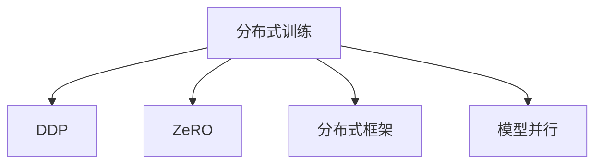

                 

# 第10章 分布式优化 DDP与ZeRO

## 1. 背景介绍

### 1.1 问题由来

深度学习（Deep Learning, DL）技术的迅速发展，极大促进了图像识别、自然语言处理、语音识别等多个领域的突破。然而，尽管模型的精度不断提升，训练复杂度也随之增长，大规模训练任务开始变得既耗时又耗力。

特别是对于复杂模型（如基于Transformer的NLP模型、大规模图像识别模型等），训练过程需要大量的GPU资源，同时复杂的优化过程往往需要数十小时甚至数天才能完成。这极大地限制了大模型在生产环境中的应用。

为了解决这一问题，研究者提出了分布式优化算法，如DDP（Distributed Data Parallel）和ZeRO（Zero-Redundancy Optimization）。这些算法利用多机多卡并行加速训练过程，显著提升训练效率，同时保持了模型精度。

## 2. 核心概念与联系

### 2.1 核心概念概述

为了更好地理解分布式优化算法DDP和ZeRO，本节将介绍几个密切相关的核心概念：

- **分布式训练**：利用多台计算机或多块GPU对模型参数进行并行更新，提高训练速度。
- **DDP**：一种经典的分布式优化算法，通过将所有mini-batch的梯度平均化，实现参数跨设备同步更新。
- **ZeRO**：一种基于零冗余优化策略，通过将梯度聚合并直接用于参数更新，避免不必要的模型同步，提高分布式训练效率。
- **分布式框架**：如TensorFlow、PyTorch、Horovod等，为分布式训练提供底层支持。
- **模型并行**：将模型分解成多个部分，分别在不同的设备上进行训练。

这些核心概念之间的逻辑关系可以通过以下Mermaid流程图来展示：



这个流程图展示了大规模深度学习模型训练的核心概念及其之间的关系：

1. 分布式训练通过多机多卡并行，加速训练过程。
2. DDP通过参数跨设备平均化，实现全局梯度同步。
3. ZeRO通过梯度合并，避免不必要的模型同步，提高分布式训练效率。
4. 分布式框架提供了高效的分布式计算能力，支撑分布式训练的实现。
5. 模型并行将模型分解为多个部分，并行化训练过程。

这些概念共同构成了分布式深度学习模型的训练框架，使其能够在大规模数据和复杂模型上进行高效、准确、稳定的训练。

## 3. 核心算法原理 & 具体操作步骤

### 3.1 算法原理概述

DDP和ZeRO算法均基于分布式训练框架，通过多机多卡并行加速模型训练。它们的共同目标是最大化利用计算资源，同时保持模型精度。

- **DDP算法**：基于所有mini-batch的梯度平均化，实现参数跨设备同步更新。每个GPU负责计算本机的梯度，并将梯度传递给中心服务器，中心服务器将所有梯度平均后传递回每个设备，各设备再根据平均梯度更新参数。这种方法简单高效，适用于大多数分布式训练任务。

- **ZeRO算法**：通过梯度合并（Zero-Redundancy）策略，避免不必要的模型同步。每个GPU负责计算本地梯度，并将梯度传递给中心服务器。中心服务器将梯度直接用于参数更新，而不需要进行全局同步。这种方法适用于数据或计算资源严重不平衡的场景，可以显著提高分布式训练的效率。

### 3.2 算法步骤详解

下面详细介绍DDP和ZeRO算法的具体操作步骤：

**DDP算法步骤**：

1. 将模型参数分配到多个设备上。
2. 每个设备从数据集中随机抽取mini-batch，前向传播计算损失函数。
3. 每个设备反向传播计算梯度，并将梯度传递给中心服务器。
4. 中心服务器将所有梯度平均后传递回每个设备。
5. 每个设备根据平均梯度更新模型参数。
6. 重复上述步骤，直至收敛。

**ZeRO算法步骤**：

1. 将模型参数分配到多个设备上。
2. 每个设备从数据集中随机抽取mini-batch，前向传播计算损失函数。
3. 每个设备反向传播计算梯度，并将梯度传递给中心服务器。
4. 中心服务器将梯度直接用于参数更新，而不需要进行全局同步。
5. 重复上述步骤，直至收敛。

### 3.3 算法优缺点

**DDP算法优点**：

- 实现简单，易于调试和优化。
- 适用于大多数分布式训练任务，具有较好的普适性。
- 不需要额外的通信开销，适用于计算资源充足的场景。

**DDP算法缺点**：

- 数据并行过程中，每个设备计算的数据量相同，难以充分利用计算资源。
- 对于计算资源不平衡的场景，存在通信瓶颈。

**ZeRO算法优点**：

- 避免不必要的模型同步，减少通信开销。
- 适用于数据或计算资源不平衡的场景，提高分布式训练效率。
- 可以并行更新不同设备的参数，最大化利用计算资源。

**ZeRO算法缺点**：

- 需要额外的通信开销，实现复杂。
- 依赖于中心服务器的稳定性，容易出现性能瓶颈。

### 3.4 算法应用领域

DDP和ZeRO算法在大规模深度学习模型的训练中得到了广泛应用。以下是这些算法在实际应用中的几个典型场景：

- **NLP任务**：如BERT、GPT等大规模语言模型的训练，常使用分布式训练框架进行优化。
- **计算机视觉**：如ImageNet大规模图像识别模型的训练，需要并行化大规模数据集的处理。
- **自然语言处理**：如机器翻译、文本摘要等任务，利用分布式训练加速训练过程。
- **强化学习**：如AlphaGo、Reinforcement Learning等，通过分布式训练加速学习过程。

## 4. 数学模型和公式 & 详细讲解 & 举例说明

### 4.1 数学模型构建

DDP和ZeRO算法均基于分布式优化框架，通过多机多卡并行加速训练过程。假设模型参数 $\theta$ 分布在多台设备上，各设备的参数为 $\theta_i$。假设每个设备从数据集中随机抽取 mini-batch $B_i$，前向传播计算损失函数 $L_i(\theta_i, B_i)$。

DDP算法的目标是最小化所有设备的损失函数之和，即：

$$
\min_{\theta_1, \ldots, \theta_n} \sum_{i=1}^n L_i(\theta_i, B_i)
$$

ZeRO算法的目标是最小化所有设备的损失函数之和，即：

$$
\min_{\theta_1, \ldots, \theta_n} \sum_{i=1}^n L_i(\theta_i, B_i)
$$

### 4.2 公式推导过程

DDP算法和ZeRO算法的主要区别在于参数更新方式。DDP算法通过将所有mini-batch的梯度平均化，实现参数跨设备同步更新；而ZeRO算法通过梯度合并，避免不必要的模型同步。

**DDP算法公式**：

$$
\theta_i \leftarrow \theta_i - \eta \frac{1}{N} \sum_{j=1}^N \nabla_{\theta_i} L_j(\theta_j, B_j)
$$

其中 $\eta$ 为学习率，$N$ 为设备总数。

**ZeRO算法公式**：

$$
\theta_i \leftarrow \theta_i - \eta \nabla_{\theta_i} L_i(\theta_i, B_i)
$$

其中 $\eta$ 为学习率。

### 4.3 案例分析与讲解

以下以一个简单的分布式训练场景为例，详细分析DDP和ZeRO算法的应用。

**案例场景**：假设有两个设备 $i=1,2$，模型参数 $\theta_1$ 和 $\theta_2$，每个设备从数据集中随机抽取 mini-batch $B_1$ 和 $B_2$，前向传播计算损失函数 $L_1(\theta_1, B_1)$ 和 $L_2(\theta_2, B_2)$。

**DDP算法应用**：

1. 设备1计算梯度 $\nabla_{\theta_1} L_1(\theta_1, B_1)$ 和 $\nabla_{\theta_2} L_2(\theta_2, B_2)$，并将梯度传递给中心服务器。
2. 中心服务器将两个梯度平均后传递回设备1和设备2。
3. 设备1和设备2根据平均梯度更新模型参数 $\theta_1$ 和 $\theta_2$。

**ZeRO算法应用**：

1. 设备1计算梯度 $\nabla_{\theta_1} L_1(\theta_1, B_1)$ 和 $\nabla_{\theta_2} L_2(\theta_2, B_2)$，并将梯度传递给中心服务器。
2. 中心服务器将两个梯度直接用于更新参数 $\theta_1$ 和 $\theta_2$。
3. 重复上述步骤，直至收敛。

## 5. 项目实践：代码实例和详细解释说明

### 5.1 开发环境搭建

在进行DDP和ZeRO算法实践前，我们需要准备好开发环境。以下是使用PyTorch进行分布式训练的环境配置流程：

1. 安装Anaconda：从官网下载并安装Anaconda，用于创建独立的Python环境。

2. 创建并激活虚拟环境：
```bash
conda create -n pytorch-env python=3.8 
conda activate pytorch-env
```

3. 安装PyTorch：根据CUDA版本，从官网获取对应的安装命令。例如：
```bash
conda install pytorch torchvision torchaudio cudatoolkit=11.1 -c pytorch -c conda-forge
```

4. 安装分布式框架：
```bash
pip install horovod[torch]
```

5. 安装各类工具包：
```bash
pip install numpy pandas scikit-learn matplotlib tqdm jupyter notebook ipython
```

完成上述步骤后，即可在`pytorch-env`环境中开始分布式训练实践。

### 5.2 源代码详细实现

下面以使用Horovod进行DDP和ZeRO算法实现为例，给出PyTorch代码实现。

**DDP算法实现**：

```python
import torch
from torch.distributed import nn, distributed_c10d
from torch.distributed.algorithms.ddp_comm_hooks import get_hook_and_callback
import torch.distributed as dist

# 初始化分布式环境
dist.init_process_group("gloo", rank=dist.get_rank(), world_size=world_size)
device = torch.device("cuda:%d" % dist.get_rank()) # 每个设备的GPU ID

# 定义模型
class Model(nn.Module):
    def __init__(self):
        super(Model, self).__init__()
        self.linear = nn.Linear(10, 10)

    def forward(self, x):
        return self.linear(x)

model = Model().to(device)

# 定义优化器
optimizer = torch.optim.SGD(model.parameters(), lr=0.01)

# DDP算法实现
ddp_model = nn.DistributedDataParallel(model)
criterion = nn.MSELoss()
ddp_model = ddp_model.to(device)

def train_epoch():
    for i in range(epochs):
        for j in range(num_steps):
            output = ddp_model(input_data)
            loss = criterion(output, target)
            optimizer.zero_grad()
            loss.backward()
            optimizer.step()

train_epoch()
```

**ZeRO算法实现**：

```python
import torch
from torch.distributed import nn, distributed_c10d
from torch.distributed.algorithms.ddp_comm_hooks import get_hook_and_callback
import torch.distributed as dist

# 初始化分布式环境
dist.init_process_group("gloo", rank=dist.get_rank(), world_size=world_size)
device = torch.device("cuda:%d" % dist.get_rank()) # 每个设备的GPU ID

# 定义模型
class Model(nn.Module):
    def __init__(self):
        super(Model, self).__init__()
        self.linear = nn.Linear(10, 10)

    def forward(self, x):
        return self.linear(x)

model = Model().to(device)

# 定义优化器
optimizer = torch.optim.SGD(model.parameters(), lr=0.01)

# ZeRO算法实现
criterion = nn.MSELoss()

def train_epoch():
    for i in range(epochs):
        for j in range(num_steps):
            output = model(input_data)
            loss = criterion(output, target)
            optimizer.zero_grad()
            loss.backward()
            optimizer.step()

train_epoch()
```

### 5.3 代码解读与分析

让我们再详细解读一下关键代码的实现细节：

**初始化分布式环境**：
- 使用Horovod库初始化分布式环境，确保所有设备能够互相通信和同步状态。

**DDP算法实现**：
- 使用`nn.DistributedDataParallel`将模型进行DDP封装，实现参数跨设备同步。
- 在每个设备上分别计算梯度，并通过`backward()`函数进行反向传播。

**ZeRO算法实现**：
- 在每个设备上直接计算梯度，并通过`backward()`函数进行反向传播。
- 每个设备上的梯度都是独立的，中心服务器不需要进行额外的同步操作。

**数据输入和输出**：
- 在每个设备上，输入数据和目标标签需要提前分发到对应的设备上。
- 输出数据也需要根据设备的输出进行汇总，再进行模型性能评估。

## 6. 实际应用场景

### 6.1 大模型训练

在大规模深度学习模型的训练中，DDP和ZeRO算法可以显著提高训练效率，减少训练时间。例如，在训练BERT等大规模语言模型时，通过分布式训练，可以将训练时间从数天缩短至数小时。

### 6.2 超大规模数据集处理

对于超大规模数据集，单个GPU或CPU的内存不足以一次性处理所有数据，DDP和ZeRO算法可以通过多机多卡并行，提高数据处理效率，加速模型训练。例如，在ImageNet大规模图像识别任务的训练中，通过分布式训练，可以将处理速度提升至单个设备训练速度的数倍。

### 6.3 多任务并行训练

在多任务训练场景下，每个任务需要独立的模型和数据。DDP和ZeRO算法可以并行训练多个任务，实现多任务并行训练，提高训练效率。例如，在语音识别和图像识别的联合训练中，可以通过分布式训练实现高效的并行训练。

## 7. 工具和资源推荐

### 7.1 学习资源推荐

为了帮助开发者系统掌握分布式优化算法DDP和ZeRO的理论基础和实践技巧，这里推荐一些优质的学习资源：

1. 《深度学习分布式训练》系列博文：深入浅出地介绍了分布式训练的原理、算法和实践，涵盖DDP、ZeRO等经典方法。

2. 《Distributed Deep Learning》课程：斯坦福大学开设的深度学习分布式训练课程，涵盖各种分布式训练算法和优化技术。

3. 《Distributed Deep Learning with PyTorch》书籍：Horovod的官方文档，详细介绍了如何使用Horovod进行分布式训练，包括DDP和ZeRO算法。

4. 《Horovod: Distributed Deep Learning》博文：Horovod的官方博客，提供分布式训练的最佳实践和典型案例。

5. 《Horovod for Distributed Deep Learning》书籍：Horovod的官方文档，涵盖各种分布式训练算法和优化技术。

通过对这些资源的学习实践，相信你一定能够快速掌握分布式优化算法的精髓，并用于解决实际的深度学习问题。

### 7.2 开发工具推荐

高效的开发离不开优秀的工具支持。以下是几款用于分布式训练开发的常用工具：

1. PyTorch：基于Python的开源深度学习框架，灵活动态的计算图，适合快速迭代研究。支持各种分布式训练算法。

2. TensorFlow：由Google主导开发的开源深度学习框架，生产部署方便，适合大规模工程应用。支持各种分布式训练算法。

3. Horovod：适用于TensorFlow、Keras、PyTorch等框架的分布式训练库，支持多种分布式优化算法，包括DDP和ZeRO。

4. MPI4Py：用于Python的MPI库，支持分布式计算，适合并行化的数据处理任务。

5. OpenMPI：开源的消息传递接口（MPI）库，支持分布式计算，适用于大规模并行计算任务。

合理利用这些工具，可以显著提升分布式深度学习模型的开发效率，加快创新迭代的步伐。

### 7.3 相关论文推荐

DDP和ZeRO算法在大规模深度学习模型的训练中得到了广泛应用。以下是几篇奠基性的相关论文，推荐阅读：

1. Accelerating Deep Network Training using Distributed Data Parallelism（DDP）：提出了DDP算法，并详细分析了其优缺点和适用场景。

2. Zero-Redundancy Optimization for Distributed Deep Learning（ZeRO）：提出了ZeRO算法，并详细分析了其优缺点和适用场景。

3. Distributed Training with Distributed Optimizers（Horovod）：详细介绍了Horovod库，包括各种分布式优化算法和实践方法。

4. Distributed Deep Learning with TensorFlow and Horovod（TensorFlow）：详细介绍了TensorFlow的分布式训练框架，并结合Horovod库进行优化。

5. Distributed Deep Learning with PyTorch and Horovod（PyTorch）：详细介绍了PyTorch的分布式训练框架，并结合Horovod库进行优化。

这些论文代表了大规模深度学习模型分布式训练的发展脉络。通过学习这些前沿成果，可以帮助研究者把握学科前进方向，激发更多的创新灵感。

## 8. 总结：未来发展趋势与挑战

### 8.1 总结

本文对分布式优化算法DDP和ZeRO进行了全面系统的介绍。首先阐述了分布式训练、DDP和ZeRO算法的研究背景和意义，明确了这些算法在提升大规模深度学习模型训练效率方面的独特价值。其次，从原理到实践，详细讲解了DDP和ZeRO算法的数学模型和具体操作步骤，给出了实际应用中的完整代码实例。同时，本文还广泛探讨了这些算法在NLP、计算机视觉、自然语言处理等多个领域的应用前景，展示了其在提升训练效率方面的巨大潜力。此外，本文精选了分布式优化的各类学习资源，力求为读者提供全方位的技术指引。

通过本文的系统梳理，可以看到，分布式优化算法DDP和ZeRO在大规模深度学习模型的训练中发挥了重要作用，极大地提升了训练效率，支持了更多复杂模型和数据集的应用。未来，伴随分布式计算能力的不断提升和算法优化的深入，分布式训练技术必将在更多领域得到应用，为深度学习技术的产业化进程提供更强的动力。

### 8.2 未来发展趋势

展望未来，分布式优化算法DDP和ZeRO将呈现以下几个发展趋势：

1. 算法的进一步优化：随着深度学习模型的复杂度不断提升，分布式优化算法也在不断优化，引入更多先进的技术，如混合精度训练、模型并行等，以应对更大规模的模型和数据集。

2. 更高效的通信策略：分布式训练中的通信开销是主要瓶颈之一，未来算法将进一步优化通信策略，减少通信次数，提高通信效率。

3. 多设备多数据并行训练：除了传统的GPU并行外，未来的分布式训练还将支持更多的设备类型，如TPU、FPGA等，实现多设备多数据并行训练，提升训练效率。

4. 分布式超参数优化：未来算法将引入分布式超参数优化方法，优化超参数配置，提升模型性能。

5. 分布式迁移学习：在分布式训练的基础上，引入迁移学习技术，实现跨领域、跨任务的模型迁移。

6. 分布式联邦学习：在保护隐私的前提下，通过分布式联邦学习技术，实现多用户数据联合训练，提升模型效果。

以上趋势凸显了大规模深度学习模型分布式训练的广阔前景。这些方向的探索发展，必将进一步提升分布式训练的效率和效果，推动深度学习技术的落地应用。

### 8.3 面临的挑战

尽管分布式优化算法DDP和ZeRO已经取得了显著成效，但在迈向更加智能化、普适化应用的过程中，它们仍面临诸多挑战：

1. 通信开销瓶颈：分布式训练中的通信开销是主要瓶颈之一，如何减少通信开销，提高通信效率，是未来需要解决的重要问题。

2. 同步瓶颈：虽然DDP算法通过参数跨设备同步更新，但同步过程仍可能导致性能瓶颈，特别是在数据或计算资源不平衡的场景下。

3. 中心服务器故障：ZeRO算法依赖于中心服务器的稳定性，一旦服务器故障，训练过程将中断。

4. 一致性问题：多设备并行训练时，不同设备的输出不一致，如何保证一致性，是未来需要解决的重要问题。

5. 可扩展性：大规模深度学习模型训练需要大量的计算资源，如何实现更大规模的分布式训练，是未来需要解决的重要问题。

6. 数据隐私问题：分布式训练需要共享数据，如何保护数据隐私，防止数据泄露，是未来需要解决的重要问题。

7. 分布式超参数优化：分布式超参数优化方法需要考虑多设备上的超参数配置，实现更加高效的超参数优化，是未来需要解决的重要问题。

以上挑战需要在算法优化、系统设计、数据处理等多个层面进行综合应对，才能实现更大规模、更高效率的分布式训练。相信随着研究者的不断努力，这些挑战终将一一被克服，分布式训练技术必将在更多领域得到应用，为深度学习技术的产业化进程提供更强的动力。

### 8.4 研究展望

面对分布式优化算法DDP和ZeRO所面临的种种挑战，未来的研究需要在以下几个方面寻求新的突破：

1. 探索无通信优化方法：引入先进的技术，如混合精度训练、模型并行等，减少通信开销，提高分布式训练效率。

2. 开发更高效的同步方法：引入更高效的同步策略，如异步分布式优化、分布式模型并行等，实现更高效的分布式训练。

3. 引入数据增强技术：在分布式训练中引入数据增强技术，提高数据利用率，提升模型泛化能力。

4. 引入模型压缩技术：通过模型压缩技术，减少模型参数和通信量，提高分布式训练效率。

5. 引入联邦学习技术：通过分布式联邦学习技术，实现多用户数据联合训练，提升模型效果。

6. 引入分布式模型推理技术：通过分布式模型推理技术，实现高效的多设备推理，提升应用效率。

7. 引入分布式超参数优化技术：通过分布式超参数优化技术，实现高效超参数配置，提升模型性能。

这些研究方向的探索，必将引领分布式优化算法DDP和ZeRO技术的进一步发展，为深度学习技术在更多领域的应用提供更强大的支持。总之，分布式优化算法是深度学习技术迈向大规模应用的关键技术，未来需要在算法优化、系统设计、数据处理等多个层面进行深入研究，才能实现更大规模、更高效率的分布式训练。

## 9. 附录：常见问题与解答

**Q1：DDP和ZeRO算法相比传统的单机单卡训练，有哪些优势？**

A: DDP和ZeRO算法相比传统的单机单卡训练，主要有以下优势：

1. 加速训练过程：DDP和ZeRO算法通过多机多卡并行，显著提高了训练效率，加速了模型训练。

2. 提高资源利用率：DDP和ZeRO算法能够充分利用计算资源，最大化利用GPU/CPU的计算能力。

3. 降低对内存的要求：DDP和ZeRO算法通过减少每个设备的内存使用量，降低了对内存的要求，支持更大规模的数据集。

4. 提高模型的泛化能力：DDP和ZeRO算法通过多设备训练，提高了模型的泛化能力，提升了模型在实际应用中的表现。

5. 支持更复杂的模型训练：DDP和ZeRO算法支持更大规模、更复杂的深度学习模型训练，拓展了深度学习技术的应用边界。

总之，DDP和ZeRO算法通过分布式优化技术，显著提高了深度学习模型的训练效率和效果，为深度学习技术在更多领域的应用提供了更强的支持。

**Q2：在分布式训练中，DDP和ZeRO算法的选择应考虑哪些因素？**

A: 在分布式训练中，DDP和ZeRO算法的选择应考虑以下因素：

1. 计算资源：如果计算资源充足，且数据分布均匀，可以选择DDP算法。

2. 通信开销：如果通信开销是主要瓶颈，可以选择ZeRO算法，减少通信开销。

3. 同步需求：如果不同设备上的模型参数需要同步更新，可以选择DDP算法。

4. 数据分布：如果数据分布不均匀，可以选择ZeRO算法，减少通信开销。

5. 故障容忍：如果中心服务器存在故障风险，可以选择ZeRO算法，避免因中心服务器故障导致的训练中断。

6. 数据隐私：如果数据隐私问题需要特别关注，可以选择ZeRO算法，减少数据传输量。

7. 可扩展性：如果需要支持更大规模的分布式训练，可以选择DDP算法，支持更多的设备类型。

总之，DDP和ZeRO算法的选择应根据具体的训练场景，综合考虑计算资源、通信开销、同步需求、数据分布、故障容忍、数据隐私和可扩展性等因素，选择最适合的算法。

**Q3：DDP和ZeRO算法在实际应用中，有哪些常见问题？**

A: DDP和ZeRO算法在实际应用中，常见问题包括：

1. 通信开销：DDP和ZeRO算法需要频繁的通信操作，容易成为瓶颈，需要优化通信策略。

2. 同步瓶颈：DDP算法需要频繁的参数同步，可能成为性能瓶颈，需要优化同步策略。

3. 中心服务器故障：ZeRO算法依赖于中心服务器的稳定性，一旦服务器故障，训练过程将中断。

4. 一致性问题：多设备并行训练时，不同设备的输出不一致，如何保证一致性，是未来需要解决的重要问题。

5. 可扩展性：大规模深度学习模型训练需要大量的计算资源，如何实现更大规模的分布式训练，是未来需要解决的重要问题。

6. 数据隐私问题：分布式训练需要共享数据，如何保护数据隐私，防止数据泄露，是未来需要解决的重要问题。

7. 分布式超参数优化：分布式超参数优化方法需要考虑多设备上的超参数配置，实现更加高效的超参数优化，是未来需要解决的重要问题。

总之，DDP和ZeRO算法在实际应用中存在诸多挑战，需要在算法优化、系统设计、数据处理等多个层面进行综合应对，才能实现更大规模、更高效率的分布式训练。

**Q4：DDP和ZeRO算法在实际应用中，有哪些典型的场景？**

A: DDP和ZeRO算法在实际应用中，典型的场景包括：

1. 大规模图像识别：如ImageNet大规模图像识别模型的训练，通过分布式训练显著提升训练效率。

2. 自然语言处理：如BERT、GPT等大规模语言模型的训练，通过分布式训练显著提升训练效率。

3. 语音识别：如ResNet等深度学习模型的语音识别训练，通过分布式训练提升训练效率。

4. 推荐系统：如TensorFlow和PyTorch的分布式推荐系统，通过分布式训练提升推荐效果。

5. 医疗图像处理：如TensorFlow的分布式医疗图像处理，通过分布式训练提升模型效果。

6. 金融风控：如TensorFlow的分布式金融风控系统，通过分布式训练提升模型效果。

7. 自动驾驶：如TensorFlow的分布式自动驾驶系统，通过分布式训练提升模型效果。

总之，DDP和ZeRO算法在各类深度学习模型训练中得到了广泛应用，通过分布式优化技术，显著提高了训练效率和效果，支持了更多复杂模型和数据集的应用。

---

作者：禅与计算机程序设计艺术 / Zen and the Art of Computer Programming

