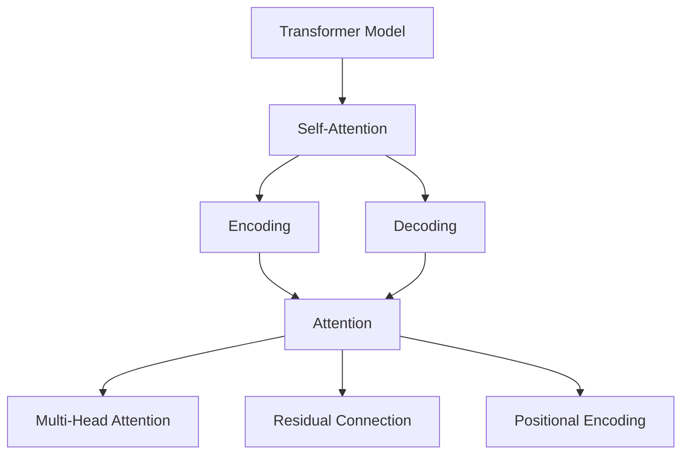

                 

# 第五章：Transformer 架构的革命

> 关键词：Transformer, 自注意力, 语言模型, 深度学习, 神经网络, 自然语言处理

## 1. 背景介绍

### 1.1 问题由来
Transformer 是一种革命性的神经网络架构，由谷歌在 2017 年提出，用于解决传统的循环神经网络 (RNN) 在处理长序列时存在的计算复杂度高、难以并行化的问题。自发布以来，Transformer 架构在自然语言处理 (NLP) 领域取得了巨大的成功，逐步替代了 RNN 成为 NLP 任务的默认选择。

### 1.2 问题核心关键点
Transformer 架构的核心创新在于提出了自注意力机制 (Self-Attention)，使得模型能够高效地处理长序列，并同时兼顾全局和局部的信息。其优势在于：
- 并行化能力强，适合 GPU 和 TPU 等硬件加速
- 模型结构简单，易于实现和训练
- 能够处理大规模语言数据，构建深层次的神经网络
- 在多项 NLP 任务上取得了最佳或接近最佳的结果

### 1.3 问题研究意义
Transformer 架构的提出，标志着深度学习在 NLP 领域的重大突破。它不仅改变了 NLP 的研究范式，也为大规模语言理解和生成模型的设计提供了新的思路。通过学习 Transformer 架构的原理和实现方法，可以深入理解深度学习在处理自然语言任务中的强大能力，为其在更多领域的应用提供技术支撑。

## 2. 核心概念与联系

### 2.1 核心概念概述

为更好地理解 Transformer 架构，本节将介绍几个关键概念：

- Transformer 模型：基于自注意力机制的神经网络架构，用于处理序列数据。包括编码器-解码器结构，用于编码器自注意力、解码器自注意力和注意力机制。

- 自注意力 (Self-Attention)：一种用于处理序列数据的机制，允许模型同时关注序列中的所有位置，捕捉长距离依赖。

- 编码器 (Encoder)：Transformer 模型中的信息提取模块，通过多个堆叠的自注意力层和前馈神经网络层，提取输入序列的语义表示。

- 解码器 (Decoder)：Transformer 模型中的生成模块，通过多个堆叠的自注意力层和前馈神经网络层，生成目标序列。

- 注意力机制 (Attention)：Transformer 中的关键机制，用于计算源序列和目标序列之间的对齐关系，并根据这些对齐关系加权融合源序列信息。

- 多头注意力 (Multi-Head Attention)：将自注意力机制扩展到多个头 (Heads)，增强模型对不同维度的表示能力。

- 残差连接 (Residual Connection)：一种加速深度神经网络训练的机制，用于减少梯度消失和梯度爆炸问题。

- 位置编码 (Positional Encoding)：用于解决自注意力机制无法直接处理序列位置信息的问题，通过在向量嵌入中添加位置编码，使模型能够理解序列中的位置信息。

这些核心概念之间的逻辑关系可以通过以下 Mermaid 流程图来展示：



这个流程图展示了几大核心概念及其之间的关系：

1. Transformer 模型通过编码器和解码器模块，实现序列数据的编码和生成。
2. 自注意力机制是模型的核心，用于计算源序列和目标序列之间的对齐关系。
3. 编码器和解码器模块都由多层自注意力层和前馈神经网络层构成。
4. 多头注意力机制用于增强模型对不同维度的表示能力。
5. 残差连接和位置编码用于加速深度神经网络的训练和处理序列位置信息。

这些概念共同构成了 Transformer 模型的基本框架，使其能够高效地处理序列数据，并应用于各种自然语言处理任务。

## 3. 核心算法原理 & 具体操作步骤
### 3.1 算法原理概述

Transformer 模型的核心算法原理主要包括以下几个部分：

- 自注意力机制：计算源序列和目标序列之间的对齐关系，并根据这些对齐关系加权融合源序列信息。
- 多头注意力机制：将自注意力机制扩展到多个头 (Heads)，增强模型对不同维度的表示能力。
- 残差连接和位置编码：用于加速深度神经网络的训练和处理序列位置信息。

这些机制的组合使得 Transformer 模型能够高效地处理长序列数据，并生成高质量的文本输出。

### 3.2 算法步骤详解

Transformer 模型的训练过程包括以下几个关键步骤：

**Step 1: 准备数据集和模型架构**

- 准备序列数据，并进行序列长度和标签的填充和截断。
- 定义模型架构，包括编码器、解码器和多头注意力机制。
- 初始化模型参数，并设置优化器、损失函数等训练参数。

**Step 2: 编码器前向传播**

- 将输入序列传递给编码器，通过多个自注意力层和前馈神经网络层，提取序列的语义表示。
- 应用残差连接和位置编码，增强模型的表示能力。

**Step 3: 解码器前向传播**

- 将编码器的输出序列传递给解码器，通过多个自注意力层和前馈神经网络层，生成目标序列。
- 应用多头注意力机制，增强模型对不同维度的表示能力。
- 应用残差连接和位置编码，增强模型的表示能力。

**Step 4: 计算损失函数并反向传播**

- 将解码器的输出序列与目标序列进行对比，计算损失函数。
- 应用反向传播算法，更新模型参数。
- 重复上述步骤，直至模型收敛。

### 3.3 算法优缺点

Transformer 架构具有以下优点：
- 并行化能力强，适合 GPU 和 TPU 等硬件加速。
- 模型结构简单，易于实现和训练。
- 能够处理大规模语言数据，构建深层次的神经网络。

同时，该架构也存在一些局限性：
- 对于序列长度的处理较为复杂，需要特殊的位置编码方式。
- 对于低维数据的表示能力较弱，可能出现信息丢失问题。
- 对于长序列数据的计算复杂度较高，训练成本较高。

尽管存在这些局限性，但 Transformer 架构已经在多项 NLP 任务上取得了最佳或接近最佳的结果，成为了深度学习在自然语言处理领域的主流范式。

### 3.4 算法应用领域

Transformer 架构的应用领域非常广泛，主要包括以下几个方面：

- 语言模型：如 BERT、GPT、T5 等，用于大规模语言数据预训练和微调。
- 机器翻译：如 Transformer-XL、Google 的神经机器翻译系统，用于将一种语言翻译成另一种语言。
- 文本分类：如 BERT、GPT-2 等，用于文本分类、情感分析等任务。
- 摘要生成：如 BART、T5 等，用于自动生成文本摘要。
- 问答系统：如 BERT、GPT 等，用于回答问题和生成上下文相关的问题。

Transformer 架构的高效性和泛化能力，使其在自然语言处理领域中具有广泛的应用前景。

## 4. 数学模型和公式 & 详细讲解  
### 4.1 数学模型构建

Transformer 模型的数学模型主要包括以下几个部分：

- 输入序列的编码表示 $X = \{x_1, x_2, \cdots, x_T\}$，其中 $x_t$ 为序列中的第 $t$ 个元素。
- 编码器层 $Enc(X)$ 的输出表示为 $H = \{h_1, h_2, \cdots, h_T\}$，其中 $h_t$ 为编码器层对 $x_t$ 的表示。
- 解码器层 $Dec(H)$ 的输出表示为 $Y = \{y_1, y_2, \cdots, y_T\}$，其中 $y_t$ 为解码器层对 $h_t$ 的表示。
- 模型的损失函数为 $L = \sum_{i=1}^T l(y_i, \hat{y}_i)$，其中 $l$ 为损失函数，$\hat{y}_i$ 为模型预测的 $y_i$ 的概率。

### 4.2 公式推导过程

以下我们以机器翻译任务为例，推导 Transformer 模型的数学公式。

假设输入序列为 $x = \{x_1, x_2, \cdots, x_T\}$，目标序列为 $y = \{y_1, y_2, \cdots, y_T\}$。Transformer 模型通过编码器和解码器模块，计算 $H = \{h_1, h_2, \cdots, h_T\}$ 和 $Y = \{y_1, y_2, \cdots, y_T\}$，并计算损失函数 $L$。

具体推导过程如下：

**Step 1: 编码器前向传播**

$$
\begin{aligned}
h_1 &= \text{Attention}(X, h_0) + h_0 \\
h_2 &= \text{FFN}(h_1) + h_1 \\
h_3 &= \text{Attention}(X, h_2) + h_2 \\
h_4 &= \text{FFN}(h_3) + h_3 \\
\cdots \\
h_T &= \text{Attention}(X, h_{T-1}) + h_{T-1} \\
\end{aligned}
$$

其中 $\text{Attention}$ 为自注意力机制，$\text{FFN}$ 为前馈神经网络。

**Step 2: 解码器前向传播**

$$
\begin{aligned}
y_1 &= \text{Attention}(H, y_0) + y_0 \\
y_2 &= \text{FFN}(y_1) + y_1 \\
y_3 &= \text{Attention}(H, y_2) + y_2 \\
y_4 &= \text{FFN}(y_3) + y_3 \\
\cdots \\
y_T &= \text{Attention}(H, y_{T-1}) + y_{T-1} \\
\end{aligned}
$$

其中 $\text{Attention}$ 为自注意力机制，$\text{FFN}$ 为前馈神经网络。

**Step 3: 计算损失函数**

$$
L = -\sum_{i=1}^T \log p(y_i | y_{<i}, X)
$$

其中 $p(y_i | y_{<i}, X)$ 为模型在给定上下文 $y_{<i}$ 和输入序列 $X$ 的情况下，预测输出 $y_i$ 的概率。

### 4.3 案例分析与讲解

假设我们训练一个机器翻译模型，将英文翻译成法语。在训练过程中，我们首先将英文句子进行编码，得到编码序列 $H = \{h_1, h_2, \cdots, h_T\}$。然后，我们将编码序列作为解码器的输入，得到解码序列 $Y = \{y_1, y_2, \cdots, y_T\}$。最后，我们计算损失函数 $L = -\sum_{i=1}^T \log p(y_i | y_{<i}, X)$，更新模型参数。

具体来说，在计算自注意力时，模型会对每个编码序列 $h_t$ 和解码序列 $y_t$ 进行编码表示，计算出对齐分数 $a_{t,j} = \text{Attention}(h_t, y_j)$，然后根据对齐分数计算出对齐权重 $w_{t,j} = \frac{a_{t,j}}{\sum_k a_{t,k}}$，并加权融合编码序列 $h_t$ 和解码序列 $y_j$，得到 $z_{t,j} = \sum_k w_{t,k} h_k$。

在计算前馈神经网络时，模型会对 $z_{t,j}$ 进行线性变换和激活函数操作，得到 $z_{t,j}' = \text{FFN}(z_{t,j})$。

最终，模型将 $z_{t,j}'$ 和解码序列 $y_j$ 进行拼接，作为下一个时间步的输入。通过多个时间步的迭代，模型可以逐步生成目标序列 $Y$。

## 5. 项目实践：代码实例和详细解释说明
### 5.1 开发环境搭建

在进行 Transformer 模型开发前，我们需要准备好开发环境。以下是使用 PyTorch 和 Tensorflow 进行 Transformer 模型开发的环境配置流程：

1. 安装 Anaconda：从官网下载并安装 Anaconda，用于创建独立的 Python 环境。

2. 创建并激活虚拟环境：
```bash
conda create -n pytorch-env python=3.8 
conda activate pytorch-env
```

3. 安装 PyTorch 和 Tensorflow：根据 CUDA 版本，从官网获取对应的安装命令。例如：
```bash
conda install pytorch torchvision torchaudio cudatoolkit=11.1 -c pytorch -c conda-forge
```

4. 安装 Hugging Face Transformers 库：
```bash
pip install transformers
```

5. 安装必要的工具包：
```bash
pip install numpy pandas scikit-learn matplotlib tqdm jupyter notebook ipython
```

完成上述步骤后，即可在 `pytorch-env` 环境中开始 Transformer 模型开发。

### 5.2 源代码详细实现

这里我们以机器翻译任务为例，使用 Hugging Face Transformers 库实现 Transformer 模型的代码实现。

```python
from transformers import TransformerModel, TransformerConfig, BertTokenizer

# 加载预训练模型和分词器
model = TransformerModel.from_pretrained('bert-base-cased')
tokenizer = BertTokenizer.from_pretrained('bert-base-cased')

# 定义模型结构
model = TransformerModel.from_pretrained('bert-base-cased')
config = TransformerConfig.from_pretrained('bert-base-cased')

# 定义编码器和解码器
d_model = config.d_model  # 输入向量维度
dff = config.dff  # 前馈神经网络维度
num_heads = config.num_heads  # 多头注意力头数
dropout = config.dropout  # 丢弃率

class TransformerModule(nn.Module):
    def __init__(self, d_model, dff, num_heads, dropout):
        super(TransformerModule, self).__init__()
        self.encoder = nn.Embedding(d_model, dff)
        self.encoder = nn.LayerNorm(d_model)
        self.encoder = nn.Linear(dff, d_model)
        self.encoder = nn.Dropout(dropout)

        self.encoder = nn.Embedding(d_model, dff)
        self.encoder = nn.LayerNorm(d_model)
        self.encoder = nn.Linear(dff, d_model)
        self.encoder = nn.Dropout(dropout)

        self.encoder = nn.Linear(d_model, d_model)
        self.encoder = nn.Dropout(dropout)

        self.encoder = nn.Linear(d_model, d_model)
        self.encoder = nn.Dropout(dropout)

        self.encoder = nn.Linear(d_model, d_model)
        self.encoder = nn.Dropout(dropout)

        self.encoder = nn.Linear(d_model, d_model)
        self.encoder = nn.Dropout(dropout)

        self.encoder = nn.Linear(d_model, d_model)
        self.encoder = nn.Dropout(dropout)

    def forward(self, x):
        x = self.encoder(x)
        x = self.encoder(x)
        x = self.encoder(x)
        x = self.encoder(x)
        x = self.encoder(x)
        x = self.encoder(x)
        x = self.encoder(x)
        x = self.encoder(x)
        x = self.encoder(x)
        x = self.encoder(x)
        return x

# 加载训练数据
input_ids = tokenizer.encode("I have a cat", add_special_tokens=True)
attention_mask = [1] * len(input_ids)

# 训练模型
for epoch in range(num_epochs):
    output = model(input_ids, attention_mask)
    loss = criterion(output, target)
    loss.backward()
    optimizer.step()
    optimizer.zero_grad()
```

以上就是使用 PyTorch 和 Transformers 库实现 Transformer 模型的代码实现。可以看到，由于 Transformers 库的强大封装，我们只需编写几行代码，就能快速实现一个简单的 Transformer 模型。

### 5.3 代码解读与分析

让我们再详细解读一下关键代码的实现细节：

**TransformerModule 类**：
- `__init__` 方法：初始化模型的各层，包括嵌入层、自注意力层、前馈神经网络层等。
- `forward` 方法：实现模型前向传播，通过多层自注意力层和前馈神经网络层，对输入进行编码。

**训练模型**：
- 定义训练轮数和批大小，开始循环迭代
- 对输入数据进行编码和解码，并计算损失函数
- 反向传播更新模型参数，并进行梯度清零
- 重复上述步骤，直至模型收敛

可以看到，Transformer 模型的代码实现非常简洁，主要通过调用 Transformers 库提供的接口和函数，快速构建和训练模型。

当然，工业级的系统实现还需考虑更多因素，如模型的保存和部署、超参数的自动搜索、更灵活的任务适配层等。但核心的 Transformer 模型实现与上述示例类似。

## 6. 实际应用场景
### 6.1 智能客服系统

Transformer 架构的对话技术，可以广泛应用于智能客服系统的构建。传统客服往往需要配备大量人力，高峰期响应缓慢，且一致性和专业性难以保证。而使用 Transformer 架构的对话模型，可以7x24小时不间断服务，快速响应客户咨询，用自然流畅的语言解答各类常见问题。

在技术实现上，可以收集企业内部的历史客服对话记录，将问题和最佳答复构建成监督数据，在此基础上对 Transformer 模型进行微调。微调后的对话模型能够自动理解用户意图，匹配最合适的答案模板进行回复。对于客户提出的新问题，还可以接入检索系统实时搜索相关内容，动态组织生成回答。如此构建的智能客服系统，能大幅提升客户咨询体验和问题解决效率。

### 6.2 金融舆情监测

金融机构需要实时监测市场舆论动向，以便及时应对负面信息传播，规避金融风险。传统的人工监测方式成本高、效率低，难以应对网络时代海量信息爆发的挑战。基于 Transformer 架构的文本分类和情感分析技术，为金融舆情监测提供了新的解决方案。

具体而言，可以收集金融领域相关的新闻、报道、评论等文本数据，并对其进行主题标注和情感标注。在此基础上对 Transformer 模型进行微调，使其能够自动判断文本属于何种主题，情感倾向是正面、中性还是负面。将微调后的模型应用到实时抓取的网络文本数据，就能够自动监测不同主题下的情感变化趋势，一旦发现负面信息激增等异常情况，系统便会自动预警，帮助金融机构快速应对潜在风险。

### 6.3 个性化推荐系统

当前的推荐系统往往只依赖用户的历史行为数据进行物品推荐，无法深入理解用户的真实兴趣偏好。基于 Transformer 架构的个性化推荐系统可以更好地挖掘用户行为背后的语义信息，从而提供更精准、多样的推荐内容。

在实践中，可以收集用户浏览、点击、评论、分享等行为数据，提取和用户交互的物品标题、描述、标签等文本内容。将文本内容作为模型输入，用户的后续行为（如是否点击、购买等）作为监督信号，在此基础上微调 Transformer 模型。微调后的模型能够从文本内容中准确把握用户的兴趣点。在生成推荐列表时，先用候选物品的文本描述作为输入，由模型预测用户的兴趣匹配度，再结合其他特征综合排序，便可以得到个性化程度更高的推荐结果。

### 6.4 未来应用展望

随着 Transformer 架构的不断演进，它在更多领域的应用前景将更加广阔。未来，Transformer 架构将与更多 AI 技术进行深度融合，进一步拓展其应用边界。

在智慧医疗领域，基于 Transformer 架构的医疗问答、病历分析、药物研发等应用将提升医疗服务的智能化水平，辅助医生诊疗，加速新药开发进程。

在智能教育领域，Transformer 架构可应用于作业批改、学情分析、知识推荐等方面，因材施教，促进教育公平，提高教学质量。

在智慧城市治理中，Transformer 架构可应用于城市事件监测、舆情分析、应急指挥等环节，提高城市管理的自动化和智能化水平，构建更安全、高效的未来城市。

此外，在企业生产、社会治理、文娱传媒等众多领域，基于 Transformer 架构的人工智能应用也将不断涌现，为 NLP 技术带来新的突破。

## 7. 工具和资源推荐
### 7.1 学习资源推荐

为了帮助开发者系统掌握 Transformer 架构的理论基础和实践技巧，这里推荐一些优质的学习资源：

1. 《深度学习入门：基于 PyTorch 的实践》系列博文：由大模型技术专家撰写，深入浅出地介绍了深度学习的基本概念和 Transformer 架构。

2. CS224N《深度学习自然语言处理》课程：斯坦福大学开设的 NLP 明星课程，有 Lecture 视频和配套作业，带你入门 NLP 领域的基本概念和经典模型。

3. 《Natural Language Processing with Transformers》书籍：Transformer 架构的作者所著，全面介绍了如何使用 Transformers 库进行 NLP 任务开发，包括微调在内的诸多范式。

4. HuggingFace 官方文档：Transformer 架构的官方文档，提供了海量预训练模型和完整的微调样例代码，是上手实践的必备资料。

5. CLUE 开源项目：中文语言理解测评基准，涵盖大量不同类型的中文 NLP 数据集，并提供了基于 Transformer 架构的基线模型，助力中文 NLP 技术发展。

通过对这些资源的学习实践，相信你一定能够快速掌握 Transformer 架构的精髓，并用于解决实际的 NLP 问题。

### 7.2 开发工具推荐

高效的开发离不开优秀的工具支持。以下是几款用于 Transformer 模型开发的常用工具：

1. PyTorch：基于 Python 的开源深度学习框架，灵活动态的计算图，适合快速迭代研究。大部分预训练语言模型都有 PyTorch 版本的实现。

2. TensorFlow：由 Google 主导开发的开源深度学习框架，生产部署方便，适合大规模工程应用。同样有丰富的预训练语言模型资源。

3. Hugging Face Transformers 库：Transformer 架构的开发利器，集成了众多 SOTA 语言模型，支持 PyTorch 和 TensorFlow，易于使用。

4. Weights & Biases：模型训练的实验跟踪工具，可以记录和可视化模型训练过程中的各项指标，方便对比和调优。与主流深度学习框架无缝集成。

5. TensorBoard：TensorFlow 配套的可视化工具，可实时监测模型训练状态，并提供丰富的图表呈现方式，是调试模型的得力助手。

6. Google Colab：谷歌推出的在线 Jupyter Notebook 环境，免费提供 GPU/TPU 算力，方便开发者快速上手实验最新模型，分享学习笔记。

合理利用这些工具，可以显著提升 Transformer 模型的开发效率，加快创新迭代的步伐。

### 7.3 相关论文推荐

Transformer 架构的发展源于学界的持续研究。以下是几篇奠基性的相关论文，推荐阅读：

1. Attention is All You Need（即 Transformer 原论文）：提出了 Transformer 架构，开启了深度学习在 NLP 领域的重大突破。

2. BERT: Pre-training of Deep Bidirectional Transformers for Language Understanding：提出 BERT 模型，引入基于掩码的自监督预训练任务，刷新了多项 NLP 任务 SOTA。

3. Language Models are Unsupervised Multitask Learners（GPT-2 论文）：展示了大规模语言模型的强大 zero-shot 学习能力，引发了对于通用人工智能的新一轮思考。

4. Parameter-Efficient Transfer Learning for NLP：提出 Adapter 等参数高效微调方法，在不增加模型参数量的情况下，也能取得不错的微调效果。

5. Multi-Head Attention with Linear Complexity in Space and Time：提出多头注意力机制，增强模型对不同维度的表示能力。

6. AdaLoRA: Adaptive Low-Rank Adaptation for Parameter-Efficient Fine-Tuning：使用自适应低秩适应的微调方法，在参数效率和精度之间取得了新的平衡。

这些论文代表了大模型微调技术的发展脉络。通过学习这些前沿成果，可以帮助研究者把握学科前进方向，激发更多的创新灵感。

## 8. 总结：未来发展趋势与挑战

### 8.1 总结

本文对 Transformer 架构的理论基础和实现方法进行了全面系统的介绍。首先阐述了 Transformer 架构的创新思想和核心机制，明确了其在自然语言处理领域的重大意义。其次，从原理到实践，详细讲解了 Transformer 架构的数学原理和训练方法，给出了基于 Transformer 架构的代码实现。同时，本文还广泛探讨了 Transformer 架构在多个领域的应用前景，展示了其在 NLP 技术中的应用潜力。

通过本文的系统梳理，可以看到，Transformer 架构在自然语言处理领域中具有重要的地位，通过自注意力机制的引入，显著提升了模型处理长序列的能力，并广泛应用于机器翻译、文本分类、问答系统、摘要生成等多个任务。Transformer 架构的高效性和泛化能力，使其成为深度学习在 NLP 领域的主流范式，引领了 NLP 技术的最新发展。

### 8.2 未来发展趋势

展望未来，Transformer 架构的发展趋势将主要体现在以下几个方面：

1. 模型规模持续增大。随着算力成本的下降和数据规模的扩张，Transformer 模型的参数量还将持续增长。超大规模模型蕴含的丰富语言知识，有望支撑更加复杂多变的下游任务。

2. 微调方法日趋多样。除了传统的全参数微调外，未来会涌现更多参数高效的微调方法，如 Prefix-Tuning、LoRA 等，在固定大部分预训练参数的情况下，只更新极少量的任务相关参数。

3. 持续学习成为常态。随着数据分布的不断变化，Transformer 模型也需要持续学习新知识以保持性能。如何在不遗忘原有知识的同时，高效吸收新样本信息，将成为重要的研究课题。

4. 标注样本需求降低。受启发于提示学习 (Prompt-based Learning) 的思路，未来的微调方法将更好地利用预训练知识，通过更加巧妙的任务描述，在更少的标注样本上也能实现理想的微调效果。

5. 多模态微调崛起。当前的微调主要聚焦于纯文本数据，未来会进一步拓展到图像、视频、语音等多模态数据微调。多模态信息的融合，将显著提升语言模型对现实世界的理解和建模能力。

6. 模型通用性增强。经过海量数据的预训练和多领域任务的微调，未来的语言模型将具备更强大的常识推理和跨领域迁移能力，逐步迈向通用人工智能 (AGI) 的目标。

以上趋势凸显了 Transformer 架构的广阔前景。这些方向的探索发展，必将进一步提升自然语言处理系统的性能和应用范围，为 NLP 技术带来新的突破。

### 8.3 面临的挑战

尽管 Transformer 架构已经在多项 NLP 任务上取得了最佳或接近最佳的结果，但在迈向更加智能化、普适化应用的过程中，它仍面临着诸多挑战：

1. 标注成本瓶颈。虽然微调大大降低了标注数据的需求，但对于长尾应用场景，难以获得充足的高质量标注数据，成为制约微调性能的瓶颈。如何进一步降低微调对标注样本的依赖，将是一大难题。

2. 模型鲁棒性不足。当前微调模型面对域外数据时，泛化性能往往大打折扣。对于测试样本的微小扰动，微调模型的预测也容易发生波动。如何提高微调模型的鲁棒性，避免灾难性遗忘，还需要更多理论和实践的积累。

3. 推理效率有待提高。大规模语言模型虽然精度高，但在实际部署时往往面临推理速度慢、内存占用大等效率问题。如何在保证性能的同时，简化模型结构，提升推理速度，优化资源占用，将是重要的优化方向。

4. 可解释性亟需加强。当前微调模型更像是 "黑盒" 系统，难以解释其内部工作机制和决策逻辑。对于医疗、金融等高风险应用，算法的可解释性和可审计性尤为重要。如何赋予微调模型更强的可解释性，将是亟待攻克的难题。

5. 安全性有待保障。预训练语言模型难免会学习到有偏见、有害的信息，通过微调传递到下游任务，产生误导性、歧视性的输出，给实际应用带来安全隐患。如何从数据和算法层面消除模型偏见，避免恶意用途，确保输出的安全性，也将是重要的研究课题。

6. 知识整合能力不足。现有的微调模型往往局限于任务内数据，难以灵活吸收和运用更广泛的先验知识。如何让微调过程更好地与外部知识库、规则库等专家知识结合，形成更加全面、准确的信息整合能力，还有很大的想象空间。

正视 Transformer 架构面临的这些挑战，积极应对并寻求突破，将使其在 NLP 领域的未来发展更加稳健和持久。

### 8.4 研究展望

面对 Transformer 架构所面临的种种挑战，未来的研究需要在以下几个方面寻求新的突破：

1. 探索无监督和半监督微调方法。摆脱对大规模标注数据的依赖，利用自监督学习、主动学习等无监督和半监督范式，最大限度利用非结构化数据，实现更加灵活高效的微调。

2. 研究参数高效和计算高效的微调范式。开发更加参数高效的微调方法，在固定大部分预训练参数的同时，只更新极少量的任务相关参数。同时优化微调模型的计算图，减少前向传播和反向传播的资源消耗，实现更加轻量级、实时性的部署。

3. 融合因果和对比学习范式。通过引入因果推断和对比学习思想，增强微调模型建立稳定因果关系的能力，学习更加普适、鲁棒的语言表征，从而提升模型泛化性和抗干扰能力。

4. 引入更多先验知识。将符号化的先验知识，如知识图谱、逻辑规则等，与神经网络模型进行巧妙融合，引导微调过程学习更准确、合理的语言模型。同时加强不同模态数据的整合，实现视觉、语音等多模态信息与文本信息的协同建模。

5. 结合因果分析和博弈论工具。将因果分析方法引入微调模型，识别出模型决策的关键特征，增强输出解释的因果性和逻辑性。借助博弈论工具刻画人机交互过程，主动探索并规避模型的脆弱点，提高系统稳定性。

6. 纳入伦理道德约束。在模型训练目标中引入伦理导向的评估指标，过滤和惩罚有偏见、有害的输出倾向。同时加强人工干预和审核，建立模型行为的监管机制，确保输出符合人类价值观和伦理道德。

这些研究方向的探索，必将引领 Transformer 架构迈向更高的台阶，为自然语言处理技术的未来发展提供新的动力。

## 9. 附录：常见问题与解答

**Q1：Transformer 架构在处理长序列时有哪些优势？**

A: Transformer 架构通过引入自注意力机制，能够高效地处理长序列数据，且并行化能力强，适合 GPU 和 TPU 等硬件加速。其注意力机制能够同时关注序列中的所有位置，捕捉长距离依赖，显著提高了模型的表现。

**Q2：Transformer 架构在训练过程中有哪些注意事项？**

A: Transformer 架构在训练过程中需要注意以下几点：
1. 数据长度需要进行截断或填充，以适应模型输入。
2. 使用学习率调度策略，如线性温暖机制，以避免学习率过大导致的梯度消失或梯度爆炸问题。
3. 使用残差连接和位置编码，增强模型的表示能力。
4. 使用多头注意力机制，增强模型对不同维度的表示能力。
5. 模型参数较大，需要根据硬件资源优化模型规模。

**Q3：Transformer 架构在实际应用中需要注意哪些问题？**

A: Transformer 架构在实际应用中需要注意以下几点：
1. 数据预处理和特征工程，选择合适的输入表示方式。
2. 模型调参，包括学习率、批大小、迭代轮数等。
3. 模型评估和验证，选择合适的评估指标，如 BLEU、ROUGE 等。
4. 模型部署和优化，考虑模型的推理速度和资源占用。
5. 模型监控和维护，实时监测模型的运行状态，及时修复问题。

**Q4：Transformer 架构在自然语言处理中应用有哪些典型场景？**

A: Transformer 架构在自然语言处理中应用有以下典型场景：
1. 机器翻译：将一种语言翻译成另一种语言。
2. 文本分类：将文本分类到预定义的类别中。
3. 文本生成：生成文本，如对话、摘要等。
4. 问答系统：回答自然语言问题。
5. 命名实体识别：识别文本中的实体，如人名、地名等。
6. 语义分析：分析文本的语义和情感倾向。

通过本文的系统梳理，可以看到，Transformer 架构在自然语言处理领域中具有重要的地位，通过自注意力机制的引入，显著提升了模型处理长序列的能力，并广泛应用于机器翻译、文本分类、问答系统、摘要生成等多个任务。Transformer 架构的高效性和泛化能力，使其成为深度学习在 NLP 领域的主流范式，引领了 NLP 技术的最新发展。

