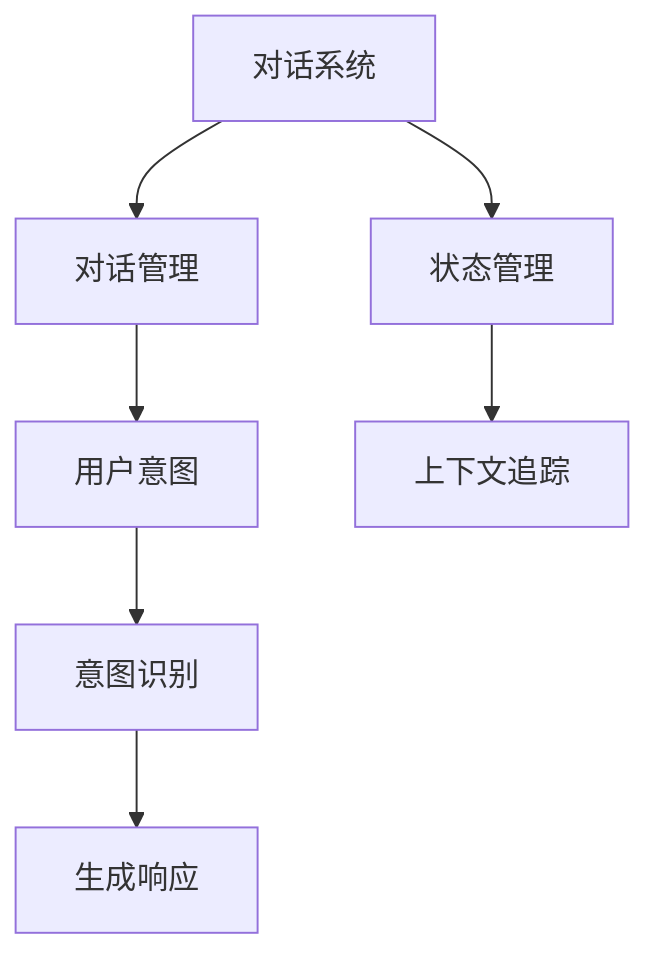

                 

# 第六章：对话管理和状态管理

> 关键词：对话管理, 状态管理, 智能交互, 用户意图, 上下文追踪, 多轮对话, 上下文维护, 状态转移, 交互建模

## 1. 背景介绍

在人工智能领域，对话系统是近年来蓬勃发展的一个重要方向。无论是智能客服、智能助手，还是智能家居，对话系统已经成为人们日常生活中不可或缺的一部分。随着自然语言处理技术的不断进步，对话系统在处理多轮对话、理解用户意图、维护对话上下文等方面的能力得到了显著提升。然而，对话系统的核心挑战仍然在于对话管理和状态管理。对话管理负责根据用户输入调整对话流程，而状态管理则负责维护对话中的上下文信息。本文将从这两个核心问题出发，深入探讨对话系统和状态管理的原理和实现方法。

## 2. 核心概念与联系

### 2.1 核心概念概述

为了更好地理解对话管理和状态管理的原理，本节将介绍几个密切相关的核心概念：

- **对话系统**：一种能够模拟人类对话的计算机系统，通过理解用户意图、生成响应和维护对话上下文，实现自然语言的人机交互。
- **对话管理**：对话系统中负责管理对话流程、决定下一步动作的组件。对话管理机制通过理解和分析用户输入，选择合适的动作和响应。
- **状态管理**：对话系统中负责维护对话上下文信息、记录对话历史的组件。状态管理机制通过存储和更新对话状态，确保对话的连贯性和一致性。
- **用户意图**：用户通过语言表达的愿望和需求，对话系统通过分析用户输入，识别并满足用户意图。
- **上下文追踪**：在多轮对话中，对话系统通过追踪上下文信息，理解用户语境，提升响应准确性。

这些核心概念之间的逻辑关系可以通过以下Mermaid流程图来展示：



这个流程图展示出对话系统如何通过对话管理和状态管理，实现用户意图识别和生成响应的过程。对话管理负责选择动作和生成响应，而状态管理则负责追踪上下文信息，确保对话连贯。用户意图通过意图识别模块进行分析，并最终在生成响应模块中得到满足。

## 3. 核心算法原理 & 具体操作步骤
### 3.1 算法原理概述

对话系统和状态管理的核心算法原理主要围绕以下三个方面：

- **用户意图识别**：通过分析用户输入，理解用户意图，这是对话管理和状态管理的起点。
- **动作选择和响应生成**：根据用户意图，选择合适的动作和生成相应的响应，这是对话管理的主要任务。
- **上下文追踪和更新**：通过维护对话状态，记录和更新对话上下文，确保对话的连贯性和一致性。

对话管理和状态管理通常基于机器学习、规则系统、图模型等多种技术手段，并结合领域知识，实现高效、智能的对话系统。

### 3.2 算法步骤详解

基于对话系统和状态管理的核心算法原理，对话管理和状态管理的具体步骤可以归纳为以下几个关键环节：

1. **用户输入分析**：通过自然语言处理技术，对用户输入进行分词、命名实体识别、情感分析等预处理，提取出用户意图相关的信息。
2. **意图识别**：使用分类模型或规则系统，对用户输入进行分析，识别出用户的意图。
3. **动作选择**：根据用户意图，结合对话历史和上下文信息，选择合适的动作。
4. **响应生成**：生成符合用户意图和上下文的响应，并可能包含下一步动作的提示。
5. **上下文更新**：根据动作和响应，更新对话状态和上下文信息。
6. **交互反馈**：将响应反馈给用户，并接收用户的后续输入，进入下一轮对话。

下面以一个简单的多轮对话为例，详细阐述上述步骤的实现：

- **用户输入**：用户询问“我明天有空，帮我查一下明天上海的天气。”
- **用户输入分析**：通过分词和命名实体识别，提取出“明天”、“上海”、“天气”等关键信息。
- **意图识别**：通过意图识别模型，判断用户意图为查询天气。
- **动作选择**：根据意图和对话历史，选择查询天气的动作。
- **响应生成**：生成响应“好的，我帮你查询一下，请稍等。”，并提示“请提供具体的城市名。”
- **上下文更新**：更新对话状态，记录查询时间和城市名。
- **交互反馈**：将响应返回给用户，并等待用户的后续输入。

### 3.3 算法优缺点

对话系统和状态管理的核心算法原理和操作步骤，具有以下优点和缺点：

#### 优点：

1. **自然流畅**：通过理解和分析用户输入，对话系统能够以自然语言进行响应，提升用户体验。
2. **智能灵活**：结合机器学习和领域知识，对话系统能够灵活处理多变的情境，满足用户多样化需求。
3. **扩展性强**：通过增加意图识别和动作选择模型，对话系统可以不断扩展和优化，适应新任务和新需求。

#### 缺点：

1. **数据依赖**：对话管理和状态管理的效果依赖于高质量的标注数据和领域知识，获取这些数据和知识可能需要较高的成本和资源。
2. **复杂度高**：对话系统和状态管理涉及多个环节，系统设计和实现复杂度较高，需要综合多种技术和领域知识。
3. **鲁棒性不足**：对话系统在处理非标准输入和异常情况时，可能出现误识别或错误响应。

### 3.4 算法应用领域

对话管理和状态管理的核心算法原理和操作步骤，在以下领域得到了广泛应用：

1. **智能客服**：通过对话管理和状态管理，智能客服系统能够理解用户问题，提供准确的回答，提升服务效率和用户满意度。
2. **智能助手**：如Siri、Alexa等，通过对话管理和状态管理，智能助手能够提供个性化服务，如日程安排、信息查询等。
3. **医疗咨询**：通过对话管理和状态管理，医疗咨询系统能够理解用户病情，提供诊疗建议，提升医疗服务的智能水平。
4. **金融咨询**：如智能投顾、风险评估等，通过对话管理和状态管理，金融咨询系统能够提供个性化投资建议和风险评估。
5. **教育辅导**：通过对话管理和状态管理，教育辅导系统能够提供个性化的学习建议和知识推荐，提升学习效果。

## 4. 数学模型和公式 & 详细讲解
### 4.1 数学模型构建

对话管理和状态管理涉及到多个领域的知识，因此构建数学模型时需要综合考虑。这里以**意图识别模型**为例，简要介绍其数学模型构建过程。

假设我们有一个对话数据集，其中每个对话包含多轮用户输入和系统响应。设 $D=\{(\mathbf{x}_i, \mathbf{y}_i)\}_{i=1}^N$ 为训练数据集，其中 $\mathbf{x}_i$ 为第 $i$ 轮用户输入的文本表示，$\mathbf{y}_i$ 为对应的意图标签。

**意图识别模型**的目标是训练一个分类器 $f: \mathcal{X} \rightarrow \mathcal{Y}$，其中 $\mathcal{X}$ 为输入空间，$\mathcal{Y}$ 为意图类别。常用的意图识别模型包括逻辑回归、支持向量机、神经网络等。

### 4.2 公式推导过程

以神经网络模型为例，其意图识别模型的公式推导过程如下：

1. **输入表示**：首先将用户输入 $\mathbf{x}_i$ 转换为向量表示 $\mathbf{z}_i$，常见的转换方式包括词袋模型、TF-IDF、Word2Vec 等。
2. **隐藏层表示**：通过多个隐藏层，对输入向量 $\mathbf{z}_i$ 进行特征提取，生成高维隐藏表示 $\mathbf{h}_i = \text{ReLU}(\mathbf{W}_h\mathbf{z}_i + \mathbf{b}_h)$，其中 $\mathbf{W}_h$ 和 $\mathbf{b}_h$ 为权重和偏置。
3. **输出层表示**：通过一个线性层和 Softmax 函数，将隐藏表示 $\mathbf{h}_i$ 转换为意图分类概率分布 $\mathbf{p}_i = \text{Softmax}(\mathbf{W}_o\mathbf{h}_i + \mathbf{b}_o)$，其中 $\mathbf{W}_o$ 和 $\mathbf{b}_o$ 为权重和偏置。
4. **损失函数**：使用交叉熵损失函数衡量模型预测与真实意图标签之间的差异，公式为 $\mathcal{L}(f) = -\frac{1}{N}\sum_{i=1}^N \sum_{j=1}^{C} \mathbf{y}_{ij} \log p_{ij}$，其中 $C$ 为意图类别数。

### 4.3 案例分析与讲解

以一个简单的意图识别模型为例，进行案例分析。

- **数据集准备**：假设我们有一个包含 1000 个对话的训练数据集，每个对话包含 2-5 轮用户输入和系统响应。我们首先对每个用户输入进行分词和词向量化，得到 1000 个输入向量 $\mathbf{z}_i$。
- **模型训练**：我们使用一个包含 3 个隐藏层的神经网络模型，对输入向量 $\mathbf{z}_i$ 进行特征提取，生成隐藏表示 $\mathbf{h}_i$。然后通过一个输出层，将隐藏表示 $\mathbf{h}_i$ 转换为意图分类概率分布 $\mathbf{p}_i$。
- **模型评估**：在验证集上使用准确率和召回率等指标，评估意图识别模型的性能。使用交叉熵损失函数，通过梯度下降等优化算法，最小化损失函数 $\mathcal{L}(f)$。

通过不断迭代训练和验证，意图识别模型能够学习到用户输入与意图之间的映射关系，从而实现高效的意图识别。

## 5. 项目实践：代码实例和详细解释说明
### 5.1 开发环境搭建

在进行对话管理和状态管理的实践前，我们需要准备好开发环境。以下是使用Python进行TensorFlow开发的开发环境配置流程：

1. 安装Anaconda：从官网下载并安装Anaconda，用于创建独立的Python环境。

2. 创建并激活虚拟环境：
```bash
conda create -n tensorflow-env python=3.8 
conda activate tensorflow-env
```

3. 安装TensorFlow：根据CUDA版本，从官网获取对应的安装命令。例如：
```bash
conda install tensorflow -c conda-forge -c pytorch
```

4. 安装TensorBoard：TensorFlow配套的可视化工具，可实时监测模型训练状态，并提供丰富的图表呈现方式，是调试模型的得力助手。
```bash
pip install tensorboard
```

5. 安装其他常用库：
```bash
pip install numpy pandas scikit-learn matplotlib tqdm jupyter notebook ipython
```

完成上述步骤后，即可在`tensorflow-env`环境中开始对话管理和状态管理的实践。

### 5.2 源代码详细实现

下面我们以意图识别模型为例，给出使用TensorFlow对对话系统进行意图识别的PyTorch代码实现。

```python
import tensorflow as tf
from tensorflow.keras.models import Sequential
from tensorflow.keras.layers import Embedding, LSTM, Dense, Dropout
from tensorflow.keras.preprocessing.text import Tokenizer
from tensorflow.keras.preprocessing.sequence import pad_sequences

# 假设已准备好训练数据集和测试数据集
train_data = ...
test_data = ...

# 分词和向量化
tokenizer = Tokenizer()
tokenizer.fit_on_texts(train_data)
word_index = tokenizer.word_index
sequences = tokenizer.texts_to_sequences(train_data)
padded_sequences = pad_sequences(sequences, maxlen=MAX_LEN, padding='post')

# 构建意图识别模型
model = Sequential([
    Embedding(len(word_index) + 1, EMBEDDING_DIM, input_length=MAX_LEN),
    LSTM(LSTM_UNITS, return_sequences=True),
    Dropout(DROPOUT_RATE),
    LSTM(LSTM_UNITS),
    Dropout(DROPOUT_RATE),
    Dense(INTENT_NUM, activation='softmax')
])
model.compile(loss='categorical_crossentropy', optimizer='adam', metrics=['accuracy'])

# 训练模型
model.fit(padded_sequences, train_labels, epochs=NUM_EPOCHS, batch_size=BATCH_SIZE, validation_data=(padded_test_sequences, test_labels))
```

### 5.3 代码解读与分析

让我们再详细解读一下关键代码的实现细节：

**分词和向量化**：
- 使用`Tokenizer`对文本进行分词，并生成词索引`word_index`。
- 通过`texts_to_sequences`将文本转换为序列数据，并使用`pad_sequences`进行填充，得到适合模型的输入数据。

**模型构建**：
- 构建一个包含嵌入层、LSTM层和全连接层的神经网络模型。
- 使用`compile`方法设置损失函数、优化器和评估指标。

**模型训练**：
- 使用`fit`方法训练模型，并设置训练轮数和批量大小。

以上是使用TensorFlow进行意图识别模型的完整代码实现。可以看到，TensorFlow提供了方便的高级API，使得意图识别模型的开发和训练变得简洁高效。

## 6. 实际应用场景
### 6.1 智能客服系统

基于对话管理和状态管理的对话系统，可以广泛应用于智能客服系统的构建。传统客服往往需要配备大量人力，高峰期响应缓慢，且一致性和专业性难以保证。而使用对话管理系统，可以7x24小时不间断服务，快速响应客户咨询，用自然流畅的语言解答各类常见问题。

在技术实现上，可以收集企业内部的历史客服对话记录，将问题和最佳答复构建成监督数据，在此基础上对对话系统进行训练和微调。训练后的对话系统能够自动理解用户意图，匹配最合适的答复模板进行回复。对于客户提出的新问题，还可以接入检索系统实时搜索相关内容，动态组织生成回答。如此构建的智能客服系统，能大幅提升客户咨询体验和问题解决效率。

### 6.2 金融舆情监测

金融机构需要实时监测市场舆论动向，以便及时应对负面信息传播，规避金融风险。传统的人工监测方式成本高、效率低，难以应对网络时代海量信息爆发的挑战。基于对话管理和状态管理的文本分类和情感分析技术，为金融舆情监测提供了新的解决方案。

具体而言，可以收集金融领域相关的新闻、报道、评论等文本数据，并对其进行主题标注和情感标注。在此基础上对对话系统进行训练和微调，使其能够自动判断文本属于何种主题，情感倾向是正面、中性还是负面。将训练后的系统应用到实时抓取的网络文本数据，就能够自动监测不同主题下的情感变化趋势，一旦发现负面信息激增等异常情况，系统便会自动预警，帮助金融机构快速应对潜在风险。

### 6.3 个性化推荐系统

当前的推荐系统往往只依赖用户的历史行为数据进行物品推荐，无法深入理解用户的真实兴趣偏好。基于对话管理和状态管理的个性化推荐系统，可以更好地挖掘用户行为背后的语义信息，从而提供更精准、多样的推荐内容。

在实践中，可以收集用户浏览、点击、评论、分享等行为数据，提取和用户交互的物品标题、描述、标签等文本内容。将文本内容作为模型输入，用户的后续行为（如是否点击、购买等）作为监督信号，在此基础上训练和微调对话系统。训练后的对话系统能够从文本内容中准确把握用户的兴趣点。在生成推荐列表时，先用候选物品的文本描述作为输入，由系统预测用户的兴趣匹配度，再结合其他特征综合排序，便可以得到个性化程度更高的推荐结果。

### 6.4 未来应用展望

随着对话管理和状态管理技术的发展，其在更多领域得到应用，为各行各业带来变革性影响。

在智慧医疗领域，基于对话管理和状态管理的医疗问答、病历分析、药物研发等应用将提升医疗服务的智能化水平，辅助医生诊疗，加速新药开发进程。

在智能教育领域，对话管理系统可应用于作业批改、学情分析、知识推荐等方面，因材施教，促进教育公平，提高教学质量。

在智慧城市治理中，对话管理系统可应用于城市事件监测、舆情分析、应急指挥等环节，提高城市管理的自动化和智能化水平，构建更安全、高效的未来城市。

此外，在企业生产、社会治理、文娱传媒等众多领域，基于对话管理和状态管理的对话系统也将不断涌现，为经济社会发展注入新的动力。

## 7. 工具和资源推荐
### 7.1 学习资源推荐

为了帮助开发者系统掌握对话管理和状态管理的理论基础和实践技巧，这里推荐一些优质的学习资源：

1. **《TensorFlow实战深度学习》**：由李沐等专家编写的实战指南，详细介绍了TensorFlow的使用方法和案例。
2. **《自然语言处理综论》**：斯坦福大学NLP课程，涵盖自然语言处理的基本概念和前沿技术，是学习NLP的绝佳资源。
3. **《深度学习》**：Ian Goodfellow等专家编写的经典教材，深入浅出地介绍了深度学习的基本原理和算法。
4. **TensorFlow官方文档**：提供全面的API文档和教程，适合新手入门和进阶学习。
5. **Google Colab**：谷歌提供的免费Jupyter Notebook环境，支持GPU和TPU算力，方便开发者快速上手实验最新模型，分享学习笔记。

通过对这些资源的学习实践，相信你一定能够快速掌握对话管理和状态管理的精髓，并用于解决实际的对话系统问题。

### 7.2 开发工具推荐

高效的开发离不开优秀的工具支持。以下是几款用于对话管理和状态管理的常用工具：

1. **TensorFlow**：由Google主导开发的深度学习框架，支持多GPU并行计算，生产部署方便。
2. **PyTorch**：由Facebook开发的深度学习框架，灵活性高，适合研究型项目。
3. **NLTK**：Python自然语言处理库，提供各种预处理和分析工具，方便文本处理。
4. **GPT-3 API**：OpenAI提供的自然语言处理API，支持生成、推理等任务，适合应用开发。
5. **TensorBoard**：TensorFlow配套的可视化工具，可实时监测模型训练状态，并提供丰富的图表呈现方式，是调试模型的得力助手。

合理利用这些工具，可以显著提升对话管理和状态管理的开发效率，加快创新迭代的步伐。

### 7.3 相关论文推荐

对话管理和状态管理的发展源于学界的持续研究。以下是几篇奠基性的相关论文，推荐阅读：

1. **Seq2Seq模型**：将自然语言处理任务转化为序列到序列模型，广泛应用于机器翻译、对话系统等。
2. **Transformer模型**：提出自注意力机制，有效解决长距离依赖问题，在机器翻译、语音识别等领域取得重大突破。
3. **GPT系列模型**：基于自回归模型，具有强大的语言生成能力，广泛应用于智能问答、对话生成等任务。
4. **BERT模型**：基于掩码语言模型，预训练大规模语料，在多项NLP任务上取得SOTA表现，并广泛用于意图识别、命名实体识别等任务。

这些论文代表了大语言模型和对话管理技术的发展脉络。通过学习这些前沿成果，可以帮助研究者把握学科前进方向，激发更多的创新灵感。

## 8. 总结：未来发展趋势与挑战

### 8.1 总结

本文对对话管理和状态管理的原理和实现方法进行了全面系统的介绍。首先阐述了对话管理和状态管理的核心概念和逻辑关系，明确了对话管理和状态管理在对话系统中的重要地位。其次，从原理到实践，详细讲解了对话管理系统和状态管理系统的数学模型和操作步骤，给出了完整的代码实例。同时，本文还广泛探讨了对话管理和状态管理在智能客服、金融舆情、个性化推荐等多个行业领域的应用前景，展示了对话管理范式的巨大潜力。此外，本文精选了对话管理和状态管理的各类学习资源，力求为读者提供全方位的技术指引。

通过本文的系统梳理，可以看到，对话管理和状态管理技术正在成为对话系统的核心技术之一，极大地拓展了对话系统的应用边界，催生了更多的落地场景。对话管理和状态管理通过理解用户意图、生成响应和维护上下文，使得对话系统能够自然流畅地与用户交互，提升用户体验，从而成为人工智能技术的重要方向。

### 8.2 未来发展趋势

展望未来，对话管理和状态管理技术将呈现以下几个发展趋势：

1. **多轮对话能力提升**：对话管理系统将更加擅长处理多轮对话，能够更好地理解用户意图和上下文，提高对话连贯性和一致性。
2. **上下文表示优化**：对话管理系统将采用更高级的上下文表示方法，如Transformer编码器，提升上下文理解能力。
3. **数据驱动模型**：对话管理系统将更多依赖数据驱动的模型，如GPT系列、BERT系列，提升模型性能。
4. **迁移学习技术**：通过迁移学习技术，对话管理系统能够从其他任务中学到知识，提升多领域适应能力。
5. **多模态融合**：对话管理系统将更多采用多模态融合技术，结合语音、图像、文本等多种模态信息，提升交互体验。
6. **知识图谱整合**：对话管理系统将更多结合知识图谱，提供更丰富的背景知识和信息，提升问答能力。

这些趋势凸显了大语言模型和对话管理技术的广阔前景。这些方向的探索发展，必将进一步提升对话系统的性能和应用范围，为人工智能技术的发展注入新的动力。

### 8.3 面临的挑战

尽管对话管理和状态管理技术已经取得了瞩目成就，但在迈向更加智能化、普适化应用的过程中，它仍面临着诸多挑战：

1. **数据稀缺问题**：对话管理系统需要大量的对话数据进行训练，但在实际应用中，获取高质量的对话数据可能非常困难。
2. **模型复杂度高**：对话管理系统涉及多轮对话和上下文维护，模型设计复杂，难以优化和调试。
3. **鲁棒性不足**：对话管理系统在处理非标准输入和异常情况时，可能出现误识别或错误响应。
4. **计算资源需求高**：对话管理系统往往需要高计算能力的硬件支持，如GPU/TPU，才能进行高效训练和推理。
5. **实时性问题**：对话管理系统需要快速响应用户输入，对计算资源和时间要求较高。

### 8.4 研究展望

面对对话管理和状态管理面临的挑战，未来的研究需要在以下几个方面寻求新的突破：

1. **无监督学习和半监督学习**：开发无监督学习和半监督学习模型，减少对标注数据的依赖，提升模型鲁棒性和泛化能力。
2. **模型压缩和优化**：开发高效模型压缩和优化技术，降低计算资源需求，提升实时性和部署效率。
3. **多模态融合和知识图谱**：结合多模态融合和知识图谱，提升对话系统的综合理解能力和知识获取能力。
4. **交互逻辑建模**：开发更高级的交互逻辑建模技术，提升对话系统的逻辑推理能力。
5. **人机协作**：结合人工智能和人类专家的优势，开发人机协作的对话系统，提升系统性能和用户体验。

这些研究方向将为对话管理和状态管理技术的发展提供新的动力，推动对话系统迈向更高的台阶，实现更广泛的应用。

## 9. 附录：常见问题与解答

**Q1：对话管理和状态管理如何处理多轮对话？**

A: 对话管理系统通常采用基于记忆和注意力机制的方法，记录和更新对话上下文，处理多轮对话。具体而言，系统在每一轮对话中记录上下文信息，并结合当前输入和上下文，生成当前轮的响应，同时更新对话状态。多轮对话中，对话管理系统能够通过维护上下文信息，理解用户语境，提升响应准确性。

**Q2：对话管理系统如何处理非标准输入？**

A: 对话管理系统通常采用多轮对话和上下文维护的方法，能够处理一定程度的非标准输入。系统可以通过询问澄清、引导回复等方式，逐步理解用户意图，处理异常情况。同时，对话管理系统可以通过上下文追踪和知识图谱整合，提升对非标准输入的鲁棒性和适应能力。

**Q3：对话管理系统如何提高实时性？**

A: 对话管理系统可以通过多GPU并行计算、模型压缩和优化等方法，提升计算速度和资源利用效率，降低响应时间。同时，系统可以通过分布式计算和缓存技术，减少计算和数据传输延迟，进一步提升实时性。

**Q4：对话管理系统如何保证安全性？**

A: 对话管理系统可以通过访问鉴权、数据加密、权限控制等方法，保障对话数据的隐私和安全。同时，系统可以通过用户反馈和人工审核，及时发现和纠正误识别或错误响应，提升系统的鲁棒性和安全性。

**Q5：对话管理系统如何提高可解释性？**

A: 对话管理系统可以通过解释性分析工具，如可解释模型、因果推断等，提升系统的可解释性。系统可以通过可视化图表、因果分析等方式，帮助用户理解模型的决策过程，提升系统的透明度和可信度。

这些问题的回答，希望能够帮助你更好地理解对话管理和状态管理的原理和实现方法，并为未来的开发和研究提供参考。

