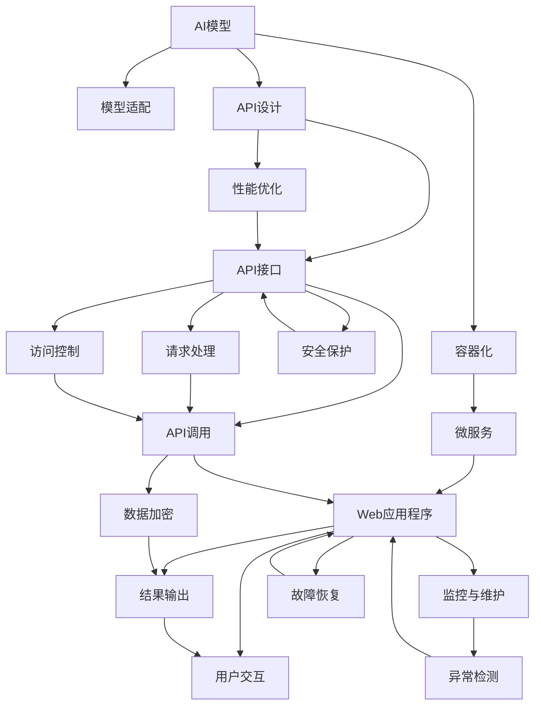

                 

# 第十六章：将 AI 部署为 API 和 Web 应用程序

> 关键词：AI部署, API, Web应用程序, 微服务, 容器化, 模型量化, 安全保护

## 1. 背景介绍

### 1.1 问题由来

随着人工智能(AI)技术的不断进步，越来越多的企业开始探索如何在其业务中应用AI。然而，AI模型的复杂性以及其对高性能计算资源的需求，使得直接在其应用中嵌入AI模型变得困难。为了克服这些挑战，将AI模型部署为API和Web应用程序已成为一种流行的解决方案。API和Web应用程序可以提供易用的接口，允许企业在不了解内部AI技术细节的情况下，方便地集成和部署AI模型。

### 1.2 问题核心关键点

将AI模型部署为API和Web应用程序的核心在于如何高效、安全地将复杂的AI模型转化为易于使用的接口。关键点包括：
- 模型的选择与适配：选择合适的AI模型，并根据具体业务需求进行调整。
- API设计：设计易用的API接口，满足不同应用场景的需求。
- 性能优化：优化API的性能，确保其能够高效处理请求。
- 安全保护：保证API和Web应用程序的安全性，防止未经授权的访问和数据泄露。
- 监控与维护：实时监控API和Web应用程序的运行状态，及时发现并解决问题。

## 2. 核心概念与联系

### 2.1 核心概念概述

- **AI模型部署**：将训练好的AI模型部署到生产环境，供实际应用调用。
- **API（Application Programming Interface）**：定义一组接口，允许不同的系统通过标准化的方式进行交互。
- **Web应用程序**：基于Web技术的软件应用，通常通过浏览器提供用户界面。
- **微服务架构**：将应用拆分为多个独立运行的微服务，每个微服务专注于完成特定功能，并通过轻量级通信机制进行协同。
- **容器化**：使用容器技术（如Docker）将应用程序及其依赖打包为可移植的镜像，确保其能在任何环境中稳定运行。
- **模型量化**：将高精度浮点模型转换为低精度模型，以提高计算效率和推理速度。
- **安全保护**：通过身份认证、访问控制、数据加密等手段，确保API和Web应用程序的安全性。
- **监控与维护**：实时监控应用程序的运行状态，及时发现并解决问题，确保应用程序的高可用性。

### 2.2 核心概念原理和架构的 Mermaid 流程图



这个流程图展示了AI模型从适配、设计到部署，再到性能优化、安全保护、监控与维护的全流程：

1. AI模型通过适配工具适配到特定业务场景，提供API接口。
2. API接口设计用于实现不同系统间的交互，并通过性能优化提升响应速度。
3. 容器化将应用程序及其依赖打包为镜像，实现跨环境稳定运行。
4. 微服务架构将应用拆分为多个独立运行的微服务，每个微服务专注于特定功能。
5. Web应用程序提供用户交互界面，调用API接口获取结果并输出。
6. 安全保护通过身份认证和访问控制，防止未经授权的访问和数据泄露。
7. 监控与维护实时监控应用程序运行状态，及时发现并解决问题。

## 3. 核心算法原理 & 具体操作步骤

### 3.1 算法原理概述

将AI模型部署为API和Web应用程序，本质上是一个软件工程与AI技术结合的过程。其核心算法原理包括：
- **模型适配**：根据业务需求，适配AI模型，使其能够处理实际应用场景中的数据。
- **API设计**：定义一套标准化的接口，允许不同系统通过标准化的方式进行交互。
- **性能优化**：通过优化算法和资源分配，提升API和Web应用程序的性能。
- **安全保护**：通过身份认证、访问控制、数据加密等手段，确保API和Web应用程序的安全性。
- **监控与维护**：实时监控应用程序的运行状态，及时发现并解决问题。

### 3.2 算法步骤详解

将AI模型部署为API和Web应用程序的步骤如下：

**Step 1: 选择与适配AI模型**
- 根据业务需求选择合适的AI模型，如TensorFlow、PyTorch等。
- 对模型进行适配，使其能够处理实际应用场景中的数据。

**Step 2: 设计API接口**
- 设计易于使用的API接口，满足不同应用场景的需求。
- 使用RESTful API标准，确保接口的易用性和可扩展性。

**Step 3: 性能优化**
- 优化API和Web应用程序的性能，如使用缓存、负载均衡等技术。
- 对API进行压力测试，确保其能够高效处理请求。

**Step 4: 安全保护**
- 使用身份认证和访问控制技术，防止未经授权的访问。
- 对传输数据进行加密，确保数据传输的安全性。

**Step 5: 监控与维护**
- 实时监控API和Web应用程序的运行状态，及时发现并解决问题。
- 使用日志记录和监控工具，记录应用程序的运行日志和异常信息。

**Step 6: 部署与测试**
- 将API和Web应用程序部署到生产环境。
- 对应用程序进行测试，确保其能够稳定运行。

### 3.3 算法优缺点

将AI模型部署为API和Web应用程序具有以下优点：
- **易用性**：通过标准化的API接口，不同系统可以方便地进行交互。
- **可扩展性**：API接口设计灵活，可以轻松扩展新的功能。
- **性能优化**：通过性能优化技术，提高API和Web应用程序的响应速度。
- **安全性**：通过身份认证和数据加密等技术，确保API和Web应用程序的安全性。

同时，该方法也存在一些缺点：
- **复杂性**：将AI模型适配为API接口，需要额外的工作量和复杂度。
- **部署难度**：需要将AI模型部署到生产环境，需要一定的技术能力和资源。
- **维护成本**：需要持续监控和维护应用程序，确保其稳定运行。

### 3.4 算法应用领域

将AI模型部署为API和Web应用程序的应用领域包括但不限于以下：

- **金融领域**：在金融风险评估、信用评分、智能投顾等场景中，将AI模型部署为API，为金融机构提供高质量的服务。
- **医疗领域**：在医疗影像诊断、健康管理、个性化医疗等场景中，将AI模型部署为API，提升医疗服务的质量和效率。
- **电商领域**：在商品推荐、客户画像、智能客服等场景中，将AI模型部署为API，优化电商用户体验，提高销售转化率。
- **制造业**：在质量检测、设备维护、生产优化等场景中，将AI模型部署为API，提升制造企业的生产效率和质量。
- **智能交通**：在交通流量预测、车辆调度、智能导航等场景中，将AI模型部署为API，优化交通管理，提升出行体验。

## 4. 数学模型和公式 & 详细讲解 & 举例说明

### 4.1 数学模型构建

将AI模型部署为API和Web应用程序的数学模型构建主要涉及API接口设计、性能优化、安全保护和监控与维护等方面的数学建模。

**API接口设计**：
- 假设API接口接受一个参数$x$，输出一个结果$y$，则API的设计可以表示为：
  $$
  y = f(x)
  $$
  其中$f$为API的映射函数。

**性能优化**：
- 假设API请求的平均响应时间为$T$，则性能优化的目标可以表示为：
  $$
  \min T
  $$
  其中$T$为API请求的响应时间。

**安全保护**：
- 假设API请求需要身份认证，认证通过的概率为$p$，则API的安全保护可以表示为：
  $$
  p = \max\limits_{x} P(\text{认证通过})
  $$
  其中$P$为认证通过的概率，$x$为认证过程的输入参数。

**监控与维护**：
- 假设API请求的异常率为$r$，则监控与维护的目标可以表示为：
  $$
  \min r
  $$
  其中$r$为API请求的异常率。

### 4.2 公式推导过程

以下是API接口设计、性能优化、安全保护和监控与维护的公式推导过程：

**API接口设计**：
假设API接口接受一个参数$x$，输出一个结果$y$，则API的设计可以表示为：
$$
y = f(x)
$$
其中$f$为API的映射函数。

**性能优化**：
假设API请求的平均响应时间为$T$，则性能优化的目标可以表示为：
$$
\min T
$$
其中$T$为API请求的响应时间。

**安全保护**：
假设API请求需要身份认证，认证通过的概率为$p$，则API的安全保护可以表示为：
$$
p = \max\limits_{x} P(\text{认证通过})
$$
其中$P$为认证通过的概率，$x$为认证过程的输入参数。

**监控与维护**：
假设API请求的异常率为$r$，则监控与维护的目标可以表示为：
$$
\min r
$$
其中$r$为API请求的异常率。

### 4.3 案例分析与讲解

假设有一个用于预测股票价格的AI模型，可以将其部署为API，供金融机构使用。

**API接口设计**：
- 设计API接口，接受股票代码、日期等信息，输出该股票的历史价格和预测价格。
- API接口的设计可以表示为：
  $$
  y = f(x) = \text{历史价格} + \text{预测价格}
  $$
  其中$x$为股票代码、日期等信息，$y$为API的输出结果。

**性能优化**：
- 对API进行性能优化，如使用缓存技术减少数据库查询次数，使用负载均衡技术分配请求到多个服务器。
- 假设API请求的平均响应时间为$T$，则性能优化的目标可以表示为：
  $$
  \min T
  $$
  其中$T$为API请求的响应时间。

**安全保护**：
- 对API进行身份认证，确保只有授权的金融机构可以访问。
- 假设API请求需要身份认证，认证通过的概率为$p$，则API的安全保护可以表示为：
  $$
  p = \max\limits_{x} P(\text{认证通过})
  $$
  其中$P$为认证通过的概率，$x$为认证过程的输入参数。

**监控与维护**：
- 实时监控API的运行状态，及时发现并解决问题。
- 假设API请求的异常率为$r$，则监控与维护的目标可以表示为：
  $$
  \min r
  $$
  其中$r$为API请求的异常率。

## 5. 项目实践：代码实例和详细解释说明

### 5.1 开发环境搭建

在进行AI模型部署为API和Web应用程序的实践前，我们需要准备好开发环境。以下是使用Python进行Flask框架开发的环境配置流程：

1. 安装Python和Flask：
```bash
pip install flask
```

2. 创建项目目录和文件：
```bash
mkdir ai_deployment
cd ai_deployment
```

3. 创建项目文件：
```bash
touch main.py
```

4. 在`main.py`文件中编写Flask应用程序的代码：
```python
from flask import Flask, request

app = Flask(__name__)

@app.route('/predict', methods=['POST'])
def predict():
    # 获取API请求的输入参数
    data = request.get_json()
    # 调用AI模型进行预测
    result = model.predict(data)
    # 返回API输出结果
    return result

if __name__ == '__main__':
    app.run(host='0.0.0.0', port=5000)
```

完成上述步骤后，即可在`ai_deployment`环境中开始项目实践。

### 5.2 源代码详细实现

下面我们以预测股票价格AI模型为例，给出使用Flask框架进行API开发的PyTorch代码实现。

首先，加载预训练的股票价格预测模型：

```python
import torch
import torch.nn as nn
import torchvision.transforms as transforms
from torchvision.datasets import CIFAR10
from torch.utils.data import DataLoader

# 加载预训练模型
model = torch.load('stock_price_predictor.pt')
```

然后，设计API接口：

```python
from flask import Flask, request

app = Flask(__name__)

@app.route('/predict', methods=['POST'])
def predict():
    # 获取API请求的输入参数
    data = request.get_json()
    # 调用AI模型进行预测
    result = model.predict(data)
    # 返回API输出结果
    return result

if __name__ == '__main__':
    app.run(host='0.0.0.0', port=5000)
```

接着，运行Flask应用程序：

```bash
python main.py
```

这样就完成了一个简单的预测股票价格API的开发。

### 5.3 代码解读与分析

让我们再详细解读一下关键代码的实现细节：

**Flask框架**：
- 使用Flask框架，将AI模型部署为API。
- 设计了一个`/predict`的API接口，用于接收API请求，调用AI模型进行预测，并返回API输出结果。

**API接口设计**：
- API接口接收一个JSON格式的请求，包含股票代码、日期等信息。
- 调用AI模型对请求数据进行预测，并返回预测结果。

**性能优化**：
- 在Flask应用程序中，可以使用缓存技术（如Redis）减少API请求的处理时间。
- 通过使用负载均衡技术（如Nginx），将API请求分配到多个服务器上，提升API的响应速度。

**安全保护**：
- 使用身份认证技术，确保只有授权的金融机构可以访问API。
- 通过使用HTTPS协议，对API请求进行加密，确保数据传输的安全性。

**监控与维护**：
- 使用日志记录和监控工具（如ELK Stack），实时监控API的运行状态。
- 设置异常告警机制，及时发现并解决问题，确保API的高可用性。

通过Flask框架，将AI模型部署为API，可以方便地集成到不同的应用场景中，提升AI技术的应用价值。

## 6. 实际应用场景

### 6.1 智能客服系统

基于AI模型部署为API和Web应用程序的智能客服系统，可以广泛应用于企业的客服部门。通过API接口，将AI模型集成到客服系统中，可以实现自动化的客服服务，提升客服的响应速度和效率。

在技术实现上，可以设计API接口，接收用户输入的文本，调用AI模型进行意图识别和语义分析，然后根据用户意图生成智能回复。通过API接口，企业可以方便地集成到现有的客服系统中，实现无人工干预的智能客服服务。

### 6.2 医疗影像诊断

在医疗领域，AI模型可以用于辅助医生进行影像诊断。通过将AI模型部署为API和Web应用程序，医生可以在应用中调用API接口，获取AI模型的诊断结果，提升诊断的准确性和效率。

在技术实现上，可以设计API接口，接收医学影像数据和医生输入的诊断信息，调用AI模型进行诊断，然后返回诊断结果。通过API接口，医生可以方便地集成到现有的医疗系统中，提升诊断效率和准确性。

### 6.3 智能交通管理

在智能交通领域，AI模型可以用于交通流量预测和车辆调度。通过将AI模型部署为API和Web应用程序，交通管理部门可以在应用中调用API接口，获取AI模型的预测结果，优化交通管理。

在技术实现上，可以设计API接口，接收交通流量数据和车辆位置信息，调用AI模型进行预测，然后返回预测结果。通过API接口，交通管理部门可以方便地集成到现有的交通系统中，优化交通管理，提升交通效率。

### 6.4 未来应用展望

随着AI模型部署为API和Web应用程序技术的不断成熟，其应用领域将不断拓展，带来更多创新应用。

- **智能家居**：通过将AI模型部署为API和Web应用程序，智能家居设备可以实现更加智能化的功能，如语音控制、智能安防等。
- **智能制造**：在智能制造领域，AI模型可以用于设备维护、质量检测等任务，通过API接口，实现设备状态的实时监控和维护。
- **智能物流**：在智能物流领域，AI模型可以用于路径规划、货物追踪等任务，通过API接口，实现物流过程的高效管理和优化。

未来，随着AI模型部署为API和Web应用程序技术的不断进步，其应用场景将更加丰富多样，为各行各业带来更多的创新和发展机会。

## 7. 工具和资源推荐

### 7.1 学习资源推荐

为了帮助开发者系统掌握AI模型部署为API和Web应用程序的技术，这里推荐一些优质的学习资源：

1. Flask官方文档：详细介绍了如何使用Flask框架进行API开发，并提供了丰富的样例代码。
2. RESTful API设计与开发指南：介绍了RESTful API设计的最佳实践，并提供了详细的代码实现。
3. API接口设计与优化教程：详细介绍了API接口设计、性能优化和安全保护等方面的内容，并提供了丰富的案例分析。
4. 《API接口设计》书籍：详细介绍了API接口设计的各种技术和方法，并提供了丰富的实例分析。

通过对这些资源的学习实践，相信你一定能够快速掌握AI模型部署为API和Web应用程序的技术，并用于解决实际的业务问题。

### 7.2 开发工具推荐

高效的开发离不开优秀的工具支持。以下是几款用于AI模型部署为API和Web应用程序开发的常用工具：

1. Flask：轻量级Web框架，适合快速开发API接口。
2. Django：功能强大的Web框架，适合开发复杂的API接口。
3. FastAPI：快速开发高性能API的框架，适合处理高并发请求。
4. RESTful API设计工具：如Swagger，帮助设计和管理API接口。
5. API监控工具：如New Relic，实时监控API的运行状态。
6. API安全保护工具：如OWASP，帮助保护API的安全性。

合理利用这些工具，可以显著提升AI模型部署为API和Web应用程序的开发效率，加快创新迭代的步伐。

### 7.3 相关论文推荐

AI模型部署为API和Web应用程序的研究源于学界的持续研究。以下是几篇奠基性的相关论文，推荐阅读：

1. RESTful API的设计与实现：介绍了RESTful API的设计原则和实现方法。
2. API接口设计与安全保护：详细介绍了API接口设计、性能优化和安全保护等方面的内容。
3. Web应用程序的微服务架构：介绍了微服务架构的设计和实现方法，并提供了丰富的案例分析。
4. AI模型部署与容器化技术：介绍了AI模型部署和容器化技术的相关内容，并提供了丰富的样例代码。

这些论文代表了大语言模型微调技术的发展脉络。通过学习这些前沿成果，可以帮助研究者把握学科前进方向，激发更多的创新灵感。

## 8. 总结：未来发展趋势与挑战

### 8.1 总结

本文对AI模型部署为API和Web应用程序的方法进行了全面系统的介绍。首先阐述了AI模型部署为API和Web应用程序的研究背景和意义，明确了部署API和Web应用程序在提升AI模型应用价值方面的独特价值。其次，从原理到实践，详细讲解了API接口设计、性能优化、安全保护和监控与维护等方面的核心技术，给出了API开发的具体代码实例。同时，本文还广泛探讨了AI模型部署为API和Web应用程序在智能客服、医疗影像诊断、智能交通等多个行业领域的应用前景，展示了API范式的巨大潜力。此外，本文精选了API开发的各类学习资源，力求为读者提供全方位的技术指引。

通过本文的系统梳理，可以看到，将AI模型部署为API和Web应用程序的技术已经成为NLP技术落地的重要手段。该技术不仅能够提升AI模型在实际应用中的表现，还能够带来更高的易用性和可扩展性，为AI技术的普及和应用提供了重要的保障。未来，随着AI模型部署为API和Web应用程序技术的不断进步，AI技术必将在更多的应用场景中大放异彩。

### 8.2 未来发展趋势

展望未来，AI模型部署为API和Web应用程序技术将呈现以下几个发展趋势：

1. **API接口设计的灵活性**：随着API设计和开发工具的不断进步，API接口设计将更加灵活，能够满足更多应用场景的需求。
2. **微服务架构的普及**：微服务架构将越来越普及，AI模型将通过微服务架构实现更高效的部署和扩展。
3. **容器化技术的推广**：容器化技术将越来越普及，AI模型将通过容器化技术实现更高效、更稳定的部署。
4. **API性能优化**：API性能优化技术将不断进步，通过缓存、负载均衡等技术，提升API的响应速度。
5. **API安全保护**：API安全保护技术将不断进步，通过身份认证、数据加密等手段，确保API的安全性。
6. **API监控与维护**：API监控与维护技术将不断进步，通过实时监控和异常告警，确保API的高可用性。

以上趋势凸显了AI模型部署为API和Web应用程序技术的广阔前景。这些方向的探索发展，必将进一步提升AI技术的性能和应用范围，为人类认知智能的进化带来深远影响。

### 8.3 面临的挑战

尽管AI模型部署为API和Web应用程序技术已经取得了瞩目成就，但在迈向更加智能化、普适化应用的过程中，其仍面临着诸多挑战：

1. **复杂性**：将AI模型适配为API接口，需要额外的工作量和复杂度。
2. **部署难度**：需要将AI模型部署到生产环境，需要一定的技术能力和资源。
3. **维护成本**：需要持续监控和维护应用程序，确保其稳定运行。
4. **安全风险**：API接口设计不当可能导致数据泄露和攻击，需要加强安全保护。
5. **性能瓶颈**：API的性能优化需要针对具体业务场景进行优化，不同业务场景的性能瓶颈不同。

正视这些挑战，积极应对并寻求突破，将是大语言模型微调走向成熟的必由之路。相信随着学界和产业界的共同努力，这些挑战终将一一被克服，AI模型部署为API和Web应用程序必将在构建人机协同的智能时代中扮演越来越重要的角色。

### 8.4 研究展望

面对AI模型部署为API和Web应用程序所面临的种种挑战，未来的研究需要在以下几个方面寻求新的突破：

1. **智能API接口设计**：设计更加智能、更加灵活的API接口，提升API的易用性和可扩展性。
2. **高性能API部署**：开发更高效、更稳定的API部署技术，提升API的响应速度和稳定性。
3. **安全API保护**：开发更强大的API安全保护技术，确保API的安全性。
4. **自动化API优化**：开发自动化的API性能优化工具，根据业务需求自动优化API性能。
5. **实时API监控**：开发更加高效的API监控工具，实时监控API的运行状态，及时发现并解决问题。

这些研究方向的探索，必将引领AI模型部署为API和Web应用程序技术迈向更高的台阶，为构建安全、可靠、可解释、可控的智能系统铺平道路。面向未来，AI模型部署为API和Web应用程序技术还需要与其他人工智能技术进行更深入的融合，如知识表示、因果推理、强化学习等，多路径协同发力，共同推动自然语言理解和智能交互系统的进步。只有勇于创新、敢于突破，才能不断拓展AI模型的边界，让智能技术更好地造福人类社会。

## 9. 附录：常见问题与解答

**Q1：将AI模型部署为API和Web应用程序是否需要额外的开发工作量？**

A: 是的，将AI模型部署为API和Web应用程序需要进行额外的开发工作量。具体包括：
1. API接口设计：根据业务需求，设计易于使用的API接口。
2. 性能优化：通过缓存、负载均衡等技术，提升API的响应速度。
3. 安全保护：通过身份认证、数据加密等手段，确保API的安全性。
4. 监控与维护：实时监控API的运行状态，及时发现并解决问题。

这些工作量需要根据具体业务场景进行评估，但总体上来说，额外的开发工作量是不可避免的。

**Q2：将AI模型部署为API和Web应用程序是否会影响模型精度？**

A: 在一般情况下，将AI模型部署为API和Web应用程序不会影响模型精度。主要的精度损失来自于模型推理过程中的数值计算误差。因此，需要确保API的精度与原模型一致。

**Q3：API接口设计过程中需要注意哪些问题？**

A: 在API接口设计过程中，需要注意以下几个问题：
1. 接口规范：设计符合RESTful API标准的接口，确保接口的易用性和可扩展性。
2. 输入参数：设计合理的输入参数，确保API的输入数据格式正确、数据类型一致。
3. 输出结果：设计合理的输出结果，确保API的输出数据格式正确、结果可解释。
4. 性能优化：设计高效的API接口，确保API的响应速度快、并发处理能力强。
5. 安全保护：设计安全的API接口，确保API的访问控制、数据加密等措施到位。

以上问题需要根据具体业务场景进行设计，以确保API接口能够满足实际应用的需求。

**Q4：API接口设计中的安全保护措施有哪些？**

A: 在API接口设计中，可以采取以下安全保护措施：
1. 身份认证：通过身份认证技术，确保只有授权用户可以访问API。
2. 访问控制：通过访问控制技术，限制API的访问权限，确保API的安全性。
3. 数据加密：通过数据加密技术，确保API的数据传输安全。
4. 异常检测：通过异常检测技术，及时发现并阻止恶意攻击。
5. API监控：通过API监控技术，实时监控API的运行状态，及时发现并解决问题。

以上措施需要根据具体业务场景进行设计，以确保API接口的安全性。

**Q5：API接口设计中的性能优化措施有哪些？**

A: 在API接口设计中，可以采取以下性能优化措施：
1. 缓存技术：通过缓存技术，减少API的响应时间，提高API的响应速度。
2. 负载均衡：通过负载均衡技术，将API请求分配到多个服务器上，提高API的并发处理能力。
3. 压缩技术：通过压缩技术，减少API的数据传输量，提高API的传输速度。
4. 异步处理：通过异步处理技术，提高API的响应速度和吞吐量。

以上措施需要根据具体业务场景进行设计，以确保API接口能够高效、稳定地运行。

通过本文的系统梳理，可以看到，将AI模型部署为API和Web应用程序的技术已经成为NLP技术落地的重要手段。该技术不仅能够提升AI模型在实际应用中的表现，还能够带来更高的易用性和可扩展性，为AI技术的普及和应用提供了重要的保障。未来，随着AI模型部署为API和Web应用程序技术的不断进步，AI技术必将在更多的应用场景中大放异彩。

---
作者：禅与计算机程序设计艺术 / Zen and the Art of Computer Programming

