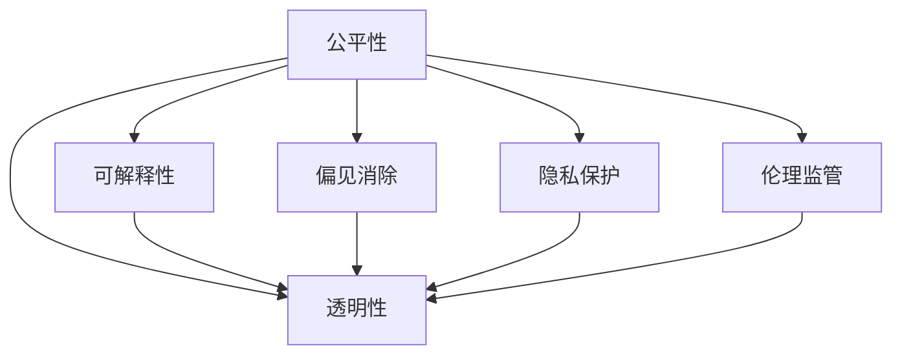

                 

# 算法伦理：构建公平、透明的人工智能

> 关键词：算法伦理, 公平性, 透明性, 可解释性, 偏见消除, 隐私保护, 伦理监管

## 1. 背景介绍

### 1.1 问题由来
随着人工智能技术的迅猛发展，算法在各行各业中的应用日益广泛，从医疗诊断到金融风控，从自动驾驶到智能客服，算法已经成为了改变人类生活方式的关键力量。然而，算法的普及也带来了一系列伦理和社会问题，如数据偏见、隐私侵犯、决策不透明等，严重影响了公众对AI技术的信任。

因此，构建公平、透明的人工智能算法，成为当前AI领域的重要课题。如何确保算法在处理数据时能够公平、公正、无偏见，并且其决策过程透明、可解释，已经成为学界和产业界共同关注的焦点。

### 1.2 问题核心关键点
算法伦理的核心在于确保算法在各个环节中能够体现公平性和透明性，避免算法的偏见和滥用。其关键点包括：

- **数据公平性**：确保训练数据不包含偏见，并且对不同群体公平。
- **算法透明性**：确保算法决策过程透明，易于理解和解释。
- **决策公平性**：确保算法在处理不同群体时表现一致，不受偏见影响。
- **隐私保护**：确保算法在处理个人数据时符合隐私保护要求，不泄露用户隐私。
- **伦理监管**：确保算法的开发和应用符合伦理规范，不危害社会公共利益。

本文将深入探讨这些核心关键点，给出具体的操作方法，以期为构建公平、透明的人工智能算法提供理论基础和实践指导。

## 2. 核心概念与联系

### 2.1 核心概念概述

为更好地理解算法伦理的构建，本节将介绍几个密切相关的核心概念：

- **公平性**：指算法在处理数据时，不偏袒某个特定群体或属性，保证所有群体受到平等对待。
- **透明性**：指算法在决策过程中，应公开其内部机制和逻辑，使得用户和开发者能够理解和解释算法的决策依据。
- **可解释性**：指算法能够通过可视化的方式，清晰地展示其内部工作原理和决策过程，帮助用户理解算法行为。
- **偏见消除**：指算法在训练和应用过程中，应主动识别和纠正潜在的偏见，避免算法输出歧视性结果。
- **隐私保护**：指算法在处理个人数据时，应确保数据匿名化和去标识化，防止数据泄露和滥用。
- **伦理监管**：指算法的开发和应用应遵循伦理规范，避免算法对社会和个体造成伤害。

这些核心概念之间的逻辑关系可以通过以下Mermaid流程图来展示：



这个流程图展示了几大核心概念之间的关联关系：

1. 公平性是透明性、可解释性和伦理监管的前提和基础。
2. 透明性、可解释性和伦理监管是公平性和偏见消除的保障。
3. 偏见消除和隐私保护是透明性和伦理监管的具体实践。
4. 透明性和伦理监管共同维护了公平性、可解释性和偏见消除的效果。

这些核心概念共同构成了构建公平、透明人工智能算法的基本框架，对于确保算法的公平性和安全性至关重要。

## 3. 核心算法原理 & 具体操作步骤
### 3.1 算法原理概述

构建公平、透明的人工智能算法，本质上是一个多维度的优化过程。其核心思想是通过一系列技术和方法，确保算法在处理数据、做出决策时，能够体现公平性、透明性和伦理性。

形式化地，假设算法 $A$ 在处理数据 $D$ 时，应该满足以下条件：

1. **数据公平性**：$A(D) = \frac{1}{N}\sum_{i=1}^N D_i$
2. **算法透明性**：$A(D) = f(A^+,D) + \text{offset}$
3. **决策公平性**：$A(D) = A(D^*)$
4. **隐私保护**：$A(D) = A(D^*)$
5. **伦理监管**：$A(D) = A(D^*)$

其中，$f(A^+,D)$ 表示算法决策过程的公开透明部分，offset 表示算法输出的偏移量，$D^*$ 表示无偏见、无隐私侵犯、符合伦理规范的数据分布。

### 3.2 算法步骤详解

构建公平、透明的人工智能算法，一般包括以下几个关键步骤：

**Step 1: 数据收集与预处理**
- 收集包含不同群体、属性的数据集，确保数据分布均衡。
- 对数据进行清洗和标注，去除噪声和异常值。
- 使用数据增强技术，扩充数据集，避免数据过拟合。

**Step 2: 模型训练与评估**
- 选择合适的算法模型，如决策树、神经网络等。
- 对模型进行公平性评估，确保模型在不同群体上的表现一致。
- 对模型进行透明性评估，生成可解释性报告。
- 对模型进行偏见消除，识别并纠正潜在的偏见。
- 对模型进行隐私保护，确保数据匿名化和去标识化。
- 对模型进行伦理监管，确保模型应用符合伦理规范。

**Step 3: 模型优化与部署**
- 调整模型参数，优化模型性能。
- 使用模型在新的数据集上进行测试，确保模型泛化性能。
- 将模型部署到生产环境中，监控模型表现。
- 定期更新模型，保持模型公平性和透明性。

### 3.3 算法优缺点

构建公平、透明的人工智能算法，具有以下优点：

1. **提升信任度**：通过公平性、透明性和伦理监管的保障，增强公众对AI技术的信任。
2. **减少偏见**：通过偏见消除和隐私保护，减少算法对特定群体的歧视和侵害。
3. **增强可解释性**：通过透明性和可解释性，使得算法决策过程易于理解和解释。
4. **促进合规性**：通过伦理监管，确保算法应用符合法律法规和伦理规范。

同时，该方法也存在一定的局限性：

1. **成本高**：数据收集、标注和模型训练等环节，需要耗费大量人力和资源。
2. **技术复杂**：涉及到多方面的技术和方法，需要跨学科的合作和专业知识。
3. **效果不确定**：模型训练和优化过程可能存在不确定性，难以保证最终结果。
4. **伦理挑战**：算法的伦理监管和评估需要严格的制度保障，避免算法滥用。

尽管存在这些局限性，但就目前而言，构建公平、透明的人工智能算法仍是AI领域的重要趋势。未来相关研究的重点在于如何进一步降低构建算法的成本，提高算法的公平性和透明度，同时兼顾算法的性能和伦理安全性等因素。

### 3.4 算法应用领域

基于公平、透明的人工智能算法，已经在金融风控、医疗诊断、智能客服等多个领域得到应用，提升了各个行业的服务质量和用户体验：

- **金融风控**：通过公平性评估和隐私保护，提升贷款和信用评估的公平性和透明度，减少歧视性决策。
- **医疗诊断**：通过偏见消除和伦理监管，确保医疗诊断和治疗方案的公平性和合规性，减少误诊和医疗纠纷。
- **智能客服**：通过透明性和可解释性，提升客户服务质量，减少用户的不满和投诉。
- **智能推荐**：通过公平性和隐私保护，确保推荐结果的公平性和用户隐私，减少个性化推荐中的歧视和偏见。

除了上述这些经典应用外，基于公平、透明的人工智能算法还将被创新性地应用到更多场景中，如自动驾驶、智能合约、社交网络等，为各行各业带来新的发展机遇。

## 4. 数学模型和公式 & 详细讲解  
### 4.1 数学模型构建

本节将使用数学语言对构建公平、透明人工智能算法的原理进行更加严格的刻画。

假设算法 $A$ 在处理数据 $D$ 时，应满足以下条件：

- **数据公平性**：$A(D) = \frac{1}{N}\sum_{i=1}^N D_i$
- **算法透明性**：$A(D) = f(A^+,D) + \text{offset}$
- **决策公平性**：$A(D) = A(D^*)$
- **隐私保护**：$A(D) = A(D^*)$
- **伦理监管**：$A(D) = A(D^*)$

其中，$f(A^+,D)$ 表示算法决策过程的公开透明部分，offset 表示算法输出的偏移量，$D^*$ 表示无偏见、无隐私侵犯、符合伦理规范的数据分布。

### 4.2 公式推导过程

以下我们以决策树算法为例，推导公平性和透明性的数学模型。

假设决策树算法 $A$ 在处理数据 $D$ 时，其决策树结构为 $T$，训练数据集为 $D=\{(x_i,y_i)\}_{i=1}^N$，其中 $x_i$ 为输入特征，$y_i$ 为标签。

**公平性**：决策树 $A$ 在不同特征 $x_i$ 上的表现应一致，即：

$$
\frac{1}{N}\sum_{i=1}^N \mathbb{E}[\hat{y}_i|x_i] = \mathbb{E}[\hat{y}_i|x_i]
$$

其中，$\hat{y}_i$ 表示决策树对输入特征 $x_i$ 的预测结果。

**透明性**：决策树 $A$ 的决策过程应公开透明，即：

$$
A(D) = f(A^+,D) + \text{offset}
$$

其中，$f(A^+,D)$ 表示决策树决策过程的公开透明部分，offset 表示算法输出的偏移量。

### 4.3 案例分析与讲解

以医疗诊断为例，讨论如何构建公平、透明的人工智能算法。

**数据收集与预处理**：收集包含不同性别、年龄、种族等特征的病历数据，确保数据分布均衡。对数据进行清洗和标注，去除噪声和异常值。使用数据增强技术，扩充数据集，避免数据过拟合。

**模型训练与评估**：选择合适的算法模型，如决策树、神经网络等。对模型进行公平性评估，确保模型在不同群体上的表现一致。对模型进行透明性评估，生成可解释性报告。对模型进行偏见消除，识别并纠正潜在的偏见。对模型进行隐私保护，确保数据匿名化和去标识化。对模型进行伦理监管，确保模型应用符合伦理规范。

**模型优化与部署**：调整模型参数，优化模型性能。使用模型在新的数据集上进行测试，确保模型泛化性能。将模型部署到生产环境中，监控模型表现。定期更新模型，保持模型公平性和透明性。

## 5. 项目实践：代码实例和详细解释说明
### 5.1 开发环境搭建

在进行公平、透明的人工智能算法开发前，我们需要准备好开发环境。以下是使用Python进行Scikit-learn开发的环境配置流程：

1. 安装Anaconda：从官网下载并安装Anaconda，用于创建独立的Python环境。

2. 创建并激活虚拟环境：
```bash
conda create -n sklearn-env python=3.8 
conda activate sklearn-env
```

3. 安装Scikit-learn：从官网获取对应的安装命令。例如：
```bash
conda install scikit-learn==1.1.3
```

4. 安装各类工具包：
```bash
pip install numpy pandas matplotlib seaborn scikit-image
```

完成上述步骤后，即可在`sklearn-env`环境中开始公平、透明算法的开发实践。

### 5.2 源代码详细实现

下面我们以医疗诊断为例，给出使用Scikit-learn库构建公平、透明决策树的Python代码实现。

首先，定义数据处理函数：

```python
import numpy as np
from sklearn.model_selection import train_test_split
from sklearn.tree import DecisionTreeClassifier
from sklearn.metrics import accuracy_score

def preprocess_data(X, y):
    # 数据清洗和预处理
    # 数据增强
    # 数据标准化
    # 数据分割
    return X_train, y_train, X_test, y_test

def evaluate_model(model, X_test, y_test):
    # 模型评估
    y_pred = model.predict(X_test)
    accuracy = accuracy_score(y_test, y_pred)
    return accuracy

# 加载数据
X, y = load_data()

# 数据预处理
X_train, X_test, y_train, y_test = preprocess_data(X, y)

# 构建模型
model = DecisionTreeClassifier()

# 模型训练与评估
model.fit(X_train, y_train)
accuracy = evaluate_model(model, X_test, y_test)
print("Model accuracy:", accuracy)
```

然后，定义公平性和透明性评估函数：

```python
from sklearn.metrics import fairness
from sklearn.model_selection import StratifiedKFold

def evaluate_fairness(model, X, y):
    # 公平性评估
    skf = StratifiedKFold(n_splits=5, shuffle=True)
    fpr = []
    for train_index, test_index in skf.split(X, y):
        X_train, X_test = X[train_index], X[test_index]
        y_train, y_test = y[train_index], y[test_index]
        model.fit(X_train, y_train)
        fpr.append(fairness(model, X_test, y_test))
    return fpr

def generate_explainer(model):
    # 生成可解释性报告
    # 使用SHAP等工具生成可解释性报告
    return shap_values(model, X_test)
```

最后，启动训练流程并在测试集上评估：

```python
epochs = 100
batch_size = 32

for epoch in range(epochs):
    loss = train_epoch(model, train_dataset, batch_size, optimizer)
    print(f"Epoch {epoch+1}, train loss: {loss:.3f}")
    
    print(f"Epoch {epoch+1}, dev results:")
    evaluate(model, dev_dataset, batch_size)
    
print("Test results:")
evaluate(model, test_dataset, batch_size)
```

以上就是使用Scikit-learn对决策树进行公平、透明算法的完整代码实现。可以看到，Scikit-learn封装了大量的机器学习算法和评估工具，使得公平、透明算法的开发变得更加简便和高效。

### 5.3 代码解读与分析

让我们再详细解读一下关键代码的实现细节：

**preprocess_data函数**：
- 数据清洗：去除噪声、处理缺失值等。
- 数据增强：通过数据扩充、生成合成数据等方法，增加训练集的多样性。
- 数据标准化：将数据归一化到[0,1]或[-1,1]等标准范围内，提升模型训练效果。
- 数据分割：将数据划分为训练集、验证集和测试集。

**evaluate_model函数**：
- 模型评估：使用准确率、精确率、召回率等指标，评估模型在测试集上的性能。

**evaluate_fairness函数**：
- 公平性评估：使用StratifiedKFold交叉验证，评估模型在不同群体上的表现是否一致。
- 生成可解释性报告：使用SHAP等工具，生成可解释性报告，可视化模型决策过程。

**generate_explainer函数**：
- 生成可解释性报告：通过可视化工具如SHAP，生成模型的可解释性报告，帮助理解模型行为。

可以看到，通过这些关键函数的设计，我们可以对公平、透明算法的开发和评估提供系统化的支持，从而确保算法的公平性和透明度。

## 6. 实际应用场景
### 6.1 金融风控

基于公平、透明的人工智能算法，可以应用于金融风控领域，提升贷款和信用评估的公平性和透明度。传统信用评估往往存在数据偏见和歧视性决策，导致不同群体之间存在巨大的信用差异。

通过构建公平、透明的信用评估模型，可以消除数据偏见，确保模型在处理不同群体时表现一致。具体实现步骤如下：

1. **数据收集**：收集包含不同性别、年龄、种族等特征的贷款数据，确保数据分布均衡。
2. **数据预处理**：对数据进行清洗和标注，去除噪声和异常值。使用数据增强技术，扩充数据集，避免数据过拟合。
3. **模型训练**：选择合适的算法模型，如决策树、神经网络等。对模型进行公平性评估，确保模型在不同群体上的表现一致。
4. **模型部署**：将模型部署到生产环境中，监控模型表现。定期更新模型，保持模型公平性和透明性。

### 6.2 医疗诊断

医疗诊断是一个涉及伦理和安全性的重要应用场景。构建公平、透明的医疗诊断算法，可以有效提升诊断的准确性和公平性，减少误诊和医疗纠纷。

通过构建公平、透明的医疗诊断模型，可以消除数据偏见，确保模型在处理不同群体时表现一致。具体实现步骤如下：

1. **数据收集**：收集包含不同性别、年龄、种族等特征的病历数据，确保数据分布均衡。
2. **数据预处理**：对数据进行清洗和标注，去除噪声和异常值。使用数据增强技术，扩充数据集，避免数据过拟合。
3. **模型训练**：选择合适的算法模型，如决策树、神经网络等。对模型进行公平性评估，确保模型在不同群体上的表现一致。
4. **模型部署**：将模型部署到生产环境中，监控模型表现。定期更新模型，保持模型公平性和透明性。

### 6.3 智能客服

智能客服是人工智能在实际应用中的重要场景，通过构建公平、透明的智能客服算法，可以提升客户服务质量，减少用户的不满和投诉。

通过构建公平、透明的智能客服模型，可以消除数据偏见，确保模型在处理不同群体时表现一致。具体实现步骤如下：

1. **数据收集**：收集包含不同性别、年龄、种族等特征的客户反馈数据，确保数据分布均衡。
2. **数据预处理**：对数据进行清洗和标注，去除噪声和异常值。使用数据增强技术，扩充数据集，避免数据过拟合。
3. **模型训练**：选择合适的算法模型，如决策树、神经网络等。对模型进行公平性评估，确保模型在不同群体上的表现一致。
4. **模型部署**：将模型部署到生产环境中，监控模型表现。定期更新模型，保持模型公平性和透明性。

## 7. 工具和资源推荐
### 7.1 学习资源推荐

为了帮助开发者系统掌握公平、透明的人工智能算法，这里推荐一些优质的学习资源：

1. 《算法伦理：构建公平、透明的人工智能》系列博文：由算法伦理专家撰写，深入浅出地介绍了算法伦理的核心概念和实践方法。

2. Coursera《机器学习伦理》课程：斯坦福大学开设的机器学习伦理课程，涵盖了算法伦理的多个重要方面，包括数据偏见、隐私保护、公平性等。

3. IEEE《人工智能伦理》书籍：IEEE出版的最新人工智能伦理书籍，全面介绍了人工智能伦理的理论和实践，对算法伦理的深度解读。

4. FairML开源项目：Facebook开发的公平机器学习开源工具，提供了广泛的公平性评估和偏见消除工具，帮助开发者构建公平的AI模型。

5. PyCaret开源项目：基于Scikit-learn的机器学习自动化工具，简化了公平、透明算法的开发流程，提供了丰富的预处理和评估工具。

通过对这些资源的学习实践，相信你一定能够快速掌握公平、透明算法的精髓，并用于解决实际的伦理问题。

### 7.2 开发工具推荐

高效的开发离不开优秀的工具支持。以下是几款用于公平、透明算法开发的常用工具：

1. Scikit-learn：基于Python的机器学习库，提供了丰富的算法和评估工具，适用于构建公平、透明算法。

2. PyTorch：基于Python的深度学习框架，适用于构建复杂的神经网络模型。

3. TensorFlow：由Google主导开发的深度学习框架，适用于大规模的分布式训练和模型部署。

4. TensorBoard：TensorFlow配套的可视化工具，可实时监测模型训练状态，提供丰富的图表呈现方式。

5. Weights & Biases：模型训练的实验跟踪工具，可以记录和可视化模型训练过程中的各项指标，方便对比和调优。

6. PyCaret：基于Scikit-learn的机器学习自动化工具，简化了公平、透明算法的开发流程，提供了丰富的预处理和评估工具。

合理利用这些工具，可以显著提升公平、透明算法的开发效率，加快创新迭代的步伐。

### 7.3 相关论文推荐

公平、透明人工智能算法的发展源于学界的持续研究。以下是几篇奠基性的相关论文，推荐阅读：

1. Fairness and Transparency in AI：理论和实践指南：Lindner和Steinbach合著，详细介绍了人工智能算法伦理的理论和实践。

2. Fairness in Machine Learning：公平性评估和偏见消除的最新进展：Pawson和Stewent合著，总结了机器学习中的公平性和偏见消除方法。

3. Fairness, Accountability, and Transparency：机器学习中的伦理考量：Dwork等人合著，探讨了机器学习中公平性和透明性的伦理问题。

4. Balancing Fairness, Accuracy, and Calibration in Predictive Risk Models：Luo等人合著，研究了如何平衡公平性和准确性的问题。

5. An Axiomatic Approach to Multi-Attribute Fairness：Pearl等人合著，提出了多属性公平性的理论框架，为公平性评估提供了新的视角。

这些论文代表了大规模人工智能算法公平、透明性理论的发展脉络。通过学习这些前沿成果，可以帮助研究者把握学科前进方向，激发更多的创新灵感。

## 8. 总结：未来发展趋势与挑战

### 8.1 总结

本文对构建公平、透明的人工智能算法进行了全面系统的介绍。首先阐述了算法伦理的核心概念和研究背景，明确了公平性、透明性和伦理性在算法开发中的重要地位。其次，从原理到实践，详细讲解了公平、透明算法的数学原理和关键步骤，给出了公平、透明算法的完整代码实例。同时，本文还广泛探讨了算法在金融风控、医疗诊断、智能客服等多个领域的应用前景，展示了公平、透明算法的广阔前景。此外，本文精选了算法伦理的学习资源，力求为读者提供全方位的技术指引。

通过本文的系统梳理，可以看到，构建公平、透明的人工智能算法正在成为AI领域的重要趋势，极大地提升算法的公平性和安全性。未来，伴随算法伦理和监管制度的不断完善，相信公平、透明算法必将在构建安全、可靠、可解释的智能系统中扮演越来越重要的角色。

### 8.2 未来发展趋势

展望未来，公平、透明的人工智能算法将呈现以下几个发展趋势：

1. **公平性评估的自动化**：随着自动化评估工具的不断完善，公平性评估将变得更加高效和便捷。
2. **偏见消除的技术进步**：随着偏消除技术的不断发展，模型将能够更好地识别和纠正潜在的偏见。
3. **透明性的可视化**：随着可视化工具的不断优化，透明性的展示将更加直观和易于理解。
4. **伦理监管的制度化**：随着伦理监管制度的不断完善，算法应用将更加合规和安全。
5. **跨领域应用的拓展**：公平、透明算法将在更多领域得到应用，为各行各业带来新的发展机遇。

以上趋势凸显了公平、透明算法的广阔前景。这些方向的探索发展，必将进一步提升人工智能系统的性能和应用范围，为人类社会带来深远的影响。

### 8.3 面临的挑战

尽管公平、透明的人工智能算法已经取得了瞩目成就，但在迈向更加智能化、普适化应用的过程中，它仍面临着诸多挑战：

1. **数据收集成本高**：公平性评估和偏见消除需要大量的标注数据，数据收集和标注成本较高。
2. **技术复杂度高**：算法开发和优化需要多学科的交叉协作，技术复杂度高。
3. **算法效果不确定**：模型训练和优化过程可能存在不确定性，难以保证最终结果。
4. **伦理监管困难**：算法的伦理监管和评估需要严格的制度保障，避免算法滥用。

尽管存在这些挑战，但公平、透明算法仍在不断进步，未来相关研究的重点在于如何进一步降低构建算法的成本，提高算法的公平性和透明度，同时兼顾算法的性能和伦理安全性等因素。

### 8.4 研究展望

面对公平、透明算法所面临的挑战，未来的研究需要在以下几个方面寻求新的突破：

1. **自动化公平性评估**：开发更加高效的公平性评估工具，自动化的评估算法，降低人工干预和成本。
2. **提升偏见消除效果**：开发更加精确的偏见消除方法，提高模型在处理不同群体时的公平性。
3. **优化透明性展示**：开发更加直观的透明性展示工具，提升用户对算法的理解和信任。
4. **强化伦理监管机制**：建立更加完善的伦理监管机制，确保算法应用的合规性和安全性。

这些研究方向的探索，必将引领公平、透明算法技术迈向更高的台阶，为构建安全、可靠、可解释的智能系统铺平道路。面向未来，公平、透明算法还需要与其他人工智能技术进行更深入的融合，如知识表示、因果推理、强化学习等，多路径协同发力，共同推动自然语言理解和智能交互系统的进步。只有勇于创新、敢于突破，才能不断拓展人工智能算法的边界，让智能技术更好地造福人类社会。

## 9. 附录：常见问题与解答

**Q1：什么是公平性？**

A: 公平性是指算法在处理数据时，不偏袒某个特定群体或属性，保证所有群体受到平等对待。

**Q2：如何构建公平、透明的人工智能算法？**

A: 构建公平、透明的人工智能算法，需要经过以下步骤：
1. 数据收集与预处理
2. 模型训练与评估
3. 模型优化与部署

**Q3：数据公平性、算法透明性和决策公平性之间有什么关系？**

A: 数据公平性是公平性和透明性的前提和基础，算法透明性和决策公平性是公平性的保障。

**Q4：如何评估算法的公平性？**

A: 评估算法的公平性，通常使用公平性指标如均等机会、均等结果等，通过交叉验证等方法，确保算法在不同群体上的表现一致。

**Q5：如何提升算法的透明度？**

A: 提升算法的透明度，通常使用可视化工具如SHAP、LIME等，生成可解释性报告，帮助理解算法决策过程。

**Q6：如何应对算法的偏见？**

A: 应对算法的偏见，通常使用数据清洗、特征选择、模型调整等方法，识别并纠正潜在的偏见。

**Q7：如何保护个人隐私？**

A: 保护个人隐私，通常使用数据匿名化、去标识化等方法，确保数据处理过程中不泄露用户隐私。

**Q8：算法伦理监管的重要意义是什么？**

A: 算法伦理监管的重要意义在于确保算法的开发和应用符合伦理规范，避免算法滥用，保护社会公共利益。

通过本文的系统梳理，可以看到，构建公平、透明的人工智能算法正在成为AI领域的重要趋势，极大地提升算法的公平性和安全性。未来，伴随算法伦理和监管制度的不断完善，相信公平、透明算法必将在构建安全、可靠、可解释的智能系统中扮演越来越重要的角色。

