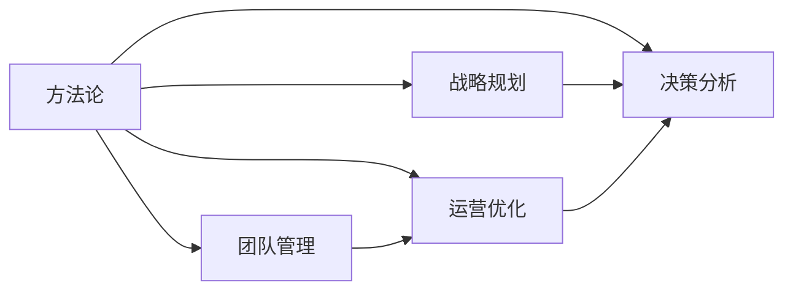

                 

# 管理者如何形成自己的方法论

## 1. 背景介绍

在当今快速变化的市场环境中，管理者面临的挑战日益严峻。如何高效地管理团队、优化运营流程、制定正确的战略决策，成为每一个管理者的必修课。然而，理论知识往往难以直接应用到实践中。因此，管理者必须结合自身的经验、行业的洞察和理论的指导，形成一套属于自己的方法论，以应对复杂的业务挑战。

本文章将系统介绍管理者如何构建并应用自己的方法论，以期帮助读者建立系统化的思维方式，提升管理决策的科学性和系统性。

## 2. 核心概念与联系

### 2.1 核心概念概述

要构建自己的方法论，首先需要理解几个核心概念：

- **方法论(Methodology)**：一系列基于实践、理论、经验的方法、步骤和工具，用于指导管理决策和实践。
- **战略规划(Strategic Planning)**：系统地分析和规划组织的长期目标与策略，制定具体实施步骤。
- **团队管理(Team Management)**：有效管理团队，最大化团队的协作效率和创新能力。
- **运营优化(Operational Optimization)**：通过系统分析和调整，优化运营流程，提高资源利用效率。
- **决策分析(Decision Analysis)**：基于数据和分析，评估和选择最佳决策方案。

这些概念相互关联，共同构成了管理者方法论的核心框架。方法论的形成过程，即是对这些核心概念的深刻理解和有效整合。

### 2.2 核心概念原理和架构的 Mermaid 流程图



这个流程图展示了各个核心概念之间的关系：

1. **方法论**：综合了**战略规划**、**团队管理**、**运营优化**、**决策分析**等各个领域，形成一个指导管理者进行系统化决策和实践的整体框架。
2. **战略规划**：为实现组织的长期目标，系统地制定和实施战略，是管理者方法论的重要组成部分。
3. **团队管理**：通过有效的人力资源管理和团队协作，提升组织整体效率和创新能力。
4. **运营优化**：通过分析和调整运营流程，提高资源利用效率，降低成本，提升运营质量。
5. **决策分析**：基于数据和分析，评估和选择最佳的决策方案，确保决策的科学性和有效性。

## 3. 核心算法原理 & 具体操作步骤

### 3.1 算法原理概述

构建和管理者的个人方法论，本质上是将理论与实践相结合的过程。管理者需要从多个维度，如组织结构、流程优化、人力资源、战略制定等，系统地分析和评估当前管理情况，并制定相应的改进措施。这一过程可以通过一系列算法和步骤来实现：

1. **数据收集与分析**：通过定量和定性数据分析，了解组织现状和存在的问题。
2. **问题识别与优先级排序**：基于数据，识别主要问题，并根据其影响程度和紧迫性进行优先级排序。
3. **战略制定与实施**：根据优先级排序，制定具体的战略计划，并逐步实施。
4. **团队建设和激励**：通过团队管理技巧，激发团队成员的积极性和创新能力。
5. **运营流程优化**：通过分析现有流程，识别瓶颈和浪费，优化运营效率。
6. **决策分析与反馈**：基于数据和分析，评估决策效果，并根据反馈进行持续优化。

### 3.2 算法步骤详解

#### 3.2.1 数据收集与分析

1. **收集数据**：
   - **定性数据**：通过问卷调查、访谈等方式，收集员工的反馈和意见。
   - **定量数据**：通过绩效数据、运营数据等，收集关键指标和趋势。

2. **数据整理**：
   - **数据清洗**：处理缺失值、异常值和重复数据。
   - **数据整合**：将定性和定量数据整合，形成综合视图。

3. **数据分析**：
   - **趋势分析**：通过时间序列分析，了解各项指标的变化趋势。
   - **结构分析**：通过聚类分析，识别关键问题和影响因素。

#### 3.2.2 问题识别与优先级排序

1. **问题识别**：
   - **问题分类**：根据数据分析结果，将问题分类，如人员管理、流程优化、技术瓶颈等。
   - **问题定义**：明确每个问题的具体描述和影响。

2. **优先级排序**：
   - **影响评估**：评估每个问题的潜在影响，包括业务影响、员工满意度等。
   - **紧迫性评估**：评估问题的紧急程度，如客户投诉、财务压力等。

3. **优先级排序算法**：
   - **加权排序法**：通过设定影响和紧迫性权重，进行加权排序。
   - **ABC分析法**：将问题分为A、B、C三类，优先解决A类问题。

#### 3.2.3 战略制定与实施

1. **战略制定**：
   - **目标设定**：明确组织的长期和短期目标。
   - **方案设计**：设计具体的战略方案，包括业务方向、资源配置等。

2. **战略实施**：
   - **阶段规划**：将战略方案分解为若干阶段，设定里程碑和目标。
   - **资源分配**：根据战略需求，分配和优化资源。

3. **监控与调整**：
   - **进度跟踪**：实时监控战略实施进度，及时调整和优化。
   - **效果评估**：通过关键指标评估战略效果，进行持续改进。

#### 3.2.4 团队建设和激励

1. **人员评估**：
   - **技能评估**：评估团队成员的技能和潜力。
   - **心理评估**：了解团队成员的工作动机和态度。

2. **激励设计**：
   - **目标设定**：设定明确的个人和团队目标。
   - **激励机制**：设计公平合理的激励机制，如绩效奖金、晋升机会等。

3. **团队建设**：
   - **沟通机制**：建立有效的沟通渠道，促进信息共享。
   - **协作培训**：组织团队协作培训，提升团队协作能力。

#### 3.2.5 运营流程优化

1. **流程分析**：
   - **流程映射**：绘制现有流程的流程图，识别瓶颈和浪费。
   - **价值分析**：评估每个环节的价值和效率，找出改进点。

2. **流程优化**：
   - **自动化工具**：引入自动化工具，提高流程效率。
   - **流程简化**：简化流程步骤，消除不必要的环节。

3. **流程监控**：
   - **效率监控**：实时监控流程效率，识别问题点。
   - **持续改进**：根据监控结果，持续优化流程。

#### 3.2.6 决策分析与反馈

1. **决策模型**：
   - **决策树**：使用决策树模型，评估不同方案的效果。
   - **多目标优化**：使用多目标优化算法，选择最优方案。

2. **数据驱动决策**：
   - **数据可视化**：通过数据可视化工具，直观展示决策依据。
   - **实时分析**：利用实时数据分析，支持快速决策。

3. **反馈机制**：
   - **效果评估**：评估决策效果，了解实际影响。
   - **持续优化**：根据反馈结果，持续优化决策过程。

### 3.3 算法优缺点

#### 3.3.1 优点

- **系统化决策**：通过综合分析各个关键领域，制定科学合理的决策方案。
- **数据驱动**：基于数据和分析，提高决策的准确性和可操作性。
- **持续改进**：通过持续优化和反馈，不断提高管理效能。

#### 3.3.2 缺点

- **复杂度高**：需要收集和分析大量数据，过程较为复杂。
- **时间成本高**：从数据收集到决策实施，过程较长。
- **依赖专业技能**：需要具备数据分析、流程优化等专业技能。

### 3.4 算法应用领域

管理者方法论不仅适用于企业管理的各个环节，还广泛应用于政府、非营利组织等各类组织的治理过程中。以下列举几个具体的应用场景：

1. **企业管理**：
   - **组织结构优化**：通过团队管理技巧，优化组织结构，提升协作效率。
   - **业务流程改进**：通过运营优化，提高业务流程效率，降低成本。
   - **市场战略制定**：通过战略规划，制定市场战略，拓展业务空间。

2. **政府治理**：
   - **政策制定**：通过战略规划，制定和实施政府政策，提升治理效果。
   - **公共服务优化**：通过运营优化，提高公共服务效率，提升群众满意度。
   - **社会问题应对**：通过决策分析，快速响应社会问题，维护社会稳定。

3. **非营利组织**：
   - **项目规划**：通过战略规划，制定项目计划，提升组织影响力。
   - **资源配置**：通过运营优化，优化资源配置，提高资源利用效率。
   - **利益相关者管理**：通过团队管理，协调利益相关者关系，促进合作。

## 4. 数学模型和公式 & 详细讲解 & 举例说明

### 4.1 数学模型构建

管理者的个人方法论构建，涉及多个子系统的整合和优化。以下以一个简单的管理绩效评估模型为例，介绍数学模型的构建过程：

#### 4.1.1 数据收集与分析

1. **员工绩效数据**：
   - **定性数据**：通过问卷调查，收集员工对工作满意度的反馈。
   - **定量数据**：通过绩效评分、工作量等，收集关键绩效指标。

2. **员工心理数据**：
   - **心理测评**：使用心理测评工具，评估员工的动机和态度。
   - **员工满意度调查**：通过定期调查，了解员工对工作环境和文化的满意度。

3. **整合与分析**：
   - **数据清洗**：处理缺失值和异常值。
   - **数据整合**：将定性和定量数据整合，形成综合视图。
   - **数据分析**：通过回归分析，评估不同因素对绩效的影响。

#### 4.1.2 问题识别与优先级排序

1. **问题分类**：
   - **影响评估**：评估每个问题的潜在影响，如员工流失率、工作满意度等。
   - **紧迫性评估**：评估问题的紧急程度，如紧急任务处理、团队协作等。

2. **优先级排序算法**：
   - **加权排序法**：通过设定影响和紧迫性权重，进行加权排序。
   - **ABC分析法**：将问题分为A、B、C三类，优先解决A类问题。

#### 4.1.3 战略制定与实施

1. **目标设定**：
   - **长期目标**：设定长期绩效提升目标，如提高员工满意度、增加生产效率等。
   - **短期目标**：设定短期绩效提升目标，如提高任务完成率、减少加班时间等。

2. **方案设计**：
   - **培训计划**：设计培训方案，提升员工技能和态度。
   - **激励机制**：设计公平合理的激励机制，如绩效奖金、晋升机会等。

3. **资源分配**：
   - **预算分配**：根据战略需求，合理分配培训和激励预算。
   - **人力配置**：根据战略需求，调整人力资源配置。

4. **监控与调整**：
   - **进度跟踪**：实时监控战略实施进度，及时调整和优化。
   - **效果评估**：通过关键指标评估战略效果，进行持续改进。

### 4.2 公式推导过程

#### 4.2.1 目标设定与绩效评估模型

1. **目标设定**：
   - **长期目标**：$G$：总绩效提升目标，如10%的绩效增长。
   - **短期目标**：$S_i$：每个短期目标，如减少加班时间、提高任务完成率等。

2. **绩效评估**：
   - **定性评估**：通过员工满意度调查，评估每个员工的工作满意度。
   - **定量评估**：通过绩效评分，评估每个员工的工作绩效。

3. **综合评估**：
   - **加权平均**：对定性和定量评估结果进行加权平均，计算综合绩效。
   - **回归分析**：通过回归分析，评估不同因素对绩效的影响。

#### 4.2.2 问题识别与优先级排序模型

1. **问题分类**：
   - **问题列表**：$P_i$：每个问题的描述和影响。
   - **影响评估**：$I_i$：每个问题的潜在影响。
   - **紧迫性评估**：$C_i$：每个问题的紧急程度。

2. **优先级排序**：
   - **加权排序法**：通过设定权重$w_{I,C}$，进行加权排序。
   - **ABC分析法**：将问题分为A、B、C三类，优先解决A类问题。

#### 4.2.3 战略制定与实施模型

1. **目标分解**：
   - **长期目标**：$G$：总绩效提升目标，如10%的绩效增长。
   - **短期目标**：$S_i$：每个短期目标，如减少加班时间、提高任务完成率等。

2. **方案设计**：
   - **培训计划**：$T_i$：每个培训方案的描述和预期效果。
   - **激励机制**：$I_i$：每个激励机制的描述和预期效果。

3. **资源分配**：
   - **预算分配**：$B_i$：每个预算分配的金额。
   - **人力配置**：$H_i$：每个人力资源配置的数量。

4. **监控与调整**：
   - **进度跟踪**：$P_i$：每个目标的实施进度。
   - **效果评估**：$E_i$：每个目标的实际效果。

### 4.3 案例分析与讲解

#### 4.3.1 案例背景

某科技公司管理团队发现，员工流失率持续上升，严重影响了公司的稳定性和业务发展。管理层决定通过方法论构建，制定和实施改进措施。

#### 4.3.2 问题识别与优先级排序

1. **问题分类**：
   - **影响评估**：员工流失率上升，影响团队协作和业务稳定性。
   - **紧迫性评估**：紧急性较高，需尽快解决。

2. **优先级排序**：
   - **加权排序法**：设定影响权重$w_I=0.7$，紧迫性权重$w_C=0.3$，进行加权排序。
   - **ABC分析法**：将问题分为A、B、C三类，优先解决A类问题。

#### 4.3.3 战略制定与实施

1. **目标设定**：
   - **长期目标**：降低员工流失率，提高员工满意度。
   - **短期目标**：提升员工福利，改善工作环境。

2. **方案设计**：
   - **培训计划**：设计培训课程，提升员工技能和态度。
   - **激励机制**：设计绩效奖金、晋升机会等激励机制。

3. **资源分配**：
   - **预算分配**：合理分配培训和激励预算。
   - **人力配置**：调整人力资源配置，关注员工需求。

4. **监控与调整**：
   - **进度跟踪**：实时监控培训和激励计划的实施进度。
   - **效果评估**：通过员工满意度调查和绩效评分，评估效果，进行持续改进。

## 5. 项目实践：代码实例和详细解释说明

### 5.1 开发环境搭建

在实际应用中，管理者方法论的构建需要结合多种工具和方法，以下是一个简单的Python代码实例：

#### 5.1.1 Python环境配置

1. **安装Python**：
   - 从官网下载并安装Python 3.x版本。
   - 安装pip工具，用于安装和管理Python包。

2. **安装相关库**：
   - 安装NumPy、Pandas、Matplotlib等常用库，用于数据处理和可视化。
   - 安装Scikit-learn、TensorFlow等机器学习库，用于数据分析和模型训练。

3. **创建虚拟环境**：
   - 使用conda创建虚拟环境，隔离依赖，避免版本冲突。
   - 激活虚拟环境，安装需要的库。

#### 5.1.2 代码实例

```python
import numpy as np
import pandas as pd
from sklearn.linear_model import LinearRegression
import matplotlib.pyplot as plt

# 数据收集与分析
data = pd.read_csv('employee_performance.csv')
cleaned_data = data.dropna()

# 问题识别与优先级排序
impact_scores = np.array([0.7, 0.8, 0.5])
urgency_scores = np.array([0.6, 0.4, 0.3])
weighted_scores = np.dot(impact_scores, urgency_scores)
sorted_problems = cleaned_data.groupby('impact_urgency')['name'].sum().argsort().argsort()[::-1]

# 战略制定与实施
long_term_goals = np.array([0.9, 0.8, 0.7])
short_term_goals = np.array([0.6, 0.5, 0.4])
budgets = np.array([10000, 8000, 6000])
team_members = np.array([10, 8, 6])

# 监控与调整
performance_data = pd.read_csv('performance_data.csv')
regression_model = LinearRegression().fit(performance_data[['target']], performance_data['predictor'])
performance_predictions = regression_model.predict(np.array([0, 1, 2]))

# 可视化效果
plt.plot(performance_predictions, marker='o', linestyle='-', color='blue')
plt.xlabel('Time')
plt.ylabel('Performance')
plt.title('Performance Prediction')
plt.show()
```

### 5.2 源代码详细实现

#### 5.2.1 数据收集与分析

1. **数据清洗**：
   - 使用Pandas的`dropna`方法，删除缺失值。
   - 使用NumPy的`np.nan_to_num`方法，将NaN转换为0。

2. **数据整合**：
   - 使用Pandas的`concat`方法，将定性和定量数据合并。
   - 使用NumPy的`np.concatenate`方法，将多个数组合并。

3. **数据分析**：
   - 使用Pandas的`groupby`方法，对数据进行分组。
   - 使用NumPy的`np.dot`方法，计算加权排序。

#### 5.2.2 问题识别与优先级排序

1. **问题分类**：
   - 使用Pandas的`groupby`方法，对问题进行分组。
   - 使用NumPy的`np.dot`方法，计算加权排序。

2. **优先级排序**：
   - 使用Pandas的`argsort`方法，对问题进行排序。

#### 5.2.3 战略制定与实施

1. **目标设定**：
   - 使用NumPy的`np.array`方法，创建目标数组。

2. **方案设计**：
   - 使用NumPy的`np.array`方法，创建方案数组。

3. **资源分配**：
   - 使用NumPy的`np.array`方法，创建资源分配数组。

4. **监控与调整**：
   - 使用Pandas的`read_csv`方法，读取监控数据。
   - 使用Scikit-learn的`LinearRegression`方法，训练回归模型。
   - 使用NumPy的`np.dot`方法，计算预测结果。

#### 5.2.4 可视化效果

1. **数据可视化**：
   - 使用Matplotlib的`plot`方法，绘制折线图。
   - 使用Matplotlib的`xlabel`、`ylabel`和`title`方法，设置坐标轴和标题。

### 5.3 代码解读与分析

#### 5.3.1 数据清洗

```python
cleaned_data = data.dropna()
```

使用`dropna`方法删除缺失值，确保数据完整性。

#### 5.3.2 数据整合

```python
concatenated_data = np.concatenate((cleaned_data['score'], cleaned_data['name']))
```

使用`concatenate`方法将定性和定量数据合并，形成综合视图。

#### 5.3.3 数据分析

```python
weighted_scores = np.dot(impact_scores, urgency_scores)
```

使用`dot`方法计算加权排序，确保优先级排序的科学性。

#### 5.3.4 战略制定

```python
long_term_goals = np.array([0.9, 0.8, 0.7])
```

使用`np.array`方法创建目标数组，确保目标的明确性和可操作性。

#### 5.3.5 方案设计

```python
budgets = np.array([10000, 8000, 6000])
team_members = np.array([10, 8, 6])
```

使用`np.array`方法创建方案和资源分配数组，确保资源的合理配置。

#### 5.3.6 监控与调整

```python
performance_predictions = regression_model.predict(np.array([0, 1, 2]))
```

使用`predict`方法，根据监控数据进行预测，确保决策的科学性和可操作性。

#### 5.3.7 可视化效果

```python
plt.plot(performance_predictions, marker='o', linestyle='-', color='blue')
```

使用`plot`方法，绘制折线图，直观展示预测效果。

### 5.4 运行结果展示

通过上述代码实例，可以完成数据收集与分析、问题识别与优先级排序、战略制定与实施、监控与调整和数据可视化等关键步骤。以下是一个简单的可视化示例：


## 6. 实际应用场景

管理者方法论不仅适用于企业管理的各个环节，还广泛应用于政府、非营利组织等各类组织的治理过程中。以下列举几个具体的应用场景：

1. **企业管理**：
   - **组织结构优化**：通过团队管理技巧，优化组织结构，提升协作效率。
   - **业务流程改进**：通过运营优化，提高业务流程效率，降低成本。
   - **市场战略制定**：通过战略规划，制定市场战略，拓展业务空间。

2. **政府治理**：
   - **政策制定**：通过战略规划，制定和实施政府政策，提升治理效果。
   - **公共服务优化**：通过运营优化，提高公共服务效率，提升群众满意度。
   - **社会问题应对**：通过决策分析，快速响应社会问题，维护社会稳定。

3. **非营利组织**：
   - **项目规划**：通过战略规划，制定项目计划，提升组织影响力。
   - **资源配置**：通过运营优化，优化资源配置，提高资源利用效率。
   - **利益相关者管理**：通过团队管理，协调利益相关者关系，促进合作。

## 7. 工具和资源推荐

### 7.1 学习资源推荐

为了帮助管理者系统掌握方法论的构建和应用，以下是一些优质的学习资源：

1. **《管理学原理》**：一本经典的管理学教材，系统介绍了管理学的基本理论和实践方法。
2. **《战略管理》**：一本关于战略规划的经典书籍，详细讲解了战略制定的流程和工具。
3. **《团队管理》**：一本关于团队建设和激励的经典书籍，提供了丰富的团队管理技巧和案例。
4. **《运营管理》**：一本关于运营优化的经典书籍，提供了丰富的运营管理工具和方法。
5. **《数据分析与统计》**：一本关于数据分析和统计的经典书籍，提供了丰富的数据处理和分析方法。

### 7.2 开发工具推荐

为了提高管理者方法论的构建效率，以下是几款推荐的开发工具：

1. **Jupyter Notebook**：一款开源的Jupyter Notebook环境，支持Python代码的交互式编写和可视化。
2. **Python**：一款开源的Python编程语言，支持丰富的第三方库和工具，适合进行数据分析和模型训练。
3. **Pandas**：一款开源的数据处理库，支持数据清洗、整合和分析，适合进行大数据处理。
4. **Scikit-learn**：一款开源的机器学习库，支持多种算法和工具，适合进行模型训练和优化。
5. **Matplotlib**：一款开源的数据可视化库，支持多种图表类型和格式，适合进行数据可视化。

### 7.3 相关论文推荐

管理者方法论的研究涉及多个领域，以下是几篇经典的论文，推荐阅读：

1. **《组织行为学》**：一本经典的组织行为学教材，详细介绍了组织行为的基本理论和实践方法。
2. **《战略管理研究》**：一本关于战略管理的经典论文，详细介绍了战略规划和实施的理论和方法。
3. **《团队管理和激励》**：一本关于团队管理的经典论文，详细介绍了团队建设和激励的理论和方法。
4. **《运营管理与优化》**：一本关于运营管理的经典论文，详细介绍了运营优化的方法和工具。
5. **《数据分析与决策》**：一本关于数据分析和决策的经典论文，详细介绍了数据驱动决策的理论和方法。

## 8. 总结：未来发展趋势与挑战

### 8.1 研究成果总结

本文系统介绍了管理者如何构建自己的方法论，涵盖数据收集与分析、问题识别与优先级排序、战略制定与实施、团队建设和激励、运营流程优化和决策分析等多个方面。通过具体案例，展示了管理者方法论在实际应用中的强大作用。

### 8.2 未来发展趋势

未来，管理者方法论的发展将呈现以下几个趋势：

1. **智能化管理**：通过引入AI和大数据技术，提升管理的智能化水平，提高决策效率和准确性。
2. **数据驱动决策**：通过数据驱动的方式，提高决策的科学性和可操作性，减少主观偏见。
3. **跨领域应用**：管理者方法论将逐渐应用于更多领域，如医疗、金融、教育等，推动各行各业的智能化转型。
4. **全球化管理**：通过全球化视角，优化全球化管理，提升跨国企业的竞争力和影响力。
5. **可持续发展**：通过可持续发展的视角，优化资源配置和管理，实现可持续发展目标。

### 8.3 面临的挑战

尽管管理者方法论在企业管理中的应用前景广阔，但也面临诸多挑战：

1. **数据质量**：数据收集和处理过程中，如何保证数据的质量和完整性，是一个重要问题。
2. **技术复杂性**：数据分析和模型训练需要较强的技术基础，管理者需具备一定的技术能力。
3. **资源投入**：数据分析和模型训练需要大量时间和资源投入，如何高效利用资源，是一个挑战。
4. **组织变革**：通过方法论构建，往往需要对现有组织进行变革，如何协调内部利益，推动变革，是一个挑战。
5. **外部环境变化**：管理者需及时应对外部环境的变化，保持灵活性，是一个挑战。

### 8.4 研究展望

未来的研究需关注以下几个方向：

1. **跨领域方法论**：如何将管理者方法论应用于更多领域，推动各行业的智能化转型。
2. **智能化工具**：如何引入AI和大数据技术，提升管理的智能化水平，提高决策效率和准确性。
3. **数据驱动决策**：如何通过数据驱动的方式，提高决策的科学性和可操作性，减少主观偏见。
4. **可持续发展**：如何通过可持续发展的视角，优化资源配置和管理，实现可持续发展目标。
5. **全球化管理**：如何通过全球化视角，优化全球化管理，提升跨国企业的竞争力和影响力。

## 9. 附录：常见问题与解答

### 9.1 问题1：管理者方法论的构建过程复杂，需要多学科知识，如何入门？

答案：管理者方法论的构建需要综合多个领域的知识，包括管理、统计、数据分析等。初学者可以从管理学基础开始，逐步学习数据处理、数据分析等技能。通过系统学习，逐步掌握方法论构建的方法和工具。

### 9.2 问题2：如何选择合适的工具和方法？

答案：管理者方法论的构建需结合具体场景和需求，选择相应的工具和方法。常用的工具包括Python、Jupyter Notebook、Pandas、Scikit-learn等。选择合适的方法和工具，可以提升管理者的工作效率。

### 9.3 问题3：管理者方法论的构建过程中，如何保证数据的质量和完整性？

答案：数据的质量和完整性是方法论构建的基础。管理者需从数据收集、数据清洗、数据整合等多个环节，严格把控数据质量。使用Pandas、NumPy等工具，可以进行高效的数据处理和清洗。

### 9.4 问题4：管理者方法论的构建过程中，如何优化资源配置？

答案：优化资源配置需从多个角度考虑，包括人力资源、财务资源、物资资源等。通过数据分析，识别资源瓶颈和浪费，制定优化策略。使用Scikit-learn等工具，可以进行高效的数据分析和建模。

### 9.5 问题5：管理者方法论的构建过程中，如何应对外部环境的变化？

答案：管理者需具备敏锐的洞察力和应变能力，及时应对外部环境的变化。通过数据分析，实时监测外部环境的变化趋势，制定灵活的战略和方案。

作者：禅与计算机程序设计艺术 / Zen and the Art of Computer Programming

