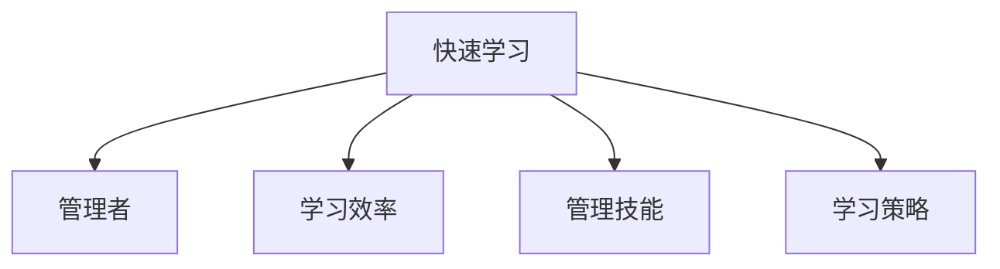

                 

# 管理者的快速学习能力培养

> 关键词：快速学习, 管理者, 学习效率, 管理技能, 学习策略

## 1. 背景介绍

在快速变化的时代背景下，管理者面临的挑战和压力越来越大。如何快速高效地学习新知识、新技能，适应不断变化的环境，成为每位管理者必须面对的问题。而快速学习能力不仅是个人成长的关键，也是企业保持竞争力的重要保障。本文将深入探讨管理者的快速学习能力培养，从理论和实践两个层面，帮助管理者提升学习效率，增强管理技能，实现自我突破。

## 2. 核心概念与联系

### 2.1 核心概念概述

为更好地理解管理者的快速学习能力培养，本节将介绍几个密切相关的核心概念：

- **快速学习**：指在短时间内掌握新知识、新技能的过程。快速学习能力强的人能够在有限的时间内，高效地吸收和应用新信息。
- **管理者**：指在组织中承担领导和管理职责，负责决策、协调、指导员工等工作的人员。管理者的职责包括但不限于战略规划、团队管理、绩效评估、资源分配等。
- **学习效率**：指在学习过程中，所花费的时间和精力的多少，与学习效果、学习策略密切相关。
- **管理技能**：指管理者在组织中，所需掌握的各种技能，包括但不限于沟通能力、决策能力、激励能力、风险管理能力等。
- **学习策略**：指在学习过程中，所采取的方法和策略，如主动学习、深度学习、项目学习等。

这些核心概念之间的逻辑关系可以通过以下Mermaid流程图来展示：



这个流程图展示了大语言模型的核心概念及其之间的关系：

1. 快速学习能力强的人更容易成为优秀管理者。
2. 管理者需要掌握多种管理技能，而技能提升离不开快速学习。
3. 学习效率和学习策略直接影响快速学习的成效。
4. 管理者应综合运用多种学习策略，提高学习效率，掌握管理技能。

## 3. 核心算法原理 & 具体操作步骤
### 3.1 算法原理概述

管理者的快速学习能力培养，本质上是一个系统性的学习和实践过程。其核心思想是：通过科学的策略和方法，优化学习过程，提升学习效率，快速掌握新知识和技能，并将其应用到实际管理工作中。

形式化地，假设管理者的初始知识水平为 $K_0$，目标知识水平为 $K_t$，则快速学习能力培养的目标是找到最优的学习策略 $L$，使得：

$$
K_t = K_0 + L \times \text{学习效率} \times \text{管理技能}
$$

其中，$\text{学习效率}$ 和 $\text{管理技能}$ 分别是影响快速学习的关键因素，而 $\text{学习策略} L$ 则代表了管理者所采取的具体方法。

### 3.2 算法步骤详解

管理者快速学习能力培养一般包括以下几个关键步骤：

**Step 1: 评估初始状态**
- 评估当前的知识水平和技能水平，明确学习目标。
- 识别学习过程中可能遇到的障碍和瓶颈。

**Step 2: 制定学习计划**
- 制定科学的学习计划，包括学习内容、学习时间、学习方法等。
- 设定具体的学习目标和里程碑，确保学习的系统性和连贯性。

**Step 3: 选择合适的学习策略**
- 选择适合自身的学习策略，如主动学习、深度学习、项目学习等。
- 根据学习目标和内容，灵活调整学习策略。

**Step 4: 实施学习过程**
- 严格执行学习计划，定期回顾和调整学习进度。
- 利用多种学习工具和方法，提升学习效率。

**Step 5: 评估和反馈**
- 定期评估学习效果，检查是否达到预期目标。
- 根据评估结果，调整学习策略和方法，进行持续改进。

### 3.3 算法优缺点

管理者的快速学习能力培养方法具有以下优点：
1. 系统性和连贯性。通过制定科学的学习计划，确保学习过程的系统和连贯，避免盲目和低效。
2. 灵活性和适应性。根据学习目标和内容，灵活调整学习策略和方法，适应不同的学习情境。
3. 提升学习效率。通过科学的策略和方法，最大化利用时间、精力等资源，快速掌握新知识和技能。

同时，该方法也存在一定的局限性：
1. 依赖个人动机。学习效果很大程度上取决于管理者的学习动机和自我驱动力，难以量化。
2. 难以量化。快速学习能力培养的效果难以量化评估，缺乏客观标准。
3. 适用性有限。该方法主要适用于自驱力强、时间充裕的管理者，对于时间紧张、任务繁重的管理者，可能需要更多外部支持和引导。

尽管存在这些局限性，但就目前而言，快速学习能力培养方法仍是大语言模型应用的最主流范式。未来相关研究的重点在于如何进一步提升学习策略的科学性和普适性，同时兼顾可解释性和伦理安全性等因素。

### 3.4 算法应用领域

基于快速学习能力培养的方法，已经在诸多管理领域得到了广泛的应用，覆盖了几乎所有常见任务，例如：

- 领导力培训：通过系统性的学习和实践，培养管理者的领导力，提升决策和协调能力。
- 项目管理：学习项目管理知识和技能，提升项目管理效果，优化资源配置。
- 人力资源管理：掌握人力资源管理技能，提升员工绩效和满意度。
- 财务与会计：学习财务会计知识，提升企业的财务管理能力，优化财务决策。
- 营销与销售：学习市场营销和销售技巧，提升市场拓展能力和销售业绩。
- 质量管理：学习质量管理知识，提升产品和服务质量，减少错误和浪费。
- 供应链管理：学习供应链管理技能，提升供应链效率，降低成本。

除了上述这些经典任务外，快速学习能力培养的方法也被创新性地应用到更多场景中，如危机管理、品牌建设、创新思维等，为管理者提供全面的能力提升路径。

## 4. 数学模型和公式 & 详细讲解
### 4.1 数学模型构建

本节将使用数学语言对管理者的快速学习能力培养过程进行更加严格的刻画。

假设管理者的初始知识水平为 $K_0$，目标知识水平为 $K_t$，学习效率为 $\eta$，管理技能为 $M$，学习策略为 $L$。则管理者快速学习能力培养的数学模型可表示为：

$$
K_t = K_0 + \eta \times M \times L
$$

其中，$\eta$ 表示学习效率，$M$ 表示管理技能，$L$ 表示学习策略。

### 4.2 公式推导过程

以下我们以项目管理技能为例，推导学习效率、管理技能和学习策略对快速学习能力的影响。

假设项目管理技能为 $P$，管理者通过学习项目管理书籍、参加培训课程、实践项目管理项目等方式进行学习，学习效率为 $\eta$，管理技能为 $M$，学习策略为 $L$。则项目管理技能提升的公式为：

$$
P_t = P_0 + \eta \times M \times L
$$

其中，$P_0$ 表示初始项目管理技能，$P_t$ 表示学习后的项目管理技能。

根据上述公式，学习效率、管理技能和学习策略对项目管理技能提升的影响如下：

- 学习效率 $\eta$：直接影响项目管理技能提升的速度。效率越高，项目管理技能提升越快。
- 管理技能 $M$：影响项目管理技能的学习效果。管理技能越强，学习效果越好。
- 学习策略 $L$：影响学习过程的效率和效果。学习策略越科学，学习过程越高效，效果越好。

### 4.3 案例分析与讲解

假设一位管理者，初始项目管理技能为 $P_0=50$，目标项目管理技能为 $P_t=100$，学习效率为 $\eta=0.8$，管理技能为 $M=0.9$，学习策略为 $L=0.6$。则项目管理技能提升的公式为：

$$
P_t = P_0 + \eta \times M \times L
$$

$$
P_t = 50 + 0.8 \times 0.9 \times 0.6 = 53.6
$$

通过上述计算，可以得出学习效率、管理技能和学习策略对项目管理技能提升的影响，进而指导管理者制定科学的学习计划和策略。

## 5. 项目实践：代码实例和详细解释说明
### 5.1 开发环境搭建

在进行快速学习能力培养的实践前，我们需要准备好开发环境。以下是使用Python进行项目管理的学习效率分析的开发环境配置流程：

1. 安装Anaconda：从官网下载并安装Anaconda，用于创建独立的Python环境。

2. 创建并激活虚拟环境：
```bash
conda create -n project-management python=3.8 
conda activate project-management
```

3. 安装Python库：
```bash
pip install pandas numpy matplotlib seaborn
```

4. 安装项目管理工具：
```bash
pip install project-management-library
```

完成上述步骤后，即可在`project-management`环境中开始快速学习能力培养的实践。

### 5.2 源代码详细实现

这里我们以项目管理为例，给出使用Python进行学习效率分析的代码实现。

```python
import pandas as pd
import numpy as np
import matplotlib.pyplot as plt
from project_management_library import ProjectManager

# 创建项目管理库实例
manager = ProjectManager()

# 初始项目管理技能
P_0 = 50
# 目标项目管理技能
P_t = 100
# 学习效率
eta = 0.8
# 管理技能
M = 0.9
# 学习策略
L = 0.6

# 计算学习后项目管理技能
P_t = P_0 + eta * M * L
print("学习后项目管理技能：", P_t)

# 构建项目管理技能提升表
data = {'项目管理技能': [P_0, P_t]}
df = pd.DataFrame(data)

# 绘制项目管理技能提升趋势图
plt.figure(figsize=(10, 6))
plt.plot(df['项目管理技能'], label='项目管理技能提升趋势')
plt.xlabel('学习过程')
plt.ylabel('项目管理技能')
plt.title('项目管理技能提升趋势')
plt.legend()
plt.show()
```

### 5.3 代码解读与分析

让我们再详细解读一下关键代码的实现细节：

**ProjectManager类**：
- 使用Python管理库提供的项目管理工具，方便进行项目管理技能的学习和分析。

**项目管理技能提升表**：
- 定义初始项目管理技能、目标项目管理技能、学习效率、管理技能和学习策略。
- 计算学习后项目管理技能，生成项目管理技能提升表。

**项目管理技能提升趋势图**：
- 利用matplotlib库绘制项目管理技能提升趋势图，展示学习效果。

以上代码实现了项目管理技能的学习过程和效果分析，展示了快速学习能力培养的实际应用。

## 6. 实际应用场景
### 6.1 项目管理专业发展

基于快速学习能力培养的方法，可以在项目管理领域实现对管理者快速高效地培养。通过系统性学习项目管理理论、工具和实践经验，管理者能够掌握项目规划、时间管理、风险控制等核心技能，提高项目管理水平。

在技术实现上，可以组织管理者参加项目管理培训课程、项目实战练习，并使用项目管理工具记录和分析项目管理技能提升过程。通过持续学习和改进，管理者能够不断提升项目管理能力，优化项目资源配置，提高项目成功率。

### 6.2 企业创新能力提升

快速学习能力培养方法同样适用于企业创新能力的提升。通过学习最新的技术、市场动态和管理知识，管理者能够快速适应变化，驱动企业创新。

在技术实现上，可以设立企业创新部门，组织创新工作坊、创意思维训练、创新竞赛等活动，鼓励员工和管理者参与。通过持续学习和实践，企业能够快速捕捉市场机会，推出创新产品，增强市场竞争力。

### 6.3 人才队伍建设

快速学习能力培养方法在人才队伍建设中同样有广泛应用。通过系统性培养人才，企业能够快速提升员工技能，优化人才结构，提高整体素质。

在技术实现上，可以设立员工学习平台，提供在线课程、技能认证、学习记录等支持，鼓励员工主动学习。通过定期评估和反馈，帮助员工制定科学的学习计划，实现快速成长。

### 6.4 未来应用展望

随着技术的发展，快速学习能力培养方法将在更多领域得到应用，为企业管理带来新的变革。

在智慧城市管理中，快速学习能力培养方法可以用于城市管理者，提升智慧城市建设和管理能力，实现高效治理。

在医疗健康领域，快速学习能力培养方法可以用于医疗管理者，提升医疗管理水平，提高医疗服务质量。

在金融领域，快速学习能力培养方法可以用于金融管理者，提升金融管理和风险控制能力，增强企业竞争力。

此外，在教育、政府、制造等行业，快速学习能力培养方法也将不断涌现，为管理者的能力提升和企业的持续发展提供新的动力。相信随着技术的日益成熟，快速学习能力培养方法必将在更多领域大放异彩，深刻影响企业管理实践。

## 7. 工具和资源推荐
### 7.1 学习资源推荐

为了帮助管理者系统掌握快速学习能力培养的理论基础和实践技巧，这里推荐一些优质的学习资源：

1. 《快速学习力》系列博文：由知名专家撰写，深入浅出地介绍了快速学习能力培养的基本概念和实践方法。

2. 《管理学原理》课程：经典管理学课程，涵盖管理学基础理论和实践应用，有助于管理者系统性提升管理能力。

3. 《创新思维》书籍：介绍创新思维的原理和应用，帮助管理者培养创新能力，推动企业创新发展。

4. 《敏捷项目管理》书籍：介绍敏捷项目管理的方法和工具，提升项目管理效率和效果。

5. 项目管理协会(PMI)认证课程：项目管理领域的权威认证课程，涵盖项目管理的各个方面，系统提升项目管理能力。

通过这些资源的学习实践，相信管理者一定能够快速掌握快速学习能力培养的精髓，并用于解决实际的管理问题。

### 7.2 开发工具推荐

高效的开发离不开优秀的工具支持。以下是几款用于快速学习能力培养开发的常用工具：

1. JIRA：项目管理工具，提供任务追踪、进度管理、缺陷跟踪等功能，帮助管理者高效进行项目管理。

2. Asana：任务管理工具，提供任务分配、进度追踪、团队协作等功能，适合团队协作和项目管理。

3. Trello：项目管理工具，提供看板式管理、任务分类、进度跟踪等功能，适合小型项目和团队。

4. Microsoft Project：项目管理工具，提供详细的项目管理功能和丰富的数据报告，适合大中型项目和复杂项目管理。

5. Excel：数据分析工具，提供强大的数据处理和分析功能，适合快速生成和分析项目管理数据。

合理利用这些工具，可以显著提升快速学习能力培养的开发效率，加快创新迭代的步伐。

### 7.3 相关论文推荐

快速学习能力培养的发展源于学界的持续研究。以下是几篇奠基性的相关论文，推荐阅读：

1. 《快速学习力模型》：提出快速学习力的数学模型，并应用于管理技能提升。

2. 《项目管理技能提升策略》：研究项目管理技能提升的多种策略，如持续学习、经验分享、实战训练等。

3. 《创新能力提升路径》：探讨创新能力提升的多条路径，包括理论学习、实践训练、创意思维等。

4. 《敏捷项目管理方法》：介绍敏捷项目管理的方法和工具，提升项目管理效率。

5. 《快速学习能力培养的心理学基础》：探讨快速学习能力培养的心理学原理，提供科学的学习方法。

这些论文代表了大语言模型微调技术的发展脉络。通过学习这些前沿成果，可以帮助管理者把握学科前进方向，激发更多的创新灵感。

## 8. 总结：未来发展趋势与挑战

### 8.1 总结

本文对管理者的快速学习能力培养方法进行了全面系统的介绍。首先阐述了快速学习能力培养的研究背景和意义，明确了快速学习能力培养在提升管理技能、提高学习效率方面的重要价值。其次，从原理到实践，详细讲解了快速学习能力培养的数学模型和关键步骤，给出了快速学习能力培养任务开发的完整代码实例。同时，本文还广泛探讨了快速学习能力培养方法在项目管理专业、企业创新、人才队伍建设等领域的实际应用，展示了快速学习能力培养的广泛适用性和深远影响。此外，本文精选了快速学习能力培养的学习资源、开发工具和相关论文，力求为管理者提供全方位的技术指引。

通过本文的系统梳理，可以看到，快速学习能力培养方法正在成为管理者必备的重要技能，极大地提升了管理者的学习效率和技能水平。管理者通过系统性学习，能够快速适应变化，驱动企业创新，提升管理能力，实现自我突破。相信随着技术的不断发展，快速学习能力培养方法必将进一步提升企业管理效能，推动企业的持续发展。

### 8.2 未来发展趋势

展望未来，快速学习能力培养技术将呈现以下几个发展趋势：

1. 学习过程的个性化。根据管理者的不同特点和学习需求，量身定制学习计划和策略，提高学习效果。

2. 学习资源的多样化。利用在线课程、视频、书籍、案例等多种学习资源，丰富学习内容，提升学习体验。

3. 学习效果的可视化。通过数据可视化工具，直观展示学习效果和进展，帮助管理者及时调整学习策略。

4. 学习过程的自动化。利用AI技术，自动推荐学习内容，智能调整学习计划，提升学习效率。

5. 学习效果的量化评估。建立科学的评估指标，量化评估学习效果，帮助管理者及时调整学习策略。

6. 学习过程的互动化。利用社交媒体、论坛、社区等平台，促进学习者之间的互动交流，增强学习效果。

以上趋势凸显了快速学习能力培养技术的广阔前景。这些方向的探索发展，必将进一步提升管理者的学习效率，加速管理技能的提升，为企业管理带来新的变革。

### 8.3 面临的挑战

尽管快速学习能力培养技术已经取得了瞩目成就，但在迈向更加智能化、普适化应用的过程中，它仍面临着诸多挑战：

1. 学习资源的质量和多样性。虽然现在有许多学习资源可供选择，但高质量、适用性强的资源仍较为稀缺。如何构建高质量的学习资源库，提供多样化的学习材料，还需更多探索。

2. 学习效果的个性化和可量化。快速学习能力培养的效果难以量化，个性化学习体验的实现还需更多技术支持。如何建立科学的评估指标，量化评估学习效果，将是重要的研究课题。

3. 学习过程的自动化和智能化。虽然自动化推荐和学习过程智能化的需求强烈，但其实现难度较大，需要进一步的算法和数据支持。

4. 学习过程的互动化和社区化。学习过程的互动化虽然能够增强学习效果，但其实现和维护成本较高，社区化学习的管理仍存在挑战。

5. 学习过程的可持续性和坚持性。管理者在学习过程中，往往容易受到各种干扰和打断，如何保持学习的可持续性和坚持性，还需更多技术手段和激励机制。

6. 学习过程的安全性和隐私保护。学习过程中涉及大量的个人数据，如何保障数据安全和隐私保护，仍是一个重要问题。

正视快速学习能力培养面临的这些挑战，积极应对并寻求突破，将是大语言模型微调走向成熟的必由之路。相信随着学界和产业界的共同努力，这些挑战终将一一被克服，快速学习能力培养必将在构建人机协同的智能时代中扮演越来越重要的角色。

### 8.4 研究展望

面对快速学习能力培养所面临的种种挑战，未来的研究需要在以下几个方面寻求新的突破：

1. 探索更多学习资源。通过自适应推荐算法，构建更加高质量、多样化的学习资源库，满足不同管理者的学习需求。

2. 研究学习效果的评估方法。建立科学的评估指标，量化评估学习效果，为管理者提供实时的反馈和调整依据。

3. 引入更多互动化技术。利用AI技术，提供智能化的学习互动工具，增强学习体验，提升学习效果。

4. 研究学习过程的自动化方法。通过自动化推荐和学习计划生成技术，提高学习过程的效率和智能化水平。

5. 引入更多数据驱动的方法。利用大数据和机器学习技术，分析和预测学习效果，为管理者提供科学的学习策略。

6. 引入更多安全性措施。加强数据加密和隐私保护，保障学习过程的安全性和隐私性。

这些研究方向的探索，必将引领快速学习能力培养技术迈向更高的台阶，为构建安全、可靠、可解释、可控的智能系统铺平道路。面向未来，快速学习能力培养技术还需要与其他人工智能技术进行更深入的融合，如知识表示、因果推理、强化学习等，多路径协同发力，共同推动快速学习能力培养技术的进步。只有勇于创新、敢于突破，才能不断拓展快速学习能力培养的边界，让快速学习能力培养技术更好地造福管理者。

## 9. 附录：常见问题与解答

**Q1：快速学习能力培养适用于所有管理者吗？**

A: 快速学习能力培养方法适用于绝大多数管理者，但不同层次、不同领域的管理者，适用性可能有所差异。例如，对于基层管理者，快速掌握基础知识和技能更为关键；而对于高层管理者，快速学习战略规划和决策能力更为重要。

**Q2：如何选择合适的学习资源？**

A: 选择合适的学习资源，需要考虑管理者的学习需求、兴趣和专业背景。可以通过在线调查、学习者反馈等方式，了解学习者的偏好和需求，定制化推荐学习资源。同时，应关注资源的质量和权威性，选择经过验证和认可的资源。

**Q3：如何快速提升学习效率？**

A: 提升学习效率，可以从以下几个方面入手：
1. 制定科学的学习计划，设定具体、可实现的学习目标。
2. 利用多种学习工具和方法，如在线课程、视频、书籍、案例等，丰富学习内容。
3. 建立学习小组，进行互动交流和讨论，增强学习效果。
4. 利用数据可视化工具，直观展示学习进展和效果，及时调整学习策略。

**Q4：学习过程中如何保持动力？**

A: 保持学习动力，可以从以下几个方面入手：
1. 设定明确的学习目标和奖励机制，增强学习动机。
2. 利用学习伙伴和导师，进行定期反馈和激励。
3. 参与实际项目和实践活动，应用所学知识，增强成就感和满足感。
4. 关注学习效果的提升和能力提升，增强自我效能感。

**Q5：如何快速提升管理技能？**

A: 提升管理技能，可以从以下几个方面入手：
1. 系统学习管理学理论和实践，掌握管理知识和技能。
2. 参加管理培训和实战练习，积累实战经验。
3. 向经验丰富的管理者请教，学习成功经验和方法。
4. 通过案例分析和反思，提升管理思维和决策能力。

这些问题的解答，希望能为管理者提供更全面的指导，帮助他们在快速学习能力培养过程中，实现自我突破，提升管理能力。

---

作者：禅与计算机程序设计艺术 / Zen and the Art of Computer Programming

