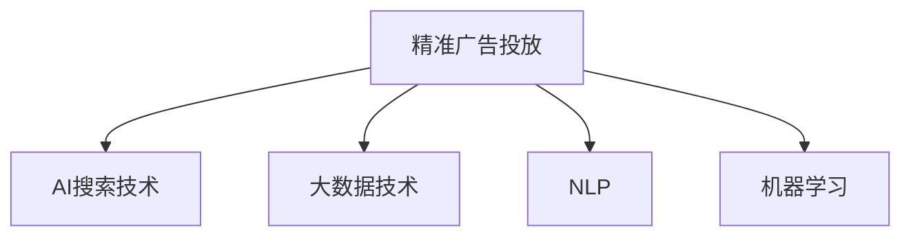

                 

# 精准广告投放：AI搜索的商业价值

> 关键词：人工智能，精准广告，搜索技术，商业应用，数据分析

## 1. 背景介绍

在数字经济时代，精准广告投放成为各大企业数字化转型的重要驱动力。通过精准的广告投放，企业能够以更低的成本获取更高的用户转化率，优化营销预算，提升市场竞争力。然而，传统的广告投放方式依赖于复杂的人工操作和低效的数据分析，难以达到理想的广告效果。随着人工智能和大数据技术的不断进步，AI搜索技术在精准广告投放中的应用越来越广泛，成为提升广告投放精准度的有力工具。

本博客将系统介绍AI搜索技术在精准广告投放中的商业应用，阐述其背后的原理和实现流程，分析其优缺点和应用领域，并展望未来的发展趋势和面临的挑战。

## 2. 核心概念与联系

### 2.1 核心概念概述

为更好地理解AI搜索技术在精准广告投放中的应用，本节将介绍几个关键核心概念：

- **精准广告投放**：指通过高效的广告投放策略，将广告精准推送给潜在用户，以最小的成本获得最大的用户转化率。
- **AI搜索技术**：指利用人工智能和大数据分析技术，从大规模数据中快速高效地搜索出与目标广告相关的用户信息，用于精准广告投放。
- **大数据技术**：指对大规模数据进行存储、处理、分析和可视化的技术，为AI搜索提供数据支持。
- **自然语言处理(NLP)**：指利用计算机处理自然语言的技术，能够从文本数据中提取用户兴趣和需求。
- **机器学习**：指通过算法和模型训练，使计算机具备自主学习的能力，能够从数据中学习用户行为规律。

这些核心概念之间的逻辑关系可以通过以下Mermaid流程图来展示：



这个流程图展示了几者的核心概念及其之间的关系：

1. 精准广告投放的目标是提升用户转化率。
2. AI搜索技术能够高效搜索出与广告相关用户信息，为广告投放提供依据。
3. 大数据技术为AI搜索提供数据支持。
4. NLP技术从文本数据中提取用户兴趣和需求。
5. 机器学习技术通过学习用户行为规律，优化广告投放策略。

## 3. 核心算法原理 & 具体操作步骤

### 3.1 算法原理概述

AI搜索技术在精准广告投放中的核心原理是通过机器学习和大数据分析，从大规模用户数据中搜索出与广告目标最匹配的用户信息，供投放策略使用。具体而言，主要包括以下几个步骤：

1. **数据预处理**：将原始数据进行清洗、归一化等处理，转换为可供机器学习模型使用的格式。
2. **特征工程**：从清洗后的数据中提取与广告投放相关的特征，如用户兴趣、行为、地理位置等。
3. **模型训练**：使用机器学习算法，在特征和标签数据上训练模型，学习用户行为规律。
4. **广告推荐**：利用训练好的模型，对新的广告样本和用户数据进行预测，生成推荐结果。

### 3.2 算法步骤详解

以下是AI搜索技术在精准广告投放中的具体实现步骤：

**Step 1: 数据准备**

- **收集数据**：收集用户行为数据、历史广告点击数据、用户兴趣数据等，构成大规模数据集。
- **数据清洗**：对数据进行去重、缺失值处理、异常值检测等，确保数据质量和完整性。
- **特征工程**：将清洗后的数据转换为模型所需的特征向量，如用户ID、浏览历史、地理位置、设备信息等。

**Step 2: 模型训练**

- **选择模型**：根据具体任务选择合适的机器学习模型，如线性回归、逻辑回归、决策树、随机森林、神经网络等。
- **训练数据划分**：将数据集划分为训练集、验证集和测试集，用于模型训练、调参和性能评估。
- **模型训练**：使用训练集数据训练模型，并根据验证集数据调整超参数，如学习率、正则化系数、迭代轮数等。
- **模型评估**：使用测试集数据评估模型性能，常见的评估指标包括准确率、召回率、F1分数等。

**Step 3: 广告推荐**

- **用户数据输入**：将新的用户数据输入模型，进行特征提取和特征转换。
- **模型预测**：利用训练好的模型，对用户数据进行预测，生成用户是否点击广告的概率。
- **推荐广告**：根据预测结果，选择最有可能点击的广告，进行投放。

### 3.3 算法优缺点

AI搜索技术在精准广告投放中具有以下优点：

1. **高效性**：能够快速从大规模数据中搜索出相关用户信息，优化广告投放策略。
2. **精准性**：利用机器学习算法，能够精准预测用户行为，提升广告转化率。
3. **自适应性**：模型能够实时学习用户行为变化，动态调整广告投放策略。
4. **自动化**：自动化处理数据预处理、特征工程、模型训练和推荐广告等环节，减少人工干预。

然而，该方法也存在一些缺点：

1. **数据依赖性强**：需要收集大量高质量的标注数据，才能训练出有效的模型。
2. **模型复杂度高**：构建高精度的模型需要复杂的特征工程和大量计算资源。
3. **隐私风险**：处理用户数据需要遵守隐私保护法律法规，如GDPR等。
4. **过拟合风险**：模型可能过度适应训练数据，导致泛化性能下降。

### 3.4 算法应用领域

AI搜索技术在精准广告投放中的应用领域广泛，涵盖了多个场景：

- **电商推荐**：通过分析用户浏览记录和购买行为，推荐相关商品广告，提升销售转化率。
- **社交广告**：在社交平台上精准推送广告，利用用户行为数据优化广告投放策略。
- **金融广告**：通过分析用户交易数据和财务信息，推荐金融产品广告，提高投资转化率。
- **健康医疗**：在健康平台上推荐健康产品和健康服务广告，精准满足用户需求。
- **旅游出行**：根据用户出行偏好和历史记录，推荐旅游产品和广告，提升预订转化率。
- **视频广告**：在视频平台上推荐相关视频广告，提高观看和点击率。

## 4. 数学模型和公式 & 详细讲解 & 举例说明

### 4.1 数学模型构建

本节将使用数学语言对AI搜索技术在精准广告投放中的具体实现进行更加严格的刻画。

设广告投放场景中，用户数据为 $X$，广告数据为 $Y$，用户行为数据为 $U$，用户兴趣数据为 $I$，广告点击率为 $C$，则AI搜索技术的核心数学模型可以表示为：

$$
\min_{\theta} \mathcal{L}(\theta) = \frac{1}{N}\sum_{i=1}^N [C_i \log P(Y_i|X_i,U_i,I_i,\theta) + (1-C_i) \log (1-P(Y_i|X_i,U_i,I_i,\theta))]
$$

其中 $\theta$ 为模型的可学习参数，$P(Y_i|X_i,U_i,I_i,\theta)$ 为模型在给定用户数据 $X_i$、用户行为数据 $U_i$、用户兴趣数据 $I_i$ 和参数 $\theta$ 的情况下，广告点击的概率。$\mathcal{L}(\theta)$ 为经验风险损失函数。

### 4.2 公式推导过程

以下是广告点击率的预测模型：

假设模型为线性回归模型，即 $P(Y_i|X_i,U_i,I_i,\theta) = \sigma(\theta_0 + \theta_1 X_i + \theta_2 U_i + \theta_3 I_i)$，其中 $\sigma$ 为逻辑 sigmoid 函数，$\theta_0,\theta_1,\theta_2,\theta_3$ 为线性回归模型的参数。

预测广告点击的概率为：

$$
P(Y_i|X_i,U_i,I_i,\theta) = \sigma(\theta_0 + \theta_1 X_i + \theta_2 U_i + \theta_3 I_i)
$$

在训练过程中，使用交叉熵损失函数进行优化：

$$
\mathcal{L}(\theta) = \frac{1}{N}\sum_{i=1}^N [C_i \log P(Y_i|X_i,U_i,I_i,\theta) + (1-C_i) \log (1-P(Y_i|X_i,U_i,I_i,\theta))]
$$

通过梯度下降等优化算法，最小化经验风险，得到最优参数 $\theta^*$。

### 4.3 案例分析与讲解

以电商推荐为例，说明AI搜索技术在精准广告投放中的应用。

假设某电商平台需要推荐商品广告给用户，可以收集用户的浏览记录、购买记录、搜索关键词等数据，构建用户画像。同时，将历史广告点击数据与用户行为数据进行关联分析，挖掘用户行为特征与广告点击的关系。

使用上述线性回归模型，训练一个预测用户点击广告的概率模型。模型训练完成后，输入新的用户数据，通过预测模型的输出，推荐相关商品广告，供投放策略使用。

例如，对于用户A，浏览过某品牌手机，搜索过"华为"关键词，点击过其他手机广告，那么根据用户A的浏览和搜索行为，模型可以预测其点击该品牌手机广告的概率较高，将其推荐给用户A，从而实现精准广告投放。

## 5. 项目实践：代码实例和详细解释说明

### 5.1 开发环境搭建

在进行AI搜索技术的应用实践前，我们需要准备好开发环境。以下是使用Python进行TensorFlow和Keras开发的环境配置流程：

1. 安装Anaconda：从官网下载并安装Anaconda，用于创建独立的Python环境。

2. 创建并激活虚拟环境：
```bash
conda create -n tf-env python=3.8 
conda activate tf-env
```

3. 安装TensorFlow：根据CUDA版本，从官网获取对应的安装命令。例如：
```bash
conda install tensorflow-gpu -c conda-forge
```

4. 安装Keras：
```bash
pip install keras
```

5. 安装各类工具包：
```bash
pip install numpy pandas scikit-learn matplotlib tqdm jupyter notebook ipython
```

完成上述步骤后，即可在`tf-env`环境中开始AI搜索技术的开发实践。

### 5.2 源代码详细实现

以下是使用TensorFlow和Keras构建广告推荐模型的PyTorch代码实现。

```python
from tensorflow import keras
from tensorflow.keras import layers
from sklearn.model_selection import train_test_split

# 加载数据
X = # 用户行为数据
Y = # 广告点击数据
U = # 用户行为数据
I = # 用户兴趣数据
N = len(X)

# 数据预处理
X = preprocess_data(X) # 预处理数据

# 特征工程
X = feature_engineering(X) # 特征工程

# 分割数据集
X_train, X_test, y_train, y_test = train_test_split(X, Y, test_size=0.2)

# 构建模型
model = keras.Sequential([
    layers.Dense(64, activation='relu', input_shape=(X_train.shape[1],)),
    layers.Dense(1, activation='sigmoid')
])

# 编译模型
model.compile(optimizer='adam', loss='binary_crossentropy', metrics=['accuracy'])

# 训练模型
model.fit(X_train, y_train, epochs=10, batch_size=32, validation_split=0.2)

# 评估模型
model.evaluate(X_test, y_test)

# 使用模型进行推荐
def predict_ad-click(X):
    X = feature_engineering(X) # 特征工程
    y_pred = model.predict(X) # 预测广告点击概率
    return y_pred
```

以上就是使用TensorFlow和Keras构建广告推荐模型的完整代码实现。可以看到，借助Keras的便捷封装，我们可以用相对简洁的代码完成广告推荐模型的构建和训练。

### 5.3 代码解读与分析

让我们再详细解读一下关键代码的实现细节：

**特征工程**：
- `feature_engineering`函数：根据具体业务场景，对原始数据进行特征提取和特征转换，生成模型所需的特征向量。

**模型训练**：
- `model.compile`方法：编译模型，指定优化器、损失函数、评估指标等。
- `model.fit`方法：训练模型，指定训练数据、批次大小、迭代轮数等。

**广告推荐**：
- `predict_ad-click`函数：输入新的用户数据，进行特征工程和模型预测，返回广告点击概率。

**评估模型**：
- `model.evaluate`方法：在测试集上评估模型性能，返回准确率、召回率等指标。

可以看出，TensorFlow和Keras提供了强大的工具支持，能够快速搭建和训练复杂的模型，适用于大规模广告推荐等高维度数据的处理。

## 6. 实际应用场景

### 6.1 电商推荐

在电商平台上，精准广告投放能够显著提升用户转化率和销售转化率。AI搜索技术可以通过分析用户行为数据和广告点击数据，挖掘用户兴趣和需求，精准推荐相关商品广告。

例如，某电商平台在用户浏览某款手机页面时，通过分析用户历史浏览记录和点击广告记录，预测用户对该款手机广告的点击概率，将其推荐给用户，从而提升广告效果和用户转化率。

### 6.2 社交广告

社交平台上的精准广告投放，能够快速获取大量用户流量，提升广告投放效果。AI搜索技术通过分析用户行为数据和社交互动数据，精准推送广告，提升广告点击率。

例如，某社交平台在用户点赞某品牌广告时，通过分析用户的点赞行为和互动数据，预测用户对该品牌广告的兴趣，将其推荐给用户，从而提升广告点击率和用户转化率。

### 6.3 金融广告

金融产品推荐广告能够提升用户投资转化率，AI搜索技术通过分析用户交易数据和财务信息，精准推荐金融产品广告，提升广告效果。

例如，某金融平台在用户进行股票交易时，通过分析用户交易数据和财务信息，预测用户对某金融产品的兴趣，将其推荐给用户，从而提升广告效果和用户投资转化率。

### 6.4 未来应用展望

随着AI搜索技术的不断进步，精准广告投放的应用场景将不断扩展，为各行各业带来更多商业价值。

在智慧城市领域，AI搜索技术可以应用于公共交通系统推荐、能源管理、城市环境监测等，提升智慧城市的管理效率和用户体验。

在智能制造领域，AI搜索技术可以应用于生产过程优化、设备维护、供应链管理等，提升制造业的智能化水平和生产效率。

在农业领域，AI搜索技术可以应用于农作物种植、土壤检测、农业机器人等，提升农业生产效率和可持续性。

未来，随着AI搜索技术的进一步发展，精准广告投放将应用于更多领域，为各行各业带来更多的商业价值。

## 7. 工具和资源推荐

### 7.1 学习资源推荐

为了帮助开发者系统掌握AI搜索技术在精准广告投放中的应用，这里推荐一些优质的学习资源：

1. **《深度学习》系列博文**：由大模型技术专家撰写，深入浅出地介绍了深度学习原理、模型构建、数据处理等基础知识。

2. **CS231n《计算机视觉与深度学习》课程**：斯坦福大学开设的计算机视觉明星课程，涵盖图像处理、特征提取、目标检测等经典算法，是学习计算机视觉的必备资源。

3. **《TensorFlow官方文档》**：TensorFlow官方文档，提供了全面的API介绍、案例演示和最佳实践，是学习TensorFlow的绝佳参考。

4. **Kaggle数据竞赛平台**：全球最大的数据科学竞赛平台，提供了丰富的数据集和问题，是学习数据分析和机器学习的重要资源。

5. **Google Colab在线环境**：谷歌推出的在线Jupyter Notebook环境，免费提供GPU/TPU算力，方便开发者快速上手实验最新模型，分享学习笔记。

通过这些资源的学习实践，相信你一定能够快速掌握AI搜索技术在精准广告投放中的核心应用，并用于解决实际的商业问题。

### 7.2 开发工具推荐

高效的开发离不开优秀的工具支持。以下是几款用于AI搜索技术开发的常用工具：

1. TensorFlow：基于Python的开源深度学习框架，灵活的计算图，适用于复杂模型的构建和训练。

2. Keras：高级神经网络API，封装了TensorFlow、Theano等底层框架，简化模型构建和训练流程。

3. Scikit-learn：Python机器学习库，提供了多种常用的机器学习算法和数据处理工具。

4. Pandas：Python数据处理库，支持大规模数据的读写、清洗、转换和分析。

5. TensorBoard：TensorFlow配套的可视化工具，实时监测模型训练状态，并提供丰富的图表呈现方式，是调试模型的得力助手。

6. Weights & Biases：模型训练的实验跟踪工具，可以记录和可视化模型训练过程中的各项指标，方便对比和调优。

合理利用这些工具，可以显著提升AI搜索技术的开发效率，加快创新迭代的步伐。

### 7.3 相关论文推荐

AI搜索技术的发展源于学界的持续研究。以下是几篇奠基性的相关论文，推荐阅读：

1. **《基于深度学习的广告推荐系统》**：介绍了深度学习在广告推荐系统中的应用，包括模型构建、特征工程、评估指标等。

2. **《基于用户行为数据的精准广告投放》**：介绍了如何通过用户行为数据构建精准广告投放模型，提升广告投放效果。

3. **《机器学习在金融领域的应用》**：介绍了机器学习在金融广告投放中的应用，包括用户画像构建、广告推荐等。

4. **《社交媒体平台上的精准广告投放》**：介绍了社交媒体平台上的精准广告投放技术，包括用户兴趣挖掘、广告投放策略等。

5. **《智能推荐系统中的深度学习技术》**：介绍了深度学习在智能推荐系统中的应用，包括模型构建、推荐策略等。

这些论文代表了大模型微调技术的发展脉络。通过学习这些前沿成果，可以帮助研究者把握学科前进方向，激发更多的创新灵感。

## 8. 总结：未来发展趋势与挑战

### 8.1 总结

本文对AI搜索技术在精准广告投放中的应用进行了全面系统的介绍。首先阐述了精准广告投放的目标和AI搜索技术的核心原理，明确了广告推荐模型的构建流程。其次，从原理到实践，详细讲解了AI搜索技术在电商推荐、社交广告、金融广告等场景中的应用，并给出了完整的代码实例。同时，本文还探讨了AI搜索技术的优缺点和应用领域，展示了其在广告投放中的广泛应用前景。

通过本文的系统梳理，可以看到，AI搜索技术在精准广告投放中发挥了重要作用，极大地提升了广告投放的精准度和效果。未来，随着AI搜索技术的不断进步，精准广告投放的应用场景将进一步拓展，为各行各业带来更多的商业价值。

### 8.2 未来发展趋势

展望未来，AI搜索技术在精准广告投放中将呈现以下几个发展趋势：

1. **多模态数据融合**：结合图像、视频、语音等多种模态数据，构建多模态广告推荐模型，提升广告推荐的精准度和用户体验。

2. **个性化推荐**：通过深入分析用户行为数据，构建个性化推荐模型，实现用户画像的动态更新和精准广告推荐。

3. **实时推荐**：利用流式数据处理技术，实时分析用户行为数据，动态调整广告推荐策略，提升广告投放的实时性和精准度。

4. **自动化推荐系统**：引入自动化推荐算法，减少人工干预，提高广告推荐的效率和效果。

5. **联邦学习**：利用联邦学习技术，在保护用户隐私的前提下，实现跨平台广告推荐，提升广告推荐的覆盖面和效果。

6. **边缘计算**：利用边缘计算技术，在用户设备端进行广告推荐，提升广告投放的速度和效率。

以上趋势凸显了AI搜索技术在精准广告投放中的广阔前景。这些方向的探索发展，必将进一步提升广告推荐的精准度和效果，为各行各业带来更多的商业价值。

### 8.3 面临的挑战

尽管AI搜索技术在精准广告投放中已经取得了显著成果，但在迈向更加智能化、普适化应用的过程中，它仍面临诸多挑战：

1. **数据质量和隐私保护**：广告推荐模型依赖于高质量、大规模的数据，但数据收集和处理过程中可能存在隐私泄露的风险，需要严格遵守相关法律法规。

2. **模型复杂度和高成本**：构建高精度的广告推荐模型需要复杂的特征工程和大量的计算资源，模型训练和推理成本较高。

3. **广告效果评估**：广告投放效果评估难度大，受多种因素影响，如何客观公正地评估广告推荐模型性能，仍是一个难题。

4. **模型泛化性**：广告推荐模型可能过度适应训练数据，导致泛化性能下降，如何在不同场景下保持模型的泛化能力，仍需进一步研究。

5. **广告投放策略**：广告投放策略需要根据业务场景和用户需求进行精细化设计，如何设计最优的投放策略，提升广告效果，仍需深入研究。

6. **用户反馈和优化**：广告推荐模型的优化需要用户反馈，如何高效收集用户反馈信息，实时优化广告投放策略，仍需进一步探索。

正视这些挑战，积极应对并寻求突破，将是大规模广告推荐技术迈向成熟的必由之路。相信随着学界和产业界的共同努力，这些挑战终将一一被克服，AI搜索技术必将在构建精准广告投放中发挥更大作用。

### 8.4 研究展望

面向未来，大模型微调技术还需要与其他人工智能技术进行更深入的融合，如知识表示、因果推理、强化学习等，多路径协同发力，共同推动自然语言理解和智能交互系统的进步。只有勇于创新、敢于突破，才能不断拓展语言模型的边界，让智能技术更好地造福人类社会。

## 9. 附录：常见问题与解答

**Q1：AI搜索技术在精准广告投放中的关键步骤是什么？**

A: AI搜索技术在精准广告投放中的关键步骤主要包括数据预处理、特征工程、模型训练和广告推荐。数据预处理包括数据清洗和归一化，特征工程包括特征提取和特征转换，模型训练包括选择合适的模型和训练数据，广告推荐包括模型预测和推荐广告。

**Q2：AI搜索技术在广告推荐中常用的机器学习算法有哪些？**

A: AI搜索技术在广告推荐中常用的机器学习算法包括线性回归、逻辑回归、决策树、随机森林、神经网络等。线性回归和逻辑回归适用于简单的广告推荐场景，决策树和随机森林适用于复杂的广告推荐场景，神经网络适用于更复杂的广告推荐场景，如多模态广告推荐和个性化广告推荐。

**Q3：如何在广告推荐中提高模型的泛化能力？**

A: 在广告推荐中提高模型的泛化能力，可以从以下几个方面进行改进：
1. 数据多样化：收集更多不同类型的广告数据和用户数据，增加模型的泛化能力。
2. 特征工程：引入更多高质量的特征，提升模型的表征能力。
3. 模型正则化：使用L2正则化、Dropout等技术，防止模型过拟合。
4. 多模型集成：训练多个广告推荐模型，取平均输出，提高模型的稳定性和泛化能力。
5. 模型微调：在广告推荐过程中，实时微调模型参数，提高模型的适应能力。

**Q4：如何在广告推荐中实现个性化推荐？**

A: 在广告推荐中实现个性化推荐，可以从以下几个方面进行改进：
1. 用户画像构建：收集用户的浏览记录、购买记录、搜索关键词等数据，构建用户画像。
2. 特征工程：根据用户画像，提取与广告推荐相关的特征。
3. 模型训练：使用机器学习算法，在特征和标签数据上训练模型，学习用户行为规律。
4. 广告推荐：利用训练好的模型，对新的用户数据进行预测，推荐相关广告。

**Q5：如何评估广告推荐的性能？**

A: 广告推荐的性能评估可以从以下几个指标进行：
1. 点击率（Click-Through Rate, CTR）：广告被点击的比例。
2. 转化率（Conversion Rate, CR）：用户点击广告后完成目标行为的比例，如购买、注册等。
3. 点击量（Impression）：广告被展示的次数。
4. 转化成本（Cost per Conversion, CPC）：广告点击一次的成本。
5. 每次点击收益（Cost per Click, CPA）：用户完成目标行为后，广告点击一次的费用。
6. 投资回报率（Return on Investment, ROI）：广告投放带来的收益与成本之比。

在实际应用中，需要根据具体业务场景选择适合的评估指标，综合评估广告推荐的性能。

通过本文的系统梳理，可以看到，AI搜索技术在精准广告投放中发挥了重要作用，极大地提升了广告投放的精准度和效果。未来，随着AI搜索技术的不断进步，精准广告投放的应用场景将进一步拓展，为各行各业带来更多的商业价值。

