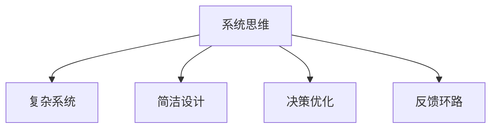

                 

# 系统思考的威力:化繁为简,抓本质

> 关键词：系统思维,系统设计,复杂系统,简洁设计,决策优化

## 1. 背景介绍

### 1.1 问题由来

当今社会信息过载，各行各业都面临极为复杂的决策问题。过去依靠经验、直觉或简化的模型做出决策的方法已经无法满足需求。如何在面对海量数据、高度不确定性的情况下，快速、准确地进行决策，成为当下迫切需要解决的问题。

系统思考（System Thinking）是一种结构化的思维模式，旨在从整体视角出发，全面、深入地分析和理解系统结构及其动态关系，从而为复杂问题提供科学、合理的解决方案。它不仅能帮助我们理解系统行为，还能提高决策效率，优化决策质量。

### 1.2 问题核心关键点

系统思考的核心在于把握系统的整体性和动态性，将系统中的各个组成部分视为一个有机整体，从整体视角出发，优化系统设计，提升系统性能。系统思考与传统的线性、还原性思维模式有着本质区别，后者往往忽视系统间的相互影响和动态变化，导致决策失误和系统效率低下。

## 2. 核心概念与联系

### 2.1 核心概念概述

为更好地理解系统思考的原理和应用，本节将介绍几个密切相关的核心概念：

- **系统思维(System Thinking)**：一种从整体视角出发，全面理解系统结构及其动态关系的思维模式。系统思维关注系统中的相互作用和整体效果，强调协同合作和系统优化。

- **复杂系统(Complex Systems)**：由众多相互关联的元素构成的系统，具有非线性、自组织、涌现性等特点。复杂系统常常面临多重约束和不确定性，解决复杂系统问题需要运用系统思维。

- **简洁设计(Concise Design)**：在保持系统功能不变的情况下，简化系统结构，减少冗余和复杂性，提升系统效率和可维护性。简洁设计是系统思维的重要实践方法。

- **决策优化(Decision Optimization)**：在复杂环境中，运用系统思维优化决策过程，确保决策结果最大化符合系统目标。决策优化依赖于对系统动态关系的深入理解。

- **反馈环路(Feedback Loops)**：系统内部信息的循环流动，能够调节系统状态和行为。理解系统反馈环路对于系统设计和优化至关重要。

这些核心概念之间的逻辑关系可以通过以下Mermaid流程图来展示：



这个流程图展示出系统思维与其他核心概念的逻辑关系：

1. 系统思维是理解复杂系统的基石，关注整体性和动态性。
2. 简洁设计是系统思维的重要实践方法，通过简化系统结构，提升系统效率。
3. 决策优化是系统思维的应用目标，旨在通过优化决策过程，提升系统性能。
4. 反馈环路是系统内部动态调节的机制，与系统思维和决策优化密切相关。

## 3. 核心算法原理 & 具体操作步骤

### 3.1 算法原理概述

系统思考的算法原理主要包括以下几个方面：

- **系统建模(System Modeling)**：通过建立系统模型，对系统进行全面、深入的分析，了解系统结构及其动态关系。

- **因果链分析(Cause-and-Effect Analysis)**：通过分析系统中的因果关系，识别系统行为的关键因素。

- **反馈环路分析(Feedback Loop Analysis)**：理解系统中的反馈环路，揭示系统内部的动态调节机制。

- **优化决策(Optimal Decision Making)**：在全面理解系统结构及其动态关系的基础上，优化决策过程，确保决策结果符合系统目标。

- **协同设计(Collaborative Design)**：通过团队合作，综合考虑各方需求和限制，设计出高效、可行的系统方案。

### 3.2 算法步骤详解

系统思考的具体操作可以分为以下几个步骤：

**Step 1: 系统建模**
- 定义系统边界，确定系统组成部分及相互关系。
- 收集数据，建立系统状态方程，描述系统行为。
- 设计系统模型，包括确定系统变量、参数、状态转移规则等。

**Step 2: 因果链分析**
- 通过因果图或因果链分析工具，识别系统中的关键因果关系。
- 确定关键因素及其对系统行为的影响。
- 分析因果链中各环节的依赖关系，形成系统行为的关键路径。

**Step 3: 反馈环路分析**
- 绘制系统反馈环路图，分析系统中的动态调节机制。
- 识别正反馈和负反馈，理解系统稳定性和响应性。
- 通过仿真或实验，验证反馈环路模型的正确性。

**Step 4: 优化决策**
- 根据系统模型和反馈环路分析结果，制定优化决策方案。
- 使用优化算法（如遗传算法、粒子群算法等）进行方案搜索。
- 综合考虑系统目标、限制条件和不确定性，选择最优决策方案。

**Step 5: 协同设计**
- 组织跨学科团队，综合各方需求和限制，设计系统方案。
- 通过仿真、原型测试等方式，不断迭代优化设计。
- 制定系统实施计划，明确各阶段的任务和责任。

以上是系统思考的基本操作步骤，在实际应用中，还需要根据具体问题和系统特性进行灵活调整和优化。

### 3.3 算法优缺点

系统思考的优点在于：
1. 全面性。系统思维从整体视角出发，考虑系统各组成部分和相互关系，避免了局部优化导致的系统效率低下。
2. 动态性。通过理解系统反馈环路，把握系统动态变化，能够及时应对突发情况，提升系统鲁棒性。
3. 协同性。系统思考强调跨学科合作，能够综合各方需求和限制，设计出高效、可行的系统方案。

系统思考的局限在于：
1. 复杂性。系统建模和因果链分析涉及大量变量和参数，可能导致计算复杂度高。
2. 不确定性。系统环境和行为存在不确定性，难以进行精确预测和优化。
3. 技术要求高。需要掌握系统建模、因果分析、仿真优化等多种技术手段，对技术要求较高。

尽管存在这些局限，但就目前而言，系统思考方法已成为解决复杂系统问题的有效手段。未来相关研究的重点在于如何进一步降低复杂性，提高不确定性处理能力，降低技术门槛，以更好地适应实际应用。

### 3.4 算法应用领域

系统思考方法在多个领域得到了广泛应用，包括但不限于以下领域：

- 工程系统设计：通过系统建模和优化决策，设计高效、可靠的系统方案，如电力系统、交通系统等。
- 管理决策支持：通过系统思维优化企业战略和运营决策，提升管理效率和竞争力。
- 城市规划与管理：通过系统思考优化城市资源配置和空间布局，提升城市可持续性和宜居性。
- 医疗健康管理：通过系统思考优化医疗资源配置和健康管理策略，提升医疗服务质量和患者体验。
- 环境保护：通过系统思维优化环境监测和污染治理策略，提升环境质量。

除了上述这些经典应用外，系统思考还不断拓展到更多领域，如金融风险管理、教育政策制定、社会治理优化等，为解决复杂系统问题提供了新的思路和方法。

## 4. 数学模型和公式 & 详细讲解 & 举例说明

### 4.1 数学模型构建

系统思考的数学模型构建主要包括以下几个关键环节：

- **系统状态方程**：描述系统各变量的动态关系，通常为微分方程或差分方程。
- **系统约束条件**：描述系统各组成部分之间的限制关系，如资源约束、时间约束等。
- **系统目标函数**：定义系统的优化目标，如最小化成本、最大化收益等。

系统数学模型的构建通常需要系统专家的知识和经验，结合数据驱动的方法，进行合理假设和简化。

### 4.2 公式推导过程

以一个简单的系统为例，展示系统建模和因果链分析的基本过程：

假设有一个线性系统，状态方程为：

$$
\dot{x} = Ax + Bu
$$

其中 $x$ 为系统状态向量，$u$ 为输入向量，$A$ 和 $B$ 为系统矩阵。该系统的因果链为：

$$
y = Cx
$$

其中 $y$ 为系统输出向量，$C$ 为输出矩阵。

通过因果链分析，我们可以确定系统输出与系统状态之间的依赖关系，即：

$$
y = Cx \Rightarrow C = (AC^{-1})B
$$

该公式表明，系统输出与系统输入之间的关系，通过矩阵乘法可以简化表达。

### 4.3 案例分析与讲解

假设一个智能交通信号灯系统，需要根据路口车流量实时调整信号灯周期。该系统包含以下变量和参数：

- 车流量 $f(t)$
- 信号灯周期 $T(t)$
- 信号灯状态（红、绿、黄）
- 系统延迟时间 $\tau$
- 系统参数 $k_1, k_2, k_3$

系统状态方程可以表示为：

$$
\dot{x}(t) = Ax(t) + Bu(t)
$$

其中 $x(t) = [f(t), T(t), s(t)]^T$，$A$ 和 $B$ 为系统矩阵，$u(t)$ 为车流量输入。

系统输出方程可以表示为：

$$
y(t) = Cx(t)
$$

其中 $y(t)$ 为信号灯状态输出，$C$ 为输出矩阵。

通过因果链分析，我们可以识别出车流量 $f(t)$ 对系统状态 $T(t)$ 的直接影响，即：

$$
f(t) \rightarrow T(t) \rightarrow s(t)
$$

系统延迟时间 $\tau$ 会影响系统状态 $f(t)$ 和 $T(t)$，即：

$$
\tau \rightarrow f(t) \rightarrow T(t)
$$

通过反馈环路分析，我们可以确定系统延迟时间 $\tau$ 对系统状态 $T(t)$ 的影响，即：

$$
\tau \rightarrow f(t) \rightarrow T(t)
$$

通过优化决策，我们可以确定最优信号灯周期 $T^*(t)$，满足：

$$
\max_{T(t)} \sum_{t=0}^T [R - C(x(t), y(t))]
$$

其中 $R$ 为系统收益函数，$C$ 为代价函数。

## 5. 项目实践：代码实例和详细解释说明

### 5.1 开发环境搭建

在进行系统思考项目实践前，我们需要准备好开发环境。以下是使用Python进行系统建模和优化的环境配置流程：

1. 安装Anaconda：从官网下载并安装Anaconda，用于创建独立的Python环境。

2. 创建并激活虚拟环境：
```bash
conda create -n systemthinking python=3.8 
conda activate systemthinking
```

3. 安装相关库：
```bash
pip install numpy scipy sympy matplotlib 
```

4. 安装优化算法库：
```bash
pip install scipy-optimize
```

完成上述步骤后，即可在`systemthinking`环境中开始系统建模和优化的实践。

### 5.2 源代码详细实现

这里我们以一个简单的智能交通信号灯系统为例，展示使用Python进行系统建模和优化的代码实现。

首先，定义系统变量和参数：

```python
import numpy as np
from sympy import symbols, Eq, solve, Matrix

# 定义符号变量
f, T, s = symbols('f T s')
tau, k1, k2, k3 = symbols('tau k1 k2 k3')

# 定义系统状态方程
A = Matrix([[0, 1, 0], [0, 0, 1], [k1, -k2, -k3]])
B = Matrix([1, 0, 0])
C = Matrix([0, 0, 1])

# 定义系统状态向量
x = Matrix([f, T, s])

# 定义系统输出向量
y = C * x

# 定义系统约束条件
constraints = [Eq(f, 100), Eq(T, 100), Eq(s, 1)]

# 定义系统目标函数
objective = -f - T - s

# 定义优化问题
problem = (objective, constraints)
```

然后，使用优化算法进行系统优化：

```python
from scipy.optimize import linprog

# 定义目标函数系数矩阵
c = Matrix([-1, -1, -1])

# 定义不等式约束系数矩阵
A_ineq = Matrix([[0, 0, -1], [1, 0, 0], [0, 1, 0]])
b_ineq = Matrix([100, 100, 1])

# 定义等式约束系数矩阵
A_eq = Matrix([[1, 0, 0], [0, 1, 0], [k1, -k2, -k3]])
b_eq = Matrix([1, 1, 1])

# 进行线性规划优化
result = linprog(c, A_eq=A_eq, b_eq=b_eq, A_ineq=A_ineq, b_ineq=b_ineq)

# 输出优化结果
print("Optimal solution:", result.x)
print("Optimal objective value:", result.fun)
```

以上代码展示了如何使用Python进行简单的系统建模和优化，具体步骤如下：

1. 定义系统变量和参数。
2. 定义系统状态方程、输出方程和约束条件。
3. 定义系统目标函数。
4. 使用优化算法进行系统优化，并输出优化结果。

### 5.3 代码解读与分析

这里我们详细解读一下关键代码的实现细节：

**符号变量定义**：
- 使用`sympy`库定义符号变量，方便进行数学建模和符号计算。

**系统状态方程**：
- 定义系统状态方程，通常为线性常微分方程组。

**系统输出方程**：
- 定义系统输出方程，通常为线性代数方程组。

**约束条件定义**：
- 定义系统约束条件，包括等式和不等式约束。

**目标函数定义**：
- 定义系统优化目标，通常为线性或非线性函数。

**优化问题定义**：
- 将系统建模、目标函数和约束条件组合为优化问题，并使用优化算法求解。

**优化算法实现**：
- 使用`scipy-optimize`库的线性规划算法，求解优化问题。

**优化结果输出**：
- 输出优化结果，包括最优解和最优目标值。

## 6. 实际应用场景

### 6.1 智能交通系统

智能交通系统是系统思考的重要应用场景之一。通过系统思考，可以优化交通信号灯、路网设计、公共交通调度等，提升交通效率和安全性。

例如，在一个城市交通系统中，可以建立车流量、信号灯周期、交通密度等变量之间的关系模型，通过系统思考分析不同方案对交通效率的影响，最终选择最优的信号灯控制策略。通过仿真和实际实验验证，可以进一步优化系统设计，提升系统性能。

### 6.2 金融风险管理

金融市场面临高度不确定性，系统思考可以帮助金融机构更好地管理风险。例如，通过建立股票价格、市场波动率、宏观经济指标等变量之间的关系模型，分析市场风险因素及其影响，制定合理的风险控制策略。

在实际应用中，可以结合大数据分析、机器学习等技术，进一步提升风险预测和管理的精准性。系统思考结合现代科技手段，可以显著提高金融机构的风险管理能力。

### 6.3 环境保护

环境保护是系统思考的重要应用领域之一。通过系统思考，可以优化资源配置、污染物排放控制、生态系统恢复等，提升环境保护效果。

例如，在城市污水处理系统中，可以建立污水流量、水质、处理效率等变量之间的关系模型，分析不同处理方案对环境的影响，最终选择最优的处理策略。通过仿真和实际实验验证，可以进一步优化系统设计，提升污水处理效果。

## 7. 工具和资源推荐

### 7.1 学习资源推荐

为了帮助开发者系统掌握系统思考的理论基础和实践技巧，这里推荐一些优质的学习资源：

1. 《系统思考》系列书籍：介绍系统思考的基本概念、方法论和应用案例，适合初学者入门。
2. 《系统动力学模型》系列课程：讲解系统动力学的基本原理和建模方法，适合进阶学习。
3. 《复杂系统设计》系列论文：涵盖复杂系统的建模、优化和仿真方法，适合科研人员深入研究。
4. 《系统设计》在线课程：提供系统设计的方法和工具，适合工程师实践应用。
5. 《系统思考与复杂性管理》在线研讨会：邀请系统思考领域的专家进行讲座和讨论，适合专业人士交流。

通过对这些资源的学习实践，相信你一定能够快速掌握系统思考的精髓，并用于解决实际的复杂系统问题。

### 7.2 开发工具推荐

高效的开发离不开优秀的工具支持。以下是几款用于系统思考开发的常用工具：

1. Python：作为系统建模和优化的主流语言，Python具有丰富的数学库和优化算法库，适合系统思考应用开发。
2. MATLAB：提供强大的符号计算和仿真工具，适合系统建模和复杂系统仿真。
3. Simulink：提供图形化仿真工具，适合系统动态仿真和优化。
4. Gurobi：提供高效线性规划和整数规划求解器，适合优化问题的求解。
5. Jupyter Notebook：提供交互式计算环境，适合数据驱动的系统建模和优化。

合理利用这些工具，可以显著提升系统思考的开发效率，加快创新迭代的步伐。

### 7.3 相关论文推荐

系统思考和复杂系统研究源于学界的持续研究。以下是几篇奠基性的相关论文，推荐阅读：

1. "Systems Thinking and System Dynamics" by Peter Senge：介绍系统思考的基本概念和建模方法，系统动态学在其中的应用。
2. "Complexity: A Guided Tour" by Melanie Mitchell：全面介绍复杂系统的基本概念和演化规律，适合初学者和研究人员。
3. "Modeling for Better Decision Making" by Willy Sansen：讲解系统建模和优化的方法论，适合工程实践。
4. "Principles of System Design" by J. G. Lewis：介绍系统设计的基本原则和实践方法，适合系统设计师和工程师。
5. "Intelligent Decision Support Systems for Complex and Uncertain Environments" by Artale and Toni：讲解智能决策支持系统的设计和实现方法，适合系统分析师和软件工程师。

这些论文代表了大系统思考和复杂系统研究的进展脉络。通过学习这些前沿成果，可以帮助研究者把握学科前进方向，激发更多的创新灵感。

## 8. 总结：未来发展趋势与挑战

### 8.1 研究成果总结

本文对系统思考的基本原理和应用方法进行了全面系统的介绍。首先阐述了系统思考的研究背景和意义，明确了系统思考在复杂系统优化中的重要作用。其次，从原理到实践，详细讲解了系统建模、因果链分析、反馈环路分析、优化决策等关键步骤，给出了系统建模和优化的完整代码实例。同时，本文还广泛探讨了系统思考在智能交通、金融风险管理、环境保护等多个行业领域的应用前景，展示了系统思考的巨大潜力。

通过本文的系统梳理，可以看到，系统思考方法在解决复杂系统问题中发挥了重要作用，帮助企业在高度不确定性和多维度约束下，做出科学、合理的决策。未来，伴随系统思维和复杂系统研究的不断深入，系统思考必将引领复杂系统优化技术迈向更高的台阶，为各行各业带来深刻变革。

### 8.2 未来发展趋势

展望未来，系统思考将呈现以下几个发展趋势：

1. **跨学科融合**：系统思考将与其他学科如数学、物理、计算机科学等进行深度融合，形成更加全面、系统的优化方法。
2. **数据驱动**：结合大数据分析、机器学习等技术，系统建模和优化将更加依赖数据驱动，提升模型精度和决策效率。
3. **人工智能结合**：将系统思考与人工智能技术结合，利用智能算法优化复杂系统，提升系统智能水平。
4. **可持续发展**：系统思考将更多关注资源节约、环境保护等可持续发展问题，推动社会和环境协调发展。
5. **多模态系统**：系统建模和优化将涉及多模态信息，如视觉、听觉、语言等，提升系统综合能力。

这些趋势凸显了系统思考方法的广阔前景。这些方向的探索发展，必将进一步提升复杂系统优化技术的水平，为各行各业带来深刻变革。

### 8.3 面临的挑战

尽管系统思考已经取得了瞩目成就，但在迈向更加智能化、普适化应用的过程中，它仍面临着诸多挑战：

1. **复杂性**：系统建模和因果链分析涉及大量变量和参数，可能导致计算复杂度高。
2. **不确定性**：系统环境和行为存在不确定性，难以进行精确预测和优化。
3. **数据质量**：系统建模和优化依赖于高质量的数据，数据缺失或噪声可能影响结果。
4. **跨学科合作**：系统思考涉及多学科知识，需要跨学科合作，协调各方的需求和限制。
5. **技术门槛**：系统建模和优化对技术要求较高，需要掌握多种数学和计算工具。

尽管存在这些挑战，但通过不断探索和创新，系统思考仍有望解决复杂系统问题，提升决策效率和系统性能。

### 8.4 研究展望

面对系统思考面临的挑战，未来的研究需要在以下几个方面寻求新的突破：

1. **模型简化**：发展更加简洁、高效的系统模型，降低计算复杂度，提高模型可解释性。
2. **数据融合**：探索多源数据融合方法，提升系统建模和优化的精度和可靠性。
3. **知识共享**：建立知识共享平台，促进跨学科交流和合作，加速研究成果的转化和应用。
4. **智能化优化**：结合人工智能技术，提升系统思考的智能化水平，优化决策过程。
5. **可持续发展**：系统思考更多关注可持续发展问题，推动经济、社会、环境协调发展。

这些研究方向将为系统思考方法带来新的突破，推动复杂系统优化技术迈向更高的台阶。

## 9. 附录：常见问题与解答

**Q1: 系统思考和复杂系统有什么区别？**

A: 系统思考和复杂系统是紧密相关的概念，但具有不同的侧重点。系统思考是一种从整体视角出发，全面理解系统结构及其动态关系的思维模式，强调系统各组成部分和相互关系的协同作用。而复杂系统是由众多相互关联的元素构成的系统，具有非线性、自组织、涌现性等特点，系统思考是处理复杂系统的重要方法。

**Q2: 系统思考如何应对复杂系统的不确定性？**

A: 系统思考通过建立系统模型和因果链分析，揭示系统行为的关键因素及其影响路径。在模型中，可以通过引入不确定性因素和参数，进行敏感性分析和鲁棒性测试，评估系统行为在不同条件下的稳定性。此外，系统思考还强调反馈环路的调节作用，可以通过仿真实验，优化系统设计和控制策略，提升系统鲁棒性。

**Q3: 系统思考如何结合数据驱动优化？**

A: 系统思考可以结合大数据分析、机器学习等技术，提升模型精度和决策效率。例如，通过数据驱动的因果链分析，可以从大量数据中提取系统行为的关键因素和影响路径，提高系统建模的准确性。同时，通过数据驱动的优化算法，可以在大规模数据基础上进行优化决策，提升决策的科学性和可靠性。

**Q4: 系统思考在实际应用中如何实现？**

A: 系统思考在实际应用中通常需要以下几个步骤：
1. 系统建模：定义系统边界，收集数据，建立系统状态方程，描述系统行为。
2. 因果链分析：通过因果链分析工具，识别系统行为的关键因素及其影响路径。
3. 反馈环路分析：理解系统反馈环路，揭示系统内部的动态调节机制。
4. 优化决策：在全面理解系统结构及其动态关系的基础上，优化决策过程，选择最优决策方案。

**Q5: 系统思考在跨学科合作中如何发挥作用？**

A: 系统思考强调跨学科合作，综合考虑各方需求和限制，设计出高效、可行的系统方案。在跨学科合作中，系统思考可以通过建立统一的语言和模型，促进各方交流和协作。例如，在医疗系统中，系统思考可以结合医学知识、工程知识、心理学知识等，设计出综合性的治疗方案，提升医疗服务质量和患者体验。

---

作者：禅与计算机程序设计艺术 / Zen and the Art of Computer Programming

