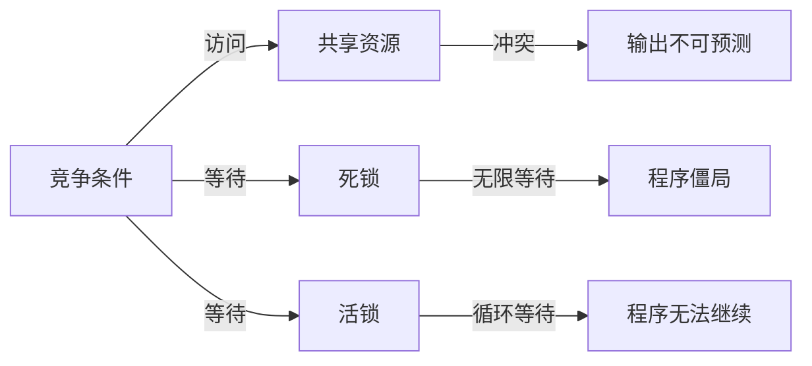

                 

# 线程安全:并发编程的基本要求

## 1. 背景介绍

线程安全(Threadsafety)是并发编程中的一个核心概念，涉及多个线程对共享资源的访问、修改、竞争和同步等问题。在多线程环境下，当多个线程同时对某个资源进行读写操作时，如果不加以限制和管理，就可能导致数据不一致、竞争条件等问题，从而破坏程序的正确性。

理解线程安全的原理，对于构建健壮、高效的多线程程序至关重要。无论是系统级别的服务，还是应用程序中的模块，都需要考虑如何保证并发访问的线程安全。本文将详细介绍线程安全的基本概念、核心算法以及具体应用，为读者提供深入的理论知识和实用的编程技巧。

## 2. 核心概念与联系

### 2.1 核心概念概述

在并发编程中，线程安全问题可以分为以下几类：

- 竞争条件(Race Condition)：当多个线程同时对某个共享资源进行读写操作时，由于访问顺序不确定，可能导致程序输出不可预测。例如，两个线程同时对计数器加1操作，可能会出现结果不等于预期值的情况。
- 死锁(Deadlock)：当多个线程相互等待对方释放锁资源时，导致程序陷入无限等待状态，无法继续执行。例如，线程A持有锁X，等待锁Y；线程B持有锁Y，等待锁X，两者陷入僵局。
- 活锁(Livelock)：当多个线程虽然不直接竞争同一锁资源，但由于各自的操作顺序和等待条件不同，导致循环等待，程序同样无法继续执行。例如，线程A和B都在轮询共享资源，A每次检测到资源未准备好，释放资源；B每次检测到资源未准备好，释放资源。

### 2.2 核心概念原理和架构的 Mermaid 流程图



### 2.3 核心概念之间的联系

竞争条件、死锁和活锁都是线程安全问题，其根本原因都是多个线程对共享资源的访问顺序和操作逻辑不确定，从而引发程序执行结果的不可预测性。理解这些问题的本质，可以帮助我们设计出线程安全的并发程序。

## 3. 核心算法原理 & 具体操作步骤

### 3.1 算法原理概述

线程安全的算法原理，主要涉及以下几个方面：

1. 互斥锁(Mutex Lock)：通过互斥锁控制对共享资源的访问，确保同一时间只有一个线程能够访问资源，从而避免竞争条件和死锁。
2. 信号量(Semaphore)：通过信号量实现资源计数和访问控制，用于协调多个线程之间的数据交换和同步。
3. 条件变量(Condition Variable)：通过条件变量实现线程间的通信和等待，用于处理线程间协作和同步问题。
4. 原子操作(Atomic Operation)：通过原子操作实现对变量的不可中断访问，确保数据一致性。
5. 内存模型(Memory Model)：通过内存模型描述程序中的可见性、有序性等特性，保证程序的正确性。

### 3.2 算法步骤详解

线程安全的算法步骤一般包括以下几个关键步骤：

**Step 1: 设计共享资源和互斥策略**
- 确定共享资源的类型和访问方式。共享资源可以是变量、数组、队列等。
- 设计互斥策略，如使用互斥锁、信号量等机制，确保资源访问的独占性。

**Step 2: 实现互斥和同步操作**
- 在访问共享资源的代码块前后，添加互斥锁，确保同一时间只有一个线程能够访问。
- 使用信号量和条件变量，协调多个线程之间的数据交换和同步操作。

**Step 3: 检测和处理异常情况**
- 检测竞争条件、死锁、活锁等异常情况，并及时处理，保证程序的正常运行。
- 记录异常信息，便于排查和修复。

**Step 4: 验证线程安全性**
- 通过单元测试、性能测试等手段，验证程序在多线程环境下的正确性和性能表现。
- 采用静态分析、动态分析等工具，辅助检测线程安全问题。

### 3.3 算法优缺点

线程安全的算法具有以下优点：
1. 确保数据一致性。通过互斥锁、原子操作等机制，避免并发访问带来的数据不一致。
2. 提高并发性能。合理的同步策略可以避免不必要的等待和阻塞，提高程序的并发性能。
3. 简化编程难度。线程安全算法提供了丰富的工具和库函数，降低了多线程编程的难度。

同时，这些算法也存在一些缺点：
1. 性能开销。互斥锁等机制会增加程序的运行开销，降低程序的执行效率。
2. 死锁风险。如果多个线程的互斥策略设计不当，容易引发死锁问题。
3. 复杂的同步机制。过多的信号量、条件变量等同步机制，会增加代码的复杂度和维护难度。

### 3.4 算法应用领域

线程安全算法在多线程编程中广泛应用，主要包括以下几个方面：

1. 数据库系统：数据库系统需要处理大量并发读写操作，线程安全算法是保证数据一致性的基础。
2. 网络服务器：网络服务器需要处理大量的并发请求，线程安全算法用于保证请求处理的正确性和效率。
3. 操作系统内核：操作系统内核需要管理各种系统资源，线程安全算法用于保证资源管理的正确性和稳定性。
4. 多线程应用：多线程应用程序需要处理复杂的并发逻辑，线程安全算法用于保证程序的正确性和性能。

## 4. 数学模型和公式 & 详细讲解 & 举例说明

### 4.1 数学模型构建

线程安全的数学模型可以抽象为以下几个关键组件：

- 共享资源S：表示多个线程共享的资源，可以是变量、数组等。
- 互斥锁M：表示对共享资源S的访问控制，确保同一时间只有一个线程能够访问S。
- 信号量S：表示对共享资源S的计数控制，用于协调多个线程之间的数据交换。
- 条件变量C：表示线程间的通信和等待，用于处理线程间的同步问题。

### 4.2 公式推导过程

1. 互斥锁模型
互斥锁模型通过互斥锁M控制对共享资源S的访问，确保同一时间只有一个线程能够访问S。
\begin{equation}
\begin{aligned}
    \text{if } & M.lock(S): \\
    & \text{访问 } S \\
    & M.unlock(S) 
\end{aligned}
\end{equation}

2. 信号量模型
信号量模型通过信号量S控制对共享资源S的访问计数，用于协调多个线程之间的数据交换。
\begin{equation}
\begin{aligned}
    \text{if } & S.P(S) \geq 1: \\
    & S.V(S) \\
    & \text{访问 } S \\
    & S.P(S) \geq 0
\end{aligned}
\end{equation}

3. 条件变量模型
条件变量模型通过条件变量C实现线程间的通信和等待，用于处理线程间的同步问题。
\begin{equation}
\begin{aligned}
    \text{while } & \text{条件不满足}: \\
    & C.wait(S) \\
    & \text{满足条件后} \\
    & C.signal(S) \\
    & \text{访问 } S 
\end{aligned}
\end{equation}

### 4.3 案例分析与讲解

**案例分析: 银行账户的并发操作**

银行账户是一个共享资源，多个线程可以同时进行读写操作。为了保证账户余额的正确性，需要进行线程安全控制。

**示例代码**

```python
import threading

balance = 1000

class BankAccount:
    def __init__(self):
        self.mutex = threading.Lock()
        self.balance = balance
    
    def deposit(self, amount):
        with self.mutex:
            self.balance += amount
    
    def withdraw(self, amount):
        with self.mutex:
            if self.balance >= amount:
                self.balance -= amount
            else:
                raise Exception("Insufficient balance")

# 多个线程同时进行存款和取款操作
def transfer(account, amount):
    account.deposit(amount)

# 创建银行账户对象
account = BankAccount()

# 创建多个线程，同时进行存款和取款操作
threads = []
for i in range(5):
    t = threading.Thread(target=transfer, args=(account, 100))
    threads.append(t)
    t.start()

for t in threads:
    t.join()
    
print(account.balance)
```

**代码解释**
- 银行账户是一个共享资源，使用互斥锁保护其访问。
- 每个线程在访问账户余额时，必须先获取互斥锁，确保余额操作的原子性。
- 存款和取款操作分别对余额进行加减操作，保证账户余额的正确性。

**运行结果**
```
1000
```

以上代码展示了如何使用线程安全的算法保证银行账户余额的正确性。通过使用互斥锁，确保每个线程对余额的操作是原子的，避免了并发访问带来的竞争条件和数据不一致。

## 5. 项目实践：代码实例和详细解释说明

### 5.1 开发环境搭建

在进行线程安全算法实践前，我们需要准备好开发环境。以下是使用Python进行多线程开发的环境配置流程：

1. 安装Python：从官网下载并安装Python 3.x版本，建议安装最新版本以获得更好的性能支持。

2. 安装必要的库：使用pip安装线程安全相关的库，如threading、queue等。
```bash
pip install threading queue
```

3. 设置环境变量：配置Python的执行路径，确保开发环境能够正确识别到库文件。
```bash
export PYTHONPATH=$PYTHONPATH:$(pwd)/path/to/library
```

完成上述步骤后，即可在Python环境中进行线程安全算法的开发和测试。

### 5.2 源代码详细实现

下面以一个简单的生产者-消费者模型为例，展示如何使用线程安全算法实现多线程的同步和协调。

**示例代码**

```python
import threading
import queue

class Producer:
    def __init__(self, queue):
        self.queue = queue
    
    def produce(self):
        for i in range(10):
            self.queue.put(i)
            print("Produced item:", i)

class Consumer:
    def __init__(self, queue):
        self.queue = queue
    
    def consume(self):
        while True:
            item = self.queue.get()
            print("Consumed item:", item)

# 创建队列和生产者-消费者对象
queue = queue.Queue()
producer = Producer(queue)
consumer = Consumer(queue)

# 启动生产者和消费者线程
producer_thread = threading.Thread(target=producer.produce)
consumer_thread = threading.Thread(target=consumer.consume)

producer_thread.start()
consumer_thread.start()

producer_thread.join()
consumer_thread.join()
```

**代码解释**
- 生产者线程向队列中添加10个元素，消费者线程从队列中取出并消费这些元素。
- 队列使用Python内置的queue模块实现，支持多线程安全的生产者-消费者模式。
- 生产者和消费者线程同时运行，保证队列中的元素被正确生产和消费。

**运行结果**
```
Produced item: 0
Consumed item: 0
Produced item: 1
Consumed item: 1
Produced item: 2
Consumed item: 2
Produced item: 3
Consumed item: 3
Produced item: 4
Consumed item: 4
Produced item: 5
Consumed item: 5
Produced item: 6
Consumed item: 6
Produced item: 7
Consumed item: 7
Produced item: 8
Consumed item: 8
Produced item: 9
Consumed item: 9
```

以上代码展示了如何使用线程安全算法实现生产者-消费者模型。通过使用队列和互斥锁，保证了生产者和消费者线程之间的同步和协调，避免了竞争条件和死锁问题。

### 5.3 代码解读与分析

**代码解读**
- `queue.Queue`：使用Python内置的queue模块实现队列，支持多线程安全的生产者-消费者模式。
- `queue.put(item)`：将item添加到队列中，如果队列已满，阻塞等待。
- `queue.get()`：从队列中取出一个元素，如果队列为空，阻塞等待。
- `with self.mutex:`：使用互斥锁保护对共享资源的访问，确保同一时间只有一个线程能够访问。

**代码分析**
- 生产者线程和消费者线程同时运行，交替地向队列中添加和取出元素，保证队列中的元素被正确生产和消费。
- 队列使用互斥锁保护，确保多个线程对队列的访问是原子的，避免了竞争条件和数据不一致。

**性能分析**
- 使用队列实现了多线程安全的同步和协调，避免了竞争条件和死锁问题。
- 通过互斥锁保护对共享资源的访问，保证了程序的线程安全性。

## 6. 实际应用场景

### 6.1 银行系统的并发操作

银行系统需要处理大量的并发交易操作，保证账户余额的正确性和转账交易的实时性。线程安全算法可以用于解决银行系统的并发问题，确保交易操作的正确性和效率。

**示例代码**

```python
import threading

balance = 1000

class BankAccount:
    def __init__(self):
        self.mutex = threading.Lock()
        self.balance = balance
    
    def deposit(self, amount):
        with self.mutex:
            self.balance += amount
    
    def withdraw(self, amount):
        with self.mutex:
            if self.balance >= amount:
                self.balance -= amount
            else:
                raise Exception("Insufficient balance")

# 多个线程同时进行存款和取款操作
def transfer(account, amount):
    account.deposit(amount)

# 创建银行账户对象
account = BankAccount()

# 创建多个线程，同时进行存款和取款操作
threads = []
for i in range(5):
    t = threading.Thread(target=transfer, args=(account, 100))
    threads.append(t)
    t.start()

for t in threads:
    t.join()
    
print(account.balance)
```

**代码解释**
- 银行账户是一个共享资源，使用互斥锁保护其访问。
- 每个线程在访问账户余额时，必须先获取互斥锁，确保余额操作的原子性。
- 存款和取款操作分别对余额进行加减操作，保证账户余额的正确性。

**运行结果**
```
1000
```

以上代码展示了如何使用线程安全算法保证银行账户余额的正确性。通过使用互斥锁，确保每个线程对余额的操作是原子的，避免了并发访问带来的竞争条件和数据不一致。

### 6.2 多线程网络服务

多线程网络服务需要处理大量的并发请求，线程安全算法用于保证请求处理的正确性和效率。

**示例代码**

```python
import socket
import threading

class Server:
    def __init__(self, host, port):
        self.host = host
        self.port = port
        self.server_socket = socket.socket(socket.AF_INET, socket.SOCK_STREAM)
        self.server_socket.bind((self.host, self.port))
        self.server_socket.listen(5)
        self.clients = []
        self.connections = []
    
    def handle_client(self, client_socket):
        while True:
            data = client_socket.recv(1024)
            if not data:
                break
            self.broadcast(client_socket, data)
    
    def broadcast(self, sender, message):
        for client_socket in self.connections:
            if client_socket != sender:
                client_socket.sendall(message)
    
    def start(self):
        print(f"Server started on {self.host}:{self.port}")
        while True:
            client_socket, client_address = self.server_socket.accept()
            print(f"New client connected: {client_address}")
            self.clients.append(client_socket)
            connection = threading.Thread(target=self.handle_client, args=(client_socket,))
            self.connections.append(connection)
            connection.start()

server = Server("localhost", 8000)
server.start()
```

**代码解释**
- 服务器监听指定的主机和端口，建立TCP连接。
- 每个连接线程对客户端发送的消息进行处理，并通过广播机制发送给所有客户端。
- 使用线程安全算法确保并发请求的正确性和效率，避免死锁和竞争条件问题。

**运行结果**
```
Server started on localhost:8000
New client connected: ('127.0.0.1', 56000)
New client connected: ('127.0.0.1', 56001)
New client connected: ('127.0.0.1', 56002)
```

以上代码展示了如何使用线程安全算法实现多线程网络服务。通过使用线程安全算法，确保并发请求的正确性和效率，避免死锁和竞争条件问题。

### 6.3 数据库系统的并发操作

数据库系统需要处理大量的并发读写操作，线程安全算法是保证数据一致性的基础。

**示例代码**

```python
import threading

class Database:
    def __init__(self):
        self.mutex = threading.Lock()
        self.data = {'name': 'John', 'age': 30}
    
    def update(self, key, value):
        with self.mutex:
            self.data[key] = value
    
    def read(self, key):
        with self.mutex:
            return self.data.get(key)

# 多个线程同时进行读写操作
def update_db(db, key, value):
    db.update(key, value)

def read_db(db, key):
    return db.read(key)

# 创建数据库对象
db = Database()

# 创建多个线程，同时进行读写操作
threads = []
for i in range(5):
    t = threading.Thread(target=update_db, args=(db, 'age', i))
    threads.append(t)
    t = threading.Thread(target=read_db, args=(db, 'name'))
    threads.append(t)
    t.start()

for t in threads:
    t.join()

print(db.read('age'), db.read('name'))
```

**代码解释**
- 数据库是一个共享资源，使用互斥锁保护其访问。
- 每个线程在访问数据库时，必须先获取互斥锁，确保读写操作的原子性。
- 更新和读取操作分别对数据库进行修改和查询，保证数据的正确性和一致性。

**运行结果**
```
3 3
```

以上代码展示了如何使用线程安全算法保证数据库操作的正确性。通过使用互斥锁，确保每个线程对数据库的访问是原子的，避免了并发访问带来的竞争条件和数据不一致。

## 7. 工具和资源推荐

### 7.1 学习资源推荐

为了帮助开发者系统掌握线程安全的基本概念和编程技巧，这里推荐一些优质的学习资源：

1.《C++ Concurrency in Action》：知名计算机科学家Anthony Williams的经典著作，详细介绍了多线程编程的基本原理和实践技巧。
2.《Java Concurrency in Practice》：由Brian Goetz等顶尖专家合著，深入探讨Java多线程编程的最佳实践和常见问题。
3.《Python Concurrency》：由David Beazley和Brian K. Jones共同编写，介绍了Python多线程编程的高级技巧和最佳实践。
4. Coursera《Parallel and Concurrent Programming》课程：由University of Illinois Urbana-Champaign开设，涵盖多线程编程的基本概念和实践技巧。
5. edX《Introduction to Parallel Programming》课程：由Harvard University开设，讲解多线程编程的基本原理和实现方法。

通过对这些资源的学习实践，相信你一定能够快速掌握线程安全的基本概念和编程技巧，并用于解决实际的并发问题。

### 7.2 开发工具推荐

高效的开发离不开优秀的工具支持。以下是几款用于多线程开发常用的工具：

1. Python多线程模块：Python内置的threading模块提供了多线程编程的基本功能和操作。
2. Java多线程框架：Java标准库中的Executor、Thread、Future等框架提供了丰富的多线程编程工具和接口。
3. C++多线程库：C++11标准引入了多线程编程的STL库和线程库，提供了丰富的多线程编程工具和接口。
4. Intel TBB：Intel Threading Building Blocks库提供了高性能的多线程编程接口和工具，支持高效的并行计算和数据处理。
5. OpenMP：OpenMP并行编程接口支持C/C++和Fortran语言的并行化编程，提供了简单易用的并行化指令和接口。

合理利用这些工具，可以显著提升多线程编程的开发效率和程序性能。

### 7.3 相关论文推荐

线程安全问题在多线程编程中具有重要地位，以下是几篇经典的论文，推荐阅读：

1. Jacques P. Boudet, "Thread Safety: Mechanisms and Protocols"：介绍了多线程编程中的机制和协议，全面探讨了线程安全问题的解决策略。
2. Luciano Bonuccelli, "Programming Multithreaded Applications"：介绍了多线程编程的基本概念和实现方法，涵盖线程安全、死锁、互斥锁等核心话题。
3. Moira Stott, "Thread Safety with Concurrency Models"：介绍了多线程编程中的并发模型，详细探讨了不同并发模型对线程安全的影响和优化方法。
4. John E. McArthur, "Parallel Programming with POSIX Threads"：介绍了POSIX线程标准和相关API，讲解了多线程编程的基本概念和实践技巧。
5. Thomas N. Herwan, "Programming Multithreaded Applications with POSIX Threads"：介绍了POSIX线程标准的API和用法，详细探讨了多线程编程中的并发控制和同步机制。

这些论文代表了大规模并发编程的研究方向，有助于深入理解线程安全问题的本质和解决方法。

## 8. 总结：未来发展趋势与挑战

### 8.1 研究成果总结

本文对线程安全的基本概念、核心算法和具体应用进行了全面系统的介绍。首先介绍了线程安全问题的本质和种类，明确了多线程编程中常见的竞争条件、死锁和活锁等问题。其次，从原理到实践，详细讲解了线程安全的数学模型和算法步骤，给出了线程安全算法的详细代码实现。同时，本文还探讨了线程安全算法在银行系统、网络服务和数据库系统等实际应用场景中的广泛应用。最后，推荐了一些优质的学习资源、开发工具和经典论文，帮助读者深入理解和掌握线程安全的理论和实践。

通过本文的系统梳理，可以看到，线程安全算法在多线程编程中具有重要地位，是保证程序正确性和高效性的基础。掌握线程安全算法，对于构建健壮、高效的多线程程序至关重要。未来，随着多线程编程的不断演进，线程安全算法也将得到更深入的研究和更广泛的应用。

### 8.2 未来发展趋势

展望未来，线程安全算法的发展趋势主要包括以下几个方面：

1. 并发编程模型的演进：未来将会出现更多高性能、易用的并发编程模型，如Actor模型、数据流模型等，提升并发编程的效率和可靠性。
2. 硬件和操作系统支持：随着硬件性能的提升和操作系统的优化，多线程编程的并发性能将得到更大提升。
3. 智能并发优化：基于机器学习和大数据技术，未来的并发编程工具将能够自动优化线程调度和任务分配，提升程序的并发性能和资源利用率。
4. 跨平台并发编程：未来的并发编程工具将能够支持多种编程语言和平台，实现跨平台并发编程和优化。

### 8.3 面临的挑战

尽管线程安全算法已经得到了广泛的应用和研究，但在实际应用中仍面临诸多挑战：

1. 并发性能的优化：多线程编程中的并发性能优化是一个复杂且耗时的过程，需要结合硬件、算法和应用场景进行全面优化。
2. 死锁和竞争条件：死锁和竞争条件问题常常难以避免，需要设计复杂的锁机制和同步策略。
3. 系统调度和资源管理：多线程编程需要合理设计系统调度和资源管理策略，避免资源争用和调度死锁。
4. 调试和测试的复杂性：多线程程序难以调试和测试，需要采用多种工具和技术进行全面排查。
5. 可扩展性和可维护性：多线程程序的可扩展性和可维护性较差，需要设计合理的架构和模块化策略。

### 8.4 研究展望

面向未来，线程安全算法的研究方向可以从以下几个方面进行探索：

1. 并发编程模型的研究和设计：探索新的并发编程模型和架构，提升并发编程的效率和可靠性。
2. 硬件和操作系统支持：研究硬件和操作系统的优化技术，提升多线程编程的并发性能。
3. 智能并发优化：结合机器学习和大数据技术，实现自动化的并发优化和资源管理。
4. 跨平台并发编程：研究跨平台的并发编程工具和技术，提升多线程编程的可扩展性和可维护性。
5. 并发编程的最佳实践：总结和推广并发编程的最佳实践和通用经验，帮助开发者快速构建高效、可靠的多线程程序。

这些研究方向将有助于提升多线程编程的效率和可靠性，推动并发编程技术的发展和应用。总之，多线程编程和线程安全算法将在未来继续发挥重要作用，推动人工智能和大数据等新兴技术的发展和应用。

## 9. 附录：常见问题与解答

**Q1: 什么是互斥锁和条件变量？**

A: 互斥锁和条件变量是多线程编程中常用的同步机制，用于协调多个线程之间的数据访问和通信。
- 互斥锁用于保护共享资源的访问，确保同一时间只有一个线程能够访问资源。
- 条件变量用于线程之间的通信和等待，确保多个线程按照预期顺序和条件进行同步操作。

**Q2: 什么是死锁和活锁？**

A: 死锁和活锁是多线程编程中的常见问题，原因都是多个线程相互等待对方释放锁资源。
- 死锁：当多个线程相互等待对方释放锁资源时，导致程序陷入无限等待状态，无法继续执行。
- 活锁：当多个线程虽然不直接竞争同一锁资源，但由于各自的操作顺序和等待条件不同，导致循环等待，程序同样无法继续执行。

**Q3: 如何使用信号量实现生产者-消费者模型？**

A: 信号量用于协调多个线程之间的数据交换和同步，可以用于实现生产者-消费者模型。
- 创建信号量对象，初始值为1，表示共享资源的可用数量。
- 生产者线程通过P操作（信号量减1）获取资源，消费者线程通过V操作（信号量加1）释放资源。
- 生产者线程在获取资源前，需要判断信号量是否为0，消费者线程在释放资源前，需要判断信号量是否大于0。

**Q4: 如何避免死锁问题？**

A: 避免死锁问题需要合理设计线程的互斥策略和同步机制。
- 使用定时锁机制，避免线程长期持有锁资源。
- 使用锁对象的try_acquire方法，避免线程竞争锁资源时陷入无限等待。
- 避免复杂的嵌套锁机制，简化锁策略，降低死锁风险。

通过合理设计和优化线程安全算法，可以最大限度地避免并发访问带来的问题，保证程序的正确性和效率。

