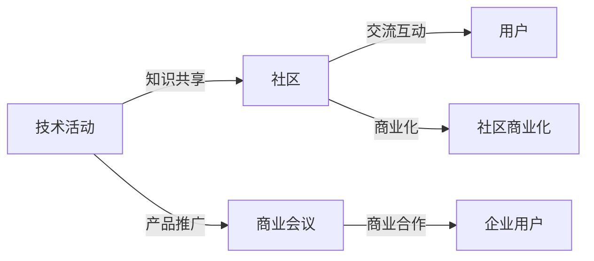

                 

# 组织技术活动：从社区到商业会议的转变

> 关键词：技术活动组织,社区构建,商业会议,技术推广,用户参与

## 1. 背景介绍

随着技术的迅猛发展和应用场景的日益丰富，技术活动在行业内外越来越受到重视。这些活动不仅能够推广新技术、新理念，还能增强社区的凝聚力，推动技术进步。从技术社区的线上论坛、Meetup聚会，到商业会议的行业峰会、技术展览，技术活动的形式多种多样。然而，随着参与者需求的不断变化，这些活动也面临诸多挑战，例如如何吸引和保持活跃用户，如何在商业化过程中维持社区氛围等。本文将从社区和商业两个角度出发，探讨如何组织和举办高效、有吸引力的技术活动。

## 2. 核心概念与联系

### 2.1 核心概念概述

#### 技术活动
技术活动指以推广新技术、新理念为目的，结合行业热点、技术趋势等组织的一系列交流活动。其形式包括线上线下的技术讲座、研讨会、黑客马拉松、Meetup聚会、技术展览等。

#### 社区构建
社区构建指的是通过线上线下方式聚集志趣相投的技术爱好者，搭建一个互动交流的平台。社区可以是技术论坛、博客、社交媒体群组、GitHub项目等，旨在促进知识共享和技术交流。

#### 商业会议
商业会议指的是面向企业用户和投资者，通过演讲、展览、研讨、展览等形式，介绍公司最新产品、技术、市场策略，扩大品牌影响力和商业合作机会。

这三个概念之间有紧密的联系：技术活动是社区和商业会议的重要形式，社区是技术活动的基础，而商业会议则是技术活动的高级形式。通过技术活动和社区构建，可以吸引和维持技术爱好者的兴趣，为其提供深度交流的环境；而商业会议则能将技术理念和产品直接推广给企业用户，扩大商业影响力。

### 2.2 核心概念原理和架构的 Mermaid 流程图



## 3. 核心算法原理 & 具体操作步骤

### 3.1 算法原理概述

技术活动的组织过程涉及到多个环节，包括活动策划、内容制作、推广宣传、用户参与等。其算法原理可以归纳为以下几个方面：

1. **需求分析**：通过问卷调查、数据分析等方式，了解目标用户群体的需求和兴趣点。
2. **内容设计**：结合用户需求和行业热点，设计活动内容和形式，如主题演讲、圆桌讨论、技术演示等。
3. **渠道推广**：选择合适的推广渠道，如社交媒体、邮件列表、合作伙伴等，吸引目标用户参与。
4. **用户互动**：通过互动环节，如问答、技术交流、项目协作等，增强用户参与感和社区凝聚力。
5. **效果评估**：通过用户反馈、参与数据、商业效果等指标，评估活动效果，为下一次活动改进提供参考。

### 3.2 算法步骤详解

#### Step 1: 需求分析
- **目标群体**：定义目标用户群体的职业背景、技术水平、兴趣方向等。
- **需求调研**：通过问卷调查、用户访谈、数据分析等方式，收集用户对技术活动的需求和期望。
- **需求分析**：整理分析调研数据，识别共性需求和个性化需求。

#### Step 2: 内容设计
- **主题设定**：结合行业热点和用户需求，设定活动主题和内容。
- **内容制作**：制作高质量的演讲PPT、演示视频、技术文档等活动内容。
- **形式选择**：根据活动主题和用户需求，选择合适的活动形式，如线上直播、线下Meetup、技术比赛等。

#### Step 3: 渠道推广
- **渠道选择**：根据用户群体特点，选择适合的推广渠道，如社交媒体、邮件列表、合作伙伴等。
- **内容推广**：制作吸引人的宣传材料，包括活动预告、嘉宾介绍、活动亮点等。
- **推广策略**：采用多渠道、多平台、多形式的推广策略，确保活动覆盖面广、用户参与度高。

#### Step 4: 用户互动
- **互动设计**：设计互动环节，如问答、技术交流、项目协作等，增强用户参与感。
- **互动执行**：在活动现场或线上平台执行互动环节，引导用户积极参与。
- **反馈收集**：通过调查问卷、用户评论等方式，收集用户反馈，评估活动效果。

#### Step 5: 效果评估
- **数据分析**：收集活动参与数据、用户反馈、商业效果等指标，进行详细分析。
- **效果评估**：根据分析结果，评估活动的效果和用户满意度。
- **改进优化**：根据评估结果，对下一次活动进行改进优化。

### 3.3 算法优缺点

#### 优点
- **覆盖面广**：技术活动能够覆盖多种形式，吸引不同背景的用户参与。
- **推广效果好**：通过多渠道推广，能够快速扩大活动影响力和用户基数。
- **社区凝聚力强**：通过互动环节，增强社区成员的参与感和归属感。
- **效果评估客观**：通过数据分析和用户反馈，客观评估活动效果。

#### 缺点
- **资源投入大**：技术活动组织需要大量的时间、人力、物力投入。
- **用户参与度不稳定**：不同活动效果差异大，用户参与度不稳定。
- **商业化难度大**：商业会议需要平衡商业推广和技术分享，难度较大。
- **活动效果评估复杂**：活动效果受多种因素影响，评估复杂。

### 3.4 算法应用领域

#### 技术社区
- **Meetup聚会**：线下技术聚会，聚焦特定技术主题，促进交流。
- **开源项目**：组织开源项目代码评审、技术讨论、社区贡献等活动。
- **线上论坛**：举办线上技术讨论、技术分享、问题答疑等活动。

#### 商业会议
- **行业峰会**：大型行业峰会，邀请知名演讲嘉宾，展示最新技术趋势。
- **技术展览**：技术展览会，展示最新产品和技术，促进技术交流。
- **企业合作**：组织企业技术合作洽谈会，推动商业合作机会。

## 4. 数学模型和公式 & 详细讲解 & 举例说明

### 4.1 数学模型构建

技术活动的效果评估可以通过多个指标进行量化，包括用户参与度、活动关注度、商业合作量等。下面以用户参与度为例，构建数学模型。

假设活动总人数为 $N$，参与人数为 $n$，则用户参与度 $U$ 可以通过以下公式计算：

$$
U = \frac{n}{N}
$$

其中 $N$ 为总人数，$n$ 为参与人数。

### 4.2 公式推导过程

用户参与度的计算相对简单，可以通过统计参与人数占总人数的比例直接得出。

### 4.3 案例分析与讲解

#### 案例一：Meetup聚会
假设某技术Meetup聚会总人数为200人，实际参与人数为100人，则用户参与度为：

$$
U = \frac{100}{200} = 0.5
$$

#### 案例二：行业峰会
假设某行业峰会邀请了500家企业，实际到场企业为300家，则用户参与度为：

$$
U = \frac{300}{500} = 0.6
$$

#### 案例三：技术展览
假设某技术展览会吸引了2000名观众，其中500名观众参与了互动环节，则用户参与度为：

$$
U = \frac{500}{2000} = 0.25
$$

## 5. 项目实践：代码实例和详细解释说明

### 5.1 开发环境搭建

开发技术活动组织平台，需要以下开发环境：

1. 搭建Web开发环境：使用Python Flask或Django框架，搭建Web应用。
2. 数据库搭建：选择MySQL或MongoDB等数据库，存储用户信息、活动信息等数据。
3. 邮件服务搭建：使用SendGrid或Amazon SES等邮件服务，发送活动通知和推广邮件。
4. 社交媒体集成：集成Twitter、Facebook等社交媒体API，推送活动信息。

### 5.2 源代码详细实现

#### 用户信息管理
用户信息包括用户的基本信息、兴趣标签、参与历史等。可以使用Python Flask实现用户信息管理，代码示例如下：

```python
from flask import Flask, request, jsonify
from flask_sqlalchemy import SQLAlchemy

app = Flask(__name__)
app.config['SQLALCHEMY_DATABASE_URI'] = 'sqlite:///user.db'
db = SQLAlchemy(app)

class User(db.Model):
    id = db.Column(db.Integer, primary_key=True)
    name = db.Column(db.String(50))
    email = db.Column(db.String(50))
    interests = db.Column(db.String(100))
    participation_history = db.Column(db.String(100))

@app.route('/users', methods=['POST'])
def add_user():
    user_data = request.json
    new_user = User(name=user_data['name'], email=user_data['email'], interests=user_data['interests'])
    db.session.add(new_user)
    db.session.commit()
    return jsonify({'message': 'User added successfully'}), 201

@app.route('/users', methods=['GET'])
def get_users():
    users = User.query.all()
    user_list = [{'id': user.id, 'name': user.name, 'email': user.email, 'interests': user.interests} for user in users]
    return jsonify(user_list), 200
```

#### 活动信息管理
活动信息包括活动名称、时间、地点、内容、嘉宾等。可以使用Python Flask实现活动信息管理，代码示例如下：

```python
class Event(db.Model):
    id = db.Column(db.Integer, primary_key=True)
    name = db.Column(db.String(100))
    date = db.Column(db.DateTime())
    location = db.Column(db.String(100))
    content = db.Column(db.String(500))
    guests = db.Column(db.String(100))

@app.route('/events', methods=['POST'])
def add_event():
    event_data = request.json
    new_event = Event(name=event_data['name'], date=event_data['date'], location=event_data['location'], content=event_data['content'], guests=event_data['guests'])
    db.session.add(new_event)
    db.session.commit()
    return jsonify({'message': 'Event added successfully'}), 201

@app.route('/events', methods=['GET'])
def get_events():
    events = Event.query.all()
    event_list = [{'id': event.id, 'name': event.name, 'date': event.date, 'location': event.location, 'content': event.content, 'guests': event.guests} for event in events]
    return jsonify(event_list), 200
```

#### 活动推广
活动推广可以通过邮件和社交媒体实现。使用Python Flask集成SendGrid或Twitter API，代码示例如下：

```python
from flask_mail import Mail, Message

mail = Mail(app)

def send_email(to, subject, body):
    msg = Message(subject=subject, recipients=[to], body=body)
    mail.send(msg)

@app.route('/events/<int:event_id>', methods=['GET'])
def get_event(event_id):
    event = Event.query.get(event_id)
    email_to = event.user_email
    subject = 'Event Reminder: {}'.format(event.name)
    body = 'Please join us for the event on {} at {}'.format(event.date, event.location)
    send_email(email_to, subject, body)
    return jsonify({'message': 'Email sent successfully'}), 201

@app.route('/social_media', methods=['POST'])
def post_social_media():
    social_media_data = request.json
    tweet_message = 'Check out our event {}: {}'.format(social_media_data['name'], social_media_data['link'])
    twitter_api = TwitterAPI(social_media_data['consumer_key'], social_media_data['consumer_secret'], social_media_data['access_token'], social_media_data['access_token_secret'])
    twitter_api.update_status(status=tweet_message)
    return jsonify({'message': 'Social media post successful'}), 201
```

### 5.3 代码解读与分析

以上代码仅为示例，实际开发中需要根据具体需求进行优化和调整。

#### 用户信息管理
- 实现了一个简单的用户信息管理模块，包括添加用户和获取用户信息等功能。
- 使用了SQLAlchemy库进行数据库操作，代码简洁易懂。

#### 活动信息管理
- 实现了活动信息的添加和获取功能。
- 使用了SQLAlchemy库进行数据库操作，支持SQL语句查询。

#### 活动推广
- 实现了邮件和社交媒体的集成。
- 使用了Flask-Mail库发送邮件，使用Twitter API发布推文。

### 5.4 运行结果展示

用户信息管理和活动信息管理模块可以通过前端页面进行展示和操作，如图表和列表形式展示用户信息和活动信息，方便用户查看和管理。活动推广模块可以通过邮件和社交媒体发送活动通知和推广信息，吸引更多用户参与。

## 6. 实际应用场景

### 6.1 技术社区的 Meetup聚会

Meetup聚会是技术社区常用的活动形式，能够促进技术爱好者之间的交流和合作。例如，某技术社区组织了一次Python Meetup聚会，邀请了多位知名Python开发者进行技术分享和讨论。

- **活动策划**：确定聚会主题为“Python 3.x 最佳实践”，邀请多位知名开发者进行分享。
- **内容设计**：准备演示文稿、代码演示等活动内容。
- **渠道推广**：通过社区论坛、邮件列表、社交媒体等方式推广活动。
- **用户互动**：现场设置问答环节，用户可以随时向嘉宾提问，并进行互动讨论。
- **效果评估**：收集用户反馈，评估活动效果。

### 6.2 商业会议的行业峰会

行业峰会是企业推广最新技术、产品的重要形式，能够吸引大量行业专家和企业用户。例如，某软件公司组织了一次年度行业峰会，展示了最新的云计算技术产品。

- **活动策划**：确定峰会主题为“云计算技术创新与未来展望”，邀请多位行业专家进行演讲。
- **内容设计**：准备演讲PPT、产品演示等活动内容。
- **渠道推广**：通过公司网站、社交媒体、合作伙伴等方式推广活动。
- **用户互动**：现场设置展位展示产品，并安排技术交流环节。
- **效果评估**：收集参会企业的反馈，评估活动效果。

### 6.3 技术展览的技术展览会

技术展览会是展示最新技术产品的重要平台，能够吸引大量技术爱好者和行业用户。例如，某技术展览会展示了最新的人工智能技术和应用。

- **活动策划**：确定展览主题为“人工智能技术与应用”，邀请多位技术专家进行演示。
- **内容设计**：准备演示视频、技术文档等活动内容。
- **渠道推广**：通过社交媒体、邮件列表等方式推广活动。
- **用户互动**：现场设置互动体验区，用户可以亲身体验人工智能应用。
- **效果评估**：收集用户反馈，评估活动效果。

## 7. 工具和资源推荐

### 7.1 学习资源推荐

#### 《组织活动管理手册》
- 详细介绍了技术活动的组织流程和最佳实践。

#### 《社区建设与运营》
- 提供了社区构建和运营的详细方法和案例分析。

#### 《商业会议策划与执行》
- 介绍了商业会议的策划、推广、执行等环节，提供成功案例分析。

#### 《数据驱动的组织决策》
- 通过数据分析，帮助组织评估活动效果，进行优化调整。

### 7.2 开发工具推荐

#### Flask
- 轻量级Web框架，易于上手，适合快速开发原型。

#### SQLAlchemy
- ORM库，支持多种数据库，方便进行数据库操作。

#### SendGrid
- 邮件服务提供商，支持邮件发送和追踪。

#### Twitter API
- 社交媒体API，支持发布推文和互动。

#### MongoDB
- NoSQL数据库，支持灵活的数据存储和查询。

### 7.3 相关论文推荐

#### 《技术社区构建与管理》
- 探讨了技术社区的构建和管理方法，提供案例分析。

#### 《商业会议的策划与执行》
- 介绍了商业会议的策划和执行流程，提供成功案例分析。

#### 《数据驱动的组织决策》
- 通过数据分析方法，帮助组织进行决策优化。

#### 《技术活动的组织与推广》
- 探讨了技术活动的组织和推广方法，提供实践指导。

## 8. 总结：未来发展趋势与挑战

### 8.1 研究成果总结

技术活动是技术社区和商业会议的重要形式，其组织和管理需要多方面的综合考虑。本文从需求分析、内容设计、渠道推广、用户互动、效果评估等多个环节，详细介绍了技术活动的组织流程和最佳实践。通过案例分析，展示了技术社区和商业会议的成功经验和存在问题。

### 8.2 未来发展趋势

未来的技术活动将更加注重用户参与和互动，采用更多线上线下相结合的形式。技术社区和商业会议将更加注重用户体验和技术融合，采用多种形式的活动内容，吸引更多用户参与。

### 8.3 面临的挑战

技术活动的组织面临诸多挑战，包括用户需求多样、推广渠道复杂、活动效果评估困难等。未来需要更加深入地研究用户行为和活动效果，优化活动设计和推广策略，提高活动组织效率和效果。

### 8.4 研究展望

未来技术活动的研究方向将更加注重数据驱动和智能决策，通过大数据分析和机器学习技术，提升活动组织和管理效率。同时，需要更加注重用户反馈和社区建设，增强用户参与感和社区凝聚力。

## 9. 附录：常见问题与解答

### Q1: 如何吸引更多的用户参与技术活动？
A: 通过多种渠道推广活动，包括社交媒体、邮件列表、合作伙伴等，吸引更多用户关注和参与。同时，活动内容设计要结合用户需求和兴趣点，提供有价值的技术分享和互动环节，增强用户参与感。

### Q2: 如何在商业会议中平衡商业推广和技术分享？
A: 通过合理的活动设计，将商业推广和技术分享有机结合。可以在活动安排中加入商业推广环节，如产品展示、合作洽谈等，同时增加技术分享环节，如主题演讲、技术演示等。

### Q3: 如何评估技术活动的用户参与度和效果？
A: 通过用户反馈、参与数据、商业效果等指标，评估活动效果。可以通过问卷调查、用户评论等方式收集用户反馈，使用数据分析方法评估活动参与度和效果，根据评估结果进行优化调整。

### Q4: 如何在技术社区中保持活跃用户？
A: 通过定期组织技术分享、技术讨论、技术比赛等活动，增强用户参与感和社区凝聚力。同时，可以建立用户激励机制，如认证、徽章等，鼓励用户积极参与社区活动。

### Q5: 如何在技术活动中增强用户互动？
A: 设计互动环节，如问答、技术交流、项目协作等，增强用户参与感和社区凝聚力。可以在活动现场或线上平台设置互动环节，引导用户积极参与。

---

作者：禅与计算机程序设计艺术 / Zen and the Art of Computer Programming

