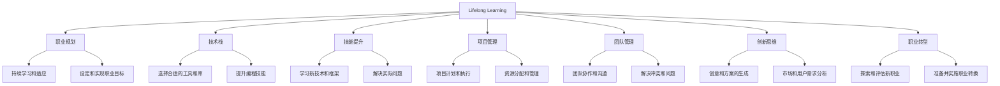

                 

# 终身学习与职业生涯规划

> 关键词：终身学习,职业规划,人工智能,技术栈,技能提升,项目管理,团队管理,创新思维,职业转型

## 1. 背景介绍

### 1.1 问题由来
在当今快速变化的技术和商业环境中，个人职业发展的路径和所需的技能也在不断地演变。尤其是对于从事人工智能（AI）和相关领域的从业者而言，终身学习和职业规划变得尤为重要。面对AI技术的飞速发展和应用领域的不断扩展，从业者需要不断地更新知识和技能，以保持竞争力和适应性。

### 1.2 问题核心关键点
终身学习与职业生涯规划的核心在于如何构建一个持续学习和职业成长的系统，以便在技术不断更新和职业需求变化的环境下，最大化个人价值和职业潜力。

## 2. 核心概念与联系

### 2.1 核心概念概述

为更好地理解终身学习与职业生涯规划，本节将介绍几个密切相关的核心概念：

- **终身学习(Lifelong Learning)**：一种持续不断学习新知识、技能和认知的过程，目的是适应不断变化的环境和个人职业发展需求。
- **职业规划(Career Planning)**：通过分析和规划，确定个人职业目标，制定实现目标的路径和计划的过程。
- **技术栈(Technical Stack)**：个人或团队所需掌握的技术集合，包括编程语言、框架、工具、库等。
- **技能提升(Skill Enhancement)**：通过学习和实践，提高个人或团队的技术能力和问题解决能力。
- **项目管理(Project Management)**：规划、组织、执行和监控项目的过程，以确保项目按时、按预算和按质量完成。
- **团队管理(Team Management)**：管理和协调团队成员的工作，确保团队高效协同，达成共同目标。
- **创新思维(Innovation Thinking)**：培养开放思维、解决问题的创新能力，推动技术突破和应用创新。
- **职业转型(Job Transition)**：从现有职业转向另一个职业的过程，往往需要重新学习相关技能和知识。

这些核心概念之间的逻辑关系可以通过以下Mermaid流程图来展示：



这个流程图展示了一个持续学习和职业成长的基本流程：

1. 终身学习提供了获取新知识的基础，通过不断学习，提高个人技能和认知。
2. 职业规划帮助设定和实现职业目标，确定学习方向和路径。
3. 技术栈和技能提升确保掌握必要的工具和技术，提升问题解决能力。
4. 项目管理有助于高效地执行和学习新技术，提升团队协作和沟通能力。
5. 团队管理确保团队协同工作，解决冲突，推动团队发展。
6. 创新思维帮助生成新的创意和方案，分析市场需求，推动技术创新。
7. 职业转型帮助探索和实现新的职业目标，适应新的职业环境。

这些概念共同构成了终身学习与职业生涯规划的基本框架，帮助从业者构建一个可持续的职业发展路径。

## 3. 核心算法原理 & 具体操作步骤
### 3.1 算法原理概述

终身学习与职业生涯规划的算法原理可以概述为以下几个关键点：

1. **持续学习模型**：通过构建一个持续学习的模型，不断更新知识库和技能树，以适应技术变化和职业需求。
2. **职业目标优化**：设定明确且可实现的职业目标，通过评估和调整，逐步接近目标。
3. **技能树构建**：根据职业目标，构建一个动态的技能树，记录所需的技能和知识，以及学习的进度和效果。
4. **反馈机制设计**：设计一个有效的反馈机制，根据学习效果和实际应用，调整学习路径和计划。

### 3.2 算法步骤详解

基于上述算法原理，终身学习与职业生涯规划的详细步骤可以总结为：

**Step 1: 设定职业目标**
- 通过SWOT分析（优势、劣势、机会、威胁），明确个人职业发展的方向和目标。
- 制定短期和长期目标，以及达成目标的阶段性里程碑。

**Step 2: 构建技能树**
- 根据职业目标，确定所需的技能和知识，构建一个动态的技能树。
- 对于每个技能节点，记录其重要性、当前掌握程度和学习进度。

**Step 3: 制定学习计划**
- 根据技能树，制定一个合理的学习计划，包括学习内容、学习时间、学习资源等。
- 将学习计划细化到每周、每日，确保学习效果和持续性。

**Step 4: 实施学习计划**
- 按照学习计划，选择和利用各种学习资源，如在线课程、书籍、培训、实践项目等。
- 定期评估学习效果，调整学习策略和计划。

**Step 5: 应用技能和反馈**
- 将新学的技能应用到实际项目中，通过实践验证学习效果。
- 收集反馈，评估技能应用效果，根据反馈调整学习策略。

**Step 6: 评估职业目标**
- 定期评估职业目标的进展，确认是否需要调整目标或学习计划。
- 根据评估结果，优化学习路径和策略，保持持续进步。

### 3.3 算法优缺点

终身学习与职业生涯规划方法具有以下优点：
1. **灵活适应性强**：能够适应不断变化的技术和职业需求，不断更新和提升个人技能。
2. **目标明确**：通过设定明确的职业目标，有针对性地学习，提升职业竞争力。
3. **系统性**：通过构建技能树和学习计划，系统性地提升技能和知识。
4. **实践导向**：通过实践应用新技能，验证学习效果，确保学习的实用性和有效性。

同时，该方法也存在以下局限性：
1. **时间和资源投入大**：持续学习需要大量的时间和精力，有时可能会影响日常生活和工作。
2. **自我驱动需求高**：需要高度的自我驱动力和自律性，才能坚持持续学习和职业规划。
3. **缺乏结构性指导**：对于新从业者或技术跨界转型的个人，可能缺乏系统的指导和支持。
4. **效果评估难度**：学习效果和职业进展的评估可能存在主观性和模糊性，难以准确衡量。

尽管存在这些局限性，但就目前而言，终身学习与职业生涯规划方法仍然是最主流和有效的方法，帮助从业者适应快速变化的技术环境，实现职业发展目标。

### 3.4 算法应用领域

基于终身学习与职业生涯规划的算法，已经在多个领域得到了应用，例如：

- **软件开发**：通过持续学习新技术和框架，提升编程技能和问题解决能力。
- **数据分析**：掌握数据分析技能，提升数据挖掘和处理能力，进行数据驱动的决策支持。
- **人工智能**：不断更新AI领域的最新知识和技能，参与AI应用开发和创新。
- **项目管理**：掌握项目管理工具和技术，提升项目计划、执行和监控能力。
- **团队管理**：提升沟通、协作和团队管理能力，优化团队工作流程和效率。
- **职业转型**：通过学习和实践，完成从现有职业到新职业的转型，进入新的领域和岗位。

除了上述这些经典领域外，终身学习与职业生涯规划的算法也被创新性地应用到更多场景中，如职业指导、教育培训、职业发展咨询等，为个人职业发展提供全面的支持和指导。

## 4. 数学模型和公式 & 详细讲解  
### 4.1 数学模型构建

本节将使用数学语言对终身学习与职业生涯规划的模型进行更加严格的刻画。

记个人的职业目标为 $G$，当前技能掌握程度为 $S$，所需技能集合为 $T$，当前已掌握的技能集合为 $S_0 \subset T$。目标达成概率为 $P$，学习速度为 $v$，时间单位为 $t$。

定义终身学习模型 $L$ 为：

$$
L = \sum_{t=0}^{\infty} v \cdot P(G|S_t) \cdot I(S_{t+1} \in T)
$$

其中 $I$ 为指示函数，当 $S_{t+1} \in T$ 时，$I=1$，否则 $I=0$。

目标达成概率 $P$ 为：

$$
P = \frac{\sum_{S \in T} P(G|S)}{\sum_{S \in T} P(S|S_0)}
$$

学习速度 $v$ 为：

$$
v = \frac{\sum_{S \in T} P(S|S_0)}{\sum_{S \in T} P(G|S)}
$$

### 4.2 公式推导过程

以软件开发为例，推导持续学习模型的公式。

记软件开发项目数量为 $N$，每个项目所需掌握的技能数量为 $n_i$，每个项目完成所需时间为 $t_i$，学习新技能所需时间为 $t_l$。

定义技能提升模型 $L_{dev}$ 为：

$$
L_{dev} = \sum_{i=1}^{N} \left( \frac{t_i}{t_l} \right) \cdot P(G|S_i)
$$

其中 $S_i$ 为项目 $i$ 完成后的技能集合，$P(G|S_i)$ 为在技能集合 $S_i$ 下的项目完成概率。

### 4.3 案例分析与讲解

以下是一个软件开发工程师通过终身学习与职业生涯规划，实现职业晋升的案例：

**案例背景**：
- 当前技能：掌握Python和Java，了解基本的Web开发和数据库管理。
- 职业目标：在两年内晋升为高级软件工程师，掌握至少两种新框架和一种高级数据库。

**步骤1: 设定职业目标**
- 设定目标：在两年内成为高级软件工程师，掌握Angular和PostgreSQL。
- 设定里程碑：第一年掌握Angular，第二年掌握PostgreSQL。

**步骤2: 构建技能树**
- 技能树：
  - Python
    - 基础语法
    - 高级框架
    - 第三方库
  - Java
    - 基础语法
    - 高级框架
    - 第三方库
  - Web开发
    - HTML
    - CSS
    - JavaScript
    - 前端框架
    - 后端框架
    - 数据库管理
    - 数据库
    - PostgreSQL
    - 高级特性

**步骤3: 制定学习计划**
- 每周学习4小时，每月学习一个新框架或库。
- 第一年：每月学习一个JavaScript框架，如React或Vue。
- 第二年：每月学习一个数据库相关内容，如SQL基础、数据库设计。

**步骤4: 实施学习计划**
- 通过在线课程、书籍、实践项目等多种方式学习新技能。
- 每月完成学习任务，定期进行知识回顾和总结。

**步骤5: 应用技能和反馈**
- 通过实际项目应用新技能，提升实际工作经验。
- 收集反馈，评估技能应用效果，调整学习策略。

**步骤6: 评估职业目标**
- 每半年评估一次职业目标的进展，确认是否需要调整目标或学习计划。
- 根据评估结果，优化学习路径和策略，保持持续进步。

通过以上步骤，该工程师能够在两年内掌握新技能，顺利晋升为高级软件工程师，实现职业目标。

## 5. 项目实践：代码实例和详细解释说明
### 5.1 开发环境搭建

在进行终身学习与职业生涯规划的实践前，我们需要准备好开发环境。以下是使用Python进行数据分析和机器学习环境配置的流程：

1. 安装Anaconda：从官网下载并安装Anaconda，用于创建独立的Python环境。

2. 创建并激活虚拟环境：
```bash
conda create -n data-env python=3.8 
conda activate data-env
```

3. 安装必要的库：
```bash
conda install pandas numpy scikit-learn seaborn matplotlib
```

4. 配置Jupyter Notebook：
```bash
jupyter notebook --pylab
```

完成上述步骤后，即可在`data-env`环境中开始数据分析和机器学习项目的实践。

### 5.2 源代码详细实现

下面我们以数据分析项目为例，给出使用Pandas库进行数据清洗、处理和可视化的PyTorch代码实现。

首先，导入必要的库和数据集：

```python
import pandas as pd
import numpy as np
import matplotlib.pyplot as plt

# 加载数据集
df = pd.read_csv('data.csv')
```

接着，对数据进行清洗和处理：

```python
# 处理缺失值
df.fillna(method='ffill', inplace=True)

# 转换数据类型
df['date'] = pd.to_datetime(df['date'])
```

然后，进行数据可视化和分析：

```python
# 绘制折线图
plt.plot(df['date'], df['value'])
plt.xlabel('Date')
plt.ylabel('Value')
plt.title('Data Visualization')
plt.show()

# 计算均值和标准差
mean = np.mean(df['value'])
std = np.std(df['value'])
print(f'Mean: {mean}, Standard Deviation: {std}')
```

最后，进行数据预处理和模型训练：

```python
# 数据预处理
df['feature'] = (df['value'] - mean) / std

# 划分训练集和测试集
from sklearn.model_selection import train_test_split
X_train, X_test, y_train, y_test = train_test_split(df['feature'], df['label'], test_size=0.2)

# 训练模型
from sklearn.linear_model import LinearRegression
model = LinearRegression()
model.fit(X_train, y_train)
y_pred = model.predict(X_test)

# 评估模型
from sklearn.metrics import mean_squared_error
mse = mean_squared_error(y_test, y_pred)
print(f'Mean Squared Error: {mse}')
```

以上就是使用PyTorch进行数据分析和机器学习项目开发的完整代码实现。可以看到，通过Pandas库的强大数据处理能力和Matplotlib库的可视化功能，可以快速完成数据的清洗、处理和分析，同时利用Scikit-learn库的机器学习模型，进行数据建模和评估。

### 5.3 代码解读与分析

让我们再详细解读一下关键代码的实现细节：

**Pandas库**：
- `read_csv`方法：读取CSV格式的数据文件，加载到Pandas DataFrame对象中。
- `fillna`方法：填充缺失值，可以采用前向填充（ffill）或后向填充（bfill）。
- `to_datetime`方法：将日期字符串转换为Pandas的Datetime对象，便于日期时间计算和处理。

**Matplotlib库**：
- `plot`方法：绘制折线图，指定x轴和y轴的数据。
- `xlabel`、`ylabel`、`title`方法：设置图表的标签和标题。

**Scikit-learn库**：
- `train_test_split`方法：将数据集随机划分为训练集和测试集，比例为80%训练和20%测试。
- `LinearRegression`类：定义线性回归模型，使用训练集数据拟合模型，并使用测试集数据评估模型。
- `mean_squared_error`函数：计算预测值和真实值之间的均方误差。

通过以上代码实现，可以看到数据分析和机器学习项目开发的完整流程，包括数据清洗、处理、可视化和模型训练等关键环节。这为终身学习与职业生涯规划提供了坚实的数据基础和技术支持。

## 6. 实际应用场景
### 6.1 软件开发

在软件开发领域，终身学习与职业生涯规划的应用主要体现在以下几个方面：

- **技术栈更新**：不断学习新的编程语言、框架和工具，保持技术栈的先进性和多样性。
- **项目管理和协作**：掌握敏捷开发、Scrum、Kanban等项目管理方法，提升团队协作和沟通能力。
- **持续集成和部署**：学习CI/CD工具和技术，提升代码质量和部署效率。
- **技术创新**：关注技术前沿动态，积极参与开源项目和创新实践，推动技术突破。

### 6.2 数据分析

在数据分析领域，终身学习与职业生涯规划的应用主要体现在以下几个方面：

- **数据处理和清洗**：学习Pandas、NumPy等库，提升数据处理和清洗能力，确保数据质量。
- **数据可视化和报告**：掌握Matplotlib、Seaborn等库，进行数据可视化，制作报告和展示分析结果。
- **机器学习和模型评估**：学习Scikit-learn、TensorFlow等库，进行机器学习模型的训练和评估，提升数据驱动决策能力。
- **数据工程和ETL**：学习Apache Spark、AWS等平台和工具，进行大数据处理和ETL（Extract, Transform, Load）流程设计，提升数据处理效率。

### 6.3 人工智能

在人工智能领域，终身学习与职业生涯规划的应用主要体现在以下几个方面：

- **深度学习和神经网络**：学习TensorFlow、PyTorch等深度学习框架，掌握神经网络模型和算法，提升模型构建和优化能力。
- **自然语言处理和计算机视觉**：学习NLP和CV领域的前沿技术，掌握文本处理、图像识别等技术，提升应用创新能力。
- **迁移学习和多任务学习**：学习迁移学习和多任务学习技术，提升模型泛化能力和应用范围。
- **联邦学习和隐私保护**：学习联邦学习和隐私保护技术，保护数据隐私和提升模型安全性。

### 6.4 未来应用展望

随着技术的发展和应用场景的拓展，终身学习与职业生涯规划的应用也将不断拓展，为各领域的从业者提供全方位的支持和指导。

在智慧医疗领域，通过持续学习最新的医学知识和技术，提升诊断和治疗能力，推动医疗技术的智能化升级。

在智能教育领域，通过终身学习与职业生涯规划，提升教育从业者的技术水平和教育质量，实现教育公平和个性化教育。

在智能城市治理中，通过学习最新的物联网、大数据、人工智能等技术，提升城市管理水平，构建智慧城市。

此外，在企业生产、社会治理、文娱传媒等众多领域，终身学习与职业生涯规划的应用也将不断深化，为技术发展和社会进步提供重要支持。

## 7. 工具和资源推荐
### 7.1 学习资源推荐

为了帮助从业者系统掌握终身学习与职业生涯规划的理论基础和实践技巧，这里推荐一些优质的学习资源：

1. **《终身学习：未来社会的新愿景》（A Mind for Numbers: How to Excel at Math and Science）**：由著名心理学家Barbara Oakley所著，详细介绍了如何通过科学方法提升学习能力。
2. **《刻意练习：如何从新手到专家》（Peak: Secrets from the New Science of Expertise）**：由Anders Ericsson等人合著，阐述了刻意练习的重要性和实施方法。
3. **Coursera和edX在线课程**：提供丰富的免费和付费课程，涵盖各领域的前沿知识和技能。
4. **Kaggle竞赛平台**：通过参加数据科学和机器学习竞赛，提升实践能力和创新思维。
5. **GitHub和Stack Overflow**：通过参与开源项目和社区讨论，学习和分享代码和经验。

通过对这些资源的学习实践，相信你一定能够快速掌握终身学习与职业生涯规划的精髓，并用于解决实际的职业问题。

### 7.2 开发工具推荐

高效的开发离不开优秀的工具支持。以下是几款用于终身学习与职业生涯规划开发的常用工具：

1. **Anaconda和Jupyter Notebook**：提供强大的环境配置和代码编辑功能，支持Python和R等多种语言。
2. **Git和GitHub**：版本控制和代码托管工具，方便团队协作和代码共享。
3. **TensorFlow和PyTorch**：深度学习框架，支持分布式计算和模型优化。
4. **Scikit-learn和XGBoost**：机器学习库，支持多种模型和算法。
5. **Tableau和Power BI**：数据可视化和报告工具，方便数据展示和分析。

合理利用这些工具，可以显著提升终身学习与职业生涯规划的开发效率，加快创新迭代的步伐。

### 7.3 相关论文推荐

终身学习与职业生涯规划的研究源于学界的持续研究。以下是几篇奠基性的相关论文，推荐阅读：

1. **《终身学习：一种持续不断的学习新知识的方法》（Lifelong Learning for an Aging Society）**：探讨了终身学习在应对老龄化社会中的重要性。
2. **《职场终身学习的实践与挑战》（Practices and Challenges of Lifelong Learning in the Workplace）**：分析了终身学习在职场中的实际应用和挑战。
3. **《技术栈管理和持续学习》（Managing Technology Stacks and Lifelong Learning in Software Development）**：介绍了技术栈管理和持续学习在软件开发中的应用。
4. **《项目管理和持续学习》（Project Management and Lifelong Learning: Bridging the Gap）**：探讨了项目管理和持续学习之间的联系和协同作用。
5. **《创新思维与终身学习》（Innovation Thinking and Lifelong Learning: A Comprehensive Approach）**：阐述了创新思维和终身学习之间的相互促进关系。

这些论文代表了大语言模型微调技术的发展脉络。通过学习这些前沿成果，可以帮助研究者把握学科前进方向，激发更多的创新灵感。

## 8. 总结：未来发展趋势与挑战

### 8.1 研究成果总结

本文对终身学习与职业生涯规划方法进行了全面系统的介绍。首先阐述了终身学习与职业生涯规划的背景和意义，明确了其在技术不断更新和职业需求变化的环境中的重要性。其次，从原理到实践，详细讲解了终身学习与职业生涯规划的数学模型和操作步骤，给出了完整的代码实例。同时，本文还广泛探讨了其应用场景和未来发展方向，展示了其广阔的应用前景。此外，本文精选了终身学习与职业生涯规划的各类学习资源，力求为从业者提供全方位的技术指引。

通过本文的系统梳理，可以看到，终身学习与职业生涯规划方法已经成为从业者适应技术变化和职业发展的重要工具。其在技术栈更新、项目管理和协作、数据处理和分析、创新思维等方面提供了全面支持，帮助从业者实现职业目标和持续进步。

### 8.2 未来发展趋势

展望未来，终身学习与职业生涯规划技术将呈现以下几个发展趋势：

1. **技术栈动态更新**：技术栈将更加灵活，从业者可以动态调整，适应最新的技术变化。
2. **个性化学习路径**：通过人工智能和大数据技术，为每个从业者定制个性化的学习路径和计划，提升学习效果。
3. **多模态学习**：结合文本、图像、视频等多种模态数据，提升综合学习效果。
4. **跨领域知识整合**：将不同领域的专业知识整合到终身学习体系中，提升综合应用能力。
5. **自动化和智能化**：通过自动化和智能化技术，提高终身学习过程的效率和效果。
6. **远程学习和协作**：利用在线学习和协作平台，打破地理限制，提升远程学习效果。

### 8.3 面临的挑战

尽管终身学习与职业生涯规划技术已经取得了一定的成果，但在迈向更加智能化、普适化应用的过程中，仍面临诸多挑战：

1. **时间管理难度**：终身学习需要大量时间投入，如何平衡工作和生活，是从业者面临的主要挑战。
2. **个性化指导不足**：尽管技术栈和学习路径可以灵活调整，但对于新从业者或技术跨界转型的个人，仍需要更多的指导和支持。
3. **效果评估复杂**：终身学习的效果评估涉及多方面的指标，难以进行综合评估。
4. **知识更新速度快**：技术发展迅速，新知识和技能层出不穷，如何及时更新和掌握，是从业者需要不断面对的挑战。
5. **心理和生理压力**：终身学习需要持续的投入和努力，容易产生心理和生理上的压力，需要适当的调节和休息。

尽管存在这些挑战，但终身学习与职业生涯规划方法仍然是最主流和有效的方法，帮助从业者适应快速变化的技术环境，实现职业发展目标。

### 8.4 研究展望

面向未来，终身学习与职业生涯规划技术需要在以下几个方面寻求新的突破：

1. **自适应学习系统**：开发基于人工智能的自适应学习系统，动态调整学习路径和计划，提升学习效果。
2. **跨领域知识融合**：通过跨领域知识融合，提升从业者的综合应用能力，推动技术创新和应用拓展。
3. **自动化学习工具**：开发自动化学习工具，如智能导师、智能推荐系统等，提升学习效率和效果。
4. **协作和社区支持**：建立社区和学习支持系统，促进知识共享和经验交流，提升学习体验和效果。
5. **多模态学习框架**：构建多模态学习框架，支持不同模态数据的整合和应用，提升综合学习效果。

这些研究方向的探索，必将引领终身学习与职业生涯规划技术迈向更高的台阶，为从业者提供更加全面、高效和个性化的学习和发展支持。

## 9. 附录：常见问题与解答

**Q1：终身学习与职业生涯规划是否适用于所有行业和职业？**

A: 终身学习与职业生涯规划适用于大部分行业和职业，特别是在技术发展快速和变化频繁的领域。但对于一些高度稳定的职业，如手工艺和传统农业等，终身学习的需求可能相对较低。

**Q2：如何选择适合自己的终身学习路径？**

A: 选择适合自己的终身学习路径需要综合考虑以下因素：
1. 职业目标：设定明确的职业目标，选择与之匹配的学习内容。
2. 兴趣和热情：选择自己感兴趣的领域和项目，保持学习动力。
3. 时间投入：评估自己的时间安排和学习能力，选择适合自己的学习强度和节奏。
4. 学习资源：利用在线课程、书籍、实践项目等多种学习资源，选择适合自己的学习方式。

**Q3：如何平衡工作和学习？**

A: 平衡工作和学习需要合理安排时间和精力，制定合理的计划和优先级。
1. 制定优先级：根据职业目标和个人兴趣，设定优先级，合理安排学习时间。
2. 时间管理：利用时间管理工具，如番茄工作法、时间块管理法等，提高时间利用效率。
3. 学习和工作相结合：将学习融入工作，利用工作间隙进行学习，提升学习效果。

**Q4：终身学习与职业生涯规划需要投入多少时间和精力？**

A: 终身学习与职业生涯规划需要根据个人职业目标和实际情况进行合理的投入。一般来说，每周投入2-4小时进行学习，每月完成1-2个学习目标，可以保持持续进步。但对于技术跨界转型的个人，可能需要更多的时间和精力投入，进行系统的学习和实践。

**Q5：如何评估终身学习的成效？**

A: 评估终身学习的成效需要综合考虑多个指标：
1. 技能提升：通过实践项目和案例分析，评估技能提升情况。
2. 职业进展：通过职业晋升、项目完成情况等，评估职业进展。
3. 学习反馈：通过学习笔记、项目总结、反馈评论等，评估学习效果。
4. 自我评估：通过定期自我评估，评估学习目标的达成情况。

通过以上问题与解答，可以看到，终身学习与职业生涯规划方法需要在实践中不断优化和调整，以适应不断变化的技术和职业需求。只有不断学习和实践，才能在职业道路上持续进步和成长。

---

作者：禅与计算机程序设计艺术 / Zen and the Art of Computer Programming

