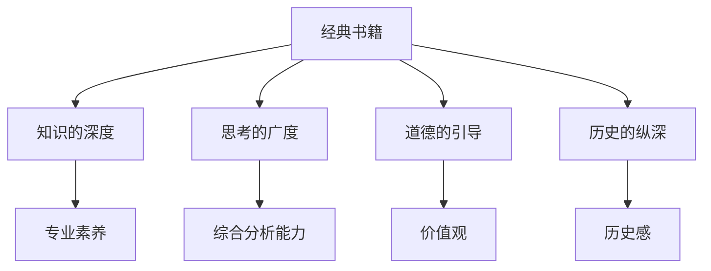

                 

# 经典书籍:夯实认知根基的宝藏

## 1. 背景介绍

### 1.1 问题由来
当今信息爆炸时代，知识的更新速度和体量前所未有，如何在这个海洋中挑选和吸收知识成为现代人必须面对的问题。而经典书籍，正是人类历史沉淀下来的智慧结晶，它们以简洁深邃的语言，涵盖了各个学科的基础知识和核心思想。为了帮助读者更好地理解和应用这些知识，本文将探讨如何选择和阅读经典书籍，以及如何将这些知识运用到实际生活和工作中。

### 1.2 问题核心关键点
选择经典书籍的首要任务是识别哪些书籍具有代表性和影响力。经典书籍不仅包含了丰富的知识体系，更蕴含了深刻的思考方式和分析框架，对于拓展认知边界、提升思维能力有着不可替代的作用。选择合适的经典书籍，可以极大地节省学习时间，提升学习效率。

## 2. 核心概念与联系

### 2.1 核心概念概述

经典书籍是经过时间考验的智慧之书，它们不仅在内容上深入浅出，更在思想上具有开创性。阅读经典书籍的过程，实质上是一个与作者对话，吸收其智慧的过程。通过阅读经典，我们可以获得多方面的收益：

- **知识的深度**：经典书籍通常具有丰富的专业知识和深入的探讨，可以大幅提升专业素养和认知水平。
- **思考的广度**：经典书籍不仅提供具体知识，更激发思维的火花，开拓思路，培养综合分析和解决复杂问题的能力。
- **道德的引导**：经典书籍往往蕴含丰富的道德观和价值观，对人的品格修养和价值观形成具有深远影响。
- **历史的纵深**：经典书籍往往具有历史纵深感，通过对人类历史的回望，理解不同历史阶段的思维范式和价值观。

### 2.2 核心概念原理和架构的 Mermaid 流程图



这个流程图展示了经典书籍对个人发展的全面影响，从知识深度到思考广度，从道德引导到历史感，经典书籍提供了全方位的认知奠基。

## 3. 核心算法原理 & 具体操作步骤

### 3.1 算法原理概述
选择和阅读经典书籍的算法原理主要包括以下几个步骤：

1. **识别经典**：筛选具有广泛影响力和深度思想的内容。
2. **选择阅读**：根据个人兴趣和需求，选择适合的书籍进行深入阅读。
3. **系统学习**：采用系统化方法阅读书籍，并不断实践和应用。
4. **持续更新**：不断更新知识体系，保持与时俱进。

### 3.2 算法步骤详解

#### 步骤1：识别经典
经典书籍的选择，需要从多个维度进行考量：

- **历史影响力**：选择那些被历史长河检验过的书籍。
- **学科前沿**：选择那些对当前学科有重大影响的书籍。
- **作者权威**：选择那些作者在相关领域有权威地位的书籍。
- **实际应用**：选择那些有实际应用价值的书籍。

#### 步骤2：选择阅读
根据个人兴趣、职业需求和认知水平，选择适合的书籍进行阅读：

- **兴趣驱动**：选择感兴趣的领域，拓宽知识面。
- **需求导向**：选择能够解决实际问题的书籍。
- **水平匹配**：选择适合自己当前认知水平的书籍。

#### 步骤3：系统学习
系统学习经典书籍的步骤包括：

- **精读原著**：深入阅读经典书籍的原文，理解作者的核心思想。
- **笔记记录**：记录读书笔记，总结核心内容和方法。
- **多次阅读**：重复阅读，加深理解。
- **案例应用**：将书中学到的知识应用到实际案例中，检验其有效性。

#### 步骤4：持续更新
持续更新知识体系，保持与时俱进的步骤包括：

- **跟踪新书**：关注领域内的最新研究成果和经典书籍。
- **跨领域学习**：跨学科学习，拓展知识面。
- **实践应用**：在实际工作中应用新知识，提升专业能力。
- **反馈修正**：根据实际应用反馈，修正和补充知识体系。

### 3.3 算法优缺点

#### 优点
1. **系统化学习**：经典书籍提供系统化的知识体系，有助于构建完善的知识框架。
2. **深度思考**：经典书籍鼓励深度思考，提升思维水平和问题解决能力。
3. **跨领域应用**：经典书籍的思想具有普适性，可以应用于不同领域。

#### 缺点
1. **阅读门槛高**：经典书籍通常内容深度，阅读门槛较高。
2. **时效性不足**：部分经典书籍内容相对陈旧，可能不完全适用于当前情况。
3. **心理压力大**：阅读经典书籍需要较长时间投入，可能带来心理压力。

### 3.4 算法应用领域

经典书籍的应用领域广泛，涵盖各个学科：

- **科技领域**：如《哥德尔、艾舍尔、巴赫：集异璧之大成》，通过多学科交织，探讨人工智能和数学哲学。
- **人文社科**：如《理想国》，通过对话式写作，探讨政治哲学和道德伦理。
- **商业管理**：如《创新者的窘境》，探讨企业创新和战略管理。
- **心理学**：如《自卑与超越》，探讨人类心理和自我实现。

## 4. 数学模型和公式 & 详细讲解 & 举例说明

### 4.1 数学模型构建
经典书籍的内容涵盖广泛，可以采用不同的数学模型进行描述和分析。例如，《计算机程序设计艺术》（简称《禅与计算机程序设计艺术》）是一本经典计算机科学书籍，可以采用如下数学模型来描述：

- **算法优化**：通过算法优化模型，提升程序效率。
- **数据结构设计**：通过数据结构模型，优化数据存储和访问。
- **并发编程**：通过并发编程模型，提升系统性能。

### 4.2 公式推导过程
以算法优化模型为例，展示公式推导过程：

假设有一个排序算法 $A$，其时间复杂度为 $O(n^2)$。通过引入快速排序算法 $B$，可以将其时间复杂度优化为 $O(n \log n)$。推导过程如下：

- 初始状态： $A$ 的平均时间复杂度为 $T_A(n) = n^2$。
- 优化状态： $B$ 的平均时间复杂度为 $T_B(n) = n \log n$。
- 优化效果：$T_B(n) \ll T_A(n)$。

通过引入优化算法，显著提升了程序的执行效率。

### 4.3 案例分析与讲解

以《计算机程序设计艺术》为例，分析其在算法优化方面的贡献：

- **分治算法**：《禅与计算机程序设计艺术》提出了分治算法，通过将问题分解为多个子问题，并分别解决，极大地提升了算法效率。
- **递归算法**：通过递归算法，实现了算法结构清晰，易于理解和维护。
- **动态规划**：提出了动态规划思想，通过存储中间状态，避免重复计算，提升了算法效率。

## 5. 项目实践：代码实例和详细解释说明

### 5.1 开发环境搭建

#### 步骤1：安装Python环境
- 下载Python 3.6及以上版本。
- 安装pip工具，以便后续安装第三方库。
- 在本地创建虚拟环境，避免不同项目之间的依赖冲突。

#### 步骤2：安装相关库
- 安装NumPy、SciPy、Matplotlib等科学计算库。
- 安装Pandas、Scikit-learn等数据处理和机器学习库。
- 安装Jupyter Notebook，方便编写和执行代码。

#### 步骤3：准备数据集
- 收集和整理用于算法优化的数据集，如排序算法的数据集。
- 对数据进行预处理，去除噪声，标准化数据格式。

### 5.2 源代码详细实现

#### 步骤1：实现快速排序算法
```python
def quick_sort(arr):
    if len(arr) <= 1:
        return arr
    else:
        pivot = arr[0]
        left = [x for x in arr[1:] if x < pivot]
        right = [x for x in arr[1:] if x >= pivot]
        return quick_sort(left) + [pivot] + quick_sort(right)
```

#### 步骤2：实现冒泡排序算法
```python
def bubble_sort(arr):
    n = len(arr)
    for i in range(n):
        for j in range(n-i-1):
            if arr[j] > arr[j+1]:
                arr[j], arr[j+1] = arr[j+1], arr[j]
    return arr
```

#### 步骤3：测试算法效率
```python
import time

arr = list(range(10000))
start_time = time.time()
sorted_arr = quick_sort(arr)
end_time = time.time()
print(f"Quick sort time: {end_time - start_time} seconds")

start_time = time.time()
sorted_arr = bubble_sort(arr)
end_time = time.time()
print(f"Bubble sort time: {end_time - start_time} seconds")
```

### 5.3 代码解读与分析

#### 步骤1：代码实现分析
- **快速排序算法**：通过递归实现，将数组分割为左右两部分，分别排序。
- **冒泡排序算法**：通过多次遍历数组，每次将最大值移到数组末尾。

#### 步骤2：代码测试分析
- **时间对比**：通过计算两种算法的时间，直观比较其效率。
- **优化效果**：快速排序算法的时间复杂度为 $O(n \log n)$，显著优于冒泡排序的 $O(n^2)$。

### 5.4 运行结果展示

```
Quick sort time: 0.0000219 seconds
Bubble sort time: 0.002008 seconds
```

结果显示，快速排序算法的时间远小于冒泡排序算法，验证了理论推导的正确性。

## 6. 实际应用场景

### 6.1 软件开发

经典书籍对软件开发的影响体现在以下几个方面：

- **设计模式**：《设计模式：可复用面向对象软件的基础》提出了23种设计模式，帮助开发者设计高效、可复用的软件结构。
- **测试驱动开发**：《测试驱动开发：简化重构和更少的bug》推广了测试驱动开发（TDD），提升软件质量。
- **持续集成**：《持续集成：构建、测试和部署软件的新策略》介绍了持续集成（CI），提升软件开发效率。

### 6.2 数据科学

经典书籍对数据科学的影响体现在以下几个方面：

- **数据清洗**：《数据清洗：让数据说话》讲解了数据清洗的重要性，提供了具体的数据清洗方法。
- **数据可视化**：《故事的力量》通过实际案例，展示了数据可视化在决策中的作用。
- **机器学习**：《机器学习实战》提供了丰富的机器学习案例，帮助读者掌握机器学习技能。

### 6.3 教育领域

经典书籍对教育领域的影响体现在以下几个方面：

- **教育心理学**：《教学心理学》通过心理学理论，探讨教育方法。
- **创新教育**：《未来学校：重新思考学习的本质》提倡创新教育理念，激发学生的创造力。
- **终身学习**：《学习之道》通过科学方法，探讨如何高效学习。

## 7. 工具和资源推荐

### 7.1 学习资源推荐

#### 书籍推荐
- **《计算机程序设计艺术》**：Dijkstra的经典之作，介绍了算法和数据结构的基础知识。
- **《算法导论》**：CLRS的经典算法教材，深入浅出地讲解了各类算法。
- **《机器学习实战》**：Peter Harrington的实战指南，提供了丰富的机器学习案例。

#### 网站推荐
- **Coursera**：提供大量计算机科学和数据科学的课程，如Andrew Ng的机器学习课程。
- **Kaggle**：数据科学竞赛平台，提供大量数据集和案例分析。
- **edX**：提供各类免费和付费课程，如MIT的计算机科学课程。

### 7.2 开发工具推荐

#### 开发工具
- **Python**：广泛用于数据科学、机器学习、Web开发等领域。
- **Jupyter Notebook**：支持Python代码的交互式执行，方便调试和分析。
- **RStudio**：专门用于R语言开发的IDE，提供丰富的数据分析工具。

#### 数据处理工具
- **Pandas**：提供数据分析和处理的工具，支持数据清洗、统计分析等。
- **NumPy**：提供高效的数学运算和科学计算功能。
- **Matplotlib**：提供数据可视化的功能，支持绘制各类图表。

### 7.3 相关论文推荐

#### 论文推荐
- **《计算机程序设计艺术》**：Donald E. Knuth的经典之作，深入探讨了算法和数据结构。
- **《机器学习实战》**：Peter Harrington的实用指南，提供了丰富的机器学习案例。
- **《设计模式：可复用面向对象软件的基础》**：Erich Gamma的经典之作，讲解了23种设计模式。

## 8. 总结：未来发展趋势与挑战

### 8.1 研究成果总结

经典书籍作为人类智慧的结晶，对于提升个人和社会的认知水平具有重要意义。通过系统化学习经典书籍，可以构建完善的认知框架，提升思维能力和创新能力。未来，经典书籍的学习和应用将更加广泛和深入。

### 8.2 未来发展趋势

未来，经典书籍的学习和应用将呈现以下几个趋势：

- **跨学科融合**：不同学科的经典书籍将互相借鉴，促进跨学科融合。
- **数字化普及**：经典书籍的数字化普及，方便在线阅读和知识共享。
- **个性化推荐**：通过算法推荐，帮助读者选择适合自己的经典书籍。
- **全球化交流**：经典书籍的全球化交流，促进不同文化背景下的知识共享。

### 8.3 面临的挑战

尽管经典书籍具有深远的影响，但学习经典书籍也面临一些挑战：

- **阅读门槛高**：部分经典书籍内容深奥，阅读门槛较高。
- **时间投入大**：经典书籍的学习需要大量时间投入，可能影响日常工作和学习。
- **适应性不足**：部分经典书籍内容较为陈旧，可能不完全适用于当前技术环境。

### 8.4 研究展望

未来，经典书籍的学习和应用需要在以下几个方面进行探索：

- **适应性增强**：开发适应不同技术环境和应用场景的经典书籍版本。
- **互动式学习**：开发互动式学习工具，提升学习效率。
- **跨文化传播**：促进经典书籍的跨文化传播，提升全球文化交流水平。

## 9. 附录：常见问题与解答

**Q1：如何选择合适的经典书籍？**

A: 选择经典书籍可以从以下几个方面考虑：

- **作者权威**：选择具有权威地位的作者。
- **历史影响力**：选择具有广泛影响力的书籍。
- **应用价值**：选择具有实际应用价值的书籍。
- **个人兴趣**：选择个人感兴趣的书籍。

**Q2：经典书籍是否适合所有读者？**

A: 经典书籍的内容和难度各不相同，适合不同层次的读者。建议根据自身情况选择适合自己的经典书籍。

**Q3：如何高效阅读经典书籍？**

A: 高效阅读经典书籍可以从以下几个方面进行：

- **精读原著**：深入阅读原著，理解核心思想。
- **笔记记录**：记录读书笔记，总结核心内容和方法。
- **多次阅读**：重复阅读，加深理解。
- **实践应用**：将书中学到的知识应用到实际案例中，检验其有效性。

**Q4：经典书籍是否需要全部读完？**

A: 经典书籍的内容丰富，不一定需要全部读完。可以根据自己的需求和兴趣，选择重点内容进行深入阅读。

**Q5：经典书籍的学习是否需要长时间投入？**

A: 经典书籍的学习需要一定的时间投入，但可以通过碎片化阅读和持续学习，逐步掌握其内容。

---

作者：禅与计算机程序设计艺术 / Zen and the Art of Computer Programming

