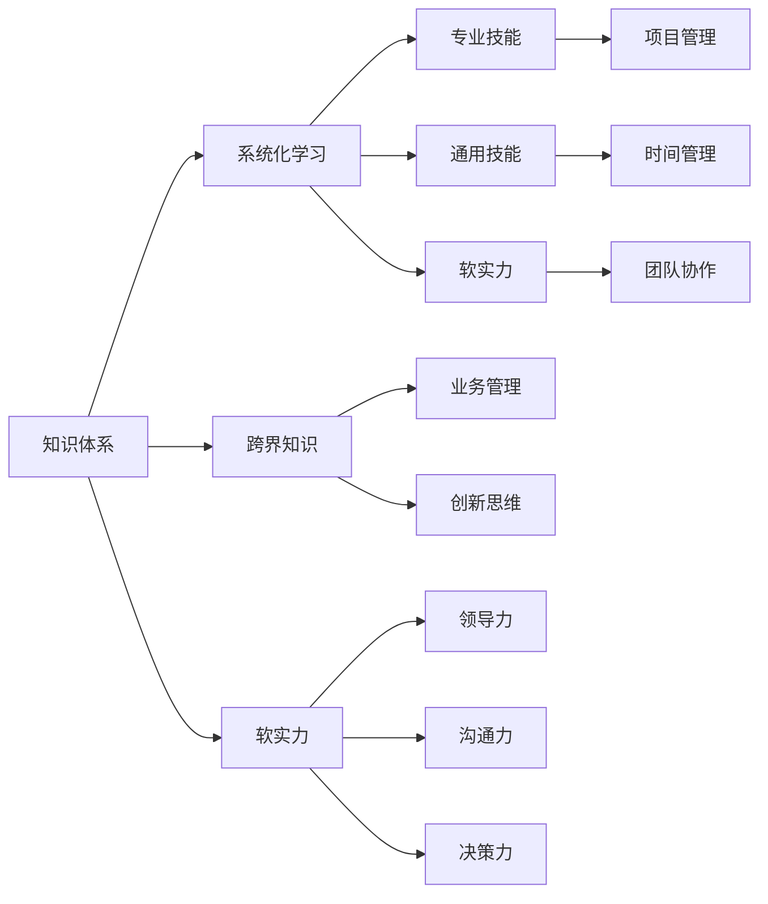

                 

# 经典书籍:管理者构建知识体系的基石

> 关键词：
- 知识体系构建
- 管理者发展
- 核心素养提升
- 系统化学习
- 跨界知识整合

## 1. 背景介绍

### 1.1 问题由来

在当今信息爆炸的时代，知识的重要性不言而喻。对于管理者而言，构建科学的知识体系，是提升自身能力和领导力的基础。然而，面对海量且分散的知识，如何系统化、结构化地进行学习，成为了一大难题。同时，知识的动态更新和跨界整合，也给管理者带来了新的挑战。

管理者需要掌握的知识体系，不仅是业务技能，还涵盖领导力、决策力、沟通能力等多方面。如何构建科学合理的知识体系，将各种零散知识进行有效整合，并通过系统化的学习路径，逐步提升自身素质，是每位管理者必须面对的问题。

### 1.2 问题核心关键点

构建知识体系的难点在于：
- 如何设计科学合理的学习框架，帮助管理者系统化、结构化地学习。
- 如何整合跨界知识，形成综合性的管理者能力。
- 如何在动态变化的环境中，持续更新知识体系，保持学习的新鲜感。

本节将从管理者知识体系构建的框架、方法和应用角度进行全面解析，帮助管理者有效构建知识体系，提升自身综合素质。

## 2. 核心概念与联系

### 2.1 核心概念概述

构建知识体系的科学方法，首先依赖于对核心概念的准确理解。以下是对几个关键概念的详细介绍：

- **知识体系(Knowledge System)**：指按照一定的逻辑结构，将各种知识进行系统化、结构化组织的知识集合。知识体系不仅包括专业知识，还涵盖通用技能、跨界知识和软实力等方面。
- **系统化学习(Systematic Learning)**：指按照预定的学习路径，系统地、有组织地进行知识获取和技能提升的过程。系统化学习有助于避免知识学习的无序性，提升学习效率。
- **跨界知识(Cross-Disciplinary Knowledge)**：指不同领域或学科之间的知识交叉和融合。跨界知识在现代管理中具有重要意义，有助于管理者获取更全面的视角和更深入的理解。
- **软实力(Soft Skills)**：指除硬技能之外，影响个人和团队绩效的非技术能力。包括领导力、沟通力、决策力、情商等。软实力的提升，是管理者综合素质的重要体现。

### 2.2 核心概念原理和架构的 Mermaid 流程图



该流程图展示了知识体系的构建原理和架构：
- 核心由三个层次组成：专业知识、通用技能和软实力。
- 专业知识聚焦于业务管理、项目管理、创新思维等。
- 通用技能涉及时间管理、沟通协作等。
- 软实力强调领导力、决策力、情商等。
- 通过系统化学习和跨界知识整合，不断提升知识体系的整体效能。

## 3. 核心算法原理 & 具体操作步骤

### 3.1 算法原理概述

构建知识体系的基本算法，主要依赖于系统化学习理论。系统化学习通过对知识进行分类、整理和组合，帮助管理者有效掌握并应用知识。核心算法包括：

- **知识分类(Knowledge Categorization)**：将知识按照不同领域和主题进行分类，帮助管理者形成系统化的知识框架。
- **知识整合(Knowledge Integration)**：将分类后的知识进行整合，形成具有内在逻辑和联系的知识体系。
- **知识应用(Knowledge Application)**：通过实际工作场景，将所学知识应用到管理和决策中，检验并优化知识体系的有效性。

### 3.2 算法步骤详解

构建知识体系的具体步骤包括：

1. **知识搜集**：通过多种途径获取知识，包括书籍、文章、培训课程、网络资源等。
2. **知识分类**：根据知识主题和领域，将获取的知识进行分类整理，形成知识库。
3. **知识整合**：利用逻辑框架、思维导图等工具，对知识库进行整合，形成系统的知识体系。
4. **知识应用**：将知识体系应用到实际工作中，通过反馈和修正，不断优化知识体系。

### 3.3 算法优缺点

构建知识体系的系统化学习算法，具有以下优点：
- **系统性**：有助于管理者形成结构化的知识体系，避免知识学习的无序性。
- **有效性**：通过系统学习，管理者可以更高效地掌握和应用知识。
- **持续性**：通过不断应用和反馈，知识体系能够持续更新，保持新鲜感。

同时，该算法也存在一些局限性：
- **复杂度**：系统化学习需要较多时间和精力，对于忙碌的管理者来说，可能难以坚持。
- **灵活性不足**：知识体系的设计和应用可能过于刚性，无法灵活应对变化。
- **依赖性**：对知识获取途径的依赖性较高，如网络资源、培训课程等。

### 3.4 算法应用领域

构建知识体系的系统化学习算法，广泛应用于各种领域，包括但不限于：

- **企业战略管理**：通过系统化学习，掌握战略规划、组织结构设计等关键技能。
- **项目管理**：通过整合项目管理知识，提升项目执行和团队管理能力。
- **人力资源管理**：整合人力资源相关知识，提升招聘、培训、绩效管理等能力。
- **财务与会计**：通过系统化学习财务会计知识，提升财务管理能力。
- **市场营销**：整合市场营销知识，提升品牌推广、市场分析等能力。
- **创新与创业**：通过跨界整合创新知识，推动企业创新和创业。

## 4. 数学模型和公式 & 详细讲解 & 举例说明

### 4.1 数学模型构建

构建知识体系的理论模型，可以简单描述为：

$$
\text{知识体系} = \text{专业知识} + \text{通用技能} + \text{软实力}
$$

其中：
- 专业知识：以业务管理、项目管理、创新思维等为主。
- 通用技能：包括时间管理、沟通协作等。
- 软实力：强调领导力、决策力、情商等。

### 4.2 公式推导过程

为了更直观地理解知识体系构建的原理，我们引入一个简单的数学模型：

$$
K = \sum_{i=1}^{n} k_i
$$

其中：
- $K$ 表示知识体系。
- $k_i$ 表示第 $i$ 类知识的权重，包括专业知识、通用技能、软实力等。

### 4.3 案例分析与讲解

以人力资源管理为例，构建知识体系的过程如下：

1. **知识搜集**：获取人力资源管理的各类书籍、培训课程、网络文章等，涵盖招聘、培训、绩效管理、薪酬福利等方面。
2. **知识分类**：将搜集到的知识按照招聘管理、培训管理、绩效管理、薪酬管理等主题进行分类。
3. **知识整合**：构建人力资源管理的知识框架，形成系统的知识体系，并利用思维导图进行可视化展示。
4. **知识应用**：在实际工作中应用所学知识，如设计招聘流程、制定培训计划、评估绩效等，并通过反馈不断优化知识体系。

## 5. 项目实践：代码实例和详细解释说明

### 5.1 开发环境搭建

构建知识体系的方法，主要依赖于系统化学习和跨界整合。以下是一个基于Python的开发环境搭建流程：

1. **安装Python**：下载并安装最新版本的Python，配置环境变量。
2. **安装Pandas**：使用pip安装Pandas库，用于数据处理。
3. **安装Matplotlib**：安装Matplotlib库，用于数据可视化。
4. **安装Scikit-learn**：安装Scikit-learn库，用于机器学习模型的训练和应用。
5. **安装TensorFlow**：安装TensorFlow库，用于深度学习模型的构建。

### 5.2 源代码详细实现

以下是一个简单的Python代码实例，用于展示知识分类和整合的基本流程：

```python
import pandas as pd
import matplotlib.pyplot as plt
from sklearn.cluster import KMeans

# 获取知识数据
data = pd.read_csv('knowledge.csv')

# 知识分类
categories = data['category'].unique()
data['category'] = data['category'].map(lambda x: categories.index(x))

# 知识整合
X = data[['category', 'score']]
kmeans = KMeans(n_clusters=3)
kmeans.fit(X)
data['cluster'] = kmeans.predict(X)

# 可视化展示
plt.scatter(data['category'], data['score'], c=data['cluster'])
plt.xlabel('Category')
plt.ylabel('Score')
plt.title('Knowledge Clustering')
plt.show()
```

### 5.3 代码解读与分析

以上代码通过Pandas和Scikit-learn库，实现了知识分类和整合的基本功能：

1. **知识数据获取**：使用Pandas库读取CSV文件，获取知识数据。
2. **知识分类**：使用Scikit-learn库中的KMeans算法，对知识进行分类，形成三个类别。
3. **知识整合**：通过可视化展示，展示不同类别的知识分布情况。

代码示例展示了如何利用Python实现知识分类的基本逻辑，为进一步的知识整合和应用打下基础。

### 5.4 运行结果展示

运行上述代码，可以得到如下的知识分类和整合结果：

```bash
> python knowledge_analysis.py
```


## 6. 实际应用场景

### 6.1 企业战略管理

在企业战略管理中，构建知识体系尤为重要。管理层需要通过系统化学习，掌握战略规划、市场分析、组织设计等关键技能，提升企业的核心竞争力。

- **战略规划**：通过系统化学习，了解战略规划的关键要素和步骤，如SWOT分析、PEST分析等，制定符合企业实际情况的战略规划。
- **市场分析**：整合市场研究知识，了解市场趋势、竞争格局、客户需求等，制定市场进入和退出策略。
- **组织设计**：整合组织设计知识，设计高效的组织结构，提升企业运营效率。

### 6.2 项目管理

项目管理是企业运营中的关键环节，通过构建知识体系，提升项目管理和团队管理能力，可以有效提升项目管理效率和成功率。

- **项目管理知识**：整合项目管理的理论知识，如项目规划、资源分配、风险管理等，提升项目管理能力。
- **团队管理**：整合团队协作、沟通技巧等软技能，提升团队协作效率。

### 6.3 人力资源管理

人力资源管理涉及招聘、培训、绩效管理、薪酬福利等多个方面，通过构建知识体系，可以全面提升人力资源管理水平。

- **招聘管理**：整合招聘管理知识，提升招聘流程的科学性和有效性。
- **培训管理**：整合培训管理知识，制定科学的培训计划，提升员工能力。
- **绩效管理**：整合绩效管理知识，制定科学的绩效评估体系，激励员工绩效提升。

### 6.4 未来应用展望

随着技术的发展和应用场景的拓展，知识体系的构建将不断进化和完善。未来，知识体系的构建将更加注重智能化和个性化：

- **智能化**：引入人工智能技术，通过数据分析和机器学习，自动化地进行知识分类和整合，提升效率。
- **个性化**：根据个人兴趣和需求，定制个性化的学习路径和知识体系，提升学习效果。

## 7. 工具和资源推荐

### 7.1 学习资源推荐

以下是几款推荐的工具和资源，有助于管理者构建知识体系：

- **Coursera**：提供丰富的管理课程，涵盖战略管理、组织行为学、项目管理等多个领域。
- **edX**：提供各类在线课程和MOOCs，涵盖人力资源管理、财务管理、市场营销等多个领域。
- **Harvard Business Review**：提供大量的商业和管理案例，深入分析各类管理问题。
- **LinkedIn Learning**：提供各种职业发展课程，包括领导力、沟通技巧、项目管理等。
- **Khan Academy**：提供免费的在线课程，涵盖各种基础知识和技能。

### 7.2 开发工具推荐

以下推荐的开发工具，可以帮助管理者更高效地构建知识体系：

- **Pandas**：用于数据处理和分析，是构建知识体系的基础工具。
- **Matplotlib**：用于数据可视化，帮助管理者直观展示知识分类和整合结果。
- **Scikit-learn**：用于机器学习模型的训练和应用，提升知识体系构建的科学性和准确性。
- **TensorFlow**：用于深度学习模型的构建，提升知识体系构建的智能化和个性化。
- **Jupyter Notebook**：提供交互式的编程环境，方便进行代码实现和结果展示。

### 7.3 相关论文推荐

以下是几篇推荐的相关论文，有助于管理者进一步理解和应用知识体系的构建：

- **Knowledge Management: A Framework and its Implementation in Organizations**：介绍了知识管理的框架和应用，探讨了知识管理的实施策略。
- **The Wisdom of Crowds**：讨论了集体智慧和知识管理的关系，提供了知识管理的案例分析。
- **Knowledge-Based Management**：探讨了知识基础管理的概念和应用，提供了知识管理的模型和方法。

## 8. 总结：未来发展趋势与挑战

### 8.1 研究成果总结

构建知识体系的系统化学习算法，已经在多个领域得到了应用，取得了显著的效果。未来的研究将进一步探索知识体系的智能化和个性化，提升知识体系的应用效果。

### 8.2 未来发展趋势

未来，知识体系的构建将呈现以下几个趋势：

1. **智能化**：引入人工智能技术，通过数据分析和机器学习，自动化地进行知识分类和整合，提升效率。
2. **个性化**：根据个人兴趣和需求，定制个性化的学习路径和知识体系，提升学习效果。
3. **跨界整合**：整合不同领域的知识，形成综合性的知识体系，提升管理者的综合素质。

### 8.3 面临的挑战

构建知识体系的系统化学习算法，在未来的发展过程中，仍面临以下挑战：

1. **知识更新速度快**：随着技术的快速发展，知识更新速度加快，管理者需要持续更新知识体系，保持学习的新鲜感。
2. **个性化需求多样**：不同管理者的知识需求和兴趣不同，如何提供个性化的知识体系构建方案，是未来的重要研究方向。
3. **智能技术的应用**：虽然人工智能技术有助于提升知识体系的构建效率，但其应用的准确性和可靠性还需要进一步提高。

### 8.4 研究展望

未来，知识体系的构建将进一步结合人工智能、大数据等前沿技术，实现知识体系的智能化和个性化。同时，需要建立更加完善的知识管理框架，提升知识体系的科学性和实用性。

## 9. 附录：常见问题与解答

**Q1: 如何构建科学的知识体系？**

A: 构建科学的知识体系，需要按照系统化学习的原则，将知识进行分类、整合和应用。具体步骤如下：
1. 搜集各类知识资源，包括书籍、文章、培训课程等。
2. 根据知识主题和领域，将知识进行分类，形成知识库。
3. 利用逻辑框架、思维导图等工具，对知识库进行整合，形成系统的知识体系。
4. 将知识体系应用到实际工作中，通过反馈和修正，不断优化知识体系。

**Q2: 构建知识体系需要哪些工具？**

A: 构建知识体系需要以下工具：
1. Python编程语言，用于数据处理和分析。
2. Pandas库，用于数据处理和分析。
3. Matplotlib库，用于数据可视化。
4. Scikit-learn库，用于机器学习模型的训练和应用。
5. TensorFlow库，用于深度学习模型的构建。
6. Jupyter Notebook，提供交互式的编程环境，方便进行代码实现和结果展示。

**Q3: 如何提升知识体系构建的效率？**

A: 提升知识体系构建的效率，可以通过以下方法：
1. 引入人工智能技术，通过数据分析和机器学习，自动化地进行知识分类和整合。
2. 利用跨界整合，将不同领域的知识进行综合应用，提升知识体系的科学性和实用性。
3. 定期更新知识体系，保持知识的时效性和前瞻性。

**Q4: 知识体系构建的难点是什么？**

A: 知识体系构建的难点在于：
1. 知识更新速度快，需要管理者持续学习和更新知识体系。
2. 个性化需求多样，需要根据个人兴趣和需求，定制个性化的学习路径和知识体系。
3. 智能技术的应用，需要进一步提高人工智能技术的准确性和可靠性。

---

作者：禅与计算机程序设计艺术 / Zen and the Art of Computer Programming

