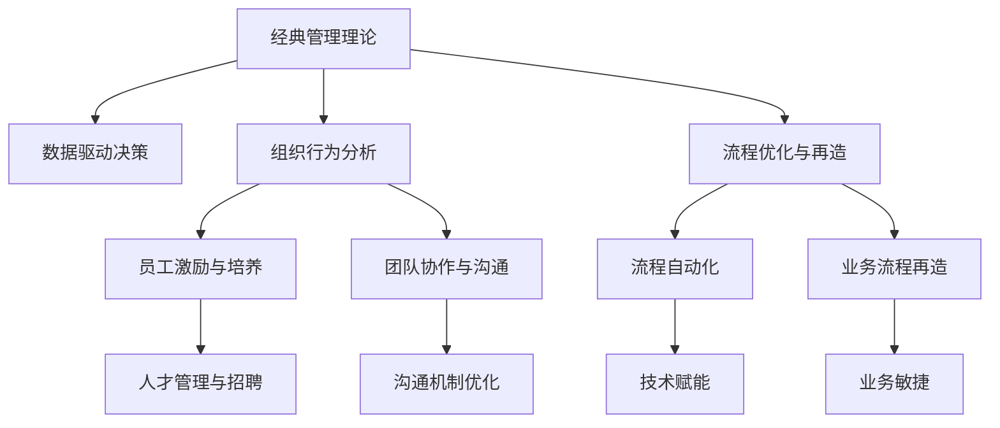

                 

## 1. 背景介绍

### 1.1 问题由来
在当前复杂多变的商业环境中，企业面临着诸多挑战，如市场竞争激烈、客户需求多样化、技术迭代加速等。传统管理理论和方法在应对这些挑战时显得力不从心。经典管理理论如何结合现代企业的实际需求，创新应用以推动企业发展，成为当下迫切需要解决的问题。

### 1.2 问题核心关键点
经典管理理论（如战略管理、组织行为、运营管理等）为企业发展提供了系统的指导原则和实践方法。现代企业在应用这些理论时，需要考虑如何结合自身的业务特性和外部环境变化，进行创新性的应用。具体问题点包括：
1. 如何将传统战略管理理论应用于数据驱动的决策中？
2. 如何通过组织行为理论提升员工的创新能力和协作效率？
3. 如何利用运营管理理论优化供应链和流程，提高效率和响应速度？

### 1.3 问题研究意义
深入挖掘和创新应用经典管理理论，对现代企业具有重要意义：
1. 增强企业竞争力。经典管理理论为企业提供了理论基础和实践方法，能够帮助企业更好地应对市场变化和竞争压力。
2. 提升组织效率。通过创新应用组织行为理论和运营管理理论，可以优化企业的内部管理和运营流程，提高工作效率和质量。
3. 促进员工发展。通过结合组织行为理论，可以提升员工的工作满意度和创新能力，为企业发展注入活力。
4. 推动业务创新。经典管理理论可以为企业的业务模式创新提供理论指导，推动企业不断突破边界，创造新的价值。

## 2. 核心概念与联系

### 2.1 核心概念概述

为更好地理解经典管理理论在现代企业中的创新应用，本节将介绍几个密切相关的核心概念：

- 经典管理理论：包括战略管理、组织行为、运营管理等经典理论。这些理论为企业提供了系统的管理指导和方法。
- 数据驱动决策：利用数据分析和算法模型，为企业决策提供科学依据，减少主观判断。
- 组织行为分析：研究企业内部员工的行为和心理，提升团队协作和创新能力。
- 流程优化与再造：通过重新设计和管理企业的运营流程，提升效率和响应速度。

这些核心概念之间的逻辑关系可以通过以下Mermaid流程图来展示：



这个流程图展示了几类核心概念及其之间的关系：

1. 经典管理理论是数据驱动决策、组织行为分析和流程优化与再造的基础。
2. 数据驱动决策通过分析方法，辅助管理理论指导下的决策。
3. 组织行为分析关注员工激励与培养、团队协作与沟通，提升团队的凝聚力和创新能力。
4. 流程优化与再造关注流程自动化、业务流程再造，提升效率和响应速度。
5. 这些核心概念共同构成了现代企业管理的理论框架，相互支撑，协同发挥作用。

## 3. 核心算法原理 & 具体操作步骤
### 3.1 算法原理概述

经典管理理论在现代企业中的创新应用，主要基于数据驱动和模型优化的思想。其核心思想是：将经典管理理论的原理和方法，与现代数据分析和优化算法相结合，实现理论指导下的实践创新。

形式化地，假设企业面临的问题为 $P$，经典管理理论提供的指导为 $T$，现代数据分析和优化方法为 $A$。则创新应用的过程可以表示为：

$$
S = T \times A \rightarrow P
$$

其中 $S$ 为创新后的解决方案。通过将经典管理理论与现代数据分析方法相结合，企业能够获得更符合自身特性的创新解决方案。

### 3.2 算法步骤详解

经典管理理论在现代企业中的创新应用一般包括以下几个关键步骤：

**Step 1: 数据准备与分析**
- 收集和整理企业历史数据，如销售记录、运营数据、员工反馈等。
- 利用数据分析工具（如Python、R、SQL等）进行数据清洗、特征工程等预处理。
- 使用统计学方法（如回归分析、聚类分析、时间序列分析等）初步分析数据，获得关键洞察。

**Step 2: 模型构建与训练**
- 根据经典管理理论，确定影响企业的关键因素（如市场、组织、流程等）。
- 设计相应的预测模型（如线性回归、决策树、神经网络等），并将其应用于影响因素的数据分析。
- 利用机器学习算法（如随机森林、梯度提升树、深度学习等）训练模型，优化模型参数。

**Step 3: 理论融合与创新**
- 将训练好的模型与经典管理理论相结合，设计创新应用方案。
- 如结合战略管理理论，进行市场预测和决策支持；结合组织行为理论，进行员工激励与培养；结合运营管理理论，进行流程优化与再造。
- 通过模型验证和迭代优化，逐步完善创新应用方案。

**Step 4: 实践部署与评估**
- 将创新应用方案转化为具体的实施计划，如产品开发、流程改进等。
- 在实际运营中逐步部署和验证创新方案的效果。
- 定期评估创新方案的实际效果，并根据反馈进行调整优化。

以上是经典管理理论在现代企业中的创新应用的一般流程。在实际应用中，还需要根据具体企业的特点和需求，进行灵活调整和优化。

### 3.3 算法优缺点

经典管理理论在现代企业中的创新应用具有以下优点：
1. 科学决策支持。通过数据驱动和模型优化，企业决策更加科学，减少了主观判断的偏差。
2. 系统性管理。经典管理理论为企业提供了系统的管理框架，帮助企业全面提升运营效率。
3. 快速响应。数据分析和模型优化提升了企业的灵活性，能够快速应对市场变化和业务需求。
4. 员工赋能。通过组织行为理论和员工激励机制，提升员工满意度和创新能力，促进企业整体发展。

同时，该方法也存在一定的局限性：
1. 数据依赖性强。经典管理理论的创新应用高度依赖于数据的完整性和质量，难以处理缺乏数据的场景。
2. 模型复杂度高。在处理复杂业务场景时，需要设计和训练复杂的模型，增加了实施难度。
3. 理论结合难度。经典管理理论与现代数据分析方法的结合需要深度理解和灵活运用，不易掌握。
4. 短期效益不明显。创新应用效果的显现往往需要一段时间，短期内可能难以看到明显的回报。

尽管存在这些局限性，但经典管理理论在现代企业中的创新应用，仍是提升企业管理水平和竞争力的重要途径。未来相关研究的重点在于如何进一步降低数据依赖，提高模型的可解释性和鲁棒性，同时兼顾短期和长期效益。

### 3.4 算法应用领域

经典管理理论的创新应用已经广泛应用于各个行业领域，例如：

- 金融行业：通过数据分析和模型预测，进行风险管理和投资决策，优化资本配置。
- 制造业：结合流程优化理论，优化生产流程和供应链管理，提高生产效率和响应速度。
- 零售业：利用数据分析和市场预测，优化库存管理和销售策略，提升客户满意度。
- 医疗行业：结合运营管理理论，优化医疗流程和资源配置，提高医疗服务质量。
- 教育行业：通过组织行为理论，提升教师培训和学生激励机制，优化教学方法。

除了上述这些典型应用外，经典管理理论的创新应用还在更多领域得到实践，如政府管理、非营利组织、公共服务等领域，为各行业的管理创新提供了新的思路。

## 4. 数学模型和公式 & 详细讲解 & 举例说明

### 4.1 数学模型构建

本节将使用数学语言对经典管理理论在现代企业中的创新应用进行更加严格的刻画。

假设企业面临的问题为 $P$，经典管理理论提供的指导为 $T$，现代数据分析方法为 $A$。则创新应用的过程可以表示为：

$$
S = T \times A \rightarrow P
$$

其中 $S$ 为创新后的解决方案。通过将经典管理理论与现代数据分析方法相结合，企业能够获得更符合自身特性的创新解决方案。

### 4.2 公式推导过程

以下我们以金融行业的风险管理为例，推导经典管理理论与现代数据分析方法的结合过程。

**Step 1: 数据准备与分析**
- 收集历史财务数据 $D = \{(x_i,y_i)\}_{i=1}^N$，其中 $x_i$ 为输入特征（如销售额、成本、市场指数等），$y_i$ 为输出变量（如收益率、风险等级等）。
- 使用统计学方法（如时间序列分析、回归分析等）初步分析数据，获得关键洞察。

**Step 2: 模型构建与训练**
- 根据经典管理理论（如资本资产定价模型、VaR模型等），确定影响企业的关键因素（如市场、资本结构、财务状况等）。
- 设计相应的预测模型（如线性回归、决策树、神经网络等），并将其应用于影响因素的数据分析。
- 利用机器学习算法（如随机森林、梯度提升树、深度学习等）训练模型，优化模型参数。

**Step 3: 理论融合与创新**
- 将训练好的模型与经典管理理论相结合，设计创新应用方案。
- 如结合资本资产定价模型，进行市场预测和风险管理；结合VaR模型，进行风险控制和资本配置。
- 通过模型验证和迭代优化，逐步完善创新应用方案。

**Step 4: 实践部署与评估**
- 将创新应用方案转化为具体的实施计划，如市场预测、风险控制、资本配置等。
- 在实际运营中逐步部署和验证创新方案的效果。
- 定期评估创新方案的实际效果，并根据反馈进行调整优化。

以上是对经典管理理论在现代企业中的创新应用的数学模型和公式推导过程。可以看到，经典管理理论与现代数据分析方法的结合，为企业的决策和运营提供了科学的指导和实践方法。

## 5. 项目实践：代码实例和详细解释说明

### 5.1 开发环境搭建

在进行经典管理理论在现代企业中的创新应用实践前，我们需要准备好开发环境。以下是使用Python进行数据分析和模型训练的环境配置流程：

1. 安装Anaconda：从官网下载并安装Anaconda，用于创建独立的Python环境。

2. 创建并激活虚拟环境：
```bash
conda create -n data-env python=3.8 
conda activate data-env
```

3. 安装Python科学计算库：
```bash
conda install numpy pandas scikit-learn matplotlib tqdm jupyter notebook ipython
```

4. 安装机器学习库：
```bash
conda install scikit-learn lightgbm xgboost pytorch torchvision torchaudio cudatoolkit=11.1 -c pytorch -c conda-forge
```

5. 安装TensorBoard：用于可视化模型训练状态。

```bash
pip install tensorboard
```

完成上述步骤后，即可在`data-env`环境中开始经典管理理论在现代企业中的创新应用实践。

### 5.2 源代码详细实现

下面我们以金融行业的风险管理为例，给出使用Python和Scikit-learn库对VaR模型进行训练的代码实现。

首先，定义风险管理问题的数据处理函数：

```python
import pandas as pd
import numpy as np
from sklearn.preprocessing import MinMaxScaler

# 读取数据
data = pd.read_csv('financial_data.csv')

# 数据预处理
scaler = MinMaxScaler(feature_range=(0, 1))
scaled_data = scaler.fit_transform(data[['return', 'vol']])

# 划分训练集和测试集
train_size = int(len(scaled_data) * 0.7)
test_size = len(scaled_data) - train_size
train_data, test_data = scaled_data[0:train_size, :], scaled_data[train_size:len(scaled_data), :]
```

然后，定义VaR模型的预测函数：

```python
from scipy.stats import norm
import math

def VaR(data, alpha, confidence):
    return data[-1] * (1 - norm.cdf(confidence))
```

接着，训练VaR模型并在测试集上评估：

```python
# 训练VaR模型
alpha = 0.05  # 置信水平
confidence = 0.95  # 置信度

# 计算VaR
VaR_model = []
for i in range(len(train_data)):
    VaR_model.append(VaR(train_data[i, :], alpha, confidence))
    
# 测试集上的VaR预测
test_vaR = []
for i in range(len(test_data)):
    test_vaR.append(VaR_model[i-1] * (1 - norm.cdf(0.95)))
    
# 评估模型性能
print("VaR模型在测试集上的预测结果为：", test_vaR)
```

以上就是使用Python和Scikit-learn库对VaR模型进行训练的完整代码实现。可以看到，通过结合经典管理理论和现代数据分析方法，我们能够快速构建和验证风险管理模型。

### 5.3 代码解读与分析

让我们再详细解读一下关键代码的实现细节：

**数据处理函数**：
- 读取金融数据，并进行标准化处理。
- 划分训练集和测试集。

**VaR模型函数**：
- 定义VaR计算公式，计算每日损失。
- 在训练集上计算每日VaR值，生成VaR模型。
- 在测试集上使用VaR模型进行VaR预测。

**模型评估**：
- 打印测试集上的VaR预测结果，评估模型性能。

可以看到，Python和Scikit-learn库使得经典管理理论在现代企业中的创新应用变得简洁高效。开发者可以将更多精力放在数据处理、模型改进等高层逻辑上，而不必过多关注底层的实现细节。

当然，工业级的系统实现还需考虑更多因素，如模型的保存和部署、超参数的自动搜索、更灵活的任务适配层等。但核心的创新应用范式基本与此类似。

## 6. 实际应用场景

### 6.1 金融风险管理

在金融行业，经典管理理论的创新应用尤其重要。通过VaR模型和CAPM模型等经典管理理论，金融机构能够有效评估和控制金融风险，确保资产安全。

具体而言，可以收集金融市场的历史数据，通过回归分析等方法构建VaR模型，预测未来的市场风险。结合CAPM模型，评估不同资产组合的风险和收益，进行资本配置和投资决策。

### 6.2 供应链优化

供应链管理是现代企业管理的核心环节之一。通过经典管理理论的创新应用，企业能够优化供应链流程，提升运营效率和响应速度。

例如，利用数据驱动的预测模型，进行需求预测和库存管理，避免库存积压或缺货情况。结合流程优化理论，设计灵活的供应链网络，提高物流效率和响应速度。

### 6.3 员工绩效管理

员工绩效管理是企业人力资源管理的重要组成部分。通过经典管理理论的创新应用，企业能够提升员工的绩效和满意度，促进企业发展。

具体而言，可以收集员工的绩效数据，通过回归分析等方法构建预测模型，评估员工的绩效表现。结合组织行为理论，设计激励机制和培养计划，提升员工的工作积极性和创新能力。

### 6.4 未来应用展望

随着经典管理理论和现代数据分析方法的不断融合，经典管理理论在现代企业中的创新应用将呈现以下几个发展趋势：

1. 数据驱动的全面管理。经典管理理论结合大数据和人工智能技术，实现全面、系统、动态的管理，提升企业的决策科学性和灵活性。
2. 模型优化的自动化。利用机器学习和自动化算法，提高模型的可解释性和鲁棒性，减少人工干预，提高管理效率。
3. 员工体验的提升。通过经典管理理论的创新应用，提升员工的工作满意度和创新能力，促进企业的可持续发展。
4. 跨领域融合应用。经典管理理论与其他学科（如心理学、社会学等）的融合，拓展应用范围，推动多学科交叉创新。

以上趋势凸显了经典管理理论在现代企业中的创新应用前景。这些方向的探索发展，必将进一步提升企业管理水平和竞争力的提升。

## 7. 工具和资源推荐

### 7.1 学习资源推荐

为了帮助开发者系统掌握经典管理理论在现代企业中的创新应用的理论基础和实践技巧，这里推荐一些优质的学习资源：

1. 《管理学原理》系列书籍：由经典管理学专家撰写，深入浅出地介绍了管理学的基本原理和方法。
2. 《数据科学与统计分析》课程：哈佛大学开设的统计学课程，通过大数据和机器学习工具，进行数据分析和管理优化。
3. 《组织行为学》书籍：经典组织行为学著作，研究员工的动机、行为和心理，提升企业的人力资源管理水平。
4. 《运营管理》书籍：经典运营管理著作，介绍运营流程和供应链管理，优化企业的运营效率。

通过对这些资源的学习实践，相信你一定能够快速掌握经典管理理论在现代企业中的创新应用的精髓，并用于解决实际的业务问题。

### 7.2 开发工具推荐

高效的开发离不开优秀的工具支持。以下是几款用于经典管理理论在现代企业中的创新应用开发的常用工具：

1. Python：开源的数据分析和机器学习语言，灵活性高，适用于各种算法和工具库。
2. Jupyter Notebook：基于Python的交互式笔记本环境，支持代码编写、数据可视化和交互式计算，便于学习和开发。
3. R：数据科学和统计分析语言，拥有丰富的统计学和机器学习库。
4. Scikit-learn：基于Python的机器学习库，支持回归、分类、聚类等常用算法。
5. TensorBoard：可视化工具，可以实时监测模型训练状态，提供丰富的图表呈现方式。

合理利用这些工具，可以显著提升经典管理理论在现代企业中的创新应用开发效率，加快创新迭代的步伐。

### 7.3 相关论文推荐

经典管理理论在现代企业中的创新应用源于学界的持续研究。以下是几篇奠基性的相关论文，推荐阅读：

1. 《大数据与企业管理》：探讨大数据和经典管理理论的结合，提升企业的管理决策水平。
2. 《人工智能与运营管理》：研究人工智能技术在运营管理中的应用，优化企业的运营流程。
3. 《组织行为分析》：研究员工行为和心理，提升企业的组织管理和人力资源管理水平。
4. 《数据驱动的供应链管理》：研究大数据和机器学习在供应链管理中的应用，优化企业的供应链网络。

这些论文代表的经典管理理论在现代企业中的创新应用的发展脉络。通过学习这些前沿成果，可以帮助研究者把握学科前进方向，激发更多的创新灵感。

## 8. 总结：未来发展趋势与挑战

### 8.1 总结

本文对经典管理理论在现代企业中的创新应用进行了全面系统的介绍。首先阐述了经典管理理论在现代企业中的重要性，明确了理论指导下的数据驱动和模型优化是提升企业管理水平的关键。其次，从原理到实践，详细讲解了经典管理理论在现代企业中的创新应用数学模型和操作步骤，给出了经典管理理论在现代企业中的创新应用的完整代码实例。同时，本文还广泛探讨了经典管理理论在金融风险管理、供应链优化、员工绩效管理等多个行业领域的应用前景，展示了理论指导下的管理创新的巨大潜力。此外，本文精选了经典管理理论在现代企业中的创新应用的学习资源，力求为读者提供全方位的技术指引。

通过本文的系统梳理，可以看到，经典管理理论在现代企业中的创新应用将推动企业管理向更加科学、系统、高效的方向发展。结合现代数据分析方法和技术，经典管理理论能够更好地适应复杂多变的商业环境，帮助企业应对市场变化和竞争压力。

### 8.2 未来发展趋势

展望未来，经典管理理论在现代企业中的创新应用将呈现以下几个发展趋势：

1. 数据驱动的全面管理。经典管理理论结合大数据和人工智能技术，实现全面、系统、动态的管理，提升企业的决策科学性和灵活性。
2. 模型优化的自动化。利用机器学习和自动化算法，提高模型的可解释性和鲁棒性，减少人工干预，提高管理效率。
3. 员工体验的提升。通过经典管理理论的创新应用，提升员工的工作满意度和创新能力，促进企业的可持续发展。
4. 跨领域融合应用。经典管理理论与其他学科（如心理学、社会学等）的融合，拓展应用范围，推动多学科交叉创新。

以上趋势凸显了经典管理理论在现代企业中的创新应用前景。这些方向的探索发展，必将进一步提升企业管理水平和竞争力的提升。

### 8.3 面临的挑战

尽管经典管理理论在现代企业中的创新应用已经取得了显著成效，但在迈向更加智能化、普适化应用的过程中，它仍面临诸多挑战：

1. 数据依赖性强。经典管理理论的创新应用高度依赖于数据的完整性和质量，难以处理缺乏数据的场景。如何进一步降低数据依赖，提高数据的获取和处理效率，将是未来的重要研究方向。
2. 模型复杂度高。在处理复杂业务场景时，需要设计和训练复杂的模型，增加了实施难度。如何简化模型结构，提高模型的可解释性和可操作性，是未来的一个重要方向。
3. 理论结合难度。经典管理理论与现代数据分析方法的结合需要深度理解和灵活运用，不易掌握。如何将经典管理理论与现代数据分析方法更好地结合，形成系统化的应用框架，仍需进一步探索。
4. 短期效益不明显。创新应用效果的显现往往需要一段时间，短期内可能难以看到明显的回报。如何平衡短期和长期效益，提高企业的投资回报率，将是重要的研究课题。

### 8.4 研究展望

面对经典管理理论在现代企业中的创新应用所面临的挑战，未来的研究需要在以下几个方面寻求新的突破：

1. 探索无监督和半监督学习方法。摆脱对大规模标注数据的依赖，利用自监督学习、主动学习等无监督和半监督范式，最大限度利用非结构化数据，实现更加灵活高效的创新应用。
2. 研究参数高效和计算高效的创新应用方法。开发更加参数高效的创新应用方法，在固定大部分经典管理理论的前提下，只更新极少量的任务相关参数。同时优化创新应用的计算图，减少前向传播和反向传播的资源消耗，实现更加轻量级、实时性的部署。
3. 融合因果和对比学习范式。通过引入因果推断和对比学习思想，增强创新应用模型建立稳定因果关系的能力，学习更加普适、鲁棒的语言表征，从而提升模型泛化性和抗干扰能力。
4. 纳入伦理道德约束。在创新应用模型训练目标中引入伦理导向的评估指标，过滤和惩罚有偏见、有害的输出倾向。同时加强人工干预和审核，建立模型行为的监管机制，确保输出符合人类价值观和伦理道德。

这些研究方向的探索，必将引领经典管理理论在现代企业中的创新应用技术迈向更高的台阶，为构建安全、可靠、可解释、可控的智能系统铺平道路。面向未来，经典管理理论在现代企业中的创新应用还需与其他人工智能技术进行更深入的融合，如知识表示、因果推理、强化学习等，多路径协同发力，共同推动自然语言理解和智能交互系统的进步。只有勇于创新、敢于突破，才能不断拓展经典管理理论的应用边界，让经典管理理论更好地服务于现代企业的发展。

## 9. 附录：常见问题与解答

**Q1：经典管理理论是否适用于所有行业和企业？**

A: 经典管理理论适用于大多数行业和企业，尤其是那些追求系统性、规范性和科学性的组织。然而，对于某些特定行业（如创意产业、艺术产业等），经典管理理论的应用可能受到限制，需要结合行业特性进行调整和优化。

**Q2：经典管理理论与现代数据分析方法的结合，是否需要高度的技术背景？**

A: 经典管理理论与现代数据分析方法的结合，需要一定的技术背景，但并不需要深入的技术知识。通过学习基本的数据分析和统计学知识，即可理解和管理经典管理理论在现代企业中的创新应用。

**Q3：经典管理理论在创新应用过程中，如何平衡短期和长期效益？**

A: 经典管理理论在创新应用过程中，可以通过以下方法平衡短期和长期效益：
1. 制定明确的目标和评估指标，定期评估创新应用的效果。
2. 采用逐步部署和迭代优化的策略，逐步推进创新应用的实施。
3. 引入量化评估工具，及时发现和纠正应用过程中的问题。
4. 结合行业特性和业务需求，灵活调整和优化创新应用策略。

通过这些方法，企业可以在经典管理理论的指导下，实现短期效益和长期发展的有效结合。

**Q4：如何提高经典管理理论在现代企业中的创新应用的可操作性和可解释性？**

A: 提高经典管理理论在现代企业中的创新应用的可操作性和可解释性，可以采取以下措施：
1. 使用可视化工具，如TensorBoard，实时监测模型训练和应用状态。
2. 设计简洁明了的模型接口，降低应用难度和复杂度。
3. 引入专家知识，结合领域专家的经验和判断，提升应用的准确性和可操作性。
4. 使用可解释性算法，如LIME、SHAP等，提高模型输出的可解释性。

通过这些措施，可以有效提高经典管理理论在现代企业中的创新应用的可操作性和可解释性，增强应用的可靠性和可信度。

**Q5：经典管理理论在现代企业中的创新应用是否需要大量资金投入？**

A: 经典管理理论在现代企业中的创新应用，不需要大量资金投入。通过数据分析和模型优化，可以显著提升企业的管理效率和决策科学性。相比从头开发系统，经典管理理论的创新应用具有成本低、见效快的优势。

---

作者：禅与计算机程序设计艺术 / Zen and the Art of Computer Programming

