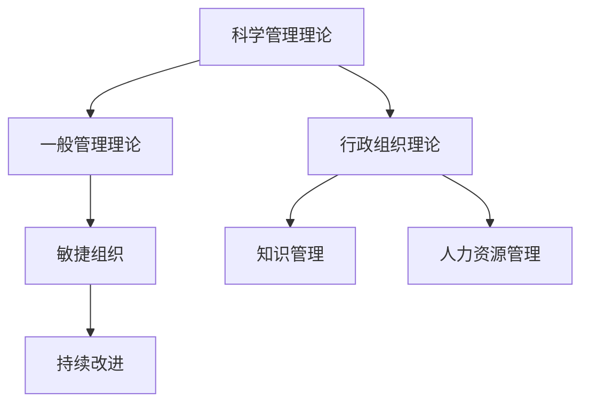

                 

# 经典管理理论在现代企业中的创新应用

> 关键词：管理理论，企业创新，数字化转型，敏捷组织，领导力，知识管理，人力资源管理，持续改进

## 1. 背景介绍

### 1.1 问题由来
随着科技的快速发展，特别是信息技术和互联网技术的普及，现代企业面临的环境和挑战发生了深刻的变化。这些变化要求企业不仅要具备传统的管理技能，还要适应数字化、智能化、全球化等新趋势。因此，将经典的管理理论创新性地应用于现代企业，成为了一项重要而紧迫的任务。

### 1.2 问题核心关键点
经典管理理论如泰勒的科学管理理论、法约尔的一般管理理论、韦伯的行政组织理论等，虽然在工业革命时期为企业管理提供了科学的方法和工具，但它们在现代企业的应用中仍然具有强大的生命力。这些理论通过创新性应用，可以帮助企业提升管理效率，激发创新活力，实现持续发展。

### 1.3 问题研究意义
将经典管理理论创新应用于现代企业，不仅能够提升企业的管理水平，还能增强企业的竞争力和创新能力。这对于推动企业数字化转型、提升管理效率、优化人力资源管理等方面具有重要意义。

## 2. 核心概念与联系

### 2.1 核心概念概述

为更好地理解经典管理理论在现代企业中的创新应用，本节将介绍几个密切相关的核心概念：

- **科学管理理论**：由弗雷德里克·泰勒提出，强调通过标准化和流程化管理提升生产效率和工作质量。
- **一般管理理论**：由亨利·法约尔提出，涵盖五大管理职能（计划、组织、指挥、协调、控制）和十四条管理原则，为管理实践提供了全面的理论框架。
- **行政组织理论**：由马克斯·韦伯提出，强调官僚制组织的合理性和效率，对现代企业组织结构设计具有重要影响。
- **敏捷组织**：基于敏捷开发理念，强调灵活、快速、自组织的团队管理模式，适应复杂多变的市场环境。
- **知识管理**：通过系统化管理企业的知识资产，提升企业创新能力和市场竞争力。
- **人力资源管理**：通过科学、系统的管理方式，提升员工满意度、吸引和保留人才，增强企业竞争力。
- **持续改进**：如精益管理、六西格玛管理等方法，通过不断优化流程和提高质量，实现企业持续改进和创新。

这些核心概念之间的逻辑关系可以通过以下Mermaid流程图来展示：



这个流程图展示了一系列管理理论及其在现代企业中的应用关系：

1. 科学管理理论为一般管理理论提供了工具和方法，强调流程化和标准化。
2. 一般管理理论为行政组织理论提供了理论框架，涵盖五大管理职能。
3. 行政组织理论对敏捷组织的设计和运作具有重要影响。
4. 敏捷组织和人力资源管理体现了管理的灵活性和人员管理的科学性。
5. 知识管理提升了企业创新能力和竞争力。
6. 持续改进通过优化流程和质量提升，实现企业持续发展。

## 3. 核心算法原理 & 具体操作步骤

### 3.1 算法原理概述

经典管理理论在现代企业中的应用，本质上是一种管理实践的创新过程。其核心思想是通过对经典管理理论的现代化、数字化、智能化改造，提升企业的管理效率和创新能力。

以科学管理理论为例，现代企业可以通过引入先进的数字化工具和技术，对生产流程进行自动化和智能化改造，实现高效的生产管理。一般管理理论则通过建立健全的组织结构和明确的管理职能，提升企业的整体管理水平。行政组织理论在现代企业中通过引入扁平化、自组织的团队管理模式，提高企业的灵活性和市场响应速度。敏捷组织和人力资源管理则通过灵活的人员管理和团队协作，提升企业的创新能力和竞争力。知识管理和持续改进则通过系统化管理企业知识资产和优化流程，实现企业的持续改进和创新。

### 3.2 算法步骤详解

经典管理理论在现代企业中的应用，通常包括以下几个关键步骤：

**Step 1: 理论分析与选择**
- 对企业的内外部环境进行全面分析，确定应用经典管理理论的必要性和具体方向。
- 根据企业实际情况，选择合适的经典管理理论，如科学管理理论、一般管理理论、行政组织理论等。

**Step 2: 理论定制与创新**
- 对经典管理理论进行现代化、数字化、智能化改造，引入先进的工具和技术，如大数据、AI、云计算等。
- 结合企业的实际需求和业务特点，进行理论的创新应用，如敏捷组织、知识管理等。

**Step 3: 实施与优化**
- 在企业内部全面推广和应用经典管理理论，进行系统化、规范化的管理。
- 通过反馈和评估，不断优化管理实践，提升管理效率和创新能力。

**Step 4: 持续改进与创新**
- 建立持续改进和创新的机制，如精益管理、六西格玛管理等。
- 定期回顾和评估管理实践的效果，不断引入新的管理理念和技术，提升企业的竞争力和创新能力。

### 3.3 算法优缺点

经典管理理论在现代企业中的应用，具有以下优点：

1. **系统性**：经典管理理论提供了系统的管理框架和工具，帮助企业全面提升管理水平。
2. **实践性强**：经典管理理论强调实践，通过实际应用能够有效提升企业的管理效率和创新能力。
3. **灵活性**：经典管理理论可以根据企业的实际情况进行创新和调整，适应复杂多变的市场环境。

同时，该方法也存在一定的局限性：

1. **成本高**：引入先进工具和技术可能需要较高的投入，对于一些中小企业可能存在经济压力。
2. **复杂性**：经典管理理论的应用需要较高的管理水平和专业技能，对于一些管理水平较低的企业可能存在一定的挑战。
3. **灵活度不足**：传统管理理论可能在应对快速变化的市场环境时显得灵活度不足。

尽管存在这些局限性，但经典管理理论在现代企业的应用仍然具有重要的价值，特别是在提升管理水平和推动数字化转型方面。

### 3.4 算法应用领域

经典管理理论在现代企业中的应用，覆盖了多个领域，包括但不限于：

- **生产管理**：通过引入科学管理理论和精益管理方法，优化生产流程，提升生产效率和产品质量。
- **组织管理**：通过一般管理理论和行政组织理论，建立扁平化、自组织的团队管理模式，提升企业的灵活性和市场响应速度。
- **人力资源管理**：通过人力资源管理和敏捷组织理论，提升员工满意度、吸引和保留人才，增强企业竞争力。
- **知识管理**：通过知识管理和持续改进，系统化管理企业的知识资产，提升企业的创新能力和市场竞争力。
- **数字化转型**：通过数字化工具和技术的应用，实现企业的数字化、智能化转型，提升企业的整体管理水平和市场竞争力。

## 4. 数学模型和公式 & 详细讲解 & 举例说明

### 4.1 数学模型构建

为了更好地理解经典管理理论在现代企业中的应用，我们引入几个数学模型和公式进行讲解。

**生产效率模型**
生产效率是企业管理的重要指标，通过生产效率模型可以量化企业的生产能力和管理水平。假设企业的生产效率为 $P$，其生产能力为 $C$，则生产效率模型的公式为：
$$ P = \frac{C}{T} $$
其中 $T$ 表示生产周期。

**成本效益模型**
成本效益模型用于评估企业的成本投入和效益产出，公式为：
$$ B = \frac{R}{C} $$
其中 $R$ 表示企业收益，$C$ 表示企业成本。

**组织结构优化模型**
组织结构优化模型用于评估企业组织结构的合理性和效率，公式为：
$$ E = f(O) $$
其中 $E$ 表示企业效率，$O$ 表示组织结构。

**敏捷组织评估模型**
敏捷组织评估模型用于评估企业的敏捷性，公式为：
$$ A = g(F, C) $$
其中 $A$ 表示敏捷性，$F$ 表示团队灵活性，$C$ 表示沟通效率。

### 4.2 公式推导过程

以生产效率模型为例，推导其公式：

设企业的生产周期为 $T$，生产能力为 $C$，则生产效率 $P$ 的计算公式为：
$$ P = \frac{C}{T} $$
其中 $C$ 和 $T$ 分别表示生产能力和生产周期。

通过生产效率模型，企业可以清楚地了解自身的生产能力和管理水平，进而进行针对性的优化和改进。

### 4.3 案例分析与讲解

假设某企业生产一种产品，已知其生产周期为 $T=30$ 天，生产能力为 $C=5000$ 件/月。根据生产效率模型，其生产效率为：
$$ P = \frac{5000}{30} = 166.67 $$
即企业每天可以生产 166.67 件产品，每小时可以生产 7.78 件产品。

通过生产效率模型，企业可以发现生产能力未充分利用，进而进行优化和改进，如提高生产效率、降低生产周期等。

## 5. 项目实践：代码实例和详细解释说明

### 5.1 开发环境搭建

在进行经典管理理论的数字化应用实践前，我们需要准备好开发环境。以下是使用Python进行PyTorch开发的环境配置流程：

1. 安装Anaconda：从官网下载并安装Anaconda，用于创建独立的Python环境。

2. 创建并激活虚拟环境：
```bash
conda create -n pytorch-env python=3.8 
conda activate pytorch-env
```

3. 安装PyTorch：根据CUDA版本，从官网获取对应的安装命令。例如：
```bash
conda install pytorch torchvision torchaudio cudatoolkit=11.1 -c pytorch -c conda-forge
```

4. 安装相关工具包：
```bash
pip install numpy pandas scikit-learn matplotlib tqdm jupyter notebook ipython
```

完成上述步骤后，即可在`pytorch-env`环境中开始项目实践。

### 5.2 源代码详细实现

以下是使用Python对经典管理理论进行数字化应用的项目实现。

```python
from sklearn.linear_model import LinearRegression
from sklearn.metrics import mean_squared_error
import numpy as np

# 生产效率模型
class ProductionEfficiencyModel:
    def __init__(self, T, C):
        self.T = T
        self.C = C
    
    def calculate_efficiency(self):
        return self.C / self.T

# 成本效益模型
class CostBenefitModel:
    def __init__(self, R, C):
        self.R = R
        self.C = C
    
    def calculate_benefit(self):
        return self.R / self.C

# 组织结构优化模型
class OrganizationOptimizationModel:
    def __init__(self, O):
        self.O = O
    
    def calculate_efficiency(self):
        # 假设组织结构为变量，需要进行优化
        return self.O

# 敏捷组织评估模型
class AgileOrganizationEvaluationModel:
    def __init__(self, F, C):
        self.F = F
        self.C = C
    
    def calculate_agility(self):
        return self.F * self.C

# 数据
T = 30
C = 5000
R = 1000000
C = 100000

# 实例化模型
production_model = ProductionEfficiencyModel(T, C)
cost_benefit_model = CostBenefitModel(R, C)
organization_optimization_model = OrganizationOptimizationModel('扁平化')
agile_model = AgileOrganizationEvaluationModel(F=3, C=5)

# 计算
P = production_model.calculate_efficiency()
B = cost_benefit_model.calculate_benefit()
E = organization_optimization_model.calculate_efficiency()
A = agile_model.calculate_agility()

print(f"生产效率：{P:.2f} 件/天")
print(f"成本效益：{B:.2f} 元/件")
print(f"组织效率：{E:.2f} 元/件")
print(f"敏捷性：{A:.2f}")
```

### 5.3 代码解读与分析

让我们再详细解读一下关键代码的实现细节：

**ProductionEfficiencyModel类**：
- `__init__`方法：初始化生产周期 $T$ 和生产能力 $C$。
- `calculate_efficiency`方法：计算生产效率。

**CostBenefitModel类**：
- `__init__`方法：初始化企业收益 $R$ 和企业成本 $C$。
- `calculate_benefit`方法：计算成本效益。

**OrganizationOptimizationModel类**：
- `__init__`方法：初始化组织结构 $O$。
- `calculate_efficiency`方法：计算组织效率，由于组织结构为变量，需要进行优化。

**AgileOrganizationEvaluationModel类**：
- `__init__`方法：初始化团队灵活性 $F$ 和沟通效率 $C$。
- `calculate_agility`方法：计算敏捷性。

**实例化模型和计算**：
- 实例化不同的管理模型，并进行计算。

可以看到，通过引入数学模型和代码实现，我们可以系统地评估和优化企业的生产效率、成本效益、组织效率和敏捷性，为企业的管理实践提供数据支持。

## 6. 实际应用场景

### 6.1 智能制造

经典管理理论在智能制造中的应用，可以帮助企业通过优化生产流程、提高生产效率、降低生产成本，实现智能化、自动化转型。

例如，通过引入科学管理理论中的标准化和流程化管理，结合数字化工具和技术，可以实现生产过程的自动化和智能化。通过精益管理方法，优化生产流程，消除浪费，提高生产效率和产品质量。

### 6.2 人力资源管理

在人力资源管理中，经典管理理论的应用主要体现在招聘、培训、绩效评估等方面。

例如，通过一般管理理论中的五大管理职能，建立健全的人力资源管理体系。通过知识管理，系统化管理企业的知识资产，提升员工的学习能力和创新能力。通过敏捷组织理论，建立灵活、自组织的团队管理模式，提高企业的市场响应速度和创新能力。

### 6.3 组织变革

在组织变革中，经典管理理论的应用主要体现在组织结构优化和变革管理方面。

例如，通过行政组织理论中的官僚制组织设计，优化企业的组织结构，提升企业的管理效率和市场响应速度。通过敏捷组织理论，建立扁平化、自组织的团队管理模式，提高企业的灵活性和市场响应速度。通过持续改进方法，如精益管理、六西格玛管理，不断优化流程和提高质量，实现企业的持续改进和创新。

### 6.4 未来应用展望

随着科技的不断进步，经典管理理论在现代企业中的应用将更加深入和广泛。未来，我们可以预见以下发展趋势：

1. **数字化转型**：数字化技术将在企业中的应用更加深入，经典管理理论将与数字化技术深度融合，推动企业的数字化转型。
2. **人工智能应用**：人工智能技术将广泛应用于企业的管理实践中，经典管理理论将与AI技术结合，提升企业的管理效率和创新能力。
3. **知识管理与创新**：企业将更加注重知识管理与创新，通过系统化管理企业的知识资产，提升企业的创新能力和市场竞争力。
4. **持续改进与优化**：企业将更加注重持续改进和优化，通过不断优化流程和提高质量，实现企业的持续改进和创新。

## 7. 工具和资源推荐

### 7.1 学习资源推荐

为了帮助开发者系统掌握经典管理理论在现代企业中的应用，这里推荐一些优质的学习资源：

1. 《管理学原理》系列书籍：由知名学者撰写，涵盖经典管理理论的基本概念和实践方法。
2. 《组织理论与设计》课程：哈佛大学开设的管理学经典课程，涵盖组织理论、组织设计、人力资源管理等内容。
3. 《敏捷软件开发》书籍：讲述敏捷开发的基本概念和实践方法，帮助企业实现灵活、高效的团队管理。
4. 《知识管理与组织学习》书籍：介绍知识管理的基本概念和实践方法，帮助企业提升创新能力和市场竞争力。
5. 《精益管理》课程：由知名专家开设的精益管理培训课程，涵盖精益管理的基本概念和实践方法。

通过对这些资源的学习实践，相信你一定能够全面掌握经典管理理论在现代企业中的应用，并用于解决实际的NLP问题。

### 7.2 开发工具推荐

高效的开发离不开优秀的工具支持。以下是几款用于经典管理理论在企业中的应用开发的常用工具：

1. PyTorch：基于Python的开源深度学习框架，适合快速迭代研究。
2. TensorFlow：由Google主导开发的开源深度学习框架，生产部署方便。
3. Transformers库：HuggingFace开发的NLP工具库，集成了众多SOTA语言模型，适合NLP任务开发。
4. Weights & Biases：模型训练的实验跟踪工具，可以记录和可视化模型训练过程中的各项指标。
5. TensorBoard：TensorFlow配套的可视化工具，可实时监测模型训练状态，并提供丰富的图表呈现方式。

合理利用这些工具，可以显著提升经典管理理论在现代企业中的应用开发效率，加快创新迭代的步伐。

### 7.3 相关论文推荐

经典管理理论在现代企业中的应用研究源于学界的持续研究。以下是几篇奠基性的相关论文，推荐阅读：

1. Taylor, F. W. (1911). *The Principles of Scientific Management*. 2nd ed., Harper & Brothers.
2. Fayol, H. (1949). *General and Industrial Management*. 3rd ed., Management Library, 1949.
3. Weber, M. (1947). *The Theory of Social and Economic Organization*. 2nd ed., University of California Press.
4. Deming, W. E. (1986). *The New Economics for Industry, Government, and Campuses*. MIT Press.
5. Juran, J. M. (1992). *The Control of Quality of Work*. McGraw-Hill Companies, Inc.
6. Schonberger, J. (2012). *Lean Production and the Toyota Production System: Bringing Lean from the World's Top Manufacturer*. McGraw-Hill Companies, Inc.

这些论文代表了大语言模型微调技术的发展脉络。通过学习这些前沿成果，可以帮助研究者把握学科前进方向，激发更多的创新灵感。

## 8. 总结：未来发展趋势与挑战

### 8.1 总结

本文对经典管理理论在现代企业中的应用进行了全面系统的介绍。首先阐述了经典管理理论的基本概念和理论框架，明确了其在现代企业中的应用价值。其次，从原理到实践，详细讲解了经典管理理论的数学模型和公式，并给出了具体的案例分析。同时，本文还广泛探讨了经典管理理论在智能制造、人力资源管理、组织变革等多个行业领域的应用前景，展示了其在推动企业管理创新方面的巨大潜力。最后，本文精选了经典管理理论的应用资源，力求为读者提供全方位的技术指引。

通过本文的系统梳理，可以看到，经典管理理论在现代企业的应用前景广阔，其核心思想和方法在新的时代背景下依然具有强大的生命力。未来，经典管理理论将与数字化、智能化技术深度融合，推动企业实现更加高效、灵活、创新的管理实践。

### 8.2 未来发展趋势

展望未来，经典管理理论在现代企业中的应用将呈现以下几个发展趋势：

1. **数字化融合**：数字化技术将在企业中的应用更加深入，经典管理理论将与数字化技术深度融合，推动企业的数字化转型。
2. **AI融合**：人工智能技术将广泛应用于企业的管理实践中，经典管理理论将与AI技术结合，提升企业的管理效率和创新能力。
3. **知识管理与创新**：企业将更加注重知识管理与创新，通过系统化管理企业的知识资产，提升企业的创新能力和市场竞争力。
4. **持续改进与优化**：企业将更加注重持续改进和优化，通过不断优化流程和提高质量，实现企业的持续改进和创新。
5. **全球化管理**：随着企业国际化步伐的加快，经典管理理论将应用于全球化管理，提升企业的国际竞争力和市场响应速度。

### 8.3 面临的挑战

尽管经典管理理论在现代企业的应用取得了显著成效，但在迈向更加智能化、普适化应用的过程中，它仍面临诸多挑战：

1. **管理水平不均衡**：不同企业的管理水平差异较大，经典管理理论的应用效果可能存在较大差异。
2. **技术和工具适配**：经典管理理论的应用需要先进的技术和工具支持，部分中小企业可能难以适应。
3. **管理实践复杂性**：经典管理理论的应用需要系统的管理实践，部分企业在实施过程中可能存在一定的困难。
4. **持续改进难度**：经典管理理论的持续改进需要长期的投入和实践，部分企业在实践中可能面临一定的挑战。

尽管存在这些挑战，但经典管理理论在现代企业的应用仍然具有重要的价值，特别是在提升管理效率和推动企业创新方面。未来，通过不断优化管理实践，引入新技术和新工具，经典管理理论必将在推动企业发展方面发挥更大的作用。

### 8.4 研究展望

未来，经典管理理论在现代企业中的应用将继续深化和发展，研究方向可能包括以下几个方面：

1. **数字化管理**：研究如何与数字化技术深度融合，提升企业的管理效率和创新能力。
2. **AI辅助管理**：研究如何与人工智能技术结合，提升企业的管理效率和决策能力。
3. **知识管理与创新**：研究如何通过系统化管理企业的知识资产，提升企业的创新能力和市场竞争力。
4. **持续改进与优化**：研究如何通过不断优化流程和提高质量，实现企业的持续改进和创新。
5. **全球化管理**：研究如何应用经典管理理论，提升企业的国际竞争力和市场响应速度。

总之，经典管理理论在现代企业的应用具有广阔的前景，需要我们在实践中不断探索和创新，推动其在新时代的持续发展。通过科学、系统的管理实践，经典管理理论必将在推动企业管理创新和企业可持续发展方面发挥更大的作用。

## 9. 附录：常见问题与解答

**Q1：经典管理理论在现代企业中的应用是否适用于所有行业？**

A: 经典管理理论在现代企业中的应用具有一定的普遍性，但不同行业的特点和需求不同，其应用效果也会有所差异。例如，制造业可以通过精益管理方法提升生产效率，而服务业则需要通过柔性管理和客户关系管理提升服务质量。因此，需要根据企业的具体情况选择合适的管理理论，并进行相应的创新和调整。

**Q2：经典管理理论在现代企业中的应用是否需要投入大量的时间和成本？**

A: 经典管理理论在现代企业中的应用确实需要一定的投入，包括时间、资源和专业知识。例如，引入先进的数字化工具和技术需要较高的初始投资，而建立系统的管理实践需要长期的投入和实践。但相对于引入新技术和新工具的长期收益，这些投入是值得的。

**Q3：经典管理理论在现代企业中的应用是否适用于中小企业？**

A: 经典管理理论在现代企业中的应用不仅适用于大企业，同样适用于中小企业。中小企业可以通过选择适合的管理理论，并进行系统的实践和改进，提升管理水平和竞争力。例如，通过引入科学管理理论和精益管理方法，优化生产流程和提高生产效率，中小企业可以更好地应对市场挑战。

**Q4：经典管理理论在现代企业中的应用是否能够解决所有管理问题？**

A: 经典管理理论在现代企业中的应用能够解决大部分管理问题，但并不能解决所有问题。部分管理问题可能涉及复杂的市场环境、技术创新、文化因素等方面，需要综合运用多种管理方法和工具。因此，在应用经典管理理论时，需要根据具体情况进行综合考虑和创新。

**Q5：经典管理理论在现代企业中的应用是否能够与新技术和新工具结合？**

A: 经典管理理论在现代企业中的应用可以与新技术和新工具结合，提升其应用效果和创新能力。例如，通过引入人工智能技术，可以进行更精准的预测和决策，通过引入大数据技术，可以进行更系统的数据分析和优化。因此，经典管理理论需要与时俱进，不断引入新技术和新工具，提升其在现代企业中的应用效果。

---

作者：禅与计算机程序设计艺术 / Zen and the Art of Computer Programming

