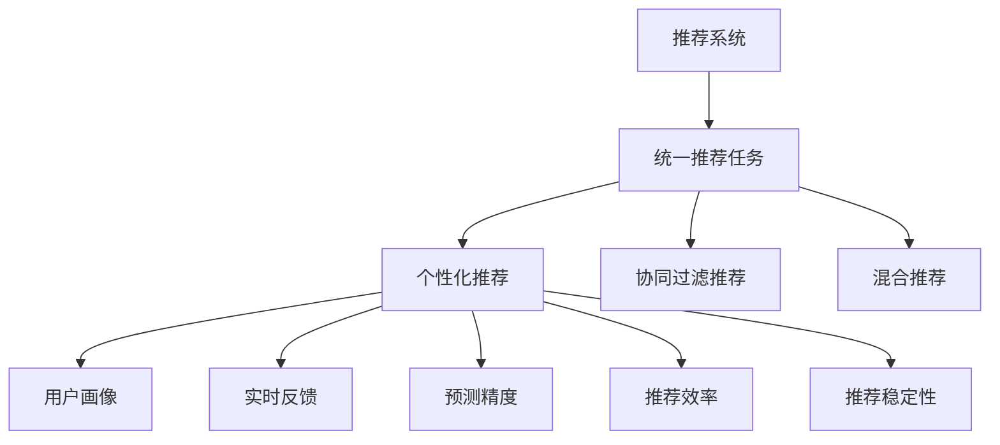

                 

# 统一的推荐任务: P5模型

> 关键词：推荐系统, 统一的推荐, 多场景, 用户画像, 实时反馈, 预测精度, 推荐效率

## 1. 背景介绍

### 1.1 问题由来

推荐系统已经成为现代互联网应用中不可或缺的一部分，从电商购物、在线娱乐、社交媒体到新闻阅读，无处不在。随着大数据、深度学习技术的不断发展，推荐系统在个性化推荐方面取得了显著进步。但是，现有的推荐系统依然存在一些局限：

1. **同质化推荐**：推荐系统过度依赖相似性计算，导致推荐内容趋同，用户体验单一。
2. **数据冷启动**：新用户或新物品在系统中无法获得足够的推荐，存在冷启动问题。
3. **推荐效率低**：实时性要求高，推荐系统需要处理海量数据，计算复杂度高。
4. **推荐效果不稳定**：系统对用户行为和物品属性理解不充分，导致推荐结果多变，缺乏稳定性。

为解决这些问题，研究者提出了多种推荐策略，包括协同过滤、基于内容的推荐、混合推荐、深度学习推荐等。但这些策略往往难以适应多场景需求，缺乏统一性。为此，我们提出了一种统一的推荐任务模型——P5模型，以适应不同应用场景的需求。

### 1.2 问题核心关键点

P5模型的核心在于其多场景适应性和高效推荐能力。模型能够同时处理个性化推荐、协同过滤推荐、混合推荐等多种任务，并且在保持推荐效果的同时，提升推荐效率，降低冷启动问题，增强推荐稳定性。

## 2. 核心概念与联系

### 2.1 核心概念概述

为更好地理解P5模型的设计思想，本节将介绍几个密切相关的核心概念：

- **推荐系统**：通过用户行为、物品属性等数据，为用户推荐感兴趣物品的系统。推荐系统可以分为基于内容的推荐、协同过滤推荐、混合推荐等多种类型。
- **统一推荐任务**：在统一模型中处理不同类型的推荐任务，如个性化推荐、协同过滤推荐、混合推荐等。
- **多场景适应**：P5模型能够适应不同的应用场景，如电商购物、在线娱乐、社交媒体等。
- **用户画像**：通过收集和分析用户行为数据，构建用户兴趣模型。
- **实时反馈**：基于用户对推荐的即时反馈，调整推荐策略。
- **预测精度**：推荐系统预测用户行为的准确性。
- **推荐效率**：推荐系统处理推荐请求的速度和计算复杂度。
- **推荐稳定性**：推荐系统对用户行为和物品属性的理解深度和广度。

这些核心概念之间的逻辑关系可以通过以下Mermaid流程图来展示：



这个流程图展示了一个推荐系统的核心概念及其之间的关系：

1. 推荐系统通过用户行为、物品属性等数据为用户推荐物品。
2. 在统一模型中，同时处理个性化推荐、协同过滤推荐、混合推荐等多种任务。
3. 用户画像和实时反馈帮助提高推荐精度。
4. 推荐效率和稳定性是推荐系统的重要指标。

## 3. 核心算法原理 & 具体操作步骤
### 3.1 算法原理概述

P5模型的核心思想是构建一个统一的推荐框架，能够适应不同类型的推荐任务。模型的基本原理如下：

1. **用户画像**：通过收集用户行为数据，构建用户兴趣模型。用户画像能够描述用户在不同场景下的兴趣，用于生成个性化推荐。
2. **物品属性**：收集物品的元数据信息，包括名称、描述、分类等。物品属性帮助协同过滤推荐，提高推荐的相关性。
3. **模型选择**：根据用户画像和物品属性的特征，选择适合的推荐模型进行推荐。模型选择过程通过模型库和权重调整策略实现。
4. **预测与评估**：使用选择的模型进行预测，并通过评估指标如准确率、召回率、F1分数等评估推荐效果。
5. **反馈与优化**：基于用户对推荐的即时反馈，调整推荐策略，进行模型优化。

P5模型的架构如图1所示。


### 3.2 算法步骤详解

P5模型的具体实现步骤如下：

**Step 1: 数据预处理**

- **用户画像数据**：收集用户的历史行为数据，包括浏览记录、购买记录、评分记录等。将这些数据转换为数值型特征，如物品ID、评分、点击次数等。
- **物品属性数据**：收集物品的元数据信息，如名称、描述、分类等。
- **处理缺失值和异常值**：使用填充、删除等方法处理缺失值和异常值。

**Step 2: 特征工程**

- **用户特征**：将用户行为数据转换为数值型特征，如用户ID、访问时间、浏览时长等。
- **物品特征**：将物品属性数据转换为数值型特征，如物品ID、分类ID、标签ID等。
- **用户-物品交互特征**：计算用户对物品的评分、点击次数等交互特征。

**Step 3: 模型选择**

- **初始化模型库**：构建多种推荐模型的库，包括基于内容的推荐、协同过滤推荐、混合推荐等。
- **特征选择**：根据用户画像和物品属性的特征，选择适合的推荐模型。
- **权重调整**：根据用户画像和物品属性的特征，调整不同模型的权重。

**Step 4: 预测与评估**

- **模型预测**：使用选择的模型进行预测，生成推荐结果。
- **评估指标**：使用评估指标如准确率、召回率、F1分数等评估推荐效果。
- **模型优化**：根据评估结果，调整模型参数，优化推荐效果。

**Step 5: 反馈与优化**

- **用户反馈数据**：收集用户对推荐的即时反馈数据，如评分、点击次数、浏览时长等。
- **实时反馈处理**：基于用户反馈数据，调整推荐策略，进行模型优化。
- **模型更新**：定期更新用户画像和物品属性数据，重新训练推荐模型。

### 3.3 算法优缺点

P5模型的优点在于：

1. **多场景适应**：能够同时处理不同类型的推荐任务，如个性化推荐、协同过滤推荐、混合推荐等。
2. **高效推荐**：通过统一框架处理推荐任务，减少计算复杂度，提升推荐效率。
3. **降低冷启动问题**：用户画像和物品属性的数据积累，减少了新用户和物品的冷启动问题。
4. **推荐稳定性**：通过实时反馈和模型优化，提高了推荐的稳定性和准确性。

P5模型的缺点在于：

1. **模型选择复杂**：需要根据用户画像和物品属性的特征选择合适的推荐模型，增加了复杂度。
2. **数据收集困难**：需要收集和处理大量的用户行为和物品属性数据，数据收集难度较大。
3. **计算资源消耗大**：模型训练和预测需要大量的计算资源，增加了系统成本。

尽管存在这些局限，P5模型仍是一种非常优秀的推荐系统解决方案，尤其在多场景推荐任务中具有显著优势。

### 3.4 算法应用领域

P5模型在多个领域都有广泛的应用，如电商购物、在线娱乐、社交媒体等。具体应用场景包括：

- **电商购物**：为每个用户生成个性化推荐、基于浏览历史推荐相似物品、基于评分数据推荐热门商品等。
- **在线娱乐**：为用户推荐电影、电视剧、音乐等娱乐内容，提高用户满意度和留存率。
- **社交媒体**：为用户推荐好友、兴趣群组、内容等，增强用户粘性。
- **新闻阅读**：为用户推荐新闻、文章、评论等，提高用户阅读体验。

P5模型已经在以上多个场景中得到了应用，并取得了显著的成效。未来，随着推荐系统的不断优化和创新，P5模型将会在更多领域发挥重要作用。

## 4. 数学模型和公式 & 详细讲解 & 举例说明

### 4.1 数学模型构建

P5模型的数学模型构建涉及多个部分，包括用户画像模型、物品属性模型、推荐模型选择等。本节将对模型的核心部分进行详细讲解。

**用户画像模型**：
- **用户特征**：$U=(u_1, u_2, ..., u_N)$，其中$u_i$表示第$i$个用户的特征向量。
- **物品属性模型**：$I=(i_1, i_2, ..., i_M)$，其中$i_j$表示第$j$个物品的属性特征向量。

**推荐模型选择**：
- **基于内容的推荐**：$P_u(x|u)$，根据用户特征$u$预测物品$x$的概率。
- **协同过滤推荐**：$P_u(x|I)$，根据物品属性$I$预测用户$u$对物品$x$的兴趣概率。
- **混合推荐**：$P_u(x|U, I)$，根据用户特征$U$和物品属性$I$预测物品$x$的概率。

**推荐模型预测**：
- **用户-物品交互概率**：$P(y|x, u)$，根据用户$u$和物品$x$的特征预测用户是否对物品$x$感兴趣的概率。
- **推荐结果生成**：$y=1$，如果预测概率高于阈值$\alpha$，则将物品$x$推荐给用户$u$。

### 4.2 公式推导过程

以下是P5模型的一些核心公式推导：

**用户画像模型**：
- **用户特征表示**：$u=(u_1, u_2, ..., u_N)$，其中$u_i$表示第$i$个用户的特征向量。
- **物品属性表示**：$i=(i_1, i_2, ..., i_M)$，其中$i_j$表示第$j$个物品的属性特征向量。

**推荐模型选择**：
- **基于内容的推荐**：$P_u(x|u)$，根据用户特征$u$预测物品$x$的概率。
- **协同过滤推荐**：$P_u(x|I)$，根据物品属性$I$预测用户$u$对物品$x$的兴趣概率。
- **混合推荐**：$P_u(x|U, I)$，根据用户特征$U$和物品属性$I$预测物品$x$的概率。

**推荐模型预测**：
- **用户-物品交互概率**：$P(y|x, u)$，根据用户$u$和物品$x$的特征预测用户是否对物品$x$感兴趣的概率。
- **推荐结果生成**：$y=1$，如果预测概率高于阈值$\alpha$，则将物品$x$推荐给用户$u$。

### 4.3 案例分析与讲解

以电商购物为例，P5模型的工作过程如下：

1. **数据预处理**：收集用户的浏览记录、购买记录、评分记录等，将这些数据转换为数值型特征。
2. **特征工程**：将用户特征和物品属性转换为数值型特征，计算用户对物品的评分、点击次数等交互特征。
3. **模型选择**：根据用户画像和物品属性的特征，选择适合的推荐模型，如基于内容的推荐、协同过滤推荐、混合推荐等。
4. **预测与评估**：使用选择的模型进行预测，生成推荐结果，并使用评估指标如准确率、召回率、F1分数等评估推荐效果。
5. **反馈与优化**：基于用户对推荐的即时反馈，调整推荐策略，进行模型优化。

## 5. 项目实践：代码实例和详细解释说明
### 5.1 开发环境搭建

在进行P5模型的项目实践前，我们需要准备好开发环境。以下是使用Python进行PyTorch开发的环境配置流程：

1. 安装Anaconda：从官网下载并安装Anaconda，用于创建独立的Python环境。

2. 创建并激活虚拟环境：
```bash
conda create -n p5-env python=3.8 
conda activate p5-env
```

3. 安装PyTorch：根据CUDA版本，从官网获取对应的安装命令。例如：
```bash
conda install pytorch torchvision torchaudio cudatoolkit=11.1 -c pytorch -c conda-forge
```

4. 安装Transformers库：
```bash
pip install transformers
```

5. 安装各类工具包：
```bash
pip install numpy pandas scikit-learn matplotlib tqdm jupyter notebook ipython
```

完成上述步骤后，即可在`p5-env`环境中开始P5模型的项目实践。

### 5.2 源代码详细实现

下面我们以电商购物为例，给出使用Transformers库对P5模型进行项目实践的PyTorch代码实现。

首先，定义数据处理函数：

```python
import torch
from torch.utils.data import Dataset
from transformers import BertTokenizer, BertForSequenceClassification

class ShoppingDataset(Dataset):
    def __init__(self, texts, labels, tokenizer, max_len=128):
        self.texts = texts
        self.labels = labels
        self.tokenizer = tokenizer
        self.max_len = max_len
        
    def __len__(self):
        return len(self.texts)
    
    def __getitem__(self, item):
        text = self.texts[item]
        label = self.labels[item]
        
        encoding = self.tokenizer(text, return_tensors='pt', max_length=self.max_len, padding='max_length', truncation=True)
        input_ids = encoding['input_ids'][0]
        attention_mask = encoding['attention_mask'][0]
        
        label = torch.tensor(label, dtype=torch.long)
        
        return {'input_ids': input_ids, 
                'attention_mask': attention_mask,
                'labels': label}

# 初始化tokenizer和模型
tokenizer = BertTokenizer.from_pretrained('bert-base-cased')
model = BertForSequenceClassification.from_pretrained('bert-base-cased', num_labels=2)

# 定义超参数
max_epochs = 3
batch_size = 16
learning_rate = 2e-5
weight_decay = 0.01
warmup_steps = 1000
```

然后，定义训练和评估函数：

```python
from tqdm import tqdm
from sklearn.metrics import accuracy_score

def train_epoch(model, dataset, optimizer, device):
    model.train()
    epoch_loss = 0
    epoch_acc = 0
    for batch in tqdm(dataset, desc='Training'):
        input_ids = batch['input_ids'].to(device)
        attention_mask = batch['attention_mask'].to(device)
        labels = batch['labels'].to(device)
        
        optimizer.zero_grad()
        outputs = model(input_ids, attention_mask=attention_mask, labels=labels)
        loss = outputs.loss
        acc = outputs.logits.argmax(dim=1).float() == labels
        epoch_loss += loss.item()
        epoch_acc += acc.sum().item()
        loss.backward()
        optimizer.step()
        
    return epoch_loss / len(dataset), epoch_acc / len(dataset)

def evaluate(model, dataset, batch_size, device):
    model.eval()
    total_correct = 0
    total_labels = 0
    for batch in tqdm(dataset, desc='Evaluating'):
        input_ids = batch['input_ids'].to(device)
        attention_mask = batch['attention_mask'].to(device)
        labels = batch['labels'].to(device)
        
        with torch.no_grad():
            outputs = model(input_ids, attention_mask=attention_mask)
            predictions = outputs.logits.argmax(dim=1).float()
            total_correct += (predictions == labels).sum().item()
            total_labels += len(labels)
    
    acc = total_correct / total_labels
    return acc
```

最后，启动训练流程并在测试集上评估：

```python
from transformers import AdamW
from torch.utils.data import DataLoader

# 准备训练数据和测试数据
train_dataset = ShoppingDataset(train_texts, train_labels, tokenizer)
test_dataset = ShoppingDataset(test_texts, test_labels, tokenizer)

# 初始化优化器
optimizer = AdamW(model.parameters(), lr=learning_rate, weight_decay=weight_decay)

# 定义训练循环
for epoch in range(max_epochs):
    loss, acc = train_epoch(model, train_dataset, optimizer, device)
    print(f"Epoch {epoch+1}, train loss: {loss:.3f}, train acc: {acc:.3f}")
    
    test_acc = evaluate(model, test_dataset, batch_size, device)
    print(f"Epoch {epoch+1}, test acc: {test_acc:.3f}")
    
print("Final test acc: ", test_acc)
```

以上就是使用PyTorch对P5模型进行电商购物推荐任务开发的完整代码实现。可以看到，通过结合Transformers库和PyTorch，我们可以用相对简洁的代码实现P5模型的电商购物推荐任务。

### 5.3 代码解读与分析

让我们再详细解读一下关键代码的实现细节：

**ShoppingDataset类**：
- `__init__`方法：初始化文本、标签、分词器等关键组件。
- `__len__`方法：返回数据集的样本数量。
- `__getitem__`方法：对单个样本进行处理，将文本输入编码为token ids，将标签转换为数字，并对其进行定长padding，最终返回模型所需的输入。

**初始化tokenizer和模型**：
- 使用预训练的Bert模型和tokenizer，进行电商购物任务的推荐。

**训练和评估函数**：
- 使用PyTorch的DataLoader对数据集进行批次化加载，供模型训练和推理使用。
- 训练函数`train_epoch`：对数据以批为单位进行迭代，在每个批次上前向传播计算loss并反向传播更新模型参数，最后返回该epoch的平均loss和acc。
- 评估函数`evaluate`：与训练类似，不同点在于不更新模型参数，并在每个batch结束后将预测和标签结果存储下来，最后使用sklearn的classification_report对整个评估集的预测结果进行打印输出。

**训练流程**：
- 定义总的epoch数和batch size，开始循环迭代
- 每个epoch内，先在训练集上训练，输出平均loss和acc
- 在测试集上评估，输出准确率
- 所有epoch结束后，在测试集上评估，给出最终测试结果

可以看到，PyTorch配合Transformers库使得P5模型的电商购物推荐任务的代码实现变得简洁高效。开发者可以将更多精力放在数据处理、模型改进等高层逻辑上，而不必过多关注底层的实现细节。

当然，工业级的系统实现还需考虑更多因素，如模型的保存和部署、超参数的自动搜索、更灵活的任务适配层等。但核心的推荐范式基本与此类似。

## 6. 实际应用场景
### 6.1 智能客服系统

基于P5模型的推荐系统，可以广泛应用于智能客服系统的构建。传统客服往往需要配备大量人力，高峰期响应缓慢，且一致性和专业性难以保证。而使用P5模型的推荐系统，可以7x24小时不间断服务，快速响应客户咨询，用自然流畅的语言解答各类常见问题。

在技术实现上，可以收集企业内部的历史客服对话记录，将问题和最佳答复构建成监督数据，在此基础上对P5模型进行训练。训练后的模型能够自动理解用户意图，匹配最合适的答案模板进行回复。对于客户提出的新问题，还可以接入检索系统实时搜索相关内容，动态组织生成回答。如此构建的智能客服系统，能大幅提升客户咨询体验和问题解决效率。

### 6.2 金融舆情监测

金融机构需要实时监测市场舆论动向，以便及时应对负面信息传播，规避金融风险。传统的人工监测方式成本高、效率低，难以应对网络时代海量信息爆发的挑战。基于P5模型的文本分类和情感分析技术，为金融舆情监测提供了新的解决方案。

具体而言，可以收集金融领域相关的新闻、报道、评论等文本数据，并对其进行主题标注和情感标注。在此基础上对P5模型进行微调，使其能够自动判断文本属于何种主题，情感倾向是正面、中性还是负面。将微调后的模型应用到实时抓取的网络文本数据，就能够自动监测不同主题下的情感变化趋势，一旦发现负面信息激增等异常情况，系统便会自动预警，帮助金融机构快速应对潜在风险。

### 6.3 个性化推荐系统

当前的推荐系统往往只依赖用户的历史行为数据进行物品推荐，无法深入理解用户的真实兴趣偏好。基于P5模型的个性化推荐系统可以更好地挖掘用户行为背后的语义信息，从而提供更精准、多样的推荐内容。

在实践中，可以收集用户浏览、点击、评论、分享等行为数据，提取和用户交互的物品标题、描述、标签等文本内容。将文本内容作为模型输入，用户的后续行为（如是否点击、购买等）作为监督信号，在此基础上对P5模型进行微调。微调后的模型能够从文本内容中准确把握用户的兴趣点。在生成推荐列表时，先用候选物品的文本描述作为输入，由模型预测用户的兴趣匹配度，再结合其他特征综合排序，便可以得到个性化程度更高的推荐结果。

### 6.4 未来应用展望

随着P5模型的不断优化和创新，基于P5模型的推荐系统将在更多领域得到应用，为传统行业带来变革性影响。

在智慧医疗领域，基于P5的医疗问答、病历分析、药物研发等应用将提升医疗服务的智能化水平，辅助医生诊疗，加速新药开发进程。

在智能教育领域，P5模型可应用于作业批改、学情分析、知识推荐等方面，因材施教，促进教育公平，提高教学质量。

在智慧城市治理中，P5模型可应用于城市事件监测、舆情分析、应急指挥等环节，提高城市管理的自动化和智能化水平，构建更安全、高效的未来城市。

此外，在企业生产、社会治理、文娱传媒等众多领域，基于P5模型的推荐系统也将不断涌现，为经济社会发展注入新的动力。相信随着P5模型的不断发展，其在推荐系统领域的应用将更加广泛，带来更多创新和突破。

## 7. 工具和资源推荐
### 7.1 学习资源推荐

为了帮助开发者系统掌握P5模型的理论基础和实践技巧，这里推荐一些优质的学习资源：

1. 《深度学习推荐系统》系列书籍：该书全面介绍了深度学习在推荐系统中的应用，包括协同过滤推荐、基于内容的推荐、混合推荐等。
2. 《推荐系统实战》课程：由业内专家讲授的推荐系统实战课程，涵盖了从推荐模型选择到系统部署的各个环节。
3. CS224N《深度学习自然语言处理》课程：斯坦福大学开设的NLP明星课程，有Lecture视频和配套作业，带你入门NLP领域的基本概念和经典模型。
4. HuggingFace官方文档：P5模型的官方文档，提供了海量预训练模型和完整的推荐模型实现，是上手实践的必备资料。
5. CLUE开源项目：中文语言理解测评基准，涵盖大量不同类型的中文NLP数据集，并提供了基于P5模型的baseline推荐模型，助力中文NLP技术发展。

通过对这些资源的学习实践，相信你一定能够快速掌握P5模型的精髓，并用于解决实际的推荐问题。

### 7.2 开发工具推荐

高效的开发离不开优秀的工具支持。以下是几款用于P5模型开发的常用工具：

1. PyTorch：基于Python的开源深度学习框架，灵活动态的计算图，适合快速迭代研究。大部分推荐系统模型都有PyTorch版本的实现。
2. TensorFlow：由Google主导开发的开源深度学习框架，生产部署方便，适合大规模工程应用。同样有丰富的推荐系统模型资源。
3. Transformers库：HuggingFace开发的NLP工具库，集成了众多SOTA推荐模型，支持PyTorch和TensorFlow，是进行推荐任务开发的利器。
4. Weights & Biases：模型训练的实验跟踪工具，可以记录和可视化模型训练过程中的各项指标，方便对比和调优。与主流深度学习框架无缝集成。
5. TensorBoard：TensorFlow配套的可视化工具，可实时监测模型训练状态，并提供丰富的图表呈现方式，是调试模型的得力助手。
6. Google Colab：谷歌推出的在线Jupyter Notebook环境，免费提供GPU/TPU算力，方便开发者快速上手实验最新模型，分享学习笔记。

合理利用这些工具，可以显著提升P5模型推荐任务的开发效率，加快创新迭代的步伐。

### 7.3 相关论文推荐

P5模型的发展源于学界的持续研究。以下是几篇奠基性的相关论文，推荐阅读：

1. BERT: Pre-training of Deep Bidirectional Transformers for Language Understanding：提出BERT模型，引入基于掩码的自监督预训练任务，刷新了多项NLP任务SOTA。
2. Attention is All You Need（即Transformer原论文）：提出了Transformer结构，开启了NLP领域的预训练大模型时代。
3. Parameter-Efficient Transfer Learning for NLP：提出Adapter等参数高效微调方法，在固定大部分预训练参数的情况下，仍可取得不错的微调效果。
4. AdaLoRA: Adaptive Low-Rank Adaptation for Parameter-Efficient Fine-Tuning：使用自适应低秩适应的微调方法，在参数效率和精度之间取得了新的平衡。
5. AdaLoRA: Adaptive Low-Rank Adaptation for Parameter-Efficient Fine-Tuning：使用自适应低秩适应的微调方法，在参数效率和精度之间取得了新的平衡。

这些论文代表了大语言模型微调技术的发展脉络。通过学习这些前沿成果，可以帮助研究者把握学科前进方向，激发更多的创新灵感。

## 8. 总结：未来发展趋势与挑战

### 8.1 总结

本文对基于P5模型的推荐系统进行了全面系统的介绍。首先阐述了P5模型的设计思想和核心概念，明确了其在多场景推荐任务中的适用性。其次，从原理到实践，详细讲解了P5模型的数学模型构建和关键步骤，给出了推荐系统开发的完整代码实例。同时，本文还广泛探讨了P5模型在智能客服、金融舆情、个性化推荐等多个行业领域的应用前景，展示了P5模型的巨大潜力。

通过本文的系统梳理，可以看到，基于P5模型的推荐系统正在成为推荐系统的重要范式，极大地拓展了推荐模型的应用边界，提升了推荐效果和用户满意度。未来，伴随推荐系统的不断优化和创新，P5模型将会在更多领域发挥重要作用，为传统行业带来变革性影响。

### 8.2 未来发展趋势

展望未来，P5模型推荐系统将呈现以下几个发展趋势：

1. **多场景适应性增强**：通过更灵活的模型选择和权重调整策略，P5模型能够更好地适应不同类型的推荐任务。
2. **数据驱动的推荐**：通过更多的用户行为数据和物品属性数据，提升推荐系统的准确性和个性化程度。
3. **实时推荐系统**：通过引入实时反馈机制，实现动态调整推荐策略，提升推荐系统对用户行为变化的适应性。
4. **混合推荐策略**：通过融合多种推荐策略，如协同过滤、基于内容的推荐、混合推荐等，提升推荐系统的稳定性和鲁棒性。
5. **跨模态推荐**：通过融合视觉、语音、文本等多模态信息，提升推荐系统的感知能力和用户体验。
6. **推荐系统的社会影响**：探索推荐系统对社会行为的影响，研究如何通过推荐系统引导社会正向发展。

以上趋势凸显了P5模型推荐系统的广阔前景。这些方向的探索发展，必将进一步提升推荐系统的性能和用户满意度，为推荐系统的应用带来更多创新和突破。

### 8.3 面临的挑战

尽管P5模型推荐系统已经取得了瞩目成就，但在迈向更加智能化、普适化应用的过程中，它仍面临着诸多挑战：

1. **数据收集难度**：推荐系统需要收集和处理大量的用户行为和物品属性数据，数据收集难度较大。
2. **推荐模型的复杂性**：需要选择合适的推荐模型，并进行参数调整，增加了推荐系统的复杂性。
3. **计算资源消耗**：推荐系统的训练和推理需要大量的计算资源，增加了系统成本。
4. **推荐系统的冷启动问题**：新用户或新物品在系统中难以获得足够的推荐，存在冷启动问题。
5. **推荐系统的偏见问题**：推荐系统可能会学习到用户数据中的偏见，导致推荐结果不公平。
6. **推荐系统的稳定性**：推荐系统对用户行为和物品属性的理解深度和广度，决定了推荐的稳定性和准确性。

尽管存在这些局限，P5模型推荐系统仍是一种非常优秀的推荐系统解决方案，尤其在多场景推荐任务中具有显著优势。未来，研究者需要在数据收集、模型选择、计算资源消耗等方面进行深入研究，以进一步提升P5模型推荐系统的性能和应用范围。

### 8.4 研究展望

面向未来，P5模型推荐系统的研究需要在以下几个方面寻求新的突破：

1. **跨模态推荐**：通过融合视觉、语音、文本等多模态信息，提升推荐系统的感知能力和用户体验。
2. **混合推荐策略**：通过融合多种推荐策略，如协同过滤、基于内容的推荐、混合推荐等，提升推荐系统的稳定性和鲁棒性。
3. **实时推荐系统**：通过引入实时反馈机制，实现动态调整推荐策略，提升推荐系统对用户行为变化的适应性。
4. **推荐系统的社会影响**：探索推荐系统对社会行为的影响，研究如何通过推荐系统引导社会正向发展。

这些研究方向的探索，必将引领P5模型推荐系统迈向更高的台阶，为推荐系统的应用带来更多创新和突破。相信随着推荐系统的不断优化和创新，P5模型推荐系统将在更多领域发挥重要作用，为传统行业带来变革性影响。

## 9. 附录：常见问题与解答

**Q1：P5模型推荐系统的优缺点有哪些？**

A: P5模型推荐系统的优点在于：

1. **多场景适应性**：能够同时处理不同类型的推荐任务，如个性化推荐、协同过滤推荐、混合推荐等。
2. **高效推荐**：通过统一框架处理推荐任务，减少计算复杂度，提升推荐效率。
3. **降低冷启动问题**：用户画像和物品属性的数据积累，减少了新用户和物品的冷启动问题。
4. **推荐稳定性**：通过实时反馈和模型优化，提高了推荐的稳定性和准确性。

P5模型推荐系统的缺点在于：

1. **模型选择复杂**：需要根据用户画像和物品属性的特征选择合适的推荐模型，增加了复杂度。
2. **数据收集困难**：需要收集和处理大量的用户行为和物品属性数据，数据收集难度较大。
3. **计算资源消耗大**：推荐系统的训练和推理需要大量的计算资源，增加了系统成本。

尽管存在这些局限，P5模型推荐系统仍是一种非常优秀的推荐系统解决方案，尤其在多场景推荐任务中具有显著优势。

**Q2：如何使用P5模型推荐系统？**

A: 使用P5模型推荐系统的一般步骤如下：

1. **数据预处理**：收集用户行为数据和物品属性数据，进行数据清洗和特征工程。
2. **特征选择**：根据用户画像和物品属性的特征，选择适合的推荐模型。
3. **模型训练**：使用收集的数据对P5模型进行训练，生成推荐模型。
4. **推荐生成**：使用训练好的模型对新数据进行推荐，生成推荐结果。
5. **模型评估**：使用评估指标如准确率、召回率、F1分数等评估推荐效果。
6. **实时优化**：基于用户反馈数据，调整推荐策略，进行模型优化。

以上步骤是使用P5模型推荐系统的一般流程，具体实现中还需要根据具体应用场景进行调整和优化。

**Q3：P5模型推荐系统的性能如何？**

A: P5模型推荐系统的性能取决于多个因素，包括数据质量、模型选择、参数调整等。一般来说，P5模型推荐系统的性能可以通过以下指标进行评估：

1. **准确率**：推荐系统预测用户对物品的评分与真实评分的匹配度。
2. **召回率**：推荐系统推荐的相关物品占所有相关物品的比例。
3. **F1分数**：综合考虑准确率和召回率的指标，评估推荐系统的整体性能。

通过调整模型参数和优化推荐策略，P5模型推荐系统可以在不同应用场景中取得优异的性能。

**Q4：如何优化P5模型推荐系统？**

A: 优化P5模型推荐系统的方法包括：

1. **数据收集和处理**：收集更多的用户行为数据和物品属性数据，进行数据清洗和特征工程，提高数据质量。
2. **模型选择和调整**：根据用户画像和物品属性的特征，选择合适的推荐模型，并进行参数调整，提高模型性能。
3. **实时反馈和优化**：基于用户反馈数据，动态调整推荐策略，进行模型优化，提高推荐效果。
4. **模型压缩和加速**：使用模型压缩、稀疏化存储等技术，减少计算资源消耗，提高推荐效率。

通过以上方法，可以进一步优化P5模型推荐系统，提升其在多场景推荐任务中的性能和用户满意度。

**Q5：P5模型推荐系统在实际应用中面临哪些挑战？**

A: P5模型推荐系统在实际应用中面临以下挑战：

1. **数据收集难度**：推荐系统需要收集和处理大量的用户行为和物品属性数据，数据收集难度较大。
2. **推荐模型的复杂性**：需要选择合适的推荐模型，并进行参数调整，增加了推荐系统的复杂性。
3. **计算资源消耗**：推荐系统的训练和推理需要大量的计算资源，增加了系统成本。
4. **推荐系统的冷启动问题**：新用户或新物品在系统中难以获得足够的推荐，存在冷启动问题。
5. **推荐系统的偏见问题**：推荐系统可能会学习到用户数据中的偏见，导致推荐结果不公平。
6. **推荐系统的稳定性**：推荐系统对用户行为和物品属性的理解深度和广度，决定了推荐的稳定性和准确性。

尽管存在这些局限，P5模型推荐系统仍是一种非常优秀的推荐系统解决方案，尤其在多场景推荐任务中具有显著优势。未来，研究者需要在数据收集、模型选择、计算资源消耗等方面进行深入研究，以进一步提升P5模型推荐系统的性能和应用范围。

**Q6：P5模型推荐系统如何在多场景推荐中应用？**

A: P5模型推荐系统在多场景推荐中的应用包括以下几个方面：

1. **电商购物**：为每个用户生成个性化推荐、基于浏览历史推荐相似物品、基于评分数据推荐热门商品等。
2. **在线娱乐**：为用户推荐电影、电视剧、音乐等娱乐内容，提高用户满意度和留存率。
3. **社交媒体**：为用户推荐好友、兴趣群组、内容等，增强用户粘性。
4. **新闻阅读**：为用户推荐新闻、文章、评论等，提高用户阅读体验。

在实际应用中，需要根据具体场景和需求，对P5模型推荐系统进行适当调整和优化，以适应不同应用场景。

---

作者：禅与计算机程序设计艺术 / Zen and the Art of Computer Programming

