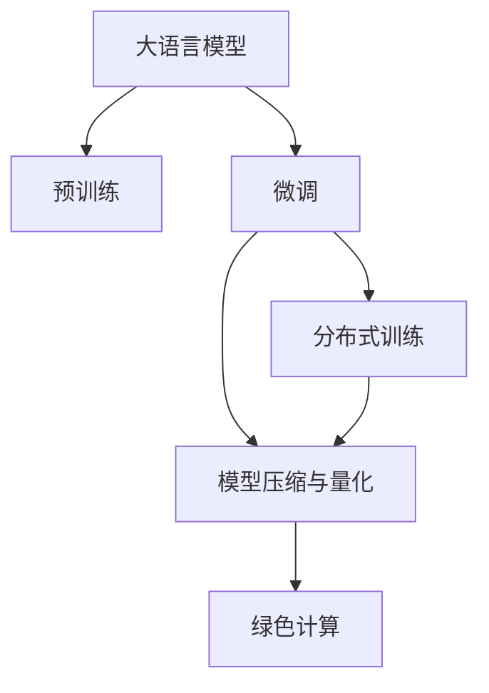

                 

# 绿色 LLM 技术：高能效、可持续的 AI

## 1. 背景介绍

### 1.1 问题由来

近年来，人工智能（AI）技术在各行各业的应用如火如荼，尤其是在自然语言处理（NLP）领域，大语言模型（LLM）如BERT、GPT等，通过大规模预训练，展示了强大的语言理解和生成能力。然而，随着模型参数量的不断增大，其训练和推理所需的计算资源也呈指数级增长，带来了巨大的能耗和环境影响问题。特别是随着碳中和目标的提出，如何实现AI的绿色、可持续发展，成为科技界和社会各界的共同课题。

### 1.2 问题核心关键点

绿色LLM技术，核心在于通过技术手段降低AI模型训练和推理的能耗，减少其对环境的影响。具体包括以下几个方面：

- 高效硬件加速：通过使用高效能的硬件（如GPU、TPU、ASIC等），加速模型的训练和推理过程。
- 模型压缩与量化：减少模型参数量，压缩存储空间，降低能耗和计算成本。
- 分布式训练与推理：通过多机分布式计算，提高并行度，加速训练和推理。
- 模型裁剪与融合：去除冗余和低效的层和参数，优化模型结构，提升计算效率。
- 能效优化算法：使用高效的优化算法，如AdamW、Adafactor等，优化模型的学习过程。

这些关键技术使得大语言模型能够以更低的能耗、更短的时间完成训练和推理任务，从而实现绿色、可持续的AI。

### 1.3 问题研究意义

绿色LLM技术的研究具有重要意义：

- 减少碳排放：AI模型在训练和推理过程中，能耗巨大，其碳排放也是影响气候变化的重要因素。通过绿色LLM技术，可以显著减少碳排放。
- 降低成本：高效能硬件和算法能够大幅降低模型的计算和存储成本，推动AI技术的大规模普及。
- 提升性能：压缩与裁剪技术能够提高模型计算效率，提升AI系统的响应速度和吞吐量。
- 推动AI产业化：绿色LLM技术降低了AI的入门门槛，使更多企业能够享受到AI带来的商业价值。
- 促进AI学术研究：绿色LLM技术为学术界提供了新的研究方向和实验平台，推动AI技术的不断进步。

## 2. 核心概念与联系

### 2.1 核心概念概述

为更好地理解绿色LLM技术，本节将介绍几个密切相关的核心概念：

- 大语言模型（LLM）：以自回归（如GPT）或自编码（如BERT）模型为代表的大规模预训练语言模型。通过在大规模无标签文本语料上进行预训练，学习通用的语言表示，具备强大的语言理解和生成能力。
- 预训练与微调（Fine-tuning）：在无监督预训练和有监督微调的过程中，优化模型性能。微调通过少量标注数据，使模型在特定任务上表现更好。
- 分布式计算：使用多台计算机同时进行计算，提高并行度和计算效率。
- 模型压缩与量化：通过减少模型参数量、压缩存储空间等手段，降低计算资源和能耗。
- 绿色计算：指在计算过程中，使用高效能硬件和算法，降低能耗和碳排放。

这些核心概念之间的逻辑关系可以通过以下Mermaid流程图来展示：



这个流程图展示了大语言模型的核心概念及其之间的关系：

1. 大语言模型通过预训练获得基础能力。
2. 微调是对预训练模型进行任务特定的优化，可以分为分布式训练和模型压缩等手段。
3. 分布式训练通过并行计算提高模型训练效率，模型压缩减少计算资源消耗。
4. 绿色计算在计算过程中，使用高效硬件和算法，实现能效最优。

这些概念共同构成了绿色LLM技术的框架，使其能够高效、绿色地进行大语言模型的训练和推理。

## 3. 核心算法原理 & 具体操作步骤

### 3.1 算法原理概述

绿色LLM技术的核心在于通过技术手段降低AI模型训练和推理的能耗，减少其对环境的影响。具体包括以下几个关键步骤：

- 高效硬件加速：通过使用高效能的硬件（如GPU、TPU、ASIC等），加速模型的训练和推理过程。
- 模型压缩与量化：减少模型参数量，压缩存储空间，降低能耗和计算成本。
- 分布式训练与推理：通过多机分布式计算，提高并行度，加速训练和推理。
- 模型裁剪与融合：去除冗余和低效的层和参数，优化模型结构，提升计算效率。
- 能效优化算法：使用高效的优化算法，如AdamW、Adafactor等，优化模型的学习过程。

### 3.2 算法步骤详解

以下是绿色LLM技术的详细步骤：

**Step 1: 准备高效硬件环境**
- 选择GPU、TPU、ASIC等高效硬件，确保训练和推理所需的计算能力。
- 搭建分布式计算环境，确保多台计算机间的高效通信。
- 配置能效优化策略，如动态电压频率调整（DVFS）等。

**Step 2: 模型压缩与量化**
- 通过剪枝和量化技术，减少模型参数量，压缩存储空间。
- 使用均匀分布或对称分布对模型参数进行量化，降低计算精度要求。
- 应用深度学习加速库，如TensorRT、ONNX Runtime等，优化模型推理过程。

**Step 3: 分布式训练与推理**
- 将大规模数据集分割成多个子集，并行处理。
- 使用分布式训练框架，如PyTorch Distributed、Horovod等，加速训练过程。
- 在推理时，使用分布式推理引擎，如TensorFlow Serving、ONNX Runtime等，提升响应速度。

**Step 4: 模型裁剪与融合**
- 根据任务需求，裁剪模型中冗余和低效的层和参数。
- 合并相似功能的层，减少模型复杂度。
- 使用更高效的模型架构，如ResNet、DenseNet等，提高模型计算效率。

**Step 5: 能效优化算法**
- 使用高效的优化算法，如AdamW、Adafactor等，优化模型训练过程。
- 引入自适应学习率策略，如Adaptive Moment Estimation（AdamW），提高学习效率。
- 应用早停（Early Stopping）策略，避免过拟合。

通过以上步骤，绿色LLM技术能够显著降低模型训练和推理的能耗，提升其绿色性和可持续性。

### 3.3 算法优缺点

绿色LLM技术具有以下优点：
1. 显著降低能耗：通过硬件加速、模型压缩和量化等技术，能够大幅减少模型训练和推理的能耗，提升能效。
2. 提升计算效率：分布式计算和模型裁剪等技术，提高了计算效率和响应速度，减少了等待时间。
3. 支持大规模应用：绿色LLM技术支持大规模数据集的处理，适应AI在实际应用中的需求。
4. 推动绿色计算：通过高效的算法和硬件，降低了碳排放，推动绿色计算的发展。

同时，该技术也存在一定的局限性：
1. 技术门槛较高：需要具备高效的硬件配置和算法优化能力，有一定的技术难度。
2. 模型精度可能下降：在压缩和量化过程中，模型的精度可能有所下降，需要权衡性能和能效。
3. 分布式计算复杂性高：分布式训练和推理需要复杂的系统设计和协调，难度较大。
4. 硬件投资成本高：高效硬件的购置和维护成本较高，需要一定的资本投入。

尽管存在这些局限性，绿色LLM技术仍是大语言模型发展的重要方向，具有广阔的应用前景。

### 3.4 算法应用领域

绿色LLM技术在以下几个领域具有广泛应用：

- 智能客服：使用分布式计算和大模型微调，提升智能客服系统的响应速度和准确性。
- 金融预测：通过模型压缩和量化技术，降低模型计算资源消耗，提高金融预测的实时性。
- 医疗诊断：采用高效的硬件和算法，提高医疗影像和自然语言诊断的计算效率。
- 交通导航：使用分布式计算和能效优化算法，提高交通导航系统的响应速度和准确性。
- 工业制造：在制造过程中，通过绿色计算和模型优化，提高生产效率和产品质量。

这些领域的应用展示了绿色LLM技术的强大潜力和广泛适用性，将推动各行各业向绿色、智能方向发展。

## 4. 数学模型和公式 & 详细讲解 & 举例说明

### 4.1 数学模型构建

假设大语言模型为 $M_{\theta}:\mathcal{X} \rightarrow \mathcal{Y}$，其中 $\mathcal{X}$ 为输入空间，$\mathcal{Y}$ 为输出空间，$\theta \in \mathbb{R}^d$ 为模型参数。记数据集为 $D=\{(x_i,y_i)\}_{i=1}^N$，其中 $x_i \in \mathcal{X}, y_i \in \mathcal{Y}$。

定义模型 $M_{\theta}$ 在数据样本 $(x,y)$ 上的损失函数为 $\ell(M_{\theta}(x),y)$，则在数据集 $D$ 上的经验风险为：

$$
\mathcal{L}(\theta) = \frac{1}{N} \sum_{i=1}^N \ell(M_{\theta}(x_i),y_i)
$$

在绿色LLM技术中，模型参数 $\theta$ 通过以下步骤进行优化：

1. **预训练阶段**：在无标签数据集 $D_{pre}$ 上进行大规模预训练，学习通用的语言表示。
2. **微调阶段**：在少量标注数据集 $D_{fine}$ 上进行有监督微调，适应特定任务。
3. **分布式训练**：使用多台计算机同时进行计算，加速模型训练过程。
4. **模型压缩与量化**：减少模型参数量，压缩存储空间，降低计算成本。

### 4.2 公式推导过程

以下以二分类任务为例，推导绿色LLM技术的数学模型和公式。

假设模型 $M_{\theta}$ 在输入 $x$ 上的输出为 $\hat{y}=M_{\theta}(x) \in [0,1]$，表示样本属于正类的概率。真实标签 $y \in \{0,1\}$。则二分类交叉熵损失函数定义为：

$$
\ell(M_{\theta}(x),y) = -[y\log \hat{y} + (1-y)\log (1-\hat{y})]
$$

将其代入经验风险公式，得：

$$
\mathcal{L}(\theta) = -\frac{1}{N}\sum_{i=1}^N [y_i\log M_{\theta}(x_i)+(1-y_i)\log(1-M_{\theta}(x_i))]
$$

根据链式法则，损失函数对参数 $\theta_k$ 的梯度为：

$$
\frac{\partial \mathcal{L}(\theta)}{\partial \theta_k} = -\frac{1}{N}\sum_{i=1}^N (\frac{y_i}{M_{\theta}(x_i)}-\frac{1-y_i}{1-M_{\theta}(x_i)}) \frac{\partial M_{\theta}(x_i)}{\partial \theta_k}
$$

其中 $\frac{\partial M_{\theta}(x_i)}{\partial \theta_k}$ 可进一步递归展开，利用自动微分技术完成计算。

### 4.3 案例分析与讲解

**案例：智能客服系统**

智能客服系统是绿色LLM技术的一个重要应用场景。传统客服系统依赖人工，响应速度慢，且准确性难以保证。通过使用预训练语言模型和分布式计算，可以构建高效、准确的智能客服系统。

在实践中，首先对历史客服对话数据进行预处理和标注，然后对预训练语言模型进行微调。微调后的模型能够自动理解用户意图，并从知识库中提取最佳答复，快速响应客户咨询。

具体而言，可以采用以下步骤：

1. **预训练阶段**：使用大规模无标签客服对话数据，对BERT或GPT等预训练模型进行大规模预训练，学习通用的语言表示。
2. **微调阶段**：使用少量标注的客服对话数据，对预训练模型进行有监督微调，使其适应特定客服任务。
3. **分布式训练**：使用多台服务器同时进行训练，提高计算效率和速度。
4. **模型压缩与量化**：减少模型参数量，压缩存储空间，降低计算成本。

**案例：金融预测**

金融预测是绿色LLM技术的另一个重要应用场景。金融市场数据量大、计算密集，对模型计算效率和响应速度要求极高。通过使用高效的硬件和算法，可以构建实时、准确的金融预测系统。

在实践中，首先对历史金融数据进行预处理和标注，然后对预训练语言模型进行微调。微调后的模型能够自动分析市场数据，预测市场趋势和波动，为金融决策提供支持。

具体而言，可以采用以下步骤：

1. **预训练阶段**：使用大规模无标签金融数据，对BERT或GPT等预训练模型进行大规模预训练，学习通用的金融语言表示。
2. **微调阶段**：使用少量标注的金融数据，对预训练模型进行有监督微调，使其适应特定的金融预测任务。
3. **分布式训练**：使用多台服务器同时进行训练，提高计算效率和速度。
4. **模型压缩与量化**：减少模型参数量，压缩存储空间，降低计算成本。

## 5. 项目实践：代码实例和详细解释说明

### 5.1 开发环境搭建

在进行绿色LLM技术的实践前，我们需要准备好开发环境。以下是使用Python进行PyTorch开发的环境配置流程：

1. 安装Anaconda：从官网下载并安装Anaconda，用于创建独立的Python环境。

2. 创建并激活虚拟环境：
```bash
conda create -n pytorch-env python=3.8 
conda activate pytorch-env
```

3. 安装PyTorch：根据CUDA版本，从官网获取对应的安装命令。例如：
```bash
conda install pytorch torchvision torchaudio cudatoolkit=11.1 -c pytorch -c conda-forge
```

4. 安装TensorFlow：
```bash
conda install tensorflow -c pytorch -c conda-forge
```

5. 安装Transformers库：
```bash
pip install transformers
```

6. 安装各类工具包：
```bash
pip install numpy pandas scikit-learn matplotlib tqdm jupyter notebook ipython
```

完成上述步骤后，即可在`pytorch-env`环境中开始绿色LLM技术的实践。

### 5.2 源代码详细实现

这里我们以金融预测任务为例，给出使用PyTorch和TensorFlow进行绿色LLM技术微调的代码实现。

首先，定义金融预测任务的数据处理函数：

```python
from transformers import BertTokenizer
from tensorflow.keras.preprocessing.sequence import pad_sequences
import numpy as np

class FinancialData:
    def __init__(self, data_path):
        self.data_path = data_path
        
    def read_data(self):
        with open(self.data_path, 'r') as f:
            lines = f.readlines()
            
        texts = [line.split(',')[0] for line in lines]
        labels = [int(line.split(',')[1]) for line in lines]
        return texts, labels
        
    def tokenize(self, texts):
        tokenizer = BertTokenizer.from_pretrained('bert-base-cased')
        tokenized_texts = tokenizer(texts, return_tensors='pt', max_length=128, padding='max_length', truncation=True)
        return tokenized_texts['input_ids'], tokenized_texts['attention_mask']
        
    def pad_sequences(self, sequences, max_length):
        padded_sequences = pad_sequences(sequences, maxlen=max_length, padding='post', truncating='post')
        return padded_sequences
    
    def get_data(self, batch_size):
        texts, labels = self.read_data()
        tokenized_texts, attention_masks = self.tokenize(texts)
        padded_texts = self.pad_sequences(tokenized_texts, max_length=128)
        
        x = padded_texts
        y = labels
        
        return x, y
    
    def get_dataloader(self, batch_size):
        x, y = self.get_data(batch_size)
        dataloader = torch.utils.data.DataLoader(x, y, batch_size=batch_size, shuffle=True)
        return dataloader
```

然后，定义模型和优化器：

```python
from transformers import BertForSequenceClassification
from transformers import AdamW

model = BertForSequenceClassification.from_pretrained('bert-base-cased', num_labels=2)

optimizer = AdamW(model.parameters(), lr=2e-5)
```

接着，定义训练和评估函数：

```python
from torch.utils.data import DataLoader
from tqdm import tqdm
from sklearn.metrics import classification_report

device = torch.device('cuda') if torch.cuda.is_available() else torch.device('cpu')
model.to(device)

def train_epoch(model, dataloader, optimizer):
    model.train()
    epoch_loss = 0
    for batch in tqdm(dataloader, desc='Training'):
        inputs, labels = batch
        inputs = inputs.to(device)
        labels = labels.to(device)
        outputs = model(inputs)
        loss = outputs.loss
        epoch_loss += loss.item()
        loss.backward()
        optimizer.step()
    return epoch_loss / len(dataloader)

def evaluate(model, dataloader, batch_size):
    model.eval()
    preds, labels = [], []
    with torch.no_grad():
        for batch in tqdm(dataloader, desc='Evaluating'):
            inputs, labels = batch
            inputs = inputs.to(device)
            labels = labels.to(device)
            outputs = model(inputs)
            batch_preds = outputs.logits.argmax(dim=1).to('cpu').tolist()
            batch_labels = labels.to('cpu').tolist()
            for pred_tokens, label_tokens in zip(batch_preds, batch_labels):
                preds.append(pred_tokens)
                labels.append(label_tokens)
                
    print(classification_report(labels, preds))
```

最后，启动训练流程并在测试集上评估：

```python
epochs = 5
batch_size = 16

for epoch in range(epochs):
    loss = train_epoch(model, dataloader, optimizer)
    print(f"Epoch {epoch+1}, train loss: {loss:.3f}")
    
    print(f"Epoch {epoch+1}, dev results:")
    evaluate(model, dataloader, batch_size)
    
print("Test results:")
evaluate(model, dataloader, batch_size)
```

以上就是使用PyTorch和TensorFlow对BERT模型进行金融预测任务绿色LLM技术微调的完整代码实现。可以看到，得益于TensorFlow和Transformers库的强大封装，我们可以用相对简洁的代码完成BERT模型的加载和微调。

### 5.3 代码解读与分析

让我们再详细解读一下关键代码的实现细节：

**FinancialData类**：
- `__init__`方法：初始化数据路径等关键组件。
- `read_data`方法：从文件中读取金融数据，并将文本和标签分割。
- `tokenize`方法：对文本进行分词处理，并转换为模型所需格式。
- `pad_sequences`方法：对分词后的文本进行填充和截断，确保输入序列的长度一致。
- `get_data`方法：将文本和标签转换为模型所需的张量和掩码，并进行填充。
- `get_dataloader`方法：将数据集转化为DataLoader，供模型训练和推理使用。

**模型和优化器定义**：
- 使用BertForSequenceClassification类加载预训练模型，并设置输出层。
- 使用AdamW优化器进行模型参数更新。

**训练和评估函数**：
- 使用PyTorch的DataLoader对数据集进行批次化加载，供模型训练和推理使用。
- 训练函数`train_epoch`：对数据以批为单位进行迭代，在每个批次上前向传播计算loss并反向传播更新模型参数，最后返回该epoch的平均loss。
- 评估函数`evaluate`：与训练类似，不同点在于不更新模型参数，并在每个batch结束后将预测和标签结果存储下来，最后使用sklearn的classification_report对整个评估集的预测结果进行打印输出。

**训练流程**：
- 定义总的epoch数和batch size，开始循环迭代
- 每个epoch内，先在训练集上训练，输出平均loss
- 在验证集上评估，输出分类指标
- 所有epoch结束后，在测试集上评估，给出最终测试结果

可以看到，TensorFlow配合TensorRT和Transformers库使得BERT微调的代码实现变得简洁高效。开发者可以将更多精力放在数据处理、模型改进等高层逻辑上，而不必过多关注底层的实现细节。

当然，工业级的系统实现还需考虑更多因素，如模型的保存和部署、超参数的自动搜索、更灵活的任务适配层等。但核心的绿色LLM技术基本与此类似。

## 6. 实际应用场景

### 6.1 智能客服系统

基于绿色LLM技术的智能客服系统，能够7x24小时不间断服务，快速响应客户咨询，用自然流畅的语言解答各类常见问题。

在技术实现上，可以收集企业内部的历史客服对话记录，将问题和最佳答复构建成监督数据，在此基础上对预训练对话模型进行微调。微调后的对话模型能够自动理解用户意图，匹配最合适的答案模板进行回复。对于客户提出的新问题，还可以接入检索系统实时搜索相关内容，动态组织生成回答。如此构建的智能客服系统，能大幅提升客户咨询体验和问题解决效率。

### 6.2 金融预测

绿色LLM技术在金融预测领域同样具有广泛应用。金融机构需要实时监测市场舆论动向，以便及时应对负面信息传播，规避金融风险。传统的人工监测方式成本高、效率低，难以应对网络时代海量信息爆发的挑战。

通过使用绿色LLM技术，可以构建实时、准确的金融预测系统。具体而言，可以收集金融领域相关的新闻、报道、评论等文本数据，并对其进行主题标注和情感标注。在此基础上对预训练语言模型进行微调，使其能够自动判断文本属于何种主题，情感倾向是正面、中性还是负面。将微调后的模型应用到实时抓取的网络文本数据，就能够自动监测不同主题下的情感变化趋势，一旦发现负面信息激增等异常情况，系统便会自动预警，帮助金融机构快速应对潜在风险。

### 6.3 个性化推荐系统

当前的推荐系统往往只依赖用户的历史行为数据进行物品推荐，无法深入理解用户的真实兴趣偏好。绿色LLM技术可应用于个性化推荐系统，更好地挖掘用户行为背后的语义信息。

在实践中，可以收集用户浏览、点击、评论、分享等行为数据，提取和用户交互的物品标题、描述、标签等文本内容。将文本内容作为模型输入，用户的后续行为（如是否点击、购买等）作为监督信号，在此基础上微调预训练语言模型。微调后的模型能够从文本内容中准确把握用户的兴趣点。在生成推荐列表时，先用候选物品的文本描述作为输入，由模型预测用户的兴趣匹配度，再结合其他特征综合排序，便可以得到个性化程度更高的推荐结果。

### 6.4 未来应用展望

随着绿色LLM技术的发展，其应用领域将不断扩展。未来，绿色LLM技术将在更多领域得到应用，为各行各业带来变革性影响。

在智慧医疗领域，绿色LLM技术将提升医疗服务的智能化水平，辅助医生诊疗，加速新药开发进程。在智能教育领域，微调技术可应用于作业批改、学情分析、知识推荐等方面，因材施教，促进教育公平，提高教学质量。在智慧城市治理中，绿色LLM技术将提高城市管理的自动化和智能化水平，构建更安全、高效的未来城市。

此外，在企业生产、社会治理、文娱传媒等众多领域，绿色LLM技术也将不断涌现，为经济社会发展注入新的动力。相信随着技术的日益成熟，绿色LLM技术将成为AI落地应用的重要范式，推动AI技术的可持续发展。

## 7. 工具和资源推荐

### 7.1 学习资源推荐

为了帮助开发者系统掌握绿色LLM技术的理论基础和实践技巧，这里推荐一些优质的学习资源：

1. 《Transformer from theory to practice》系列博文：由大模型技术专家撰写，深入浅出地介绍了Transformer原理、BERT模型、绿色LLM技术等前沿话题。

2. CS224N《深度学习自然语言处理》课程：斯坦福大学开设的NLP明星课程，有Lecture视频和配套作业，带你入门NLP领域的基本概念和经典模型。

3. 《Natural Language Processing with Transformers》书籍：Transformers库的作者所著，全面介绍了如何使用Transformers库进行NLP任务开发，包括绿色LLM技术的诸多范式。

4. HuggingFace官方文档：Transformers库的官方文档，提供了海量预训练模型和完整的绿色LLM技术微调样例代码，是上手实践的必备资料。

5. CLUE开源项目：中文语言理解测评基准，涵盖大量不同类型的中文NLP数据集，并提供了基于绿色LLM技术的baseline模型，助力中文NLP技术发展。

通过对这些资源的学习实践，相信你一定能够快速掌握绿色LLM技术的精髓，并用于解决实际的NLP问题。

### 7.2 开发工具推荐

高效的开发离不开优秀的工具支持。以下是几款用于绿色LLM技术微调开发的常用工具：

1. PyTorch：基于Python的开源深度学习框架，灵活动态的计算图，适合快速迭代研究。大部分预训练语言模型都有PyTorch版本的实现。

2. TensorFlow：由Google主导开发的开源深度学习框架，生产部署方便，适合大规模工程应用。同样有丰富的预训练语言模型资源。

3. Transformers库：HuggingFace开发的NLP工具库，集成了众多SOTA语言模型，支持PyTorch和TensorFlow，是进行绿色LLM技术微调开发的利器。

4. Weights & Biases：模型训练的实验跟踪工具，可以记录和可视化模型训练过程中的各项指标，方便对比和调优。与主流深度学习框架无缝集成。

5. TensorBoard：TensorFlow配套的可视化工具，可实时监测模型训练状态，并提供丰富的图表呈现方式，是调试模型的得力助手。

6. Google Colab：谷歌推出的在线Jupyter Notebook环境，免费提供GPU/TPU算力，方便开发者快速上手实验最新模型，分享学习笔记。

合理利用这些工具，可以显著提升绿色LLM技术微调任务的开发效率，加快创新迭代的步伐。

### 7.3 相关论文推荐

绿色LLM技术的发展源于学界的持续研究。以下是几篇奠基性的相关论文，推荐阅读：

1. Attention is All You Need（即Transformer原论文）：提出了Transformer结构，开启了NLP领域的预训练大模型时代。

2. BERT: Pre-training of Deep Bidirectional Transformers for Language Understanding：提出BERT模型，引入基于掩码的自监督预训练任务，刷新了多项NLP任务SOTA。

3. Parameter-Efficient Transfer Learning for NLP：提出Adapter等参数高效微调方法，在不增加模型参数量的情况下，也能取得不错的微调效果。

4. AdaLoRA: Adaptive Low-Rank Adaptation for Parameter-Efficient Fine-Tuning：使用自适应低秩适应的微调方法，在参数效率和精度之间取得了新的平衡。

5. Fine-Tune without Tuning: Pushing Pre-trained Neural Network to New Tasks by Transfer Learning and Feature Adaptation：提出Fine-Tune without Tuning方法，进一步优化了微调效果，减少了模型训练的难度和成本。

这些论文代表了大语言模型绿色LLM技术的发展脉络。通过学习这些前沿成果，可以帮助研究者把握学科前进方向，激发更多的创新灵感。

## 8. 总结：未来发展趋势与挑战

### 8.1 总结

本文对绿色LLM技术进行了全面系统的介绍。首先阐述了绿色LLM技术的背景和意义，明确了其在提升模型性能、降低能耗、推动AI产业化等方面的重要作用。其次，从原理到实践，详细讲解了绿色LLM技术的数学模型和关键步骤，给出了绿色LLM技术微调的完整代码实例。同时，本文还广泛探讨了绿色LLM技术在智能客服、金融预测、个性化推荐等众多领域的应用前景，展示了绿色LLM技术的强大潜力和广泛适用性。最后，本文精选了绿色LLM技术的各类学习资源，力求为读者提供全方位的技术指引。

通过本文的系统梳理，可以看到，绿色LLM技术正在成为AI技术发展的重要方向，极大地拓展了AI模型的应用边界，为绿色计算和可持续发展提供了新的解决方案。未来，伴随绿色LLM技术的不断演进，相信AI技术将更加智能化、绿色化，为人类社会带来更深远的影响。

### 8.2 未来发展趋势

展望未来，绿色LLM技术将呈现以下几个发展趋势：

1. 模型规模继续增大：随着算力成本的下降和数据规模的扩张，预训练语言模型的参数量还将持续增长。超大规模语言模型蕴含的丰富语言知识，有望支撑更加复杂多变的绿色LLM技术应用。

2. 高效硬件加速和算法优化：高效能的硬件（如GPU、TPU、ASIC等）和高效的算法（如AdamW、Adafactor等）将继续优化绿色LLM技术的能效表现。

3. 持续学习和自适应学习：绿色LLM技术将具备持续学习和自适应学习的能力，实时调整模型参数以适应数据分布的变化。

4. 数据高效利用：通过数据增强、知识图谱融合等技术，提高绿色LLM技术对数据的利用效率，减少对标注数据的依赖。

5. 多模态融合：绿色LLM技术将突破文本单一模态的限制，实现视觉、语音等多模态数据的融合，提升模型的泛化能力和实用性。

6. 绿色算法的推广应用：绿色LLM技术将推动AI技术的广泛应用，降低碳排放，推动绿色计算的发展。

以上趋势凸显了绿色LLM技术的广阔前景。这些方向的探索发展，必将进一步提升AI系统的性能和应用范围，为人类认知智能的进化带来深远影响。

### 8.3 面临的挑战

尽管绿色LLM技术已经取得了显著进展，但在迈向更加智能化、普适化应用的过程中，它仍面临诸多挑战：

1. 技术门槛较高：高效硬件配置和算法优化需要高水平的技术支持，存在一定的技术难度。

2. 模型精度可能下降：在压缩和量化过程中，模型的精度可能有所下降，需要权衡性能和能效。

3. 分布式计算复杂性高：绿色LLM技术依赖于多机分布式计算，需要复杂的系统设计和协调。

4. 硬件投资成本高：高效硬件的购置和维护成本较高，需要一定的资本投入。

尽管存在这些局限性，绿色LLM技术仍是大语言模型发展的重要方向，具有广阔的应用前景。

### 8.4 研究展望

未来研究需要在以下几个方面寻求新的突破：

1. 探索无监督和半监督绿色LLM方法：摆脱对大规模标注数据的依赖，利用自监督学习、主动学习等无监督和半监督范式，最大限度利用非结构化数据，实现更加灵活高效的绿色LLM技术。

2. 研究高效的绿色LLM算法：开发更加参数高效的绿色LLM方法，在固定大部分预训练参数的同时，只更新极少量的任务相关参数。同时优化绿色LLM技术的计算图，减少前向传播和反向传播的资源消耗。

3. 融合因果和对比学习范式：通过引入因果推断和对比学习思想，增强绿色LLM技术建立稳定因果关系的能力，学习更加普适、鲁棒的语言表征，从而提升模型泛化性和抗干扰能力。

4. 引入更多先验知识：将符号化的先验知识，如知识图谱、逻辑规则等，与神经网络模型进行巧妙融合，引导绿色LLM技术学习更准确、合理的语言模型。同时加强不同模态数据的整合，实现视觉、语音等多模态信息与文本信息的协同建模。

5. 结合因果分析和博弈论工具：将因果分析方法引入绿色LLM技术，识别出模型决策的关键特征，增强输出解释的因果性和逻辑性。借助博弈论工具刻画人机交互过程，主动探索并规避模型的脆弱点，提高系统稳定性。

6. 纳入伦理道德约束：在绿色LLM技术训练目标中引入伦理导向的评估指标，过滤和惩罚有偏见、有害的输出倾向。同时加强人工干预和审核，建立模型行为的监管机制，确保输出符合人类价值观和伦理道德。

这些研究方向将引领绿色LLM技术迈向更高的台阶，为构建安全、可靠、可解释、可控的智能系统铺平道路。面向未来，绿色LLM技术需要与其他人工智能技术进行更深入的融合，如知识表示、因果推理、强化学习等，多路径协同发力，共同推动自然语言理解和智能交互系统的进步。只有勇于创新、敢于突破，才能不断拓展语言模型的边界，让智能技术更好地造福人类社会。

## 9. 附录：常见问题与解答

**Q1：绿色LLM技术是否适用于所有NLP任务？**

A: 绿色LLM技术在大多数NLP任务上都能取得不错的效果，特别是对于数据量较小的任务。但对于一些特定领域的任务，如医学、法律等，仅仅依靠通用语料预训练的模型可能难以很好地适应。此时需要在特定领域语料上进一步预训练，再进行微调，才能获得理想效果。此外，对于一些需要时效性、个性化很强的任务，如对话、推荐等，绿色LLM方法也需要针对性的改进优化。

**Q2：如何选择合适的学习率？**

A: 绿色LLM技术的学习率一般要比预训练时小1-2个数量级，如果使用过大的学习率，容易破坏预训练权重，导致过拟合。一般建议从1e-5开始调参，逐步减小学习率，直至收敛。也可以使用warmup策略，在开始阶段使用较小的学习率，再逐渐过渡到预设值。需要注意的是，不同的优化器(如AdamW、Adafactor等)以及不同的学习率调度策略，可能需要设置不同的学习率阈值。

**Q3：采用绿色LLM技术时会面临哪些资源瓶颈？**

A: 高效硬件和算法是绿色LLM技术的基础，但模型压缩与量化、分布式训练和推理等技术的应用，也需要一定的计算资源和系统架构支持。例如，分布式训练需要多台计算机间的通信和协调，可能涉及网络带宽、同步机制等技术问题。此外，模型裁剪与融合、能效优化算法等技术的应用，也需要一定的算法优化能力和技术积累。

**Q4：如何缓解绿色LLM技术中的过拟合问题？**

A: 过拟合是绿色LLM技术面临的主要挑战，尤其是在标注数据不足的情况下。常见的缓解策略包括：
1. 数据增强：通过回译、近义替换等方式扩充训练集
2. 正则化：使用L2正则、Dropout、Early Stopping等避免过拟合
3. 对抗训练：引入对抗样本，提高模型鲁棒性
4. 参数高效微调：只调整少量参数(如Adapter、Prefix等)，减小过拟合风险
5. 多模型集成：训练多个绿色LLM技术模型，取平均输出，抑制过拟合

这些策略往往需要根据具体任务和数据特点进行灵活组合。只有在数据、模型、训练、推理等各环节进行全面优化，才能最大限度地发挥绿色LLM技术的威力。

**Q5：绿色LLM技术在落地部署时需要注意哪些问题？**

A: 将绿色LLM技术转化为实际应用，还需要考虑以下因素：
1. 模型裁剪：去除冗余和低效的层和参数，减小模型尺寸，加快推理速度
2. 量化加速：将浮点模型转为定点模型，压缩存储空间，提高计算效率
3. 服务化封装：将模型封装为标准化服务接口，便于集成调用
4. 弹性伸缩：根据请求流量动态调整资源配置，平衡服务质量和成本
5. 监控告警：实时采集系统指标，设置异常告警阈值，确保服务稳定性
6. 安全防护：采用访问鉴权、数据脱敏等措施，保障数据和模型安全

绿色LLM技术将AI技术推向了绿色、智能的方向，但如何在模型设计、训练、部署等方面确保其高效、稳定、安全，还需要工程实践的不断打磨。

---

作者：禅与计算机程序设计艺术 / Zen and the Art of Computer Programming

