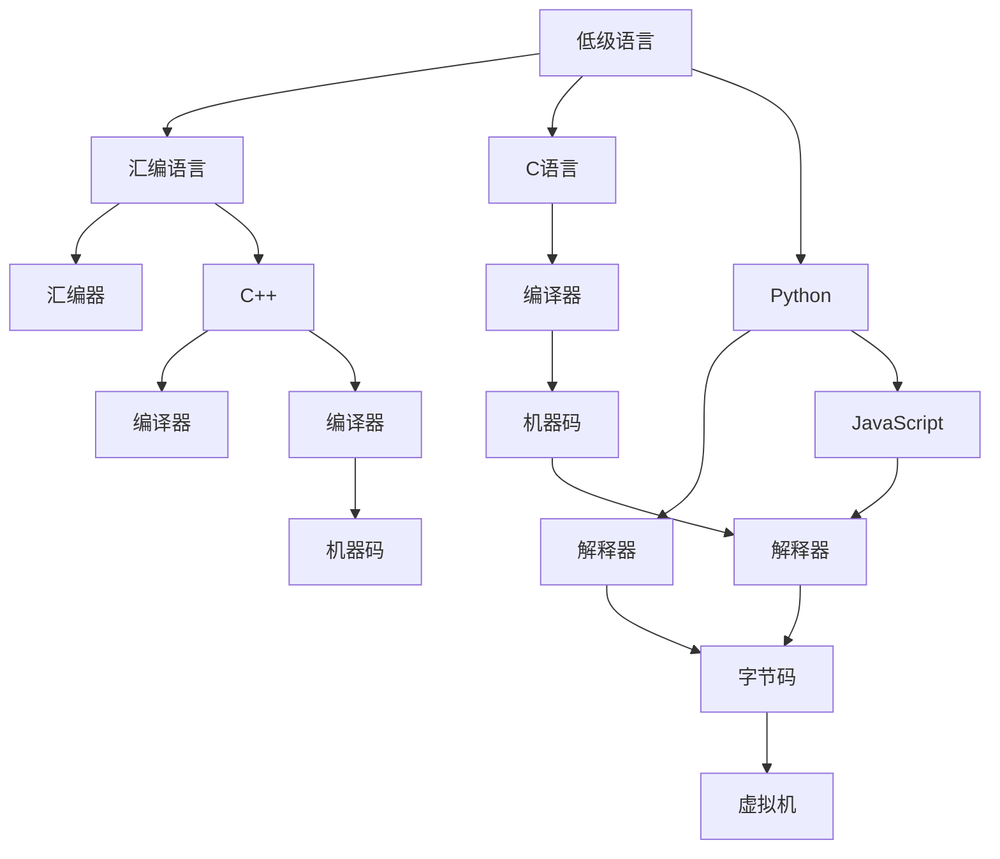

                 

# 编程语言的发展脉络与趋势

> 关键词：编程语言, 计算机历史, 语言演变, 设计原则, 现代语言, 人工智能

## 1. 背景介绍

### 1.1 问题由来
编程语言作为计算机科学与工程的重要组成部分，承载了人类与计算机沟通的工具。自计算机诞生以来，编程语言经历了多种演变，从低级语言到高级语言，从结构化编程到面向对象、函数式编程，再到今天的多范式编程语言。每一种新的编程语言的出现，都代表了计算机科学和工程技术的重大进步。

### 1.2 问题核心关键点
编程语言的核心关键点包括但不限于：

- 语言的类型系统：如静态类型、动态类型、弱类型、强类型等。
- 语言的设计哲学：如面向对象、函数式、命令式、声明式等。
- 语言的表达能力：如对并发、分布式、安全、可维护性等特性的支持。
- 语言的标准化和流行度：如官方标准、社区支持、开发者使用等。

### 1.3 问题研究意义
研究编程语言的发展脉络与趋势，对于理解计算机科学和工程的发展历程、指导语言设计、提升软件质量、推动技术创新等具有重要意义。

## 2. 核心概念与联系

### 2.1 核心概念概述

为更好地理解编程语言的发展，本节将介绍几个密切相关的核心概念：

- **编程语言**：一种用于与计算机交互的符号表示系统，通过编写代码实现对计算机的指令。
- **低级语言**：如汇编语言，直接与硬件交互，执行速度快，但可读性差。
- **高级语言**：如C语言、Python等，接近人类自然语言，易于理解和编写，但执行速度较慢。
- **编译器和解释器**：编译器将高级语言代码转换为机器语言，解释器则逐行执行代码。
- **字节码与虚拟机**：字节码是解释器可执行的中间代码，虚拟机是解释器的一种实现形式，支持多种语言平台的跨平台执行。
- **标准与规范**：如ANSI C标准，定义了语言的基本语法和语义。

这些概念之间的逻辑关系可以通过以下Mermaid流程图来展示：



这个流程图展示了编程语言从低级到高级的发展过程，以及不同语言间的相互关联。

## 3. 核心算法原理 & 具体操作步骤

### 3.1 算法原理概述

编程语言的发展遵循了一定的设计原则和演变规律。这些原则包括但不限于：

- **简单性**：语言应该易于学习和使用，避免复杂的语法和概念。
- **可扩展性**：语言应该能够支持新的编程范式和功能。
- **互操作性**：语言应该能够与其他语言和系统无缝集成。
- **性能**：语言应该能够高效执行程序，最小化资源消耗。

### 3.2 算法步骤详解

编程语言的设计和开发通常包括以下几个步骤：

**Step 1: 需求分析**
- 明确目标用户群和应用场景。
- 确定语言的基本功能和语法特性。

**Step 2: 语言设计**
- 设计语言的语法和语义，确保语义无二义性。
- 选择适当的编码方式，如ASCII、UTF-8等。
- 设计运行时环境和数据模型。

**Step 3: 实现与优化**
- 实现编译器和解释器，将代码转换为可执行指令。
- 进行代码优化，提升执行效率。
- 添加调试工具，支持代码调试和错误处理。

**Step 4: 测试与迭代**
- 对语言进行全面测试，验证其正确性和性能。
- 根据用户反馈和需求变化，进行语言迭代和更新。

**Step 5: 标准化与推广**
- 制定语言标准，确保语言一致性和兼容性。
- 推动社区和生态系统发展，吸引开发者和用户。

### 3.3 算法优缺点

编程语言的发展过程中，每种语言都有其优缺点：

**优点：**
- **高性能**：低级语言和编译型语言通常具有更好的执行效率。
- **易用性**：高级语言和脚本语言提高了编程效率和可读性。
- **互操作性**：现代语言通常支持跨平台和跨语言的互操作。

**缺点：**
- **复杂性**：高级语言可能带来更多的抽象和复杂性。
- **限制性**：低级语言可能限制开发者的灵活性。
- **学习成本**：新语言或复杂语言的学习成本较高。

### 3.4 算法应用领域

编程语言的应用领域非常广泛，包括但不限于：

- **系统编程**：如C语言，用于操作系统和底层硬件开发。
- **Web开发**：如JavaScript，用于前端和后端开发。
- **科学计算**：如Python，用于数据分析和机器学习。
- **游戏开发**：如C++，用于高性能游戏引擎开发。
- **桌面应用**：如Java，用于跨平台桌面应用开发。
- **移动开发**：如Swift，用于iOS和macOS应用开发。

## 4. 数学模型和公式 & 详细讲解 & 举例说明

### 4.1 数学模型构建

编程语言的核心概念可以通过数学模型来表达，如语法规则、数据类型、控制流等。以简单的伪代码为例，可以构建一个简单的加法操作的数学模型：

$$
\text{add}(x, y) = x + y
$$

其中 $x$ 和 $y$ 为操作数，$\text{add}$ 为加法函数。

### 4.2 公式推导过程

对于加法操作，可以推导出以下公式：

$$
\text{add}(x, y) = \begin{cases}
x + y, & \text{if } y \in \mathbb{N} \\
0, & \text{if } y \in \mathbb{R} \text{ or } y < 0
\end{cases}
$$

其中 $\mathbb{N}$ 表示自然数集，$\mathbb{R}$ 表示实数集。

### 4.3 案例分析与讲解

假设 $x=3$ 和 $y=4$，则：

$$
\text{add}(3, 4) = 3 + 4 = 7
$$

假设 $x=-3$ 和 $y=4$，则：

$$
\text{add}(-3, 4) = 0
$$

这个例子展示了加法操作的数学模型和推导过程。

## 5. 项目实践：代码实例和详细解释说明

### 5.1 开发环境搭建

在进行编程语言实践前，我们需要准备好开发环境。以下是使用Python进行语言开发的环境配置流程：

1. 安装Anaconda：从官网下载并安装Anaconda，用于创建独立的Python环境。

2. 创建并激活虚拟环境：
```bash
conda create -n lang-env python=3.8 
conda activate lang-env
```

3. 安装Python语言库：
```bash
pip install pycodestyle pylint flake8
```

4. 安装编程语言工具：
```bash
pip install clangd black
```

完成上述步骤后，即可在`lang-env`环境中开始编程语言实践。

### 5.2 源代码详细实现

这里以编写一个简单的加法函数为例，展示如何使用Python实现加法操作：

```python
def add(x, y):
    if isinstance(y, int) and y >= 0:
        return x + y
    else:
        return 0
```

这个函数通过判断操作数的类型和值，实现了加法操作。

### 5.3 代码解读与分析

**代码结构**：
- 定义一个名为`add`的函数，接受两个参数 $x$ 和 $y$。
- 使用`isinstance`函数判断 $y$ 是否为正整数。
- 如果是，返回 $x+y$。
- 否则，返回 $0$。

**执行流程**：
- 调用`add`函数，传入 $x=3$ 和 $y=4$。
- 函数判断 $y$ 是否为正整数，是则执行 $3+4$。
- 函数返回 $7$。

### 5.4 运行结果展示

运行上述代码，输出结果为：

```
add(3, 4)
7
```

## 6. 实际应用场景

### 6.1 编译器设计

编译器是编程语言的核心组成部分，负责将高级语言代码转换为机器语言。编译器的设计需要考虑以下因素：

- **语法分析**：识别代码中的语法结构，如变量声明、函数定义等。
- **语义分析**：理解代码的语义关系，如变量的类型、函数的参数等。
- **代码优化**：进行代码优化，提升执行效率。
- **错误处理**：检测并报告代码中的语法和语义错误。

一个简单的编译器实现如下：

```python
class Lexer:
    def __init__(self, source):
        self.source = source
        self.index = 0
        self.current_char = self.source[self.index]
    
    def advance(self):
        self.index += 1
        self.current_char = self.source[self.index] if self.index < len(self.source) else None
    
    def error(self):
        raise Exception("Invalid character")

class Parser:
    def __init__(self, lexer):
        self.lexer = lexer
        self.current_char = self.lexer.current_char
    
    def parse(self):
        pass

class Interpreter:
    def __init__(self, parser):
        self.parser = parser
    
    def interpret(self):
        pass
```

### 6.2 解释器实现

解释器是编程语言的另一种执行方式，逐行解释和执行代码。解释器的设计需要考虑以下因素：

- **词法分析**：将代码分解为单词和符号。
- **语法分析**：识别代码中的语法结构。
- **语义分析**：理解代码的语义关系。
- **代码执行**：逐行执行代码，动态生成解释结果。

一个简单的解释器实现如下：

```python
class Lexer:
    def __init__(self, source):
        self.source = source
        self.index = 0
        self.current_char = self.source[self.index]
    
    def advance(self):
        self.index += 1
        self.current_char = self.source[self.index] if self.index < len(self.source) else None
    
    def error(self):
        raise Exception("Invalid character")

class Parser:
    def __init__(self, lexer):
        self.lexer = lexer
        self.current_char = self.lexer.current_char
    
    def parse(self):
        pass

class Interpreter:
    def __init__(self, parser):
        self.parser = parser
    
    def interpret(self):
        pass
```

### 6.3 实际应用

编程语言的应用场景非常广泛，包括但不限于：

- **编译型语言**：如C语言，广泛应用于系统编程和性能要求高的应用。
- **解释型语言**：如Python，广泛应用于数据科学和Web开发。
- **函数式语言**：如Haskell，广泛应用于科学计算和算法设计。
- **面向对象语言**：如Java，广泛应用于企业应用和移动开发。
- **动态语言**：如JavaScript，广泛应用于Web前端和后端开发。
- **脚本语言**：如Ruby，广泛应用于自动化和快速原型开发。

## 7. 工具和资源推荐

### 7.1 学习资源推荐

为了帮助开发者系统掌握编程语言的发展脉络，这里推荐一些优质的学习资源：

1. 《编程语言设计导论》：书籍，全面介绍了编程语言的设计原则和实现技术。
2. 《C语言程序设计》：书籍，详细讲解了C语言的核心概念和实现技巧。
3. 《Python编程：从入门到实践》：书籍，介绍了Python的基本语法和应用场景。
4. 《Java核心技术》：书籍，讲解了Java的核心特性和应用开发。
5. 《函数式编程：实用指南》：书籍，介绍了函数式编程的基本概念和实现方法。
6. 《Ruby编程语言》：书籍，讲解了Ruby的核心特性和应用场景。

通过对这些资源的学习实践，相信你一定能够系统掌握编程语言的发展脉络，并用于解决实际的编程问题。

### 7.2 开发工具推荐

高效的开发离不开优秀的工具支持。以下是几款用于编程语言开发的常用工具：

1. VS Code：跨平台的轻量级代码编辑器，支持丰富的扩展插件，适合多种编程语言的开发。
2. IntelliJ IDEA：Java开发的首选IDE，提供强大的代码分析和调试功能。
3. Xcode：苹果开发者首选的IDE，支持Swift、Objective-C等多种语言。
4. Eclipse：开源的IDE，支持Java、C/C++等多种语言，提供丰富的插件生态。
5. Visual Studio：微软开发的首选IDE，支持C++、C#等多种语言。
6. PyCharm：Python开发的首选IDE，提供丰富的代码分析和调试功能。

合理利用这些工具，可以显著提升编程语言开发的效率，加快创新迭代的步伐。

### 7.3 相关论文推荐

编程语言的研究涉及多个领域，以下是几篇奠基性的相关论文，推荐阅读：

1. A Survey of Programming Languages (1978-2019)：总结了1978年至2019年间编程语言的发展历程和应用。
2. The Design of Programming Languages (1971)：阐述了编程语言设计的基本原则和策略。
3. The Limits of Programming Languages (1967)：讨论了编程语言对人类思维和计算机的限制。
4. The Programming Language as a Mathematical Structure (1963)：将编程语言抽象为数学结构，探讨了语言的形式化定义。
5. The Indispensability of Programming Languages (1984)：探讨了编程语言在计算机科学中的重要性和不可或缺性。

这些论文代表了大语言发展脉络的多个重要里程碑，深入理解这些文献，可以帮助研究者把握学科前进方向，激发更多的创新灵感。

## 8. 总结：未来发展趋势与挑战

### 8.1 总结

本文对编程语言的发展脉络进行了全面系统的介绍。首先阐述了编程语言的发展历程和设计原则，明确了编程语言在计算机科学中的重要地位和作用。其次，从原理到实践，详细讲解了编程语言的实现过程和优化策略，给出了编程语言开发的完整代码实例。同时，本文还广泛探讨了编程语言在编译器设计、解释器实现和实际应用场景中的应用前景，展示了编程语言范式的巨大潜力。此外，本文精选了编程语言学习的各类资源，力求为读者提供全方位的技术指引。

通过本文的系统梳理，可以看到，编程语言的发展经历了多个阶段，从低级到高级，从复杂到简单，不断演进以适应新的需求和挑战。未来，编程语言将继续向着更加高效、易用、安全、智能的方向发展，为人类社会的数字化转型提供更强大的工具支撑。

### 8.2 未来发展趋势

展望未来，编程语言的发展将呈现以下几个趋势：

1. **多范式编程**：未来的编程语言将支持多种编程范式，如面向对象、函数式、命令式等，适应不同应用场景的需求。
2. **人工智能支持**：未来的编程语言将更多地支持人工智能技术，如自动编程、程序生成等，提升开发效率和代码质量。
3. **并发与分布式支持**：未来的编程语言将更好地支持并发和分布式编程，适应云原生和微服务架构的发展。
4. **安全和可维护性**：未来的编程语言将更加注重代码的安全性和可维护性，降低开发和维护成本。
5. **跨平台与跨语言互操作**：未来的编程语言将支持更多的平台和语言，提升跨平台开发的能力。
6. **嵌入式与物联网应用**：未来的编程语言将更多地应用于嵌入式系统和物联网领域，支持低功耗和实时性要求高的应用。

以上趋势凸显了编程语言发展的广阔前景。这些方向的探索发展，必将进一步提升编程语言的应用范围和开发效率，为人类社会的数字化转型提供更强大的工具支撑。

### 8.3 面临的挑战

尽管编程语言的发展取得了显著进展，但在迈向更加智能化、普适化应用的过程中，它仍面临着诸多挑战：

1. **学习曲线**：编程语言的学习曲线通常较陡峭，特别是对于新手而言，需要更多的时间和精力。
2. **性能瓶颈**：现代编程语言通常追求高效和简洁，但在某些高性能应用场景中，仍可能面临性能瓶颈。
3. **生态系统**：不同编程语言之间生态系统的差异，导致开发者在跨语言开发时可能遇到困难。
4. **工具支持**：高级编程语言通常需要更多的工具和库支持，增加了开发成本。
5. **安全性问题**：编程语言的安全性问题仍然存在，如代码注入、缓冲区溢出等，需要不断改进。
6. **互操作性**：不同编程语言之间的互操作性问题，可能影响跨语言开发和系统集成。

正视编程语言面临的这些挑战，积极应对并寻求突破，将是大语言语言发展走向成熟的必由之路。相信随着学界和产业界的共同努力，这些挑战终将一一被克服，编程语言必将在构建人机协同的智能时代中扮演越来越重要的角色。

### 8.4 研究展望

未来的研究需要在以下几个方面寻求新的突破：

1. **编程语言的语义工程**：深入研究编程语言的语义特性，提升语言表达能力和代码质量。
2. **人工智能与编程语言结合**：探索编程语言与人工智能技术的深度融合，提升自动编程和程序生成能力。
3. **并发与分布式编程**：研究并发和分布式编程的技术，提升系统性能和可伸缩性。
4. **安全与可维护性**：提升编程语言的安全性和可维护性，降低开发和维护成本。
5. **跨语言互操作性**：研究跨语言互操作的技术，提升跨语言开发的效率和系统集成能力。
6. **新兴应用领域**：研究编程语言在嵌入式、物联网、人工智能等领域的应用，推动技术创新和应用发展。

这些研究方向的探索，必将引领编程语言技术迈向更高的台阶，为构建安全、可靠、可解释、可控的智能系统铺平道路。面向未来，编程语言需要与其他人工智能技术进行更深入的融合，多路径协同发力，共同推动自然语言理解和智能交互系统的进步。只有勇于创新、敢于突破，才能不断拓展语言模型的边界，让智能技术更好地造福人类社会。

## 9. 附录：常见问题与解答

**Q1：编程语言的设计原则有哪些？**

A: 编程语言的设计原则包括但不限于：

1. 简单性：语言应该易于学习和使用，避免复杂的语法和概念。
2. 可扩展性：语言应该能够支持新的编程范式和功能。
3. 互操作性：语言应该能够与其他语言和系统无缝集成。
4. 性能：语言应该能够高效执行程序，最小化资源消耗。

**Q2：编译器和解释器的区别是什么？**

A: 编译器和解释器都是将高级语言代码转换为机器语言的机制，但两者有以下区别：

1. 编译器：先将代码编译成机器语言，生成可执行文件，再运行。编译器生成的代码可以直接执行，但编译过程需要较长时间。
2. 解释器：逐行解释和执行代码，不生成可执行文件。解释器可以即时执行代码，但执行速度较慢。

**Q3：编程语言如何支持人工智能？**

A: 编程语言可以通过以下方式支持人工智能：

1. 自动编程：通过编写智能编程辅助工具，自动生成代码。
2. 程序生成：通过编程语言的元编程功能，动态生成代码。
3. 机器学习：将编程语言与机器学习库结合，进行数据处理和模型训练。
4. 知识工程：通过编程语言的元数据特性，进行知识库构建和规则定义。

**Q4：编程语言的未来发展方向有哪些？**

A: 编程语言的发展方向包括但不限于：

1. 多范式编程：支持面向对象、函数式、命令式等多种编程范式。
2. 人工智能支持：提升自动编程和程序生成能力。
3. 并发与分布式支持：提升系统性能和可伸缩性。
4. 安全和可维护性：提升代码安全性和可维护性。
5. 跨平台与跨语言互操作：提升跨语言开发的能力。
6. 新兴应用领域：支持嵌入式、物联网、人工智能等领域的应用。

通过这些方向的研究和探索，编程语言将不断适应新的需求和挑战，为人类社会的数字化转型提供更强大的工具支撑。

---

作者：禅与计算机程序设计艺术 / Zen and the Art of Computer Programming

